# Arduino C 教程

# 1. Arduino IDE

## 1.1 Arduino IDE 简介

Arduino IDE是一款专为Arduino硬件设计的集成开发环境，它以初学者友好的界面和强大的开源代码支持而闻名。这款工具不仅简化了编程过程，降低了开发门槛，还为初学者提供了一个易于上手的学习平台。

Arduino IDE拥有简洁直观的用户界面，支持语法高亮、自动完成等功能，使得编程过程变得轻松愉快。更重要的是，它基于开放源代码，这意味着用户可以自由访问、修改和分发代码，从而大大扩展了开发的可能性。

对于初学者来说，Arduino IDE提供了丰富的教程、示例代码和社区支持，帮助他们快速上手并解决实际问题。同时，开源代码的特性也意味着用户可以借鉴和学习他人的代码，加速自己的学习进程。

总之，Arduino IDE以其初学者友好的界面和强大的开源代码支持，成为了Arduino开发者不可或缺的工具之一，无论是初学者还是专业人士，都能从中受益。

## 1.2 下载Arduino IDE并安装

### **1.2.1 Windows 系统下载**

我们先到Arduino官方的网站：[Software | Arduino](https://www.arduino.cc/en/software/)

Arduino 软件有很多版本，有Windows，Mac，Linux系统的（如下图），而且还有过去老的版本，你只需要下载一个适合系统的版本即可。

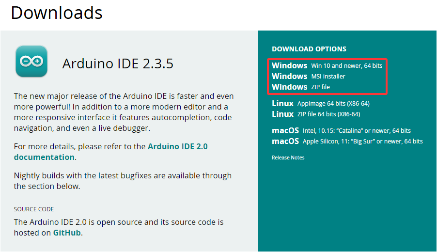

这里我们以Windows系统的为例给大家介绍下载和安装的步骤。Windows系统的也有两个版本，一个版本是安装版的，一个是下载版的不用安装，直接下载文件到电脑，解压缩就可以用了。


一般情况下，我们点击`JUST DOWNLOAD`就可以下载了，当然，如果你愿意，你可以选择小小的赞助一下，以帮助伟大的Arduino 开源事业。

### **1.2.2 Mac 系统下载**

我们先到Arduino官方的网站：[Software | Arduino](https://www.arduino.cc/en/software/)

不同的系统，需要下载不同的Arduino IDE，下载方式和Windows类似。选择如下图。

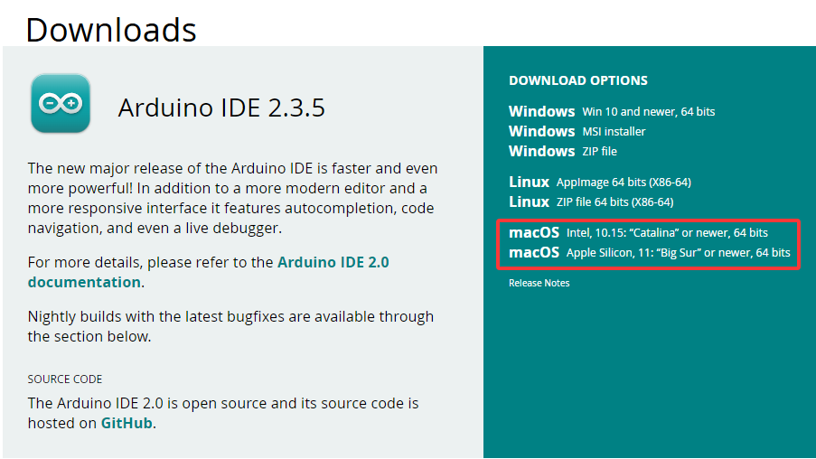

下载完成后直接双击，然后按照提示进行安装。

### **1.2.3 详细安装步骤：**

**Windows 系统**

1.保存从软件页面下载的.exe文件到硬盘驱动器，然后简单地运行该文件.

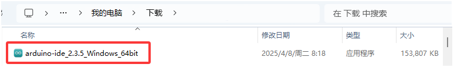

2.阅读许可协议并同意.


3.选择安装选项.


4.选择安装位置.

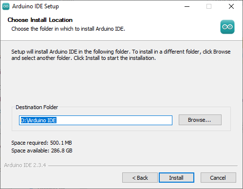

5.单击 "Finish" 并运行Arduino IDE

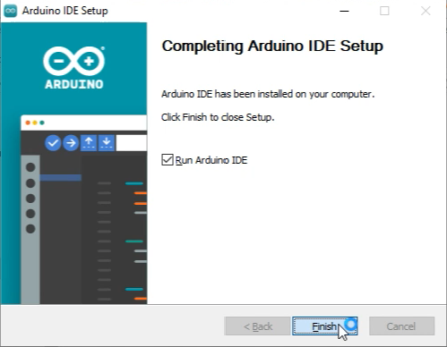

**Mac 系统**

双击下载的 <span style="color: rgb(255, 76, 65); font-size: 15px;">arduino_ide_xxxx.dmg</span> 文件并按照说明将 **Arduino IDE.app** 复制到 **Applications** 文件夹，几秒钟后您将看到 Arduino IDE 安装成功


**Linux 系统:**

关于在 Linux 系统上安装 Arduino IDE 2.3.3 的教程，请参考：[https://docs.arduino.cc/software/ide-v2/tutorials/getting-started/ide-v2-downloading-and-installing/#linux](https://docs.arduino.cc/software/ide-v2/tutorials/getting-started/ide-v2-downloading-and-installing/#linux)

## 1.3 安装USB驱动

注意：安装USB驱动时一定要把ESP32开发板通过USB数据线连接到电脑，否则将安装不成功。


### 1.3.1 Windows系统

资料下载后解压，Windows CH340驱动的获取方式，在以下路径中找到CH340驱动文件。

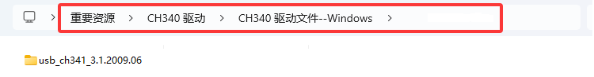

windows 10及更高版本系统都是有自带驱动的，如果你是Windows 10或更高版本的系统可以进行查看

将控制板连接电脑时，点击 “**计算机**”--“**属性**”--“**设备管理器**”。如图，已经连接成功了就不需要再安装驱动了。

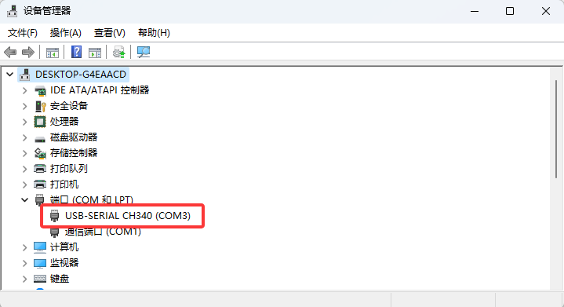

如果是这样的就需要手动安装驱动了。

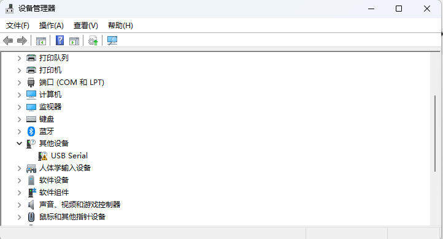

选择后右击，然后单击 “**更新驱动程序**”，开始安装驱动，如下图。

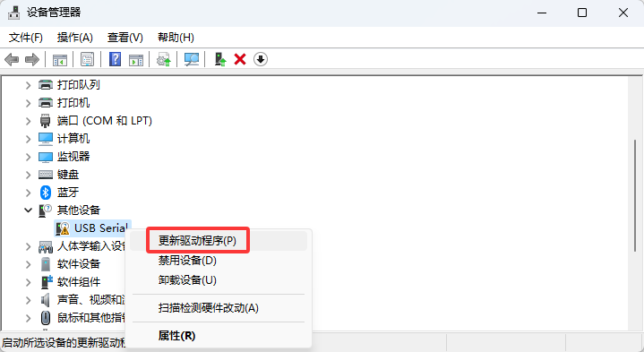

进入下图，选择浏览我的电脑以查找驱动程序。

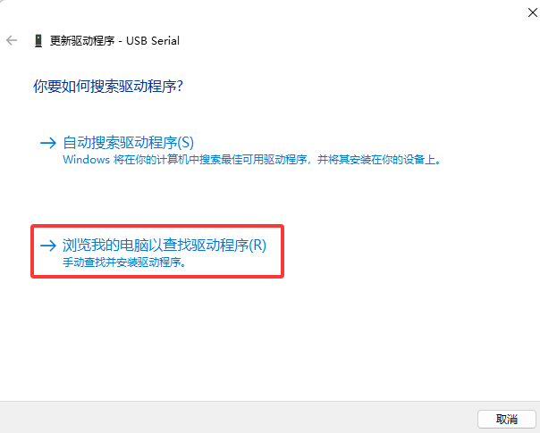

单击 “**浏览**”按钮，在电脑中找到下载好的驱动文件夹`usb_ch341_3.1.2009.06`，然后单击 “**确定**”，最后单击 “**下一步**”。

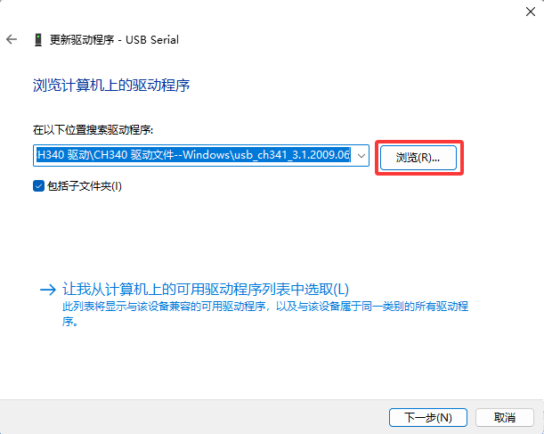

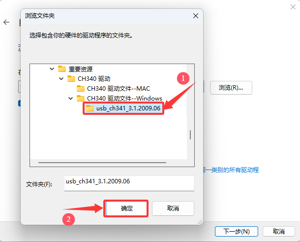

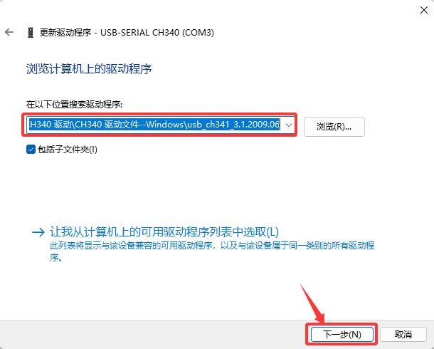

安装驱动完成，出现下图，则单击“**关闭**”按钮，之后就会出现串口号了。

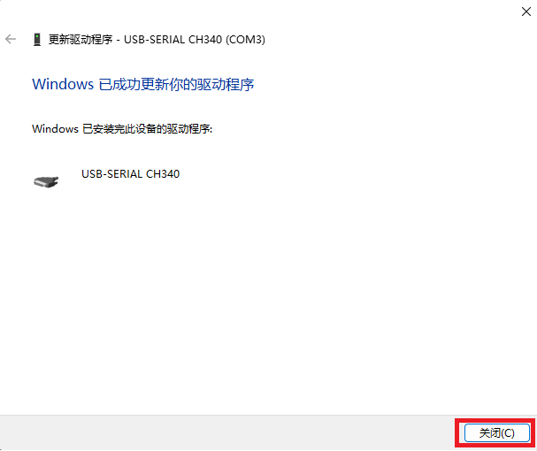

这样驱动就装好了。点击计算机--属性--设备管理器，我们可看见如下图。


### 1.3.2 MAC系统

**步骤 1:** 资料下载后解压，在以下路径中找到CH340驱动文件。


**步骤 2:** 安装.dmg驱动，点击“**.dmg文件**”，拖拽 “**CH34xVCPDriver**”进入操作系统的应用文件夹。


打开 “**LaunchPad**” → “**CH34xVCPDriver**” → “**安装**”。

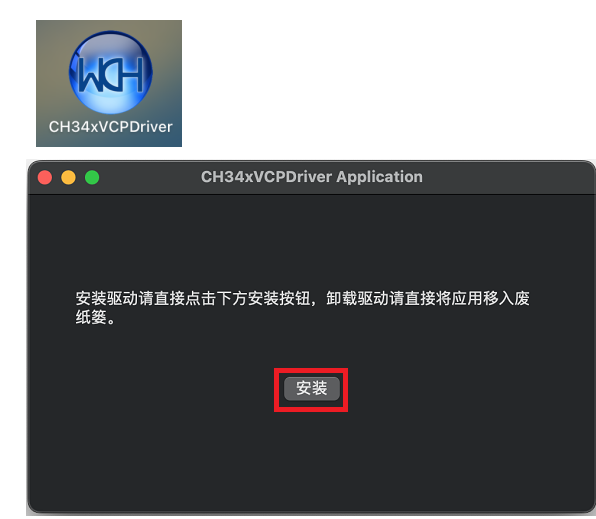

然后安装将成功。


将CH340主控板插入USB接口时，请打开 “**关于本机->系统报告->硬件->USB**” 。右侧为 “**USB设备树**” 。如果USB设备工作正常，您将发现其 “**供应商ID**” 为[0x1a86]的设备。

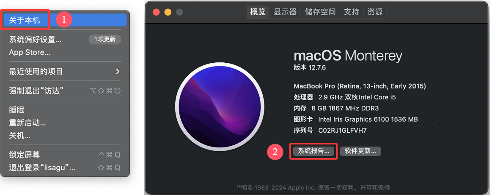

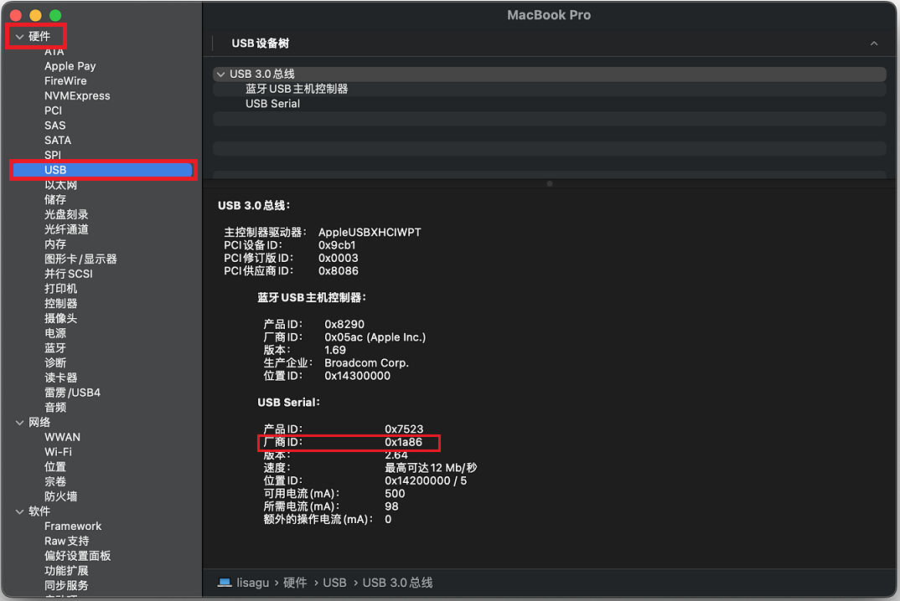

打开 “**应用程序-实用程序**” 文件夹下的 “**终端**” 程序，键入命令 “ls /dev/tty*” .


你应该看到 “**tty.wchusbserialx**”，其中“x”是分配的设备号，类似于Windows COM端口分配.

## 1.4 设置arduino IDE语言

1.首先打开Arduino IDE.

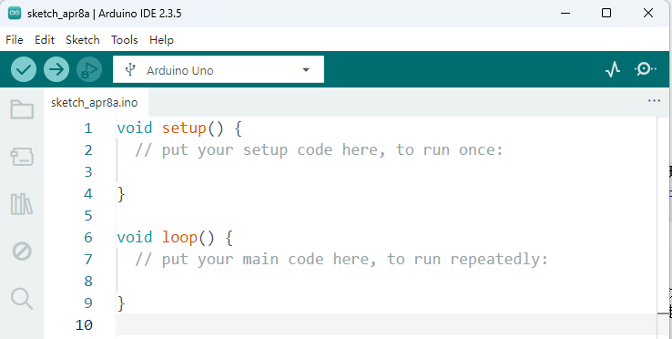

2.点击“**File** ——>**Preferences...**”，在**Preferences**对话框中，单击 “**English**” 按钮选择 “**中文(简体)**”，然后单击 “**OK**”.

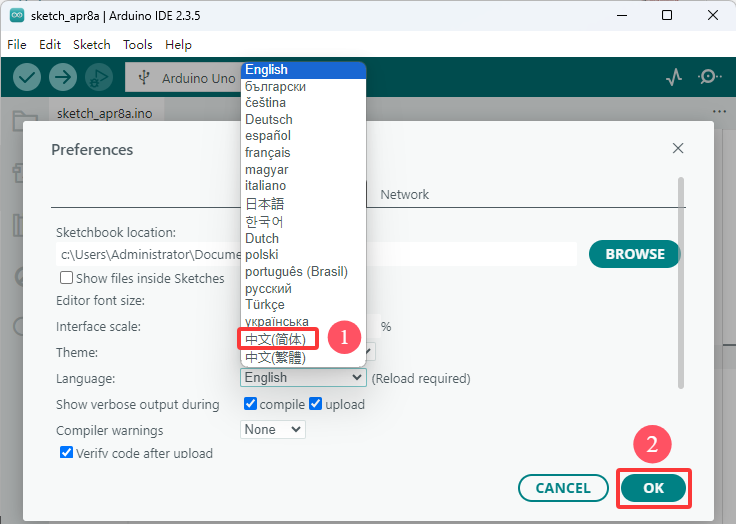

3.这样，arduino IDE的语言切换完成了。这样，arduino IDE语言为中文。


## 1.5 安装ESP32 开发板

我们发现在arduino IDE “**工具**”下的 “**开发板**” 中找不到ESP32开发板的选项，这是因为我们没有添加ESP32开发板，接下来我们一起来为Arduino IDE添加ESP32开发板吧!

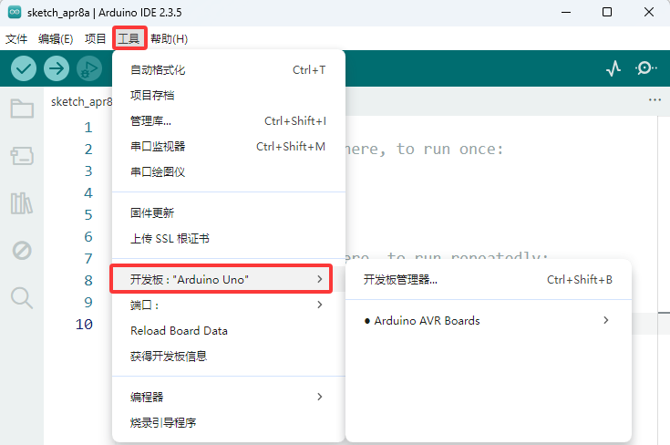

**安装ESP32开发板步骤如下：**

1.首先打开Arduino IDE.

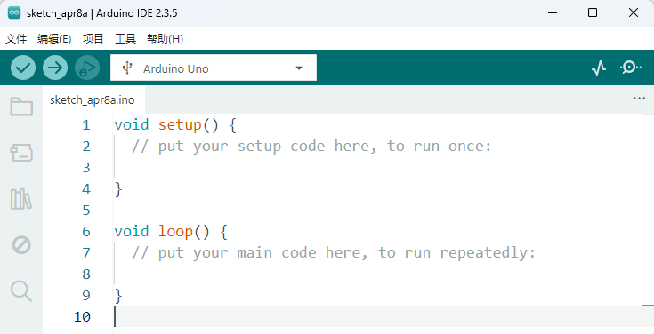

2.点击“**文件** ——>**首选项...**”，在**其他开发板管理器地址**中，添加ESP32开发板链接：`https://espressif.github.io/arduino-esp32/package_esp32_index.json` ，然后单击 “**确定**”.

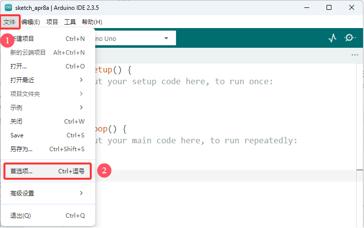

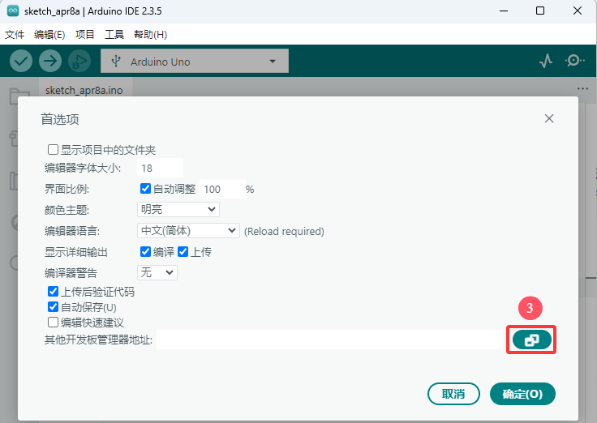

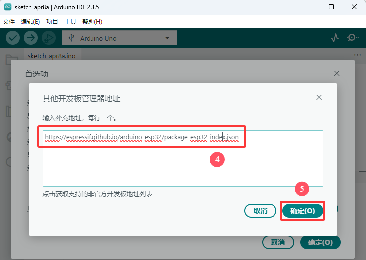

3.再点击 “**确定**”。

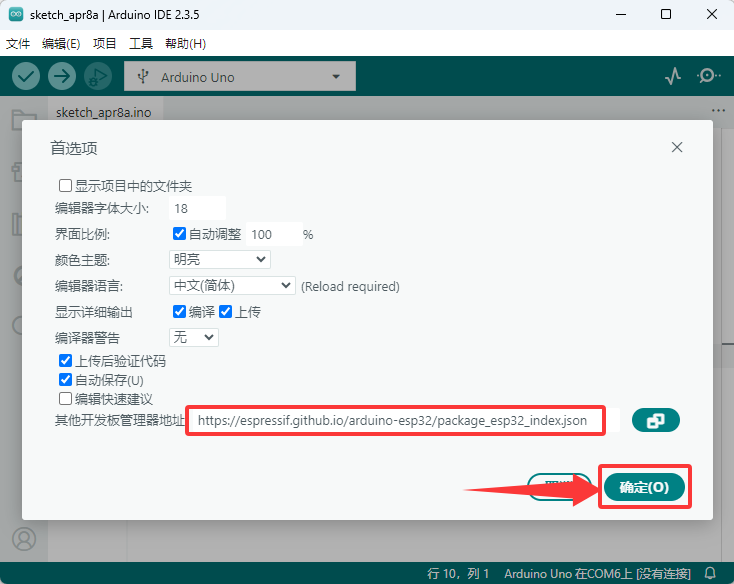

4.点击左边的开发板小图标，打开开发板选项。

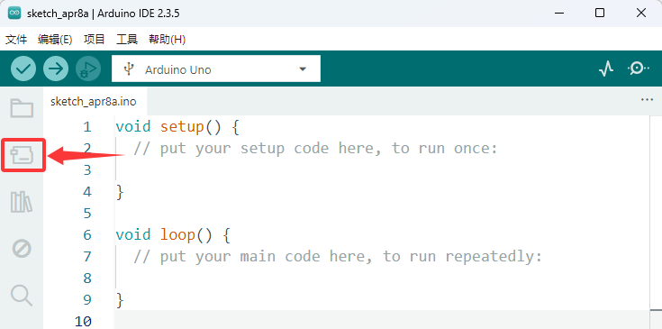

5.在开发板搜索框中，搜索 “**ESP32**”，点击安装最新版本，右下角可以看到开发板安装进度，等待几分钟安装完成。**安装过程中请保持网络稳定，如安装失败，请重复以上步骤，重新安装开发板即可。**

<span style="color:red;font-size:20px;">注意：本教程使用的是ESP32 3.1.3版本制作的请保持一致，以免出现代码不兼容情况。</span>

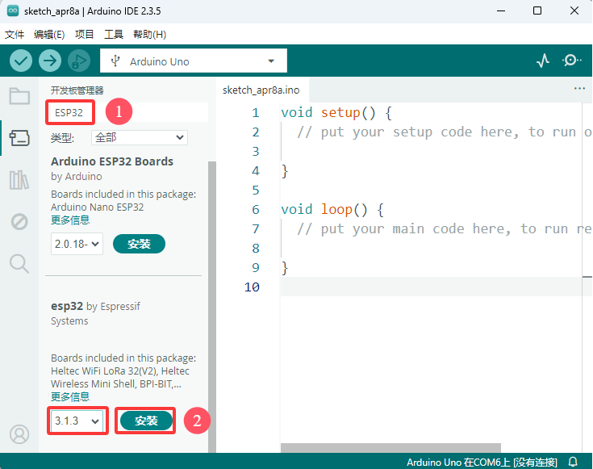

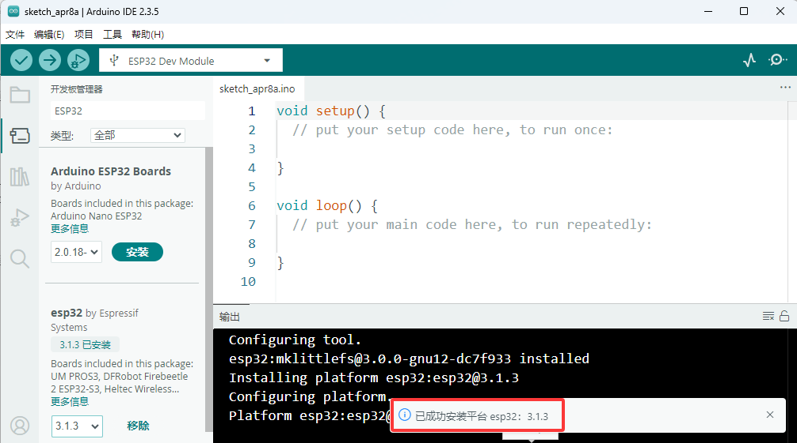

安装成功如图：

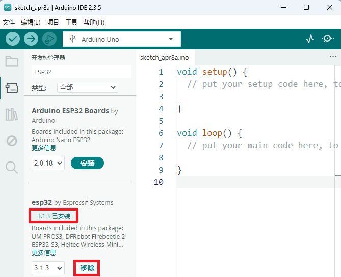

假如，由于网络问题实在是下载安装不了ESP32开发板，我们也提供有ESP32开发板的压缩包，**ESP32开发板的压缩包下载地址：** [https://pan.baidu.com/s/10mfU2_aNru2dizP0vAFXlw?pwd=95ih](https://pan.baidu.com/s/10mfU2_aNru2dizP0vAFXlw?pwd=95ih) 

**提取码：95ih**

压缩包下载后解压，把解压后的ESP32开发板文件夹按照以下路径添加。ESP32开发板一般需要存放于以下路径，才能说明ESP32开发板安装好。

- Windows 系统：路径为C:\Users\你的用户名\AppData\Local\Arduino15\packages 。其中，AppData 是一个隐藏文件夹，你需要在文件夹选项中开启 “显示隐藏的文件、文件夹和驱动器” 才能看到。
- macOS 系统：位于~/Library/Arduino15/packages。Library 也是一个隐藏文件夹，你可以通过在 “**访达**” 中使用快捷键Command + Shift + G ，然后输入该路径来访问。
- Linux 系统：存于~/.arduino15/packages 。

## 1.6 Arduino IDE使用

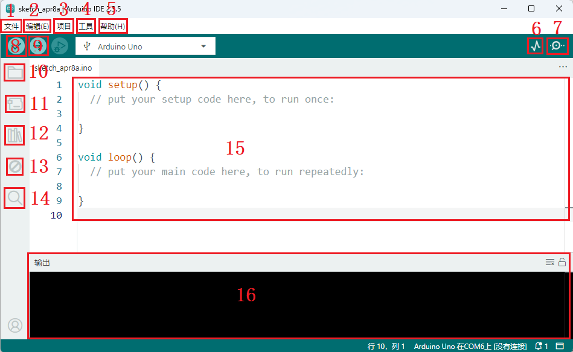

1. “文件”：列表里面的功能有新建项目，打开程序，打开最近使用的代码，打开示例代码，关闭IDE，保存代码，首选项，高级设置等。

2. “编辑”：列表里面的功能有复制，粘贴，自动格式化，字体大小等这个一般都是使用快捷键进行操作。（建议坚持使用快捷键，接触多了就水到渠成了）。

3. “项目”：列明里面的常用功能有验证\编译代码，上传代码，导入库等。

4. “工具”：列表里面的常用功能有开发板选择，端口选择，这两个很重要。

5. “帮助”：点击这个可以查看IDE版本已经官方的参考文件。

6. “串口绘图仪”：它会将串口的数据以折线图的样式显示出来。

7. “串口监视器”：可以将我们需要查看的数据在这里进行打印显示。

8. 验证程序按钮。

9. 验证并上传程序按钮。

10. “项目文件夹”：可以新建项目，还可以只有arduino Cloud进行同步和编辑。

11. “开发板管理器”：可以添加或删除开发板。

12. “库管理”：就要添加和删除库。

13. “调试”：可以对代码进行监视与断点调试。

14. 搜索框。

15. 代码编辑区。

16. IDE提示区（上传代码报错或成功）和串口监视器显示区

## 1.7 使用Arduino IDE上传第一个程序

先将开发板通过USB线连接到电脑。


打开Arduino IDE 选择对应的ESP32开发板型号。

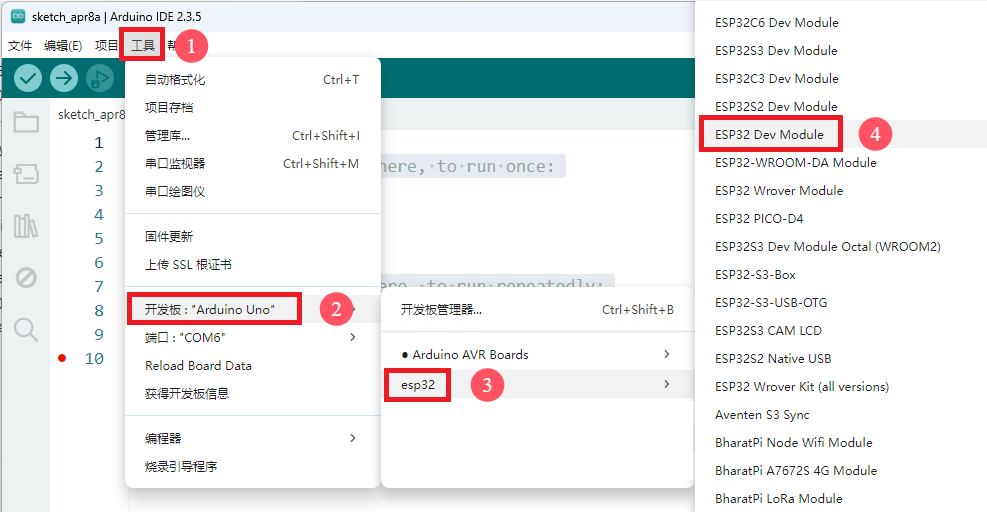

选好开发板后，选择开发板的COM口，开发板安装完驱动后会显示一个COM端口，如何你不知道你是哪个，可以进入你电脑的设备管理器中进行查看，如下图：（如果你有很多COM端口你不知道是哪个就可以拔掉开发板看哪个消失了，然后再插上开发板消失的COM口又会显示出来，如果没有COM就请检查是否有安装开发板驱动）


从图中可知我们的COM端口是COM3，我们在 “**工具**” 列表中选择 “**端口**” 然后选择 “COM3”。

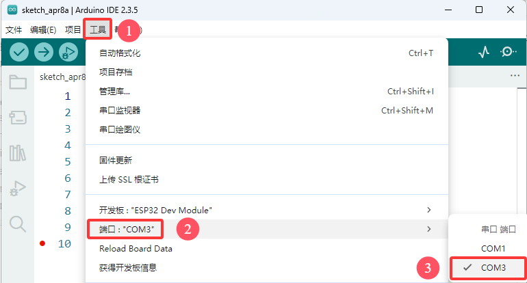

连接上开发板后，这两个地方都会显示已连接的标志，然后添加代码：这里我们提供一个示例代码，代码功能是在串口监视器中每隔一秒钟打印一次“Hello Keyes!”

将下面的代码复制粘贴到arduino IDE的代码区

```c
/*
  keyes 
  打印 “Hello Keyes!”
  http://www.keyesrobot.com
*/
void setup() {  
    // 把你的设置代码放在这里，运行一次:
    Serial.begin(9600);  //设置串口波特率为9600
}

void loop() {  
    // 将主代码放在这里，以便重复运行:
    Serial.println("Hello Keyes!");  //串口打印
 	delay(1000);  //延迟1秒
}
```

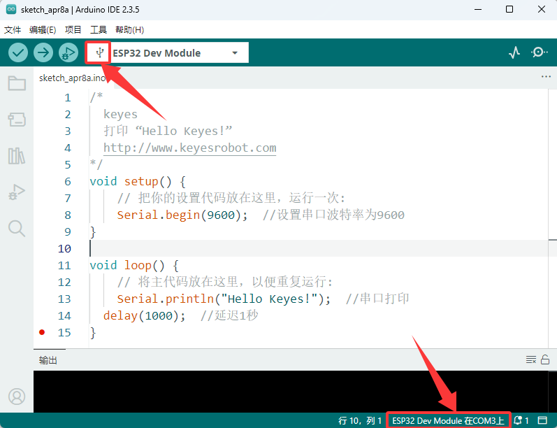

然后我们点击编译并上传代码，上传成功后IDE也会有两个提示，如图：

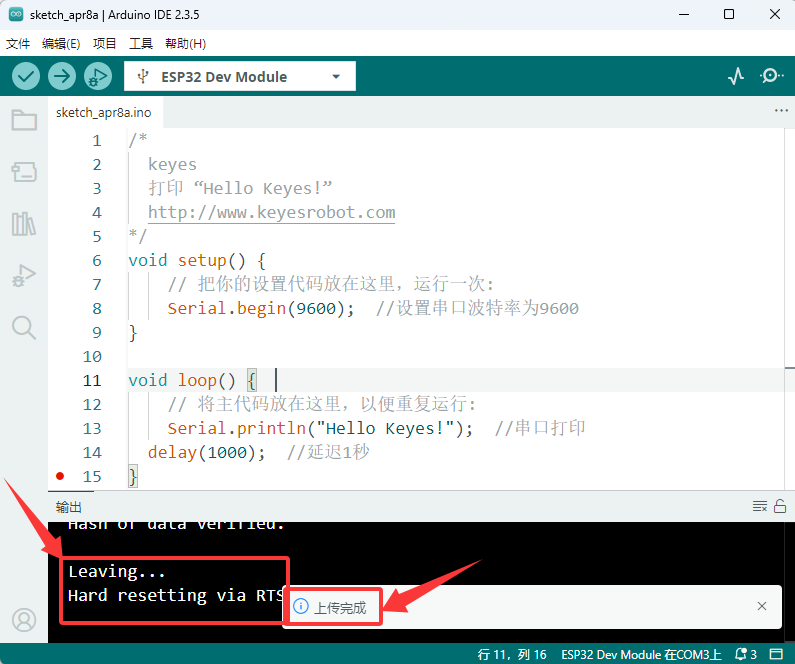

然后我们点击“串口监视器”图标便能打开串口监视器，然后设置波特率为**9600**，就能看到串口打印字符串 “**Hello Keyes!**”

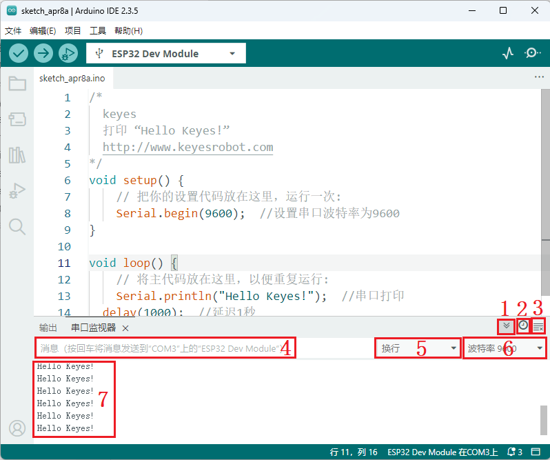

1. “切换自动滚动”：设置打印窗口是否跟随打印.
2. “切换时间戳 ”：设置是否显示打印时间。
3. “清除输出 /清空输出”：清除打印窗口中的数据。
4. 串口输入框。
5. 串口发送格式。
6. 设置波特率，点击即可选择需要的波特率。
7. 打印窗口。

至此上传代码教程结束了，请退回主教程学习如何给Arduino IDE添加库文件，如果没有添加库文件IDE会报错。

# 2. 给Arduino IDE安装库文件

## 2.1 什么是库文件

库是代码的集合，使您可以轻松地连接到传感器、显示器、模块等。

例如：LiquidCrystal_I2C库使LCD1602显示变得容易，Internet上有数百个其他库可供下载。参考中列出了内置库和手动添加的库。 

在编译代码或上传代码时如果出现报错“No such file or directory”那就是缺少库文件，如下图就是上传LCD1602模块代码时因为缺少了LiquidCrystal_I2C库文件的报错。


## 2.2 如何安装库文件

我们以添加LiquidCrystal_I2C库文件为例。

在这里，我们将为您介绍最简单的添加库的方法。首先，依次点击右上角的 “**项目” > “导入库” > “添加 .Zip 库...”**

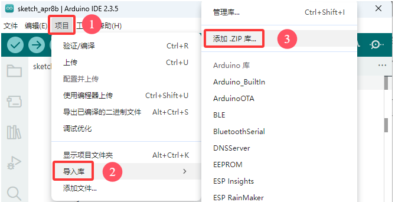

再选择文件中，找到自己需要的库压缩包.zip格式，点击确定即可添加成功，添加成功后消息栏会显示“**Library installed**”。

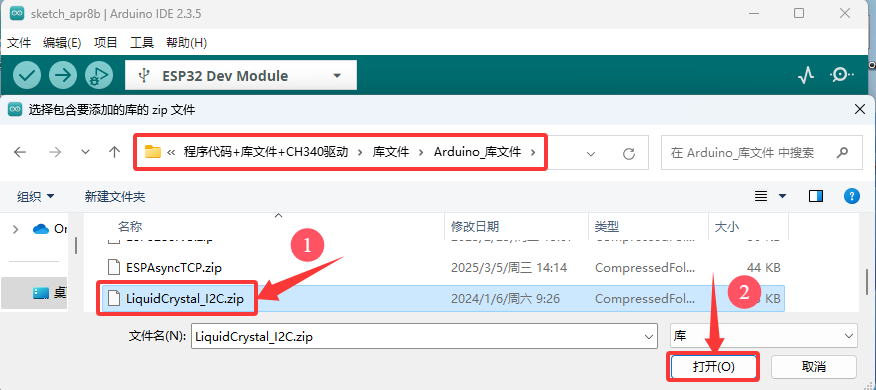

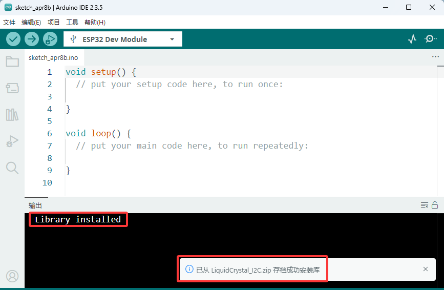

MAC 系统 和 Windows 系统添加方法一致。

# 3. Arduino C基础代码介绍

## 3.1 Arduino IDE 的开发语言

Arduino使用C/C++编写程序，虽然C++兼容C语言，但这是两种语言，C语言是一种面向过程的编程语言，C++是一种面向对象的编程语言。早期的Arduino核心库使用C语言编写，后来引进了面向对象的思想，目前最新的Arduino核心库采用C与C++混合编写而成。

通常所说的Arduino语言，就是指Arduino核心库提供的各种API的集合。这些API是对更底层的单片机支持库进行二次封装所形成的（玩过单片机的人估计都是经常和各种寄存器打交道）。Arduino提供的API可以让初学者不用理会单片机复杂寄存器配置，然后就能直观控制Arduino，提高开发效率。

## 3.2 程序结构

arduino包括两个主要函数：

`void setup(){}` 当代码开始运行时，将调用setup（）函数。使用它来初始化变量、引脚模式、开始使用库等。setup（）函数只会在Arduino板每次通电或重置后运行一次。 

`void loop(){}` 相当于死循环while(1){}。 当然，可以自定义函数，并在以上两个函数中被调用。注意，setup函数和loop函数是必不可少的，否则会报错。

## 3.3 基础语句

### 3.3.1 delay(value) ;

delay() 延时函数，用于程序中需要等待的地方  语句： `delay(value)`

**value**： 延时时间数值(单位是ms)， 1S = 1000mS  ， 1mS = 1000 uS ，一般我们使用的mS

### 3.3.2 digitalWrite(Pin,State);

digitalWrite() 函数用于控制指定引脚输出高电平（HIGH）或低电平（LOW） 语句：`digitalWrite(pin, value)`

- **pin**： the Arduino pin number
- **value**：HIGH or LOW

### 3.3.3 digitalRead(Pin)

digitalRead(Pin);用于读取数字引脚的TTL电平，高电平（1），低电平（0） 语句：`digitalRead(Pin);`

**Pin:**需要读取的数字引脚

### 3.3.4 analogWrite(Pin,Vlaue)

analogWrite() 函数将模拟值（PWM波）输出。可用于以不同的亮度点亮LED或以不同的速度驱动电机。在调用analogWrite（）后，该引脚将生成指定占空比的稳定矩形波，直到下一次在同一引脚上调用analogWrite（）（或调用digitalRead（）或digitalWrite（））。 语句：`analogWrite(pin, value)`

- **pin:** the Arduino pin to write to. Allowed data types:int
- **value:** the duty cycle: between 0 (always off) and 255 (always on). Allowed data types:int

### 3.3.5 analogRead(Pin)

前面我们学了读取数字信号的函数，而analogRead(); 是读取模拟信号的函数,ESP32模拟值范围是0-4095  语句： `analogRead(Pin);`

**Pin:**读取模拟值的引脚号

### 3.3.6 pinMode(Pin,mode)

pinMode() 用于将指定的引脚设置成输入或输出或上拉  语法；`pinMode(pin, mode)`

- **pin**: the Arduino pin number to set the mode of.
- **mode**:INPUT,OUTPUT, orINPUT_PULLUP

### 3.3.7 if(){...}else{}

if() 用于判断条件是否满足如果条件满足则执行 “{ }”中的代码，如果条件不满足则不执行

else 是否则的条件，当if的判断表达式不成立时则执行else “{ }”中的代码

### 3.3.8 for()

`for`语句是一种基本的循环控制结构，它允许你重复执行一段代码块固定的次数。`for`语句特别适用于已知循环次数的场景。

`for`语句的基本结构

```c
for (初始化表达式; 条件表达式; 迭代表达式) {  
    // 循环体：要重复执行的代码块  
}
```

- **初始化表达式**：在循环开始前执行，通常用于初始化一个或多个循环控制变量。
- **条件表达式**：在每次循环迭代前检查。如果条件为真（非零），则执行循环体；如果为假（零），则退出循环。
- **迭代表达式**：在每次循环迭代结束时执行，通常用于更新循环控制变量。


①：设置循环初始值，只是执行一遍，执行后进入②

②： 判断是否瞒住循环条件，如图中`i <= 255`则是i小于等于255就能进入循环代码③中

③： 循环代码，将需要循环的代码放到这里，如我们这个代码是需要控制pwm值从0到255所以我们只需将i的值当初pwm值即可然后进入④

④： i++ 是i在原来的值上再加一的操作等于 i = i +1 （i- -则是等效 i = i - 1），执行完后进入⑤

⑤： i的值加一（或减一）后接着判断i的值是否小于等于255，如果是则继续进入循环代码③，如果不是则退出for循环

### 3.3.9 while(condition){…}

while循环将连续无限循环，直到括号（）内的表达式变为false。必须更改测试变量，否则while循环将永远不会退出。这可能是在你的代码中，比如一个递增的变量，也可能是一个外部条件，比如测试传感器。

### 3.3.10 “>,<,<=,>=,==,!=”比较运算符

请注意，您可能会比较不同数据类型的变量，但这可能会产生不可预测的结果，因此建议比较相同数据类型（包括有符号/无符号类型）的变量。

(1): `>`将左侧的变量与运算符右侧的值或变量进行比较。当左侧的操作数大于右侧的操作数时，返回true，否则返回false。

​	语法：

```c++
x > y; // is true if x is bigger than y and it is false if x is equal or smaller than y
```

(2): `>=`将左侧的变量与运算符右侧的值或变量进行比较。当左侧的操作数大于或等于右侧的操作数时，返回true，否则返回false。

语法：

```c++
x >= y; // is true if x is bigger than or equal to y and it is false if x is smaller than y
```

(3): `<`将左侧的变量与运算符右侧的值或变量进行比较。当左侧的操作数小于右侧的操作数时，返回true，否则返回false。

语法：

```c++
x < y; // is true if x is smaller than y and it is false if x is equal or bigger than y
```

(4): `<=`将左侧的变量与运算符右侧的值或变量进行比较。当左侧的操作数小于或等于右侧的操作数时，返回true，否则返回false。

语法：

```c++
x <= y; // is true if x is smaller than or equal to y and it is false if x is greater than y
```

(5): `==`将左侧的变量与运算符右侧的值或变量进行比较。当两个操作数相等时，返回true，否则返回false。(注意判断两个值是否相等是“==”)

语法：

```c++
x == y; // is true if x is equal to y and it is false if x is not equal to y
```

(6): `!=`将左侧的变量与运算符右侧的值或变量进行比较。当两个操作数不相等时，返回true，否则返回false。

语法：

```c++
x != y; // is false if x is equal to y and it is true if x is not equal to y
```

### 3.3.11 “+,-,*,/,%,=”算数运算符

(1):  `+`加法是四种主要算术运算之一。运算符+（加号）对两个操作数进行运算以产生总和。

​	语法：`sum = operand1 + operand2;`

(2):  `-`减法是四种主要算术运算之一。运算符-（减号）对两个操作数进行运算，以产生第二个操作数与第一个操作数的差值。

​	语法：`difference = operand1 - operand2;`

(3):  `*`乘法是四种主要算术运算之一。运算符“*”（星号）对两个操作数进行运算以产生乘积。

​	语法：`product = operand1 * operand2;`

(4):  `/`除法是四种主要算术运算之一。运算符“/”（斜线）对两个操作数进行操作以产生结果。

​	语法：`result = numerator / denominator;`

(5): `%`余数运算计算一个整数除以另一个整数时的余数。它有助于将变量保持在特定范围内（例如数组的大小）。“%”（百分比）符号用于执行余数运算。

​	 语法：`remainder = dividend % divisor;`

(6): `=`在C++编程语言中，单个等号“=”被称为赋值运算符。它与代数课中表示方程或等式的意义不同。赋值运算符告诉微控制器评估等号右侧的任何值或表达式，并将其存储在等号左侧的变量中。

示例：

```c++
int sensVal;              // declare an integer variable named sensVal
    sensVal = analogRead(0);  // store the (digitized) input voltage at analog pin 0 in SensVal
```

### 3.3.12 “||,&&，!”布尔运算符

(1): `||`如果两个操作数中的任何一个为真，则逻辑OR的结果为真。

​	示例：

```c++
if (x > 0 || y > 0) { // if either x or y is greater than zero
      // statements
    }
```

(2): `&&`只有当两个操作数都为真时，逻辑AND的结果才为真。

​	示例：

```c++
if (digitalRead(2) == HIGH && digitalRead(3) == HIGH) { // if BOTH the switches read HIGH
      // statements
    }
```

### 3.3.13 #include

#include用于在草图中包含外部库。这使程序员可以访问大量标准C库（预制函数组），以及专门为Arduino编写的库。

​	语法：`#include <LibraryFile.h>` 或 `#include "LocalFile.h"`

### 3.3.14 #define

 #define 用于设置常量（值不变得量叫常量）  语法：`#define constantName value`

- **constantName:** the name of the macro to define
- **value:** the value to assign to the macro

### 3.3.15 Serial.begin(9600)

Serial.begin(9600);设置串口波特率，只有设置了串口波特率并且与串口打印工具保持一样的波特率才能进行串口打印。一般常用9600与115200

### 3.3.16 Serial.print()

Serial.print(); 串口不换行打印函数，打印时执行将变量或者需要打印的字符输入到括号中（打印字符需要放到双引号中）

### 3.3.17 Serial.println()

Serial.println(); 串口换行打印函数，打印时执行将变量或者需要打印的字符输入到括号中（打印字符需要放到双引号中）

### 3.3.18 int

`int` 用于声明整形变量，如`int i = 0;`就是声明了一个整形的变量，变量名为i值为0；整形可以理解成整数的意思

### 3.3.19 char

`char` 用于声明字符变量，如`char ch = ‘A’`就是声明了一个字符变量，变量名为ch值为‘A’

更多详细解释请参考官方链接：[Language Reference | Arduino Documentation](https://docs.arduino.cc/language-reference/#variables)


# 4. 基础教程

## 4.1 点亮LED灯

### 4.1.1 简介

本教程将引导您一步步学习如何点亮LED灯，涵盖从基础电路知识到实际操作的全过程。您将了解LED的工作原理、所需元件（如线材、电源等）以及如何正确连接电路。通过教程您将学会如何搭建简单电路并使用开发板点亮LED。无论您是电子初学者还是爱好者，本教程都将为您提供实用且易于理解的指导，助您快速掌握点亮LED的基本技能。

### 4.1.2 元件知识


**LED：**

LED灯的工作原理是基于半导体的光电效应。具体来说，LED是一个半导体的晶片，由P型半导体和N型半导体组成，它们之间形成一个P-N结。当电流通过导线作用于这个晶片时，电子从N区注入P区，空穴从P区注入N区，这些注入的少数载流子（电子和空穴）在P-N结附近复合，复合过程中能量以光子的形式释放出来，从而产生光。

不同材料的LED芯片能发出不同颜色的光，例如，氮化镓（GaN）类半导体材料常用于制作蓝色LED。通过调整LED芯片的材料和封装工艺，可以实现不同颜色的发光，如白色、暖白色、彩色等

LED就是将电能转换成光能的元件，当电流通过LED时，它会发光。

**各式各样的LED：**


**LED模块:** 是一种用于输出的设备，用于控制LED灯的亮度和闪烁，可以直接插入开发板的数字输出引脚上使用。


**原理图：** 当S处为高电平时，Q1三极管导通，电流通过LED（LED两端有一定的电压），LED此时会亮起来，反之相反。

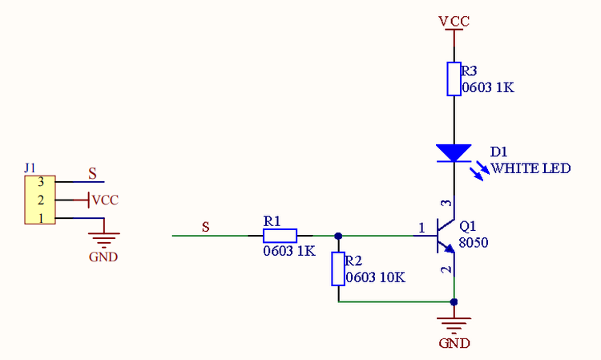

**参数：**

- 工作电压: DC 3.3V~5V
- 工作电流: (Max)1.5mA@5V
- 最大功率: 0.0075W

### 4.1.3 接线图

**模块连接到io27**

**⚠️注意：使用连接线连接时，黄色线为S信号线，红色线为V电源线，黑色线为GND，颜色一一对应，请勿插反！**

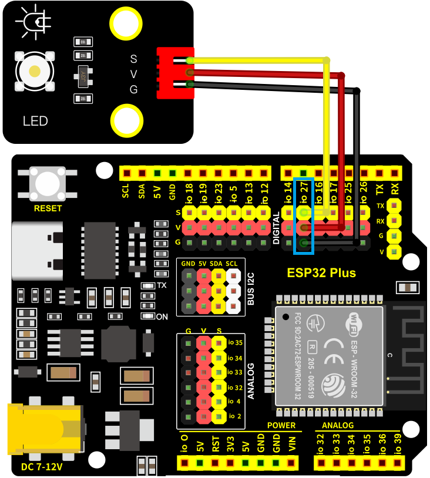

### 4.1.4 实验代码

代码文件在`Arduino_代码`文件夹中（<u>路径：重要资源\程序代码\Arduino_代码</u>），代码文件为`4_1_LED_Blinking`，如图：

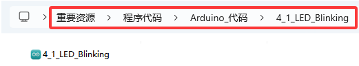

鼠标双击`4_1_LED_Blinking.ino`即可在Arduino IDE中打开。

```c++
/*
 * 文件名 : 4_1_LED_Blinking
 * 功能   : 让led灯闪烁.
 * 编译IDE：ARDUINO 2.3.5
 * 作者   : https://www.keyesrobot.cn/
*/

const int LED_Pin = 27; //定义LED的GPIO引脚

void setup() {
// 初始化数字引脚LED_Pin作为输出模式。
  pinMode(LED_Pin, OUTPUT);
}

void loop() {
  digitalWrite(LED_Pin, HIGH);  // 打开LED （HIGH是高电平）
  delay(1000);                      // 等待1秒
  digitalWrite(LED_Pin, LOW);   // 通过使电压低来关闭LED
  delay(1000);                      //等待1秒
}
```

### 4.1.5 实验结果

按照接线图接好线，选择好正确的开发板板型（ESP32 Dev Module）和 适当的串口端口（COMxx），然后单击按钮上传代码。上传代码成功后，可以看到LED每隔一秒闪烁，这是因为ESP32开发板的io27，每隔一秒输出高电平和低电平。通过LED模块，我们可以实现各种有趣的互动式应用，例如呼吸灯效果、流水灯效果、警灯效果等等。（如果你对上传代码存在疑惑，请查看教程的`1.7 使用Arduino IDE上传第一个程序`）

| 电平 | 功能  |
| :--: | :---: |
| HIGH | LED亮 |
| LOW  | LED灭 |


### 4.1.6 代码说明

（1）.声明一个名为 `LED_Pin` 并为其分配数字引脚 `IO27`。

```c
const int LED_Pin = 27; // 定义LED的GPIO引脚.
```
- `const int` → 声明一个**固定值**的整型变量（运行中不可修改）
- `LED_Pin` → 变量名，代表**LED的引脚**
- `=` → 赋值运算符，将右侧的值赋给左侧的变量。官方介绍：[(assignment operator) | Arduino Documentation](https://docs.arduino.cc/language-reference/en/structure/arithmetic-operators/assignment/)

- `27` → 指定控制LED的物理引脚是 **GPIO27**

（2）.`void setup(){}` 当代码开始运行时，将调用setup（）函数。使用它来初始化变量、引脚模式、开始使用库等。setup（）函数只会在ESP32板每次通电或重置后运行一次。 

```c
void setup(){
    ...
}
```

- 官方介绍：[setup() | Arduino Documentation](https://docs.arduino.cc/language-reference/en/structure/sketch/setup/)

（3）.设置LED数字引脚的工作模式。

```c
// 初始化数字引脚LED_Pin作为输出模式。
  pinMode(LED_Pin, OUTPUT);
```

- `pinMode()` → Arduino专用函数，用于设置引脚工作模式
- `LED_Pin` → 要设置的引脚（之前定义的GPIO27）
- `OUTPUT` → 设置为输出模式（可控制电压高低）

- 官方介绍：[pinMode() | Arduino Documentation](https://docs.arduino.cc/language-reference/en/functions/digital-io/pinMode/)

（4）.`void loop(){}` 相当于死循环while(1){}。 自定义的函数就是在`setup（）`，`loop（）`函数中被调用。注意，setup函数和loop函数是必不可少的，否则会报错。

```c
void loop(){
    ...
}
```

- 官方介绍：[loop() | Arduino Documentation](https://docs.arduino.cc/language-reference/en/structure/sketch/loop/)

（5）.设置LED数字引脚高电平，使LED点亮。

```c
digitalWrite(LED_Pin, HIGH); // 打开LED （HIGH是高电平） .
```

- `digitalWrite()` → Arduino输出数字信号函数
- `LED_Pin` → 要控制的LED引脚
- `HIGH` → 输出高电平（通常3.3V/5V）

- 官方介绍：[digitalWrite() | Arduino Documentation](https://docs.arduino.cc/language-reference/en/functions/digital-io/digitalwrite/)

（6）.延时

```c
delay(1000);   // 等待1秒
```

- `delay()` → Arduino延时函数
- `1000` → 毫秒数（1000ms=1s）
- 期间CPU空转等待

（7）.设置LED数字引脚低电平，使LED不亮。

```c
digitalWrite(LED_Pin, LOW);   // 通过使电压低来关闭LED.
```

- `digitalWrite()` → Arduino数字输出函数
- `LED_Pin` → 要控制的LED引脚（GPIO27）
- `LOW` → 输出低电平（0V）

---------------

## 4.2 LED灯调节亮度

### 4.2.1 简介

本课程将引导您深入了解如何利用脉宽调制（PWM）技术来调节LED灯的亮度。PWM是一种通过快速切换电源来改变LED亮度的高效方法，它通过调整信号的占空比来控制LED的平均电流，从而实现亮度的无级调节。课程内容包括PWM原理、电路设计、编程实现及实际应用案例，旨在帮助学员掌握LED亮度控制的核心技术，并能够应用于各种电子项目中。

### 4.2.2 PWM原理

脉宽调制(PWM)是一种利用数字信号控制模拟电路的有效方法。普通处理器不能直接输出模拟信号。PWM技术使这种转换(将数字信号转换为模拟信号)非常方便。PWM技术利用数字引脚发送一定频率的方波，即高电平和低电平的输出，交替持续一段时间。每一组高电平和低电平的总时间一般是固定的，称为周期(注:周期的倒数是频率)。高电平输出的时间通常称为脉宽，占空比是脉宽(PW)与波形总周期(T)之比的百分比。高电平输出持续时间越长，占空比越长，模拟信号中相应的电压也就越高。下图显示了对应于脉冲宽度0%-100%的模拟信号电压在0V-3.3V(高电平为3.3V)之间的变化情况.


脉宽调制有许多应用，如灯亮度调节，电机调速，声音制造等。以下是PMW的三个基本参数。

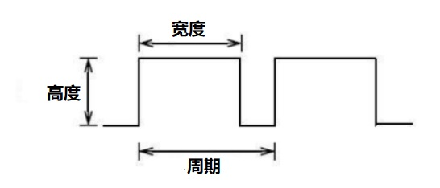

1\. 占空比：信号在某一时间段内处于高水平时，占时间的百分比。

2\. 脉冲周期(一秒内脉冲频率的倒数)

3\. 在ESP32上，LEDC(PWM)控制器有16个独立通道，每个通道可以独立控制频率，占空比，甚至精度。

PWM占空比越长，输出功率越高。既然我们了解了这种关系，我们就可以用PWM来控制LED的亮度或直流电机的速度等等。从上面可以看出，PWM并不是真实的模拟信号，电压的有效值等于相应的模拟信号。因此，我们可以控制LED和其他输出模块的输出功率，以达到不同的效果。

**ESP32 与 PWM**

在ESP32上，LEDC(PWM)控制器有16个独立通道，每个通道可以独立控制频率，占空比，甚至精度。与传统的PWM引脚不同，ESP32的PWM输出引脚是可配置的，每个通道有一个或多个PWM输出引脚。最大频率与比特精度的关系如下公式所示：


其中比特的最大值为31。例如,生成PWM的8位精度(2ˆ8 = 256。取值范围为0 ~ 255)，最大频率为80,000,000/255 = 312,500Hz。)

### 4.2.3 接线图

**模块连接到io27**

**⚠️注意：使用连接线连接时，黄色线为S信号线，红色线为V电源线，黑色线为GND，颜色一一对应，请勿插反！**


### 4.2.4 实验代码

代码文件在`Arduino_代码`文件夹中（<u>路径：重要资源\程序代码\Arduino_代码</u>），代码文件为`4_2_Breathing_LED`，如图：

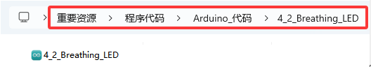

鼠标双击`4_2_Breathing_LED.ino`即可在Arduino IDE中打开。

```c++
/*
 * 文件名 : 4_2_Breathing_LED
 * 功能   : 让led灯像呼吸一样忽明忽暗.
 * 编译IDE：ARDUINO 2.3.5
 * 作者   : https://www.keyesrobot.cn/
*/

const int ledPin = 27;  // 定义LED的GPIO引脚

void setup() {
  pinMode(ledPin, OUTPUT); //设置LED引脚为输出模式。
}

void loop() {
  for (int i = 0; i < 255; i++) { //使LED逐渐亮
    analogWrite(ledPin, i); //输出PWM
    delay(3);
  }
  for (int i = 255; i > -1; i--) {  //使LED逐渐熄灭
    analogWrite(ledPin, i); //输出PWM
    delay(3);
  }
}
```

### 4.2.6 实验结果

按照接线图接好线，选择好正确的开发板板型（ESP32 Dev Module）和 适当的串口端口（COMxx），然后单击按钮上传代码。上传代码成功后，即可实现LED灯从暗慢慢变亮，然后再由亮慢慢变暗。以此循环的现象。（如果你对上传代码存在疑惑，请查看教程的`1.7 使用Arduino IDE上传第一个程序`）


### 4.2.7 代码说明

```c
for (int i = 0; i < 255; i++) {
    ...
}
```

- `for` → 创建计数循环。官方介绍：[for | Arduino Documentation](https://docs.arduino.cc/language-reference/en/structure/control-structure/for/)
- `int i = 0` → 从0开始计数
- `i < 255` → 循环条件（i<255时执行）。官方介绍：[< (less than) | Arduino Documentation](https://docs.arduino.cc/language-reference/en/structure/comparison-operators/lessThan/)
- `i++` → 每次循环i增加1。官方介绍：[++ (increment) | Arduino Documentation](https://docs.arduino.cc/language-reference/en/structure/compound-operators/increment/)


①：设置循环初始值，只是执行一遍，执行后进入②

②：判断是否瞒住循环条件，如图中`i <= 255`则是i小于等于255就能进入循环代码③中

③：循环代码，将需要循环的代码放到这里，如我们这个代码是需要控制pwm值从0到255所以我们只需将i的值当初pwm值即可然后进入④

④：i++ 是i在原来的值上再加一的操作等于 i = i +1 （i- -则是等效 i = i - 1），执行完后进入⑤

⑤：i的值加一（或减一）后接着判断i的值是否小于等于255，如果是则继续进入循环代码③，如果不是则退出for循环

---------------------

```c
analogWrite(ledPin, i);   //Output PWM
```

- `analogWrite()` → Arduino PWM输出函数
- `ledPin` → 支持PWM的引脚（带~符号）
- `i` → 占空比值（0-255）

官方介绍：[analogWrite() | Arduino Documentation](https://docs.arduino.cc/language-reference/en/functions/analog-io/analogWrite/)

----------

## 4.3 无源蜂鸣器

### 4.3.1 简介

本教程将为您详细介绍无源蜂鸣器的使用方法和应用技巧。无源蜂鸣器是一种需要外部驱动信号才能发声的电子元件，其内部不含振荡源，因此可以通过改变输入信号的频率来产生不同音调的声音。教程内容包括无源蜂鸣器的工作原理、引脚识别、电路连接方法以及如何通过微控制器（如ESP32）生成不同频率的方波信号来控制蜂鸣器。您将学习如何编写代码来实现简单的音乐播放、报警信号和自定义音效。无论您是电子初学者还是有经验的开发者，本教程都将帮助您掌握无源蜂鸣器的应用，为您的项目增添丰富的声音效果。

### 4.3.2 元件知识


**无源蜂鸣器：** 是一种内部没有振动源的集成电子蜂鸣器，只有给它一定频率的`方波信号`，才能让五源蜂鸣器发声，同时，输入的方波频率不同，发出的声音也不同，所以无源蜂鸣器可以模拟曲调实现音乐效果。

  - 引脚的电平变化可以模拟方波，例如引脚高电平持续500微秒后，再变换为低电平500微秒，紧接着再变换为高电平…
  
  - **以2~5KHz的方波去驱动无源蜂鸣器，方波的赫兹可以通过公式 f=1/T，其中f为频率，T为一个完整的周期所用时间（即高低电平各持续的时间之和）来计算。**


<span style="color: rgb(255, 76, 65);">注: 我们提供的无源蜂鸣器的谐振频率为2048Hz，这意味着这个无源蜂鸣器的谐振频率为2048Hz时声音最大。</span>

**C调符与频率对照表：**

|    调符     | 频率(Hz) |      调符      | 频率(Hz) |     调符     | 频率(Hz) |
| :---------: | :-----------: | :------------: | :-----------: | :----------: | :-----------: |
| Flat  1  Do |      262      | Natural  1  Do |      523      | Sharp  1  Do |     1047      |
| Flat  2  Re |      294      | Natural  2  Re |      587      | Sharp  2  Re |     1175      |
| Flat  3  Mi |      330      | Natural  3  Mi |      659      | Sharp  3  Mi |     1319      |
| Flat  4  Fa |      349      | Natural  4  Fa |      698      | Sharp  4  Fa |     1397      |
| Flat  5  So |      392      | Natural  5  So |      784      | Sharp  5  So |     1568      |
| Flat  6  La |      440      | Natural  6  La |      880      | Sharp  6  La |     1760      |
| Flat  7  Si |      494      | Natural  7  Si |      988      | Sharp  7  Si |     1967      |

**原理图：**


**参数：**

- 工作电压: DC 3.3V~5V
- 工作电流: (Max) 30mA@5V
- 最大功率: 0.15W
- 谐振频率: 2048Hz
- 输出音压: (Min)80dB/10cm
- 控制信号: 方波

### 4.3.3 接线图

**模块连接到io16**

**注意使用连接线连接时，黄色线为S信号线，红色线为V电源线，黑色线为GND，颜色一一对应，请勿插反！**


### 4.3.4 实验代码

代码文件在`Arduino_代码`文件夹中（<u>路径：重要资源\程序代码\Arduino_代码</u>），代码文件为`4_3_C_key`，如图：

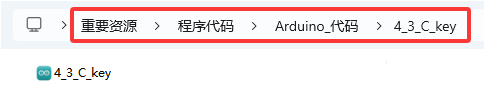

鼠标双击`4_3_C_key.ino`即可在Arduino IDE中打开。

```c++
/*
 * 文件名 : 4_3_C_key
 * 功能   : 让无源蜂鸣器播放C调的Do，Re，Mi，Fa，So，La，Si
 * 编译IDE：ARDUINO 2.3.5
 * 作者   : https://www.keyesrobot.cn/
*/

const int Buzzer_Pine = 16; //定义喇叭引脚为IO16
void setup() {
  pinMode(Buzzer_Pine, OUTPUT);//定义引脚IO16为输出模式
}

void loop() {
  tone(Buzzer_Pine, 262); //低DO播放500ms
  delay(500);
  tone(Buzzer_Pine, 294); //低Re播放500ms
  delay(500);
  tone(Buzzer_Pine, 330); //低Mi播放500ms
  delay(500);
  tone(Buzzer_Pine, 349); //低Fa播放500ms
  delay(500);
  tone(Buzzer_Pine, 392); //低So播放500ms
  delay(500);
  tone(Buzzer_Pine, 440); //低La播放500ms
  delay(500);
  tone(Buzzer_Pine, 494); //低Si播放500ms
  delay(500);
  noTone(Buzzer_Pine); //停止播放一秒
  delay(1000);
}
```

### 4.3.5 实验结果

按照接线图接好线，选择好正确的开发板板型（ESP32 Dev Module）和 适当的串口端口（COMxx），然后单击按钮上传代码。上传代码成功后，即可实现无源蜂鸣器播放出C调的Do，Re，Mi，Fa，So，La，Si，以此循环的现象。（如果你对上传代码存在疑惑，请查看教程的`1.7 使用Arduino IDE上传第一个程序`）


### 4.3.6 扩展知识

我们学习了如何控制无源蜂鸣器发出C调的音，那么接下来就利用C调组合出一首简单的生日快乐歌吧！

**接线保持不变**

**简谱：**


**低中高音对照图：**

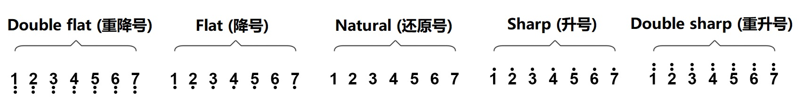

**实验代码：**

代码文件在`Arduino_代码`文件夹中（<u>路径：重要资源\程序代码\Arduino_代码</u>），代码文件为4_3_Music`，如图：

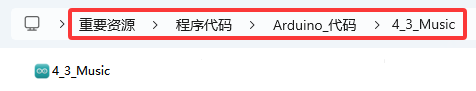

鼠标双击`4_3_Music.ino`即可在Arduino IDE中打开。

```c
/*
 * 文件名 : 4_3_Music
 * 功能   : 让无源蜂鸣器播放音乐.
 * 编译IDE：ARDUINO 2.3.5
 * 作者   : https://www.keyesrobot.cn/
*/
int beeppin = 16;  //定义无源蜂鸣器引脚为IO16
// do、re、mi、fa、so、la、si
int doremi[] = { 262, 294, 330, 370, 392, 440, 494,                                                        //低音调0-6
                 523, 587, 659, 698, 784, 880, 988,                                                        //中音调7-13
                 1047, 1175, 1319, 1397, 1568, 1760, 1967 };                                               //高音调14-20
int happybirthday[] = { 5, 5, 6, 5, 8, 7, 5, 5, 6, 5, 9, 8, 5, 5, 12, 10, 8, 7, 6, 11, 11, 10, 8, 9, 8 };  // 根据简谱低中高音找到doremi[]数组中的位置号
int meter[] = { 1, 1, 2, 2, 2, 4, 1, 1, 2, 2, 2, 4, 1, 1, 2, 2, 2, 2, 2, 1, 1, 2, 2, 2, 4 };               // 节拍

void setup() {
  pinMode(beeppin, OUTPUT);  //定义引脚IO5为输出模式
}

void loop() {
  for (int i = 0; i <= 24; i++) {                 //i<=24 的原因是歌谱中只有24个音调
    tone(beeppin, doremi[happybirthday[i] - 1]);  //用tone()函数发出频率为frequency的波形
    delay(meter[i] * 200);                        //等待1000毫秒
    noTone(beeppin);                              //停止发声
  }
}
```

### 4.3.7 代码说明

```c
  tone(Buzzer_Pine, 262);//低DO播放500ms
  delay(500);
```

- `tone()` → Arduino蜂鸣器驱动函数。官方介绍：[tone() | Arduino Documentation](https://docs.arduino.cc/language-reference/en/functions/advanced-io/tone/)
- `Buzzer_Pin` → 蜂鸣器连接的引脚
- `262` → 频率值(Hz)，对应钢琴低Do音
- `delay(500)`持续500ms

-----------

```c
noTone(beeppin);                              //停止发声
```

- `noTone()` → Arduino停止声音函数。官方介绍：[noTone() | Arduino Documentation](https://docs.arduino.cc/language-reference/en/functions/advanced-io/noTone/)
- `beeppin` → 蜂鸣器连接的引脚编号
- 效果：立即终止该引脚的所有PWM声音输出

-----------

```c
// do、re、mi、fa、so、la、si
int doremi[] = { 262, 294, 330, 370, 392, 440, 494,                          //低音调0-6
                 523, 587, 659, 698, 784, 880, 988,                          //中音调7-13
                 1047, 1175, 1319, 1397, 1568, 1760, 1967 };                 //高音调14-20
```

定义了一个`int`类型的数组，数组就是可以将大量的数据以组的形式存放，需要调用时只需给出数据的位号即可，如下：

doremi[0] 就是获取数组的第一个数据（注意数组的第一个数据位号是0，第二个位号是1以此类推），所以doremi[0] 就是数据 262 

同理 doremi[1] 表示的数据就是 294，doremi[6]表示的数据就是494

------------

```c
tone(beeppin, doremi[happybirthday[i] - 1]);  //用tone()函数发出频率为frequency的波形
delay(meter[i] * 200);                        //节拍
```

`tone(beeppin, doremi[happybirthday[i] - 1]); `，其实与`tone(Buzzer_Pine, 262);`一样只是频率值存放再数组中了，而`doremi[happybirthday[i] - 1`的“-1”是因为数组的位号是从0开始的。

`delay(meter[i] * 200);`也是一样的，使用数组中的节拍值乘以200作为真正的延时节拍

---------

## 4.4 继电器+水泵

### 4.4.1 简介

本教程将为您详细介绍5V继电器模块和水泵模块的使用方法和应用技巧。水泵模块是一种用于输送液体的设备，广泛应用于农业灌溉、水族箱管理和工业流体控制；5V继电器模块是一种电子开关设备，能够通过低电压控制高电压或大电流电路的通断。教程内容包括水泵模块和5V继电器模块的工作原理、引脚功能、电路连接方法以及如何通过微控制器（如ESP32）控制控制继电器的开关状态从而最终控制水泵的开关和运行状态。您将学习如何编写代码来实现继电器的自动控制水泵模块，并应用于各种场景，如农业灌溉、水族箱管理和工业流体控制。无论您是电子初学者还是有经验的开发者，本教程都将帮助您掌握5V继电器模块和水泵模块的应用，为您的项目增添高效的液体输送解决方案。

### 4.4.2 元件知识


水泵模块基于电机的工作原理，通过电机驱动叶轮或活塞运动，将液体从低压区域输送到高压区域。其核心是将电能转换为机械能，再转换为液体的动能，广泛应用于家用、农业、工业等领域。

<span style="color: rgb(255, 76, 65);">注意：</span>水泵跟电机一样是不能直接使用开发板的IO口进行驱动的，否则将可能会烧坏开发板。

**水泵拆解图：**


**继电器：** 继电器是一种利用低功耗电路控制大功率电路的安全开关。它由电磁铁和触点组成。电磁铁采用低功耗电路控制，大功率电路采用触点控制。当电磁铁通电时，它会吸引触点。下面是一个常用继电器的示意图:


**工作原理图：**

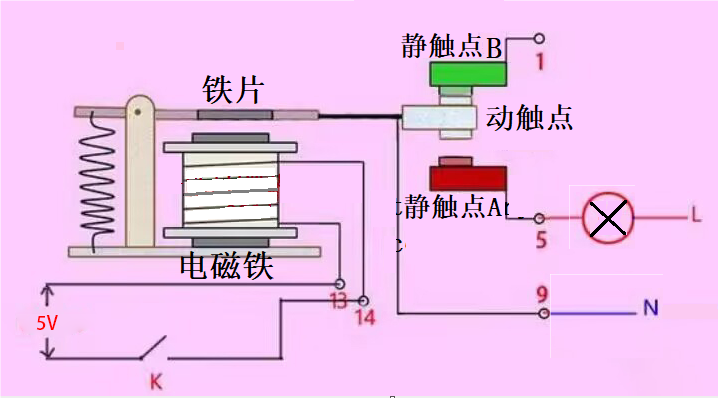

一个继电器拥有一个动触点以及两个静触点A和B。

当开关K断开时，继电器线路无电流通过，此时动触点与静触点B相接触，上半部分的电路导通。静触点B被称为常闭触点（NC）。常闭——NC（normal close）通常情况下是关合状态，即线圈未得电的情况下闭合的。

当开关K闭合时，继电器电路通过电流产生磁力，此时动触点与静触点A相接触，下半部分电路导通。静触点A被称为常开触点（NO）。常开——NO（normal open）通常情况下是断开状态，即线圈未得电的情况下断开的。

而动触点也被称为公共触点（COM）。

继电器简单来说就是一个开关，VCC表示电源正极、GND表示电源负极、IN表示信号输入脚，COM表示公共端，NC（normal close）表示常闭端，NO(normal open)表示常开端。

继电器能兼容多种单片机控制板，是用小电流去控制大电流运作的一种“自动开关”。它可以让单片机控制板驱动3A以下负载，如LED灯带、直流马达、微型水泵、电磁阀可插拔式接口设计，方便使用。

**规格参数：**

- 供电电压：5V
- 静态电流：2mA
- 最高触点电压：250VAC/30VDC
- 最大电流：10A

**模块原理图：**


### 4.4.3 接线图

- **继电器模块连接到io25，继电器的NC端，连接到io2引脚接口的黑色的GND**

- **水泵：**
  - **红色线连接到3V3电源，如图所示**
  - **黑色线GND连接到继电器的COM端，如图所示**

**注意使用连接线连接时，黄色线为S信号线，红色线为V电源线，黑色线为GND，颜色一一对应，请勿插反！**

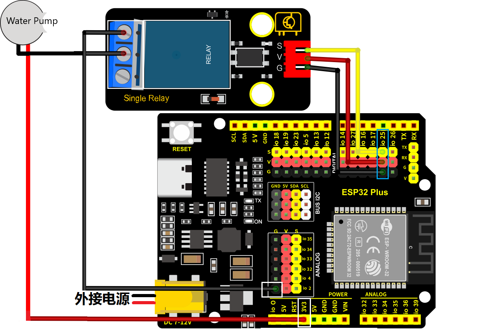

### 4.4.4 实验代码

代码文件在`Arduino_代码`文件夹中（<u>路径：重要资源\程序代码\Arduino_代码</u>），代码文件为`4_4_Water_Pump`，如图：

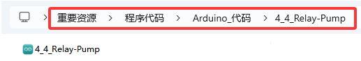

鼠标双击`4_4_Water_Pump.ino`即可在Arduino IDE中打开。

```c
/*
 * 文件名 : 4_4_Relay-Pump
 * 功能   : 让继电器控制水泵抽水模拟抽水系统
 * 编译IDE：ARDUINO 2.3.5
 * 作者   : https://www.keyesrobot.cn/
*/

const int RelayPin = 25; //定义继电器引脚为IO25
char content;  //定义一个字符串，用于存储串口接收到的值

void setup() {
  Serial.begin(9600);
  pinMode(RelayPin,OUTPUT); //定义引脚IO25为输出模式
}

void loop() {
  //arduino串口方法Serial.read() 每次只接收一个字节
  //当键盘输入aaa时，每次只接收一个a，共接收三次
  if(Serial.available() > 0) {
    if (Serial.read() == 'a') //当输入的值等于a时，执行灌溉任务
    {
      digitalWrite(RelayPin,HIGH);
      delay(400);//灌溉的延时，请设置100~400之间
      digitalWrite(RelayPin,LOW);
      delay(700);
    }
  }
}
```

### 4.4.5 实验结果

按照接线图接好线，选择好正确的开发板板型（ESP32 Dev Module）和 适当的串口端口（COMxx），然后单击按钮上传代码。上传代码成功后，单击Arduino IDE右上角的打开串监视器串口并设置串口波特率为`9600`, 在文本框中输入字母“ a ”，则继电器控制水泵会进行一次抽水。

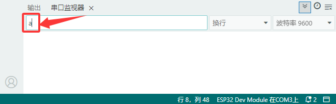


（如果你对上传代码存在疑惑，请查看教程的`1.7 使用Arduino IDE上传第一个程序`)

通过这个项目，我们可以实现自动化的抽水泵控制，从而减少手动操作的时间和精力成本，提高生产效率。这种方法可以应用于多个领域，例如农业生产、水处理等。

### 4.4.6 代码说明

| 代码                | 说明                                                         |
| ------------------- | ------------------------------------------------------------ |
| char content         | 定义一个字符串，用于存储串口接收到的值 |
| Serial.begin(9600)  | 设置波特率为9600          |
| Serial.available( ) | 获取串口上可读取的数据的字节数，该数据已经到达并存储在接收缓存（共有64字节）中。Serial.available() > 0表示串口接收到了数据，可以读取。 |
| Serial.read( )      | 读取写入的串行数据。      |
| if( ){ }      | 如果“（ ）”里的条件满足，则执行“{ }”里的程序。    |

-------------------

## 4.5 舵机模块

### 4.5.1 简介

本教程将为您详细介绍舵机模块的使用方法和应用技巧。舵机是一种能够精确控制角度的电机，广泛应用于机器人、遥控模型和自动化设备中。教程内容包括舵机的工作原理、引脚功能、电路连接方法以及如何通过微控制器（如ESP32）控制舵机的转动角度。您将学习如何编写代码来实现舵机的精确位置控制、平滑运动以及多舵机协同工作。无论您是电子初学者还是有经验的开发者，本教程都将帮助您掌握舵机模块的应用，为您的项目增添灵活的机械控制功能。

### 4.5.2 元件知识

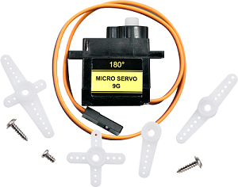

**控制原理**：舵机的转动的角度是通过调节PWM（脉冲宽度调制）信号的占空比来实现的，标准PWM（脉冲宽度调制）信号的周期固定为20ms（50Hz)，理论上脉宽分布应在1ms到2ms 之间，但是，事实上脉宽可由0.5ms 到2.5ms 之间，脉宽和舵机的转角0°～180°相对应。有一点值得注意的地方，由于舵机牌子不同，对于同一信号，不同牌子的舵机旋转的角度也会有所不同

**引脚介绍：**

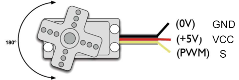

**GND：** 一个接地的引脚，棕色

**VCC：** 一个连接到+5v电源的引脚，红色

**S：** 信号端的引脚，PWM信号控制，橙色

**内部结构图：**

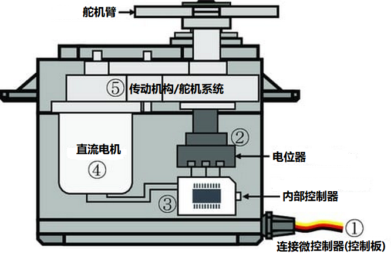

- 信号线：接收来自微控制器的控制信号；

- 电位器：可以测量输出轴的位置量，属于整个舵机机构的反馈部分；

- 内部控制器：处理来自外部控制的信号，驱动电机以及处理反馈的位置信号，是整个伺服机构的核心；

- 直流电机：作为执行机构，输出多少转速，转矩，位置；

- 传动机构/舵机系统：该机构根据一定传动比，将电机输出的行程缩放到最终输出的角度上。


**驱动舵机：**

通过向舵机的信号信号线发送PWM信号来控制舵机的输出量，**PWM脉冲的占空比直接决定了输出轴的位置。**

**例如（这里以180°舵机为例）：**

- 当我们向180°舵机发送脉冲宽度为1.5毫秒（ms）的信号时，舵机的输出轴将移至中间位置（90度）；

- 脉冲宽度为`0.5ms`时，舵机的输出轴将移至最小的位置（0度）；

- 脉冲宽度为`2.5ms`时，舵机的输出轴将移至最大的位置（180度）；

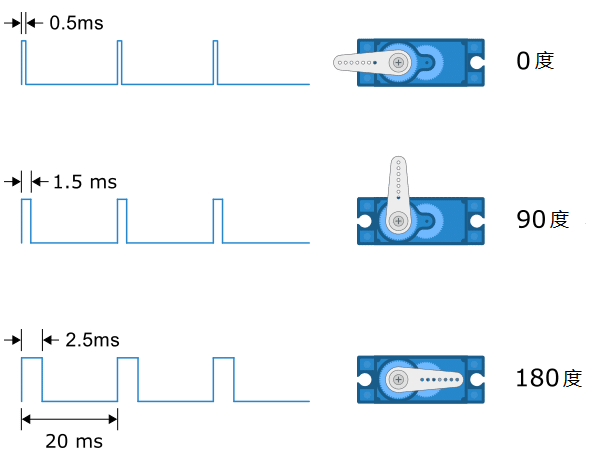

舵机的周期通常为20毫秒，希望以`50Hz`的频率产生脉冲，但是许多伺服器在40至200 Hz的范围内也都能正常工作。


<span style="color: rgb(255, 76, 65);">注:不同类型和品牌的舵机之间最大位置和最小位置的角度可能会不同。许多舵机仅旋转约170度(或者只有90度)，但宽度为1.5ms的伺服脉冲通常会将伺服设置为中间位置(通常是指定全范围的一半)。</span>

### 4.5.3 接线图

**模块连接到io26**

**注意使用连接线连接时，黄色线为S信号线，红色线为V电源线，黑色线为GND，颜色一一对应，请勿插反！**


### 4.5.4 实验代码

<span style="color: rgb(255, 76, 65);">注意：</span> 上传代码前要添加库文件，库文件存放在`库文件`文件夹中名为`ESP32Servo.zip`：（如果你对安装库文件有疑问请查看教程的`2. 给Arduino IDE安装库文件`）

代码文件在`Arduino_代码`文件夹中（<u>路径：重要资源\程序代码\Arduino_代码</u>），代码文件为`4_5_Servo`，如图：

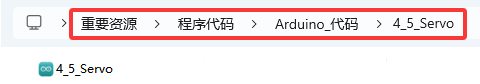

鼠标双击`4_5_Servo.ino`即可在Arduino IDE中打开。

```c++
/*
 * 文件名 : 4_5_Servo
 * 功能   : 舵机转动
 * 编译IDE：ARDUINO 2.3.5
 * 作者   : https://www.keyesrobot.cn/
*/

#include <ESP32Servo.h>  //需要导入ESP32开发板的舵机库
Servo myservo;  // 创建舵机对象来控制舵机
                // 在ESP32上可以创建16个舵机对象
                
int pos = 0;    // 定义变量存储舵机位置
// ESP32上推荐的PWM GPIO引脚包括2、4、12-19、21-23、25-27、32-33
int servoPin = 26;
                
void setup() {
  myservo.attach(servoPin);   // 将引脚26上的舵机连接到舵机对象上
  myservo.write(80);
  delay(2000);
}

void loop() {

  for (pos = 80; pos <= 179; pos += 1) { // 从80度到179度
    // 每次15度
    myservo.write(pos);              //告诉舵机到变量“pos”的位置
    delay(15);                       // 每次等待15ms让舵机到达对应的位置
  }
  for (pos = 180; pos >= 81; pos -= 1) { // 从180度到81度
    myservo.write(pos);              // 告诉舵机到变量“pos”的位置
    delay(15);                       // 每次等待15ms让舵机到达对应的位置
  }
}
```


### 4.5.5 实验结果：

按照接线图接好线，选择好正确的开发板板型（ESP32 Dev Module）和 适当的串口端口（COMxx），然后单击按钮上传代码。上传代码成功后可以看到饲料盒在慢慢打开，慢慢关闭，实现可控制的。（如果你对上传代码存在疑惑，请查看教程的`1.7 使用Arduino IDE上传第一个程序`）

<span style="color: rgb(255, 76, 65);">注意：SG90舵机是180度，在套件中的饲料盒较小，SG90舵机只需旋转100度，就能完全关闭饲料盒。</span>

- 80度：完全打开。
- 120度：打开一半。
- 180度：关闭。


<span style="color: rgb(255, 76, 65);">注意：请勿将手指伸入到饲料盒中，谨防夹伤！请勿将其他物体堵住饲料盒盖，以免弄坏舵机。</span>

------

## 4.6 风扇模块

### 4.6.1 简介

本教程将为您详细介绍风扇模块的使用方法和应用技巧。风扇模块是一种常见的散热设备，通过直流电机驱动扇叶旋转，产生气流以降低温度。教程内容包括风扇模块的工作原理、引脚功能、电路连接方法以及如何通过微控制器（如ESP32）控制风扇的开关和转速。您将学习如何编写代码来实现风扇的自动控制，并应用于各种场景，如温度调节、通风系统和电子设备散热。无论您是电子初学者还是有经验的开发者，本教程都将帮助您掌握风扇模块的应用，为您的项目增添有效的散热解决方案。

### 4.6.2 元件知识

130电机风扇模块上有个直流电机，直流电机的工作原理是基于电磁感应和洛伦兹力。其核心结构包括定子、转子和换向器。定子产生固定磁场，转子（电枢）由线圈绕组组成，通电后产生磁场。当电流通过电刷和换向器进入转子线圈时，转子磁场与定子磁场相互作用，产生洛伦兹力，推动转子旋转。换向器在转子旋转时切换电流方向，确保转子持续受到同方向的力，从而维持旋转。通过电磁感应和洛伦兹力的作用，直流电机将电能转换为机械能，实现能量转换。由于其调速性能好、启动扭矩大，直流电机广泛应用于电动工具、电动汽车和家用电器等领域。

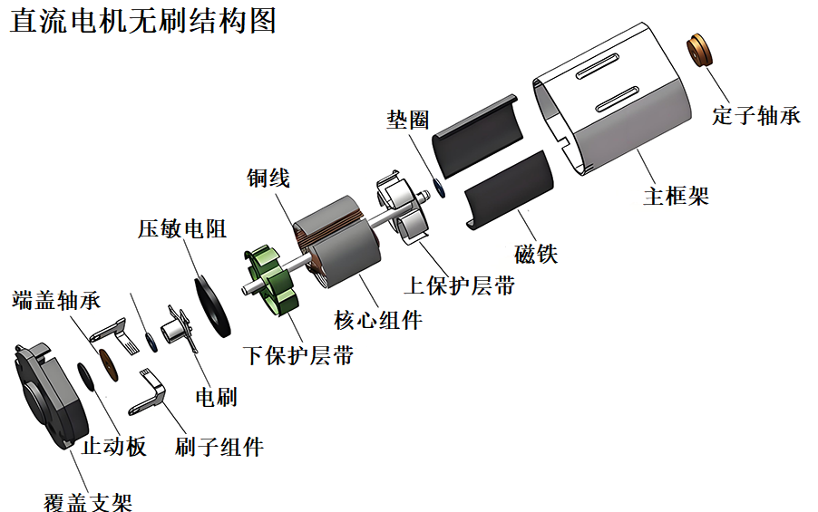

130电机风扇模块是一种可以通过PWM调速的模块，使用时需要接两个引脚进行控制。该模块适用于需要调节风扇速度的应用场景，例如电脑散热、工业生产等。它小巧轻便、安装简单，是一种十分实用的模块。

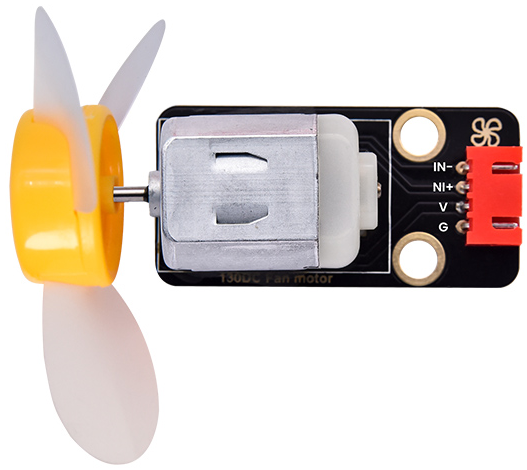

**原理图：**

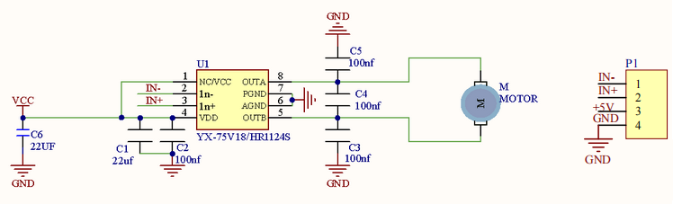

HR1124S芯片的作用是助于驱动电机，而电机所需电流较大，无法用三极管驱动更无法直接用IO口驱动。让电机转动起来的方法很简单，给电机两端添加电压即可。不同电压方向电机转向也不相同，在额度电压内，电压越大，电机转动得越快；反之电压越低，电机转动得越慢，甚至无法转动。控制方式有两种：一种是高低电平控制（控制转动和停止），一种是PWM控制（控制转速）。

**参数：**

- 工作电压: DC 5V
- 工作电流: (Max)400mA@5V
- 最大功率: 2W
- 转速: (16000+10%) 转/分@5V


### 4.6.3 接线图

**电机模块的IN-连接到io18，IN+连接到io19**

**注意使用连接线连接时，黄色线为S信号线，红色线为V电源线，黑色线为GND，颜色一一对应，请勿插反！**

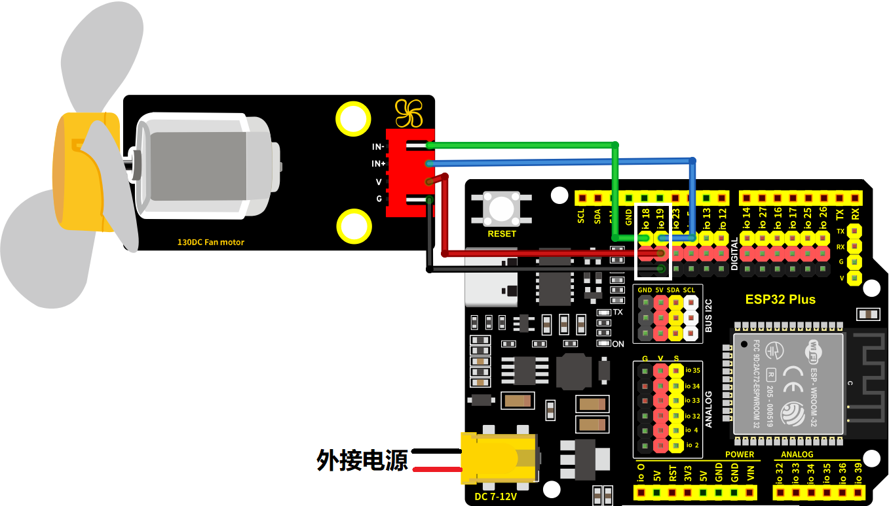


### 4.6.4  实验代码

代码文件在`Arduino_代码`文件夹中（<u>路径：重要资源\程序代码\Arduino_代码</u>），代码文件为`4_6_Motor`，如图：

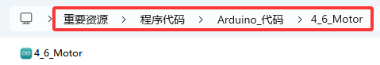

鼠标双击`4_6_Motor.ino`即可在Arduino IDE中打开。

```c++
/*
 * 文件名 : 4_6_Motor
 * 功能   : 电机（风扇）顺时针逆时针转动
 * 编译IDE：ARDUINO 2.3.5
 * 作者   : https://www.keyesrobot.cn/
*/

const int MotorPin1 = 19;  //(IN+)
const int MotorPin2 = 18;  //(IN-)

void setup() {
  pinMode(MotorPin1,OUTPUT); //设置MotorPin1（IN+）引脚为输出模式
  pinMode(MotorPin2,OUTPUT); //设置MotorPin2（IN-）引脚为输出模式
}

void loop() {
  //逆时针转动2秒
  analogWrite(MotorPin1, 70);
  analogWrite(MotorPin2, 0);
  delay(2000);

  //停止2秒
  //停止的目的:防止正反转的瞬间，电机电流过大，导致开发板供电不足，而被迫复位。
  analogWrite(MotorPin1, 0);
  analogWrite(MotorPin2, 0);
  delay(2000);
  
  //顺时针转动2秒
  analogWrite(MotorPin1, 0);
  analogWrite(MotorPin2, 70);
  delay(2000);
  
  //停止2秒
  analogWrite(MotorPin1, 0);
  analogWrite(MotorPin2, 0);
  delay(2000);
}
```
### 4.6.5  实验结果

按照接线图接好线，选择好正确的开发板板型（ESP32 Dev Module）和 适当的串口端口（COMxx），然后单击按钮上传代码。上传代码成功后可以看到130电机模块上的风扇，每隔2秒，逆时针和顺时针交替旋转。（如果你对上传代码存在疑惑，请查看教程的`1.7 使用Arduino IDE上传第一个程序`）

**注意：电机在进行正反转时，间歇性的停止，为了防止正反转的瞬间，电机电流过大，导致开发板供电不足，而被迫复位，一定要保证外接电源，并且还要保证外接电源电压比较足。**

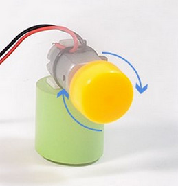

------

## 4.7 按键模块

### 4.7.1 简介

本教程将为您详细介绍按键的使用方法和应用技巧。按键是一种常见的电子输入设备，用于在电路中实现手动控制。教程内容包括按键的工作原理、电路连接方法以及如何通过微控制器（如ESP32）读取按键状态。您将学习如何编写代码来检测按键的按下和释放，并实现各种控制功能，如开关控制、模式切换和用户输入响应。无论您是电子初学者还是有经验的开发者，本教程都将帮助您掌握按键的应用，为您的项目增添交互性和控制功能。

### 4.7.2 元件知识

**按键模块：** 按键模块可以控制电路的通断，把按键接入电路中，不按下按键的时候电路是断开的，按下按键电路就通啦，但是松开之后就又断了。按键模块是一种简单易用的输入设备，通过微控制器（如ESP32）可以读取到它的高低电平，


**原理图：**


**参数：**

- 工作电压: DC 3.3V~5V
- 工作电流: (Max) 1.1mA@5V
- 最大功率: 5.5mW
- 信号类型: 数字信号(0或1)

**按键模块的原理是基于按键的开关电路。**

- **当按键被按下时**，开关会闭合，使得电流可以通过按键到GND，从而使开发板的数字输入引脚，检测到一个逻辑低电平信号。

- **当按键没有被按下时**，开关处于断开状态，引脚被上拉电阻拉高，数字输入引脚检测到逻辑高电平信号。

### 4.7.3 接线图

**模块连接到io5**

**注意: 使用连接线连接时，黄色线为S信号线，红色线为V电源线，黑色线为GND，颜色一一对应，请勿插反！**


### 4.7.4 实验代码

代码文件在`Arduino_代码`文件夹中（<u>路径：重要资源\程序代码\Arduino_代码</u>），代码文件为`4_7_Read_Button`，如图：

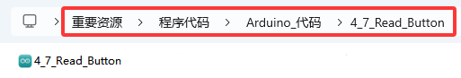

鼠标双击`4_7_Read_Button.ino`即可在Arduino IDE中打开。

```c
/*
 * 文件名 : 4_7_Read_Button
 * 功能   : 读取按键值.
 * 编译IDE：ARDUINO 2.3.5
 * 作者   : https://www.keyesrobot.cn/
*/

const int Button_Pin = 5;  // 将按键的引脚连接到IO5
int val = 0;       // 用于存储按键的键值

void setup() {
  Serial.begin(9600);    // 启动串口监视器，设置波特率为9600
  pinMode(Button_Pin, INPUT);  // 设置按键的引脚为输入模式
}

void loop() {
  val = digitalRead(Button_Pin);  // 读取按键的值并将其赋值给变量val
  Serial.print(val);          // 打印变量val的值
  if (val == 0) {             // 按下按键时读取到低电平，并打印出相关的信息
    Serial.print("    ");  
    Serial.println("Press the botton"); // 打印按键的释放信息
    delay(100);
  }
  else {               // 按起按键
    Serial.print("    ");
    Serial.println("Loose the botton");
    delay(100);
  }
}
```

### 4.7.5 实验结果

按照接线图接好线，选择好正确的开发板板型（ESP32 Dev Module）和 适当的串口端口（COMxx），然后单击按钮上传代码。上传代码成功后，单击Arduino IDE右上角的打开串监视器串口并设置串口波特率为`9600`, 即可通过串口打印窗口查看按键的状态，当按键按下时串口打印val值为`0`并打印提示语`Press the botton` ; 松开按键时串口打印val值为`1`并串口打印提示语`Loose the botton`。

（如果你对上传代码存在疑惑，请查看教程的`1.7 使用Arduino IDE上传第一个程序`)

**串口现象图：**

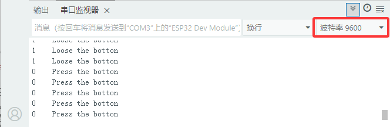

### 4.7.6 代码说明

```c
int val = 0;       // 用于存储按键的键值
```

定义一个名为"val"的`int`类型的变量值，它可以存放整数

官方介绍：[int | Arduino Documentation](https://docs.arduino.cc/language-reference/en/variables/data-types/int/)

------------

```c
Serial.begin(9600);    // 启动串口监视器，设置波特率为9600
```

- 功能：启动Arduino的串口通信
- 参数：`9600`表示数据传输速率（比特/秒），一般波特率为`9600`或`115200`
- 必须放在`setup()`函数内
- 需要配套使用`Serial.print()`输出数据

-------------------

```c
pinMode(Button_Pin, INPUT);  // 设置按键的引脚为输入模式
```

- `pinMode()` → Arduino专用函数，用于设置引脚工作模式
- `Button_Pin` → 要设置的引脚
- `INPUT` → 设置为输入模式（读取引脚的模拟值）

-------

```c
val = digitalRead(Button_Pin);  // 读取按键的值并将其赋值给变量val
```

- `digitalRead()` → 数字输入读取函数，读取括号中引脚的高低电平（LOW或HIGH）。官方介绍：[digitalRead() | Arduino Documentation](https://docs.arduino.cc/language-reference/en/functions/digital-io/digitalread/)
- `Button_Pin` → 连接的按钮引脚
- `val` → 存储结果的变量（0/LOW或1/HIGH）

-------

```c
Serial.print(val);          // 打印变量val的值
```

使用串口打印变量`val`的值，打印方式是不换行打印

---------

```c
Serial.println("Press the botton"); // 打印按键的释放信息
```

使用串口打印字符串"Press the botton"，打印方式是换行打印，注意换行打印与不换行打印的函数不一样

---------

```c
if (val == 0) {             // 按下按键时读取到低电平，并打印出相关的信息
...
  }
  else {               // 按起按键
...
  }
```

- `if` → 条件判断语句
- `val == 0` → 判断条件（val是否等于0），如果val等于0则执行if下方的代码，val不等于0则执行else下方的代码
- `else` → 当条件不成立时执行

--------------

## 4.8 人体红外热释电传感器

### 4.8.1 简介

本教程将为您详细介绍人体红外热释电传感器的使用方法和应用技巧。人体红外传感器是一种常见的电子输入设备，用于在电路中实现手动控制。教程内容包括人体红外热释电传感器的工作原理、电路连接方法以及如何通过微控制器（如ESP32）读取按键状态。您将学习如何编写代码来检测人体红外热释电传感器是否检测到人体移动，并实现各种控制功能，如防盗警报和用户输入响应等。无论您是电子初学者还是有经验的开发者，本教程都将帮助您掌握人体红外传感器的应用，为您的项目增添交互性和控制功能。

### 4.8.2 元件知识

**人体红外热释电传感器：** 是一款基于热释电效应的人体红外传感器，通过检测人体或其他温血动物发射的红外辐射来感知物体的存在，当人体移动引起红外辐射强度变化时，传感器上的热释电元件表面电荷平衡被打破，释放电荷并转化为微电压信号‌。配合菲涅尔透镜能使传感器探测范围更远更广，广泛应用于智能家居、智能安防等领域。

实验中，通过读取模块上S端高低电平，判断附近是否有人在移动；并且在串口监视器上显示测试结果。

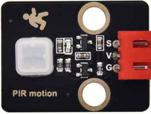

**原理图：**


这个模块的原理图可能较前面的模块稍复杂，我们一部分一部分来看。先看电压转换部分，作用是将5V输入电压转换为3.3V输入电压。因为我们模块上用到的热释电红外传感器的工作电压是3.3V，不能直接用5V电压供电使用。有了这个电压转换部分，3.3V输入电压和5V输入电压都适用于此热释电红外传感器。

当红外热释传感器没有检测到红外信号时，红外热释传感器的1脚输出低电平，此时模块上的LED两端有电压差，有电流流过，LED被点亮，MOS管Q1导通（Q1是NPN MOS管，型号为2N7002。由于红外热释传感器的1脚输出低电平，所以Q1的源极Vs=0，而Q1的栅极Vg=3.3V，于是Q1的栅极G和Q1的源极S之间的电压 Vgs = 3.3V 大于Q1的阈值电压 2.5V，Q1导通。），信号端S检测到低电平。

当红外热释传感器检测到红外信号时，红外热释传感器的1脚输出高电平，此时模块上的LED熄灭，MOS管Q1不导通，则信号端S检测到被10K上拉电阻R5拉高的高电平。

**参数：**

- 工作电压:DC 3.3V~5V
- 工作电流:(Max)3.6mA@5V
- 最大功率:0.018W
- 视野角度：Y = 90°，X = 110°（视野角度为理论数值）
- 探测距离：≤5m
- 控制信号: 数字信号(1/0)


### 4.8.3 接线图

**模块连接到io23**

**注意使用连接线连接时，黄色线为S信号线，红色线为V电源线，黑色线为GND，颜色一一对应，请勿插反！**


### 4.8.4 实验代码

代码文件在`Arduino_代码`文件夹中（<u>路径：重要资源\程序代码\Arduino_代码</u>），代码文件为`4_8_Read_PIR-Motion-Sensor`，如图：

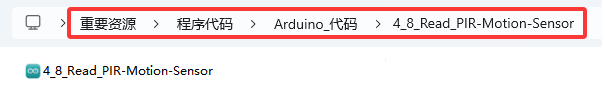

鼠标双击`4_8_Read_PIR-Motion-Sensor.ino`即可在Arduino IDE中打开。

```c
/*
 * 文件名 : 4_8_Read_PIR-Motion-Sensor
 * 功能   : 读取人体红外热释电传感器的值
 * 编译IDE：ARDUINO 2.3.5
 * 作者   : https://www.keyesrobot.cn/
*/

const int PyroelectricPIN = 23; // 将人体红外传感器的引脚连接到IO23

void setup() {
  Serial.begin(9600);  // 启动串口监视器，设置波特率为9600
  pinMode(PyroelectricPIN,INPUT); // 设置人体红外传感器的引脚为输入模式
}

void loop() {
  int ReadValue = digitalRead(PyroelectricPIN); //读取传感器值并将其赋值给变量ReadValue
  if(ReadValue){  //检测的人体运动时读取到高电平，并打印出相关的信息
    Serial.println("Someone");
  }
  else{  //未检测的人体运动时读取到高电平，并打印出相关的信息
    Serial.println("No one");
  }
  delay(100);
}
```

### 4.8.5 实验结果

按照接线图接好线，选择好正确的开发板板型（ESP32 Dev Module）和 适当的串口端口（COMxx），然后单击按钮上传代码。上传代码成功后，单击Arduino IDE右上角的打开串监视器串口并设置串口波特率为`9600`。当有人经过传感器时，会显示**Someone**，并且传感器上的红色LED会熄灭，没人时，会一直显示**No one**，传感器上的红色LED会常亮。

(<span style="color: rgb(255, 76, 65);">注意：人体红外热释电传感器并没有穿透能力，在检测人体移动时，请不要遮挡传感器。</span>)

（如果你对上传代码存在疑惑，请查看教程的`1.7 使用Arduino IDE上传第一个程序`)


**串口现象图：**

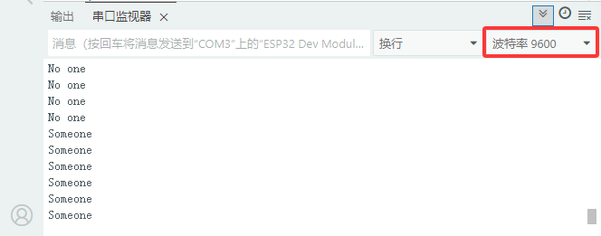

## 4.9 超声波传感器

### 4.9.1 简介

本教程将为您详细介绍超声波传感器的使用方法和应用技巧。超声波传感器是一种利用超声波测距的电子设备，广泛应用于避障、距离测量和物体检测。教程内容包括超声波传感器的工作原理、引脚功能、电路连接方法以及如何通过微控制器（如ESP32）读取和处理测距数据。您将学习如何编写代码来实现实时距离测量、障碍物检测以及数据滤波和校准。无论您是电子初学者还是有经验的开发者，本教程都将帮助您掌握超声波传感器的应用，为您的项目增添精确的距离感知功能。

### 4.9.2 元件知识

**超声波传感器:** 可以检测前方是否存在障碍物，并且检测出传感器与障碍物的详细距离。传感器主要用到CS100A芯片，它同时兼营3.3V与5V工作电压。最大测试距离为3米；盲区小于4CM。

它的测距原理和蝙蝠飞行的原理一样，就是超声波模块发送出一种频率很高，人体无法听到的超声波信号。这些超声波的信号若是碰到障碍物，就会立刻反射回来，在接收到返回的信息之后，通过判断发射信号和接收信号的时间差，计算出传感器和障碍物的距离。


**超声波参数：**

- 工作电压: DC 3.3V~5V
- 静态电流: <2mA
- 工作电流: 50mA~100mA，正常为65mA
- 最大功率：0.5W
- 最大探测距离：3m
- 盲区：小于4cm
- 感应角度：不大于15度
- 触发输入信号：10us TTL脉冲

**工作原理：**

最常用的超声测距的方法是回声探测法。当有脉冲电压触发时（单片机给Trig引脚发送高电平），超声波发射器探头里的晶片就会振动，继而产生超声波。在超声波发射时刻的同时计数器开始计时，超声波在空气中传播，途中碰到障碍物面阻挡就立即反射回来（Echo引脚发送高电平信号给单片机），超声波接收器收到反射回的超声波就立即停止计时。

超声波是一种声波，其声速V与温度有关。一般情况下超声波在空气中的传播速度为340m/s，根据计时器记录的时间t，就可以计算出超声波探头发射点距障碍物面的距离s，即：s=340t/2 。


HC-SR04超声波测距模块可提供范围为2厘米至3米的非接触式距离感测功能，测距精度可达高到3mm。超声波传感器包括超声波发射器、超声波接收器与控制电路。其基本工作原理：

(1) 采用IO口Trig触发测距，给至少10us的高电平信号;

(2) 模块自动发送8个40khz的方波，自动检测是否有信号返回；

(3) 有信号返回，通过IO口Echo输出一个高电平，高电平持续的时间就是超声波从发射到返回的时间。

(4) 距离 =（高电平时间 x 声速（340M/S）） / 2


**注意:**

此模块不应在通电时连接，如有必要，先连接模块的 GND。否则，会影响模块的工作。

被测物体的面积应至少为 0.5 平方米，并尽可能平坦。否则，它会影响结果。

### 4.9.3 接线图

**模块的Echo连接到io13，Trig连接到io12**

**注意使用连接线连接时，黄色线为S信号线，红色线为V电源线，黑色线为GND，颜色一一对应，请勿插反！**


### 4.9.4 实验代码

代码文件在`Arduino_代码`文件夹中（<u>路径：重要资源\程序代码\Arduino_代码</u>），代码文件为`4_9_Read_Distance`，如图：

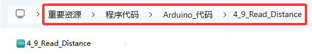

鼠标双击`4_9_Read_Distance.ino`即可在Arduino IDE中打开。

```c
/*
 * 文件名 : 4_9_Read_Distance
 * 功能   : 读取超声波传感器检测到的距离值
 * 编译IDE：ARDUINO 2.3.5
 * 作者   : https://www.keyesrobot.cn/
*/
// 定义超声波传感器的引脚
const int trigPin = 12; //trig接D12
const int echoPin = 13; //echo接D13

// 读取传感器数据的功能原型
float readSensorData();

void setup() {
  // 以9600波特率开始串行通信
  Serial.begin(9600);
  // 设置echoPin为输入模式，trigPin为输出模式
  pinMode(trigPin, OUTPUT);
  pinMode(echoPin, INPUT);
  // 打印传感器信息到串行监视器
  Serial.println("Ultrasonic sensor:");  
}

void loop() {
  // 读取超声波传感器的距离值
  float distance = readSensorData();
  // 将测量到的距离打印到串行监视器上
  Serial.print("distance: ");
  Serial.print(distance);   
  Serial.println(" cm");
  // 读数之间的延迟
  delay(100);
}

// 从超声波传感器读取数据的功能
float readSensorData() {
  // 在发送高信号之前触发低信号
  digitalWrite(trigPin, LOW); 
  delayMicroseconds(2);
  // 给trigPin发送一个10微秒的高信号
  digitalWrite(trigPin, HIGH); 
  delayMicroseconds(10);
  // 返回低信号
  digitalWrite(trigPin, LOW);
  
  // 测量回声屏上高信号的持续时间
  unsigned long microsecond = pulseIn(echoPin, HIGH);

  // 用声速计算距离（29.00µs / cm）
  float distance = microsecond / 29.00 / 2;

  // 返回计算出的距离
  return distance;
}
```

### 4.9.5 实验结果

按照接线图接好线，选择好正确的开发板板型（ESP32 Dev Module）和 适当的串口端口（COMxx），然后单击按钮上传代码。上传代码成功后，单击Arduino IDE右上角的打开串监视器串口并设置串口波特率为`9600`, 即可通过串口打印窗口查看超声波测距的距离值，调整超声波与障碍物的距离便能观察到距离变化。（如果你对上传代码存在疑惑，请查看教程的`1.7 使用Arduino IDE上传第一个程序`)

**串口现象图：**

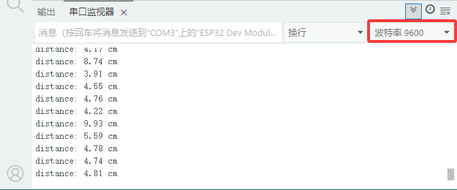

### 4.9.6 代码说明

```c
float readSensorData() {
    ...
}
```

超声波测距函数，这个函数是自定义函数，目的是方便读取超声波距离并且使代码简单化。

---------------

```c
delayMicroseconds(2);
```

微秒延时函数，官方介绍：[delayMicroseconds() | Arduino Documentation](https://docs.arduino.cc/language-reference/en/functions/time/delayMicroseconds/)

1s = 1000ms ； 1ms = 1000us

--------------

```c
unsigned long microsecond = pulseIn(echoPin, HIGH);
```

读取引脚脉冲函数。官方介绍：[pulseIn() | Arduino Documentation](https://docs.arduino.cc/language-reference/en/functions/advanced-io/pulseIn/)

----------

```c
return distance;
```

返回函数，终止函数并将值从函数返回给调用函数。官方介绍：[return | Arduino Documentation](https://docs.arduino.cc/language-reference/en/structure/control-structure/return/)

----------------------

## 4.10 XHT11温湿度传感器

### 4.10.1 简介

本教程将为您详细介绍XHT11温湿度传感器的使用方法和应用技巧。XHT11温湿度传感器是一种能够检测环境中的温度和湿度的电子元件，常用于家庭自动化、环境监测、农业等领域。教程内容包括XHT11温湿度传感器的工作原理、电路连接方法以及如何通过微控制器（如ESP32）读取温湿度值。您将学习如何编写代码来获取XHT11温湿度传感器检测的实时温湿度值，无论您是电子初学者还是有经验的开发者，本教程都将帮助您掌握XHT11温湿度传感器的应用，为您的项目增添智能的温湿度检测功能。

### 4.10.2 元件知识

XHT11温湿度传感器，是一种数字信号输出的温湿度传感器。它利用特殊的模拟信号采集、转换技术和温度、温湿度传感技术，确保传感器拥有良好的长时间稳定性，和较高的可靠性。该传感器内部包含高精度的电阻式湿度传感器件，和电阻式热敏测温传感器件，并与一个8位的性能高的单片机相连接。


**XHT11通信方式：**

XHT11 器件采用简化的单总线通信。单总线即只有一根数据线，系统中的数据交换、控制均由单总线完成。

- 单总线传送数据位定义：

  - 单总线数据格式：一次传送 40 位数据，高位先出。

  - 8bit 湿度整数数据 + 8bit 湿度小数数据 + 8bit 温度整数数据 + 8bit 温度小数数据 + 8bit 校验位。<span style="color: rgb(255, 76, 65);">注：其中湿度小数部分为 0。</span>

- 校验位数据定义：
  - 8bit 湿度整数数据 + 8bit 湿度小数数据 + 8bit 温度整数数据 + 8bit 温度小数数据。8bit 校验位等于所得结果的末 8 位。


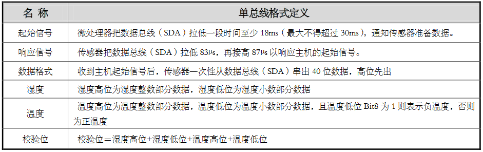

数据时序图如下：

用户主机（MCU）发送一次开始信号后，XHT11 从低功耗模式转换到高速模式，待主机开始信号结束后，XHT11 发送响应信号，送出 40bit 的数据，并触发一次信采集。信号发送如图所示:


<span style="color: rgb(255, 76, 65);">注：主机从 XHT11 读取的温湿度数据总是前一次的测量值，如两次测间隔时间很长，请连续读两次以第二次获得的值为实时温湿度值。</span>

**原理图：**

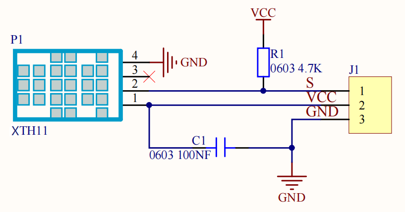


**参数：**

- 工作电压: DC 3.3V~5V 
- 工作电流: (Max)2.5mA@5V
- 最大功率: 0.0125W
- 温度范围: -25 ~ +60°C (± 2℃)
- 湿度范围: 5 ~ 95%RH（25C°左右精度为±5%RH）
- 输出信号: 数字双向单总线

### 4.10.3 接线图

**模块连接到io17**

**注意使用连接线连接时，黄色线为S信号线，红色线为V电源线，黑色线为GND，颜色一一对应，请勿插反！**

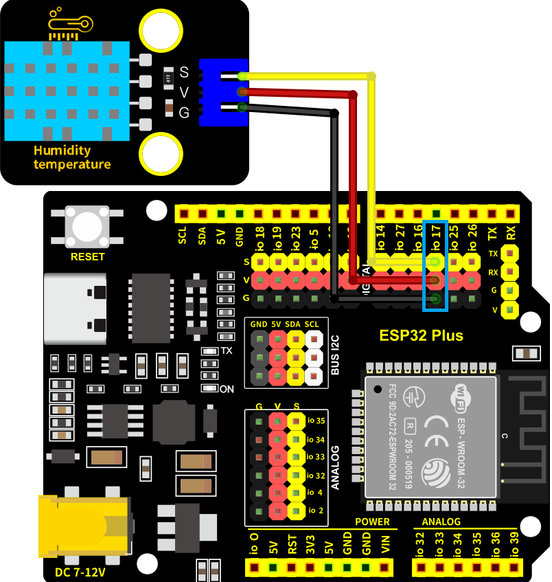

### 4.10.4 实验代码

代码文件在`Arduino_代码`文件夹中（<u>路径：重要资源\程序代码\Arduino_代码</u>），代码文件为`4_10_Read_XHT11`，如图：


鼠标双击`4_10_Read_XHT11.ino`即可在Arduino IDE中打开。

```c
/*
 * 文件名 : 4_10_Read_XHT11
 * 功能   : 读取温湿度的湿度和温度
 * 编译IDE：ARDUINO 2.3.5
 * 作者   : https://www.keyesrobot.cn/
*/

#include <dht11.h>
#define DHT11PIN 17  //设置连接到DHT11数据引脚上的IO17

dht11 DHT11;  // DHT 11

void setup()
{
  Serial.begin(9600); //设置串口波特率
  Serial.println("DHT11 TEST PROGRAM ");
  Serial.print("LIBRARY VERSION: ");
  Serial.println(DHT11LIB_VERSION);
  Serial.println();
}

void loop()
{
  Serial.println("\n");

  int chk = DHT11.read(DHT11PIN);

  Serial.print("Read sensor: ");
  switch (chk)
  {
    case DHTLIB_OK: 
                Serial.println("OK"); 
                break;
    case DHTLIB_ERROR_CHECKSUM: 
                Serial.println("Checksum error"); 
                break;
    case DHTLIB_ERROR_TIMEOUT: 
                Serial.println("Time out error"); 
                break;
    default: 
                Serial.println("Unknown error"); 
                break;
  }

  Serial.print("Humidity (%): ");
  Serial.println((float)DHT11.humidity, 2);

  Serial.print("Temperature (C): ");
  Serial.println((float)DHT11.temperature, 2);

  Serial.print("Temperature (F): ");
  Serial.println(Fahrenheit(DHT11.temperature), 2);

  Serial.print("Temperature (K): ");
  Serial.println(Kelvin(DHT11.temperature), 2);

  Serial.print("Dew Point (C): ");
  Serial.println(dewPoint(DHT11.temperature, DHT11.humidity));

  Serial.print("Dew PointFast (C): ");
  Serial.println(dewPointFast(DHT11.temperature, DHT11.humidity));

  delay(2000);
}

double Fahrenheit(double celsius) 
{
        return 1.8 * celsius + 32;
}    //摄氏温度度转化为华氏温度

double Kelvin(double celsius)
{
        return celsius + 273.15;
}     //摄氏温度转化为开氏温度

// 露点（点在此温度时，空气饱和并产生露珠）
// 参考: http://wahiduddin.net/calc/density_algorithms.htm 
double dewPoint(double celsius, double humidity)
{
        double A0= 373.15/(273.15 + celsius);
        double SUM = -7.90298 * (A0-1);
        SUM += 5.02808 * log10(A0);
        SUM += -1.3816e-7 * (pow(10, (11.344*(1-1/A0)))-1) ;
        SUM += 8.1328e-3 * (pow(10,(-3.49149*(A0-1)))-1) ;
        SUM += log10(1013.246);
        double VP = pow(10, SUM-3) * humidity;
        double T = log(VP/0.61078);   // temp var
        return (241.88 * T) / (17.558-T);
}

// 快速计算露点，速度是5倍dewPoint()
// 参考: http://en.wikipedia.org/wiki/Dew_point
double dewPointFast(double celsius, double humidity)
{
        double a = 17.271;
        double b = 237.7;
        double temp = (a * celsius) / (b + celsius) + log(humidity/100);
        double Td = (b * temp) / (a - temp);
        return Td;
}
```

### 4.10.5 实验结果

按照接线图接好线，选择好正确的开发板板型（ESP32 Dev Module）和 适当的串口端口（COMxx），然后单击按钮上传代码。上传代码成功后，单击Arduino IDE右上角的打开串监视器串口并设置串口波特率为`9600`, 即可通过串口打印窗口查看XHT11传感器检测到的当前的温度和湿度等信息。（如果你对上传代码存在疑惑，请查看教程的`1.7 使用Arduino IDE上传第一个程序`)

**串口现象图：**

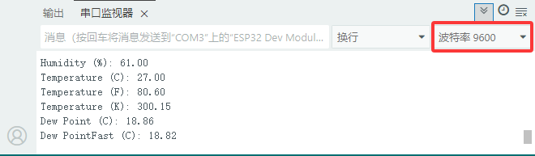


------

## 4.11 光敏传感器

### 4.11.1 简介

本教程将为您详细介绍光敏传感器的使用方法和应用技巧。光敏传感器是一种能够检测环境光强度的电子元件，常用于自动照明控制、光强监测和节能系统。教程内容包括光敏传感器的工作原理、类型（如光敏电阻、光电二极管）、电路连接方法以及如何通过微控制器（如ESP32）读取光强数据。您将学习如何编写代码来获取实时光强值，并根据光强变化触发相应的控制动作，如自动开关灯、调节屏幕亮度等。无论您是电子初学者还是有经验的开发者，本教程都将帮助您掌握光敏传感器的应用，为您的项目增添智能的光感应功能。

### 4.11.2 元件知识


**光敏传感器:** 也称光电传感器，是利用光电器件把光信号转换成电信号的一种传感器。其中最核心的是传感器模块上有一颗光敏电阻。光敏电阻是利用硫化镉或硒化镉等半导体材料的光电导效应制成的一种电阻值随入射光的强弱而改变的电阻器。光照愈强，阻值就愈低，随着光照强度的升高，电阻值迅速降低，亮电阻值可小至1KΩ以下。光敏电阻对光线十分敏感，其在无光照时，呈高阻状态，暗电阻一般可达1.5MΩ。

**原理图：**


当没有光照射时，电阻大小约为0.5 MΩ，光敏电阻的信号端（2脚）检测的电压接近0。当光照到光敏电阻时，随着光照强度增大，光敏电阻的阻值越来越小，VCC电压从光敏电阻通过的电压就越大，所以信号端S能检测到的电压也越来越大。

**参数：**

- 工作电压: DC 3.3V~5V
- 工作电流: (Max)0.2mA@5V
- 最大功率: 0.001W
- 光谱峰值: 540nm
- 亮电阻(10lux): 5~10KΩ
- 暗电阻: 0.5MΩ


### 4.11.3 接线图

**模块连接到io34**

**注意使用连接线连接时，黄色线为S信号线，红色线为V电源线，黑色线为GND，颜色一一对应，请勿插反！**


### 4.11.4 实验代码

代码文件在`Arduino_代码`文件夹中（<u>路径：重要资源\程序代码\Arduino_代码</u>），代码文件为`4_11_Photoresistor`，如图：

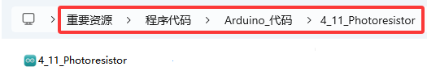

鼠标双击`4_11_Photoresistor.ino`即可在Arduino IDE中打开。

```c
/*
 * 文件名 : 4_11_Photoresistor
 * 功能   : 读取光敏传感器的值
 * 编译IDE：ARDUINO 2.3.5
 * 作者   : https://www.keyesrobot.cn/
*/

const int Photoresistor_Pin = 34;   //光敏电阻的引脚定义为GPIO34

void setup() {
  //初始化串口
  Serial.begin(9600);
  //设置光敏引脚为输入模式
  pinMode(Photoresistor_Pin,INPUT);
}

void loop() {
  //读取光敏传感器的值
  int ReadValue = analogRead(Photoresistor_Pin);
  //打印值，注意：ESP32开发板是12-bit的ADC，读取到的值范围：0~4095
  Serial.print("Photoresistor value: ");
  Serial.println(ReadValue);
  delay(500);
}
```

### 4.11.5 实验结果

按照接线图接好线，选择好正确的开发板板型（ESP32 Dev Module）和 适当的串口端口（COMxx），然后单击按钮上传代码。上传代码成功后，单击Arduino IDE右上角的打开串监视器串口并设置串口波特率为`9600`, 即可通过串口打印窗口查看光敏传感器的模拟值，光线越亮模拟值越高，光线越暗模拟值越低，用手遮住光线模拟环境光线变暗。（如果你对上传代码存在疑惑，请查看教程的`1.7 使用Arduino IDE上传第一个程序`)

**串口现象图：**

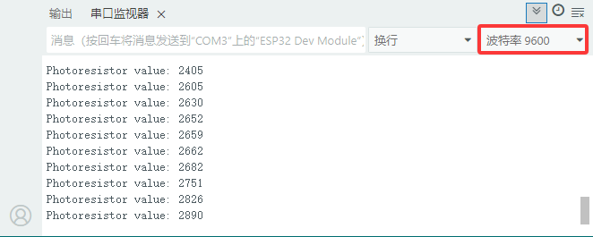

### 4.11.6 代码说明

（1）.  定义光敏传感器的模拟管脚为GPIO34。

```c++
const int Photoresistor_Pin = 34;   //定义光敏传感器引脚
```

（2）. 在`setup()`函数中，设置串口波特率，并且将光敏传感器引脚设置为输入模式。

```c++
void setup() {
  //初始化串口
  Serial.begin(9600);
  //设置光敏引脚为输入模式
  pinMode(Photoresistor_Pin,INPUT);
}
```

3\. 在`loop()`函数中，从光敏传感器指定的模拟引脚读取模拟值。为了兼容ESP32 主控板，设置 `analogRead()` 的分辨率为 12 位。从指定的模拟引脚 PhotocecllPin 读取光敏传感器的模拟信号，模拟信号的范围：0 ~ 4095，并且在串口监视器窗口打印模拟信号。

```c++
void loop() {
  //读取光敏传感器的值
  int ReadValue = analogRead(Photoresistor_Pin);
  //打印值，注意：ESP32开发板是12-bit的ADC，读取到的值范围：0~4095
  Serial.print("Photoresistor value: ");
  Serial.println(ReadValue);
  delay(500);
}
```

详细了解请参考链接：[https://vimsky.com/examples/usage/arduino-language-functions-analog-io-analogread-ar.html](https://vimsky.com/examples/usage/arduino-language-functions-analog-io-analogread-ar.html) 。

-----------

## 4.12 水滴传感器

### 4.12.1 简介

本教程将为您详细介绍水滴传感器的使用方法和应用技巧。水滴传感器是一种能够检测水存在的传感器，广泛应用于雨水检测等领域。教程内容包括水滴传感器的工作原理、引脚功能、电路连接方法以及如何通过微控制器（如ESP32）读取雨水量的模拟值。您将学习如何编写代码来传感器上实时雨水量的多少。无论您是电子初学者还是有经验的开发者，本教程都将帮助您掌握水滴传感器的应用，为您的项目增添精确的雨水检测功能。

### 4.12.2 元件知识

**水滴传感器：** 是一种可用于检测水的存在的传感器，它通常用于雨水检测系统。当雨水接触到传感器上的导电垫（检测区）时，它会向开发板(例如：Arduino主板，ESP32主板等)发送信号，以触发各种动作。

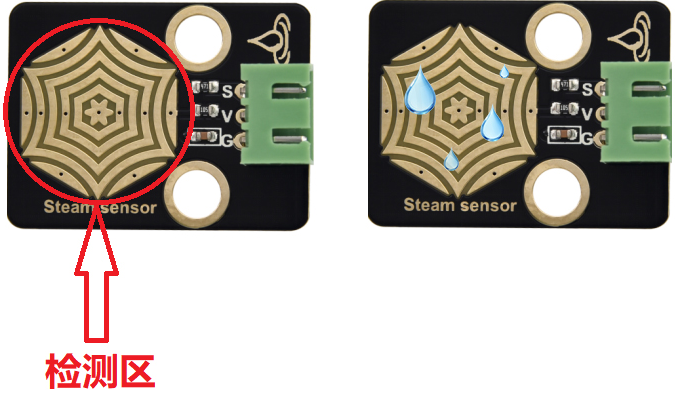

------

**原理图：**


水滴传感器通过电路板上裸露的印刷平行线检测水量的大小。水量越多，就会有更多的导线被联通，随着导电的接触面积增大，雨滴感应区 2 脚输出的电压就会逐步上升。信号端 S 检测到的模拟值就越大。除了可以检测水量的大小，它还可以检测空气中的水蒸气。

------

**参数：**

- 工作电压: DC 3.3V~5V
- 工作电流: (Max) 1.5mA@5V
- 最大功率: 0.075W
- 信号类型: 模拟信号

### 4.12.3 接线图

**模块连接到io35**

**注意使用连接线连接时，黄色线为S信号线，红色线为V电源线，黑色线为GND，颜色一一对应，请勿插反！**

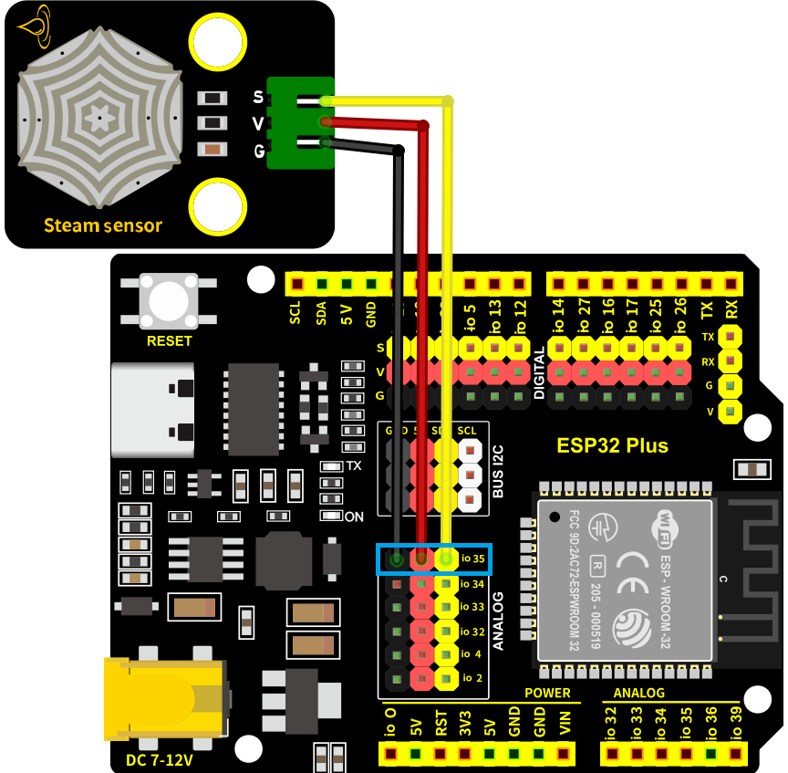

### 4.12.4 实验代码

代码文件在`Arduino_代码`文件夹中（<u>路径：重要资源\程序代码\Arduino_代码</u>），代码文件为`4_12_Steam-Sensor`，如图：

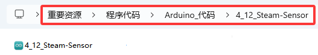

鼠标双击`4_12_Steam-Sensor.ino`即可在Arduino IDE中打开。

```c
/*
 * 文件名 : 4_12_Steam-Sensor
 * 功能   : 读取水滴传感器的值
 * 编译IDE：ARDUINO 2.3.5
 * 作者   : https://www.keyesrobot.cn/
*/

const int SteamPin = 35;   //定义引脚为35

void setup() {
  Serial.begin(9600); //初始化串口
  pinMode(SteamPin,INPUT); //设置水滴传感器引脚为输入模式
}

void loop() {
  //读取水滴传感器的值
  int ReadValue = analogRead(SteamPin);
  Serial.print("Steam Value: ");
  Serial.println(ReadValue);
  delay(500);
}
```

### 4.12.5 实验结果

按照接线图接好线，选择好正确的开发板板型（ESP32 Dev Module）和 适当的串口端口（COMxx），然后单击按钮上传代码。上传代码成功后，单击Arduino IDE右上角的打开串监视器串口并设置串口波特率为`9600`,即可通过串口打印窗口查看水滴传感器的模拟值，用湿润的手指去触碰传感器上的检测区域，触碰的面积越大，接收到的值就越大。（如果你对上传代码存在疑惑，请查看教程的`1.7 使用Arduino IDE上传第一个程序`)


**串口现象图：**

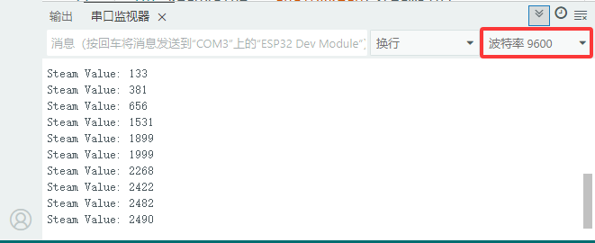

--------

## 4.13 土壤湿度传感器

### 4.13.1 简介

本教程将为您详细介绍土壤湿度传感器的使用方法和应用技巧。土壤湿度传感器是一种用于检测土壤水分含量的电子设备，广泛应用于农业灌溉、园艺和环境监测。教程内容包括土壤湿度传感器的工作原理、引脚功能、电路连接方法以及如何通过微控制器（如ESP32）读取和处理湿度数据。您将学习如何编写代码来实现实时湿度监测、自动灌溉控制以及数据校准和误差修正。无论您是电子初学者还是有经验的开发者，本教程都将帮助您掌握土壤湿度传感器的应用，为您的项目增添智能的土壤水分管理功能。

### 4.13.2 元件知识

**土壤湿度传感器:** 通过检测土壤的电导率变化来测量湿度，传感器采用叉形设计，方便插入土壤。传感器插入土壤后，当土壤缺水时，电导率降低，传感器输出的模拟值减小；当土壤湿润时，电导率增加，传感器输出的模拟值增大。这种传感器简单实用，适合用于农业灌溉、园艺等场景。


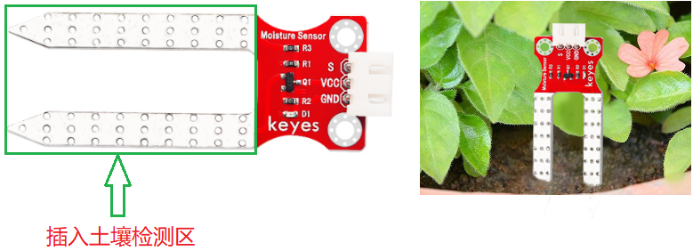


**原理图：**

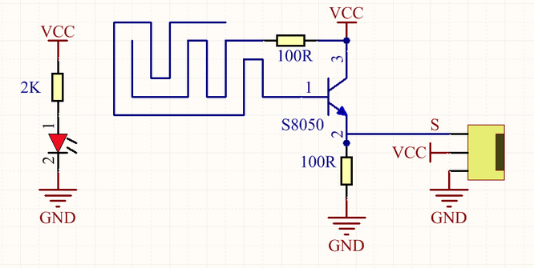

**参数：**

- 工作电压: DC 3.3V~5V
- 信号类型: 模拟信号

### 4.13.3 接线图

**传感器连接到io32**

**注意使用连接线连接时，黄色线为S信号线，红色线为V电源线，黑色线为GND，颜色一一对应，请勿插反！**


### 4.13.4 实验代码

代码文件在`Arduino_代码`文件夹中（<u>路径：重要资源\程序代码\Arduino_代码</u>），代码文件为`4_13_Soil-Humidity-Sensor`，如图：

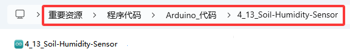

鼠标双击`4_13_Soil-Humidity-Sensor.ino`即可在Arduino IDE中打开。

```c
/*
 * 文件名 : 4_13_Soil-Humidity-Sensor
 * 功能   : 读取土壤湿度传感器的值
 * 编译IDE：ARDUINO 2.3.5
 * 作者   : https://www.keyesrobot.cn/
*/

const int SoilHumidityPin = 32; //定义土壤湿度传感器引脚为32

void setup() {
  Serial.begin(9600); //初始化串口
  pinMode(SoilHumidityPin,INPUT); //设置土壤湿度传感器引脚为输入模式
}

void loop() {
  //读取土壤湿度传感器的值，并且定义一个变量用来存储土壤湿度传感器的值
  int ReadValue = analogRead(SoilHumidityPin);
  Serial.print("SoilHumidity Value: ");
  Serial.println(ReadValue);
  delay(500);
}
```

### 4.13.5 实验结果

按照接线图接好线，选择好正确的开发板板型（ESP32 Dev Module）和 适当的串口端口（COMxx），然后单击按钮上传代码。上传代码成功后，单击Arduino IDE右上角的打开串监视器串口并设置串口波特率为`9600`,即可通过串口打印窗口查看土壤湿度传感器的模拟值，如果你没有盆栽可以用纸巾用水轻微打湿土壤湿度传感器的检测区。（如果你对上传代码存在疑惑，请查看教程的`1.7 使用Arduino IDE上传第一个程序`)

**串口现象图：**

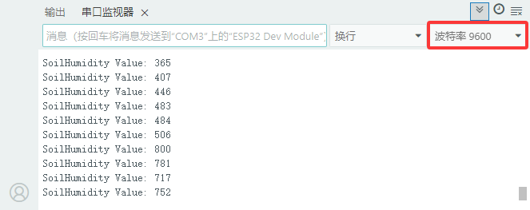

------------

## 4.14 水位传感器

### 4.14.1 简介

本教程将为您详细介绍水位传感器的使用方法和应用技巧。水位传感器是一种用于检测液体高度的电子设备，广泛应用于水塔监控、水箱管理和环境监测。教程内容包括水位传感器的工作原理、引脚功能、电路连接方法以及如何通过微控制器（如ESP32）读取和处理水位数据。您将学习如何编写代码来实现实时水位监测、自动报警以及数据校准和误差修正。无论您是电子初学者还是有经验的开发者，本教程都将帮助您掌握水位传感器的应用，为您的项目增添精确的液体高度检测功能。

### 4.14.2 元件知识

**水位传感器：** 与土壤传感器的原理相同都是通过检测电导率变化来测量。水面淹没的传感器感应区越少，电导率降低，传感器输出的模拟值减小；水面淹没的传感器感应区越多，电导率增加，传感器输出的模拟值增大。这种传感器简单实用，适合用于农业灌溉、园艺等场景。

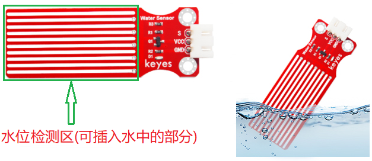

**原理图：**

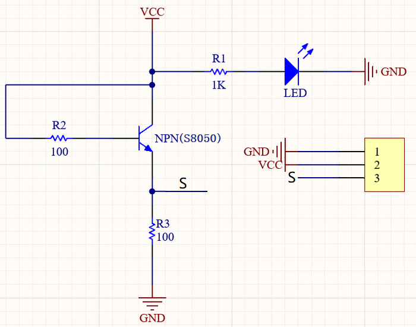

注意：不要让传感器的元器件碰到水，可能会损害传感器以及开发板 

### 4.14.3 接线图

**传感器连接到io33**

**注意使用连接线连接时，黄色线为S信号线，红色线为V电源线，黑色线为GND，颜色一一对应，请勿插反！**

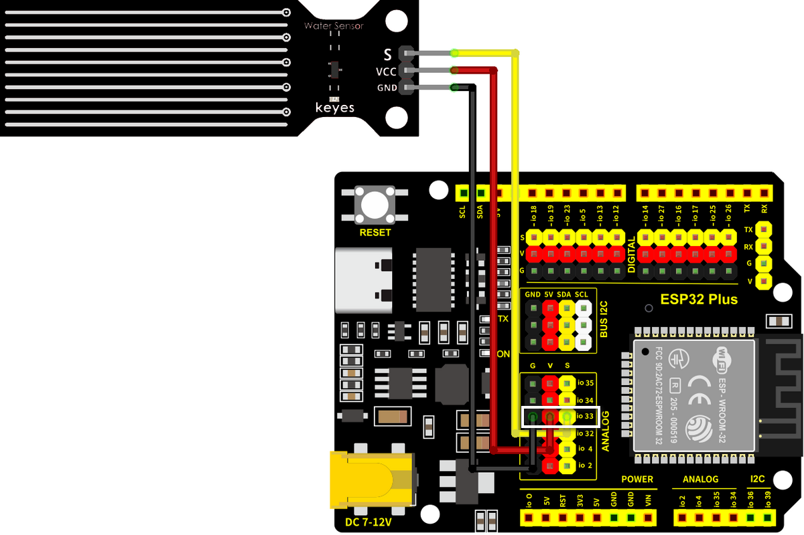

### 4.14.4 实验代码

代码文件在`Arduino_代码`文件夹中（<u>路径：重要资源\程序代码\Arduino_代码</u>），代码文件为`4_14_Water-Level-Sensor`，如图：

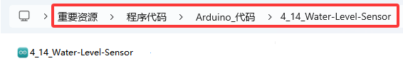

鼠标双击`4_14_Water-Level-Sensor.ino`即可在Arduino IDE中打开。

```c
/*
 * 文件名 : 4_14_Water-Level-Sensor
 * 功能   : 读取水位传感器的值
 * 编译IDE：ARDUINO 2.3.5
 * 作者   : https://www.keyesrobot.cn/
*/

const int WaterLevelPin = 33; //定义水位传感器引脚为33

void setup() {

  Serial.begin(9600); //初始化串口
  pinMode(WaterLevelPin,INPUT); //设置水位传感器引脚为输入模式
}

void loop() {
//读取水位传感器的值，并且定义一个变量用来存储土水位传感器的值
  int ReadValue = analogRead(WaterLevelPin);
  Serial.print("WaterLevel Value: ");
  Serial.println(ReadValue);
  delay(500);
}
```

### 4.14.5 实验结果

按照接线图接好线，选择好正确的开发板板型（ESP32 Dev Module）和 适当的串口端口（COMxx），然后单击按钮上传代码。上传代码成功后，单击Arduino IDE右上角的打开串监视器串口并设置串口波特率为`9600`, 即可通过串口打印窗口查看水位传感器的模拟值，将水位传感器放置到容器中然后往容器中加水，注意不要超过安全线。（如果你对上传代码存在疑惑，请查看教程的`1.7 使用Arduino IDE上传第一个程序`)

**串口现象图：**

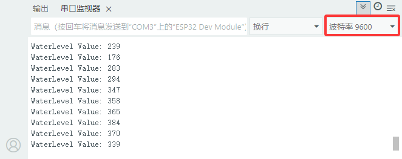

----------


## 4.15 IIC 1602 LCD显示屏

### 4.15.1 简介

本教程将为您详细介绍IIC 1602 LCD显示屏的使用方法和应用技巧，该显示屏采用PCF8574T驱动芯片，背光 (蓝色背景和白色背光)。教程内容包括IIC 1602 LCD显示屏的工作原理、引脚功能、电路连接方法以及如何通过微控制器（如ESP32）控制显示内容。您将学习如何编写代码来显示数字、字母、符号、ASCII码等和屏幕清屏。无论您是电子初学者还是有经验的开发者，本教程都将帮助您掌握IIC 1602 LCD显示屏的应用，为您的项目增添清晰、生动的视觉显示功能。

### 4.15.2 元件知识

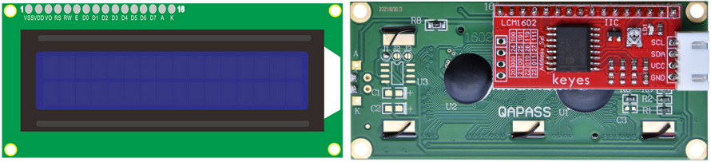

LCD1602显示屏：显示屏有LCD 1602液晶显示屏和I2C 1602 LCD。但是我们在这个项目中使用的是一个I2C  LCD 1602。LCD 1602显示屏可以显示16列2行字符。它能够显示数字、字母、符号、ASCII码等。如下所示是一个单色LCD1602显示屏（在工作时需要占用控制板的7个IO口）及其电路引脚图：

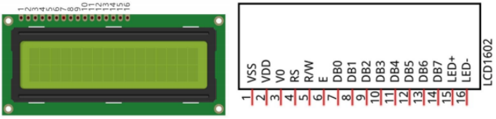

I2C LCD1602显示屏集成了I2C接口，连接的串行输入&并行输出给LCD1602显示屏模块。这使得我们只要使用4条线路就可以来操作LCD1602。

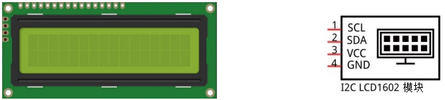

本模块使用的IC芯片为PCF8574T (PCF8574AT)，其默认I2C地址为0x27(0x3F)。

在1602 LCD的背面有一个<span style="color: rgb(255, 76, 65);">金属电位器</span>。你可以用一字螺丝刀转动电位器来调整对比度。         


<span style="color: rgb(255, 76, 65);">请注意：</span>当你旋转电位器时，屏幕将变得更亮或更暗，适当的角度将使字体更清晰。

**I2C 1602 LCD 原理图：**


**I2C 1602 LCD技术参数：**

- 显示像素：16 * 2 字符
- 芯片工作电压：4.5 ~ 5.5V
- 工作电流：2.0mA (5.0V)
- 模块最佳工作电压：5.0V
- I2C 地址：0x27
- 背光 (蓝色背景和白色背光)
- 背后的接线引脚分别为GND、VCC、SDA、SCL（SDA和SCL分别为IIC通讯的数据线和时钟线）。

**I2C 地址：**

默认地址基本上是 0x27，在少数情况下可能是 0x3F。

以默认地址 0x27 为例，可以通过短接 A0/A1/A2 焊盘来修改设备地址; 在默认状态下，A0/A1/A2 为 1，如果焊盘短路，则 A0/A1/A2 为 0。

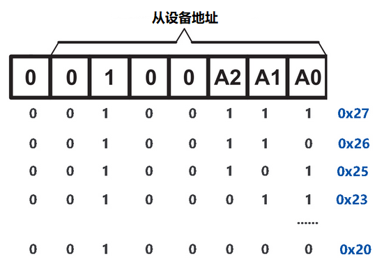

**对比度：**

背面的电位器用于调整对比度（最亮的白色和最暗的黑色之间的亮度比）。

电位器 ：用于调整对比度（显示文本的清晰度），对比度在顺时针方向上增加，在逆时针方向上减少。


**I2C串行通信：**

I2C通信协议是Inter-Integrated Circuit（IIC）的缩写，也叫作两线制或TWI（Two-Wire Interface），是一种通用的主从式的两线总线通信协议，它是由Philips Semiconductor公司开发的（现在被美国NXP半导体公司收购）。

其最大的优点是只需要两根线就可以完成数据的传输，对于系统线路的繁琐也减少了很多，这种总线可以并行联结127个节点，并且支持多主机，从机一般不需要外接电源，因为I2C总线可以把电源传输到从机。如下图：


I2C总线的数据传输采用8位数据传输的方式，通常一个字节的数据传输是由9个时钟信号组成，8个时钟信号传输数据，最后一个时钟信号用于传输结束的标志。同时，I2C总线也支持多字节的数据传输，不断重复上述过程，即可完成多字节的数据传输。

I2C协议的基本组成部分包括以下内容：

- 起始信号：在发送数据之前，发送方必须发送起始信号，以告知接收方，要发送数据了。

- 地址码：地址码用于告知接收方，要发送的数据是给谁的。

- 数据：数据按照位传输，每次传输一个字节的数据。

- 停止信号：发送完数据后，发送方必须发送停止信号，以告知接收方，数据发送完毕。

Arduino提供了一个名为Wire.h的I2C协议集成库，可以通过调用其函数实现I2C通信，从而实现与I2C/TWI设备的通信。

具体库介绍参考官网链接：
[https://www.arduino.cc/reference/en/language/functions/communication/wire/](https://www.arduino.cc/reference/en/language/functions/communication/wire/)

### 4.15.3 接线图

**模块连接到 BUS I2C**

**注意使用连接线连接时，黄色线为S信号线，红色线为V电源线，黑色线为GND，颜色一一对应，请勿插反！**


### 4.15.4 实验代码

<span style="color: rgb(255, 76, 65);">注意：</span> 上传代码前要添加库文件，库文件存放在`库文件`文件夹中名为`LiquidCrystal_I2C.zip`：（如果你对安装库文件有疑问请查看教程的`2. 给Arduino IDE安装库文件`）

代码文件在`Arduino_代码`文件夹中（<u>路径：重要资源\程序代码\Arduino_代码</u>），代码文件为`4_15_LCD1602`，如图：

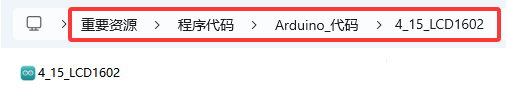

鼠标双击`4_15_LCD1602.ino`即可在Arduino IDE中打开。

```c
/*
 * 文件名 : 4_15_LCD1602
 * 功能   : LCD1602显示
 * 编译IDE：ARDUINO 2.3.5
 * 作者   : https://www.keyesrobot.cn/
*/

#include <LiquidCrystal_I2C.h>

//初始化LCD1602，其中0x27为I2C地址
//I2C接口:SDA引脚接SDA(IO21), SCL引脚接SCL(IO22)
LiquidCrystal_I2C lcd(0x27,16,2);

void setup() {
  //LCD初始化
  lcd.init();
  // 打开/关闭（可选）背光
  lcd.backlight();
  //lcd.noBacklight();

  //设置位置
  lcd.setCursor(0, 0);
  //显示
  lcd.print("HELLO WORLD 0");
  lcd.setCursor(0, 1);
  lcd.print("HELLO WORLD 1");

  //清空显示
  // lcd.clear();
}

void loop() {

  // Turn the display on/off (quickly)
  //lcd.noDisplay();
  //lcd.display();

  // Turns the underline cursor on/off
  //lcd.noCursor();
  //lcd.cursor();

  // Turn on and off the blinking cursor
  // lcd.noBlink();
  // lcd.blink();

  // These commands scroll the display without changing the RAM
  //lcd.scrollDisplayLeft();
  //lcd.scrollDisplayRight();

  // This is for text that flows Left to Right
  //lcd.leftToRight();
  //lcd.rightToLeft();

  // This will 'right justify' text from the cursor
  //lcd.autoscroll();
  //lcd.noAutoscroll();
}

### 4.15.5 实验结果

按照接线图接好线，选择好正确的开发板板型（ESP32 Dev Module）和 适当的串口端口（COMxx），然后单击按钮上传代码。上传代码成功后，IIC LCD 1602 显示屏会打开背光，并显示两行文字 “**HELLO WORLD 0**” 和 “**HELLO WORLD 1**”.（如果你对上传代码存在疑惑，请查看教程的`1.7 使用Arduino IDE上传第一个程序`）


<span style="color: rgb(255, 76, 65);">注意：</span>如果代码和接线正确，但 LCD 仍然无法显示任何内容，则可以调整背面的电位器以增加对比度。


### 4.15.6 代码说明

（1）. 通过调用库 `LiquidCrystal_I2C.h`，您可以轻松驱动 LCD 1602。
 
```c++                  
#include <LiquidCrystal_I2C.h>
```
库功能：

- 创建 `LiquidCrystal_I2C` 类，该类表示连接到开发板的特定 LCD 1602 。

   - LiquidCrystal_I2C(uint8_t lcd_Addr,uint8_t lcd_cols,uint8_t lcd_rows)

     - `lcd_Addr`：LCD 1602 的地址默认为 0x27。

     -  `lcd_cols`：LCD 1602有 16 列。

     -  `lcd_rows`：LCD 1602 有 2 行。

（2）. 初始化 LCD 1602。

```c++
void init()
```

（3）. 打开（可选）背光灯。

```c++
void backlight()
```

（4）. 关闭（可选）背光。

```c++
void nobacklight()
```

（5）. 打开 LCD 1602 显示屏。

```c++
void display()
```

（6）. 快速关闭 LCD 1602 显示屏。

```c++
void nodisplay()
```

（7）. 清除显示，将光标位置设置为零。

```c++
void clear()
```

（8）. 将光标位置设置为 X行、X列。

```c++
void setCursor(uint8_t col,uint8_t row)
```

（9）. 将文本打印到 LCD 1602 显示屏上。

```c++
void print(data,BASE)
```
- `data`：要打印的数据（char、byte、int、long 或 string）。

- `BASE` (可选)：打印数字的底数。

   - `BIN`: 对于二进制 （以 2 为底数）

   - `DEC`: 对于十进制（以 10 为底数）

   - `OCT`: 对于八进制（以 8 为底数）

   - `HEX`: 对于十六进制（以 16 为底数）。

---------

# 5. 综合教程

## 5.1 照明系统

### 5.1.1 简介

在前面的教程中，已经了解过LED，按键模块和语音控制模块的工作原理和应用，在本项目中，使用按键模块或语音控制模块来控制LED，实现自动化语音控制LED亮灭和手动式按键控制LED。

本课程带领大家，了解如何使用Arduino ESP32开发板实现照明控制系统，模拟现实生活场景，除了通过按钮控制LED的开与关来实现手动式按键控制LED亮灭，还可以通过语音控制模块来控制LED的开与关来实现自动化语音控制LED亮灭。

------

**2\. 接线图:**

**按键模块连接到io5，LED模块连接到io27**

**注意: 使用连接线连接时，黄色线为S信号线，红色线为V电源线，黑色线为GND，颜色一一对应，请勿插反！**

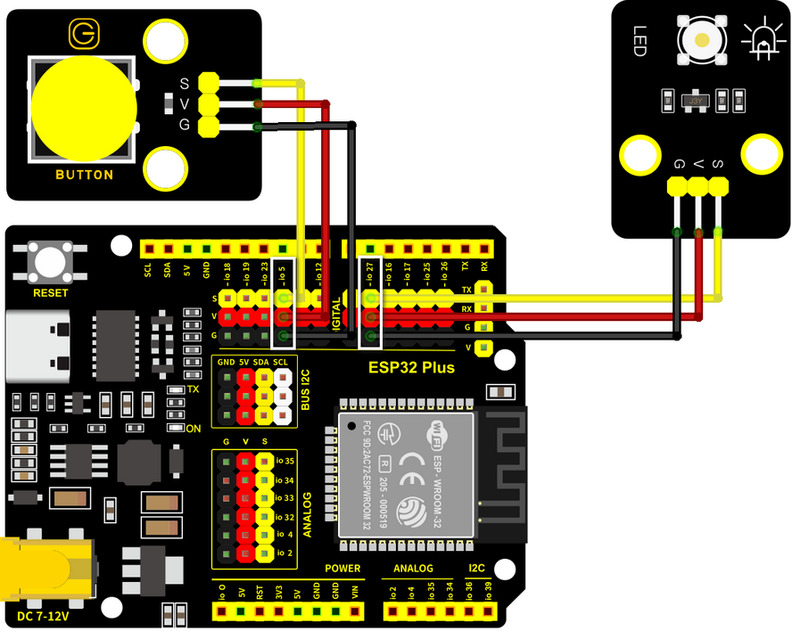

------

**3\. 代码流程图:**

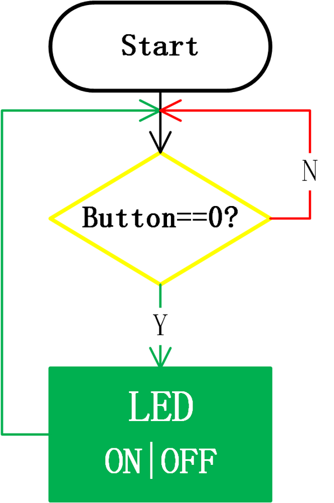

------

**4\. 实验代码：**

打开Arduino IDE，选择对应的开发板板型（ESP32 Dev Module）和 适当的串口端口（COMxx）。

.png)

------

在Arduino IDE中，编写如下代码：

```c++
/*
 * 文件名 : Lighting-System
 * 功能   : 结合按键和LED模拟照明系统
 * 编译IDE：ARDUINO 2.3.3
 * 作者   : https://www.keyestudio.com/
*/

#define ButtonPin 5   //定义按键引脚
#define LED       27  //定义LED引脚
int value = 0;        //定义一个判断按键的值

void setup() {
  //初始化串口并设置波特率为9600
  Serial.begin(9600);
  //设置引脚为输入模式
  pinMode(ButtonPin,INPUT);
  //设置引脚为输出模式
  pinMode(LED,OUTPUT);
}

void loop() {
  //定义一个值，存储读取到的按键值
  int ReadValue = digitalRead(ButtonPin); 
  //判断按钮是否被按下
  if (ReadValue == 0) {
    //软件去按键抖动
    delay(10);  
    if (ReadValue == 0) {
      value = !value;
      //判断按钮的状态，按一次为点亮LED，再按为熄灭LED，一直如此循环
      if(value) {
        digitalWrite(LED,HIGH);
      }else{
        digitalWrite(LED,LOW);
      }
    }
    //再次判断按钮，是否还处于按下状态
    //处于按下时：一直空循环，处于松开时：执行下一步
    while (digitalRead(ButtonPin) == 0); 
    delay(10);
  }
}
```

------

**3\. 实验结果：**

选择好正确的开发板板型（ESP32 Dev Module）和 适当的串口端口（COMxx），然后单击按钮上传代码。上传代码成功后，当第一次按下按键时，打开LED，第二次按下时，关闭LED，第三次按下时又打开LED...，依次循环开关LED，和现实生活中的LED开关一致。

------

**4\. 代码解释：**

可以参照前面的课程的代码说明，这里就不多做介绍了。

------

在本章的入门Arduino教程中，我们了解了如何使用Arduino IDE进行编程和控制。我们学习了基础知识、掌握了重要的软件和硬件概念，同时也实践了一些小项目，如自锁按钮和照明控制系统。

这些都是成为一名优秀的Arduino开发者所必须掌握的基础知识。接下来，我们将继续深入学习，探索更多的应用和技能。不论您是初学者还是有经验的开发者，学习Arduino都是一项非常有趣和充满挑战的事情，让我们继续前进。

------

### 常见问题解答:

**1\. 问：烧录了代码LED不亮？**

答：请确认代码中的引脚，和现实模块接线是否一致，如有错误，请正确按照代码中的引脚，进行接线即可。

------

**2\. 问：按键不灵敏？有时候能检测的到，有时候检测不到？**

答：修改按键去抖动的延时，设置到合适的延时。

```c++
 //软件去按键抖动
    delay(10);  //修改此项
```

------

## 第二课：光控系统

这个系统是由光敏传感器和LED灯组成的光控系统，可以实现智能化的灯光控制，节约能源并提高使用效率。


这种系统广泛应用于不同场景，并且通过使用光敏传感器，实现自动检测白天和黑夜以及光的强度，使得整个系统更加智能化和节能。

当环境亮度低于设定值时，光敏传感器会检测到信号，从而自动打开LED灯；当环境亮度高于设定值时，光敏传感器会发送另一个信号，从而关闭LED灯。

------

### 光控系统流程：

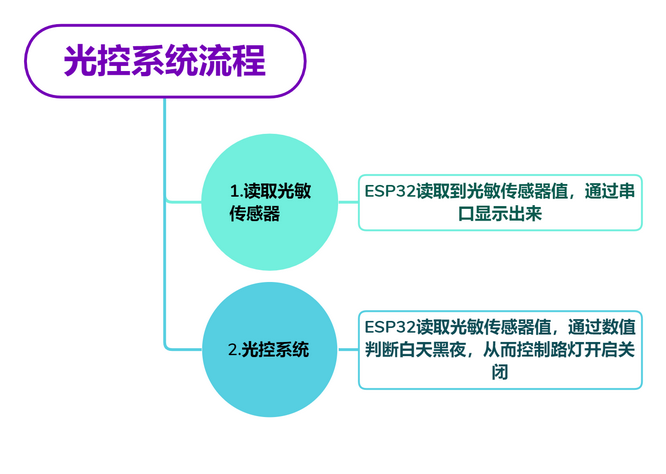

------

### 光敏传感器:

**1\. 概述:**

光敏传感器也称光电传感器，是利用光电器件把光信号转换成电信号（电压，电流，电阻等）的一种传感器。其中最核心的是电路中，有一颗光敏电阻。

------

**2\. 光敏传感器的知识:**

**光敏传感器工作原理：** 光敏传感器上的光敏电阻元件串联进电路，在光敏电阻元件的两端加入合适的电压，在没有光照的时候，电阻无穷大，接近断路；有光照时阻值减少，电流增大，足够光照强度时相当于短路。

接下来我们通过使用ESP32开发板，编写代码来读取光敏传感器的值。

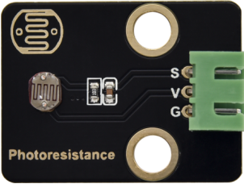

------

**原理图：**

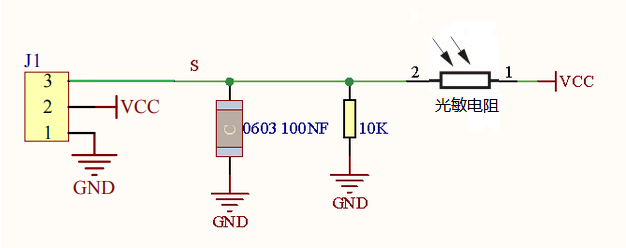

当没有光照射时，电阻大小约为0.5 MΩ，光敏电阻的信号端（2脚）检测的电压接近0。当光照到光敏电阻时，随着光照强度增大，光敏电阻的阻值越来越小，VCC电压从光敏电阻通过的电压就越大，所以信号端S能检测到的电压越来越大。

**参数：**

- 工作电压: DC 3.3V~5V
- 工作电流: (Max)0.2mA@5V
- 最大功率: 0.001W
- 光谱峰值: 540nm
- 亮电阻(10lux): 5~10KΩ
- 暗电阻: 0.5MΩ

------

**3\. 接线图：**

**模块连接到io34**

**注意使用连接线连接时，黄色线为S信号线，红色线为V电源线，黑色线为GND，颜色一一对应，请勿插反！**


------

**4\. 实验代码：**

打开Arduino IDE，选择对应的开发板板型（ESP32 Dev Module）和 适当的串口端口（COMxx）。

.png)

------

在Arduino IDE中，编写如下代码：

------

```c++
/*
 * 文件名 : Photocell-sensor
 * 功能   : 读取光敏传感器的值
 * 编译IDE：ARDUINO 2.3.3
 * 作者   : https://www.keyestudio.com/
*/

#define PhotocecllPin 34  //定义光敏传感器引脚

void setup() {
  //初始化串口
  Serial.begin(9600);
  //设置光敏引脚为输入模式
  pinMode(PhotocecllPin,INPUT);
}

void loop() {
  //读取光敏传感器的值
  int ReadValue = analogRead(PhotocecllPin);
  //打印值，注意：ESP32开发板是12-bit的ADC，读取到的值范围：0~4095
  Serial.print("Photocecll value: ");
  Serial.println(ReadValue);
  delay(500);
}

```
------

**5\. 实验结果：**

选择好正确的开发板板型（ESP32 Dev Module）和 适当的串口端口（COMxx），然后单击按钮上传代码。上传代码成功后，打开串口，设置好波特率为9600，当光敏传感器检测到的光线越亮时，接收到的数值越大，反之相反。

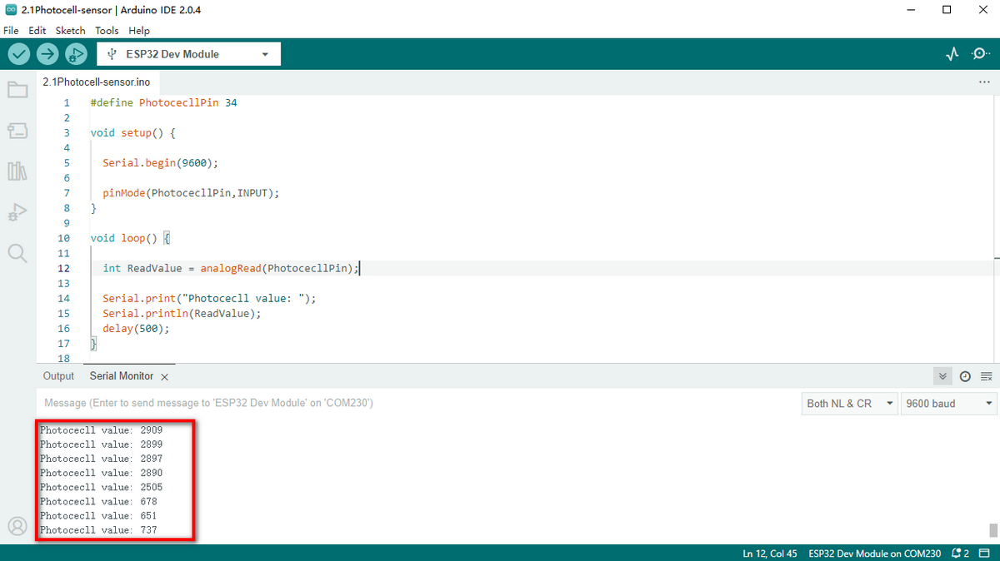

------

 **6\. 代码说明：**

（1）.  定义光敏传感器的模拟管脚为GPIO34。

```c++
#define PhotocecllPin 34  //定义光敏传感器引脚
```

（2）. 在`setup()`函数中，设置串口波特率，并且将光敏传感器引脚设置为输入模式。

```c++
void setup() {
  //初始化串口
  Serial.begin(9600);
  //设置光敏引脚为输入模式
  pinMode(PhotocecllPin,INPUT);
}
```

3\. 在`loop()`函数中，从光敏传感器指定的模拟引脚读取模拟值。为了兼容ESP32 主控板，设置 `analogRead()` 的分辨率为 12 位。从指定的模拟引脚 PhotocecllPin 读取光敏传感器的模拟信号，模拟信号的范围：0 ~ 4095，并且在串口监视器窗口打印模拟信号。

```c++
void loop() {
  //读取光敏传感器的值
  int ReadValue = analogRead(PhotocecllPin);
  //打印值，注意：ESP32开发板是12-bit的ADC，读取到的值范围：0~4095
  Serial.print("Photocecll value: ");
  Serial.println(ReadValue);
  delay(500);
}
```

详细了解请参考链接：[https://vimsky.com/examples/usage/arduino-language-functions-analog-io-analogread-ar.html](https://vimsky.com/examples/usage/arduino-language-functions-analog-io-analogread-ar.html) 。

### 光控系统:

**1\. 概述:**

在前面的教程中，我们已经学习过关于光敏传感器和LED灯的工作原理。那么，在本教程中将带领大家，了解如何使用Arduino ESP32开发板实现照明控制系统，模拟现实生活场景，通过光敏传感器控制LED灯的开与关。


**2\. 接线图：**

**光敏传感器连接到io34，LED模块连接到io27**

**注意使用连接线连接时，黄色线为S信号线，红色线为V电源线，黑色线为GND，颜色一一对应，请勿插反！**


------

**3\. 代码流程图:**


------

**4\. 实验代码：**

打开Arduino IDE，选择对应的开发板板型（ESP32 Dev Module）和 适当的串口端口（COMxx）。

.png)

------

在Arduino IDE中，编写如下代码：

```c++
/*
 * 文件名 : Light-Control-System
 * 功能   : 结合光敏传感器和LED模拟光控系统
 * 编译IDE：ARDUINO 2.3.3
 * 作者   : https://www.keyestudio.com/
*/

#define PhotocecllPin 34  //定义光敏传感器引脚
#define LED           27  //定义LED引脚

void setup() {
  //初始化串口
  Serial.begin(9600);
  //设置光敏引脚为输入模式
  pinMode(PhotocecllPin,INPUT);
  //设置LED引脚为输出模式
  pinMode(LED,OUTPUT);
}

void loop() {
  //读取光敏传感器的值
  int ReadValue = analogRead(PhotocecllPin);
  //打印值，注意：ESP32开发板是12-bit的ADC，读取到的值范围：0~4095
  Serial.print("Photocecll value: ");
  Serial.println(ReadValue);
  //判断
  //光敏传感器的值 >= 800时，关闭LED
  //光敏传感器的值 < 800时，打开LED
  if(ReadValue >= 800) {
    digitalWrite(LED,LOW);
    Serial.println("LED OFF");
  }
  else{
    digitalWrite(LED,HIGH);
    Serial.println("LED ON");
  }
  delay(100);
}
```
------

**5\. 实验结果：**

选择好正确的开发板板型（ESP32 Dev Module）和 适当的串口端口（COMxx），然后单击按钮上传代码。上传代码成功后，当白天光照较强时，光敏传感器的值大于800时，LED会关闭，当天黑后，光敏传感器的值小于800时，LED会自动打开。

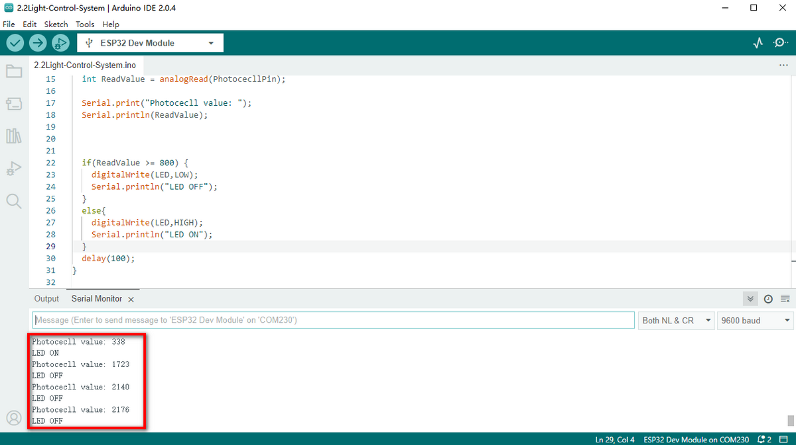

------

**6\. 代码说明：**

可以参照前面的课程的代码说明，这里就不多做介绍了。

------


**这种系统广泛应用于不同场景，并且通过使用光敏传感器，实现自动检测白天和黑夜以及光的强度，使得整个系统更加智能化和节能。**

------

### 常见问题解答:

**1\. 问：光敏传感器检测到的值不能为0？**

答：因为在实际操作中，即使把灯全部关闭，做到室内非常黑，光敏的值也只是无限接近于0

------

**2\. 问：烧录了示例代码，为什么房间关灯了LED还不能亮起来？**

答：可以把判断读取到的光敏传感器，设置大一点，示例中的值为800，可以调至1000，甚至更大。

```c++
//判断
  //光敏传感器的值 >= 800时，关闭LED
  //光敏传感器的值 < 800时，打开LED
  if(ReadValue >= 800) {
    digitalWrite(LED,LOW);
    Serial.println("LED OFF");
  }
  else{
    digitalWrite(LED,HIGH);
    Serial.println("LED ON");
  }
```

------

## 第三课：防盗警报系统

人体红外热释电传感和蜂鸣器组成的防盗报警系统，可以使用ESP32开发板进行控制。使用Arduino IDE进行编程，可以通过读取人体红外热释电传感器，所检测到的红外热释电信号，来确定是否有人在室内。如果有人，则蜂鸣器发出警报声。通过这种方式，可以实现低成本的防盗报警系统，适用于家庭或办公场所。

### 防盗警报系统流程：


------

### 人体红外热释电传感器:

**1\. 概述:**

人体红外热释电传感器是一款基于热释电效应的人体红外传感器，通过检测人体或其他温血动物发射的红外辐射来感知物体的存在，当人体移动引起红外辐射强度变化时，传感器上的热释电元件表面电荷平衡被打破，释放电荷并转化为微电压信号‌。配合菲涅尔透镜能使传感器探测范围更远更广，广泛应用于智能家居、智能安防等领域。


------

**原理图：**

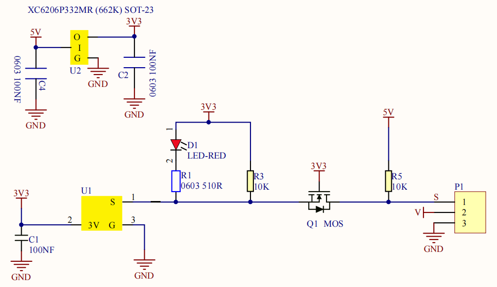

**参数：**

- 工作电压:DC 3.3V~5V
- 工作电流:(Max)3.6mA@5V
- 最大功率:0.018W
- 视野角度：Y = 90°，X = 110°（视野角度为理论数值）
- 探测距离：≤5m
- 控制信号: 数字信号(1/0)

------

**2\. 接线图:**

**模块连接到io23**

**注意使用连接线连接时，黄色线为S信号线，红色线为V电源线，黑色线为GND，颜色一一对应，请勿插反！**


------

**3\. 实验代码：**

打开Arduino IDE，选择对应的开发板板型（ESP32 Dev Module）和 适当的串口端口（COMxx）。

.png)

------

在Arduino IDE中，编写如下代码：

```c++
/*
 * 文件名 : PIR-Motion-Sensor
 * 功能   : 读取人体红外热释电传感器的值
 * 编译IDE：ARDUINO 2.3.3
 * 作者   : https://www.keyestudio.com/
*/

#define PyroelectricPIN 23

void setup() {
  Serial.begin(9600);
  pinMode(PyroelectricPIN,INPUT);
}

void loop() {
  //读取传感器值
  int ReadValue = digitalRead(PyroelectricPIN);
  if(ReadValue){
    Serial.println("Someone");
  }
  else{
    Serial.println("No one");
  }
  delay(100);
}
```

------

**4\. 实验结果：**

选择好正确的开发板板型（ESP32 Dev Module）和 适当的串口端口（COMxx），然后单击按钮上传代码。上传代码成功后，打开串口监视器，设置好波特率为9600。当有人经过传感器时，会显示**Someone**，并且传感器上的红色LED会熄灭，没人时，会一直显示**No one**，传感器上的红色LED会常亮。(<span style="color: rgb(255, 76, 65);">注意：人体红外热释电传感器并没有穿透能力，在检测人体移动时，请不要遮挡传感器。</span>)

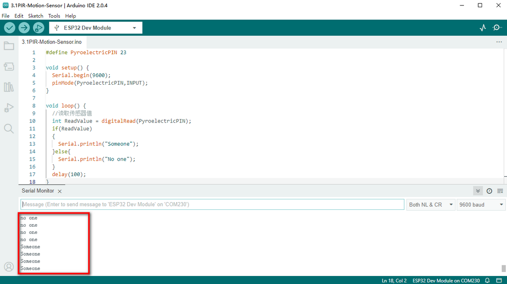

------

**5\. 代码解释：**

可以参照前面的课程（按键开关）的代码说明，这里就不多做介绍了。

------


### 无源蜂鸣器:

**1\. 概述:**

蜂鸣器是一种广泛应用于电子产品中的电子讯响器，以直流电压供电，能够发出不同频率和持续时间的声音。它可以用于计算机、打印机、复印机、报警器、电子玩具、汽车电子设备、电话机、定时器等各种电子设备中，用来发出提醒或警报声。

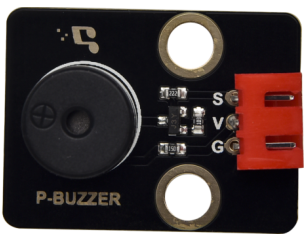

------

**2\. 蜂鸣器知识:**

蜂鸣器的发声原理由**振动装置**和**谐振装置**组成，它分有有源蜂鸣器和无源蜂鸣器。

- **无源蜂鸣器**内部没有振荡源，只有给它一定频率的`方波信号`，才能让蜂鸣器的振动装置`起振`，从而实现发声，同时，输入的方波频率不同，发出的声音也不同（所以无源蜂鸣器可以模拟曲调实现音乐效果）。

  - 引脚的电平变化可以模拟方波，例如引脚高电平持续500微秒后，再变换为低电平500微秒，紧接着再变换为高电平…
  
  - **以2~5KHz的方波去驱动无源蜂鸣器，方波的赫兹可以通过公式 f=1/T，其中f为频率，T为一个完整的周期所用时间（即高低电平各持续的时间之和）来计算。**


<span style="color: rgb(255, 76, 65);">注: 我们提供的无源蜂鸣器的谐振频率为2048Hz，这意味着这个无源蜂鸣器的谐振频率为2048Hz时声音最大。</span>

- **有源蜂鸣器** 是一种集成振荡电路的一体化电子发声器件，可通过直流电压直接驱动发声，无需依赖外部信号源‌。其内部包含驱动电路、振荡器及发声元件，通电后自动产生固定频率的声波，‌即声音单一。

------

**本教程中使用的是无源蜂鸣器，因此可以模拟音乐效果。**

------

**原理图：**


------

**参数：**

- 工作电压: DC 3.3V~5V
- 工作电流: (Max) 30mA@5V
- 最大功率: 0.15W
- 谐振频率: 2048Hz
- 输出音压: (Min)80dB/10cm
- 控制信号: 方波

------


**3\. 接线图:**

**模块连接到io16**

**注意使用连接线连接时，黄色线为S信号线，红色线为V电源线，黑色线为GND，颜色一一对应，请勿插反！**

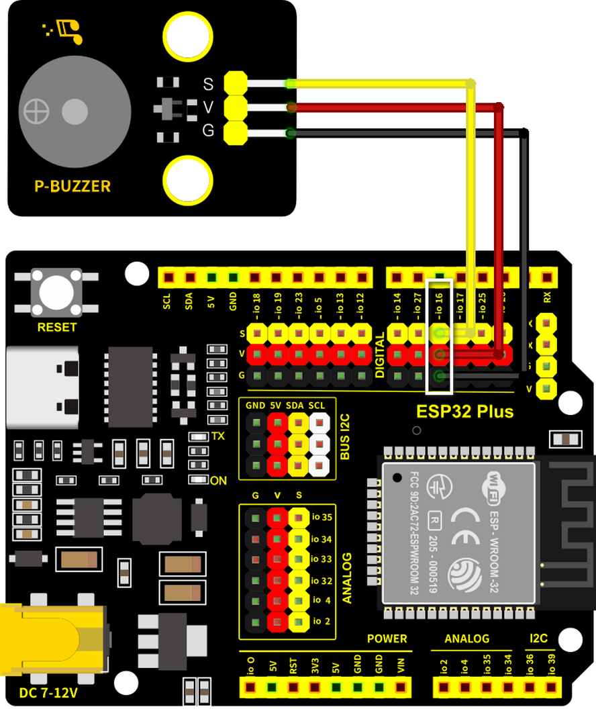

------

**4\. 蜂鸣器驱动方式一：**

无源蜂鸣器都是采用方波驱动的，下面我们就来尝试下模拟方波。

引脚的电平的变高和变低，可以模拟方波：高电平保持500us，然后再变低电平500us，就可以让蜂鸣器发出声音。时间高低电平变化的时间，可以改变蜂鸣器的声音大小。可以试着尝试变为1000us、1500us、3000us…


------

**4.1. 实验代码：**


打开Arduino IDE，选择对应的开发板板型（ESP32 Dev Module）和 适当的串口端口（COMxx）。


------

在Arduino IDE中，编写如下代码：

```c++
/*
 * 文件名 : Passive-Buzzer
 * 功能   : 让无源蜂鸣器发生
 * 编译IDE：ARDUINO 2.3.3
 * 作者   : https://www.keyestudio.com/
*/

#define BuzzerPin 16  //定义蜂鸣器引脚

void setup() {
  //设置为输出模式
  pinMode(BuzzerPin,OUTPUT);
}

void loop() {
  digitalWrite(BuzzerPin,HIGH);
  delayMicroseconds(500);//延时500us
  digitalWrite(BuzzerPin,LOW);
  delayMicroseconds(500);//延时500us
}
```

其中时间暂停函数delayMicroseconds，是微秒级的暂停，delayMicroseconds（500）表示时间暂停500微秒。

delay是毫秒级的，delay（500）表示时间暂停500毫秒，500毫秒=0.5秒。

通过 f=1/T，500us的变换高低电平，可以知道，这样的方波频率为2kHz（即每秒钟变换高低电平的次数为2000次）。

------

**4.2. 实验结果：**

选择好正确的开发板板型（ESP32 Dev Module）和 适当的串口端口（COMxx），然后单击按钮上传代码。上传代码成功后，无源蜂鸣器会持续发出声音。

------


**5\. 蜂鸣器驱动方式二：**

使用tone()函数驱动。

**tone()函数可以产生固定频率的PWM信号来驱动扬声器发声**，发声时间长度和声调都可以通过参数控制。

定义发声时间长度有两种方法，第一种是通过tone()函数的参数来定义发声时长，另一种是使用noTone()函数来停止发声。如果您在使用tone()函数时没有定义发声时间长度，那么除非您通过noTone()函数来停止声音，否则将会一直通过tone()函数产生声音信号。

Arduino一次只能产生一个声音。假如ESP32的某一个引脚正在通过tone()函数产生发声信号，那么此时让ESP32使用另外一个引脚通过tone()函数发声是不行的。

------

**音调表如下**


------


**5.1. 实验代码：**

------

打开Arduino IDE，选择对应的开发板板型（ESP32 Dev Module）和 适当的串口端口（COMxx）。

------

在Arduino IDE中，编写如下代码：

```c++
/*
 * 文件名 : Buzzer-Tone
 * 功能   : 让无源蜂鸣器发出警报声
 * 编译IDE：ARDUINO 2.3.3
 * 作者   : https://www.keyestudio.com/
*/

const int buzzerPin = 16;   //蜂鸣器模块连接引脚16
void setup() {
  pinMode(buzzerPin,OUTPUT);
}
void loop() {
//tone(buzzerPin,294,250,0);  //4个参数分别为，引脚，频率，延时，通道
    tone(buzzerPin,532);           //duo --C5
    delay(100);
    tone(buzzerPin,587);           //re --D5
    delay(100);
    tone(buzzerPin,659);           //mi --E5
    delay(100);
   //警报声
   for(int i = 200; i<=1000; i+=10){ 
    tone(buzzerPin,i);
    delay(10);
   }
    //警报声
   for(int i = 1000; i>=200; i-=10){ 
    tone(buzzerPin,i);
    delay(10);
   }
noTone(buzzerPin);
}
```

------

**5.2. 实验结果：**

选择好正确的开发板板型（ESP32 Dev Module）和 适当的串口端口（COMxx），然后单击按钮上传代码。上传代码成功后，无源蜂鸣器可以发出警报声。

------


**6\. 无源蜂鸣器播放音乐：**

在前面的课程中我们已经知道，无源蜂鸣器在高低电平驱动下可以发声，使用tone()函数驱动可以发出警报声。除此之外，无源蜂鸣器还可以使用tone()函数来播放音乐。

------

**5.1. 实验代码：**

打开Arduino IDE，选择对应的开发板板型（ESP32 Dev Module）和 适当的串口端口（COMxx）。

------

在Arduino IDE中，编写如下代码：

```c++
/*
 * 文件名 : Buzzer-Music
 * 功能   : 让无源蜂鸣器播放音乐.
 * 编译IDE：ARDUINO 2.3.3
 * 作者   : https://www.keyestudio.com/
*/

#define NOTE_B0  31
#define NOTE_C1  33
#define NOTE_CS1 35
#define NOTE_D1  37
#define NOTE_DS1 39
#define NOTE_E1  41
#define NOTE_F1  44
#define NOTE_FS1 46
#define NOTE_G1  49
#define NOTE_GS1 52
#define NOTE_A1  55
#define NOTE_AS1 58
#define NOTE_B1  62
#define NOTE_C2  65
#define NOTE_CS2 69
#define NOTE_D2  73
#define NOTE_DS2 78
#define NOTE_E2  82
#define NOTE_F2  87
#define NOTE_FS2 93
#define NOTE_G2  98
#define NOTE_GS2 104
#define NOTE_A2  110
#define NOTE_AS2 117
#define NOTE_B2  123
#define NOTE_C3  131
#define NOTE_CS3 139
#define NOTE_D3  147
#define NOTE_DS3 156
#define NOTE_E3  165
#define NOTE_F3  175
#define NOTE_FS3 185
#define NOTE_G3  196
#define NOTE_GS3 208
#define NOTE_A3  220
#define NOTE_AS3 233
#define NOTE_B3  247
#define NOTE_C4  262
#define NOTE_CS4 277
#define NOTE_D4  294
#define NOTE_DS4 311
#define NOTE_E4  330
#define NOTE_F4  349
#define NOTE_FS4 370
#define NOTE_G4  392
#define NOTE_GS4 415
#define NOTE_A4  440
#define NOTE_AS4 466
#define NOTE_B4  494
#define NOTE_C5  523
#define NOTE_CS5 554
#define NOTE_D5  587
#define NOTE_DS5 622
#define NOTE_E5  659
#define NOTE_F5  698
#define NOTE_FS5 740
#define NOTE_G5  784
#define NOTE_GS5 831
#define NOTE_A5  880
#define NOTE_AS5 932
#define NOTE_B5  988
#define NOTE_C6  1047
#define NOTE_CS6 1109
#define NOTE_D6  1175
#define NOTE_DS6 1245
#define NOTE_E6  1319
#define NOTE_F6  1397
#define NOTE_FS6 1480
#define NOTE_G6  1568
#define NOTE_GS6 1661
#define NOTE_A6  1760
#define NOTE_AS6 1865
#define NOTE_B6  1976
#define NOTE_C7  2093
#define NOTE_CS7 2217
#define NOTE_D7  2349
#define NOTE_DS7 2489
#define NOTE_E7  2637
#define NOTE_F7  2794
#define NOTE_FS7 2960
#define NOTE_G7  3136
#define NOTE_GS7 3322
#define NOTE_A7  3520
#define NOTE_AS7 3729
#define NOTE_B7  3951
#define NOTE_C8  4186
#define NOTE_CS8 4435
#define NOTE_D8  4699
#define NOTE_DS8 4978

#define BUZZERPIN 16
 
// 旋律中的音符:
int melody[] = {
NOTE_E4, NOTE_E4, NOTE_E4, NOTE_C4, NOTE_E4, NOTE_G4, NOTE_G3,
NOTE_C4, NOTE_G3, NOTE_E3, NOTE_A3, NOTE_B3, NOTE_AS3, NOTE_A3, NOTE_G3, NOTE_E4, NOTE_G4, NOTE_A4, NOTE_F4, NOTE_G4, NOTE_E4, NOTE_C4, NOTE_D4, NOTE_B3,
NOTE_C4, NOTE_G3, NOTE_E3, NOTE_A3, NOTE_B3, NOTE_AS3, NOTE_A3, NOTE_G3, NOTE_E4, NOTE_G4, NOTE_A4, NOTE_F4, NOTE_G4, NOTE_E4, NOTE_C4, NOTE_D4, NOTE_B3,
NOTE_G4, NOTE_FS4, NOTE_E4, NOTE_DS4, NOTE_E4, NOTE_GS3, NOTE_A3, NOTE_C4, NOTE_A3, NOTE_C4, NOTE_D4, NOTE_G4, NOTE_FS4, NOTE_E4, NOTE_DS4, NOTE_E4, NOTE_C5, NOTE_C5, NOTE_C5,
NOTE_G4, NOTE_FS4, NOTE_E4, NOTE_DS4, NOTE_E4, NOTE_GS3, NOTE_A3, NOTE_C4, NOTE_A3, NOTE_C4, NOTE_D4, NOTE_DS4, NOTE_D4, NOTE_C4,
NOTE_C4, NOTE_C4, NOTE_C4, NOTE_C4, NOTE_D4, NOTE_E4, NOTE_C4, NOTE_A3, NOTE_G3, NOTE_C4, NOTE_C4, NOTE_C4, NOTE_C4, NOTE_D4, NOTE_E4,
NOTE_C4, NOTE_C4, NOTE_C4, NOTE_C4, NOTE_D4, NOTE_E4, NOTE_C4, NOTE_A3, NOTE_G3
};
 
// 旋律时间: 4 = 四分音符, 8 = 八分音符, 等等:
int noteDurations[] = {
8,4,4,8,4,2,2,
3,3,3,4,4,8,4,8,8,8,4,8,4,3,8,8,3,
3,3,3,4,4,8,4,8,8,8,4,8,4,3,8,8,2,
8,8,8,4,4,8,8,4,8,8,3,8,8,8,4,4,4,8,2,
8,8,8,4,4,8,8,4,8,8,3,3,3,1,
8,4,4,8,4,8,4,8,2,8,4,4,8,4,1,
8,4,4,8,4,8,4,8,2
};
 
void setup() {
  // 把旋律的音符重复一遍:
  for (int thisNote = 0; thisNote < 98; thisNote++) {
  
  // 要计算音符的持续时间，用1秒除以音符类型.
  // 例如，四分音符= 1000/ 4，八分音符= 1000/8，等等.
  int noteDuration = 1000/noteDurations[thisNote];
  tone(BUZZERPIN, melody[thisNote],noteDuration);
  
  // 为了区分音符，设置音符之间的最小时间间隔.
  // 音符的持续时间 + 30% 看起来效果不错:
  int pauseBetweenNotes = noteDuration * 1.30;
  delay(pauseBetweenNotes);
  // 停止播放音调:
  noTone(BUZZERPIN);
  }
}
 
void loop() {
// 不需要重复旋律.
}
```

------

**6.2. 实验结果：**

选择好正确的开发板板型（ESP32 Dev Module）和 适当的串口端口（COMxx），然后单击按钮上传代码。上传代码成功后，无源蜂鸣器播放一首音乐。

------

**7. 代码解释：**

（1）. 在`loop()`函数中包含程序的主逻辑，并持续运行。

```c++
void loop() {
//tone(buzzerPin,294,250,0);  //4个参数分别为，引脚，频率，延时，通道
    tone(buzzerPin,532);           //duo --C5
    delay(100);
    tone(buzzerPin,587);           //re --D5
    delay(100);
    tone(buzzerPin,659);           //mi --E5
    delay(100);
   //警报声
   for(int i = 200; i<=1000; i+=10){ 
    tone(buzzerPin,i);
    delay(10);
   }
    //警报声
   for(int i = 1000; i>=200; i-=10){ 
    tone(buzzerPin,i);
    delay(10);
   }
noTone(buzzerPin);
}
```
- `tone(uint8_t pin, uint32_t freq);`: 此函数的功能是控制指定引脚生成特定频率的音频信号。‌该函数通常用于嵌入式系统中，通过PWM（脉冲宽度调制）方式生成不同频率的音频信号。具体来说，该函数接受两个参数：

  - `pin`: 指定生成音频信号的引脚编号。

  - `freq`: 指定音频信号的频率，单位为赫兹（Hz）。

- `noTone(uint8_t pin);`: 函数的功能是关闭指定引脚的PWM信号输出‌。

（2）.  定义两个数组，其中包含音乐旋律（以 Hz 为单位）和 音调持续时间。

```c++
// 旋律中的音符:
int melody[] = {
NOTE_E4, NOTE_E4, NOTE_E4, NOTE_C4, NOTE_E4, NOTE_G4, NOTE_G3,
NOTE_C4, NOTE_G3, NOTE_E3, NOTE_A3, NOTE_B3, NOTE_AS3, NOTE_A3, NOTE_G3, NOTE_E4, NOTE_G4, NOTE_A4, NOTE_F4, NOTE_G4, NOTE_E4, NOTE_C4, NOTE_D4, NOTE_B3,
NOTE_C4, NOTE_G3, NOTE_E3, NOTE_A3, NOTE_B3, NOTE_AS3, NOTE_A3, NOTE_G3, NOTE_E4, NOTE_G4, NOTE_A4, NOTE_F4, NOTE_G4, NOTE_E4, NOTE_C4, NOTE_D4, NOTE_B3,
NOTE_G4, NOTE_FS4, NOTE_E4, NOTE_DS4, NOTE_E4, NOTE_GS3, NOTE_A3, NOTE_C4, NOTE_A3, NOTE_C4, NOTE_D4, NOTE_G4, NOTE_FS4, NOTE_E4, NOTE_DS4, NOTE_E4, NOTE_C5, NOTE_C5, NOTE_C5,
NOTE_G4, NOTE_FS4, NOTE_E4, NOTE_DS4, NOTE_E4, NOTE_GS3, NOTE_A3, NOTE_C4, NOTE_A3, NOTE_C4, NOTE_D4, NOTE_DS4, NOTE_D4, NOTE_C4,
NOTE_C4, NOTE_C4, NOTE_C4, NOTE_C4, NOTE_D4, NOTE_E4, NOTE_C4, NOTE_A3, NOTE_G3, NOTE_C4, NOTE_C4, NOTE_C4, NOTE_C4, NOTE_D4, NOTE_E4,
NOTE_C4, NOTE_C4, NOTE_C4, NOTE_C4, NOTE_D4, NOTE_E4, NOTE_C4, NOTE_A3, NOTE_G3
};
 
// 旋律时间: 4 = 四分音符, 8 = 八分音符, 等等:
int noteDurations[] = {
8,4,4,8,4,2,2,
3,3,3,4,4,8,4,8,8,8,4,8,4,3,8,8,3,
3,3,3,4,4,8,4,8,8,8,4,8,4,3,8,8,2,
8,8,8,4,4,8,8,4,8,8,3,8,8,8,4,4,4,8,2,
8,8,8,4,4,8,8,4,8,8,3,3,3,1,
8,4,4,8,4,8,4,8,2,8,4,4,8,4,1,
8,4,4,8,4,8,4,8,2
};
```
------

### 防盗警报系统:

**1\. 概述:**

本课程将介绍如何使用人体红外热释电传感器、无源蜂鸣器和LED组合成一个基于Arduino ESP32的防盗警报系统。当人体红外热释电传感器检测到人在活动时，蜂鸣器会发出声音，LED会闪烁，从而提醒使用者有人进入区域。

------

2\. 接线图：

**人体红外模块连接到io23，蜂鸣器连接到io16，LED连接到io27**

**注意使用连接线连接时，黄色线为S信号线，红色线为V电源线，黑色线为GND，颜色一一对应，请勿插反！**

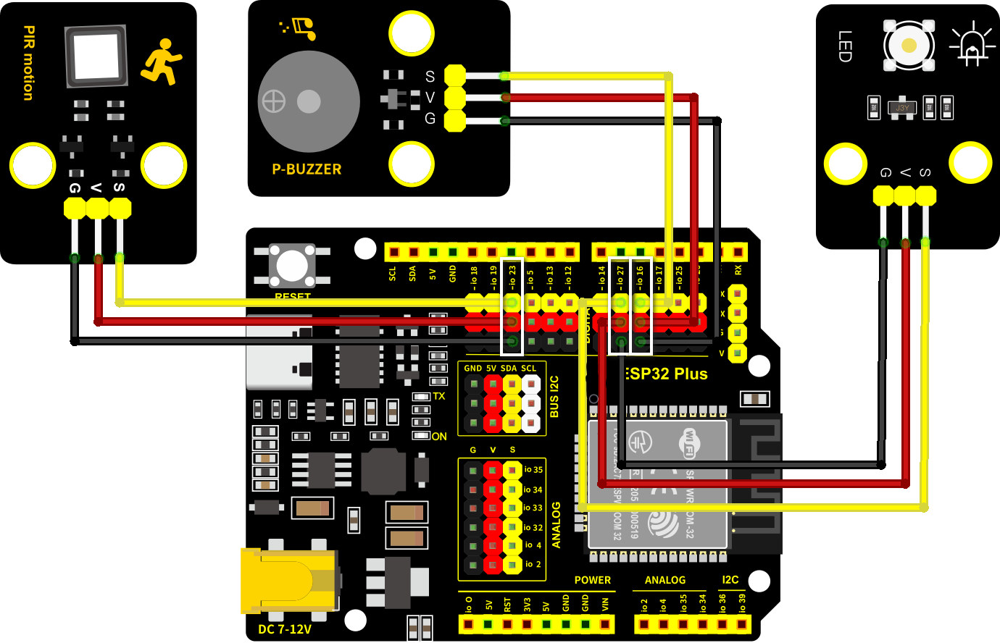

------

**3\. 代码流程图:**


------

4\. 实验代码：

打开Arduino IDE，选择对应的开发板板型（ESP32 Dev Module）和 适当的串口端口（COMxx）。


------

在Arduino IDE中，编写如下代码：

```c++
/*
 * 文件名 : Alarm-System
 * 功能   : 结合人体红外热释传感器和无源蜂鸣器模拟防盗警报系统
 * 编译IDE：ARDUINO 2.3.3
 * 作者   : https://www.keyestudio.com/
*/

#define BuzzerPin 16        //蜂鸣器模块连接引脚为16
#define PyroelectricPIN 23  //人体红外热释传感器引脚为23
#define Led 27              //led引脚为27

void setup() {
  Serial.begin(9600);
  //设置引脚的模式
  pinMode(BuzzerPin,OUTPUT);
  pinMode(PyroelectricPIN,INPUT);
  pinMode(Led,OUTPUT);
}
void loop() {
  //读取传感器值
  int ReadValue = digitalRead(PyroelectricPIN);
  if(ReadValue){
    Serial.println("Someone");
    digitalWrite(Led,HIGH);
    //警报声
    for(int i = 200; i<=1000; i+=10){ 
      tone(BuzzerPin,i);
      delay(10);
    }
    digitalWrite(Led,LOW);
    //警报声
    for(int i = 1000; i>=200; i-=10){ 
      tone(BuzzerPin,i);
      delay(10);
    }
  }
  //关闭蜂鸣器
  noTone(BuzzerPin);
  Serial.println("No one");
}
```

------

**5\. 实验结果：**

选择好正确的开发板板型（ESP32 Dev Module）和 适当的串口端口（COMxx），然后单击按钮上传代码。上传代码成功后，当开启警报系统后，只要检测到有人移动，警报声就会响起来，警示灯也会闪烁。

------


### 常见问题解答:

**1\. 问：蜂鸣器的音调与实际音调不准？**

答：普通蜂鸣器模拟的音调，达不到专业音调的要求，如需非常准确音调，需要更专业的喇叭。


**2\. 问：人体红外热释电传感器误报？**

答：1\. 非专业的人体检测传感器。

2\. 人体红外报警器避免误报警要求如下:

- 探测范围内避开被风吹而引起飘动的物体，如：窗帘、衣物、花草等。

- 探测范围内避免强光照射干扰，如：阳光照射、汽车灯光照射、射灯照射及照明等光源。

------

## 第四课：雨水检测系统

------

***注意：水洒在其他传感器上会导致短路，导致设备失效，洒在电池上会导致发热爆炸。请在使用设备时格外小心，尤其是幼儿使用时一定要在家长的监护下进行。为确保设备的安全运行，请遵循相关使用指南和安全规范。***

------

本教程介绍了如何使用水滴传感器和ESP32来创建一个雨水检测系统。当传感器检测到雨时，ESP32可以触发各种动作，如发送通知、激活洒水器或打开灯。这个系统可用于监测园艺或农业的雨量，或检测屋顶或建筑物的漏水情况。水滴传感器可以很容易地连接到ESP32开发板板上，形成一个简单而有效的雨水检测系统。


------

### 雨水检测系统流程：

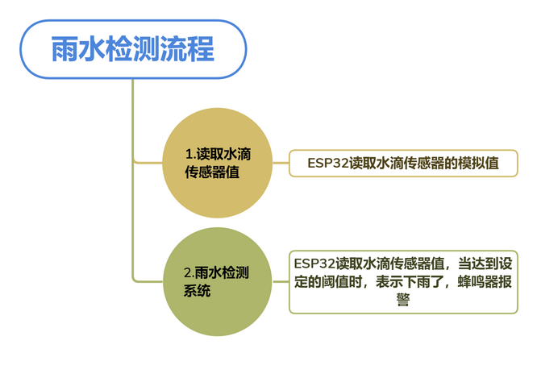

------

### 水滴传感器:

**1\. 概述:**

水滴传感器是一种可用于检测水的存在的传感器，它通常用于雨水检测系统。当雨水接触到传感器上的导电垫（检测区）时，它会向开发板(例如：Arduino主板，ESP32主板等)发送信号，以触发各种动作。


------

**原理图：**


水滴传感器通过电路板上裸露的印刷平行线检测水量的大小。水量越多，就会有更多的导线被联通，随着导电的接触面积增大，雨滴感应区 2 脚输出的电压就会逐步上升。信号端 S 检测到的模拟值就越大。除了可以检测水量的大小，它还可以检测空气中的水蒸气。

------

**参数：**

- 工作电压: DC 3.3V~5V
- 工作电流: (Max) 1.5mA@5V
- 最大功率: 0.075W
- 信号类型: 模拟信号

------


**2\. 接线图:**

**模块连接到io35**

**注意使用连接线连接时，黄色线为S信号线，红色线为V电源线，黑色线为GND，颜色一一对应，请勿插反！**

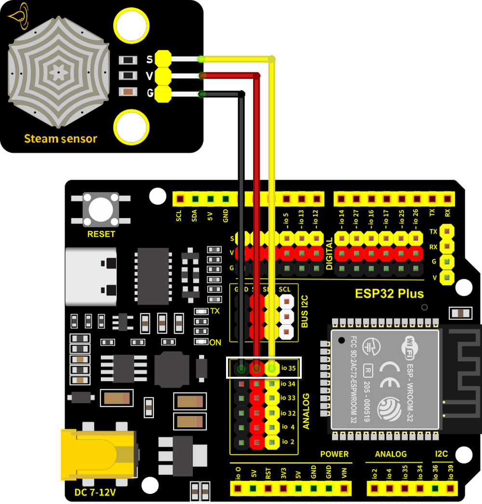

------


**3\. 实验代码：**

打开Arduino IDE，选择对应的开发板板型（ESP32 Dev Module）和 适当的串口端口（COMxx）。

.png)

------

在Arduino IDE中，编写如下代码：

```c++
/*
 * 文件名 : Steam-Sensor
 * 功能   : 读取水滴传感器的值
 * 编译IDE：ARDUINO 2.3.3
 * 作者   : https://www.keyestudio.com/
*/

#define SteamPin 35   //定义引脚为35

void setup() {
  Serial.begin(9600);
  pinMode(SteamPin,INPUT);
}

void loop() {
  //获取传感器值
  int ReadValue = analogRead(SteamPin);
  Serial.print("Steam Value: ");
  Serial.println(ReadValue);
  delay(500);
}
```

------

**4\. 实验结果:**

选择好正确的开发板板型（ESP32 Dev Module）和 适当的串口端口（COMxx），然后单击按钮上传代码。上传代码成功后，用湿润的手指去触碰传感器上的检测区域，触碰的面积越大，接收到的值就越大。打开串口监视器，设置好波特率为9600，可以查看当前检测的数字（0~4095）。

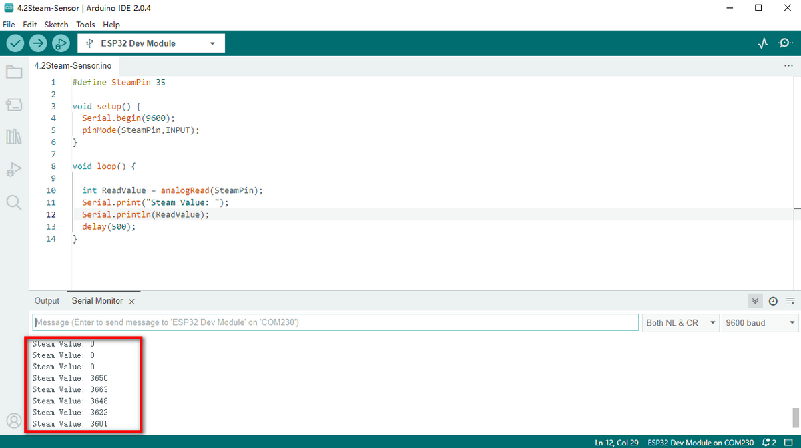

------

**5\. 代码解释:**

可以参照前面的课程（光敏传感器）的代码说明，这里就不多做介绍了。

------

### 雨水检测系统:

**1\. 概述:**

当水滴传感器检测到雨水时，它会向ESP32开发板发送一个信号，可以触发各种动作。例如，可以用一个蜂鸣器发出警报声，提醒用户正在下雨。这一功能对户外园艺或农业特别有用，使用户能够采取必要的预防措施，避免过度浇灌植物。

此外，使用水滴传感器和ESP32的雨水检测系统可用于检测屋顶或建筑物的漏水情况，帮助防止水入侵造成的损害。总的来说，水滴传感器是一个多功能的有效工具，可以在各种应用中检测水的存在。

**2\. 接线图:**

**水滴传感器连接到io35，蜂鸣器连接到io16**

**注意使用连接线连接时，黄色线为S信号线，红色线为V电源线，黑色线为GND，颜色一一对应，请勿插反！**


------

**3\. 代码流程图:**


------

**4\. 实验代码：**

打开Arduino IDE，选择对应的开发板板型（ESP32 Dev Module）和 适当的串口端口（COMxx）。

------

在Arduino IDE中，编写如下代码：

```c++
/*
 * 文件名 : Rainwater-Detection-System
 * 功能   : 结合水滴传感器和无源蜂鸣器模拟雨水检测系统
 * 编译IDE：ARDUINO 2.3.3
 * 作者   : https://www.keyestudio.com/
*/

#define SteamPin 35   //定义引脚
#define BuzzerPin 16

void setup() {
  Serial.begin(9600);
  pinMode(SteamPin,INPUT);
  pinMode(BuzzerPin,OUTPUT);
}

void loop() {
  //获取传感器值
  int ReadValue = analogRead(SteamPin);
  Serial.print("Steam Value: ");
  Serial.println(ReadValue);
  //判断读取的值是否在800~2000之间
  if(ReadValue >= 800 && 2000 > ReadValue){
    //循环执行3次
    for (int i = 0; i < 3; i++) {
      tone(BuzzerPin,200);
      delay(100);
      noTone(BuzzerPin);
      delay(100);
    }
  }
  //判断读取的值是否在2000~4000之间
  else if (ReadValue >= 2000 && 4000 >= ReadValue) {
    for (int i = 0; i < 3; i++) {
      tone(BuzzerPin,400);
      delay(100);
      noTone(BuzzerPin);
      delay(100);
    }
  }
  //判断读取的值是否在4000以上
  else if (ReadValue > 4000) {
    for (int i = 0; i < 3; i++) {
      tone(BuzzerPin,600);
      delay(100);
      noTone(BuzzerPin);
      delay(100);
    }
  }
  noTone(BuzzerPin);
  delay(500);
}
```

------

**5\. 实验结果：**

选择好正确的开发板板型（ESP32 Dev Module）和 适当的串口端口（COMxx），然后单击按钮上传代码。上传代码成功后，当水滴传感器检测到的雨水值越大，蜂鸣器报警声音越大。

------

**6\. 代码解释：**

可以参照前面的课程（光敏传感器，无源蜂鸣器）的代码说明，这里就不多做介绍了。

------

### 常见问题解答:

**1\. 问：水滴传感器防水吗？**

答：检测区域是可以接触水的，属于模拟现实事件，但是引脚接线处是不防水的，检测水时，请注意水量不要过多，以防短路。

**2\. 问：水滴传感器检测到水后，过了很久，警报声还一直响？**

答：蜂鸣器一直报警，是因为水滴传感器的检测区域，还残留水渍，清理干净即可。

------

## 第五课：太阳能电力系统


------

### 概述:

太阳能板用于将光能转化为电能，然后为LED灯供电。它可以用于各种应用，如为户外照明供电，为移动设备充电，甚至作为家庭或企业的备用电源。通过将太阳的力量与 Arduino ESP32 的灵活性相结合，用户可以根据自己的具体需求，创建复杂而高效的太阳能发电系统。

------

### 太阳能板是如何把太阳能转换成电能的呢？

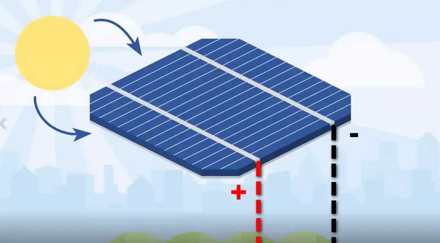

太阳能板通过吸收光线，将太阳辐射光电效应，直接或间接转换成电能的装置，与普通煤炭发电相比，太阳能发电和风力发电、水利发电等，更节能环保。

------

### 光能如何转换成电能？

接下来我们从内到外，来说说太阳能电池板的转换过程。

**1\. 太阳以波的形式发出能量，这些波的波长范围很广，从紫外线到可见光到红外线。**

- 紫外线波长范围：150~400nm ；
- 可见光波长范围：400~760nm ；
- 红外线波长范围：760~4000nm ；

**2\. 太阳能电池板就是吸收其中的一个范围的波长，从而转换成电能。那么它是如何实现的呢？**

我们接着往下看:


**太阳能板电池的活性部分是由半导体材料制成的，通常是硅（Si）。**


半导体是指在常温下导电性能介于导体与绝缘体之间的材料，一般情况下，无法良好导电，但在某些条件下具有很好的导电性。


**以上这张图呈现的是太阳能电池内部半导体的结构**，**分为三层：**

(1). **红色部分顶层：** 包含硅（Si）和极少量的磷（P），磷带的电子比硅多，为顶层提供了充足的电子，这些可以自由移动的电子使顶层的材料具有了导电性。**因此，顶层也称为负型或n型。**

(2). **灰色部分中间层：** 只有很少的电子，使其导电性很差。

(3). **绿色部分的底层：** 包含硅（Si）和硼（B）等元素，硼带的电子比硅少，使底层可以自由移动的电子比较少，这些缺少的电子可以描述为有效正电荷。**因此，底层被称为正型或P型。**

------


**太阳能电池板吸收的光波波长范围通常在350~1140nm，只有这部分的光能被太阳能电池板的中间层所吸收**，从上面太阳光波长范围可见，太阳能电池板吸收的这部分光包括可见光、紫外线的长波部分和红外线的短波部分。


------

**紫外线波长太短，他们一般都会停留在太阳能电池板的表面。**


------

**红外线波长太长，太阳能电池板无法吸收这部分的光能，这部分光一般会穿过整个板子或者被反射回去。**


------

太阳能电池板的中间层，吸收这部分的光能，将电子从顶层和底层的硅原子上击落，使电子处于游离状态，而电子之前所在的位置会产生一个空的电子穴。


这个电子穴带正电荷，也称为“空穴”，游离状态的电子会向顶部移动并到达顶部的n型层，空穴同样会向底部移动并到达底部的P型层。

**简单来说：中间层吸收太阳光能后，把顶层和底层的电子转化出来，顶层（N型层）转化成负电荷，为负极，底层（P型层）转化为正电荷，为正极，只要用导线将这两层接通，就可以通电。**


只要阳光照射到太阳能电池板上，上面描述的情况就会持续产生，就会产生大量游离的电子和空穴，电子向顶层移动，空穴向底层移动，就形成了电极，电子的流动就产生的电流。


------


太阳能具有许多优点，它可以作为一种可持续的、成本效益高的替代能源。

但是一个太阳能电池板产生的电流可以转换成数瓦的功率，这可能对一个计算器或者手机充电器是够用了，但是如果要运行一台一千瓦的烤面包机那是远远不够的。

总的来说，太阳能是一种非常有前途的能源，能够帮助我们创造一个美好、可持续的未来。

太阳能系统能够满足不同用户的需求，同时也有良好的环保效益。结合Arduino 编程，可以构建各种有用和高效的太阳能应用，比如自动化灯光系统、充电器、以及智能家居等。


------


**3\. 太阳能板参数：**

- 电压：5V
- 电流：80mA
- 功率：400mW
- 尺寸：60*60mm

------


**4\. 结果:**

本课程无需代码，主要了解太阳能这种新的环保能源。当太阳能板移动到光线充足的地方，LED会亮起黄灯，光线越强，LED就越亮。

------


### 常见问题解答:

**1\. 问：太阳能板为什么没有太阳光也能工作？**

答：太阳能板再太阳光和普通光源下都可以工作，太阳光的强度更大，电压就越高，普通光源强度越大，电压也越高，电压越大，LED越亮。

------

## 第六课：智能喂养系统

通过超声波传感器来检测动物是否在喂食区，可以驱动伺服开关打开喂食盒，自动喂食动物。融入物联网技术可以实现对饲喂系统的远程监控，提供另一个层面的便利和控制。总的来说，喂养系统的自动化和远程化，优化动物的喂养过程。


------

### 智能喂养系统流程：


------


### 舵机:

**1\. 概述:**

舵机是**伺服电机**的一种，伺服电机就是带有反馈环节的电机，我们可以通过伺服电机进行精确的位置控制或者输出较高的扭矩；舵机也叫 **RC 伺服器**，通常用于机器人项目，也可以在遥控汽车，飞机等航模中找到它们。

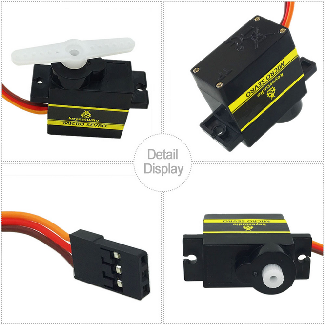

内部结构图：


- 信号线：接收来自微控制器的控制信号；

- 电位器：可以测量输出轴的位置量，属于整个舵机机构的反馈部分；

- 内部控制器：处理来自外部控制的信号，驱动电机以及处理反馈的位置信号，是整个伺服机构的核心；

- 直流电机：作为执行机构，输出多少转速，转矩，位置；

- 传动机构/舵机系统：该机构根据一定传动比，将电机输出的行程缩放到最终输出的角度上。

------


**驱动舵机：**

通过向舵机的信号信号线发送PWM信号来控制舵机的输出量，**PWM脉冲的占空比直接决定了输出轴的位置。**

**例如（这里以180°舵机为例）：**

- 当我们向180°舵机发送脉冲宽度为1.5毫秒（ms）的信号时，舵机的输出轴将移至中间位置（90度）；

- 脉冲宽度为`0.5ms`时，舵机的输出轴将移至最小的位置（0度）；

- 脉冲宽度为`2.5ms`时，舵机的输出轴将移至最大的位置（180度）；


舵机的周期通常为20毫秒，希望以`50Hz`的频率产生脉冲，但是许多伺服器在40至200 Hz的范围内也都能正常工作。


<span style="color: rgb(255, 76, 65);">注:不同类型和品牌的舵机之间最大位置和最小位置的角度可能会不同。许多舵机仅旋转约170度(或者只有90度)，但宽度为1.5ms的伺服脉冲通常会将伺服设置为中间位置(通常是指定全范围的一半)。</span>

------


**2\. 接线图:**

**模块连接到io26**

**注意使用连接线连接时，黄色线为S信号线，红色线为V电源线，黑色线为GND，颜色一一对应，请勿插反！**


------

**3\. 实验代码：**

我们使用<ESP32Servo.h>来驱动舵机。

打开Arduino IDE，选择对应的开发板板型（ESP32 Dev Module）和 适当的串口端口（COMxx）。

------

在Arduino IDE中，编写如下代码：

```c++
/*
 * 文件名 : Servo
 * 功能   : 舵机转动
 * 编译IDE：ARDUINO 2.3.3
 * 作者   : https://www.keyestudio.com/
*/

#include <ESP32Servo.h>  //需要导入ESP32开发板的舵机库
Servo myservo;  // 创建舵机对象来控制舵机
                // 在ESP32上可以创建16个舵机对象
                
int pos = 0;    // 定义变量存储舵机位置
// ESP32上推荐的PWM GPIO引脚包括2、4、12-19、21-23、25-27、32-33
int servoPin = 26;
                
void setup() {
  Serial.begin(9600);
  myservo.attach(servoPin);   // 将引脚26上的舵机连接到舵机对象上
  myservo.write(180);
  delay(2000);
}

void loop() {

  for (pos = 80; pos <= 179; pos += 1) { // 从80度到179度
    // 每次15度
    myservo.write(pos);              //告诉舵机到变量“pos”的位置
    delay(15);                       // 每次等待15ms让舵机到达对应的位置
  }
  for (pos = 180; pos >= 81; pos -= 1) { // 从180度到81度
    myservo.write(pos);              // 告诉舵机到变量“pos”的位置
    delay(15);                       // 每次等待15ms让舵机到达对应的位置
  }
}
```

------

**4\. 实验结果：**

选择好正确的开发板板型（ESP32 Dev Module）和 适当的串口端口（COMxx），然后单击按钮上传代码。上传代码成功后，可以看到饲料盒在慢慢打开，慢慢关闭，实现可控制的。

<span style="color: rgb(255, 76, 65);">注意：SG90舵机是180度，在套件中的饲料盒较小，SG90舵机只需旋转100度，就能完全关闭饲料盒。</span>

- 80度：完全打开。
- 120度：打开一半。
- 180度：关闭。


------

<span style="color: rgb(255, 76, 65);">注意：请勿将手指伸入到饲料盒中，谨防夹伤！请勿将其他物体堵住饲料盒盖，以免弄坏舵机。</span>

------


### 超声波传感器:

**1\. 概述:**

人类耳朵能听到的声波频率为20Hz～20KHz，而超声波就是超过了人类可听到的范围。

超声波的范围：

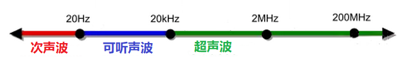

超声波传感器是一种利用压电效应将电能和超声波相互转化的装置，可以发射和接收超声波。超声波具有方向性、穿透力强和容易集中声能等特性。

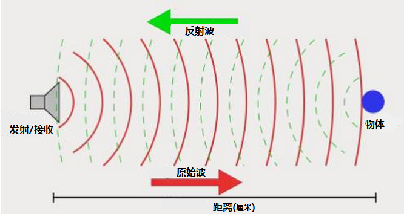

通过单片机(ESP32开发板)编程产生40KHz方波，驱动超声波传感器发射超声波，并经过接收电路放大、整形接收反射波后计算距离的超声波测距系统。系统可以记录超声波发射和反射波的时间，利用定时器计数计算时间差，从而计算出距离。

简单来说就是单片机控制超声波发射模块发出超声波，遇到障碍物反弹回来，被超声波接收模块接收到，然后计算这段时间（声音在空气中传播的速度为340m/s），通过计算，得出相应距离。


------

**原理图：**

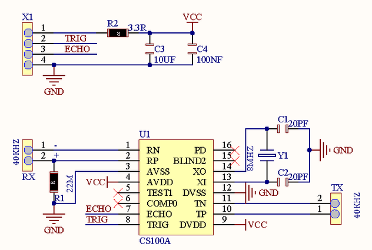

**参数：**

- 工作电压: DC 3.3V~5V
- 静态电流: <2mA
- 工作电流: 50mA~100mA，正常为65mA
- 最大功率：0.5W
- 最大探测距离：3m
- 盲区：小于4cm
- 感应角度：不大于15度
- 触发输入信号：10us TTL脉冲


**工作原理：**

超声波传感器的基本工作原理如下：

- 将 IO 触发器用于至少 10us 的高电平信号。

- 该模块以 40 kHz 的频率发送 8 周期的超声波脉冲，并检测是否接收到脉冲信号。

- 如果返回信号，Echo 将输出高电平;高电平的持续时间是从发出到返回的时间。

- 距离 = （高电平时间 x 声速 （340M/S）） / 2


------

**2\. 接线图:**

**模块的Echo连接到io13，Trig连接到io12**

**注意使用连接线连接时，黄色线为S信号线，红色线为V电源线，黑色线为GND，颜色一一对应，请勿插反！**


------

**3\. 实验代码：**

打开Arduino IDE，选择对应的开发板板型（ESP32 Dev Module）和 适当的串口端口（COMxx）。

------

在Arduino IDE中，编写如下代码：

```c++
#define Trigpin 12 //trig接io12
#define Echopin 13 //echo接io13
int duration,distance;

void setup(){
  Serial.begin(9600); //设置波特率为9600
  pinMode(Trigpin,OUTPUT);  //trig设置为输出模式
  pinMode(Echopin,INPUT);   //echo设置为输入模式
}
void loop(){
  digitalWrite(Trigpin,LOW);
  delayMicroseconds(2);
  digitalWrite(Trigpin,HIGH);
  delayMicroseconds(10);	//给trig至少10us的高电平时间触发
  digitalWrite(Trigpin,LOW);
  duration = pulseIn(Echopin,HIGH);	//echo高电平的时间
  distance = duration/58;		//换算成距离，单位为cm
  delay(50);
  Serial.print("distance:");	//串口打印出来
  Serial.print(distance);
  Serial.println("cm");
}
```

------

**4\. 实验结果：**

选择好正确的开发板板型（ESP32 Dev Module）和 适当的串口端口（COMxx），然后单击按钮上传代码。上传代码成功后，在智慧农场中，超声波检测距离为3~8cm，打开串口监视器，设置好波特率为9600，即可查看超声波传感器检测的距离值。

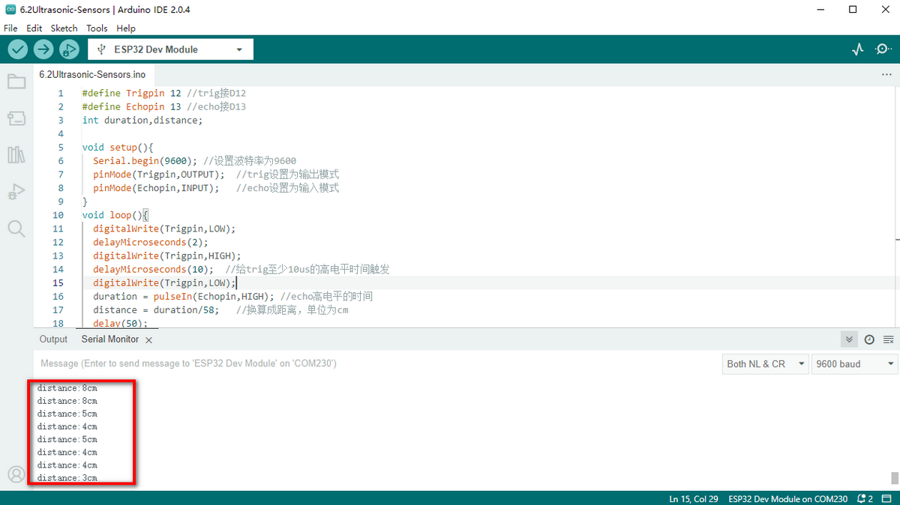

------

**5. 代码说明：**

关于超声波传感器的应用，我们可以直接查看`loop()`函数。

```c++
void loop(){
  digitalWrite(Trigpin,LOW); //在发送高信号之前触发低信号
  delayMicroseconds(2);
  digitalWrite(Trigpin,HIGH);
  delayMicroseconds(10);	//给trig至少10us的高电平时间触发
  digitalWrite(Trigpin,LOW);
  duration = pulseIn(Echopin,HIGH);	//echo高电平的时间
  distance = duration/58;		//换算成距离，单位为cm
  delay(50);
  Serial.print("distance:");	//串口打印出来
  Serial.print(distance);
  Serial.println("cm");
}
```

- 超声波模块的 <span style="color: rgb(255, 76, 65);">trigPin</span> 每 2us 发送一个 10us 的方波信号。

```c++
digitalWrite(Trigpin,LOW); //在发送高信号之前触发低信号
delayMicroseconds(2);
digitalWrite(Trigpin,HIGH);
delayMicroseconds(10);	//给trig至少10us的高电平时间触发
digitalWrite(Trigpin,LOW);
```

- 如果在范围内有障碍物，`echoPin` 接收高电平信号，使用 `pulseIn()` 函数记录从发送到接收的时间。

```c++
duration = pulseIn(Echopin,HIGH);	//echo高电平的时间
```

- 声音的速度是每秒340米，相当于每厘米29微秒。通过测量方波到达障碍物并返回所花费的时间，我们可以通过将总时间除以 2 来计算传播的距离。这就给出了障碍物到超声波传感器的距离。

```c++
 distance = duration/58;  //换算成距离，单位为cm
 ```

------


### 智能喂养系统:

**1\. 概述:**

智能喂养系统是通过组合超声波传感器和舵机，实现对动物的智能喂养。超声波传感器用于检测宠物的距离，当宠物靠近食物盆时，传感器检测到距离变近，触发信号后控制舵机将饲料盒打开。

**2\. 接线图:**

**超声波模块的Echo连接到io13，Trig连接到io12，舵机连接到io26**

**注意使用连接线连接时，黄色线为S信号线，红色线为V电源线，黑色线为GND，颜色一一对应，请勿插反！**


------

**3\. 代码流程图：**


------

**4\. 实验代码：**

打开Arduino IDE，选择对应的开发板板型（ESP32 Dev Module）和 适当的串口端口（COMxx）。

------

在Arduino IDE中，编写如下代码：

```c++
#include <ESP32_Servo.h>  //导入ESP32开发板的舵机库
Servo myservo;  // create servo object to control a servo
                // 16 servo objects can be created on the ESP32

#define TrigPin 12 //trig接D12
#define EchoPin 13 //echo接D13
#define ServoPin 26
int duration,distance;

void setup(){

  Serial.begin(9600); //设置波特率为9600
  pinMode(TrigPin,OUTPUT);  //trig设置为输出模式
  pinMode(EchoPin,INPUT);   //echo设置为输入模式
  myservo.attach(ServoPin);   // attaches the servo on pin 26 to the servo object
}
void loop(){
  Serial.println(getDistance());
  //当超声波检测动物的距离，达到2~7cm时，打开饲料盒，否则关闭
  if (getDistance() >= 2 && 7 >= getDistance()) {
    //舵机转到80度时，打开饲料盒
    myservo.write(80);
    delay(500);
  }
  else{
    myservo.write(180);
    delay(500);
  }
}

//把获取超声波的检测距离，写在一个方法里
float getDistance() {

  digitalWrite(TrigPin,LOW);
  delayMicroseconds(2);
  digitalWrite(TrigPin,HIGH);
  delayMicroseconds(10);	//给trig至少10us的高电平时间触发
  digitalWrite(TrigPin,LOW);
  duration = pulseIn(EchoPin,HIGH);	//echo高电平的时间
  distance = duration/58;		//换算成距离，单位为cm
  delay(50);
  
  return distance;
}
```

------

**5\. 实验结果：**

选择好正确的开发板板型（ESP32 Dev Module）和 适当的串口端口（COMxx），然后单击按钮上传代码。上传代码成功后，当超声波检测到有动物时，将开启饲料盒。

<span style="color: rgb(255, 76, 65);">注意：请勿将手指伸入到饲料盒中，谨防夹伤！请勿将其他物体堵住饲料盒盖，以免弄坏舵机。</span>

------

### 常见问题解答:

**1\. 问：舵机为什么不工作？**

答：可能卡死了，在安装舵机前，先使用代码调整到0角度，或者是盖上底板时线材卡住了，请参阅智慧农场安装步骤。


**2\. 问：超声波检测时，为什么检测距离不准？**

答：应从超声波的发射头处开始测量，此模块非高精度超声波距离检测模块，会有误差。

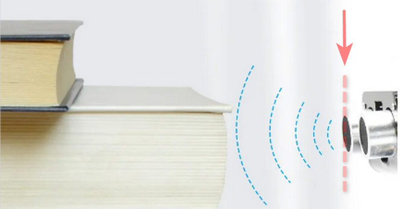

------

## 	第七课：农场温控系统

本教程介绍如何使用温湿度传感器、风扇模块和 IIC LCD 1602 显示屏，构建一个智能温湿度控制系统。

该系统能够测量环境温度和湿度，并根据需求控制风扇降温。当温度超过设定阈值时，系统会自动开启风扇，将环境温度降至设定值以下。同时，系统会在 IIC LCD 1602 显示屏上显示当前温度和湿度值。该系统能够实现自动调节环境温湿度的功能，对于需要控制环境温湿度的项目具有很好的应用价值。


------

### 农场温控系统流程：

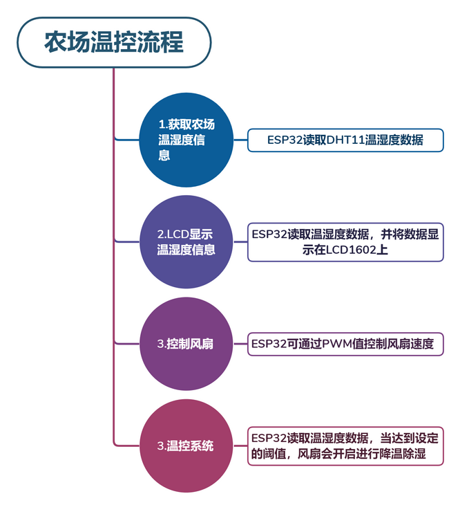

------

### 温湿度传感器:

**1\. 概述:**

DHT11数字式温湿度传感器，是一种数字信号输出的温湿度传感器。它利用特殊的模拟信号采集、转换技术和温度、温湿度传感技术，确保传感器拥有良好的长时间稳定性，和较高的可靠性。该传感器内部包含高精度的电阻式湿度传感器件，和电阻式热敏测温传感器件，并与一个8位的性能高的单片机相连接。

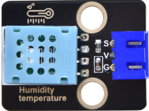

------

**XHT11通信方式：**

XHT11 器件采用简化的单总线通信。单总线即只有一根数据线，系统中的数据交换、控制均由单总线完成。

- 单总线传送数据位定义：

  - 单总线数据格式：一次传送 40 位数据，高位先出。

  - 8bit 湿度整数数据 + 8bit 湿度小数数据 + 8bit 温度整数数据 + 8bit 温度小数数据 + 8bit 校验位。<span style="color: rgb(255, 76, 65);">注：其中湿度小数部分为 0。</span>

- 校验位数据定义：
  - 8bit 湿度整数数据 + 8bit 湿度小数数据 + 8bit 温度整数数据 + 8bit 温度小数数据。8bit 校验位等于所得结果的末 8 位。


数据时序图如下：

用户主机（MCU）发送一次开始信号后，XHT11 从低功耗模式转换到高速模式，待主机开始信号结束后，XHT11 发送响应信号，送出 40bit 的数据，并触发一次信采集。信号发送如图所示:


<span style="color: rgb(255, 76, 65);">注：主机从 XHT11 读取的温湿度数据总是前一次的测量值，如两次测间隔时间很长，请连续读两次以第二次获得的值为实时温湿度值。</span>

**原理图：**


**参数：**

- 工作电压: DC 3.3V~5V 
- 工作电流: (Max)2.5mA@5V
- 最大功率: 0.0125W
- 温度范围: -25 ~ +60°C (± 2℃)
- 湿度范围: 5 ~ 95%RH（25C°左右精度为±5%RH）
- 输出信号: 数字双向单总线

------

**3\. 接线图:**

**模块连接到io17**

**注意使用连接线连接时，黄色线为S信号线，红色线为V电源线，黑色线为GND，颜色一一对应，请勿插反！**


------

**4\. 实验代码：**

打开Arduino IDE，选择对应的开发板板型（ESP32 Dev Module）和 适当的串口端口（COMxx）。

------

在Arduino IDE中，编写如下代码：

```c++
#include <dht11.h>
#define DHT11PIN 17

dht11 DHT11;

void setup()
{
  Serial.begin(9600);
  Serial.println("DHT11 TEST PROGRAM ");
  Serial.print("LIBRARY VERSION: ");
  Serial.println(DHT11LIB_VERSION);
  Serial.println();
}

void loop()
{
  Serial.println("\n");

  int chk = DHT11.read(DHT11PIN);

  Serial.print("Read sensor: ");
  switch (chk)
  {
    case DHTLIB_OK: 
                Serial.println("OK"); 
                break;
    case DHTLIB_ERROR_CHECKSUM: 
                Serial.println("Checksum error"); 
                break;
    case DHTLIB_ERROR_TIMEOUT: 
                Serial.println("Time out error"); 
                break;
    default: 
                Serial.println("Unknown error"); 
                break;
  }

  Serial.print("Humidity (%): ");
  Serial.println((float)DHT11.humidity, 2);

  Serial.print("Temperature (oC): ");
  Serial.println((float)DHT11.temperature, 2);

  Serial.print("Temperature (oF): ");
  Serial.println(Fahrenheit(DHT11.temperature), 2);

  Serial.print("Temperature (K): ");
  Serial.println(Kelvin(DHT11.temperature), 2);

  Serial.print("Dew Point (oC): ");
  Serial.println(dewPoint(DHT11.temperature, DHT11.humidity));

  Serial.print("Dew PointFast (oC): ");
  Serial.println(dewPointFast(DHT11.temperature, DHT11.humidity));

  delay(2000);
}

double Fahrenheit(double celsius) 
{
        return 1.8 * celsius + 32;
}    //摄氏温度度转化为华氏温度

double Kelvin(double celsius)
{
        return celsius + 273.15;
}     //摄氏温度转化为开氏温度

// 露点（点在此温度时，空气饱和并产生露珠）
// 参考: http://wahiduddin.net/calc/density_algorithms.htm 
double dewPoint(double celsius, double humidity)
{
        double A0= 373.15/(273.15 + celsius);
        double SUM = -7.90298 * (A0-1);
        SUM += 5.02808 * log10(A0);
        SUM += -1.3816e-7 * (pow(10, (11.344*(1-1/A0)))-1) ;
        SUM += 8.1328e-3 * (pow(10,(-3.49149*(A0-1)))-1) ;
        SUM += log10(1013.246);
        double VP = pow(10, SUM-3) * humidity;
        double T = log(VP/0.61078);   // temp var
        return (241.88 * T) / (17.558-T);
}

// 快速计算露点，速度是5倍dewPoint()
// 参考: http://en.wikipedia.org/wiki/Dew_point
double dewPointFast(double celsius, double humidity)
{
        double a = 17.271;
        double b = 237.7;
        double temp = (a * celsius) / (b + celsius) + log(humidity/100);
        double Td = (b * temp) / (a - temp);
        return Td;
}
```

------

**5\. 实验结果：**

选择好正确的开发板板型（ESP32 Dev Module）和 适当的串口端口（COMxx），然后单击按钮上传代码。上传代码成功后，打开串口监视器，设置好波特率为9600，可以查看XHT11传感器检测到的当前的温度和湿度等信息。

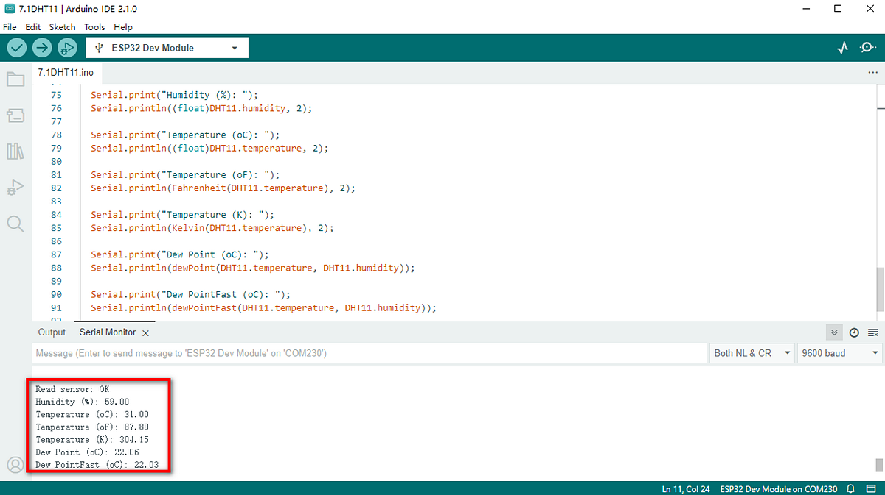

------

### IIC LCD 1602模块:

**1\. 概述:**

LCD 1602液晶显示屏是广泛使用的一种字符型液晶显示模块。LCD 1602液晶显示屏采用标准的14脚（无背光）或16脚（带背光）接口，当它们连接到控制器时，需要占用控制器的多个IO口 ，而控制器没有那么多外部端口。此外，它还限制了控制器的其他功能。

因此，开发了带有 I2C 模块的 LCD 1602 来解决这个问题。I2C 模块具有内置的 PCF8574 I2C 芯片，可将 I2C 串行数据转换为 LCD 显示屏的并行数据。

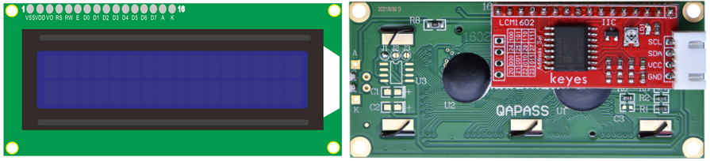

**参数：**

- 工作电压：DC 5V 
- 工作电流：< 130 mA
- 工作温度：-10℃～+50℃
- 温度范围：0～50℃ (±2℃) 
- IIC地址：0x27
- 背后的接线引脚分别为GND、VCC、SDA、SCL（SDA和SCL分别为IIC通讯的数据线和时钟线）。

**I2C 地址：**

默认地址基本上是 0x27，在少数情况下可能是 0x3F。

以默认地址 0x27 为例，可以通过短接 A0/A1/A2 焊盘来修改设备地址; 在默认状态下，A0/A1/A2 为 1，如果焊盘短路，则 A0/A1/A2 为 0。 


**对比度：**

背面的电位器用于调整对比度（最亮的白色和最暗的黑色之间的亮度比）。 

电位器 ：用于调整对比度（显示文本的清晰度），对比度在顺时针方向上增加，在逆时针方向上减少。


------

**I2C串行通信：**

I2C通信协议是Inter-Integrated Circuit（IIC）的缩写，也叫作两线制或TWI（Two-Wire Interface），是一种通用的主从式的两线总线通信协议，它是由Philips Semiconductor公司开发的（现在被美国NXP半导体公司收购）。

其最大的优点是只需要两根线就可以完成数据的传输，对于系统线路的繁琐也减少了很多，这种总线可以并行联结127个节点，并且支持多主机，从机一般不需要外接电源，因为I2C总线可以把电源传输到从机。如下图。

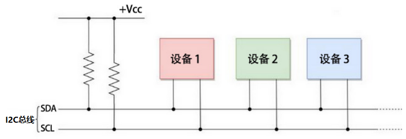

------

I2C总线的数据传输采用8位数据传输的方式，通常一个字节的数据传输是由9个时钟信号组成，8个时钟信号传输数据，最后一个时钟信号用于传输结束的标志。同时，I2C总线也支持多字节的数据传输，不断重复上述过程，即可完成多字节的数据传输。

------

I2C协议的基本组成部分包括以下内容：

- 起始信号：在发送数据之前，发送方必须发送起始信号，以告知接收方，要发送数据了。

- 地址码：地址码用于告知接收方，要发送的数据是给谁的。

- 数据：数据按照位传输，每次传输一个字节的数据。 

- 停止信号：发送完数据后，发送方必须发送停止信号，以告知接收方，数据发送完毕。

Arduino提供了一个名为Wire.h的I2C协议集成库，可以通过调用其函数实现I2C通信，从而实现与I2C/TWI设备的通信。

具体库介绍参考官网链接：

https://www.arduino.cc/reference/en/language/functions/communication/wire/

------

**2\. 接线图：**

**模块连接到 BUS I2C **

**注意使用连接线连接时，黄色线为S信号线，红色线为V电源线，黑色线为GND，颜色一一对应，请勿插反！**


------

**3\. 实验代码：**

打开Arduino IDE，选择对应的开发板板型（ESP32 Dev Module）和 适当的串口端口（COMxx）。

------

在Arduino IDE中，编写如下代码：

```c++
#include <LiquidCrystal_I2C.h>

//初始化LCD1602，其中0x27为I2C地址
LiquidCrystal_I2C lcd(0x27,16,2);

void setup() {
  //LCD初始化
  lcd.init();
  // Turn the (optional) backlight off/on
  lcd.backlight();
  //lcd.noBacklight();

  //设置位置
  lcd.setCursor(0, 0);
  //显示
  lcd.print("HELLO WORLD 0");
  lcd.setCursor(0, 1);
  lcd.print("HELLO WORLD 1");

  //清空显示
  // lcd.clear();
}

void loop() {

  // Turn the display on/off (quickly)
  //lcd.noDisplay();
  //lcd.display();

  // Turns the underline cursor on/off
  //lcd.noCursor();
  //lcd.cursor();

  // Turn on and off the blinking cursor
  // lcd.noBlink();
  // lcd.blink();

  // These commands scroll the display without changing the RAM
  //lcd.scrollDisplayLeft();
  //lcd.scrollDisplayRight();

  // This is for text that flows Left to Right
  //lcd.leftToRight();
  //lcd.rightToLeft();

  // This will 'right justify' text from the cursor
  //lcd.autoscroll();
  //lcd.noAutoscroll();

}

```

------

**5\. 实验结果：**

选择好正确的开发板板型（ESP32 Dev Module）和 适当的串口端口（COMxx），然后单击按钮上传代码。上传代码成功后，IIC LCD 1602 显示屏会打开背光，并显示两行文字”**HELLO WORLD 0**“和”**HELLO WORLD 1**“.

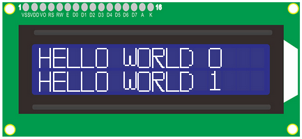

<span>注意：如果代码和接线正确，但 LCD 仍然无法显示任何内容，则可以调整背面的电位器以增加对比度。</span>

------

**6\. 代码说明：**

（1）. 通过调用库 `LiquidCrystal_I2C.h`，您可以轻松驱动 LCD 1602。
 
```c++                  
#include <LiquidCrystal_I2C.h>
```
库功能：

- 创建 `LiquidCrystal_I2C` 类，该类表示连接到开发板的特定 LCD 1602 。

   - LiquidCrystal_I2C(uint8_t lcd_Addr,uint8_t lcd_cols,uint8_t lcd_rows)

     - `lcd_Addr`：LCD 1602 的地址默认为 0x27。

     -  `lcd_cols`：LCD 1602有 16 列。

     -  `lcd_rows`：LCD 1602 有 2 行。

（2）. 初始化 LCD 1602。

```c++
void init()
```

（3）. 打开（可选）背光灯。

```c++
void backlight()
```

（4）. 关闭（可选）背光。

```c++
void nobacklight()
```

（5）. 打开 LCD 1602 显示屏。

```c++
void display()
```

（6）. 快速关闭 LCD 1602 显示屏。

```c++
void nodisplay()
```

（7）. 清除显示，将光标位置设置为零。

```c++
void clear()
```

（8）. 将光标位置设置为 X行、X列。

```c++
void setCursor(uint8_t col,uint8_t row)
```

（9）. 将文本打印到 LCD 1602 显示屏上。

```c++
void print(data,BASE)
```
- `data`：要打印的数据（char、byte、int、long 或 string）。

- `BASE` (可选)：打印数字的底数。

   - `BIN`: 对于二进制 （以 2 为底数）

   - `DEC`: 对于十进制（以 10 为底数）

   - `OCT`: 对于八进制（以 8 为底数）

   - `HEX`: 对于十六进制（以 16 为底数）。


------

### 风扇模块:

**1\. 概述:**

130电机风扇模块是一种可以通过PWM调速的模块，使用时需要接两个引脚进行控制。该模块适用于需要调节风扇速度的应用场景，例如电脑散热、工业生产等。它小巧轻便、安装简单，是一种十分实用的模块。


**原理图：**


HR1124S芯片的作用是助于驱动电机，而电机所需电流较大，无法用三极管驱动更无法直接用IO口驱动。让电机转动起来的方法很简单，给电机两端添加电压即可。不同电压方向电机转向也不相同，在额度电压内，电压越大，电机转动得越快；反之电压越低，电机转动得越慢，甚至无法转动。控制方式有两种：一种是高低电平控制（控制转动和停止），一种是PWM控制（控制转速）。

**参数：**

- 工作电压: DC 5V
- 工作电流: (Max)400mA@5V
- 最大功率: 2W
- 转速: (16000+10%) 转/分@5V


**2\. 接线图:**

**电机模块的IN+连接到io18，IN-连接到io19**

**注意使用连接线连接时，黄色线为S信号线，红色线为V电源线，黑色线为GND，颜色一一对应，请勿插反！**


------

**3\. 实验代码：**

打开Arduino IDE，选择对应的开发板板型（ESP32 Dev Module）和 适当的串口端口（COMxx）。

------

在Arduino IDE中，编写如下代码：

```c++
/*
 * 文件名 : Motor
 * 功能   : 电机（风扇）顺时针逆时针转动
 * 编译IDE：ARDUINO 2.3.3
 * 作者   : https://www.keyestudio.com/
*/

#define MotorPin1 19  //(IN+)
#define MotorPin2 18  //(IN-)

void setup() {
  pinMode(MotorPin1,OUTPUT);
  pinMode(MotorPin2,OUTPUT);

  //设置PWM输出，可进行电机调速
  ledcAttach(MotorPin1, 1200, 8); //设置MotorPin1频率为1200，PWM分辨率为8，即占空比256.
  ledcAttach(MotorPin2, 1200, 8); //设置MotorPin2频率为1200，PWM分辨率为8，即占空比256.
}

void loop() {
  //逆时针转动
  ledcWrite(MotorPin1, 70);
  ledcWrite(MotorPin2, 0);

  delay(2000);

  //停止
  //停止的目的:防止正反转的瞬间，电机电流过大，导致开发板供电不足，而被迫复位。
  delay(200);
  ledcWrite(MotorPin1, 0);
  ledcWrite(MotorPin2, 0);
  delay(200);
  
  //顺时针转动
  ledcWrite(MotorPin1, 0);
  ledcWrite(MotorPin2, 70);

  delay(2000);
  
  //停止
  delay(200);
  ledcWrite(MotorPin1, 0);
  ledcWrite(MotorPin2, 0);
  delay(200);
}
```

------

**5\. 实验结果：**

选择好正确的开发板板型（ESP32 Dev Module）和 适当的串口端口（COMxx），然后单击按钮上传代码。上传代码成功后，可以看到130电机模块上的风扇，每隔2秒，逆时针和顺时针交替旋转。

**注意：电机在进行正反转时，间歇性的停止，为了防止正反转的瞬间，电机电流过大，导致开发板供电不足，而被迫复位，一定要保证外接电源，并且还要保证外接电源电压比较足。**


------

**6\. 代码说明：**

可以参照前面的课程（LED呼吸灯）的代码说明，这里就不多做介绍了。

------

### 农场温控系统:

**1\. 概述:**

这个应用场景需要通过单线通信来获取XHT11温湿度传感器的数据，并将温度和湿度数值显示在1602 LCD显示屏上。同时，当温度或湿度超过设定的阈值时，风扇模块会开启，用来降低温度以保护农场里的动植物。这种模块的优点是安装容易，且功能强大。它不仅可以通过PWM调节速度，还能够通过单线通信来传输数据。总的来说，这个应用场景是一个非常实用的解决方案，可以帮助农场主人监测和控制农场的环境，提高农业生产效率。

**2\. 接线图:**

- **温湿度模块连接到io17**
- **电机模块的IN+连接到io18，IN-连接到io19**
- **LCD1602模块连接到I2C通信接口**
- **注意使用连接线连接时，黄色线为S信号线，红色线为V电源线，黑色线为GND，颜色一一对应，请勿插反！**


------

**3\. 代码流程图：**


------

**4\. 实验代码：**

打开Arduino IDE，选择对应的开发板板型（ESP32 Dev Module）和 适当的串口端口（COMxx）。

------

在Arduino IDE中，编写如下代码：

```c++
/*
 * 文件名 : Temperature-Control-System
 * 功能   : 结合温湿度传感器和电机模拟农场温控系统
 * 编译IDE：ARDUINO 2.3.3
 * 作者   : https://www.keyestudio.com/
*/

#include <LiquidCrystal_I2C.h>
#include <dht11.h>

#define DHT11PIN 17 //温湿度传感器的引脚
#define MotorPin1 19  //(IN+)
#define MotorPin2 18  //(IN-)

dht11 DHT11;

LiquidCrystal_I2C lcd(0x27,16,2);

void setup() {
  lcd.init();
  lcd.backlight();  

  pinMode(MotorPin1,OUTPUT);
  pinMode(MotorPin2,OUTPUT);

  //设置PWM输出，可进行电机调速

  ledcAttach(MotorPin1, 1200, 8); //设置MotorPin1频率为1200，PWM分辨率为8，即占空比256.
  ledcAttach(MotorPin2, 1200, 8); //设置MotorPin2频率为1200，PWM分辨率为8，即占空比256.
}

void loop() {
  //定义两个温湿度值
  int Temperature;
  int Humidity;
  //获取数据
  int chk = DHT11.read(DHT11PIN);

  Temperature = DHT11.temperature;
  Humidity = DHT11.humidity;
  lcd.setCursor(0, 0);
  lcd.print("Temp:");
  lcd.setCursor(5, 0);
  lcd.print(Temperature); 

  lcd.setCursor(0, 1);
  lcd.print("Hum:");
  lcd.setCursor(5, 1);
  lcd.print(Humidity);
  delay(500);
  
  if (Temperature >= 25) {
    //左转
    ledcWrite(MotorPin1, 100);
    ledcWrite(MotorPin2, 0);
  }else{
    //停止
    delay(3000);
    ledcWrite(MotorPin1, 0);
    ledcWrite(MotorPin2, 0);
    delay(200);
  }
}
```

------

**5\. 实验结果：**

选择好正确的开发板板型（ESP32 Dev Module）和 适当的串口端口（COMxx），然后单击按钮上传代码。上传代码成功后，IIC LCD 1602 显示屏实时显示XHT11传感器检测到环境中的湿度值和温度值。当温度达到29℃时，风扇模块会开启，进行散热，当低于29℃时，风扇模块会关闭（风扇为模拟散热，散热效果一般），达到农场自动控温效果，节省能源。

------

### 常见问题解答:

**1\. 问：温湿度传感器防水吗？**

答：温湿度传感器检测的是空气中的温度和湿度，不防水，请勿将模块放入水中。

------

**2\. 问：风扇模块转动导致ESP32开发板复位？**

答：风扇模块在转动时，需要的电流比其他传感器要大，会引起电路中电压电流波动，特别是风扇进行正反转时，电压电流波动过大，导致ESP32开发板的电压电流过低，导致复位。

------

## 第八课：土壤湿度监测系统

------

***请注意，使用设备时不要让水从水池和土壤池中溢出。如果水洒到其他传感器上，会导致短路，影响设备正常工作。另外，如果水洒到电池上，会导致发热和爆炸等危险。因此，请在使用设备时格外小心，尤其是幼儿使用时一定要在家长的监护下进行。为确保设备的安全运行，请遵循相关使用指南和安全规范。***

------

本课程介绍如何使用ESP32开发板、土壤湿度传感器、无源蜂鸣器和 IIC LCD 1602 显示屏，构建一个智能土壤湿度检测系统。

该系统能够通过 IIC LCD 1602 显示屏实时显示土壤湿度传感器的值，当土壤湿度低于设定的阈值时，蜂鸣器会响起警报声，提示该浇灌土地了。这个应用场景是一个非常实用的解决方案，可以帮助农场主人监测和控制农场的土地湿度，提高农业生产效率。


------


### 土壤湿度监测系统流程：

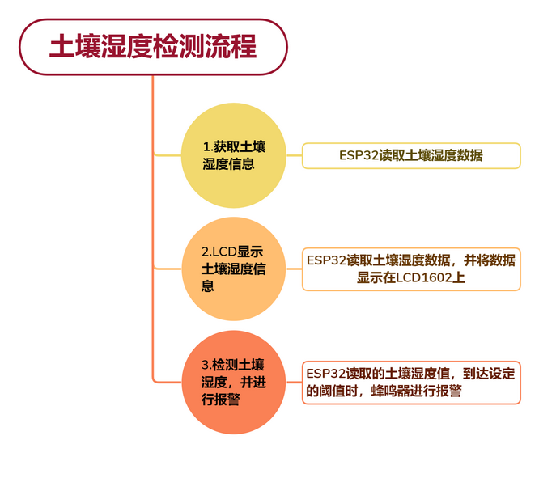

------


### 土壤湿度传感器：

**1\. 概述:**

土壤湿度传感器也称为土壤湿度计，主要用于测量土壤体积含水量、监测土壤水分、农业灌溉、林业保护等。传感器被集成到农业灌溉系统中，以帮助有效地安排供水，有助于减少或加强灌溉，以实现最佳的植物生长。

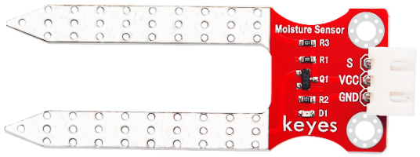

------

**2\. 传感器知识:**

**土壤湿度传感器:** 是一个简易的水分传感器，可用于检测土壤中的水分，传感器采用叉形设计，方便插入士壤。传感器插入土壤后，输出电压随着土壤湿度升高而增大。即当土壤缺水时，传感器输出值将减小，反之将增大。传感器常用于制作自动浇水系统、花盆土壤湿度检测和自动灌溉系统等。


**原理图：**


**参数：**

- 工作电压: DC 3.3V~5V
- 信号类型: 模拟信号

------

**3\. 接线图:**

**传感器连接到io32**

**注意使用连接线连接时，黄色线为S信号线，红色线为V电源线，黑色线为GND，颜色一一对应，请勿插反！**


------

**4\. 实验代码：**

打开Arduino IDE，选择对应的开发板板型（ESP32 Dev Module）和 适当的串口端口（COMxx）。

------

在Arduino IDE中，编写如下代码：

```c++
#define SoilHumidityPin 32

void setup() {
  Serial.begin(9600);
  pinMode(SoilHumidityPin,INPUT);
}

void loop() {
  //定义一个值，用来存储土壤湿度的值
  int ReadValue = analogRead(SoilHumidityPin);
  Serial.println(ReadValue);
  delay(500);
}
```

------

**5\. 实验结果：**

选择好正确的开发板板型（ESP32 Dev Module）和 适当的串口端口（COMxx），然后单击按钮上传代码。上传代码成功后，打开串口监视器，设置好波特率为9600，当将传感器的土壤检测区插入土壤中（或者：用浸湿的手触碰传感器的土壤检测区）时，在串口监视器窗口可以读取到传感器检测到的湿度（范围：0~4095）。

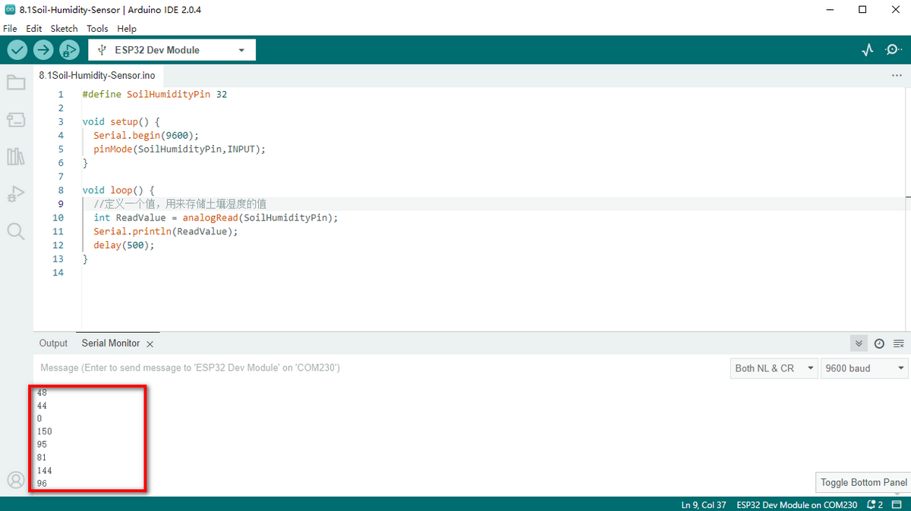

------

### 土壤湿度监测系统

**1\. 概述:**

使用LCD1602显示屏，实时显示土壤湿度传感器的值，当湿度低于设定的阈值，蜂鸣器会响起警报声，提示该浇灌土地了。

------

**2\. 接线图:**

- **土壤传感器连接到io32**
- **蜂鸣器连接到io16**
- **LCD1602屏连接到BUS I2C**
- **注意使用连接线连接时，黄色线为S信号线，红色线为V电源线，黑色线为GND，颜色一一对应，请勿插反！**

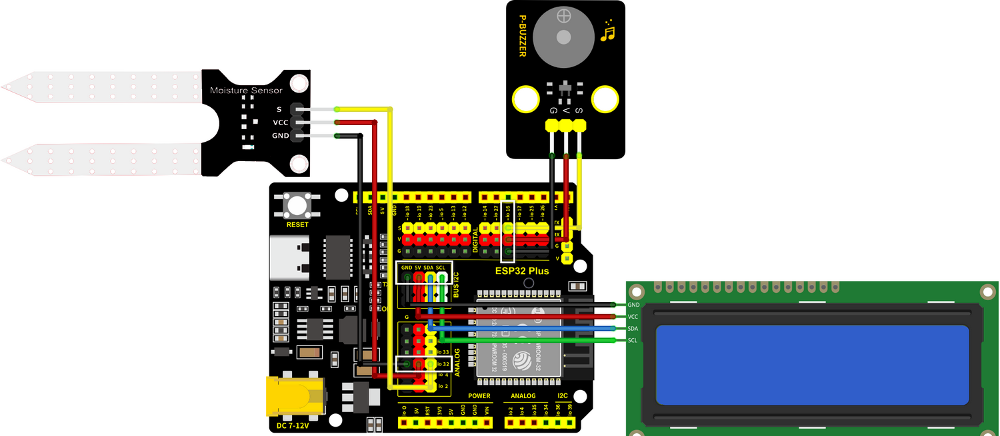

------

**3\. 代码流程图：**


------

**4\. 实验代码：**

打开Arduino IDE，选择对应的开发板板型（ESP32 Dev Module）和 适当的串口端口（COMxx）。

------

在Arduino IDE中，编写如下代码：


```c++
#include <LiquidCrystal_I2C.h>

#define BuzzerPin 16
#define SoilHumidityPin 32

LiquidCrystal_I2C lcd(0x27,16,2);

void setup() {

  pinMode(BuzzerPin,OUTPUT);
  pinMode(SoilHumidityPin,INPUT);

  lcd.init();
  lcd.backlight();  
  lcd.clear();

}

void loop() {

  float shvalue = analogRead(SoilHumidityPin);

  lcd.setCursor(0, 0);
  lcd.print("SoilHum:");
  lcd.setCursor(9, 0);
  lcd.print(shvalue);
  
  //当检测湿度到低于阈值时，打开蜂鸣器预警
  if(200 >= shvalue)
  {
    tone(BuzzerPin,532);
    delay(100);
    tone(BuzzerPin,532);
    delay(100);
    tone(BuzzerPin,659);
    delay(100);
    noTone(BuzzerPin);  //关闭
  }
  delay(500);
  lcd.clear();
}
```

------

**5\. 实验结果：**

选择好正确的开发板板型（ESP32 Dev Module）和 适当的串口端口（COMxx），然后单击按钮上传代码。上传代码成功后，将土壤湿度传感器的检测区插入土壤中，IIC LCD 1602 显示屏实时显示土壤湿度信息。当土壤湿度传感器检测到的土壤湿度值低于设定的阈值时，蜂鸣器会发出警报声。

------

### 常见问题解答:

**1\. 问：传感器防水吗？**

答：土壤湿度传感器检测区域防水，超过检测区域将会导致短路。

------

## 第九课：水位监测系统

------

***请注意，使用设备时不要让水从水池和土壤池中溢出。如果水洒到其他传感器上，会导致短路，影响设备正常工作。另外，如果水洒到电池上，会导致发热和爆炸等危险。因此，请在使用设备时格外小心，尤其是幼儿使用时一定要在家长的监护下进行。为确保设备的安全运行，请遵循相关使用指南和安全规范。***

------

本课程介绍如何使用ESP32开发板、水位传感器、无源蜂鸣器和 IIC 1602 LCD 显示屏，构建一个智能水源水位自动监测报警系统，其主要功能是监测水位变化，及时发现问题并采取措施避免灾害发生。该系统广泛应用于水利工程、城市排水、环境监测等领域。


------

### 水位检测系统流程：

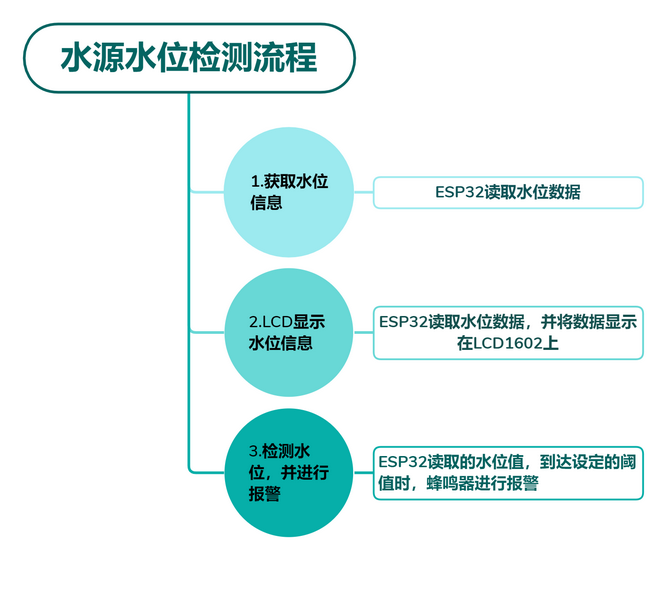

------


### 水位传感器

**1\. 概述:**

我们的水传感器易于使用，便于携带，成本效益高，它被设计用来识别和检测水位和水滴。该传感器通过一列暴露在外的平行线的痕迹来测量水滴的体积和水量。与其竞争对手相比，该传感器不仅更小、更智能，而且还巧妙地配备了以下功能：

- 水量和模拟量之间的平滑转换；
- 灵活性强，该传感器输出基本模拟值；
- 低功耗和高灵敏度；
- 直接连接到微处理器或其他逻辑电路，适用于各种开发板和控制器，如Aduino控制器、STC单芯片微机、AVR单芯片微机等。

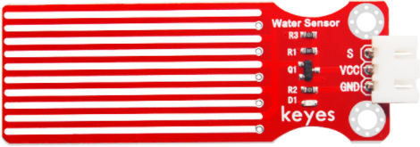

------

**2\. 传感器知识：** 

**水位传感器:** 是一款简单易用、性价比较高的水位/水滴识别检测传感器，其是通过具有一系列的暴露的平行导线线迹测量其水滴/水量大小从而判断水位。轻松完成水量到模拟信号的转换，输出的模拟值可以直接被各种开发板读取，达到水位报警的功效。


**原理图：**


**参数：**

- 工作电压:DC 3.3V~5V
- 工作电流:(Max)20mA@5V
- 控制信号:模拟信号

------

**3\. 接线图:**

**传感器连接到io33**

**注意使用连接线连接时，黄色线为S信号线，红色线为V电源线，黑色线为GND，颜色一一对应，请勿插反！**


------

**4\. 实验代码：**

打开Arduino IDE，选择对应的开发板板型（ESP32 Dev Module）和 适当的串口端口（COMxx）。

------

在Arduino IDE中，编写如下代码：

```c++
#define WaterLevelPin 33

void setup() {

  Serial.begin(9600);
  pinMode(WaterLevelPin,INPUT);
}

void loop() {
  int ReadValue = analogRead(WaterLevelPin);
  Serial.println(ReadValue);
  delay(500);
}

```

------

**5\. 实验结果：**

选择好正确的开发板板型（ESP32 Dev Module）和 适当的串口端口（COMxx），然后单击按钮上传代码。上传代码成功后，打开串口监视器，设置好波特率为9600，当将传感器的水中检测区插入水中（或者：当用湿漉的手去触碰传感器的水中检测区）时，串口监视器会显示数值（0~4095）。

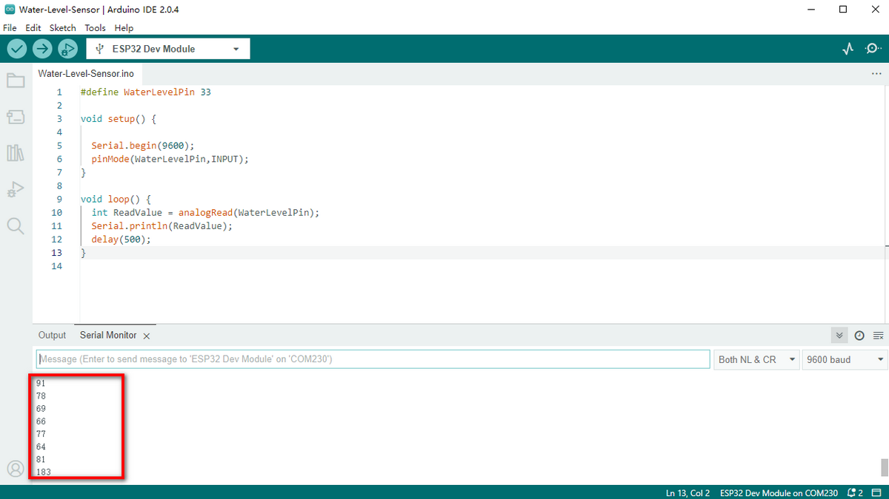

------


### 水位监测系统

**1\. 概述:**

水位自动监测报警系统，主要功能是监测水位变化，及时发现问题并采取措施避免灾害发生。该系统广泛应用于水利工程、城市排水、环境监测等领域。

**2\. 接线图:**

- **水位传感器连接到io33**
- **蜂鸣器连接到io16**
- **LCD1602屏连接到BUS I2C**
- **注意使用连接线连接时，黄色线为S信号线，红色线为V电源线，黑色线为GND，颜色一一对应，请勿插反！**

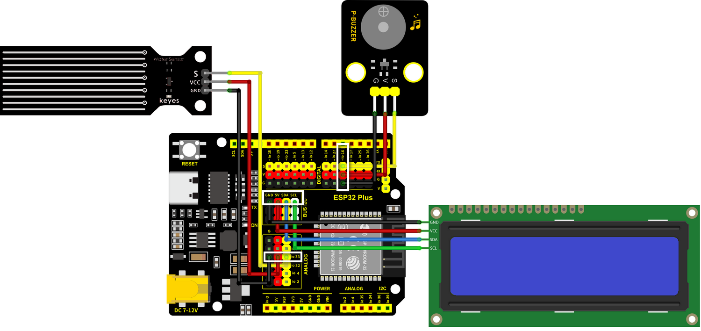

------

**3\. 代码流程图：**

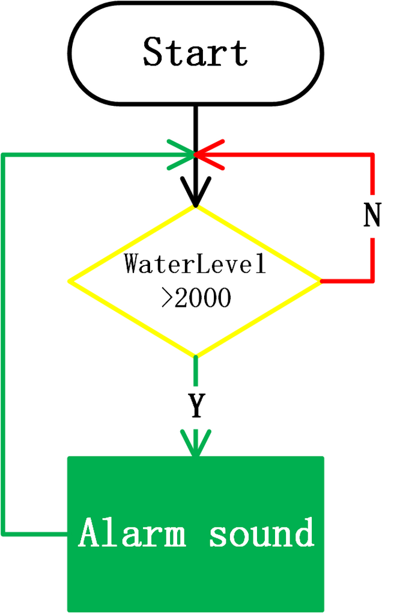

------

**4\. 实验代码：**

打开Arduino IDE，选择对应的开发板板型（ESP32 Dev Module）和 适当的串口端口（COMxx）。

------

在Arduino IDE中，编写如下代码：

```c++
#include <LiquidCrystal_I2C.h>

#define BuzzerPin 16
#define WaterLevelPin 33

LiquidCrystal_I2C lcd(0x27,16,2);

void setup() {

  //串口初始化
  Serial.begin(9600);
  //设置引脚输入模式
  pinMode(WaterLevelPin,INPUT);

  //LCD初始化
  lcd.init();
  //开启LCD背光
  lcd.backlight();
  //清除LCD上显示的信息	
  lcd.clear();
}

void loop() {
  //读取传感器的值
  int ReadValue = analogRead(WaterLevelPin);
  //设置显示位置
  lcd.setCursor(0, 0);
  //设置显示信息
  lcd.print("WaterLevel:");
  lcd.setCursor(6, 1);
  lcd.print(ReadValue);
  
  //当检测湿度到高于阈值时，打开蜂鸣器预警
  if(ReadValue >= 2000)
  {
    tone(BuzzerPin,659);
    delay(100);
    tone(BuzzerPin,532);
    delay(100);
    tone(BuzzerPin,659);
    delay(100);
    noTone(BuzzerPin);  //关闭
  }
  delay(500);
  lcd.clear();
}
```

------

**5\. 实验结果：**

选择好正确的开发板板型（ESP32 Dev Module）和 适当的串口端口（COMxx），然后单击按钮上传代码。上传代码成功后，将水位湿度传感器的水位检测区插入水中（或者：用湿漉的手去触碰传感器的水位检测区，来模拟水位），IIC LCD 1602 显示屏实时显示水位信息。当水位传感器检测到的水位值低于设定的阈值时，蜂鸣器会发出警报声音。

------

### 常见问题解答:

**1\. 问：传感器防水吗？**

答：水位传感器检测区域防水，超过检测区域将会导致短路。

------

## 第十课：自动灌溉系统

------

***请注意，使用设备时不要让水从水池和土壤池中溢出。如果水洒到其他传感器上，会导致短路，影响设备正常工作。另外，如果水洒到电池上，会导致发热和爆炸等危险。因此，请在使用设备时格外小心，尤其是幼儿使用时一定要在家长的监护下进行。为确保设备的安全运行，请遵循相关使用指南和安全规范。***

------

本教程介绍如何使用ESP32开发板，控制继电器来打开水泵进行抽水灌溉，使用水位传感器来检测水位高度，判断水池是否有水，并使用土壤湿度传感器来检测植物土壤的湿度情况，从而更加智能化地控制水泵的启停。


------

### 自动灌溉流程：

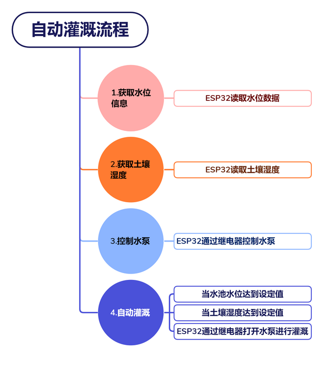

------


### 抽水系统

**1\. 概述:**

本教程介绍如何使用ESP32开发板来控制抽水泵，并使用继电器来实现开关控制。抽水泵是一种用于提水或输送液体的机械装置，通常需要使用继电器模块来控制其启停。

在这个项目中，我们将通过连接继电器模块和抽水泵到ESP32开发板上，并编写代码来控制继电器的开关状态，从而控制抽水泵的启停。我们可以根据传感器输出的值或预设的时间来控制继电器的开关状态，从而实现对抽水泵的远程控制。

------

**2\. 继电器知识：**

**继电器：** 是一种利用低功耗电路控制大功率电路的安全开关。它由电磁铁和触点组成。电磁铁采用低功耗电路控制，大功率电路采用触点控制。当电磁铁通电时，它会吸引触点，用于管理高压、负载电流，比如电机、高电流传感器、高功率灯等。下面是一个继电器的示意图和工作原理图:

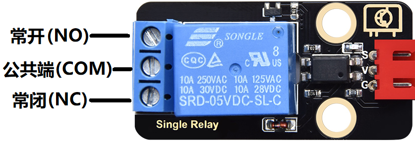


------

- **常开（NO）：** 该引脚是常开的，除非向继电器模块的信号引脚提供信号，因此，普通接触针通过NC脚断开其连接，通过NO脚建立连接。

- **公共触点（COM）：** 此引脚用来连接其他模块，如水泵。

​				水泵： 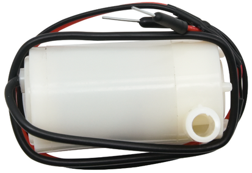

- **常闭（NC）：** 此NC引脚通过COM引脚连接，形成闭合电路，可以通过ESP32等开发板，控制继电器模块，来切换闭合或断开。

------

**规格参数：**

- 供电电压：5V
- 静态电流：2mA
- 最高触点电压：250VAC/30VDC
- 最大电流：10A

------

**原理图：**

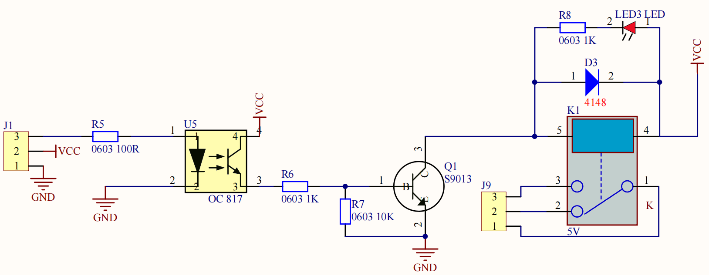

------


**3\. 接线图:**

- **继电器模块连接到io25，继电器的NC端，连接到io2引脚接口的黑色的GND**

- **水泵：**
  - **红色线连接到3V3电源，如图所示**
  - **黑色线GND连接到继电器的COM端，如图所示**


**注意使用连接线连接时，黄色线为S信号线，红色线为V电源线，黑色线为GND，颜色一一对应，请勿插反！**

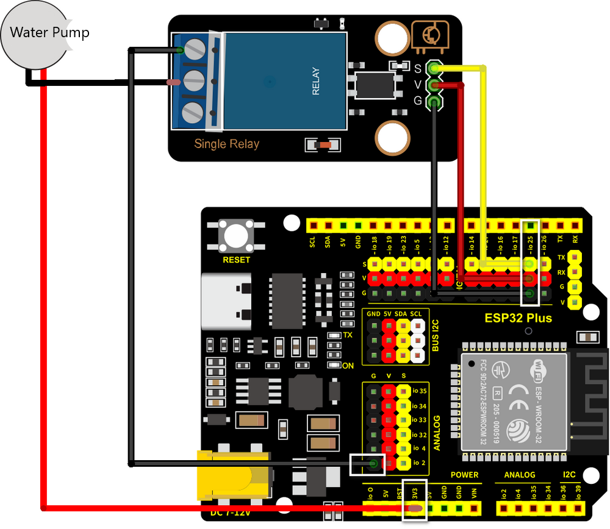

------

**4\. 实验代码：**

打开Arduino IDE，选择对应的开发板板型（ESP32 Dev Module）和 适当的串口端口（COMxx）。

------

在Arduino IDE中，编写如下代码：

```c++
#define RelayPin 25

void setup() {
  Serial.begin(9600);
  pinMode(RelayPin,OUTPUT);
}

void loop() {
  //arduino串口方法Serial.read() 每次只接收一个字节
  //当键盘输入aaa时，每次只接收一个a，共接收三次
  if(Serial.available() > 0) {
    if (Serial.read() == 'a') //当输入的值等于a时，执行灌溉任务
    {
      digitalWrite(RelayPin,HIGH);
      delay(400);//灌溉的延时
      digitalWrite(RelayPin,LOW);
      delay(700);
    }
  }
}
```

------

**5\. 实验结果：**

选择好正确的开发板板型（ESP32 Dev Module）和 适当的串口端口（COMxx），然后单击按钮上传代码。上传代码成功后，打开串口监视器，设置好波特率为9600，在文本框中输入字母“ a ”，则继电器控制水泵会进行一次抽水。

通过这个项目，我们可以实现自动化的抽水泵控制，从而减少手动操作的时间和精力成本，提高生产效率。这种方法可以应用于多个领域，例如农业生产、水处理等。

------

6\. 实验扩展：

默认情况下，Arduino的串口接收函数 `Serial.read()` 只能读取一个字节。如果您需要接收多个字节，可以使用 `Serial.readBytes()` 函数。

例如，如果您要接收三个字节的数据，并将它们存储在一个字符数组中，可以使用以下代码：（`numBytes`为需要接收的字节数量，可自行设置）


在Arduino IDE中，编写如下代码：

```c++
const int numBytes = 3;
char receivedBytes[numBytes];

void setup() {
  Serial.begin(9600);
}

void loop() {
  if (Serial.available() >= numBytes) {
    Serial.readBytes(receivedBytes, numBytes);
    
    // 执行某些操作，例如打印接收到的字节
    for (int i = 0; i < numBytes; i++) {
      Serial.print(receivedBytes[i]);
    }
    Serial.println();
  }
}
```

在这个例子中，我们定义了一个字符数组 `receivedBytes` 来存储接收到的三个字节。在 `loop()` 函数中，我们检查串口是否有足够的字节可供读取。如果有足够的字节，我们使用 `Serial.readBytes()` 函数来读取三个字节，并将它们存储到 `receivedBytes` 数组中。

注意，`Serial.readBytes()` 函数的第一个参数是要接收数据的缓冲区，第二个参数是要读取的字节数。另外，`Serial.available()` 函数返回可读取的字节数，因此我们使用 `Serial.available() >= numBytes` 来检查是否有足够的字节可供读取。

------


### 自动灌溉系统

**1\. 概述:**

本教程介绍如何使用ESP32开发板来实现智能浇灌系统，使用到的传感器包括土壤湿度检测传感器和水位检测传感器，以及继电器和抽水泵。

------

在这个项目中，我们将通过连接土壤湿度检测传感器和水位检测传感器到ESP32开发板上，并编写代码来读取它们的输出值，以控制继电器和抽水泵。

当土壤过于干燥时，将打开继电器以控制抽水泵灌溉植物；当水位过低时，将无法启动抽水泵，通过蜂鸣器报警。通过这种方法，我们可以实现自动化的植物浇水和水位控制，提高生产效率，同时减少了手动操作的时间和精力成本。

------

**2\. 接线图:**

- **继电器模块连接到io25，继电器的NC端，连接到io2引脚接口的黑色的GND**

- **水泵：**
  - **红色线连接到3V3电源，如图所示**
  - **黑色线GND连接到继电器的COM端，如图所示**
- **土壤传感器连接到io32**
- **水位传感器连接到io33**

**注意使用连接线连接时，黄色线为S信号线，红色线为V电源线，黑色线为GND，颜色一一对应，请勿插反！**

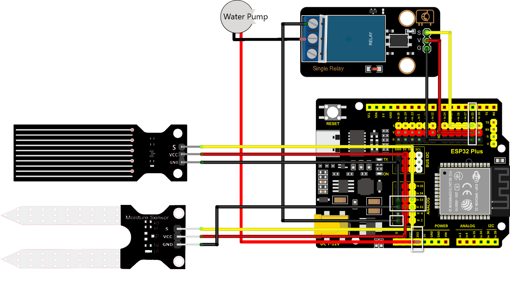

------

**3\. 代码流程图：**


------

**4\. 实验代码:**

打开Arduino IDE，选择对应的开发板板型（ESP32 Dev Module）和 适当的串口端口（COMxx）。

------

在Arduino IDE中，编写如下代码：

```c++
#include <LiquidCrystal_I2C.h>

#define BuzzerPin 16
#define SoilHumidityPin 32
#define WaterLevelPin 33
#define RelayPin 25
#define ButtonPin 5 //定义按键引脚
int value = 0;      //定义一个判断按键的值

LiquidCrystal_I2C lcd(0x27,16,2);

void setup() {
  //设置引脚模式
  pinMode(BuzzerPin,OUTPUT);
  pinMode(SoilHumidityPin,INPUT);
  pinMode(WaterLevelPin,INPUT);
  pinMode(RelayPin,OUTPUT);
  pinMode(ButtonPin,INPUT);

  //LCD初始化
  lcd.init();
  //开启LCD背光
  lcd.backlight();
  //清除LCD上显示的信息
  lcd.clear();
}

void loop() {
  //定义变量，存储读取到的水位、湿度和按键信息
  int shvalue = analogRead(SoilHumidityPin);
  int wlvalue = analogRead(WaterLevelPin);
  int ReadValue = digitalRead(ButtonPin); 

  //设置显示位置
  lcd.setCursor(0, 0);
  //设置显示信息
  lcd.print("SoilHum:");
  lcd.setCursor(9, 0);
  lcd.print(shvalue);
  lcd.setCursor(0, 1);
  lcd.print("WaterLevel:");
  lcd.setCursor(11, 1);
  lcd.print(wlvalue);

  //判断按钮是否被按下
  if (ReadValue == 0) {
    //软件去按键抖动
    delay(10);  
    if (ReadValue == 0) {
      value = !value;
      Serial.print("The current status of the button is : ");
      Serial.println(value);
    }
    //再次判断按钮，是否还处于按下状态
    //按下：一直空循环，松开：执行下一步
    while (digitalRead(ButtonPin) == 0); 
  }
  //当检测湿度到低于设定的阈值时，打开蜂鸣器预警，可由按键进行关闭
  if(500 >= shvalue && value == 0)
  {
    tone(BuzzerPin,532);
    delay(100);
    tone(BuzzerPin,532);
    delay(100);
    tone(BuzzerPin,659);
    delay(100);
    noTone(BuzzerPin);  //关闭
  }
  //当检测水位到低于设定的阈值时，打开蜂鸣器预警，可由按键进行关闭
  if(500 >= wlvalue && value == 0)
  {
    tone(BuzzerPin,411);
    delay(100);
    tone(BuzzerPin,639);
    delay(100);
    tone(BuzzerPin,411);
    delay(100);
    noTone(BuzzerPin);  //关闭
  }
  //土壤湿度低于设定的阈值时，且水池里的水源充足，抽水系统会进行自动灌溉
  if(500 >= shvalue && wlvalue >= 1000) {
    digitalWrite(RelayPin,HIGH);
    delay(400);//灌溉的延时
    digitalWrite(RelayPin,LOW);
    delay(700);
  }
  delay(500);
  //清除显示
  lcd.clear();
}
```
------

**5\. 实验结果：**

选择好正确的开发板板型（ESP32 Dev Module）和 适当的串口端口（COMxx），然后单击按钮上传代码，上传代码成功后。

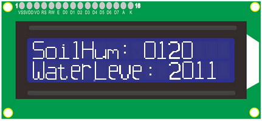

- LCD1602屏会显示当前土壤湿度和水池水位信息，当土壤湿度低于设定的阈值，说明土壤太干旱了，此时，抽水系统将自动对土地进行灌溉。

- 当水位低于设定的阈值时，抽水系统将不会工作，蜂鸣器会发出警报，提示水池里的水资源不足。

- 可以使用按钮来关闭蜂鸣器警报系统。

------

**总的来说，该项目不仅能够帮助我们实现自动化的植物浇水，还能够根据水位情况智能化地控制抽水泵的启停，适用于家庭和农业生产等多个领域。**

------

### 常见问题解答:

**1\.  问：传感器防水吗？**

答：继电器是不防水的，水泵防水等级为IP68。


**2\. 问：水泵转动导致ESP32开发板复位？**

答：。水泵在转动时，需要的电流比其他传感器要大，会引起电路中电压电流波动，电压电流波动过大，导致ESP32开发板的电压电流过低，导致复位。

在操作水泵时，为了适量的对土地进行灌溉，请按照示例给的代码操作：

```c++
	//进行一次灌溉代码
	digitalWrite(RelayPin,HIGH);
    delay(50);//灌溉的延时
    digitalWrite(RelayPin,LOW);
    delay(700);
```

------

**3\. 问：抽不出水？**

答：在开始使用水泵之前，需要进行几次抽水操作来充满水泵。这些初始的抽水过程无法真正抽取到水源，而是为了引入足够的水量到水泵中。只有在水泵充满水后，才能进行实际的抽水操作。因此，前几次抽水是为了充水，而非真正抽出水。

------

# 6. IOT教程

## 6.1 WIFI网页显示HelloWorld

### 6.1.1 简介

ESP32开发板它带有内置的Wi-Fi（2.4G）和Bluetooth（4.2）功能，可以轻松连接到Wi-Fi网络并与网络中的其他设备进行通信，您可以使用ESP32在浏览器中显示网页，此时网页显示 “Hello, World!”。


### 6.1.2 工作原理

ESP32 最有用的功能之一是它不仅能够连接到现有的 WiFi 网络并充当 Web 服务器，还可以创建自己的网络，允许其他设备直接连接到它并访问网页。这是因为ESP32可以在三种模式下运行：Station（STA）模式、Soft Access Point（AP）模式和Station+AP共存模式。

- Station模式（作为WiFi设备主动连接路由器，也叫做WiFi Client）
- AP模式（作为一个Access Point，让其他WiFi设备来连接）即WiFi热点
- Station+AP共存模式（ESP32连接路由器的同时自身也是一个热点供其他WiFi设备来连接）

所有WiFi编程项目在使用WiFi前必须配置WiFi运行模式，否则无法使用WiFi。在本实验课程中，我们将学习使用ESP32的WiFi Station模式。

在 Station 模式下，ESP32 连接到现有的 WiFi 网络（由无线路由器创建的网络）。

当ESP32选择Station模式时，它作为一个WiFi客户端。它可以连接路由器网络，通过WiFi连接与路由器上的其他设备通信。如下图所示，移动通信设备(智能手机/平板)、PC和路由器已经连接，ESP32如果要与移动通信设备和PC通信，需要将移动通信设备、PC和路由器连接起来。

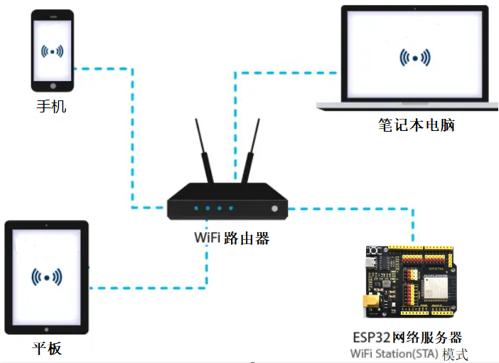

在 Station 模式下，ESP32 从其连接的无线路由器获取 IP 地址。使用此 IP 地址，它可以设置 Web 服务器并向现有 WiFi 网络上的所有连接设备提供网页。

<span style="color: rgb(255, 76, 65);">注意：</span>这样只能工作再一个局域网内，也就是说如果你的控制端与开发板连接的wifi不一致那么将无法进入Web服务器的控制页面。

更多wifi参考，请移步到乐鑫官方文档：https://docs.espressif.com/projects/esp-idf/en/latest/esp32/api-reference/network/esp_wifi.html

乐鑫官网：https://www.espressif.com.cn/en/home


### 6.1.3 接线图


### 6.1.4 实验代码

代码文件在`Arduino_代码`文件夹中（<u>路径：重要资源\程序代码\Arduino_代码</u>），代码文件为`6_1_WiFi-HTML-HelloWorld`，如图：


鼠标双击`6_1_WiFi-HTML-HelloWorld.ino`即可在Arduino IDE中打开。

<span style="color: rgb(255, 76, 65);">特别提醒：</span> 打开代码文件后，需要修改ESP32开发板需要连接的WiFi名称与密码，您需要将 `REPLACE_WITH_YOUR_SSID` 和 `REPLACE_WITH_YOUR_PASSWORD` 替换为您的 Wi-Fi 名称和密码。

```c++
const char* ssid = "REPLACE_WITH_YOUR_SSID";  //输入你自己的WiFi的名称
const char* password = "REPLACE_WITH_YOUR_PASSWORD"; //输入你自己的WiFi密码
```

Wi-Fi 名称和密码修改成功后才能上传代码，否则你的ESP32将无法连接网络。（<span style="color: rgb(255, 76, 65);">注意：WiFi必须是2.4Ghz频率的否则ESP32无法连接wWiFi</span>）

```c++
/*
 * 文件名 : 6_1_WiFi-HTML-HelloWorld
 * 功能   : WiFi网页显示Hello, World!
 * 编译IDE：ARDUINO 2.3.5
 * 作者   : https://www.keyesrobot.cn/
*/
#include <WiFi.h>
#include <WebServer.h>

/*替换为您的网络凭据（输入您自己的WiFi名称和密码）*/
const char* ssid = "REPLACE_WITH_YOUR_SSID";  //输入你自己的WiFi的名称
const char* password = "REPLACE_WITH_YOUR_PASSWORD"; //输入你自己的WiFi密码

WebServer server(80); //设置网页端口为80，可以直接输入IP地址进入网页，不需要输入端口号

//网页初始化
void handleRoot() {
  //用于向客户端发送HTTP响应,发送200表示成功
  server.send(200, "text/html", "<h1>Hello, World!</h1>");
}

void setup() {
  Serial.begin(9600);
  //wifi初始化
  WiFi.begin(ssid, password);
  //寻找wifi，未连接成功，则一直处于连接中状态，while循环
  while (WiFi.status() != WL_CONNECTED) {
    delay(1000);
    Serial.println("Connecting to WiFi...");
  }

  //连接成功，打印 IP 地址
  Serial.println("Connected to WiFi");
  Serial.println(WiFi.localIP());

  server.on("/", handleRoot);
  //启动服务器
  server.begin();
  Serial.println("Web server started");
}

void loop() {
  server.handleClient();
}
```

### 6.1.5 实验结果

按照接线图接线然后上传代码到开发板，手机或平板连接ESP32同一个wifi后打开串口并设置波特率为`9600`便会显示连接成功后的IP地址(如果看不到可以按复位按键重新连接一次)，输入IP地址就能进入控制页面。（如果你对上传代码存在疑惑，请查看教程的`1.6 使用Arduino IDE上传第一个程序`)

**<span style="color: rgb(255, 76, 65);">注意：</span>手机或平板一定要与ESP32开发板连接的是同一个WiFi，否则将无法进入控制页面，还有就是ESP32开发板在使用WiFi功能时功耗很大需要外接DC电源才能满足它的工作电力需求，如果达不到它的工作电力需求ESP32板将会一直复位导致代码无法正常运行。**

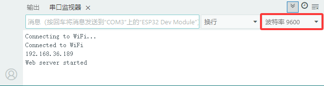

**最后，您可以使用浏览器打开ESP32的IP地址，并访问网页。在本例中，您可以在浏览器中输入 “http://[ESP32的IP地址]” 来查看 “Hello, World!”网页。**

**注意：当PC、手机和ESP32开发板，连接到同一个网络时，可在PC端和手机端同时打开这个网页。此处是你自己ESP32的IP地址**

*PC端：*


*手机端：*


### 4.1.6 代码说明

（1）. 在此代码中，我们使用ESP32的WebServer库来创建一个Web服务器。我们定义了一个 `handleRoot()` 函数，它将在根路径上处理请求，并向客户端发送“Hello, World!” 的HTML响应。然后，我们在 `setup()` 函数中设置服务器的根路径，并使用 `server.begin()` 函数启动Web服务器。

（2）. `server.send()` 是ESP32的WebServer库中的函数，用于向客户端发送HTTP响应。它需要指定三个参数：响应状态码、响应类型和响应内容。

  - 例如，以下代码使用 `server.send()` 函数将响应状态码200（表示成功），响应类型为“text/html”，响应内容为“Hello, World!”的HTML响应发送给客户端：

    ```c++
    void handleRoot() {
      server.send(200, "text/html", "<h1>Hello, World!</h1>");
    }
    ```

  - 在此代码中，`handleRoot()` 函数将在根路由上处理请求，并使用 `server.send()` 函数向客户端发送响应。第一个参数200是HTTP响应状态码，第二个参数"text/html"是响应类型，第三个参数是HTML响应内容。此响应将在客户端的浏览器中呈现为“Hello, World!”的标题。

  - 除了HTML响应，`server.send()` 函数还可以发送文本、JSON、XML和二进制数据等不同类型的响应。

（3）. `server.begin()` 是ESP32的WebServer库中的函数，用于在指定端口启动Web服务器。

  - 在使用ESP32的WebServer库时，您需要在 `setup()` 函数中调用 `server.begin()` 函数以启动Web服务器。例如：

    ```c++
    void setup() {
      // 其他代码...
      
      server.begin();
      
      // 其他代码...
    }
    ```

  - 在此代码中，`server.begin()` 函数将在默认端口80上启动Web服务器。如果您希望在不同的端口上启动Web服务器，则可以使用 `server.begin(port)` 函数指定端口号。例如，以下代码将在端口8080上启动Web服务器：

    ```c++
    void setup() {
      // 其他代码...
      
      server.begin(8080);
      
      // 其他代码...
    }
    ```

  - 一旦Web服务器已经启动，ESP32将监听来自客户端的HTTP请求，并在请求到达时调用相应的路由处理函数。在处理请求时，Web服务器将调用 `server.send()` 函数向客户端发送HTTP响应。要处理客户端请求，您需要在 `loop()` 函数中调用 `server.handleClient()` 函数，以便Web服务器可以在后台持续监听客户端请求。例如：

    ```c++
    void loop() {
      server.handleClient();
    }
    ```

    在此代码中，`server.handleClient()` 函数将处理客户端请求，如果有请求到达，则将调用相应的路由处理函数，并向客户端发送HTTP响应。由于此函数在 `loop()` 函数中调用，因此ESP32可以在后台持续监听客户端请求，并实现无限循环处理请求的功能。

-----------

## 6.2 WiFi控制LED

### 6.2.1 简介

本教程将为您详细介绍如何使用ESP32微控制器通过局域网WiFi控制LED灯。教程内容包括ESP32的WiFi功能配置、电路连接方法以及如何编写代码实现远程控制。您将学习如何设置ESP32为WiFi接入点（AP）或连接到现有WiFi网络，并通过网页界面发送控制指令来开关LED灯。无论您是物联网初学者还是有经验的开发者，本教程都将帮助您掌握ESP32的WiFi控制功能，为您的项目增添灵活的远程控制能力。

### 6.2.2 工作原理

ESP32 最有用的功能之一是它不仅能够连接到现有的 WiFi 网络并充当 Web 服务器，还可以创建自己的网络，允许其他设备直接连接到它并访问网页。这是因为ESP32可以在三种模式下运行：Station（STA）模式、Soft Access Point（AP）模式和Station+AP共存模式。

- Station模式（作为WiFi设备主动连接路由器，也叫做WiFi Client）
- AP模式（作为一个Access Point，让其他WiFi设备来连接）即WiFi热点
- Station+AP共存模式（ESP32连接路由器的同时自身也是一个热点供其他WiFi设备来连接）

所有WiFi编程项目在使用WiFi前必须配置WiFi运行模式，否则无法使用WiFi。在本实验课程中，我们将学习使用ESP32的WiFi Station模式。

在 Station 模式下，ESP32 连接到现有的 WiFi 网络（由无线路由器创建的网络）。

当ESP32选择Station模式时，它作为一个WiFi客户端。它可以连接路由器网络，通过WiFi连接与路由器上的其他设备通信。如下图所示，移动通信设备(智能手机/平板)、PC和路由器已经连接，ESP32如果要与移动通信设备和PC通信，需要将移动通信设备、PC和路由器连接起来。


在 Station 模式下，ESP32 从其连接的无线路由器获取 IP 地址。使用此 IP 地址，它可以设置 Web 服务器并向现有 WiFi 网络上的所有连接设备提供网页。

注意：这样只能工作再一个局域网内，也就是说如果你的控制端与开发板连接的wifi不一致那么将无法进入Web服务器的控制页面。


### 6.2.3 接线图

**模块连接到io27**

**⚠️注意：使用连接线连接时，黄色线为S信号线，红色线为V电源线，黑色线为GND，颜色一一对应，请勿插反！**


### 6.2.4 实验代码

代码文件在`Arduino_代码`文件夹中（<u>路径：重要资源\程序代码\Arduino_代码</u>），代码文件为`6_2_WiFi-HTML-Control-LED`，如图：


鼠标双击`6_2_WiFi-HTML-Control-LED.ino`即可在Arduino IDE中打开。

<span style="color: rgb(255, 76, 65);">特别提醒：</span> 打开代码文件后，需要修改ESP32开发板需要连接的WiFi名称与密码，您需要将 `REPLACE_WITH_YOUR_SSID` 和 `REPLACE_WITH_YOUR_PASSWORD` 替换为您的 Wi-Fi 名称和密码。

```c++
const char* ssid = "REPLACE_WITH_YOUR_SSID";  //输入你自己的WiFi的名称
const char* password = "REPLACE_WITH_YOUR_PASSWORD"; //输入你自己的WiFi密码
```

Wi-Fi 名称和密码修改成功后才能上传代码，否则你的ESP32将无法连接网络。（<span style="color: rgb(255, 76, 65);">注意：WiFi必须是2.4Ghz频率的否则ESP32无法连接WiFi</span>）

```c
/*  
 * 名称   : 6_2_WiFi-HTML-Control-LED
 * 功能   : 使用局域网wifi无线控制LED
 * 编译IDE：ARDUINO 2.3.5
 * 作者   : https://www.keyesrobot.cn/ 
*/
#include <WiFi.h>       // 引入WiFi库，控制ESP32的WiFi连接功能
#include <WebServer.h>  // 引入WebServer库，创建HTTP服务器

/*替换为您的网络凭据（输入您自己的WiFi名称和密码）*/
const char* ssid = "REPLACE_WITH_YOUR_SSID";  //输入你自己的WiFi的名称
const char* password = "REPLACE_WITH_YOUR_PASSWORD"; //输入你自己的WiFi密码

WebServer server(80);  // 创建一个Web服务器对象，监听80端口

uint8_t LED_Pin = 27;    // 绿色LED连接到GPIO17
bool LED_State = false;  // 绿色LED的状态，初始为关闭

void setup() {
  Serial.begin(9600);              // 初始化串口通信，波特率115200
  delay(100);                      // 延时100毫秒
  pinMode(LED_Pin, OUTPUT);  // 设置GPIO27为输出模式
 
  Serial.println("Connecting to ");
  Serial.println(ssid);  // 打印正在连接的Wi-Fi名称

  // 连接到Wi-Fi网络
  WiFi.begin(ssid, password);

  // 检查Wi-Fi是否连接成功
  while (WiFi.status() != WL_CONNECTED) {
    delay(1000);
    Serial.print(".");  // 每隔1秒打印一个点，表示正在连接
  }
  Serial.println("");
  delay(500);
  Serial.println("WiFi connected..!");  // Wi-Fi连接成功
  Serial.print("Got IP: ");
  Serial.println(WiFi.localIP());  // 打印分配到的IP地址

  // 设置不同URL路径的处理函数
  server.on("/", handle_OnConnect);                   // 根路径，初始化页面
  server.on("/LED_ON", handle_LED_ON);        // 红灯打开
  server.on("/LED_OFF", handle_LED_OFF);      // 红灯关闭
  server.onNotFound(handle_NotFound);                 // 处理未找到的路径

  server.begin();                         // 启动Web服务器
  Serial.println("HTTP server started");  // 打印服务器启动信息
}

void loop() {
  server.handleClient();  // 处理客户端请求
  if (LED_State) {
    digitalWrite(LED_Pin, HIGH);  // 如果LED状态为开，则输出高电平点亮LED
  } else {
    digitalWrite(LED_Pin, LOW);  // 否则输出低电平熄灭LED
  }
}

// 处理根路径请求，显示初始页面
void handle_OnConnect() {
  LED_State = false;                                                  // 初始时LED关闭
  Serial.println("GPIO27 Status: OFF");                // 打印LED状态
  server.send(200, "text/html", SendHTML(LED_State));  // 返回初始HTML页面
}

// 处理LED灯打开请求
void handle_LED_ON() {
  LED_State = true;                                                   // 设置红色LED状态为开
  Serial.println("GPIO27 Status: ON");                                      // 打印LED状态
  server.send(200, "text/html", SendHTML(LED_State));  // 返回更新后的HTML页面
}

// 处理绿灯关闭请求
void handle_LED_OFF() {
  LED_State = false;                                                  // 设置红色LED状态为关
  Serial.println("GPIO27 Status: OFF");                                     // 打印LED状态
  server.send(200, "text/html", SendHTML(LED_State));  // 返回更新后的HTML页面
}

// 处理未找到的路径
void handle_NotFound() {
  server.send(404, "text/plain", "Not found");  // 返回404错误
}

// 生成HTML页面，用来显示LED状态和控制按钮
String SendHTML(uint8_t LEDState) {
  String ptr = "<!DOCTYPE html> <html>\n";
  ptr += "<head><meta name=\"viewport\" content=\"width=device-width, initial-scale=1.0, user-scalable=no\">\n";
  ptr += "<title>LED Control</title>\n";
  ptr += "<style>html {font-family: Helvetica; display: inline-block; margin: 0px auto; text-align: center;}\n";
  ptr += "body{margin-top: 50px;} h1 {color: #444444;margin: 50px auto 30px;} h3 {color: #444444;margin-bottom: 50px;}\n";
  ptr += ".button {display: block;width: 80px;background-color: #3498db;border: none;color: white;padding: 13px 30px;text-decoration: none;font-size: 25px;margin: 0px auto 35px;cursor: pointer;border-radius: 4px;}\n";
  ptr += ".button-on {background-color: #3498db;}\n";
  ptr += ".button-on:active {background-color: #2980b9;}\n";
  ptr += ".button-off {background-color: #34495e;}\n";
  ptr += ".button-off:active {background-color: #2c3e50;}\n";
  ptr += "p {font-size: 14px;color: #888;margin-bottom: 10px;}\n";
  ptr += "</style>\n";
  ptr += "</head>\n";
  ptr += "<body>\n";
  ptr += "<h1>ESP32 Web Server</h1>\n";
  ptr += "<h3>Using Station(STA) Mode</h3>\n";

  // 根据LED状态生成HTML按钮
  if (LEDState) {
    ptr += "<p>LED State: ON</p><a class=\"button button-off\" href=\"/LED_OFF\">OFF</a>\n";
  } else {
    ptr += "<p>LED State: OFF</p><a class=\"button button-on\" href=\"/LED_ON\">ON</a>\n";
  }

  ptr += "</body>\n";
  ptr += "</html>\n";
  return ptr;  // 返回生成的HTML页面
}

```

### 6.2.5 实验结果

按照接线图接线然后上传代码到开发板，手机或平板连接ESP32同一个wifi后打开串口并设置波特率为`9600`便会显示连接成功后的IP地址(如果看不到可以按复位按键重新连接一次)，输入IP地址就能进入控制页面。（如果你对上传代码存在疑惑，请查看教程的`1.6 使用Arduino IDE上传第一个程序`)

**注意：手机或平板一定要与ESP32开发板连接的是同一个wifi，否则将无法进入控制页面，还有就是ESP32开发板在使用WiFi功能时功耗很大需要外接DC电源才能满足他的工作电力需求，如果达不到他的工作电力需求ESP32板将会一直复位导致代码无法正常运行。**

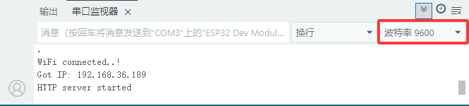

### 6.2.6 代码解释

(1). 首先包括 <span style="color: rgb(255, 76, 65);">WiFi.h</span> 库。该库包含我们用于连接到网络的 ESP32 特定方法；<span style="color: rgb(255, 76, 65);">WebServer.h</span> 库，也包含一些方法，这些方法将帮助我们配置服务器和处理传入的HTTP请求。

```c++
#include <WiFi.h>
#include <WebServer.h>
```

(2). 由于我们将ESP32 Web服务器配置为Station模式，它将创建自己的WiFi网络。因此，我们需要设置SSID和Password。

```c++
/*替换为您的网络凭据（输入您自己的WiFi名称和密码）*/
const char* ssid = "REPLACE_WITH_YOUR_SSID";  //输入你自己的WiFi的名称
const char* password = "REPLACE_WITH_YOUR_PASSWORD"; //输入你自己的WiFi密码
```

(3). 创建 <span style="color: rgb(255, 76, 65);">WebServer</span> 库的对象，以便可以访问它的函数。此对象的构造函数接受服务器将侦听的端口作为参数。由于HTTP默认使用端口80，因此将使用此值。这允许我们连接到服务器，而不需要在URL中指定端口。

```c++
WebServer server(80);  // 创建一个Web服务器对象，监听80端口
```

(4). 声明led连接的ESP32的GPIO引脚，以及它们的初始状态。

```c++
uint8_t LED_Pin = 27;    // 绿色LED连接到GPIO17
bool LED_State = false;  // 绿色LED的状态，初始为关闭
```

(5). 在 <span style="color: rgb(255, 76, 65);">setup()</span> 函数中，我们将ESP32 Web服务器配置为Station模式。首先，我们建立一个用于调试串行连接的串口波特率，并将GPIO引脚配置为OUTPUT。

```c++
  Serial.begin(9600);         // 初始化串口通信，波特率9600
  delay(100);                // 延时100毫秒
  pinMode(LED_Pin, OUTPUT);  // 设置GPIO27为输出模式
```
(6). 串口打印正在连接的Wi-Fi名称，并且使用 <span style="color: rgb(255, 76, 65);">WiFi.begin()</span> 函数加入一个现有的网络。

```c++
  Serial.println("Connecting to ");
  Serial.println(ssid);  // 打印正在连接的Wi-Fi名称

  // 连接到Wi-Fi网络
  WiFi.begin(ssid, password);

```

(7). 当ESP32尝试连接到网络时，我们可以使用 <span style="color: rgb(255, 76, 65);">WiFi.status()</span> 函数来检查连接状态。

```c++
  // 检查Wi-Fi是否连接成功
  while (WiFi.status() != WL_CONNECTED) {
    delay(1000);
    Serial.print(".");  // 每隔1秒打印一个点，表示正在连接
  }
```

(8). 一旦连接到网络，<span style="color: rgb(255, 76, 65);">WiFi.localIP()</span> 函数用于打印ESP32的IP地址.

```c++
  Serial.println("");
  delay(500);
  Serial.println("WiFi connected..!");  // Wi-Fi连接成功
  Serial.print("Got IP: ");
  Serial.println(WiFi.localIP());  // 打印分配到的IP地址
```

(9). 为了处理传入的HTTP请求，我们必须指定在访问特定URL时应该执行哪些代码。为此，我们使用 <span style="color: rgb(255, 76, 65);">.on()</span> 方法。该方法接受两个参数：一个相对URL路径和访问该URL时要执行函数的名称。

例如，下面代码片段的第一行表明，当服务器接收到根(/)路径上的HTTP请求时，它将调用 <span style="color: rgb(255, 76, 65);">handle_OnConnect()</span> 函数。重要的是要注意指定的URL是一个相对路径。类似地，我们必须再指定URL来处理LED的两种状态。

```c++
  // 设置不同URL路径的处理函数
  server.on("/", handle_OnConnect);            // 根路径，初始化页面
  server.on("/LED_ON", handle_LED_ON);        // 红灯打开
  server.on("/LED_OFF", handle_LED_OFF);      // 红灯关闭
```

(10). 如果客户端请求的URL没有使用 <span style="color: rgb(255, 76, 65);">server.on()</span> 指定，我们还没有指定服务器应该提供什么服务。它应该给出404错误（Page Not Found）作为响应。为此，我们使用 <span style="color: rgb(255, 76, 65);">server.onNotFound()</span> 方法。

```c++
  server.onNotFound(handle_NotFound);        // 处理未找到的路径
```

(11). 为了启动服务器，我们调用服务器对象的 `begin()` 方法。

```c++
  server.begin();                         // 启动Web服务器
  Serial.println("HTTP server started");  // 打印服务器启动信息
```

(12). 实际传入的HTTP请求在 <span style="color: rgb(255, 76, 65);">loop()</span> 函数中处理。为此，我们使用服务器对象的 <span style="color: rgb(255, 76, 65);">handleClient()</span> 方法。我们还根据请求改变led的状态。

```c++
void loop() {
  server.handleClient();  // 处理客户端请求
  if (LED_State) {
    digitalWrite(LED_Pin, HIGH);  // 如果LED状态为开，则输出高电平点亮LED
  } else {
    digitalWrite(LED_Pin, LOW);  // 否则输出低电平熄灭LED
  }
}
```

(13). 我们必须编写 <span style="color: rgb(255, 76, 65);">handle_OnConnect()</span> 函数，之前使用 <span style="color: rgb(255, 76, 65);">server.on</span> 将其附加到根（/）URL。我们通过将led的状态设置为false（led的初始状态）并将其打印在串行监视器上开始此功能。使用send方法来响应HTTP请求。尽管可以使用许多不同的参数调用该方法，但最简单的形式需要HTTP响应代码、内容类型和内容。传递给send方法的第一个参数是代码200（HTTP状态码之一），它对应于OK响应。然后将内容类型指定为 “**text/html**”，最后传递 <span style="color: rgb(255, 76, 65);">SendHTML()</span> 自定义函数，该函数生成带有LED状态的动态html页面。

```c++
// 处理根路径请求，显示初始页面
void handle_OnConnect() {
  LED_State = false;                                    // 初始时LED关闭
  Serial.println("GPIO27 Status: OFF");                // 打印LED状态
  server.send(200, "text/html", SendHTML(LED_State));  // 返回初始HTML页面
}
```

(14). 编写了三个函数来处理LED开/关请求和404错误页面。

```c++
// 处理LED灯打开请求
void handle_LED_ON() {
  LED_State = true;                                                   // 设置红色LED状态为开
  Serial.println("GPIO27 Status: ON");                                      // 打印LED状态
  server.send(200, "text/html", SendHTML(LED_State));  // 返回更新后的HTML页面
}

// 处理绿灯关闭请求
void handle_LED_OFF() {
  LED_State = false;                                                  // 设置红色LED状态为关
  Serial.println("GPIO27 Status: OFF");                                     // 打印LED状态
  server.send(200, "text/html", SendHTML(LED_State));  // 返回更新后的HTML页面
}

// 处理未找到的路径
void handle_NotFound() {
  server.send(404, "text/plain", "Not found");  // 返回404错误
}
```

(15). 显示HTML网页，当ESP32 Web服务器收到来自Web客户端的请求时，<span style="color: rgb(255, 76, 65);">SendHTML()</span> 函数就会生成一个Web页面。它只是将HTML代码连接到一个长字符串中，然后返回到我们前面讨论过的 <span style="color: rgb(255, 76, 65);">server.send()</span> 函数。该函数使用led的状态作为参数来动态生成HTML内容。你应该发送的第一个文本总是  **<!DOCTYPE> declaration**，这表明我们正在发送HTML代码。

```c++
// 生成HTML页面，用来显示LED状态和控制按钮
String SendHTML(uint8_t LEDState) {
  String ptr = "<!DOCTYPE html> <html>\n";
```

(16). **<meta> viewport element** 使网页响应，确保它在所有设备上看起来都很好。标题标签决定了页面的标题。

```c++
  ptr += "<head><meta name=\"viewport\" content=\"width=device-width, initial-scale=1.0, user-scalable=no\">\n";
  ptr += "<title>LED Control</title>\n";
```


(17). 设计网页样式，接下来我们使用 CSS 设计按钮和网页的整体外观。我们选择了Helvetica字体，并将显示的内容定义为行内块，居中对齐。

```c++
  ptr += "<style>html {font-family: Helvetica; display: inline-block; margin: 0px auto; text-align: center;}\n";
```

(18). 接下来的代码设置主体、H1、H3和p标记周围的颜色、字体和边距

```c++
  ptr += "body{margin-top: 50px;} h1 {color: #444444;margin: 50px auto 30px;} h3 {color: #444444;margin-bottom: 50px;}\n";
```

(14). 这些按钮还可以使用颜色、大小、边距等属性进行样式化。**:active selector** 在按钮被点击时改变按钮的外观。

```c++
  ptr += ".button {display: block;width: 80px;background-color: #3498db;border: none;color: white;padding: 13px 30px;text-decoration: none;font-size: 25px;margin: 0px auto 35px;cursor: pointer;border-radius: 4px;}\n";
  ptr += ".button-on {background-color: #3498db;}\n";
  ptr += ".button-on:active {background-color: #2980b9;}\n";
  ptr += ".button-off {background-color: #34495e;}\n";
  ptr += ".button-off:active {background-color: #2c3e50;}\n";
```

(15). 设置网页的标题。您可以将此文本更改为适合您的应用程序的任何内容。

```c++
  ptr +="<h1>ESP32 Web Server</h1>\n";
    ptr +="<h3>Using Station(STA) Mode</h3>\n";
```

(16). 显示按钮和相应的状态，if语句用于动态更新按钮和led的状态。

```c++
 if (LEDState) {
    ptr += "<p>LED State: ON</p><a class=\"button button-off\" href=\"/LED_OFF\">OFF</a>\n";
  } else {
    ptr += "<p>LED State: OFF</p><a class=\"button button-on\" href=\"/LED_ON\">ON</a>\n";
  }
```
--------------

## 6.3 WiFi控制蜂鸣器和风扇

### 6.3.1 简介

本教程将为您详细介绍如何使用ESP32微控制器通过局域网WiFi控制蜂鸣器和风扇。教程内容包括ESP32的WiFi功能配置、电路连接方法以及如何编写代码实现远程控制。您将学习如何设置ESP32为WiFi接入点（AP）或连接到现有WiFi网络，并通过网页界面发送控制指令来开关蜂鸣器和风扇。无论您是物联网初学者还是有经验的开发者，本教程都将帮助您掌握ESP32的WiFi控制功能，为您的项目增添灵活的远程控制能力。

### 6.3.2 工作原理

让我们假设ESP32的lP地址是192.168.XX.XX。以下是它的工作原理：

当你在Web浏览器的搜索框中输入192.168.XX.XX，搜索并且跳转网页。浏览器向Esp32发送请求，ESP32响应一个网页，其中包含用于控制蜂鸣器的打开/关闭按钮和风扇的打开/关闭按钮。

同样，当你点击网页上的 “Turn ON” 按钮或在网页浏览器中输入192.168.XX.XX/relay1/on时，ESP32使继电器吸合，LED点亮并响应控制网页。

同样，当你点击网页上的 “Turn OFF” 按钮或在网页浏览器中输入192.168.XX.XX/relay1/off时
ESP32使继电器断开，LED熄灭并响应控制网页。


### 6.3.3 接线图

**无源蜂鸣器模块连接到io16**；**电机模块的IN-连接到io18，IN+连接到io19**。

**⚠️注意：使用连接线连接时，黄色线为S信号线，红色线为V电源线，黑色线为GND，颜色一一对应，请勿插反！**


### 6.3.4 实验代码

代码文件在`Arduino_代码`文件夹中（<u>路径：重要资源\程序代码\Arduino_代码</u>），代码文件为`6_3_WiFi-HTML-Control-Buzzer-Fan`，如图：


鼠标双击`6_3_WiFi-HTML-Control-Buzzer-Fan.ino`即可在Arduino IDE中打开。

<span style="color: rgb(255, 76, 65);">特别提醒：</span> 打开代码文件后，需要修改ESP32开发板需要连接的WiFi名称与密码，您需要将 `REPLACE_WITH_YOUR_SSID` 和 `REPLACE_WITH_YOUR_PASSWORD` 替换为您的 Wi-Fi 名称和密码。

```c++
const char* ssid = "REPLACE_WITH_YOUR_SSID";  //输入你自己的WiFi的名称
const char* password = "REPLACE_WITH_YOUR_PASSWORD"; //输入你自己的WiFi密码
```

Wi-Fi 名称和密码修改成功后才能上传代码，否则你的ESP32将无法连接网络。（<span style="color: rgb(255, 76, 65);">注意：WiFi必须是2.4Ghz频率的否则ESP32无法连接WiFi</span>）

```c
/*  
 * 名称   : 6_3_WiFi-HTML-Control-Buzzer-Fan
 * 功能   : 使用局域网wifi无线控制蜂鸣器和风扇
 * 编译IDE：ARDUINO 2.3.5
 * 作者   : https://www.keyesrobot.cn/ 
*/
#include <WiFi.h>       // 引入WiFi库，控制ESP32的WiFi连接功能
#include <WebServer.h>  // 引入WebServer库，创建HTTP服务器

/*替换为您的网络凭据（输入您自己的WiFi名称和密码）*/
const char* ssid = "REPLACE_WITH_YOUR_SSID";  //输入你自己的WiFi的名称
const char* password = "REPLACE_WITH_YOUR_PASSWORD"; //输入你自己的WiFi密码

WebServer server(80);  // 创建一个Web服务器对象，监听80端口

uint8_t buzzer_Pin = 16;    // 蜂鸣器连接到GPIO16
bool Buzzer_State = false;  // 蜂鸣器的状态，初始为关闭

uint8_t motor_Pin1 = 19;    // 电机IN+引脚连接到GPIO19
uint8_t motor_Pin2 = 18;    // 电机IN-引脚连接到GPIO18
bool Motor_State = false;  // 电机的状态，初始为关闭

void setup() {
  Serial.begin(9600);              // 初始化串口通信，波特率9600
  delay(100);                      // 延时100毫秒
  pinMode(buzzer_Pin, OUTPUT);  // 设置GPIO16为输出模式
  pinMode(motor_Pin1, OUTPUT);    // 设置GPIO18为输出模式
  pinMode(motor_Pin2, OUTPUT);    // 设置GPIO19为输出模式

  Serial.println("Connecting to ");
  Serial.println(ssid);  // 打印正在连接的Wi-Fi名称

  // 连接到Wi-Fi网络
  WiFi.begin(ssid, password);

  // 检查Wi-Fi是否连接成功
  while (WiFi.status() != WL_CONNECTED) {
    delay(1000);
    Serial.print(".");  // 每隔1秒打印一个点，表示正在连接
  }
  Serial.println("");
  delay(500);
  Serial.println("WiFi connected..!");  // Wi-Fi连接成功
  Serial.print("Got IP: ");
  Serial.println(WiFi.localIP());  // 打印分配到的IP地址

  // 设置不同URL路径的处理函数
  server.on("/", handle_OnConnect);                   // 根路径，初始化页面
  server.on("/Buzzer_ON", handle_Buzzer_ON);        // 蜂鸣器打开
  server.on("/Buzzer_OFF", handle_Buzzer_OFF);      // 蜂鸣器关闭
  server.on("/Motor_ON", handle_Motor_ON);    // 风扇打开
  server.on("/Motor_OFF", handle_Motor_OFF);  // 绿灯关闭
  server.onNotFound(handle_NotFound);                 // 处理未找到的路径

  server.begin();                         // 启动Web服务器
  Serial.println("HTTP server started");  // 打印服务器启动信息
}

void loop() {
  server.handleClient();  // 处理客户端请求
  if (Buzzer_State) {
    digitalWrite(buzzer_Pin, HIGH);  // 如果蜂鸣器状态为开，则输出高电平，蜂鸣器鸣叫
    delay(1);
    digitalWrite(buzzer_Pin, LOW);  // 否则输出低电平关闭蜂鸣器
    delay(1);
  } else {
    digitalWrite(buzzer_Pin, LOW);  // 否则输出低电平关闭蜂鸣器
  }
  if (Motor_State) {
    // 如果风扇状态为开，则打开风扇
    analogWrite(motor_Pin1, 70);  
    analogWrite(motor_Pin2, 0);
  } else {
    // 否则关闭风扇
    analogWrite(motor_Pin1, 0);
    analogWrite(motor_Pin2, 0); 
  }
}

// 处理根路径请求，显示初始页面
void handle_OnConnect() {
  Buzzer_State = false;                                                  // 初始时关闭蜂鸣器
  Motor_State = false;                                                    // 初始时关闭风扇
  Serial.println("GPIO16 Status: OFF | GPIO18 Status: OFF | GPIO19 Status: OFF");  // 打印蜂鸣器和风扇状态
  server.send(200, "text/html", SendHTML(Buzzer_State, Motor_State));  // 返回初始HTML页面
}

// 处理红灯打开请求
void handle_Buzzer_ON() {
  Buzzer_State = true;                                                     // 设置绿色LED状态为开
  Serial.println("GPIO16 Status: ON");                                      // 打印蜂鸣器状态
  server.send(200, "text/html", SendHTML(Buzzer_State, Motor_State));  // 返回更新后的HTML页面
}

// 处理蜂鸣器关闭请求
void handle_Buzzer_OFF() {
  Buzzer_State = LOW;                                                      // 设置绿色LED状态为关
  Serial.println("GPIO16 Status: OFF");                                     // 打印LED状态
  server.send(200, "text/html", SendHTML(Buzzer_State, Motor_State));  // 返回更新后的HTML页面
}

// 处理风扇打开请求
void handle_Motor_ON() {
  Motor_State = true;                                                   // 设置红色LED状态为开
  Serial.println("GPIO18 Status: ON | GPIO19 Status: ON");                                      // 打印LED状态
  server.send(200, "text/html", SendHTML(Buzzer_State, Motor_State));  // 返回更新后的HTML页面
}

// 处理风扇关闭请求
void handle_Motor_OFF() {
  Motor_State = false;                                                  // 设置红色LED状态为关
  Serial.println("GPIO18 Status: OFF | GPIO19 Status: OFF");                                     // 打印LED状态
  server.send(200, "text/html", SendHTML(Buzzer_State, Motor_State));  // 返回更新后的HTML页面
}

// 处理未找到的路径
void handle_NotFound() {
  server.send(404, "text/plain", "Not found");  // 返回404错误
}

// 生成HTML页面，用来显示LED状态和控制按钮
String SendHTML(uint8_t RedState, uint8_t GreenState) {
  String ptr = "<!DOCTYPE html> <html>\n";
  ptr += "<head><meta name=\"viewport\" content=\"width=device-width, initial-scale=1.0, user-scalable=no\">\n";
  ptr += "<title>LED Control</title>\n";
  ptr += "<style>html { font-family: Helvetica; display: inline-block; margin: 0px auto; text-align: center;}\n";
  ptr += "body{margin-top: 50px;} h1 {color: #444444;margin: 50px auto 30px;} h3 {color: #444444;margin-bottom: 50px;}\n";
  ptr += ".button {display: block;width: 80px;background-color: #3498db;border: none;color: white;padding: 13px 30px;text-decoration: none;font-size: 25px;margin: 0px auto 35px;cursor: pointer;border-radius: 4px;}\n";
  ptr += ".button-on {background-color: #3498db;}\n";
  ptr += ".button-on:active {background-color: #2980b9;}\n";
  ptr += ".button-off {background-color: #34495e;}\n";
  ptr += ".button-off:active {background-color: #2c3e50;}\n";
  ptr += "p {font-size: 14px;color: #888;margin-bottom: 10px;}\n";
  ptr += "</style>\n";
  ptr += "</head>\n";
  ptr += "<body>\n";
  ptr += "<h1>ESP32 Web Server</h1>\n";
  ptr += "<h3>Using Station(STA) Mode</h3>\n";

  // 根据红色LED状态生成HTML按钮
  if (RedState) {
    ptr += "<p>Buzzer State: ON</p><a class=\"button button-off\" href=\"/Buzzer_OFF\">OFF</a>\n";
  } else {
    ptr += "<p>Buzzer State: OFF</p><a class=\"button button-on\" href=\"/Buzzer_ON\">ON</a>\n";
  }

  // 根据绿色LED状态生成HTML按钮
  if (GreenState) {
    ptr += "<p>Motor State: ON</p><a class=\"button button-off\" href=\"/Motor_OFF\">OFF</a>\n";
  } else {
    ptr += "<p>Motor State: OFF</p><a class=\"button button-on\" href=\"/Motor_ON\">ON</a>\n";
  }

  ptr += "</body>\n";
  ptr += "</html>\n";
  return ptr;  // 返回生成的HTML页面
}
```

### 6.3.5 实验结果

按照接线图接线然后上传代码到开发板，手机或平板连接ESP32同一个wifi后打开串口并设置波特率为`9600`便会显示连接成功后的IP地址(如果看不到可以按复位按键重新连接一次)，输入IP地址就能进入控制页面。（如果你对上传代码存在疑惑，请查看教程的`1.6 使用Arduino IDE上传第一个程序`)

**注意：手机或平板一定要与ESP32开发板连接的是同一个wifi，否则将无法进入控制页面，还有就是ESP32开发板在使用WiFi功能时功耗很大需要外接DC电源才能满足他的工作电力需求，如果达不到他的工作电力需求ESP32板将会一直复位导致代码无法正常运行。**


-----------------

## 6.4 WiFi读取传感器

### 6.4.1 简介

本教程将为您详细介绍如何使用ESP32微控制器通过局域网WiFi读取光敏传感器和水滴传感器的数据，并在网页上实时显示。您将学习如何设置ESP32为WiFi接入点（AP）或连接到现有WiFi网络，并通过网页界面实时显示光照强度值和水量值。此外，教程还涵盖了网络通信协议、数据可视化和系统优化的基本方法。无论您是物联网初学者还是有经验的开发者，本教程都将帮助您掌握ESP32的WiFi数据采集和网页显示功能，为您的项目增添实时的环境监测能力。

### 6.4.2 工作原理

- ESP32 通过 `WiFi.begin()` 连接到局域网。
- 获取本地 IP 地址，用于客户端访问。

- ESP32 使用 `WiFiServer` 创建一个 HTTP 服务器。
- 当客户端（如浏览器）访问 ESP32 的 IP 地址时，ESP32 会生成一个 HTML 页面，并将传感器数据嵌入到页面中。

- 网页通过 HTML 和 CSS 显示传感器数据。
- 使用 JavaScript 定时刷新页面或通过 AJAX 请求实时更新数据。

### 6.4.3 接线图

**光敏传感器模块连接到io34**，**水滴传感器模块连接到io35**。

**注意使用连接线连接时，黄色线为S信号线，红色线为V电源线，黑色线为GND，颜色一一对应，请勿插反！**


### 6.4.4 实验代码

代码文件在`Arduino_代码`文件夹中（<u>路径：重要资源\程序代码\Arduino_代码</u>），代码文件为`6_4_WiFi-HTML-Read-Sensor`，如图：


鼠标双击`6_4_WiFi-HTML-Read-Sensor.ino`即可在Arduino IDE中打开。

<span style="color: rgb(255, 76, 65);">特别提醒：</span> 打开代码文件后，需要修改ESP32开发板需要连接的WiFi名称与密码，您需要将 `REPLACE_WITH_YOUR_SSID` 和 `REPLACE_WITH_YOUR_PASSWORD` 替换为您的 Wi-Fi 名称和密码。

```c++
const char* ssid = "REPLACE_WITH_YOUR_SSID";  //输入你自己的WiFi的名称
const char* password = "REPLACE_WITH_YOUR_PASSWORD"; //输入你自己的WiFi密码
```

Wi-Fi 名称和密码修改成功后才能上传代码，否则你的ESP32将无法连接网络。（<span style="color: rgb(255, 76, 65);">注意：WiFi必须是2.4Ghz频率的否则ESP32无法连接WiFi</span>）

```c
/*  
 * 名称   : 6_4_WiFi-HTML-Read-Sensor
 * 功能   : 使用局域网wifi无线读取光照强度值与水量值并显示再网页上
 * 编译IDE：ARDUINO 2.3.5
 * 作者   : https://www.keyesrobot.cn/ 
*/

#include <WiFi.h>       // 引入WiFi库，控制ESP32的WiFi连接功能
#include <WebServer.h>  // 引入WebServer库，创建HTTP服务器

/*替换为您的网络凭据（输入您自己的WiFi名称和密码）*/
const char* ssid = "REPLACE_WITH_YOUR_SSID";  //输入你自己的WiFi名称
const char* password = "REPLACE_WITH_YOUR_PASSWORD"; //输入你自己的WiFi密码

WebServer server(80);  // 创建一个Web服务器对象，监听80端口

// 传感器引脚
const int Steam_Pin = 35;       //定义雨滴传感器的引脚GPIO35
const int Light_Pin = 34;  // 光敏传感器接入的引脚GPIO34

void setup() {
  Serial.begin(9600);  // 初始化串口通信，波特率9600
  delay(100);          // 延时100毫秒

  Serial.println("Connecting to ");
  Serial.println(ssid);  // 打印正在连接的Wi-Fi名称

  // 连接到Wi-Fi网络
  WiFi.begin(ssid, password);

  // 检查Wi-Fi是否连接成功
  while (WiFi.status() != WL_CONNECTED) {
    delay(1000);
    Serial.print(".");  // 每隔1秒打印一个点，表示正在连接
  }
  Serial.println("");
  delay(500);
  Serial.println("WiFi connected..!");  // Wi-Fi连接成功
  Serial.print("Got IP: ");
  Serial.println(WiFi.localIP());  // 打印分配到的IP地址

  // 设置不同URL路径的处理函数
  server.on("/", handle_OnConnect);    // 根路径，初始化页面
  server.onNotFound(handle_NotFound);  // 处理未找到的路径

  server.begin();                         // 启动Web服务器
  Serial.println("HTTP server started");  // 打印服务器启动信息
}

void loop() {
  server.handleClient();  // 处理客户端请求
}

// 处理根路径请求，显示初始页面
void handle_OnConnect() {
  int lightValue = analogRead(Light_Pin);  // 读取光敏传感器的值
  int steamValue = analogRead(Steam_Pin);  //读取雨滴传感器的值

  String htmlPage = "<!DOCTYPE html><html>\n";
  htmlPage += "<head><meta name=\"viewport\" content=\"width=device-width, initial-scale=1.0, user-scalable=no\">\n";
  htmlPage += "<title>ESP32 Sensor Data</title>\n";
  htmlPage += "<meta http-equiv=\"refresh\" content=\"1\"> <!-- 自动刷新页面，每5秒刷新一次 -->\n";
  htmlPage += "<style>html { font-family: Helvetica; display: inline-block; margin: 0px auto; text-align: center;}\n";
  htmlPage += "body{margin-top: 50px; background-color: #f4f4f9;} h1 {color: #444444;margin: 50px auto 30px;} h3 {color: #444444;margin-bottom: 50px;}\n";
  htmlPage += "p {font-size: 20px;color: #444;margin-bottom: 10px;}\n";
  htmlPage += ".sensor-box { background-color: #fff; padding: 20px; border-radius: 8px; box-shadow: 0 4px 6px rgba(0, 0, 0, 0.1); width: 300px; margin: 20px auto;}\n";
  htmlPage += ".sensor-title { font-size: 24px; font-weight: bold; color: #333; margin-bottom: 10px; }\n";
  htmlPage += ".sensor-value { font-size: 28px; color: #e74c3c; }\n";
  htmlPage += "</style>\n";
  htmlPage += "</head>\n";
  htmlPage += "<body>\n";
  htmlPage += "<h1>ESP32 Sensor Data</h1>\n";

  // 光敏传感器数据显示区
  htmlPage += "<div class=\"sensor-box\">\n";
  htmlPage += "<div class=\"sensor-title\">Light Sensor Value:</div>\n";
  htmlPage += "<div class=\"sensor-value\">" + String(lightValue) + "</div>\n";
  htmlPage += "</div>\n";

  // 雨滴传感器数据显示区
  htmlPage += "<div class=\"sensor-box\">\n";
  htmlPage += "<div class=\"sensor-title\">Steam Sensor Value:</div>\n";
  htmlPage += "<div class=\"sensor-value\">" + String(steamValue) + "</div>\n";
  htmlPage += "</div>\n";

  htmlPage += "</body>\n";
  htmlPage += "</html>\n";

  server.send(200, "text/html", htmlPage);  // 返回HTML页面
}

// 处理未找到的路径
void handle_NotFound() {
  server.send(404, "text/plain", "Not found");  // 返回404错误
}
```

### 6.4.5 实验结果

按照接线图接线然后上传代码到开发板，手机或平板连接ESP32同一个wifi后打开串口并设置波特率为`9600`便会显示连接成功后的IP地址(如果看不到可以按复位按键重新连接一次)，输入IP地址就能进入传感器数据显示页面。（如果你对上传代码存在疑惑，请查看教程的`1.6 使用Arduino IDE上传第一个程序`)

**注意：手机或平板一定要与ESP32开发板连接的是同一个wifi，否则将无法进入控制页面，还有就是ESP32开发板在使用WiFi功能时功耗很大需要外接DC电源才能满足他的工作电力需求，如果达不到他的工作电力需求ESP32板将会一直复位导致代码无法正常运行。**


### 6.4.6 代码解释


-------------

## 6.5. WIFI控制：智慧农场管理系统

------

***请注意，使用设备时不要让水从水池和土壤池中溢出。如果水洒到其他传感器上，会导致短路，影响设备正常工作。另外，如果水洒到电池上，会导致发热和爆炸等危险。因此，请在使用设备时格外小心，尤其是幼儿使用时一定要在家长的监护下进行。为确保设备的安全运行，请遵循相关使用指南和安全规范。***

------


------

### 网页操控ESP32流程：

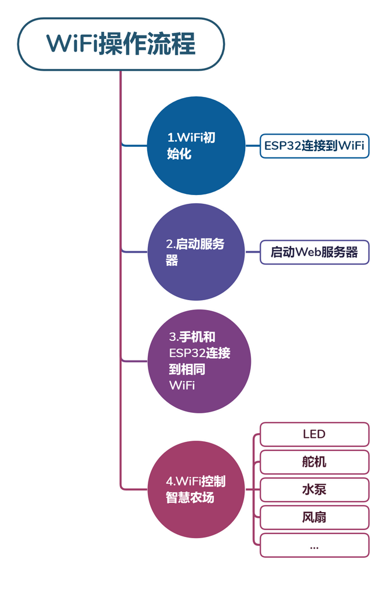

------


### WIFI网页控制：智慧农场管理系统

***注意：此教程涉及HTML、CSS、JS等课外知识，请自行gogle搜索，此处只做简单介绍。***

#### 代码流程图：


------

烧录以下代码。

其中**SSID**和**PASS**改为自己的wifi名称和密码：

```c++
const char *SSID = "your_SSID";
const char *PASS = "your_PASSWORD";
```

在Arduino IDE中，编写如下代码：

```c++
#include <Arduino.h>
/* 判断是ESP32还是8266开发板，两种开发板的库不通用，在编译之前引入对应的开发板的库，以免编译出错 */
#ifdef ESP32
  #include <WiFi.h>
  #include <AsyncTCP.h>
#elif defined(ESP8266)
  #include <ESP8266WiFi.h>
  #include <ESPAsyncTCP.h>
#endif
/* 导入相应的库文件 */
#include <ESPAsyncWebServer.h>
#include <LiquidCrystal_I2C.h>
#include <dht11.h>
#include <analogWrite.h>
#include <ESP32_Servo.h>

#define DHT11PIN        17  //温湿度传感器引脚
#define LEDPIN          27  //LED引脚
#define SERVOPIN        26  //舵机引脚
#define FANPIN1         19  //风扇的IN+引脚
#define FANPIN2         18  //风扇的IN-引脚
#define STEAMPIN        35  //雨滴传感器引脚
#define LIGHTPIN        34  //光敏传感器引脚
#define SOILHUMIDITYPIN 32  //土壤湿度传感器
#define WATERLEVELPIN   33  //水位传感器
#define RELAYPIN        25  //继电器引脚

dht11 DHT11;
//初始化LCD1602，其中0x27为I2C地址
LiquidCrystal_I2C lcd(0x27,16,2);

const char *SSID = "your_SSID";
const char *PASS = "your_PASSWORD";

static int A = 0;
static int B = 0;
static int C = 0;

// 创建WebServer对象, 端口号80，使用端口号80可以直接输入IP访问，使用其它端口需要输入IP:端口号访问
AsyncWebServer server(80);
Servo myservo;  // create servo object to control a servo
                // 16 servo objects can be created on the ESP32

// 一个储存网页的数组
const char index_html[] PROGMEM = R"rawliteral(
<!DOCTYPE HTML>
<html>
<title>TEST HTML ESP32</title>
<head>
  <meta charset="utf-8">
</head>
<body>
  <div class="btn">
    <div id="dht"></div>
    <button id="btn-led" onclick="setLED()">LED</button>
    <button id="btn-fan" onclick="setFan()">Fan</button>
    <button id="btn-feeding" onclick="setFeeding()">Feeding</button>
    <button id="btn-watering" onclick="setWatering()">Watering</button>
  </div>
</body>
<script>
    // 按下按钮会运行这个JS函数
    function setLED() {
      var payload = "A"; // 需要发送的内容
      // 通过get请求给 /set
      var xhr = new XMLHttpRequest();
      xhr.open("GET", "/set?value=" + payload, true);
      xhr.send();
    }
    function setFan() {
      var payload = "B"; // 需要发送的内容
      // 通过get请求给 /set
      var xhr = new XMLHttpRequest();
      xhr.open("GET", "/set?value=" + payload, true);
      xhr.send();
    }
    function setFeeding() {
      var payload = "C"; // 需要发送的内容
      // 通过get请求给 /set
      var xhr = new XMLHttpRequest();
      xhr.open("GET", "/set?value=" + payload, true);
      xhr.send();
    }
    function setWatering() {
      var payload = "D"; // 需要发送的内容
      // 通过get请求给 /set
      var xhr = new XMLHttpRequest();
      xhr.open("GET", "/set?value=" + payload, true);
      xhr.send();
    }
    // 设置一个定时任务, 1000ms执行一次
    setInterval(function () {
      var xhttp = new XMLHttpRequest();
      xhttp.onreadystatechange = function () {
        if (this.readyState == 4 && this.status == 200) {
          // 此代码会搜索ID为dht的组件，然后使用返回内容替换组件内容
          document.getElementById("dht").innerHTML = this.responseText;
        }
      };
      // 使用GET的方式请求 /dht
      xhttp.open("GET", "/dht", true);
      xhttp.send();
    }, 1000)
</script>
<style>
  /*网页效果*/
  html,body{margin: 0;width: 100%;height: 100%;}
  body{display: flex;justify-content: center;align-items: center;}
  #dht{text-align: center;width: 100%;height: 100%;color: #fff;background-color: #47a047;font-size: 48px;}
  .btn button{width: 100%;height: 100%;border: none;font-size: 30px;color: #fff;position: relative;}
  button{color: #ffff;background-color: #89e689;margin-top: 20px;}
  .btn button:active{top: 2px;}
</style>
</html>
)rawliteral";

//获取数据，并将数据打包成HTML格式的数据
String Merge_Data(void)
{
  //定义变量，存储值
  String dataBuffer;
  String Humidity;
  String Temperature;
  String Steam;
  String Light;
  String SoilHumidity;
  String WaterLevel;
  //获取数据
  int chk = DHT11.read(DHT11PIN);
  //雨滴传感器
  Steam = String(analogRead(STEAMPIN) / 4095.0 * 100);
  //光敏传感器
  Light = String(analogRead(LIGHTPIN));
  //土壤湿度传感器
  int shvalue = analogRead(SOILHUMIDITYPIN) / 4095.0 * 100 * 2.3;
  shvalue = shvalue > 100 ? 100 : shvalue;
  SoilHumidity = String(shvalue);
  //水位传感器
  int wlvalue = analogRead(WATERLEVELPIN) / 4095.0 * 100 * 2.5;
  wlvalue = wlvalue > 100 ? 100 : wlvalue;
  WaterLevel = String(wlvalue);
  //温度
  Temperature = String(DHT11.temperature);
  //湿度
  Humidity = String(DHT11.humidity);
  
  // 将数据打包为一个HTML显示代码
  dataBuffer += "<p>";
  dataBuffer += "<h1>Sensor Data</h1>";
  dataBuffer += "<b>Temperature:</b><b>";
  dataBuffer += Temperature;
  dataBuffer += "</b><b>℃</b><br/>";
  dataBuffer += "<b>Humidity:</b><b>";
  dataBuffer += Humidity;
  dataBuffer += "</b><b>%rh</b><br/>";
  dataBuffer += "<b>WaterLevel:</b><b>";
  dataBuffer += WaterLevel;
  dataBuffer += "</b><b>%</b><br/>";
  dataBuffer += "<b>Steam:</b><b>";
  dataBuffer += Steam;
  dataBuffer += "</b><b>%</b><br/>";
  dataBuffer += "<b>Light:</b><b>";
  dataBuffer += Light;
  dataBuffer += "</b><b></b><br/>";
  dataBuffer += "<b>SoilHumidity:</b><b>";
  dataBuffer += SoilHumidity;
  dataBuffer += "</b><b>%</b><br/>";
  dataBuffer += "</p>";

  // 最后要将数组返回出去
  return dataBuffer;
}

// 下发处理回调函数
void Config_Callback(AsyncWebServerRequest *request)
{
  if (request->hasParam("value")) // 如果有值下发
  {
    // 获取下发的数据
    String HTTP_Payload = request->getParam("value")->value();
    // 打印调试信息   
    Serial.printf("[%lu]%s\r\n", millis(), HTTP_Payload.c_str());

    //LED
    if(HTTP_Payload == "A"){
      if(A){
        digitalWrite(LEDPIN,LOW);
        A = 0;
      }
      else{
        digitalWrite(LEDPIN,HIGH);
        A = 1;
      }
    }
    //FAN
    if(HTTP_Payload == "B"){
      if(B){
        //停止
        digitalWrite(FANPIN1, LOW);
        digitalWrite(FANPIN2, LOW);
        B = 0;
      }
      else{
        delay(500);
        digitalWrite(FANPIN1, HIGH);
        digitalWrite(FANPIN2, LOW);
        delay(500);
        B = 1;
      }
    }
    //FEEDING
    if(HTTP_Payload == "C"){
      if(C){
        //舵机转到80度时，打开饲料盒
        myservo.write(80);
        delay(500);
        C = 0;
      }
      else{
        C = 1;
        //舵机转到180度时，关闭饲料盒
        myservo.write(180);
        delay(500);
      }
    }
    //WATERING
    if(HTTP_Payload == "D"){
      digitalWrite(RELAYPIN,HIGH);
      delay(50);//灌溉的延时
      digitalWrite(RELAYPIN,LOW);
      delay(650);
    }
  }
  request->send(200, "text/plain", "OK"); // 发送接收成功标志符
}

//设置访问无效的网址入口
void notFound(AsyncWebServerRequest *request) {
    request->send(404, "text/plain", "Not found");
}
  
void setup()
{
  Serial.begin(9600);
  // 连接到热点，并通过LCD屏显示IP地址
  WiFi.begin(SSID, PASS);
  while (!WiFi.isConnected())
  {
    delay(500);
    Serial.print(".");
  }
  Serial.println("WiFi connected.");
  Serial.println("IP address: "); 
  Serial.println(WiFi.localIP());

  
  //引脚初始化
  pinMode(LEDPIN,OUTPUT);
  pinMode(STEAMPIN,INPUT);
  pinMode(LIGHTPIN,INPUT);
  pinMode(SOILHUMIDITYPIN,INPUT);
  pinMode(WATERLEVELPIN,INPUT);
  pinMode(RELAYPIN,OUTPUT);
  pinMode(FANPIN1,OUTPUT);
  pinMode(FANPIN2,OUTPUT);

  delay(1000);

  // attaches the servo on pin 26 to the servo object
  myservo.attach(SERVOPIN);   

  //LCD初始化
  lcd.init();
  // Turn the (optional) backlight off/on
  lcd.backlight();
  //lcd.noBacklight();
  //清空显示
  lcd.clear();
  
  
  //设置位置
  lcd.setCursor(0, 0);
  //显示
  lcd.print("IP:");
  lcd.setCursor(0, 1);
  lcd.print(WiFi.localIP());
  
  // 添加HTTP主页，当访问的时候会把网页推送给访问者
  server.on("/", HTTP_GET, [](AsyncWebServerRequest *request)
            { request->send(200, "text/html", index_html); });

  // 设置反馈的信息，在HTML请求这个Ip/dht这个链接时，返回打包好的传感器数据
  server.on("/dht", HTTP_GET, [](AsyncWebServerRequest *request)
            { request->send(200, "text/plain", Merge_Data().c_str()); });

  // 绑定配置下发的处理函数
  server.on("/set", HTTP_GET, Config_Callback);   
  // 绑定好访问的无效地址
  server.onNotFound(notFound);
  // 初始化HTTP服务器
  server.begin();  
}
void loop(){

}
```

------

***PC端显示：***

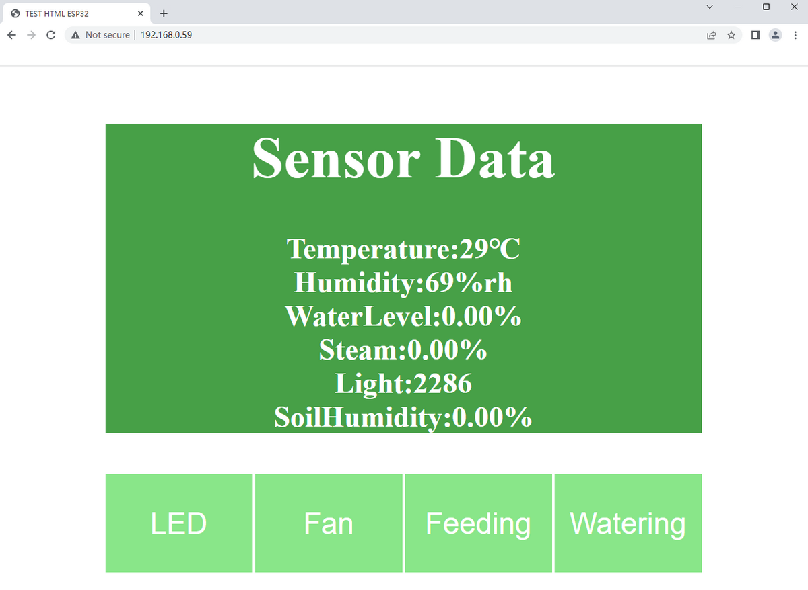

------

***手机端显示：***

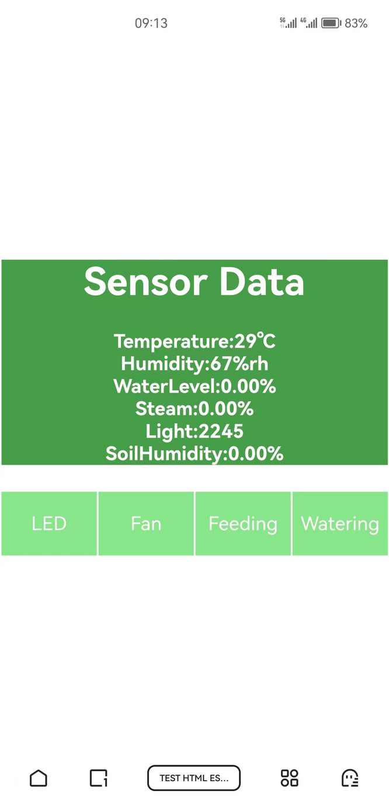

在手机和PC端，在浏览器打开对应的IP地址，即可查看到传感器数据，还可以控制LED和风扇等。

------


|   传感器数据   |   可控制   |
| :------------: | :--------: |
|   温度（℃）    |  LED开关   |
|  湿度（%rh）   |  风扇开关  |
|   水位（%）    | 饲料盒开关 |
|   雨量（%）    | 抽水泵开关 |
| 光照（0~4095） |            |
| 土壤湿度（%）  |            |

------

在以上的Arduino教程中，我们学会了如何使用ESP32开发板，创建一个网页并将传感器数据显示出来。例如，我们可以显示当前的温度、湿度、水池水位和土壤湿度等等。我们也可以使用这个开发板来控制LED灯、风扇、饲料盒和抽水泵等设备。而且，我们可以通过手机或电脑远程操作这些设备。


通过这个教程，我们可以模拟真实的农场，并实现农场的智能化控制，使物联网、信息化、自动化和智能化成为可能。这样的技术可以让我们更方便地控制农场设备，提高农业生产的效率和质量。

------


## FAQ

### 问：WiFi一直连接不上？

答：请将ESP32移动到路由器周边，重启ESP32，耐心等待连接即可。若还是一直连接不上，请查看WiFi名称和密码是否填写正确。

------

### 问：网页端远程操作其他传感器时，反应很慢？

答：路由器网络传输变慢的原因：

- 多人连接，路由器CPU资源不足，重启路由器，重新连接。
- 路由器系统使用时间过长，重启路由器。
- 无线干扰，无线信号不稳定时，请勿穿墙使用。

路由器相关知识，请自行**go0gle**搜索。

------

### 问：抽不出水？

答：在开始使用水泵之前，需要进行几次抽水操作来充满水泵。这些初始的抽水过程无法真正抽取到水源，而是为了引入足够的水量到水泵中。只有在水泵充满水后，才能进行实际的抽水操作。因此，前几次抽水是为了充水，而非真正抽出水。

------

## 6.6. WiFi+APP控制：智慧农场管理系统

------

#### ***请注意，使用设备时不要让水从水池和土壤池中溢出。如果水洒到其他传感器上，会导致短路，影响设备正常工作。另外，如果水洒到电池上，会导致发热和爆炸等危险。因此，请在使用设备时格外小心，尤其是幼儿使用时一定要在家长的监护下进行。为确保设备的安全运行，请遵循相关使用指南和安全规范。***

------


#### 概述

APP智慧农场管理系统可以实时监测农场的温湿度、水池水位、土壤湿度、光照强度和雨量。

同时，它还能控制LED灯进行照明，控制水泵进行灌溉，控制饲料盒进行喂养，控制风扇和模拟调整农场的温湿度。


可以使用手机上的APP实现这些操作，从而方便快捷地管理农场。此外，该系统还可以使用蜂鸣器播放声音，实现更加智能化的管理。

------

#### APP控制流程：


------


##### 先给ESP32烧录控制代码

###### ESP32连接到WiFi，此处ssid为WiFi的名称，pwd为WiFi密码。

```c++
const char* ssid = "your_SSID";
const char* pwd = "your_PASSWORD";
```

##### 在setup()方法中，初始化wifi

```c++
  WiFi.begin(ssid, pwd);

  Serial.println("Connecting to WiFi...");
  while (WiFi.status() != WL_CONNECTED) {
    delay(1000);
    Serial.print(".");
  }
```

##### ESP32连接成功后，打开串口，会显示ESP32的IP地址。

```c++
  Serial.println("Connected to WiFi");
  Serial.print("WiFi NAME:");
  Serial.println(ssid);
  Serial.print("IP:");
  Serial.println(WiFi.localIP());
```

##### 初始化其他传感器，需要控制和显示的传感器，比如LED的引脚、LCD1602屏幕和DHT11温湿度传感器等等

```c++
  //LCD初始化
  lcd.init();

  pinMode(LEDPIN,OUTPUT);
  pinMode(RAINWATERPIN,INPUT);
  pinMode(LIGHTPIN,INPUT);
  pinMode(SOILHUMIDITYPIN,INPUT);
  pinMode(WATERLEVELPIN,INPUT);
  pinMode(RELAYPIN,OUTPUT);
  pinMode(FANPIN1,OUTPUT);
  pinMode(FANPIN2,OUTPUT);
  pinMode(BUZZERPIN,OUTPUT);
  delay(1000);
```

##### 初始化wifi服务

```c++
  server.begin();
```

##### 当初始化完成后，ESP32和APP，可以用WIFI进行通信

###### ESP32端接收APP发来的数据

```c++
//用于检查是否有客户端连接到Web服务器。
  //当客户端连接到服务器时，server.available()方法将返回一个WiFiClient对象，用于与客户端通信。
  WiFiClient client = server.available();

 if (client) {
    Serial.println("New client connected");
    while (client.connected()) {
      //判断服务器是否传来数据
      if (client.available()) {
        //保存传输过来的数据
        request = client.readStringUntil('s');
        //串口打印数据
        Serial.print("Received message: ");
        Serial.println(request);
      }
    }
```

###### ESP32发送数据给APP

```c++
//发送数据到服务器，传给APP
	client.print(dataBuffer);
```


###### 代码流程图：

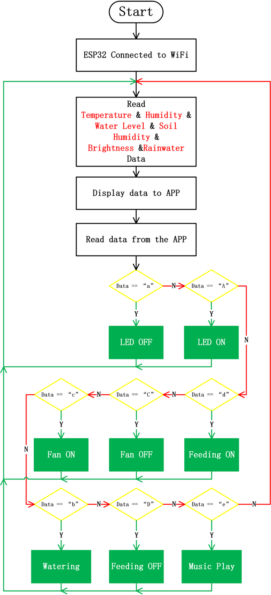

------

*注意："BuzzerMusic.h"和12.1APP-Smart-Farm.ino放在同一文件夹下。*

##### 完整代码


在Arduino IDE中，编写如下代码：

```c++
#include <Arduino.h>
#ifdef ESP32
  #include <WiFi.h>
#elif defined(ESP8266)
  #include <ESP8266WiFi.h>
#endif

#include <dht11.h>
#include <analogWrite.h>
#include <ESP32_Servo.h>
#include <LiquidCrystal_I2C.h>
#include "BuzzerMusic.h"

//显示
#define DHT11PIN        17  //温湿度传感器引脚
#define RAINWATERPIN    35  //雨滴传感器引脚
#define LIGHTPIN        34  //光敏传感器引脚
#define WATERLEVELPIN   33  //水位传感器
#define SOILHUMIDITYPIN 32  //土壤湿度传感器
//控制
#define LEDPIN          27  //LED引脚
#define RELAYPIN        25  //继电器水泵控制引脚
#define SERVOPIN        26  //舵机引脚
#define FANPIN1         19  //风扇的IN+引脚
#define FANPIN2         18  //风扇的IN-引脚
#define BUZZERPIN       16  //蜂鸣器引脚

const char* ssid = "ppip";
const char* pwd = "88888888";

//初始化LCD1602，其中0x27为I2C地址
LiquidCrystal_I2C lcd(0x27,16,2);
WiFiServer server(80);  //初始化wifi端口
dht11 DHT11;            //初始化温湿度传感器
Servo myservo;          // create servo object to control a servo
                // 16 servo objects can be created on the ESP32

//定义变量，存储传感器值
String request;
String dataBuffer;
int Temperature;   //温度
int Humidity;      //湿度
int SoilHumidity;  //土壤湿度
int Light;         //光照亮度
int WaterLevel;    //水位
int Rainwater;     //雨量

void setup() {
  Serial.begin(9600);
  //连接到wifi
  WiFi.begin(ssid, pwd);
  //判断是否连接成功
  Serial.println("Connecting to WiFi...");
  while (WiFi.status() != WL_CONNECTED) {
    delay(1000);
    Serial.print(".");
  }
  delay(1000);
  //串口打印wifi名称和IP地址
  Serial.println("Connected to WiFi");
  Serial.print("WiFi NAME:");
  Serial.println(ssid);
  Serial.print("IP:");
  Serial.println(WiFi.localIP());

  //LCD初始化
  lcd.init();
  // Turn the (optional) backlight off/on
  lcd.backlight();
  //lcd.noBacklight();
  lcd.clear();
  //设置位置
  lcd.setCursor(0, 0);
  //显示
  lcd.print(ssid);
  //设置位置
  lcd.setCursor(0, 1);
  //显示
  lcd.print(WiFi.localIP());
    
  //引脚初始化
  pinMode(LEDPIN,OUTPUT);
  pinMode(RAINWATERPIN,INPUT);
  pinMode(LIGHTPIN,INPUT);
  pinMode(SOILHUMIDITYPIN,INPUT);
  pinMode(WATERLEVELPIN,INPUT);
  pinMode(RELAYPIN,OUTPUT);
  pinMode(FANPIN1,OUTPUT);
  pinMode(FANPIN2,OUTPUT);
  pinMode(BUZZERPIN,OUTPUT);
  delay(1000);

  // attaches the servo on pin 26 to the servo object
  myservo.attach(SERVOPIN);

  //启动服务
  server.begin();
}

void loop() {
  //用于检查是否有客户端连接到Web服务器。
  //当客户端连接到服务器时，server.available()方法将返回一个WiFiClient对象，用于与客户端通信。
  WiFiClient client = server.available();
  if (client) {
    Serial.println("New client connected");
    while (client.connected()) {
      //判断服务器是否传来数据
      if (client.available()) {
        request = client.readStringUntil('s');
        Serial.print("Received message: ");
        Serial.println(request);
      }
        //获取所有传感器的数据
        getSensorsData();
        //把多个数据拼接到dataBuffer中
        dataBuffer = "";
        dataBuffer += String(Temperature,HEX);
        dataBuffer += String(Humidity,HEX);
        dataBuffer += dataHandle(SoilHumidity);
        dataBuffer += dataHandle(Light);
        dataBuffer += dataHandle(WaterLevel);
        dataBuffer += dataHandle(Rainwater);
        //发送数据到服务器，传给APP
        client.print(dataBuffer);
        delay(500);

      //LED
      if(request == "a")
      {
        digitalWrite(LEDPIN,HIGH);
      }
      else if(request == "A")
      {
        digitalWrite(LEDPIN,LOW);
      }
      //灌溉
      else if(request == "b")
      {
        digitalWrite(RELAYPIN,HIGH);
        delay(50);//灌溉的延时
        digitalWrite(RELAYPIN,LOW);
        delay(650);
      }
      //风扇
      else if(request == "c")
      {
        delay(800);
        digitalWrite(FANPIN1, HIGH);
        digitalWrite(FANPIN2, LOW);
        delay(200);
      }
      else if(request == "C")
      {
        digitalWrite(FANPIN1, LOW);
        digitalWrite(FANPIN2, LOW);
      }
      //饲料盒
      else if(request == "D")
      {
        //舵机转到180度时，打开饲料盒
        myservo.write(180);
        delay(500);
      }
      else if(request == "d")
      {
        //舵机转到80度时，关闭饲料盒
        myservo.write(80);
      }
      //音乐
      else if(request == "e")
      {
        Music();
      }
      request = "";
    }
    Serial.println("Client disconnected");
  }
}

void getSensorsData() {
  //获取数据
  int chk = DHT11.read(DHT11PIN);
  //雨滴传感器
  Rainwater = analogRead(RAINWATERPIN);
  //光敏传感器
  Light = analogRead(LIGHTPIN);
  //土壤湿度传感器
  SoilHumidity = analogRead(SOILHUMIDITYPIN) * 1.8;
  //水位传感器
  WaterLevel = analogRead(WATERLEVELPIN) * 1.8;
  //温度
  Temperature = DHT11.temperature;
  //湿度
  Humidity = DHT11.humidity;
}

void Music() {
  // iterate over the notes of the melody:
  for (int thisNote = 0; thisNote < 98; thisNote++) {
  
    // to calculate the note duration, take one second
    // divided by the note type.
    //e.g. quarter note = 1000 / 4, eighth note = 1000/8, etc.
    int noteDuration = 1000/noteDurations2[thisNote];
    tone(BUZZERPIN, melody2[thisNote],noteDuration);
    
    // to distinguish the notes, set a minimum time between them.
    // the note's duration + 30% seems to work well:
    int pauseBetweenNotes = noteDuration * 1.30;
    delay(pauseBetweenNotes);
    // stop the tone playing:
    noTone(BUZZERPIN);
  }
}

//将数据转换成百分比
String dataHandle(int data){
  // 将模拟值转换为百分比
  int percentage = (data / 4095.0) * 100;
  percentage = percentage > 100 ? 100 : percentage;	
  // 6个字符用于存储十六进制字符串，1个字符用于终止符
  char hexString[3];
  // 将十六进制值转换成6位十六进制字符串，并添加前导零
  sprintf(hexString, "%02X", percentage);

  return hexString;
}
```

------


#### APP下载


##### Android：

- 从Google play中下载：打开Google play，搜索IOT farm，点击下载即可。

  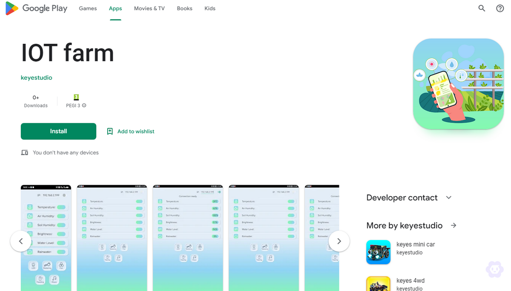

- 从我们提供的资料中，有Android apk安装包：

  

##### IOS：

在APP Store 中搜索**IOT farm**，点击下载即可。

------


#### APP界面：

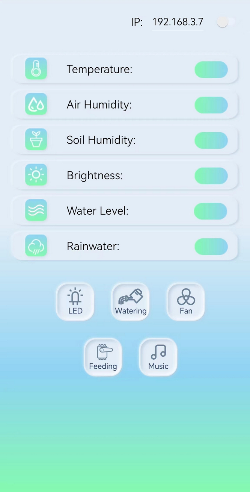

------


##### APP功能介绍

1. 当手机和ESP32开发板连接到相同WIFI时，在APP的右上方输入ESP32的IP地址，即可连接。

   

2. 显示农场的实时温度

   

3. 显示农场的实时湿度

   

4. 显示土壤的实时湿度

   

5. 显示太阳光照强度

   

6. 显示水池的水位

   

7. 显示农场下雨量

   

8. 控制LED

   

9. 控制水泵进行灌溉

   

10. 控制风扇调节温度

    

11. 控制舵机，开关饲料盒

    

12. 控制蜂鸣器，播放音乐

    


------


## FAQ

### 问：ESP32 WiFi一直连接不上？

答：请将ESP32移动到路由器周边，重启ESP32，耐心等待连接即可。若还是一直连接不上，请查看WiFi名称和密码是否填写正确。

------

### 问：APP连接不上ESP32？

答：请确保APP和ESP32都连接到相同的WiFi。

------

### 问：抽不出水？

答：在开始使用水泵之前，需要进行几次抽水操作来充满水泵。这些初始的抽水过程无法真正抽取到水源，而是为了引入足够的水量到水泵中。只有在水泵充满水后，才能进行实际的抽水操作。因此，前几次抽水是为了充水，而非真正抽出水。

------