## 4.2.1 Arduino IDE 简介

Arduino IDE是一款专为Arduino硬件设计的集成开发环境，它以初学者友好的界面和强大的开源代码支持而闻名。这款工具不仅简化了编程过程，降低了开发门槛，还为初学者提供了一个易于上手的学习平台。

Arduino IDE拥有简洁直观的用户界面，支持语法高亮、自动完成等功能，使得编程过程变得轻松愉快。更重要的是，它基于开放源代码，这意味着用户可以自由访问、修改和分发代码，从而大大扩展了开发的可能性。

对于初学者来说，Arduino IDE提供了丰富的教程、示例代码和社区支持，帮助他们快速上手并解决实际问题。同时，开源代码的特性也意味着用户可以借鉴和学习他人的代码，加速自己的学习进程。

总之，Arduino IDE以其初学者友好的界面和强大的开源代码支持，成为了Arduino开发者不可或缺的工具之一，无论是初学者还是专业人士，都能从中受益。

## 4.2.2  Windows 系统

**特别提醒：本教程采用的 Arduino IDE 版本是 2.3.6 。如果是其他版本的话，不能保证本教程提供的示例代码能编译和上传成功。** 

### 4.2.2.1 Arduino IDE下载 

我们先到Arduino官方的网站：[Software | Arduino](https://www.arduino.cc/en/software/) 下载 Arduino IDE。

Arduino 软件有很多版本，有Windows，Mac，Linux系统的（如下图），而且还有过去老的版本，你只需要下载一个适合自己计算机系统的版本即可。

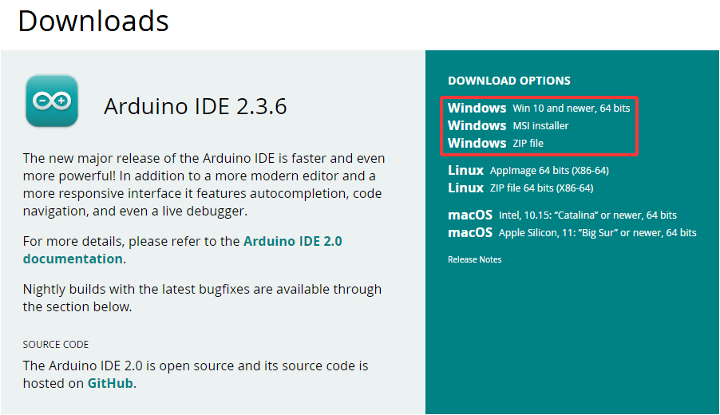

这里我们以Windows系统的为例给大家介绍下载和安装的步骤。Windows系统的也有两个版本，一个版本是安装版的，一个是下载版的不用安装，直接下载文件到电脑，解压缩就可以用了。


一般情况下，我们点击`JUST DOWNLOAD`就可以下载了，当然，如果你愿意，你可以选择小小的赞助一下，以帮助伟大的Arduino 开源事业。

### 4.2.2.1 Arduino IDE安装

1\. 保存从软件页面下载的.exe文件到硬盘驱动器，然后简单地运行该文件.


2\. 阅读许可协议并同意.


3\. 选择安装选项.

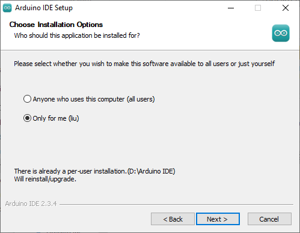

4\. 选择安装位置.


5\. 单击 "Finish" 并运行Arduino IDE


## 4.2.3 MacOS 系统

### 4.2.3.1 Arduino IDE下载

我们先到Arduino官方的网站：[Software | Arduino](https://www.arduino.cc/en/software/) 下载 Arduino IDE。

不同的系统，需要下载不同的Arduino IDE，下载方式和Windows类似。选择如下图。

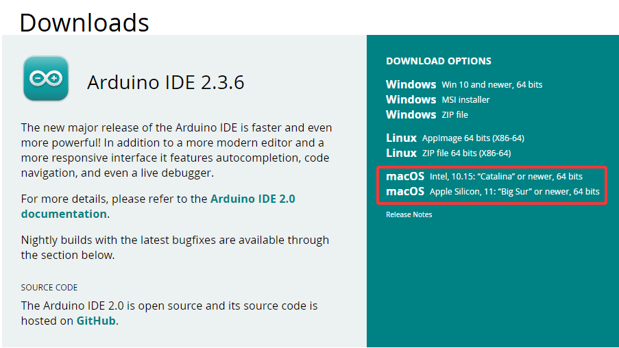

### 4.2.3.2 Arduino IDE安装

Arduino IDE选择之后，双击下载的`arduino_ide_xxxx.dmg`文件并按照说明将 **Arduino IDE.app** 复制粘贴到 **Applications** 文件夹，几秒钟后您将看到 Arduino IDE 安装成功.


## 4.2.4 Linux 系统

### 4.2.4.1 Arduino IDE下载

我们先到Arduino官方的网站：[Software | Arduino](https://www.arduino.cc/en/software/) 下载 Arduino IDE。

不同的系统，需要下载不同的Arduino IDE，下载方式和Windows类似。选择如下图。

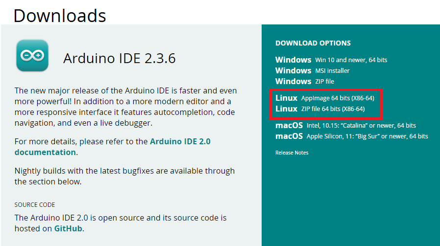

### 4.2.4.2 Arduino IDE安装

关于在 Linux 系统上安装 Arduino IDE 2 的教程，请参考：[https://docs.arduino.cc/software/ide-v2/tutorials/getting-started/ide-v2-downloading-and-installing/#linux](https://docs.arduino.cc/software/ide-v2/tutorials/getting-started/ide-v2-downloading-and-installing/#linux)

## 4.2.5 设置arduino IDE语言

⚠️ **特别提醒：Windows系统、MAC系统等不同系统，arduino IDE语言设置方法差不多，可以参考。**

1\. 首先打开Arduino IDE.

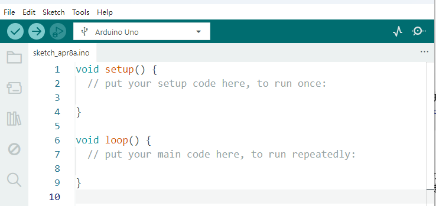

2\. 点击“**File** ——>**Preferences...**”，在**Preferences**对话框中，单击 “**English**” 按钮选择 “**中文(简体)**”，然后单击 “**OK**”.


3\. 这样，arduino IDE的语言切换完成了。这样，arduino IDE语言为中文。


## 4.2.6 Arduino IDE说明


1\. “文件”：列表里面的功能有新建项目，打开程序，打开最近使用的代码，打开示例代码，关闭IDE，保存代码，首选项，高级设置等。

2\. “编辑”：列表里面的功能有复制，粘贴，自动格式化，字体大小等这个一般都是使用快捷键进行操作。（建议坚持使用快捷键，接触多了就水到渠成了）。

3\. “项目”：列明里面的常用功能有验证\编译代码，上传代码，导入库等。

4\. “工具”：列表里面的常用功能有开发板选择，端口选择，这两个很重要。

5\. “帮助”：点击这个可以查看IDE版本已经官方的参考文件。

6\. “串口绘图仪”：它会将串口的数据以折线图的样式显示出来。

7\. “串口监视器”：可以将我们需要查看的数据在这里进行打印显示。

8\. 验证程序按钮。

9\. 验证并上传程序按钮。

10\. “项目文件夹”：可以新建项目，还可以只有arduino Cloud进行同步和编辑。

11\. “开发板管理器”：可以添加或删除开发板。

12\. “库管理”：就要添加和删除库。

13\. “调试”：可以对代码进行监视与断点调试。

14\. 搜索框。

15\. 代码编辑区。

16\. IDE提示区（上传代码报错或成功）和串口监视器显示区

至此Arduino IDE说明教程结束了，请学习如何给Arduino IDE添加库文件，如果没有添加库文件IDE会报错。

## 4.2.7 给Arduino IDE安装库文件(**重要**)

⚠️ **特别提醒：Windows系统、MAC系统等不同系统，安装库文件的方法差不多，可以相互参考；这里是以Windows系统为例。**

### 4.2.7.1 什么是库文件

库是代码的集合，使您可以轻松地连接到传感器、显示器、模块等。

例如：LiquidCrystal_I2C库使LCD1602显示变得容易，Internet上有数百个其他库可供下载。参考中列出了内置库和手动添加的库。 

在编译代码或上传代码时如果出现报错 “No such file or directory” 那就是缺少库文件，如下图就是上传LCD1602模块代码时因为缺少了LiquidCrystal_I2C库文件的报错。

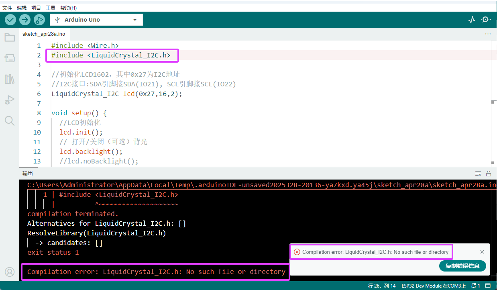

### 4.2.7.2 如何安装库文件

在这里，我们将为您介绍最简单的添加库的方法。我们是以添加LiquidCrystal_I2C库文件为例。

1\. 首先，依次点击左上角的 “**项目” > “导入库” > “添加 .Zip 库...”**

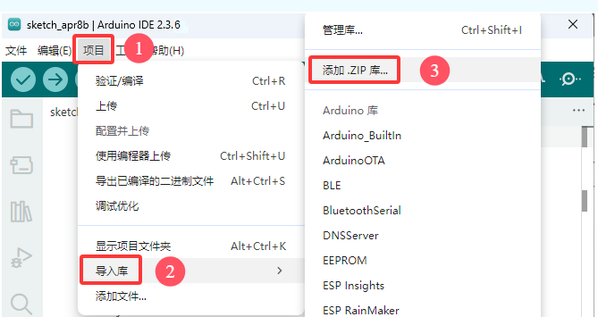

2\. 导航到库文件所在的目录，例如：***Arduino资料\Arduino_库文件*** 文件夹，然后选择对应的库文件（这里是以LiquidCrystal_I2C库文件为例，.zip格式），单击 “**打开(O)**”，即可添加成功。

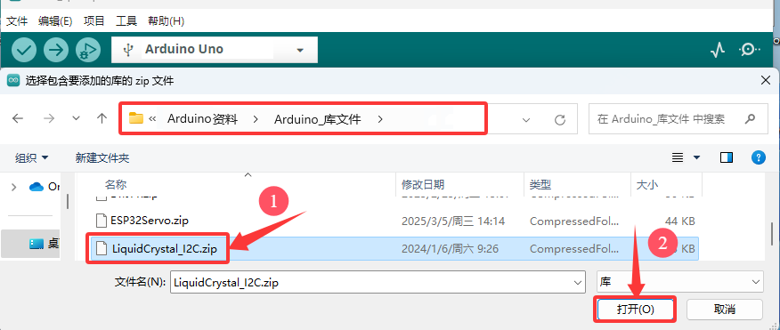

3\. 安装完成后，你将收到一条通知(已从LiquidCrystal_12C.zip存档成功安装库)，同时输出框会显示 “**Library installed**”，确认该库已成功添加到Arduino IDE中。下次需要使用此库时，你不需要重复安装过程。


4\. 重复相同的过程以添加其他库文件。

## 4.2.8 安装 ESP32 开发板(**重要**)

⚠️ **特别提醒：国内客户下载安装ESP32 开发板，由于网速原因需要网络翻墙，这样，ESP32 开发板更容易下载。**

### 4.2.8.1 Windows系统

我们发现在arduino IDE “**工具**”下的 “**开发板**” 中找不到ESP32开发板的选项，这是因为我们没有添加ESP32开发板，接下来我们一起来为Arduino IDE添加ESP32开发板吧!

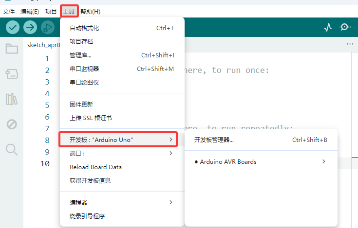

**安装ESP32开发板步骤如下：**

1\. 首先打开Arduino IDE.


2\. 点击“**文件** ——>**首选项...**”，在**其他开发板管理器地址**中，将ESP32开发板的链接：`https://espressif.github.io/arduino-esp32/package_esp32_index.json` 复制粘贴至文本框中，然后单击 “**确定**”.


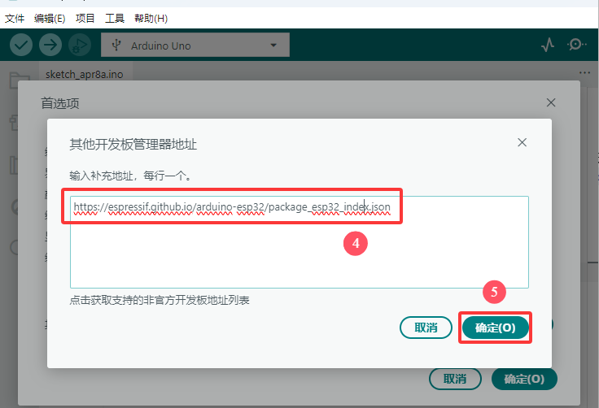

3\. 再点击 “**确定**”。

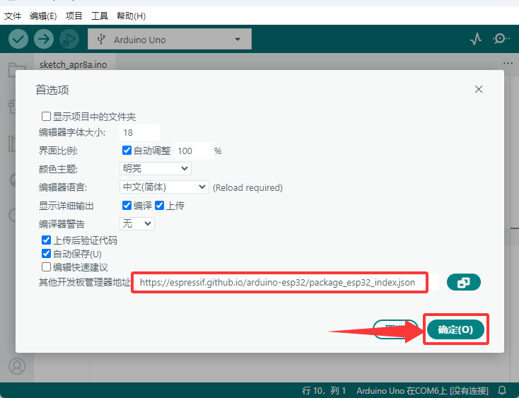

4\. 点击左边的开发板小图标，打开开发板选项。

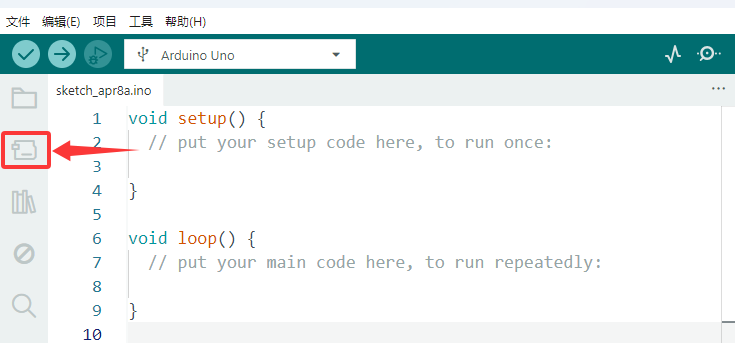

5\. 在开发板搜索框中，搜索 “**ESP32**”，点击安装最新版本，右下角可以看到开发板安装进度，等待几分钟安装完成。**安装过程中请保持网络稳定，如安装失败，请重复以上步骤，重新安装开发板即可。**

⚠️ **注意：本教程使用的是 ESP32 3.2.1 版本的ESP32开发板，请保持一致，以免出现代码不兼容情况。**


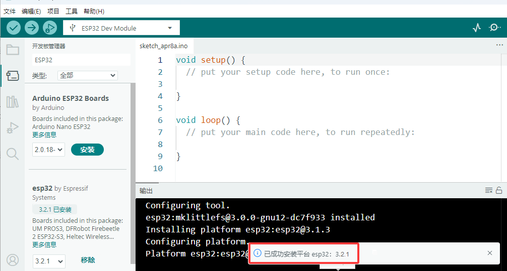

⚠️ **特别提醒：假如，由于网络问题实在是下载安装不了ESP32开发板，我们也提供有ESP32开发板的压缩包**，**ESP32开发板的压缩包下载地址：** [https://pan.baidu.com/s/10mfU2_aNru2dizP0vAFXlw?pwd=95ih](https://pan.baidu.com/s/10mfU2_aNru2dizP0vAFXlw?pwd=95ih) 

**提取码：95ih**

**压缩包下载后解压，把解压后的ESP32开发板文件夹按照以下路径添加。ESP32开发板一般需要存放于以下路径，才能说明ESP32开发板安装好。**

- **Windows 系统**：路径为C:\Users\你的用户名\AppData\Local\Arduino15\packages 。其中，AppData 是一个隐藏文件夹，你需要在文件夹选项中开启 “显示隐藏的文件、文件夹和驱动器” 才能看到。

⚠️ **提醒：** 上面路径中“你的用户名”是指你安装电脑时设置的用户名字，如果没有设置，一般都是Administrator。

- **macOS 系统**：位于~/Library/Arduino15/packages。Library 也是一个隐藏文件夹，你可以通过在 “**访达**” 中使用快捷键Command + Shift + G ，然后输入该路径来访问。

- **Linux 系统**：存于~/.arduino15/packages 。

6\. 安装成功后，重新启动 Arduino IDE，然后点击“**工具**” → “**开发板:**”，这样就可以看到安装成功的ESP32开发板。安装成功如图：

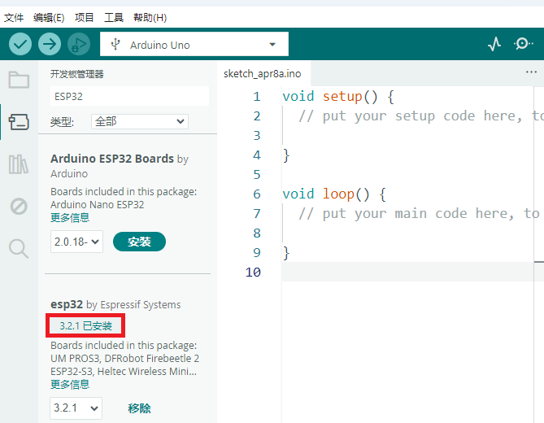

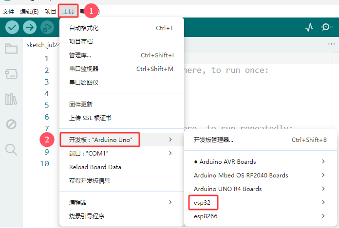

### 4.2.8.2 MAC系统

上面已经学习了怎么下载ArduinoIDE和怎么安装驱动，那下面就要在Arduino IDE上安装ESP32，请执行以下步骤：

**安装ESP32开发板步骤如下：**

1\. 首先打开Arduino IDE，点击“**Arduino IDE** ——>**首选项...**”，在**其他开发板管理器地址**中，将ESP32开发板的链接：`https://espressif.github.io/arduino-esp32/package_esp32_index.json` 复制粘贴至文本框中，，然后单击 “**确定**”.


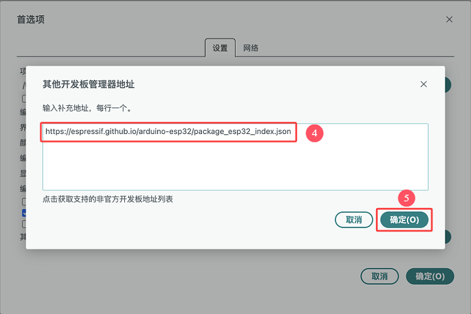

3\. 再点击 “**确定**”。

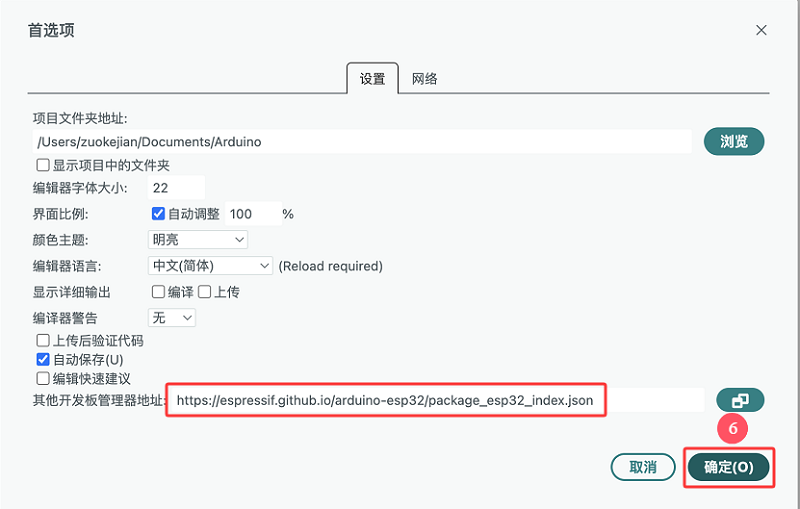

4\. 点击 “**工具**” ——> “**开发板**”  ——> “**开发板管理器...**”。


5\. 在开发板搜索框中，搜索 “**ESP32**”，点击安装最新版本，右下角可以看到开发板安装进度，等待几分钟安装完成。**安装过程中请保持网络稳定，如安装失败，请重复以上步骤，重新安装开发板即可。**

⚠️ **注意：本教程使用的是 ESP32 3.2.1 版本的ESP32开发板，请保持一致，以免出现代码不兼容情况。**

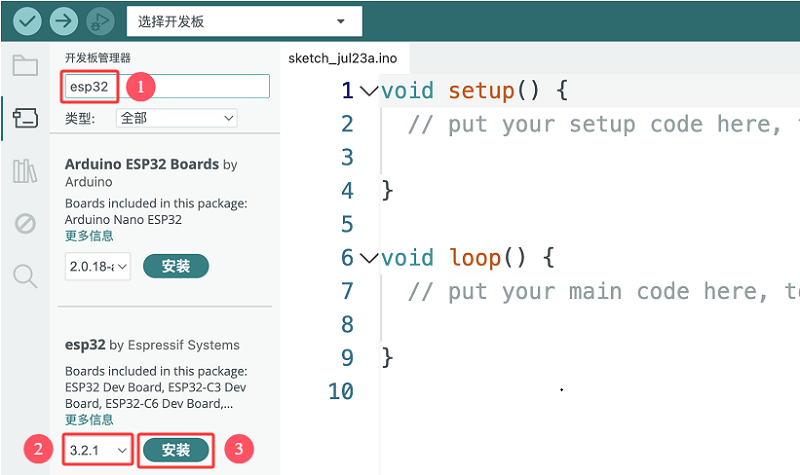

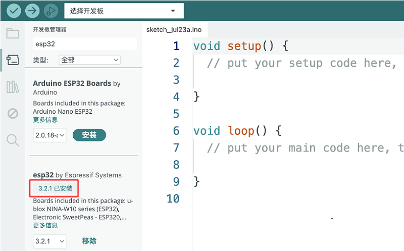

6\. 安装成功后，重新启动 Arduino IDE，然后点击“**工具**” → “**开发板:**”，这样就可以看到安装成功的ESP32开发板。安装成功如图：

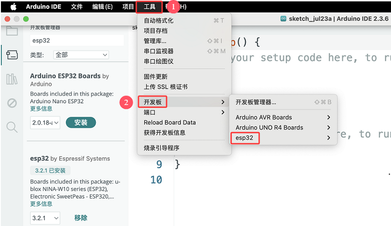

## 4.2.9 使用Arduino IDE上传第一个程序

先将ESP32开发板通过USB线连接到电脑。

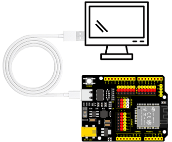

打开Arduino IDE 选择对应的ESP32开发板型号。


选好开发板后，选择开发板的COM口，开发板安装完驱动后会显示一个COM端口，如何你不知道你是哪个，可以进入你电脑的设备管理器中进行查看，如下图：（如果你有很多COM端口，你不知道是哪个就可以拔掉ESP32开发板看哪个消失了，然后再插上ESP32开发板消失的COM口又会显示出来，如果没有COM就请检查是否有安装好开发板驱动）


从图中可知我们的COM端口是COM3，我们在 “**工具**” 列表中选择 “**端口**” 然后选择 “COM3”。

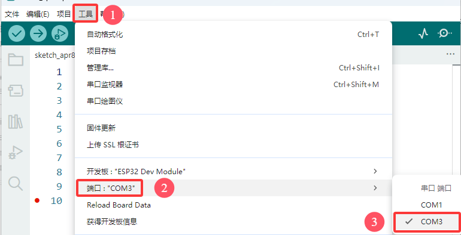

连接上开发板后，这两个地方都会显示已连接的标志，然后添加代码：这里我们提供一个示例代码，代码功能是在串口监视器中每隔一秒钟打印一次“Hello Keyes!”

将下面的代码复制粘贴到arduino IDE的代码区

```c
/*
  keyes 
  打印 “Hello Keyes!”
  http://www.keyesrobot.com
*/
void setup() {  
    // 把你的设置代码放在这里，运行一次:
    Serial.begin(9600);  //设置串口波特率为9600
}

void loop() {  
    // 将主代码放在这里，以便重复运行:
    Serial.println("Hello Keyes!");  //串口打印
 	delay(1000);  //延迟1秒
}
```

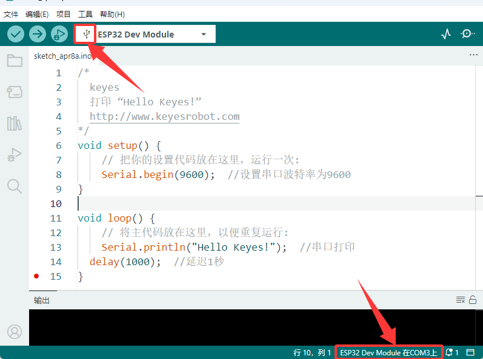

然后我们点击编译并上传代码，上传成功后IDE也会有两个提示，如图：

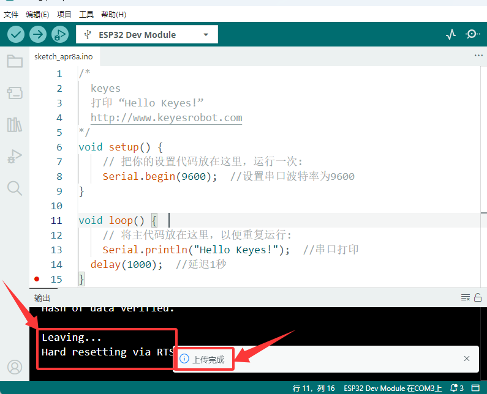

然后我们点击“串口监视器”图标便能打开串口监视器，然后设置波特率为**9600**，就能看到串口打印字符串 “**Hello Keyes!**”

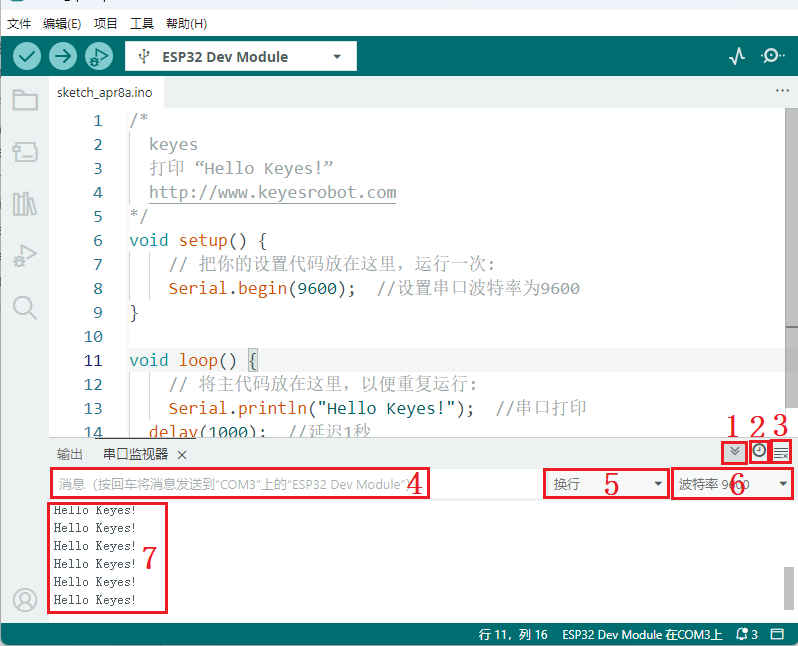

1\. “切换自动滚动”：设置打印窗口是否跟随打印.

2\. “切换时间戳 ”：设置是否显示打印时间。

3\. “清除输出 /清空输出”：清除打印窗口中的数据。

4\. 串口输入框。

5\. 串口发送格式。

6\. 设置波特率，点击即可选择需要的波特率。

7\. 打印窗口。


## 4.2.10 Arduino基础代码介绍

### 4.2.10.1 Arduino IDE 的开发语言

Arduino使用C/C++编写程序，虽然C++兼容C语言，但这是两种语言，C语言是一种面向过程的编程语言，C++是一种面向对象的编程语言。早期的Arduino核心库使用C语言编写，后来引进了面向对象的思想，目前最新的Arduino核心库采用C与C++混合编写而成。

通常所说的Arduino语言，就是指Arduino核心库提供的各种API的集合。这些API是对更底层的单片机支持库进行二次封装所形成的（玩过单片机的人估计都是经常和各种寄存器打交道）。Arduino提供的API可以让初学者不用理会单片机复杂寄存器配置，然后就能直观控制Arduino，提高开发效率。

### 4.2.10.2 程序结构

arduino包括两个主要函数：

`void setup(){}` 当代码开始运行时，将调用 setup（）函数。使用它来初始化变量、引脚模式、开始使用库等。setup（）函数只会在Arduino板每次通电或重置后运行一次。 

`void loop(){}` 相当于死循环while(1){}。 当然，可以自定义函数，并在以上两个函数中被调用。注意，setup函数和loop函数是必不可少的，否则会报错。

### 4.2.10.3 基础语句

#### 4.2.10.3.1 delay(value) ;

delay() 延时函数，用于程序中需要等待的地方  语句：`delay(value)`

**value**： 延时时间数值(单位是ms)， 1s = 1000ms  ， 1ms = 1000 us ，一般我们使用的ms

#### 4.2.10.3.2 digitalWrite(Pin,State);

digitalWrite() 函数用于控制指定引脚输出高电平（HIGH）或低电平（LOW） 语句：`digitalWrite(pin, value)`

- **pin**： the Arduino pin number
- **value**：HIGH or LOW

#### 4.2.10.3.3 digitalRead(Pin)

digitalRead(Pin); 用于读取数字引脚的TTL电平，高电平（1），低电平（0） 语句：`digitalRead(Pin);`

**Pin:** 需要读取的数字引脚

#### 4.2.10.3.4 analogWrite(Pin,Vlaue)

analogWrite() 函数将模拟值（PWM波）输出。可用于以不同的亮度点亮LED或以不同的速度驱动电机。在调用analogWrite（）后，该引脚将生成指定占空比的稳定矩形波，直到下一次在同一引脚上调用analogWrite（）（或调用digitalRead（）或digitalWrite（））。 语句：`analogWrite(pin, value)`

- **pin:** the Arduino pin to write to. Allowed data types:int
- **value:** the duty cycle: between 0 (always off) and 255 (always on). Allowed data types:int

#### 4.2.10.3.5 analogRead(Pin)

前面我们学了读取数字信号的函数，而analogRead(); 是读取模拟信号的函数,ESP32模拟值范围是0-4095  语句： `analogRead(Pin);`

**Pin:** 读取模拟值的引脚号

#### 4.2.10.3.6 pinMode(Pin,mode)

pinMode() 用于将指定的引脚设置成输入或输出或上拉  语法；`pinMode(pin, mode)`

- **pin**: the Arduino pin number to set the mode of.
- **mode**: INPUT,OUTPUT, or INPUT_PULLUP

#### 4.2.10.3.7 if(){...}else{}

if() 用于判断条件是否满足如果条件满足则执行 “{ }”中的代码，如果条件不满足则不执行

else 是否则的条件，当if的判断表达式不成立时则执行else “{ }”中的代码

#### 4.2.10.3.8 for()

`for`语句是一种基本的循环控制结构，它允许你重复执行一段代码块固定的次数。`for`语句特别适用于已知循环次数的场景。

`for`语句的基本结构

```c
for (初始化表达式; 条件表达式; 迭代表达式) {  
    // 循环体：要重复执行的代码块  
}
```

- **初始化表达式**：在循环开始前执行，通常用于初始化一个或多个循环控制变量。
- **条件表达式**：在每次循环迭代前检查。如果条件为真（非零），则执行循环体；如果为假（零），则退出循环。
- **迭代表达式**：在每次循环迭代结束时执行，通常用于更新循环控制变量。


①：设置循环初始值，只是执行一遍，执行后进入②

②： 判断是否瞒住循环条件，如图中`i <= 255`则是i小于等于255就能进入循环代码③中

③： 循环代码，将需要循环的代码放到这里，如我们这个代码是需要控制pwm值从0到255所以我们只需将i的值当初pwm值即可然后进入④

④： i++ 是i在原来的值上再加一的操作等于 i = i + 1 （i- -则是等效 i = i - 1），执行完后进入⑤

⑤： i的值加一（或减一）后接着判断i的值是否小于等于255，如果是则继续进入循环代码③，如果不是则退出for循环

#### 4.2.10.3.9 while(condition){…}

while循环将连续无限循环，直到括号（）内的表达式变为false。必须更改测试变量，否则while循环将永远不会退出。这可能是在你的代码中，比如一个递增的变量，也可能是一个外部条件，比如测试传感器。

#### 4.2.10.3.10 “>,<,<=,>=,==,!=”比较运算符

请注意，您可能会比较不同数据类型的变量，但这可能会产生不可预测的结果，因此建议比较相同数据类型（包括有符号/无符号类型）的变量。

(1): `>`将左侧的变量与运算符右侧的值或变量进行比较。当左侧的操作数大于右侧的操作数时，返回true，否则返回false。

​	语法：

```c++
x > y; // is true if x is bigger than y and it is false if x is equal or smaller than y
```

(2): `>=`将左侧的变量与运算符右侧的值或变量进行比较。当左侧的操作数大于或等于右侧的操作数时，返回true，否则返回false。

语法：

```c++
x >= y; // is true if x is bigger than or equal to y and it is false if x is smaller than y
```

(3): `<`将左侧的变量与运算符右侧的值或变量进行比较。当左侧的操作数小于右侧的操作数时，返回true，否则返回false。

语法：

```c++
x < y; // is true if x is smaller than y and it is false if x is equal or bigger than y
```

(4): `<=`将左侧的变量与运算符右侧的值或变量进行比较。当左侧的操作数小于或等于右侧的操作数时，返回true，否则返回false。

语法：

```c++
x <= y; // is true if x is smaller than or equal to y and it is false if x is greater than y
```

(5): `==`将左侧的变量与运算符右侧的值或变量进行比较。当两个操作数相等时，返回true，否则返回false。(注意判断两个值是否相等是“==”)

语法：

```c++
x == y; // is true if x is equal to y and it is false if x is not equal to y
```

(6): `!=`将左侧的变量与运算符右侧的值或变量进行比较。当两个操作数不相等时，返回true，否则返回false。

语法：

```c++
x != y; // is false if x is equal to y and it is true if x is not equal to y
```

#### 4.2.10.3.11 “+,-,*,/,%,=”算数运算符

(1):  `+`加法是四种主要算术运算之一。运算符+（加号）对两个操作数进行运算以产生总和。

​	语法：`sum = operand1 + operand2;`

(2):  `-`减法是四种主要算术运算之一。运算符-（减号）对两个操作数进行运算，以产生第二个操作数与第一个操作数的差值。

​	语法：`difference = operand1 - operand2;`

(3):  `*`乘法是四种主要算术运算之一。运算符“*”（星号）对两个操作数进行运算以产生乘积。

​	语法：`product = operand1 * operand2;`

(4):  `/`除法是四种主要算术运算之一。运算符“/”（斜线）对两个操作数进行操作以产生结果。

​	语法：`result = numerator / denominator;`

(5): `%`余数运算计算一个整数除以另一个整数时的余数。它有助于将变量保持在特定范围内（例如数组的大小）。“%”（百分比）符号用于执行余数运算。

​	 语法：`remainder = dividend % divisor;`

(6): `=`在C++编程语言中，单个等号“=”被称为赋值运算符。它与代数课中表示方程或等式的意义不同。赋值运算符告诉微控制器评估等号右侧的任何值或表达式，并将其存储在等号左侧的变量中。

示例：

```c++
int sensVal;              // declare an integer variable named sensVal
    sensVal = analogRead(0);  // store the (digitized) input voltage at analog pin 0 in SensVal
```

#### 4.2.10.3.12 “||,&&，!”布尔运算符

(1): `||`如果两个操作数中的任何一个为真，则逻辑OR的结果为真。

​	示例：

```c++
if (x > 0 || y > 0) { // if either x or y is greater than zero
      // statements
    }
```

(2): `&&`只有当两个操作数都为真时，逻辑AND的结果才为真。

​	示例：

```c++
if (digitalRead(2) == HIGH && digitalRead(3) == HIGH) { // if BOTH the switches read HIGH
      // statements
    }
```

#### 4.2.10.3.13 #include

#include用于在草图中包含外部库。这使程序员可以访问大量标准C库（预制函数组），以及专门为Arduino编写的库。

​	语法：`#include <LibraryFile.h>` 或 `#include "LocalFile.h"`

#### 4.2.10.3.14 #define

 #define 用于设置常量（值不变得量叫常量）  语法：`#define constantName value`

- **constantName:** the name of the macro to define
- **value:** the value to assign to the macro

#### 4.2.10.3.15 Serial.begin(9600)

Serial.begin(9600);设置串口波特率，只有设置了串口波特率并且与串口打印工具保持一样的波特率才能进行串口打印。一般常用9600与115200

#### 4.2.10.3.16 Serial.print()

Serial.print(); 串口不换行打印函数，打印时执行将变量或者需要打印的字符输入到括号中（打印字符需要放到双引号中）

#### 4.2.10.3.17 Serial.println()

Serial.println(); 串口换行打印函数，打印时执行将变量或者需要打印的字符输入到括号中（打印字符需要放到双引号中）

#### 4.2.10.3.18 int

`int` 用于声明整形变量，如`int i = 0;`就是声明了一个整形的变量，变量名为i值为0；整形可以理解成整数的意思

#### 4.2.10.3.19 char

`char` 用于声明字符变量，如`char ch = ‘A’`就是声明了一个字符变量，变量名为ch值为‘A’

更多详细解释请参考官方链接：[Language Reference | Arduino Documentation](https://docs.arduino.cc/language-reference/#variables)

---------------