## 4.2.1 Arduino IDE 简介

Arduino IDE是一款专为Arduino硬件设计的集成开发环境，它以初学者友好的界面和强大的开源代码支持而闻名。这款工具不仅简化了编程过程，降低了开发门槛，还为初学者提供了一个易于上手的学习平台。

Arduino IDE拥有简洁直观的用户界面，支持语法高亮、自动完成等功能，使得编程过程变得轻松愉快。更重要的是，它基于开放源代码，这意味着用户可以自由访问、修改和分发代码，从而大大扩展了开发的可能性。

对于初学者来说，Arduino IDE提供了丰富的教程、示例代码和社区支持，帮助他们快速上手并解决实际问题。同时，开源代码的特性也意味着用户可以借鉴和学习他人的代码，加速自己的学习进程。

总之，Arduino IDE以其初学者友好的界面和强大的开源代码支持，成为了Arduino开发者不可或缺的工具之一，无论是初学者还是专业人士，都能从中受益。

## 4.2.2  Windows 系统

**特别提醒：本教程采用的 Arduino IDE 版本是 2.3.6 。如果是其他版本的话，不能保证本教程提供的示例代码能编译和上传成功。** 

### 4.2.2.1 Arduino IDE下载 

我们先到Arduino官方的网站：[Software | Arduino](https://www.arduino.cc/en/software/) 下载 Arduino IDE。

Arduino 软件有很多版本，有Windows，Mac，Linux系统的（如下图），而且还有过去老的版本，你只需要下载一个适合自己计算机系统的版本即可。

这里是以下载 **Windows Win 10 or newer(64-bit)** 为例，你也可以根据自己所需，选择下载 **Windows ZIP file**。选择如下图。


这里我们以Windows系统的为例给大家介绍下载和安装的步骤。Windows系统的也有两个版本，一个版本是安装版：Windows Win 10 or newer(64-bit) ；另一个是下载版：Windows ZIP file，是不用安装，直接下载文件到电脑，解压缩就可以用了。

### 4.2.2.1 Arduino IDE安装

1\. 保存从软件页面下载的.exe文件到硬盘驱动器，然后简单地运行该文件.


2\. 阅读许可协议并同意.


3\. 选择安装选项.


4\. 选择安装位置.


5\. 单击 "Finish" 并运行Arduino IDE


## 4.2.3 MacOS 系统

### 4.2.3.1 Arduino IDE下载

我们先到Arduino官方的网站：[Software | Arduino](https://www.arduino.cc/en/software/) 下载 Arduino IDE。

不同的系统，需要下载不同的Arduino IDE，下载方式和Windows类似。这里是以下载 **macOS Intel 10.15 Catalina or newer(64-bit)** 为例，你也可以根据自己所需，选择下载 **macOS Apple Silicon 11 Big Sur or newer(64-bit)**。选择如下图。


### 4.2.3.2 Arduino IDE安装

Arduino IDE下载之后，双击下载的`arduino_ide_xxxx.dmg`文件并按照说明将 **Arduino IDE.app** 复制粘贴到 **Applications** 文件夹，几秒钟后您将看到 Arduino IDE 安装成功.


## 4.2.4 Linux 系统

### 4.2.4.1 Arduino IDE下载

我们先到Arduino官方的网站：[Software | Arduino](https://www.arduino.cc/en/software/) 下载 Arduino IDE。

不同的系统，需要下载不同的Arduino IDE，下载方式和Windows类似。这里是以下载 **Linux Applmage(64-bit X86-64)** 为例，你也可以根据自己所需，选择下载 **Linux ZIP file(64-bit X86-64)**。选择如下图。


### 4.2.4.2 Arduino IDE安装

关于在 Linux 系统上安装 Arduino IDE 2 的教程，请参考链接：[https://docs.arduino.cc/software/ide-v2/tutorials/getting-started/ide-v2-downloading-and-installing/#linux](https://docs.arduino.cc/software/ide-v2/tutorials/getting-started/ide-v2-downloading-and-installing/#linux)

## 4.2.5 设置Arduino IDE语言

⚠️ **特别提醒：Windows系统、MAC系统等不同系统，arduino IDE语言设置方法差不多，可以参考。**

1\. 首先打开Arduino IDE.


2\. 点击“**File** ——>**Preferences...**”，在**Preferences**对话框中，单击 “**English**” 按钮选择 “**中文(简体)**”，然后单击 “**OK**”.


3\. 这样，arduino IDE的语言切换完成了，arduino IDE的语言为中文(简体)。


## 4.2.6 Arduino IDE说明

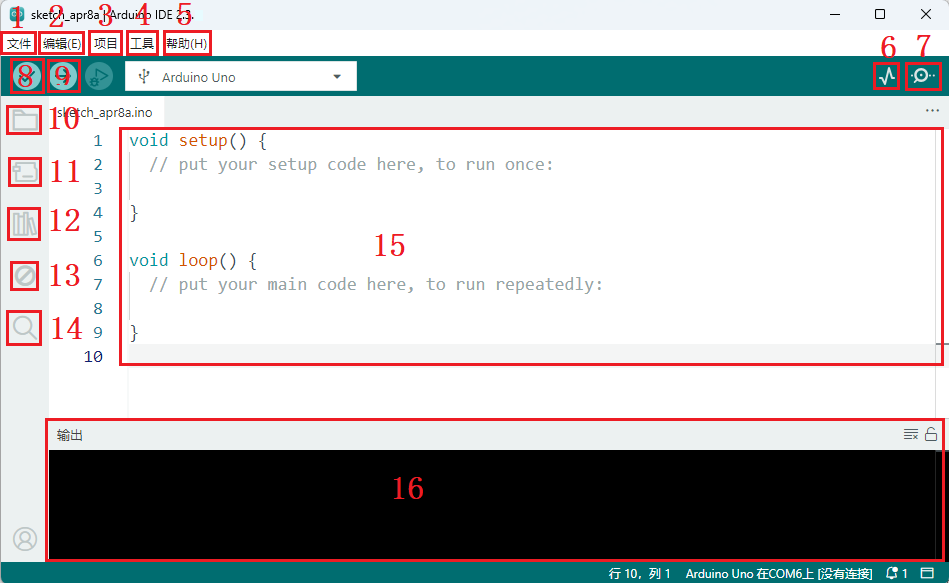

1\. “文件”：列表里面的功能有新建项目，打开程序，打开最近使用的代码，打开示例代码，关闭IDE，保存代码，首选项，高级设置等。

2\. “编辑”：列表里面的功能有复制，粘贴，自动格式化，字体大小等这个一般都是使用快捷键进行操作。（建议坚持使用快捷键，接触多了就水到渠成了）。

3\. “项目”：列明里面的常用功能有验证\编译代码，上传代码，导入库等。

4\. “工具”：列表里面的常用功能有开发板选择，端口选择，这两个很重要。

5\. “帮助”：点击这个可以查看IDE版本已经官方的参考文件。

6\. “串口绘图仪”：它会将串口的数据以折线图的样式显示出来。

7\. “串口监视器”：可以将我们需要查看的数据在这里进行打印显示。

8\. 验证程序按钮。

9\. 验证并上传程序按钮。

10\. “项目文件夹”：可以新建项目，还可以只有arduino Cloud进行同步和编辑。

11\. “开发板管理器”：可以添加或删除开发板。

12\. “库管理”：就要添加和删除库。

13\. “调试”：可以对代码进行监视与断点调试。

14\. 搜索框。

15\. 代码编辑区。

16\. IDE提示区（上传代码报错或成功）和串口监视器显示区

至此Arduino IDE说明教程结束了，请学习如何给Arduino IDE添加库文件，如果没有添加库文件IDE会报错。

## 4.2.7 给Arduino IDE安装库文件(**重要**)

⚠️ **特别提醒：Windows系统、MAC系统等不同系统，安装库文件的方法差不多，可以相互参考；这里是以Windows系统为例。**

### 4.2.7.1 什么是库文件

库是代码的集合，使您可以轻松地连接到传感器、显示器、模块等。

例如：LiquidCrystal_I2C库使LCD1602显示变得容易，Internet上有数百个其他库可供下载。参考中列出了内置库和手动添加的库。 

在编译代码或上传代码时，如果出现报错信息 “No such file or directory”，那说明缺少相应的库文件，如下图就是上传LCD1602模块代码时因为缺少了LiquidCrystal_I2C库文件的报错。


### 4.2.7.2 如何安装库文件

在这里，我们将为您介绍最简单的添加库的方法。我们是以添加LiquidCrystal_I2C库文件为例。

1\. 首先，依次点击左上角的 “**项目” > “导入库” > “添加 .Zip 库...”**


2\. 导航到库文件所在的目录，例如：***Arduino资料\Arduino_库文件*** 文件夹，然后选择对应的库文件（这里是以LiquidCrystal_I2C库文件为例，.zip格式），单击 “**打开(O)**”，即可添加成功。


3\. 安装完成后，你将收到一条通知(已从LiquidCrystal_12C.zip存档成功安装库)，同时输出框会显示 “**Library installed**”，确认该库已成功添加到Arduino IDE中。下次需要使用此库时，你不需要重复安装过程。


4\. 重复前面相同的添加过程(方法)来添加其他(剩余)的库文件，这里就不一一重复讲解了。

## 4.2.8 安装 ESP32 开发板(**重要**)

⚠️ **特别提醒：国内客户下载安装ESP32 开发板，由于网速原因需要网络翻墙，这样，ESP32 开发板更容易下载。**

### 4.2.8.1 Windows系统

我们发现在arduino IDE “**工具**”下的 “**开发板**” 中找不到ESP32开发板的选项，这是因为我们没有添加ESP32开发板，接下来我们一起来为Arduino IDE添加ESP32开发板吧!

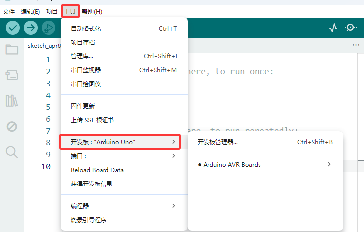

**安装ESP32开发板步骤如下：**

1\. 首先打开Arduino IDE.


2\. 点击“**文件** ——>**首选项...**”，在**其他开发板管理器地址**中，将ESP32开发板的链接：`https://espressif.github.io/arduino-esp32/package_esp32_index.json` 复制粘贴至文本框中，然后单击 “**确定**”.


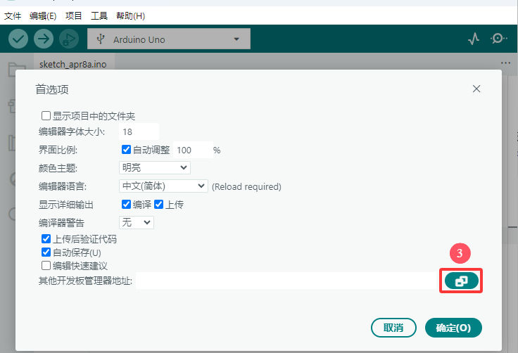

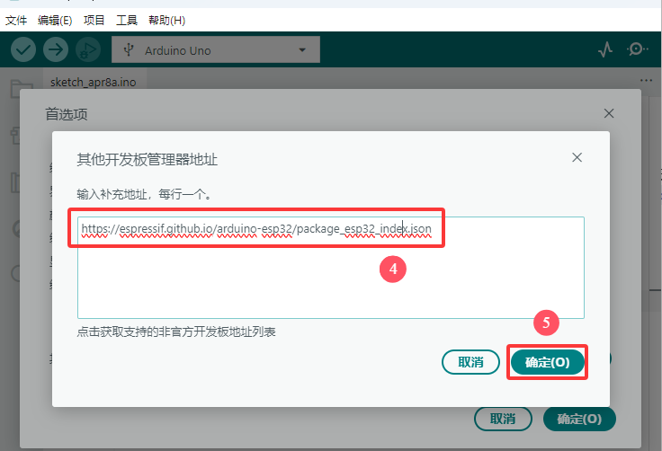

3\. 再点击 “**确定**”。

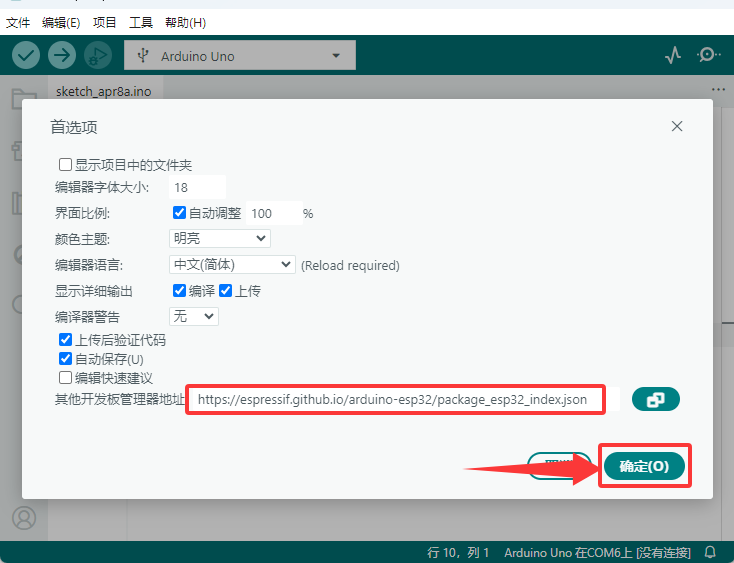

4\. 点击左边的开发板小图标，打开开发板选项。


5\. 在开发板搜索框中，搜索 “**ESP32**”，点击安装最新版本，右下角可以看到开发板安装进度，等待几分钟安装完成。**安装过程中请保持网络稳定，如安装失败，请重复以上步骤，重新安装开发板即可。**

⚠️ **注意：本教程使用的是 ESP32 3.2.1 版本的ESP32开发板，请保持一致，以免出现代码不兼容情况。**

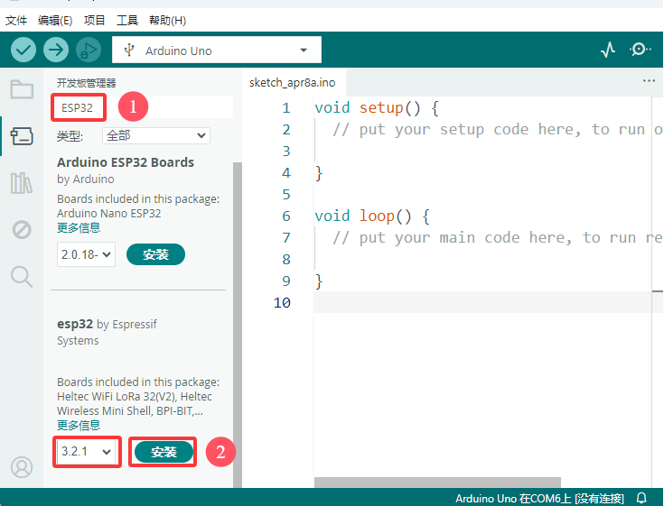


⚠️ **特别提醒：假如，由于网络问题实在是下载安装不了ESP32开发板，我们也提供有ESP32开发板的压缩包**，**ESP32开发板的压缩包下载地址：** [https://pan.baidu.com/s/10mfU2_aNru2dizP0vAFXlw?pwd=95ih](https://pan.baidu.com/s/10mfU2_aNru2dizP0vAFXlw?pwd=95ih) 

**提取码：95ih**

**压缩包下载后解压，把解压后的ESP32开发板文件夹按照以下路径添加。ESP32开发板一般需要存放于以下路径，才能说明ESP32开发板安装好。**

- **Windows 系统**：路径为C:\Users\你的用户名\AppData\Local\Arduino15\packages 。其中，AppData 是一个隐藏文件夹，你需要在文件夹选项中开启 “显示隐藏的文件、文件夹和驱动器” 才能看到。

⚠️ **提醒：** 上面路径中“你的用户名”是指你安装电脑时设置的用户名字，如果没有设置，一般都是Administrator。

- **MacOS 系统**：位于~/Library/Arduino15/packages。Library 也是一个隐藏文件夹，你可以通过在 “**访达**” 中使用快捷键Command + Shift + G ，然后输入该路径来访问。

- **Linux 系统**：存于~/.arduino15/packages 。

6\. 安装成功后，重新启动 Arduino IDE，然后点击“**工具**” → “**开发板:**”，这样就可以看到安装成功的ESP32开发板。安装成功如图：


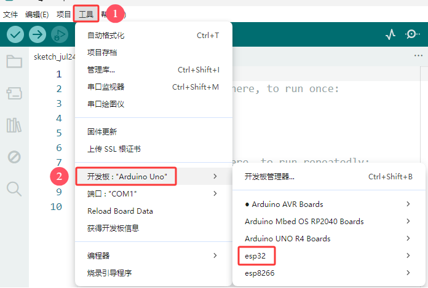

### 4.2.8.2 MAC系统

上面已经学习了怎么下载ArduinoIDE，那下面就要在Arduino IDE上安装ESP32开发板，请执行以下步骤：

**安装ESP32开发板步骤如下：**

1\. 首先打开Arduino IDE，点击“**Arduino IDE** ——>**首选项...**”，在**其他开发板管理器地址**中，将ESP32开发板的链接：`https://espressif.github.io/arduino-esp32/package_esp32_index.json` 复制粘贴至文本框中，，然后单击 “**确定**”.


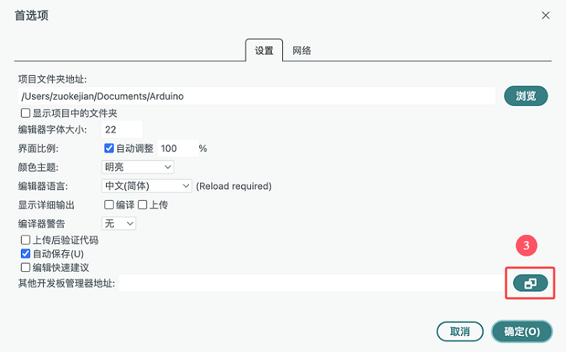

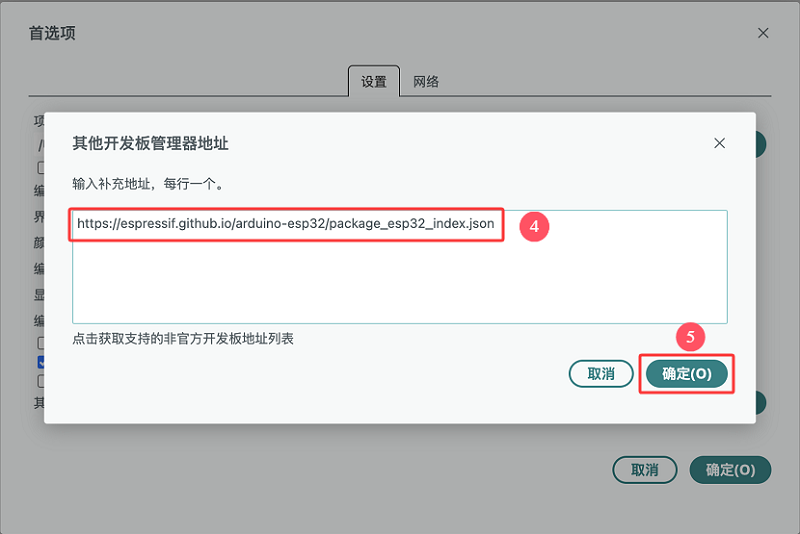

3\. 再点击 “**确定**”。

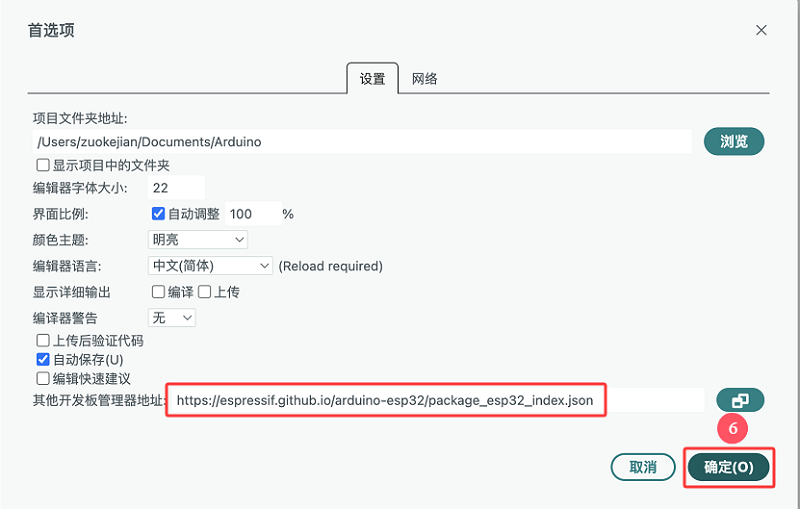

4\. 点击 “**工具**” ——> “**开发板**”  ——> “**开发板管理器...**”。

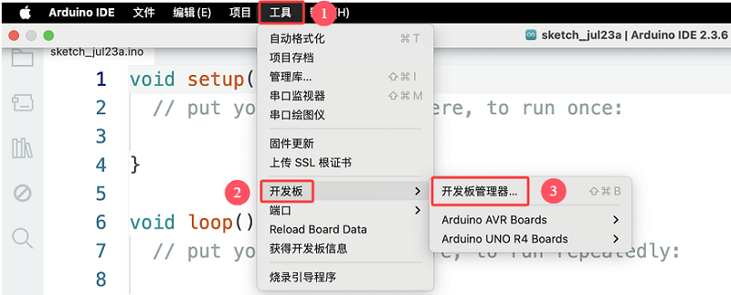

5\. 在开发板搜索框中，搜索 “**ESP32**”，点击安装最新版本，右下角可以看到开发板安装进度，等待几分钟安装完成。**安装过程中请保持网络稳定，如安装失败，请重复以上步骤，重新安装开发板即可。**

⚠️ **注意：本教程使用的是 ESP32 3.2.1 版本的ESP32开发板，请保持一致，以免出现代码不兼容情况。**


6\. 安装成功后，重新启动 Arduino IDE，然后点击“**工具**” → “**开发板:**”，这样就可以看到安装成功的ESP32开发板。安装成功如图：

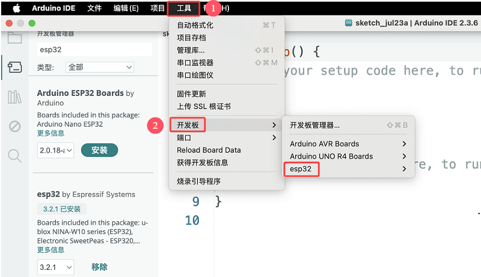

## 4.2.9 使用Arduino IDE上传第一个程序

先将ESP32开发板通过USB线连接到电脑。


打开Arduino IDE, 选择对应的ESP32开发板型号。

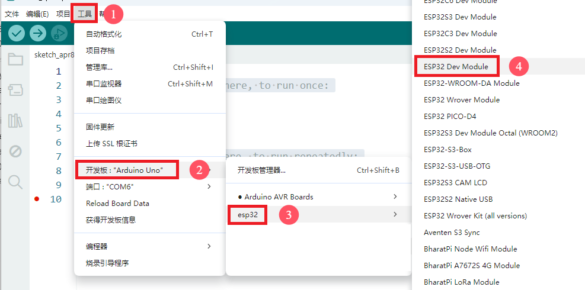

选好开发板后，选择开发板的COM口，开发板安装完驱动后会显示一个COM端口，如果你不知道是哪个，可以进入你电脑的设备管理器中进行查看，如下图：（如果你有很多COM端口，你不知道是哪个就可以拔掉ESP32开发板看哪个消失了，然后再插上ESP32开发板消失的COM口又会显示出来，如果没有COM就请检查是否有安装好开发板驱动）

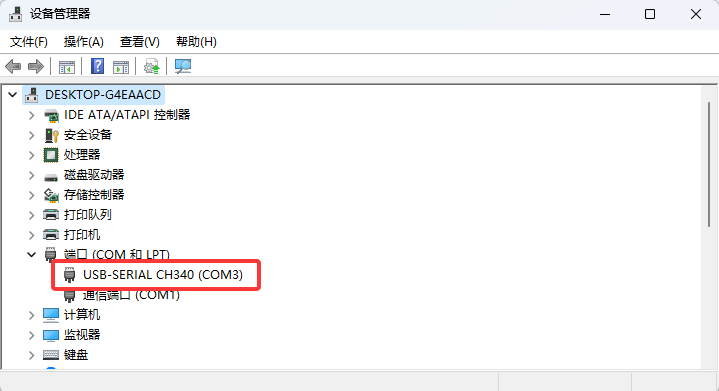

从图中可知我们的COM端口是COM3，我们在 “**工具**” 列表中选择 “**端口**” 然后选择 “COM3”。

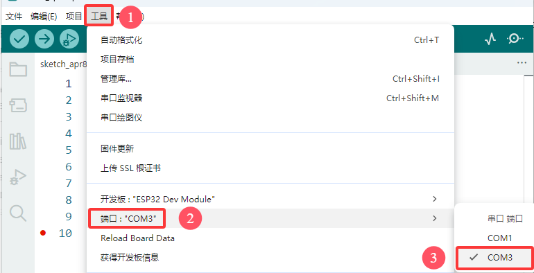

连接上开发板后，这两个地方都会显示已连接的标志，然后添加代码：这里我们提供一个示例代码，代码功能是在串口监视器中每隔一秒钟打印一次“Hello Keyes!”

将下面的代码复制粘贴到arduino IDE的代码区

```c
/*
  keyes 
  打印 “Hello Keyes!”
  http://www.keyesrobot.com
*/
void setup() {  
    // 把你的设置代码放在这里，运行一次:
    Serial.begin(9600);  //设置串口波特率为9600
}

void loop() {  
    // 将主代码放在这里，以便重复运行:
    Serial.println("Hello Keyes!");  //串口打印
 	delay(1000);  //延迟1秒
}
```


然后我们点击编译并上传代码，上传成功后IDE也会有两个提示，如图：


然后我们点击“串口监视器”图标便能打开串口监视器，然后设置波特率为**9600**，就能看到串口打印字符串 “**Hello Keyes!**”

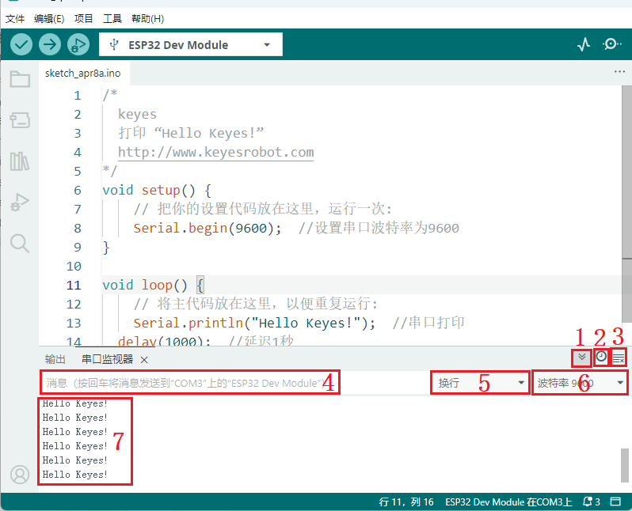

1\. “切换自动滚动”：设置打印窗口是否跟随打印.

2\. “切换时间戳 ”：设置是否显示打印时间。

3\. “清除输出 /清空输出”：清除打印窗口中的数据。

4\. 串口输入框。

5\. 串口发送格式。

6\. 设置波特率，点击即可选择需要的波特率。

7\. 打印窗口。


## 4.2.10 Arduino基础代码介绍

更多详细解释请参考官方链接：[Language Reference | Arduino Documentation](https://docs.arduino.cc/language-reference/)

---------------