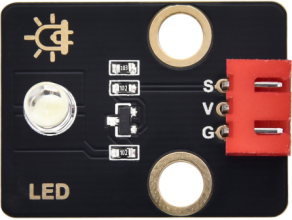
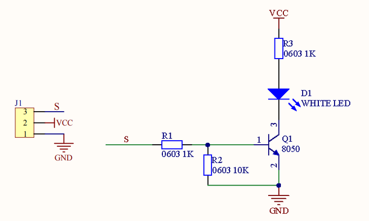
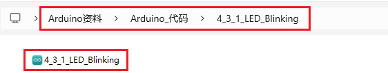

### 4.3.1 点亮LED灯 

#### 4.3.1.1 简介

本教程将引导您一步步学习如何点亮LED灯，涵盖从基础电路知识到实际操作的全过程。您将了解LED的工作原理、所需元件（如线材、电源等）以及如何正确连接电路。通过教程您将学会如何搭建简单电路并使用开发板点亮LED。无论您是电子初学者还是爱好者，本教程都将为您提供实用且易于理解的指导，助您快速掌握点亮LED的基本技能。

#### 4.3.1.2 元件知识


**LED：**

LED灯的工作原理是基于半导体的光电效应。具体来说，LED是一个半导体的晶片，由P型半导体和N型半导体组成，它们之间形成一个P-N结。当电流通过导线作用于这个晶片时，电子从N区注入P区，空穴从P区注入N区，这些注入的少数载流子（电子和空穴）在P-N结附近复合，复合过程中能量以光子的形式释放出来，从而产生光。

不同材料的LED芯片能发出不同颜色的光，例如，氮化镓（GaN）类半导体材料常用于制作蓝色LED。通过调整LED芯片的材料和封装工艺，可以实现不同颜色的发光，如白色、暖白色、彩色等

LED就是将电能转换成光能的元件，当电流通过LED时，它会发光。

**各式各样的LED：**


**LED模块:** 是一种用于输出的设备，用于控制LED灯的亮度和闪烁，可以直接插入开发板的数字输出引脚上使用。



**原理图：** 当S处为高电平时，Q1三极管导通，电流通过LED（LED两端有一定的电压），LED此时会亮起来，反之相反。



**参数：**

- 工作电压: DC 3.3V~5V
- 工作电流: (Max)1.5mA@5V
- 最大功率: 0.0075W

#### 4.3.1.3 接线图

- **LED模块的S引脚连接到io27**

⚠️ **特别注意：智慧农场已经组装好了，这里不需要把LED模块拆下来又重新组装和接线，这里再次提供接线图，是为了方便您编写代码！**


#### 4.3.1.4 实验代码

代码文件在`Arduino_代码`文件夹中，代码文件为`4_3_1_LED_Blinking`，如下图所示：



鼠标双击`4_3_1_LED_Blinking.ino`即可在Arduino IDE中打开。

```c++
/*
 * 文件名 : LED_Blinking
 * 功能   : 让led灯闪烁.
 * 编译IDE：ARDUINO 2.3.6
 * 作者   : https://www.keyesrobot.cn
*/

const int LED_Pin = 27; //定义LED的GPIO引脚

void setup() {
// 初始化数字引脚LED_Pin作为输出模式。
  pinMode(LED_Pin, OUTPUT);
}

void loop() {
  digitalWrite(LED_Pin, HIGH);  // 打开LED （HIGH是高电平）
  delay(1000);                  // 等待1秒
  digitalWrite(LED_Pin, LOW);   // 通过使电压低来关闭LED
  delay(1000);                  //等待1秒
}
```

#### 4.3.1.5 实验结果

按照接线图接好线，外接电源，选择好正确的开发板板型（ESP32 Dev Module）和 适当的串口端口（COMxx），然后单击按钮上传代码。上传代码成功后，可以看到LED每隔一秒闪烁，这是因为ESP32开发板的io27，每隔一秒输出高电平和低电平。


通过LED模块，我们可以实现各种有趣的互动式应用，例如呼吸灯效果、流水灯效果、警灯效果等等。  

| 电平 | 功能  |
| :--: | :---: |
| HIGH | LED亮 |
| LOW  | LED灭 |


#### 4.3.1.6 代码说明

（1）.声明一个名为`LED_Pin`并为其分配数字引脚`IO27`。

```c
const int LED_Pin = 27; // 定义LED的GPIO引脚.
```
- `const int` → 声明一个**固定值**的整型变量（运行中不可修改）
- `LED_Pin` → 变量名，代表**LED的引脚**
- `=` → 赋值运算符，将右侧的值赋给左侧的变量。官方介绍：[=(assignment operator) | Arduino Documentation](https://docs.arduino.cc/language-reference/en/structure/arithmetic-operators/assignment/)

- `27` → 指定控制LED的物理引脚是 **GPIO27**

（2）.`void setup(){}`当代码开始运行时，将调用 setup（）函数。使用它来初始化变量、引脚模式、开始使用库等。setup（）函数只会在ESP32板每次通电或重置后运行一次。 

```c
void setup(){
    ...
}
```

- 官方介绍：[setup() | Arduino Documentation](https://docs.arduino.cc/language-reference/en/structure/sketch/setup/)

（3）.设置LED数字引脚的工作模式。

```c
// 初始化数字引脚LED_Pin作为输出模式。
  pinMode(LED_Pin, OUTPUT);
```

- `pinMode()` → Arduino专用函数，用于设置引脚工作模式
- `LED_Pin` → 要设置的引脚（之前定义的GPIO27）
- `OUTPUT` → 设置为输出模式（可控制电压高低）

- 官方介绍：[pinMode() | Arduino Documentation](https://docs.arduino.cc/language-reference/en/functions/digital-io/pinMode/)

（4）.`void loop(){}`相当于死循环while(1){}。 自定义的函数就是在`setup（）`，`loop（）`函数中被调用。注意，setup函数和loop函数是必不可少的，否则会报错。

```c
void loop(){
    ...
}
```

- 官方介绍：[loop() | Arduino Documentation](https://docs.arduino.cc/language-reference/en/structure/sketch/loop/)

（5）.设置LED数字引脚高电平，使LED点亮。

```c
digitalWrite(LED_Pin, HIGH); // 打开LED （HIGH是高电平） .
```

- `digitalWrite()` → Arduino输出数字信号函数
- `LED_Pin` → 要控制的LED引脚
- `HIGH` → 输出高电平（通常3.3V/5V）

- 官方介绍：[digitalWrite() | Arduino Documentation](https://docs.arduino.cc/language-reference/en/functions/digital-io/digitalwrite/)

（6）.延时

```c
delay(1000);   // 等待1秒
```

- `delay()` → Arduino延时函数
- `1000` → 毫秒数（1000ms=1s）
- 期间CPU空转等待

（7）.设置LED数字引脚低电平，使LED不亮。

```c
digitalWrite(LED_Pin, LOW);   // 通过使电压低来关闭LED.
```

- `digitalWrite()` → Arduino数字输出函数
- `LED_Pin` → 要控制的LED引脚（GPIO27）
- `LOW` → 输出低电平（0V）
