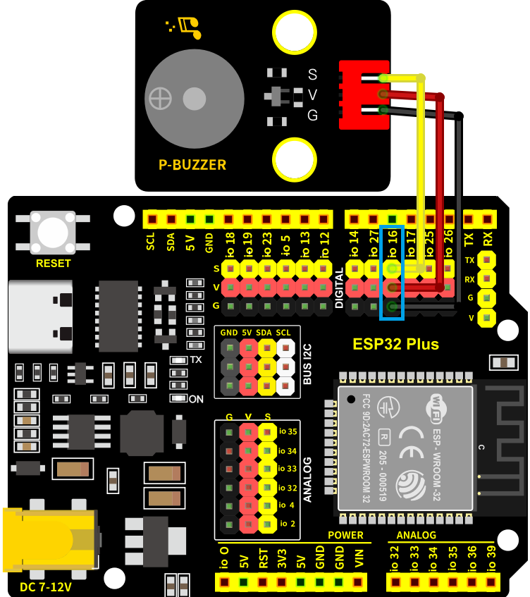
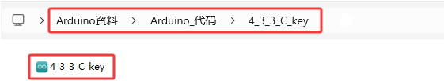
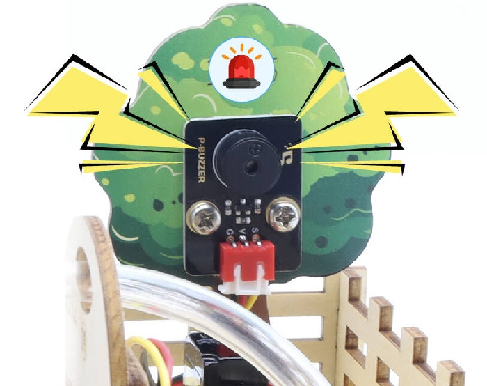
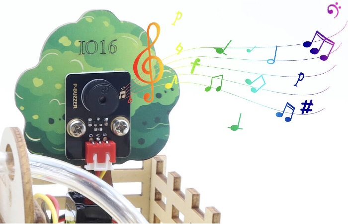
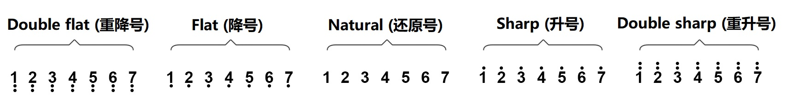
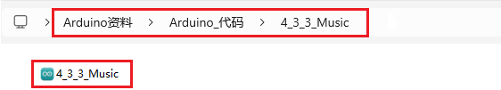

### 4.3.3 无源蜂鸣器

#### 4.3.3.1 简介

本教程将为您详细介绍无源蜂鸣器的使用方法和应用技巧。无源蜂鸣器是一种需要外部驱动信号才能发声的电子元件，其内部不含振荡源，因此可以通过改变输入信号的频率来产生不同音调的声音。教程内容包括无源蜂鸣器的工作原理、引脚识别、电路连接方法以及如何通过微控制器（如ESP32）生成不同频率的方波信号来控制蜂鸣器。您将学习如何编写代码来实现简单的音乐播放、报警信号和自定义音效。无论您是电子初学者还是有经验的开发者，本教程都将帮助您掌握无源蜂鸣器的应用，为您的项目增添丰富的声音效果。

#### 4.3.3.2 元件知识


**无源蜂鸣器：** 是一种内部没有振动源的集成电子蜂鸣器，只有给它一定频率的`方波信号`，才能让无源蜂鸣器发声，同时，输入的方波频率不同，发出的声音也不同，所以无源蜂鸣器可以模拟曲调实现音乐效果。

  - 引脚的电平变化可以模拟方波，例如引脚高电平持续500微秒后，再变换为低电平500微秒，紧接着再变换为高电平…
  
  - **以2~5KHz的方波去驱动无源蜂鸣器，方波的赫兹可以通过公式 f=1/T，其中f为频率，T为一个完整的周期所用时间（即高低电平各持续的时间之和）来计算。**


**注: 我们提供的无源蜂鸣器的谐振频率约为2048Hz，这意味着这个无源蜂鸣器的谐振频率为2048Hz时声音最大。**

**C调符与频率对照表：**

|    调符      |    频率(Hz)   |      调符      |    频率(Hz)   |     调符      |    频率(Hz)   |
| :---------: | :-----------: | :------------: | :-----------: | :----------: | :-----------: |
| Flat  1  Do |      262      | Natural  1  Do |      523      | Sharp  1  Do |     1047      |
| Flat  2  Re |      294      | Natural  2  Re |      587      | Sharp  2  Re |     1175      |
| Flat  3  Mi |      330      | Natural  3  Mi |      659      | Sharp  3  Mi |     1319      |
| Flat  4  Fa |      349      | Natural  4  Fa |      698      | Sharp  4  Fa |     1397      |
| Flat  5  So |      392      | Natural  5  So |      784      | Sharp  5  So |     1568      |
| Flat  6  La |      440      | Natural  6  La |      880      | Sharp  6  La |     1760      |
| Flat  7  Si |      494      | Natural  7  Si |      988      | Sharp  7  Si |     1967      |

**原理图：**


**参数：**

- 工作电压: DC 3.3V~5V
- 工作电流: (Max) 30mA@5V
- 最大功率: 0.15W
- 谐振频率: 2048Hz
- 输出音压: (Min)80dB/10cm
- 控制信号: 方波

#### 4.3.3.3 接线图

- **无源蜂鸣器模块的S引脚连接到io16**

⚠️ **特别注意：智慧农场已经组装好了，这里不需要把无源蜂鸣器模块拆下来又重新组装和接线，这里再次提供接线图，是为了方便您编写代码！**



#### 4.3.3.4 实验代码

代码文件在`Arduino_代码`文件夹中，代码文件为`4_3_3_C_key`，如下图所示：



鼠标双击`4_3_3_C_key.ino`即可在Arduino IDE中打开。

```c++
/*
 * 文件名 : C_key
 * 功能   : 让无源蜂鸣器播放C调的Do，Re，Mi，Fa，So，La，Si
 * 编译IDE：ARDUINO 2.3.6
 * 作者   : https://www.keyesrobot.cn/
*/

const int Buzzer_Pine = 16; //定义喇叭引脚为IO16

void setup() {
  pinMode(Buzzer_Pine, OUTPUT);//定义引脚IO16为输出模式
}

void loop() {
  tone(Buzzer_Pine, 262); //低DO播放500ms
  delay(500);
  tone(Buzzer_Pine, 294); //低Re播放500ms
  delay(500);
  tone(Buzzer_Pine, 330); //低Mi播放500ms
  delay(500);
  tone(Buzzer_Pine, 349); //低Fa播放500ms
  delay(500);
  tone(Buzzer_Pine, 392); //低So播放500ms
  delay(500);
  tone(Buzzer_Pine, 440); //低La播放500ms
  delay(500);
  tone(Buzzer_Pine, 494); //低Si播放500ms
  delay(500);
  noTone(Buzzer_Pine); //停止播放一秒
  delay(1000);
}
```

#### 4.3.3.5 实验结果

按照接线图接好线，外接电源，选择好正确的开发板板型（ESP32 Dev Module）和 适当的串口端口（COMxx），然后单击按钮上传代码。上传代码成功后，即可实现无源蜂鸣器播放出C调的Do，Re，Mi，Fa，So，La，Si，以此循环的现象。  



#### 4.3.3.6 扩展知识

我们学习了如何控制无源蜂鸣器发出C调的音，那么接下来就利用C调组合出一首简单的生日快乐歌吧！



**接线保持不变**

**简谱：**


**低中高音对照图：**



**实验代码：**

代码文件在`Arduino_代码`文件夹中，代码文件为`4_3_3_Music`，如下图所示：



鼠标双击`4_3_3_Music.ino`即可在Arduino IDE中打开。

```c++
/*
 * 文件名 : Music
 * 功能   : 让无源蜂鸣器播放音乐.
 * 编译IDE：ARDUINO 2.3.6
 * 作者   : https://www.keyesrobot.cn/
*/
int beeppin = 16;  //定义无源蜂鸣器引脚为IO16

// do、re、mi、fa、so、la、si
int doremi[] = { 262, 294, 330, 370, 392, 440, 494,                                                        //低音调0-6
                 523, 587, 659, 698, 784, 880, 988,                                                        //中音调7-13
                 1047, 1175, 1319, 1397, 1568, 1760, 1967 };                                               //高音调14-20
int happybirthday[] = { 5, 5, 6, 5, 8, 7, 5, 5, 6, 5, 9, 8, 5, 5, 12, 10, 8, 7, 6, 11, 11, 10, 8, 9, 8 };  // 根据简谱低中高音找到doremi[]数组中的位置号
int meter[] = { 1, 1, 2, 2, 2, 4, 1, 1, 2, 2, 2, 4, 1, 1, 2, 2, 2, 2, 2, 1, 1, 2, 2, 2, 4 };               // 节拍

void setup() {
  pinMode(beeppin, OUTPUT);  //定义引脚IO16为输出模式
}

void loop() {
  for (int i = 0; i <= 24; i++) {                 //i<=24 的原因是歌谱中只有24个音调
    tone(beeppin, doremi[happybirthday[i] - 1]);  //用tone()函数发出频率为frequency的波形
    delay(meter[i] * 200);                        //等待1000毫秒
    noTone(beeppin);                              //停止发声
  }
}
```

#### 4.3.3.7 代码说明

```c
  tone(Buzzer_Pine, 262);//低DO播放500ms
  delay(500);
```

- `tone()` → Arduino蜂鸣器驱动函数。官方介绍：[tone() | Arduino Documentation](https://docs.arduino.cc/language-reference/en/functions/advanced-io/tone/)
- `Buzzer_Pin` → 蜂鸣器连接的引脚
- `262` → 频率值(Hz)，对应钢琴低Do音
- `delay(500)`持续500ms

-----------

```c
noTone(beeppin);                              //停止发声
```

- `noTone()` → Arduino停止声音函数。官方介绍：[noTone() | Arduino Documentation](https://docs.arduino.cc/language-reference/en/functions/advanced-io/noTone/)
- `beeppin` → 蜂鸣器连接的引脚编号
- 效果：立即终止该引脚的所有PWM声音输出

-----------

```c
// do、re、mi、fa、so、la、si
int doremi[] = { 262, 294, 330, 370, 392, 440, 494,                          //低音调0-6
                 523, 587, 659, 698, 784, 880, 988,                          //中音调7-13
                 1047, 1175, 1319, 1397, 1568, 1760, 1967 };                 //高音调14-20
```

定义了一个`int`类型的数组，数组就是可以将大量的数据以组的形式存放，需要调用时只需给出数据的位号即可，如下：

doremi[0] 就是获取数组的第一个数据（注意数组的第一个数据位号是0，第二个位号是1以此类推），所以doremi[0] 就是数据 262 

同理 doremi[1] 表示的数据就是 294，doremi[6]表示的数据就是494

------------

```c
tone(beeppin, doremi[happybirthday[i] - 1]);  //用tone()函数发出频率为frequency的波形
delay(meter[i] * 200);                        //节拍
```

`tone(beeppin, doremi[happybirthday[i] - 1]); `，其实与`tone(Buzzer_Pine, 262);`一样只是频率值存放再数组中了，而`doremi[happybirthday[i] - 1`的“-1”是因为数组的位号是从0开始的。

`delay(meter[i] * 200);`也是一样的，使用数组中的节拍值乘以200作为真正的延时节拍