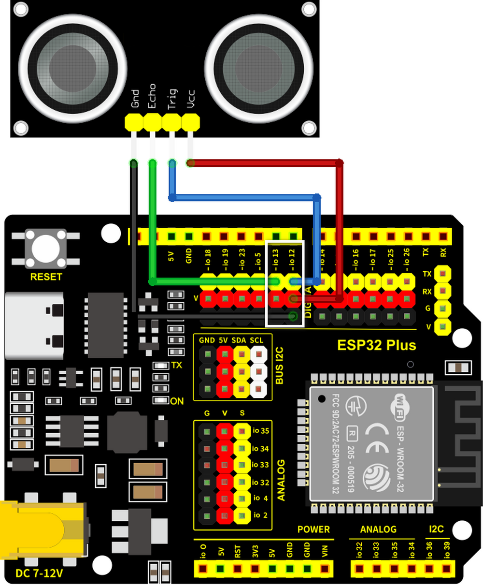
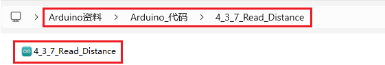
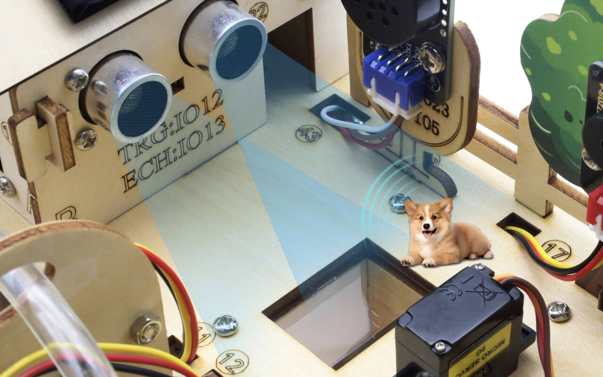
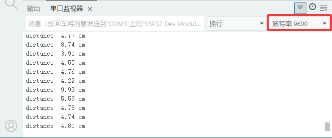

### 4.3.7 超声波传感器

#### 4.3.7.1 简介

本教程将为您详细介绍超声波传感器的使用方法和应用技巧。超声波传感器是一种利用超声波测距的电子设备，广泛应用于避障、距离测量和物体检测。教程内容包括超声波传感器的工作原理、引脚功能、电路连接方法以及如何通过微控制器（如ESP32）读取和处理测距数据。您将学习如何编写代码来实现实时距离测量、障碍物检测以及数据滤波和校准。无论您是电子初学者还是有经验的开发者，本教程都将帮助您掌握超声波传感器的应用，为您的项目增添精确的距离感知功能。

#### 4.3.7.2 元件知识

**超声波传感器:** 可以检测前方是否存在障碍物，并且检测出传感器与障碍物的详细距离。传感器主要用到CS100A芯片，它同时兼营3.3V与5V工作电压。最大测试距离为3米（<span style="color: rgb(255, 76, 65);">实际受各种环境因素的影响，一般很难达到3米的</span>）；盲区小于4CM。

它的测距原理和蝙蝠飞行的原理一样，就是超声波模块发送出一种频率很高，人体无法听到的超声波信号。这些超声波的信号若是碰到障碍物，就会立刻反射回来，在接收到返回的信息之后，通过判断发射信号和接收信号的时间差，计算出传感器和障碍物的距离。

**超声波参数：**

- 工作电压: DC 3.3V~5V
- 静态电流: <2mA
- 工作电流: 50mA~100mA，正常为65mA
- 最大功率：0.5W
- 最大探测距离：3m
- 盲区：小于4cm
- 感应角度：不大于15度
- 触发输入信号：10us TTL脉冲

**工作原理：**

最常用的超声测距的方法是回声探测法。当有脉冲电压触发时（单片机给Trig引脚发送高电平），超声波发射器探头里的晶片就会振动，继而产生超声波。在超声波发射时刻的同时计数器开始计时，超声波在空气中传播，途中碰到障碍物面阻挡就立即反射回来（Echo引脚发送高电平信号给单片机），超声波接收器收到反射回的超声波就立即停止计时。

超声波是一种声波，其声速V与温度有关。一般情况下超声波在空气中的传播速度为340m/s，根据计时器记录的时间t，就可以计算出超声波探头发射点距障碍物面的距离s，即：s=340t/2 。


HC-SR04超声波测距模块可提供范围为2厘米至3米的非接触式距离感测功能，测距精度可达高到3mm。超声波传感器包括超声波发射器、超声波接收器与控制电路。其基本工作原理：

(1) 采用IO口Trig触发测距，给至少10us的高电平信号;

(2) 模块自动发送8个40khz的方波，自动检测是否有信号返回；

(3) 有信号返回，通过IO口Echo输出一个高电平，高电平持续的时间就是超声波从发射到返回的时间。

(4) 距离 =（高电平时间 x 声速（340M/S）） / 2


⚠️ **注意:**

此模块不应在通电时连接，如有必要，先连接模块的 GND。否则，会影响模块的工作。

被测物体的面积应至少为 0.5 平方米，并尽可能平坦。否则，它会影响结果。

#### 4.3.7.3 接线图

- **超声波传感器的Echo引脚连接到io13，Trig引脚连接到io14**

⚠️ **特别注意：智慧农场已经组装好了，这里不需要把超声波传感器拆下来又重新组装和接线，这里再次提供接线图，是为了方便您编写代码！**




#### 4.3.7.4 实验代码

代码文件在`Arduino_代码`文件夹中，代码文件为`4_3_7_Read_Distance`，如下图所示：



鼠标双击`4_3_7_Read_Distance.ino`即可在Arduino IDE中打开。

```c++
/*
 * 文件名 : Read_Distance
 * 功能   : 读取超声波传感器检测到的距离值
 * 编译IDE：ARDUINO 2.3.6
 * 作者   : https://www.keyesrobot.cn/
*/
// 定义超声波传感器的引脚
const int trigPin = 14; //trig接GPIO14
const int echoPin = 13; //echo接GPIO13

// 读取传感器数据的功能原型
float readSensorData();

void setup() {
  // 以9600波特率开始串行通信
  Serial.begin(9600);
  // 设置echoPin为输入模式，trigPin为输出模式
  pinMode(trigPin, OUTPUT);
  pinMode(echoPin, INPUT);
  // 打印传感器信息到串行监视器
  Serial.println("Ultrasonic sensor:");  
}

void loop() {
  // 读取超声波传感器的距离值
  float distance = readSensorData();
  // 将测量到的距离打印到串行监视器上
  Serial.print("distance: ");
  Serial.print(distance);   
  Serial.println(" cm");
  // 读数之间的延迟
  delay(100);
}

// 从超声波传感器读取数据的功能
float readSensorData() {
  // 在发送高信号之前触发低信号
  digitalWrite(trigPin, LOW); 
  delayMicroseconds(2);
  // 给trigPin发送一个10微秒的高信号
  digitalWrite(trigPin, HIGH); 
  delayMicroseconds(10);
  // 返回低信号
  digitalWrite(trigPin, LOW);
  
  // 测量回声屏上高信号的持续时间
  unsigned long microsecond = pulseIn(echoPin, HIGH);

  // 用声速计算距离（29.00µs / cm）
  float distance = microsecond / 29.00 / 2;

  // 返回计算出的距离
  return distance;
}
```

#### 4.3.7.5 实验结果

按照接线图接好线，外接电源，选择好正确的开发板板型（ESP32 Dev Module）和 适当的串口端口（COMxx），然后单击按钮上传代码。上传代码成功后，单击Arduino IDE右上角的打开串口监视器窗口并设置串口波特率为`9600`，即可通过串口打印窗口查看超声波测距的距离值，调整超声波与障碍物的距离便能观察到距离变化。 



**串口现象图：**



#### 4.3.7.6 代码说明

```c
Serial.begin(9600);    // 启动串口监视器，设置波特率为9600
```

- 功能：启动Arduino的串口通信
- 参数：`9600`表示数据传输速率（比特/秒），一般波特率为`9600`或`115200`
- 必须放在`setup()`函数内
- 需要配套使用`Serial.print()`输出数据

-------------------

```c
pinMode(echoPin, INPUT);  // 设置超声波的echoPin引脚为输入模式
```

- `pinMode()` → Arduino专用函数，用于设置引脚工作模式
- `echoPin` → 要设置的引脚
- `INPUT` → 设置为输入模式（读取引脚的模拟值）

-------

```c
val = digitalRead(echoPin);  // 读取值并将其赋值给变量val
```

- `digitalRead()` → 数字输入读取函数，读取括号中引脚的高低电平（LOW或HIGH）。官方介绍：[digitalRead() | Arduino Documentation](https://docs.arduino.cc/language-reference/en/functions/digital-io/digitalread/)
- `echoPin` → 连接超声波的echoPin引脚
- `val` → 存储结果的变量（距离值）

-------

```c
Serial.print(distance);          // 打印变量distance的值
```

使用串口打印变量`distance`的值，打印方式是不换行打印

---------

```c
Serial.println("Ultrasonic sensor"); // 打印 字符串 Ultrasonic sensor
```

使用串口打印字符串"Ultrasonic sensor"，打印方式是换行打印，注意换行打印与不换行打印的函数不一样

---------

```c
if (val == 0) {             // 读取到低电平，并打印出相关的信息
...
  }
  else {               // 读取高电平
...
  }
```

- `if` → 条件判断语句
- `val == 0` → 判断条件（val是否等于0），如果val等于0则执行if下方的代码，val不等于0则执行else下方的代码
- `else` → 当条件不成立时执行

---------

```c
float distance = readSensorData();       // 用于存储超声波的距离值
```

定义一个名为"distance"的`float`类型的变量值，它可以存放小数

官方介绍：[float | Arduino Documentation](https://docs.arduino.cc/language-reference/en/variables/data-types/float/)

------------

```c
float readSensorData() {
    ...
}
```

超声波测距函数，这个函数是自定义函数，目的是方便读取超声波距离并且使代码简单化。

---------------

```c
delayMicroseconds(2);
```

微秒延时函数，官方介绍：[delayMicroseconds() | Arduino Documentation](https://docs.arduino.cc/language-reference/en/functions/time/delayMicroseconds/)

1s = 1000ms ； 1ms = 1000us

--------------

```c
unsigned long microsecond = pulseIn(echoPin, HIGH);
```

读取引脚脉冲函数。官方介绍：[pulseIn() | Arduino Documentation](https://docs.arduino.cc/language-reference/en/functions/advanced-io/pulseIn/)

----------

```c
return distance;
```

返回函数，终止函数并将值从函数返回给调用函数。官方介绍：[return | Arduino Documentation](https://docs.arduino.cc/language-reference/en/structure/control-structure/return/)
