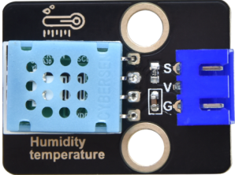
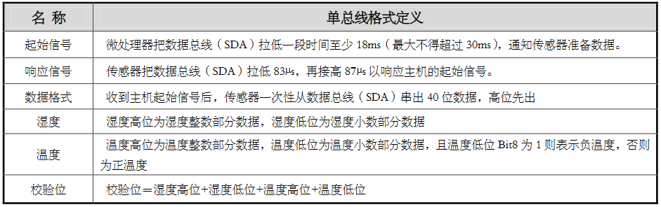
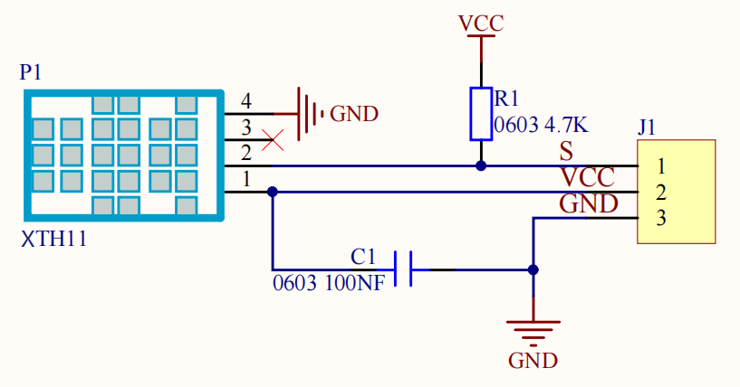
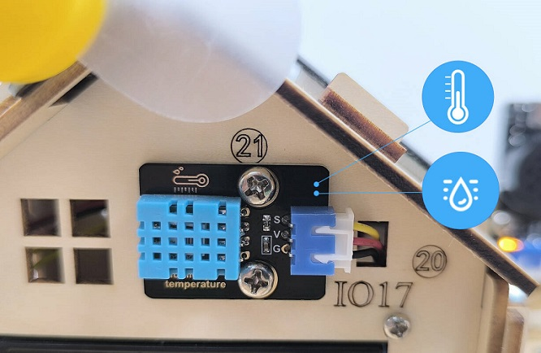
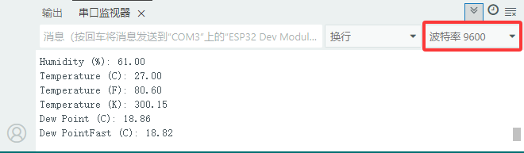

### 4.3.8 XHT11温湿度传感器

#### 4.3.8.1 简介

本教程将为您详细介绍XHT11温湿度传感器的使用方法和应用技巧。XHT11温湿度传感器是一种能够检测环境中的温度和湿度的电子元件，常用于家庭自动化、环境监测、农业等领域。教程内容包括XHT11温湿度传感器的工作原理、电路连接方法以及如何通过微控制器（如ESP32）读取温湿度值。您将学习如何编写代码来获取XHT11温湿度传感器检测的实时温湿度值，无论您是电子初学者还是有经验的开发者，本教程都将帮助您掌握XHT11温湿度传感器的应用，为您的项目增添智能的温湿度检测功能。

#### 4.3.8.2 元件知识

**XHT11温湿度传感器:** 是一种数字信号输出的温湿度传感器。它利用特殊的模拟信号采集、转换技术和温度、温湿度传感技术，确保传感器拥有良好的长时间稳定性，和较高的可靠性。该传感器内部包含高精度的电阻式湿度传感器件，和电阻式热敏测温传感器件，并与一个8位的性能高的单片机相连接。



**XHT11通信方式：**

XHT11 器件采用简化的单总线通信。单总线即只有一根数据线，系统中的数据交换、控制均由单总线完成。

- 单总线传送数据位定义：

  - 单总线数据格式：一次传送 40 位数据，高位先出。

  - 8bit 湿度整数数据 + 8bit 湿度小数数据 + 8bit 温度整数数据 + 8bit 温度小数数据 + 8bit 校验位。**注：其中湿度小数部分为 0**。

- 校验位数据定义：
  - 8bit 湿度整数数据 + 8bit 湿度小数数据 + 8bit 温度整数数据 + 8bit 温度小数数据。8bit 校验位等于所得结果的末 8 位。




数据时序图如下：

用户主机（MCU）发送一次开始信号后，XHT11 从低功耗模式转换到高速模式，待主机开始信号结束后，XHT11 发送响应信号，送出 40bit 的数据，并触发一次信采集。信号发送如图所示:


⚠️ **注意:** 主机从 XHT11 读取的温湿度数据总是前一次的测量值，如两次测间隔时间很长，请连续读两次以第二次获得的值为实时温湿度值。

**原理图：**




**参数：**

- 工作电压: DC 3.3V~5V 
- 工作电流: (Max)2.5mA@5V
- 最大功率: 0.0125W
- 温度范围: -25 ~ +60°C (± 2℃)
- 湿度范围: 5 ~ 95%RH（25C°左右精度为±5%RH）
- 输出信号: 数字双向单总线

#### 4.3.8.3 接线图

- **XHT11温湿度传感器的S引脚连接到io17**

⚠️ **特别注意：智慧农场已经组装好了，这里不需要把XHT11温湿度传感器拆下来又重新组装和接线，这里再次提供接线图，是为了方便您编写代码！**


#### 4.3.8.4 实验代码

⚠️ **特别注意：** 上传代码前要添加库文件，库文件存放在`Arduino_库文件`文件夹中名为`Dht11.zip`。

代码文件在`Arduino_代码`文件夹中，代码文件为`4_3_8_Read_XHT11`，如下图所示：


鼠标双击`4_3_8_Read_XHT11.ino`即可在Arduino IDE中打开。

```c++
/*
 * 文件名 : Read_XHT11
 * 功能   : 读取XHT11温湿度的湿度和温度
 * 编译IDE：ARDUINO 2.3.6
 * 作者   : https://www.keyesrobot.cn/
*/

#include <dht11.h>
#define DHT11PIN 17  //设置连接到DHT11数据引脚上的IO17

dht11 DHT11;  // DHT 11

void setup(){
  Serial.begin(9600); //设置串口波特率
  Serial.println("DHT11 TEST PROGRAM ");
  Serial.print("LIBRARY VERSION: ");
  Serial.println(DHT11LIB_VERSION);
  Serial.println();
}

void loop(){
  Serial.println("\n");
  int chk = DHT11.read(DHT11PIN);
  Serial.print("Read sensor: ");
  switch (chk){
    case DHTLIB_OK: Serial.println("OK"); break;
    case DHTLIB_ERROR_CHECKSUM: Serial.println("Checksum error"); break;
    case DHTLIB_ERROR_TIMEOUT: Serial.println("Time out error"); break;
    default: Serial.println("Unknown error"); break;
  }

  Serial.print("Humidity (%): ");
  Serial.println((float)DHT11.humidity, 2);

  Serial.print("Temperature (C): ");
  Serial.println((float)DHT11.temperature, 2);

  Serial.print("Temperature (F): ");
  Serial.println(Fahrenheit(DHT11.temperature), 2);

  Serial.print("Temperature (K): ");
  Serial.println(Kelvin(DHT11.temperature), 2);

  Serial.print("Dew Point (C): ");
  Serial.println(dewPoint(DHT11.temperature, DHT11.humidity));

  Serial.print("Dew PointFast (C): ");
  Serial.println(dewPointFast(DHT11.temperature, DHT11.humidity));

  delay(2000);
}

double Fahrenheit(double celsius) {
      return 1.8 * celsius + 32;
}    //摄氏温度度转化为华氏温度

double Kelvin(double celsius){
      return celsius + 273.15;
}     //摄氏温度转化为开氏温度

// 露点（点在此温度时，空气饱和并产生露珠）
// 参考: http://wahiduddin.net/calc/density_algorithms.htm 
double dewPoint(double celsius, double humidity){
      double A0= 373.15/(273.15 + celsius);
      double SUM = -7.90298 * (A0-1);
      SUM += 5.02808 * log10(A0);
      SUM += -1.3816e-7 * (pow(10, (11.344*(1-1/A0)))-1) ;
      SUM += 8.1328e-3 * (pow(10,(-3.49149*(A0-1)))-1) ;
      SUM += log10(1013.246);
      double VP = pow(10, SUM-3) * humidity;
      double T = log(VP/0.61078);   // temp var
      return (241.88 * T) / (17.558-T);
}

// 快速计算露点，速度是5倍dewPoint()
// 参考: http://en.wikipedia.org/wiki/Dew_point
double dewPointFast(double celsius, double humidity){
      double a = 17.271;
      double b = 237.7;
      double temp = (a * celsius) / (b + celsius) + log(humidity/100);
      double Td = (b * temp) / (a - temp);
      return Td;
}
```

#### 4.3.8.5 实验结果

按照接线图接好线，外接电源，选择好正确的开发板板型（ESP32 Dev Module）和 适当的串口端口（COMxx），然后单击按钮上传代码。上传代码成功后，单击Arduino IDE右上角的打开串口监视器窗口并设置串口波特率为`9600`，即可通过串口打印窗口查看XHT11传感器检测到的当前的温度和湿度等信息。 



**串口现象图：**

