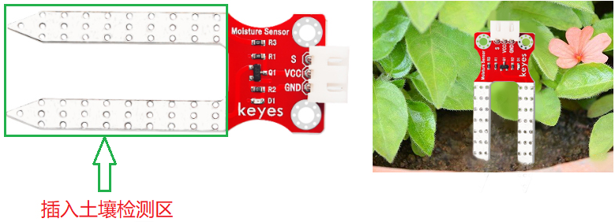
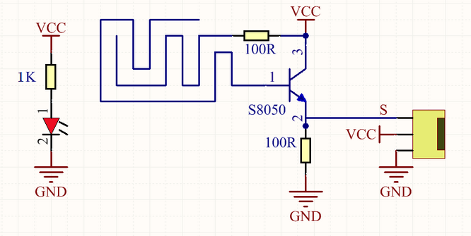
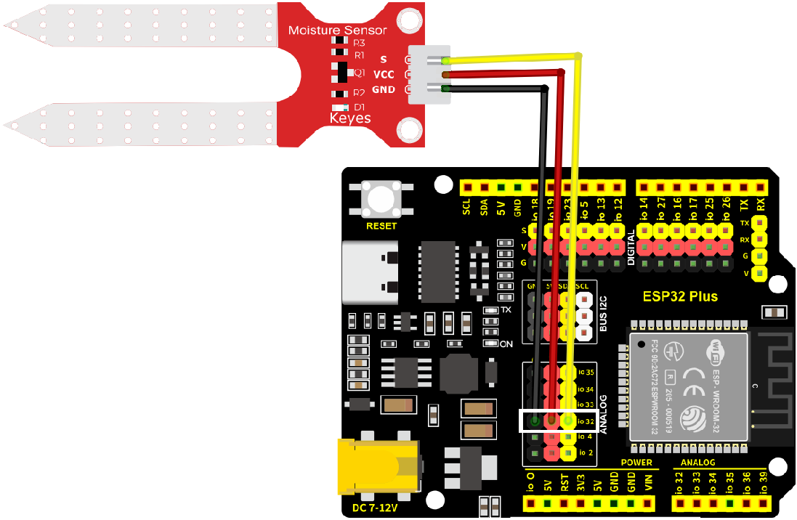
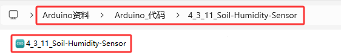
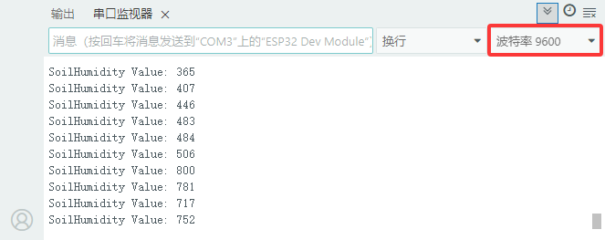

### 4.3.11 土壤湿度传感器

#### 4.3.11.1 简介

本教程将为您详细介绍土壤湿度传感器的使用方法和应用技巧。土壤湿度传感器是一种用于检测土壤水分含量的电子设备，广泛应用于农业灌溉、园艺和环境监测。教程内容包括土壤湿度传感器的工作原理、引脚功能、电路连接方法以及如何通过微控制器（如ESP32）读取和处理湿度数据。您将学习如何编写代码来实现实时湿度监测、自动灌溉控制以及数据校准和误差修正。无论您是电子初学者还是有经验的开发者，本教程都将帮助您掌握土壤湿度传感器的应用，为您的项目增添智能的土壤水分管理功能。

#### 4.3.11.2 元件知识

**土壤湿度传感器:** 通过检测土壤的电导率变化来测量湿度，传感器采用叉形设计，方便插入土壤。传感器插入土壤后，当土壤缺水时，电导率降低，传感器输出的模拟值减小；当土壤湿润时，电导率增加，传感器输出的模拟值增大。这种传感器简单实用，适合用于农业灌溉、园艺等场景。





**原理图：**



**参数：**

- 工作电压: DC 3.3V~5V
- 信号类型: 模拟信号

#### 4.3.11.3 接线图

- **土壤湿度传感器的S引脚连接到io32**

⚠️ **特别注意：智慧农场已经组装好了，这里不需要把土壤湿度传感器拆下来又重新组装和接线，这里再次提供接线图，是为了方便您编写代码！**



#### 4.3.11.4 实验代码

代码文件在`Arduino_代码`文件夹中，代码文件为`4_3_11_Soil-Humidity-Sensor`，如下图所示：



鼠标双击`4_3_11_Soil-Humidity-Sensor.ino`即可在Arduino IDE中打开。

```c++
/*
 * 文件名 : Soil-Humidity-Sensor
 * 功能   : 读取土壤湿度传感器的值
 * 编译IDE：ARDUINO 2.3.6
 * 作者   : https://www.keyesrobot.cn/
*/

const int SoilHumidityPin = 32; //定义土壤湿度传感器引脚为32

void setup() {
  Serial.begin(9600); //初始化串口
  pinMode(SoilHumidityPin,INPUT); //设置土壤湿度传感器引脚为输入模式
}

void loop() {
  //读取土壤湿度传感器的值，并且定义一个变量用来存储土壤湿度传感器的值
  int ReadValue = analogRead(SoilHumidityPin);
  Serial.print("SoilHumidity Value: ");
  Serial.println(ReadValue);
  delay(500);
}
```

#### 4.3.11.5 实验结果

按照接线图接好线，外接电源，选择好正确的开发板板型（ESP32 Dev Module）和 适当的串口端口（COMxx），然后单击按钮上传代码。上传代码成功后，单击Arduino IDE右上角的打开串口监视器窗口并设置串口波特率为`9600`，即可通过串口打印窗口查看土壤湿度传感器的模拟值，如果你没有盆栽可以用纸巾用水轻微打湿土壤湿度传感器的检测区。 


**串口现象图：**

