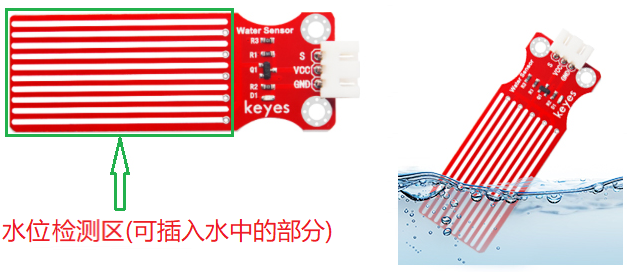
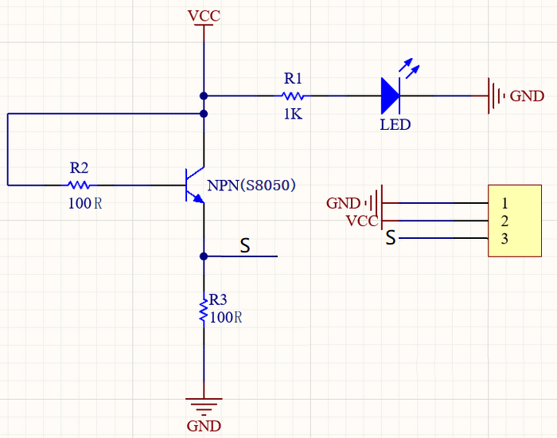
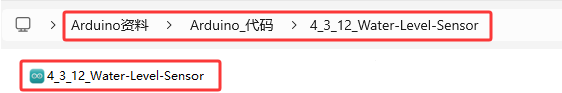
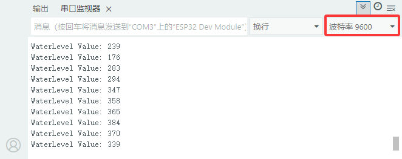

### 4.3.12 水位传感器

#### 4.3.12.1 简介

本教程将为您详细介绍水位传感器的使用方法和应用技巧。水位传感器是一种用于检测液体高度的电子设备，广泛应用于水塔监控、水箱管理和环境监测。教程内容包括水位传感器的工作原理、引脚功能、电路连接方法以及如何通过微控制器（如ESP32）读取和处理水位数据。您将学习如何编写代码来实现实时水位监测、自动报警以及数据校准和误差修正。无论您是电子初学者还是有经验的开发者，本教程都将帮助您掌握水位传感器的应用，为您的项目增添精确的液体高度检测功能。

#### 4.3.12.2 元件知识

**水位传感器：** 与土壤传感器的原理相同都是通过检测电导率变化来测量。水面淹没的传感器感应区越少，电导率降低，传感器输出的模拟值减小；水面淹没的传感器感应区越多，电导率增加，传感器输出的模拟值增大。这种传感器简单实用，适合用于农业灌溉、园艺等场景。



**原理图：**



⚠️ **注意：** 不要让传感器的元器件碰到水，可能会损害传感器以及开发板 

#### 4.3.12.3 接线图

- **水位传感器的S引脚连接到io33**

⚠️ **特别注意：智慧农场已经组装好了，这里不需要把水位传感器拆下来又重新组装和接线，这里再次提供接线图，是为了方便您编写代码！**


#### 4.3.12.4 实验代码

代码文件在`Arduino_代码`文件夹中，代码文件为`4_3_12_Water-Level-Sensor`，如下图所示：



鼠标双击`4_3_12_Water-Level-Sensor.ino`即可在Arduino IDE中打开。

```c++
/*
 * 文件名 : Water-Level-Sensor
 * 功能   : 读取水位传感器的值
 * 编译IDE：ARDUINO 2.3.6
 * 作者   : https://www.keyesrobot.cn/
*/

const int WaterLevelPin = 33; //定义水位传感器引脚为33

void setup() {

  Serial.begin(9600); //初始化串口
  pinMode(WaterLevelPin,INPUT); //设置水位传感器引脚为输入模式
}

void loop() {
  //读取水位传感器的值，并且定义一个变量用来存储土水位传感器的值
  int ReadValue = analogRead(WaterLevelPin);
  Serial.print("WaterLevel Value: ");
  Serial.println(ReadValue);
  delay(500);
}
```

#### 4.3.12.5 实验结果

按照接线图接好线，外接电源，选择好正确的开发板板型（ESP32 Dev Module）和 适当的串口端口（COMxx），然后单击按钮上传代码。上传代码成功后，单击Arduino IDE右上角的打开串口监视器窗口并设置串口波特率为`9600`，即可通过串口打印窗口查看水位传感器的模拟值，将水位传感器放置到容器中然后往容器中加水，注意不要超过安全线。 


**串口现象图：**

