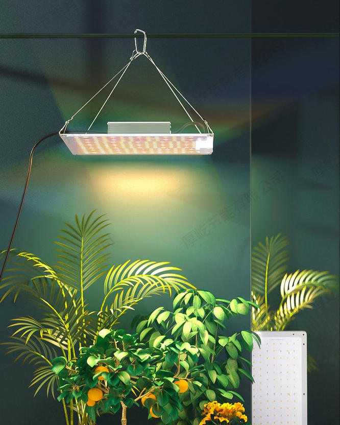
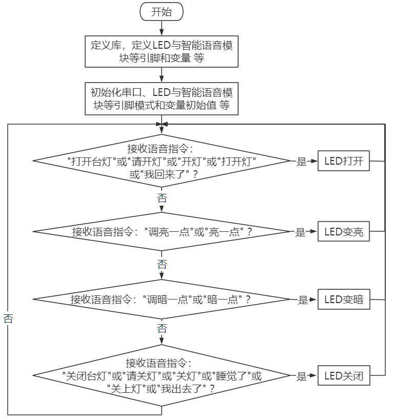
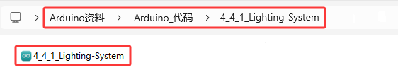

### 4.4.1 照明系统

#### 4.4.1.1 简介

在前面的教程中，已经了解过LED，智能语音模块的工作原理和应用，在本项目中，使用智能语音模块来控制LED，实现自动化语音控制LED亮灭及亮度改变。



本项目带领大家，了解如何使用Arduino ESP32开发板实现照明控制系统，模拟现实生活场景，通过智能语音模块来控制LED的开与关来实现自动化语音控制LED亮灭和亮度改变。

#### 4.4.1.2 接线图

- **LED模块的S引脚连接到io27**

- **智能语音模块的TXD引脚连接到io5，RXD引脚连接到io23**

⚠️ **特别注意：智慧农场已经组装好了，这里不需要把LED模块和智能语音模块拆下来又重新组装和接线，这里再次提供接线图，是为了方便您编写代码！**


#### 4.4.1.3 代码流程图



#### 4.4.1.4 实验代码

代码文件在`Arduino_代码`文件夹中，代码文件为`4_4_1_Lighting-System`，如下图所示：



鼠标双击`4_4_1_Lighting-System.ino`即可在Arduino IDE中打开。

```c++
/*
 * 文件名 : Lighting-System
 * 功能   : 智能语音模块控制LED来模拟智能照明系统
 * 编译IDE：ARDUINO 2.3.6
 * 作者   : https://www.keyesrobot.cn/
*/

//导入相关库文件
#include <SoftwareSerial.h>

// 定义引脚常量
const int RX_PIN = 23; // 引脚 GPIO23 为 RX
const int TX_PIN = 5; // 引脚 GPIO5 为 TX
const int LED_PIN = 27; // 定义LED的GPIO引脚

SoftwareSerial mySerial(RX_PIN, TX_PIN); // 定义软件串口引脚（RX, TX）

// LED亮度等级
const int LED_OFF = 0;
const int LED_DIM = 50;
const int LED_MEDIUM = 150;
const int LED_BRIGHT = 255;

void setup() {
  Serial.begin(9600); // 硬件串口（与电脑通信）
  mySerial.begin(9600); // 软件串口（与外设通信）
  pinMode(LED_PIN, OUTPUT); // 设置LED引脚为输出模式
}

void loop() { 
  if (mySerial.available()) { // 接收语音控制模块的外设数据
    int command = mySerial.read(); // 将接收到的外设数据进行赋值   
    switch(command) { //进行判断
      case 1: analogWrite(LED_PIN, LED_MEDIUM); break; // 接收到的数据为1,打开灯,灯的亮度为150
      case 2: analogWrite(LED_PIN, LED_OFF); break; // 接收到的数据为2,关闭灯
      case 3: analogWrite(LED_PIN, LED_BRIGHT); break; // 接收到的数据为3,灯的亮度为最亮
      case 4: analogWrite(LED_PIN, LED_DIM); break; // 接收到的数据为4,灯的亮度为暗
      default: break;
    }
    mySerial.println(command);
    Serial.println(command);
  }
}
```

#### 4.4.1.5 实验结果

按照接线图接好线，外接电源，选择好正确的开发板板型（ESP32 Dev Module）和 适当的串口端口（COMxx），然后单击按钮上传代码。上传代码成功后，通过智能语音模块来控制LED。

对着智能语音模块上的麦克风，使用唤醒词 “你好，小智” 或 “小智小智” 来唤醒智能语音模块，同时喇叭播放回复语 “有什么可以帮到您”；

智能语音模块唤醒后，对着麦克风说：“打开台灯” 或 “请开灯” 或 “开灯” 或 “打开灯” 或 “我回来了” 等命令词时，喇叭播放对应的回复语 “已为您打开照明”，同时LED点亮；

对着麦克风说：“调亮一点” 或 “亮一点” 等命令词时，喇叭播放对应的回复语 “灯光已调亮”，同时LED变亮；

对着麦克风说：“调暗一点” 或 “暗一点” 等命令词时，喇叭播放对应的回复语 “灯光已调暗”，同时LED变暗；

对着麦克风说：“关闭台灯” 或 “请关灯” 或 “关灯” 或 “睡觉了” 或 “关上灯” 或 “我出去了”等命令词时，喇叭播放对应的回复语 “已为您关闭照明”，同时LED熄灭。

