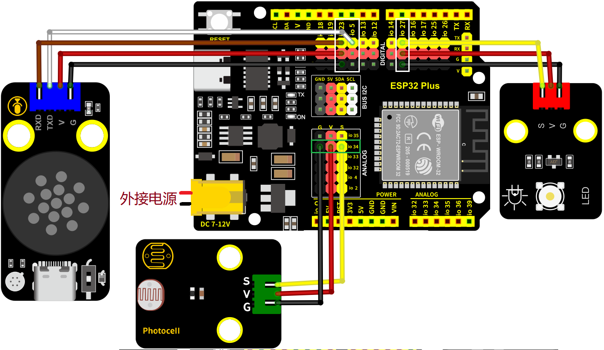

### 4.4.2 光控系统

#### 4.4.2.1 简介

这个系统是由光敏传感器、智能语音模块和LED灯组成的光控系统，可以实现智能化的灯光控制，节约能源并提高使用效率。


这种系统广泛应用于不同场景，并且通过使用光敏传感器，实现自动检测白天和黑夜以及光的强度，使得整个系统更加智能化和节能。

在前面的教程中，我们已经学习过关于光敏传感器、智能语音模块和LED灯的工作原理。那么，在本教程中将带领大家，了解如何使用Arduino ESP32开发板实现照明控制系统，模拟现实生活场景，通过光敏传感器控制LED灯的开与关，同时还可以对着智能语音模块发出类似于“当前光照强度是多少”等命令词，智能语音模块接收到相应命令词后语音播报当前光照强度（即：模拟值）。

当环境亮度低于设定值时，光敏传感器会检测到信号，从而自动打开LED灯；当环境亮度高于设定值时，光敏传感器会发送另一个信号，从而关闭LED灯。

#### 4.4.2.2 接线图

- **LED模块的S引脚连接到io27**

- **光敏传感器的S引脚连接到io34**

- **智能语音模块的TXD引脚连接到io5，RXD引脚连接到io23**

⚠️ **特别注意：智慧农场已经组装好了，这里不需要把光敏传感器、LED模块和智能语音模块拆下来又重新组装和接线，这里再次提供接线图，是为了方便您编写代码！**



#### 4.4.2.3 代码流程图


#### 4.4.2.4 实验代码

代码文件在`Arduino_代码`文件夹中，代码文件为`4_4_2_Light-Control-System`，如下图所示：


鼠标双击`4_4_2_Light-Control-System.ino`即可在Arduino IDE中打开。

⚠️ **注意：代码中的条件阈值可以根据实际情况自行设置。**

```c++
/*
 * 文件名 : Light-Control-System
 * 功能   : 结合光敏传感器、智能语音控制模块和LED模拟光控系统
 * 编译IDE：ARDUINO 2.3.6
 * 作者   : https://www.keyesrobot.cn/
*/

// 导入库文件
#include <SoftwareSerial.h>
#include <Wire.h>

// 定义引脚常量
const int PhotoresistorPin = 34;  // 定义光敏传感器引脚
const int LED = 27;  // 定义LED引脚
const int RX_PIN = 23; // 引脚 GPIO23 为 RX
const int TX_PIN = 5; // 引脚 GPIO5 为 TX

SoftwareSerial mySerial(RX_PIN, TX_PIN); // 定义软件串口引脚（RX, TX）

// 定义变量
volatile int yuyin;
volatile int ReadValue;

// 串口发送消息最大长度
#define UART_SEND_MAX      32
#define UART_MSG_HEAD_LEN  2
#define UART_MSG_FOOT_LEN  2

// 串口发送消息号
#define U_MSG_bozhensgshu      1
#define U_MSG_boxiaoshu      2
#define U_MSG_bobao1      3
#define U_MSG_bobao2      4
#define U_MSG_bobao3      5
#define U_MSG_bobao4      6
#define U_MSG_bobao5      7
#define U_MSG_bobao6      8
#define U_MSG_bobao7      9
#define U_MSG_bobao8      10
#define U_MSG_bobao9      11
#define U_MSG_bobao10      12
#define U_MSG_bobao11      13
#define U_MSG_bobao12      14
#define U_MSG_bobao13      15
#define U_MSG_bobao14      16
#define U_MSG_bobao15      17
#define U_MSG_bobao16      18
#define U_MSG_bobao17      19
#define U_MSG_bobao18      20

// 串口消息参数类型
typedef union {
  double d_double;
  int d_int;
  unsigned char d_ucs[8];
  char d_char;
  unsigned char d_uchar;
  unsigned long d_long;
  short d_short;
  float d_float;}uart_param_t;

// 串口发送函数实现
void _uart_send_impl(unsigned char* buff, int len) {
  // TODO: 调用项目实际的串口发送函数
  for(int i=0;i<len;i++){
    mySerial.write (*buff++);
  }
}

// 串口通信消息尾
const unsigned char g_uart_send_foot[] = {
  0x55, 0xaa
};

// 十六位整数转32位整数
void _int16_to_int32(uart_param_t* param) {
  if (sizeof(int) >= 4)
    return;
  unsigned long value = param->d_long;
  unsigned long sign = (value >> 15) & 1;
  unsigned long v = value;
  if (sign)
    v = 0xFFFF0000 | value;
  uart_param_t p;  p.d_long = v;
  param->d_ucs[0] = p.d_ucs[0];
  param->d_ucs[1] = p.d_ucs[1];
  param->d_ucs[2] = p.d_ucs[2];
  param->d_ucs[3] = p.d_ucs[3];
}

// 浮点数转双精度
void _float_to_double(uart_param_t* param) {
  if (sizeof(int) >= 4)
    return;
  unsigned long value = param->d_long;
  unsigned long sign = value >> 31;
  unsigned long M = value & 0x007FFFFF;
  unsigned long e =  ((value >> 23 ) & 0xFF) - 127 + 1023;
  uart_param_t p0, p1;
  p1.d_long = ((sign & 1) << 31) | ((e & 0x7FF) << 20) | (M >> 3);
  param->d_ucs[0] = p0.d_ucs[0];
  param->d_ucs[1] = p0.d_ucs[1];
  param->d_ucs[2] = p0.d_ucs[2];
  param->d_ucs[3] = p0.d_ucs[3];
  param->d_ucs[4] = p1.d_ucs[0];
  param->d_ucs[5] = p1.d_ucs[1];
  param->d_ucs[6] = p1.d_ucs[2];
  param->d_ucs[7] = p1.d_ucs[3];
}

// 串口通信消息头
const unsigned char g_uart_send_head[] = {
  0xaa, 0x55
};

// 播报函数5
void _uart_bobao5() {
  uart_param_t param;
    int i = 0;
    unsigned char buff[UART_SEND_MAX] = {0};
    for (i = 0; i < UART_MSG_HEAD_LEN; i++) {
        buff[i + 0] = g_uart_send_head[i];
    }
    buff[2] = U_MSG_bobao5;
    for (i = 0; i < UART_MSG_FOOT_LEN; i++) {
        buff[i + 3] = g_uart_send_foot[i];
    }
    _uart_send_impl(buff, 5);
}

// 播报整数
void _uart_bozhensgshu(int zhengshu) {
  uart_param_t param;
    int i = 0;
    unsigned char buff[UART_SEND_MAX] = {0};
    for (i = 0; i < UART_MSG_HEAD_LEN; i++) {
        buff[i + 0] = g_uart_send_head[i];
    }
    buff[2] = U_MSG_bozhensgshu;
    param.d_int = zhengshu;
    _int16_to_int32(&param);
    buff[3] = param.d_ucs[0];
    buff[4] = param.d_ucs[1];
    buff[5] = 0;
    buff[6] = 0;
    for (i = 0; i < UART_MSG_FOOT_LEN; i++) {
        buff[i + 7] = g_uart_send_foot[i];
    }
    _uart_send_impl(buff, 9);
}

void setup(){
   Serial.begin(9600); // 硬件串口（与电脑通信）
   mySerial.begin(9600); // 软件串口（与外设通信）
   ReadValue = 0; // 定义变量ReadValue初始值为0 
   yuyin = 0;  // 定义变量yuyin初始值为0 
   Wire.begin(21,22); // 定义LCD通信引脚
   pinMode(PhotoresistorPin, INPUT); // 设置光敏引脚为输入模式
   pinMode(LED, OUTPUT); // 设置LED引脚为输出模式
}

void loop(){
   ReadValue = analogRead(PhotoresistorPin); // 读取光敏传感器的模拟值
   delay(100);
   if (mySerial.available() > 0) { // 接收语音控制模块的外设数据(命令参数)
     yuyin = mySerial.read(); // 将接收到的外设数据(命令参数)进行赋值
     Serial.println(yuyin);  // 串口打印收到的外设数据(命令参数)
     if (yuyin == 50) { // 进行判断，接收到的数据(命令参数)为50，检测光照强度并且进行语音播报
       yuyin = 0;
       delay(3000);
       _uart_bobao5();
       delay(3000);
       _uart_bozhensgshu(ReadValue);
       delay(2000);
     }
   }  
   if (ReadValue >= 800) { // 进行判断，检测到光照强度大于等于800时，LED不亮
     digitalWrite(LED,LOW);
   } else { // 否则，LED点亮
     digitalWrite(LED,HIGH);
  }
}
```

#### 4.4.2.5 实验结果

按照接线图接好线，外接电源，选择好正确的开发板板型（ESP32 Dev Module）和 适当的串口端口（COMxx），然后单击按钮上传代码。上传代码成功后，当白天光照较强时，光敏传感器的模拟值大于等于800时，LED会不亮，当天黑后，光敏传感器的模拟值小于800时，LED会自动打开。

对着智能语音模块上的麦克风，使用唤醒词 “你好，小智” 或 “小智小智” 来唤醒智能语音模块，同时喇叭播放回复语 “有什么可以帮到您”；

智能语音模块唤醒后，对着麦克风说：“当前光照强度是多少” 或 “光照强度多少” 等命令词句时，接着语音播报 “正在为您读取光照强度” + “当前光照强度为” + “光敏传感器检测到的光照强度模拟值”。


**这种系统广泛应用于不同场景，并且通过使用光敏传感器，实现自动检测白天和黑夜以及光的强度，使得整个系统更加智能化和节能。**