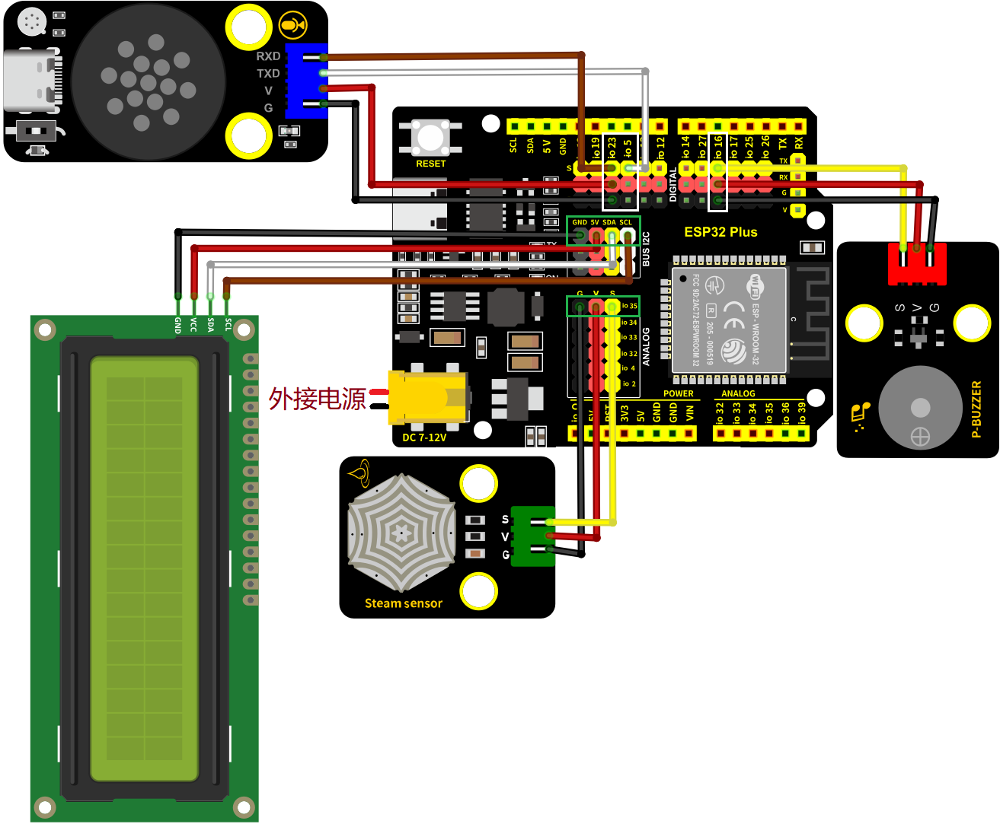

### 4.4.4 雨水检测系统

***注意：水洒在其他传感器上会导致短路，导致设备失效，洒在电池上会导致发热爆炸。请在使用设备时格外小心，尤其是幼儿使用时一定要在家长的监护下进行。为确保设备的安全运行，请遵循相关使用指南和安全规范。***

#### 4.4.4.1 简介

本教程介绍了如何使用水滴传感器、蜂鸣器、LCD1602模块、智能语音模块和ESP32来创建一个雨水检测系统。当传感器检测到雨时，ESP32可以触发各种动作，如发送通知、激活洒水器或打开蜂鸣器等。这个系统可用于监测园艺或农业的雨量，或检测屋顶或建筑物的漏水情况。水滴传感器可以很容易地连接到ESP32开发板上，形成一个简单而有效的雨水检测系统。


当水滴传感器检测到雨水时，它会向ESP32开发板发送一个信号，可以触发各种动作。例如，可以用一个蜂鸣器发出警报声，提醒用户正在下雨，在LCD1602模块上显示当前雨水量百分数值，同时对着智能语音模块发出类似于“当前雨水量是多少”等命令词，智能语音模块接收到相应命令词后还能语音播报当前雨水量百分数值。这一功能对户外园艺或农业特别有用，使用户能够采取必要的预防措施，避免过度浇灌植物。

此外，使用水滴传感器和ESP32的雨水检测系统可用于检测屋顶或建筑物的漏水情况，帮助防止水入侵造成的损害。总的来说，水滴传感器是一个多功能的有效工具，可以在各种应用中检测水的存在。

#### 4.4.4.2 接线图

- **水滴传感器的S引脚连接到io35**

- **无源蜂鸣器的S引脚连接到io16**

- **智能语音模块的TXD引脚连接到io5，RXD引脚连接到io23**

- **LCD1602模块连接到 BUS I2C(SDA连接(SDA:IO21)、SCL连接(SCL:IO22)**

⚠️ **特别注意：智慧农场已经组装好了，这里不需要把水滴传感器、无源蜂鸣器、LCD1602模块和智能语音模块拆下来又重新组装和接线，这里再次提供接线图，是为了方便您编写代码！**



#### 4.4.4.3 代码流程图


#### 4.4.4.4 实验代码

代码文件在`Arduino_代码`文件夹中，代码文件为`4_4_4_Rainwater-Detection-System`，如下图所示：


鼠标双击`4_4_4_Rainwater-Detection-System.ino`即可在Arduino IDE中打开。

**注意：代码中的条件阈值可以根据实际情况自行设置。**

```c++
/*
 * 文件名 : Rainwater-Detection-System
 * 功能   : 结合水滴传感器、智能语音控制模块、LCD1602模块和无源蜂鸣器模拟雨水检测系统
 * 编译IDE：ARDUINO 2.3.6
 * 作者   : https://www.keyesrobot.cn/
*/

// 导入相关库文件
#include <SoftwareSerial.h>
#include <Wire.h>
#include <LiquidCrystal_I2C.h>

// 定义引脚常量
const int RX_PIN = 23; // 引脚 GPIO23 为 RX
const int TX_PIN = 5; // 引脚 GPIO5 为 TX
const int SteamPin = 35;   // 定义水滴传感器引脚
const int BuzzerPin = 16; // 定义无源蜂鸣器引脚

SoftwareSerial mySerial(RX_PIN, TX_PIN); // 定义软件串口引脚（RX, TX）

LiquidCrystal_I2C lcd(0x27, 16, 2); // 定义LCD地址和行列

// 定义变量
volatile int yuyin;
volatile double AnalogValue;
volatile int Value;

// 串口发送消息最大长度
#define UART_SEND_MAX      32
#define UART_MSG_HEAD_LEN  2
#define UART_MSG_FOOT_LEN  2

// 串口发送消息号
#define U_MSG_bozhensgshu      1
#define U_MSG_boxiaoshu      2
#define U_MSG_bobao1      3
#define U_MSG_bobao2      4
#define U_MSG_bobao3      5
#define U_MSG_bobao4      6
#define U_MSG_bobao5      7
#define U_MSG_bobao6      8
#define U_MSG_bobao7      9
#define U_MSG_bobao8      10
#define U_MSG_bobao9      11
#define U_MSG_bobao10      12
#define U_MSG_bobao11      13
#define U_MSG_bobao12      14
#define U_MSG_bobao13      15
#define U_MSG_bobao14      16
#define U_MSG_bobao15      17
#define U_MSG_bobao16      18
#define U_MSG_bobao17      19
#define U_MSG_bobao18      20

// 串口消息参数类型
typedef union {
  double d_double;
  int d_int;
  unsigned char d_ucs[8];
  char d_char;
  unsigned char d_uchar;
  unsigned long d_long;
  short d_short;
  float d_float;}uart_param_t;

// 串口发送函数实现
void _uart_send_impl(unsigned char* buff, int len) {
  // TODO: 调用项目实际的串口发送函数
  for(int i=0;i<len;i++){
    mySerial.write (*buff++);
  }
}

// 串口通信消息尾
const unsigned char g_uart_send_foot[] = {
  0x55, 0xaa
};

// 十六位整数转32位整数
void _int16_to_int32(uart_param_t* param) {
  if (sizeof(int) >= 4)
    return;
  unsigned long value = param->d_long;
  unsigned long sign = (value >> 15) & 1;
  unsigned long v = value;
  if (sign)
    v = 0xFFFF0000 | value;
  uart_param_t p;  p.d_long = v;
  param->d_ucs[0] = p.d_ucs[0];
  param->d_ucs[1] = p.d_ucs[1];
  param->d_ucs[2] = p.d_ucs[2];
  param->d_ucs[3] = p.d_ucs[3];
}

// 浮点数转双精度
void _float_to_double(uart_param_t* param) {
  if (sizeof(int) >= 4)
    return;
  unsigned long value = param->d_long;
  unsigned long sign = value >> 31;
  unsigned long M = value & 0x007FFFFF;
  unsigned long e =  ((value >> 23 ) & 0xFF) - 127 + 1023;
  uart_param_t p0, p1;
  p1.d_long = ((sign & 1) << 31) | ((e & 0x7FF) << 20) | (M >> 3);
  param->d_ucs[0] = p0.d_ucs[0];
  param->d_ucs[1] = p0.d_ucs[1];
  param->d_ucs[2] = p0.d_ucs[2];
  param->d_ucs[3] = p0.d_ucs[3];
  param->d_ucs[4] = p1.d_ucs[0];
  param->d_ucs[5] = p1.d_ucs[1];
  param->d_ucs[6] = p1.d_ucs[2];
  param->d_ucs[7] = p1.d_ucs[3];
}

// 串口通信消息头
const unsigned char g_uart_send_head[] = {
  0xaa, 0x55
};

// 播报函数3
void _uart_bobao3() {
  uart_param_t param;
    int i = 0;
    unsigned char buff[UART_SEND_MAX] = {0};
    for (i = 0; i < UART_MSG_HEAD_LEN; i++) {
        buff[i + 0] = g_uart_send_head[i];
    }
    buff[2] = U_MSG_bobao3;
    for (i = 0; i < UART_MSG_FOOT_LEN; i++) {
        buff[i + 3] = g_uart_send_foot[i];
    }
    _uart_send_impl(buff, 5);
}

// 播报整数
void _uart_bozhensgshu(int zhengshu) {
  uart_param_t param;
    int i = 0;
    unsigned char buff[UART_SEND_MAX] = {0};
    for (i = 0; i < UART_MSG_HEAD_LEN; i++) {
        buff[i + 0] = g_uart_send_head[i];
    }
    buff[2] = U_MSG_bozhensgshu;
    param.d_int = zhengshu;
    _int16_to_int32(&param);
    buff[3] = param.d_ucs[0];
    buff[4] = param.d_ucs[1];
    buff[5] = 0;
    buff[6] = 0;
    for (i = 0; i < UART_MSG_FOOT_LEN; i++) {
        buff[i + 7] = g_uart_send_foot[i];
    }
    _uart_send_impl(buff, 9);
}

void setup(){
   mySerial.begin(9600); // 软件串口（与外设通信）
   Serial.begin(9600); // 硬件串口（与电脑通信）
   yuyin = 0; // 定义变量yuyin初始值为0
   AnalogValue = 0; // 定义变量AnalogValue初始值为0
   Value = 0; // 定义变量Value初始值为0
   Wire.begin(21,22); // 定义LCD通信引脚
   lcd.init(); // 初始化LCD
   lcd.backlight(); // 打开LCD背光
   lcd.display(); // 打开LCD显示
   lcd.clear(); // LCD清屏
   pinMode(SteamPin, INPUT); // 设置水滴传感器引脚为输入模式
   pinMode(BuzzerPin, OUTPUT); // 设置蜂鸣器引脚为输出模式
}

void loop(){
   AnalogValue = analogRead(SteamPin); // 获取水滴传感器的模拟值
   Value = round((AnalogValue / 4096.0) * 100); //将传感器模拟值通过计算转化成百分数赋于变量Value
   // 在LCD对应位置显示当前雨水量的百分数相关信息   
   lcd.setCursor(0, 0);
   lcd.print(String("RainWater(%):") + String(Value));
   lcd.setCursor(0, 1);
   lcd.print("");
   if (mySerial.available() > 0) { // 接收语音控制模块的外设数据(命令参数)
     yuyin = mySerial.read(); // 将接收到的外设数据(命令参数)进行赋值 
     Serial.println(yuyin); // 串口打印收到的外设数据(命令参数) 
     if (yuyin == 49) { // 进行判断，接收到的数据(命令参数) 为49，检测雨水量的百分数值并且进行语音播报
       yuyin = 0;
       delay(3000);
       _uart_bobao3();
       delay(3000);
       _uart_bozhensgshu(Value);
       delay(2000);
     }
   }
   if (Value >= 10 && Value < 40) { // 进行判断，雨水量的百分数值大于等于10且小于40，蜂鸣器发出警报声1
     // 循环执行3次
     for (int i = 0; i < 3; i++) {
       tone(BuzzerPin,200); // 蜂鸣器发出频率为200的音调
       delay(100);
       noTone(BuzzerPin); // 蜂鸣器不发声
       delay(100);
     } 
   } else if (Value >= 40 && Value <= 90) { // 进行判断，雨水量的百分数值大于等于40且小于90，蜂鸣器发出警报声2
     for (int i = 0; i < 3; i++) {
       tone(BuzzerPin,400); 
       delay(100);
       noTone(BuzzerPin);
       delay(100);
     }
   } else if (Value > 90) { // 进行判断，雨水量的百分数值大于90，蜂鸣器发出警报声3
     for (int i = 0; i < 3; i++) {
       tone(BuzzerPin,600);
       delay(100);
       noTone(BuzzerPin);
       delay(100);
     }
   }
   noTone(BuzzerPin);
   delay(500);
   lcd.clear(); // 清除LCD显示
}
```

#### 4.4.4.5 实验结果

按照接线图接好线，外接电源，选择好正确的开发板板型（ESP32 Dev Module）和 适当的串口端口（COMxx），然后单击按钮上传代码。上传代码成功后，LCD1602模块显示屏显示当前雨水量的百分数相关信息，当水滴传感器检测到的雨水量的百分数越大，蜂鸣器报警声音越大。

对着智能语音模块上的麦克风，使用唤醒词 “你好，小智” 或 “小智小智” 来唤醒智能语音模块，同时喇叭播放回复语 “有什么可以帮到您”；

智能语音模块唤醒后，对着麦克风说：“当前雨水量是多少” 或 “当前雨量多少” 等命令词时，接着语音播报 “正在为您读取当前雨水量” + “当前雨水量为百分之” + “水滴传感器模拟值通过计算转化成的雨水量百分数值”。

