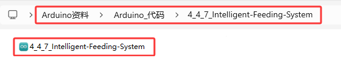

### 4.4.7 智能喂养系统

#### 4.4.7.1 简介

通过超声波传感器来检测动物是否在喂食区，可以驱动伺服开关打开喂食盒，自动喂食动物，同时还可以语音播报动物离喂食盒的距离。融入物联网技术可以实现对饲喂系统的远程监控，提供另一个层面的便利和控制。总的来说，喂养系统的自动化和远程化，优化动物的喂养过程。


智能喂养系统是通过组合超声波传感器、智能语音模块和舵机，实现对动物的智能喂养。超声波传感器用于检测宠物的距离，当宠物靠近食物盆时，传感器检测到距离变近，触发信号后控制舵机将饲料盒打开；人对智能语音模块发出对应语音命令词，智能语音模块接收语音命令词，然后语音播报动物离超声波传感器之间的当前距离值。

#### 4.4.7.2 接线图

- **舵机的黄色线连接到io26**

- **超声波传感器的Echo连接到io13，Trig连接到io14**

- **智能语音模块的TXD引脚连接到io5，RXD引脚连接到io23**

⚠️ **特别注意：智慧农场已经组装好了，这里不需要把超声波传感器、舵机和智能语音模块拆下来又重新组装和接线，这里再次提供接线图，是为了方便您编写代码！**


#### 4.4.7.3 代码流程图


#### 4.4.7.4 实验代码

代码文件在`Arduino_代码`文件夹中，代码文件为`4_4_7_Intelligent-Feeding-System`，如下图所示：



鼠标双击`4_4_7_Intelligent-Feeding-System.ino`即可在Arduino IDE中打开。

⚠️ **注意：代码中的条件阈值可以根据实际情况自行设置。**

```c++
/*
 * 文件名 : Intelligent-Feeding-System
 * 功能   : 结合超声波传感器、语音控制模块和舵机模拟智能喂养系统
 * 编译IDE：ARDUINO 2.3.6
 * 作者   : https://www.keyesrobot.cn/
*/

// 导入相关库文件
#include <SoftwareSerial.h>
#include <ESP32Servo.h>  
Servo myservo;  // 创建舵机对象来控制舵机,在ESP32上可以创建16个舵机对象

// 定义引脚常量
const int RX_PIN = 23; // 引脚 GPIO23 为 RX
const int TX_PIN = 5; // 引脚 GPIO5 为 TX
const int TrigPin = 14; // trig接GPIO14
const int EchoPin = 13; // echo接GPIO13
const int ServoPin = 26; // 舵机的引脚

SoftwareSerial mySerial(RX_PIN, TX_PIN); // 定义软件串口引脚（RX, TX）

// 定义变量
volatile int yuyin;
volatile int distance;
volatile int duration;

// 串口发送消息最大长度
#define UART_SEND_MAX      32
#define UART_MSG_HEAD_LEN  2
#define UART_MSG_FOOT_LEN  2

// 串口发送消息号
#define U_MSG_bozhensgshu      1
#define U_MSG_boxiaoshu      2
#define U_MSG_bobao1      3
#define U_MSG_bobao2      4
#define U_MSG_bobao3      5
#define U_MSG_bobao4      6
#define U_MSG_bobao5      7
#define U_MSG_bobao6      8
#define U_MSG_bobao7      9
#define U_MSG_bobao8      10
#define U_MSG_bobao9      11
#define U_MSG_bobao10      12
#define U_MSG_bobao11      13
#define U_MSG_bobao12      14
#define U_MSG_bobao13      15
#define U_MSG_bobao14      16
#define U_MSG_bobao15      17
#define U_MSG_bobao16      18
#define U_MSG_bobao17      19
#define U_MSG_bobao18      20

// 串口消息参数类型
typedef union {
  double d_double;
  int d_int;
  unsigned char d_ucs[8];
  char d_char;
  unsigned char d_uchar;
  unsigned long d_long;
  short d_short;
  float d_float;}uart_param_t;

// 串口发送函数实现
void _uart_send_impl(unsigned char* buff, int len) {
  // TODO: 调用项目实际的串口发送函数
  for(int i=0;i<len;i++){
    mySerial.write (*buff++);
  }
}

// 串口通信消息尾
const unsigned char g_uart_send_foot[] = {
  0x55, 0xaa
};

// 十六位整数转32位整数
void _int16_to_int32(uart_param_t* param) {
  if (sizeof(int) >= 4)
    return;
  unsigned long value = param->d_long;
  unsigned long sign = (value >> 15) & 1;
  unsigned long v = value;
  if (sign)
    v = 0xFFFF0000 | value;
  uart_param_t p;  p.d_long = v;
  param->d_ucs[0] = p.d_ucs[0];
  param->d_ucs[1] = p.d_ucs[1];
  param->d_ucs[2] = p.d_ucs[2];
  param->d_ucs[3] = p.d_ucs[3];
}

// 浮点数转双精度
void _float_to_double(uart_param_t* param) {
  if (sizeof(int) >= 4)
    return;
  unsigned long value = param->d_long;
  unsigned long sign = value >> 31;
  unsigned long M = value & 0x007FFFFF;
  unsigned long e =  ((value >> 23 ) & 0xFF) - 127 + 1023;
  uart_param_t p0, p1;
  p1.d_long = ((sign & 1) << 31) | ((e & 0x7FF) << 20) | (M >> 3);
  param->d_ucs[0] = p0.d_ucs[0];
  param->d_ucs[1] = p0.d_ucs[1];
  param->d_ucs[2] = p0.d_ucs[2];
  param->d_ucs[3] = p0.d_ucs[3];
  param->d_ucs[4] = p1.d_ucs[0];
  param->d_ucs[5] = p1.d_ucs[1];
  param->d_ucs[6] = p1.d_ucs[2];
  param->d_ucs[7] = p1.d_ucs[3];
}

// 串口通信消息头
const unsigned char g_uart_send_head[] = {
  0xaa, 0x55
};

//把获取超声波检测的距离，写在一个函数里
float getDistance() {
  digitalWrite(TrigPin,LOW);
  delayMicroseconds(2);
  digitalWrite(TrigPin,HIGH);
  delayMicroseconds(10);	//给trig至少10us的高电平时间触发
  digitalWrite(TrigPin,LOW);
  duration = pulseIn(EchoPin,HIGH);	//echo高电平的时间
  distance = duration/58;		//换算成距离，单位为cm
  delay(50);  
  return distance;
}

// 播报函数9
void _uart_bobao9() {
  uart_param_t param;
    int i = 0;
    unsigned char buff[UART_SEND_MAX] = {0};
    for (i = 0; i < UART_MSG_HEAD_LEN; i++) {
        buff[i + 0] = g_uart_send_head[i];
    }
    buff[2] = U_MSG_bobao9;
    for (i = 0; i < UART_MSG_FOOT_LEN; i++) {
        buff[i + 3] = g_uart_send_foot[i];
    }
    _uart_send_impl(buff, 5);
}

// 播报整数
void _uart_bozhensgshu(int zhengshu) {
  uart_param_t param;
    int i = 0;
    unsigned char buff[UART_SEND_MAX] = {0};
    for (i = 0; i < UART_MSG_HEAD_LEN; i++) {
        buff[i + 0] = g_uart_send_head[i];
    }
    buff[2] = U_MSG_bozhensgshu;
    param.d_int = zhengshu;
    _int16_to_int32(&param);
    buff[3] = param.d_ucs[0];
    buff[4] = param.d_ucs[1];
    buff[5] = 0;
    buff[6] = 0;
    for (i = 0; i < UART_MSG_FOOT_LEN; i++) {
        buff[i + 7] = g_uart_send_foot[i];
    }
    _uart_send_impl(buff, 9);
}

// 播报函数16
void _uart_bobao16() {
  uart_param_t param;
    int i = 0;
    unsigned char buff[UART_SEND_MAX] = {0};
    for (i = 0; i < UART_MSG_HEAD_LEN; i++) {
        buff[i + 0] = g_uart_send_head[i];
    }
    buff[2] = U_MSG_bobao16;
    for (i = 0; i < UART_MSG_FOOT_LEN; i++) {
        buff[i + 3] = g_uart_send_foot[i];
    }
    _uart_send_impl(buff, 5);
}

void setup(){
   Serial.begin(9600); // 硬件串口（与电脑通信）
   mySerial.begin(9600); // 软件串口（与外设通信）
   distance = 0; // 定义变量distance初始值为0
   yuyin = 0; // 定义变量yuyin初始值为0
   pinMode(TrigPin,OUTPUT);  // trig设置为输出模式
   pinMode(EchoPin,INPUT);   // echo设置为输入模式
   myservo.attach(ServoPin);   // 将引脚io26上的舵机连接到舵机对象上
   myservo.write(180); // 舵机角度为180°
   delay(1000); // 延时1s
}

void loop(){
   distance = getDistance();
   if (mySerial.available() > 0) {  // 接收语音控制模块的外设数据(命令参数)
     yuyin = mySerial.read(); // 将接收到的外设数据(命令参数)进行赋值 
     Serial.println(yuyin); // 串口打印收到的外设数据(命令参数)
     if (yuyin == 54) {// 进行判断，接收到的外设数据(命令参数)为54，检测距离并且进行语音播报
       yuyin = 0;
       delay(2000);
       _uart_bobao9();
       delay(2000);
       _uart_bozhensgshu(distance);
       delay(1000);
       _uart_bobao16();
       delay(2000);
     }
   }
   if (distance >= 2 && distance <= 7) { // 进行判断，检测到距离大于等于2cm小于等于7cm时，舵机转动到80度
     myservo.write(80);
     delay(1000);
   } else { // 否则，舵机不转
     myservo.write(180);
     delay(1000);
  }
}
```

#### 4.4.7.5 实验结果

按照接线图接好线，外接电源，选择好正确的开发板板型（ESP32 Dev Module）和 适当的串口端口（COMxx），然后单击按钮上传代码。上传代码成功后，当超声波检测到有动物离超声波传感器的距离大于等于2cm小于等于7cm时，将开启饲料盒。

对着智能语音模块上的麦克风，使用唤醒词 “你好，小智” 或 “小智小智” 来唤醒智能语音模块，同时喇叭播放回复语 “有什么可以帮到您”；

智能语音模块唤醒后，对着麦克风说：“现在距离是多少” 等命令词时，接着语音播报 “正在为您读取距离” + “当前距离为” + “超声波传感器检测到的距离数值”  + “厘米”。


⚠️ **注意：** 请勿将手指伸入到饲料盒中，谨防夹伤！请勿将其他物体堵住饲料盒盖，以免弄坏舵机。