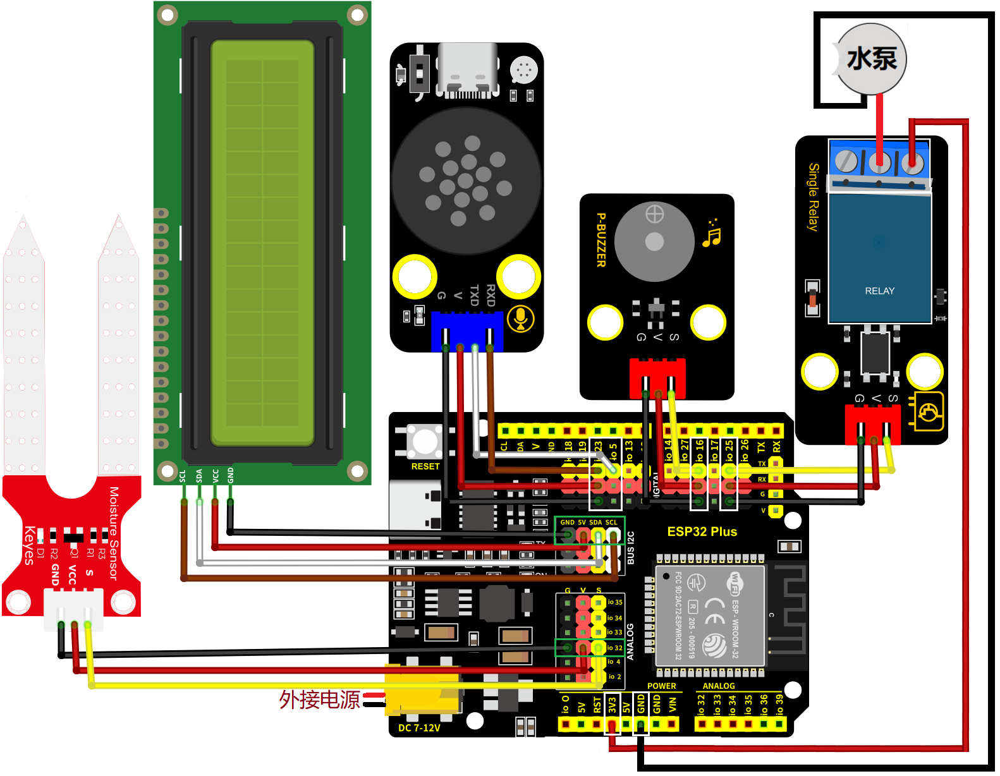
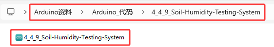

### 4.4.9 土壤湿度监测系统

***请注意，使用设备时不要让水从水池和土壤池中溢出。如果水洒到其他传感器上，会导致短路，影响设备正常工作。另外，如果水洒到电池上，会导致发热和爆炸等危险。因此，请在使用设备时格外小心，尤其是幼儿使用时一定要在家长的监护下进行。为确保设备的安全运行，请遵循相关使用指南和安全规范。***

#### 4.4.9.1 简介

本课程介绍如何使用ESP32开发板、土壤湿度传感器、智能语音模块、无源蜂鸣器、继电器、水泵和LCD1602模块，构建一个智能土壤湿度检测系统。

该系统能够通过LCD1602显示屏实时显示土壤湿度传感器检测的土壤湿度百分数值，当土壤湿度百分数值低于设定的阈值时，蜂鸣器会响起警报声，提示该浇灌土地了。同时对着智能语音模块发出类似于“当前土壤湿度是多少”等命令词时，智能语音模块接收到相应命令词后语音播报当前土壤湿度百分数值。这个应用场景是一个非常实用的解决方案，可以帮助农场主人监测和控制农场的土地湿度，提高农业生产效率。


使用LCD1602显示屏，实时显示土壤湿度传感器的值，当湿度低于设定的阈值，蜂鸣器会响起警报声，提示该浇灌土地了。

#### 4.4.9.2 接线图

- **土壤湿度传感器的S引脚连接到io32**

- **无源蜂鸣器的S引脚连接到io16**

- **智能语音模块的TXD引脚连接到io5，RXD引脚连接到io23**
 
- **LCD1602模块连接到 BUS I2C(SDA连接(SDA:IO21)、SCL连接(SCL:IO22)**

- **继电器模块的S引脚连接到io25；继电器的NO端，连接到ESP32主板上的3V3引脚**

- **水泵：**
  - **红色线连接到继电器的COM端，如图所示**
  - **黑色线连接到ESP32主板上的GND引脚，如图所示**
 
⚠️ **特别注意：智慧农场已经组装好了，这里不需要把土壤湿度传感器、无源蜂鸣器、LCD1602模块、继电器、水泵和智能语音模块拆下来又重新组装和接线，这里再次提供接线图，是为了方便您编写代码！**



#### 4.4.9.3 代码流程图


#### 4.4.9.4 实验代码

代码文件在`Arduino_代码`文件夹中，代码文件为`4_4_9_Soil-Humidity-Testing-System`，如下图所示：



鼠标双击`4_4_9_Soil-Humidity-Testing-System.ino`即可在Arduino IDE中打开。

⚠️ **注意：代码中的条件阈值可以根据实际情况自行设置。**

```c++
/*
 * 文件名 : Soil-Humidity-Testing-System
 * 功能   : 结合土壤湿度传感器、LCD1602、语音控制模块、继电器、水泵和无源蜂鸣器模拟土壤湿度监测系统
 * 编译IDE：ARDUINO 2.3.6
 * 作者   : https://www.keyesrobot.cn/
*/

// 导入库文件
#include <SoftwareSerial.h>
#include <Wire.h>
#include <LiquidCrystal_I2C.h>

// 定义引脚常量
const int RX_PIN = 23; // 引脚 GPIO23 为 RX
const int TX_PIN = 5; // 引脚 GPIO5 为 TX
const int BuzzerPin = 16; // 定义无源蜂鸣器引脚
const int SoilHumidityPin = 32; // 定义土壤湿度传感器引脚
const int RelayPin = 25;  // 定义继电器引脚

LiquidCrystal_I2C lcd(0x27,16,2); // 定义LCD地址和行列
SoftwareSerial mySerial(RX_PIN, TX_PIN); // 定义软件串口引脚（RX, TX）

// 定义变量
volatile double Soilhum;
volatile int Value;
volatile int yuyin;

// 串口发送消息最大长度
#define UART_SEND_MAX      32
#define UART_MSG_HEAD_LEN  2
#define UART_MSG_FOOT_LEN  2

// 串口发送消息号
#define U_MSG_bozhensgshu      1
#define U_MSG_boxiaoshu      2
#define U_MSG_bobao1      3
#define U_MSG_bobao2      4
#define U_MSG_bobao3      5
#define U_MSG_bobao4      6
#define U_MSG_bobao5      7
#define U_MSG_bobao6      8
#define U_MSG_bobao7      9
#define U_MSG_bobao8      10
#define U_MSG_bobao9      11
#define U_MSG_bobao10      12
#define U_MSG_bobao11      13
#define U_MSG_bobao12      14
#define U_MSG_bobao13      15
#define U_MSG_bobao14      16
#define U_MSG_bobao15      17
#define U_MSG_bobao16      18
#define U_MSG_bobao17      19
#define U_MSG_bobao18      20

// 串口消息参数类型
typedef union {
  double d_double;
  int d_int;
  unsigned char d_ucs[8];
  char d_char;
  unsigned char d_uchar;
  unsigned long d_long;
  short d_short;
  float d_float;}uart_param_t;

// 串口发送函数实现
void _uart_send_impl(unsigned char* buff, int len) {
  // TODO: 调用项目实际的串口发送函数
  for(int i=0;i<len;i++){
    mySerial.write (*buff++);
  }
}

// 串口通信消息尾
const unsigned char g_uart_send_foot[] = {
  0x55, 0xaa
};

// 十六位整数转32位整数
void _int16_to_int32(uart_param_t* param) {
  if (sizeof(int) >= 4)
    return;
  unsigned long value = param->d_long;
  unsigned long sign = (value >> 15) & 1;
  unsigned long v = value;
  if (sign)
    v = 0xFFFF0000 | value;
  uart_param_t p;  p.d_long = v;
  param->d_ucs[0] = p.d_ucs[0];
  param->d_ucs[1] = p.d_ucs[1];
  param->d_ucs[2] = p.d_ucs[2];
  param->d_ucs[3] = p.d_ucs[3];
}

// 浮点数转双精度
void _float_to_double(uart_param_t* param) {
  if (sizeof(int) >= 4)
    return;
  unsigned long value = param->d_long;
  unsigned long sign = value >> 31;
  unsigned long M = value & 0x007FFFFF;
  unsigned long e =  ((value >> 23 ) & 0xFF) - 127 + 1023;
  uart_param_t p0, p1;
  p1.d_long = ((sign & 1) << 31) | ((e & 0x7FF) << 20) | (M >> 3);
  param->d_ucs[0] = p0.d_ucs[0];
  param->d_ucs[1] = p0.d_ucs[1];
  param->d_ucs[2] = p0.d_ucs[2];
  param->d_ucs[3] = p0.d_ucs[3];
  param->d_ucs[4] = p1.d_ucs[0];
  param->d_ucs[5] = p1.d_ucs[1];
  param->d_ucs[6] = p1.d_ucs[2];
  param->d_ucs[7] = p1.d_ucs[3];
}

// 串口通信消息头
const unsigned char g_uart_send_head[] = {
  0xaa, 0x55
};

// 播报函数6
void _uart_bobao6() {
  uart_param_t param;
    int i = 0;
    unsigned char buff[UART_SEND_MAX] = {0};
    for (i = 0; i < UART_MSG_HEAD_LEN; i++) {
        buff[i + 0] = g_uart_send_head[i];
    }
    buff[2] = U_MSG_bobao6;
    for (i = 0; i < UART_MSG_FOOT_LEN; i++) {
        buff[i + 3] = g_uart_send_foot[i];
    }
    _uart_send_impl(buff, 5);
}

// 播报整数
void _uart_bozhensgshu(int zhengshu) {
  uart_param_t param;
    int i = 0;
    unsigned char buff[UART_SEND_MAX] = {0};
    for (i = 0; i < UART_MSG_HEAD_LEN; i++) {
        buff[i + 0] = g_uart_send_head[i];
    }
    buff[2] = U_MSG_bozhensgshu;
    param.d_int = zhengshu;
    _int16_to_int32(&param);
    buff[3] = param.d_ucs[0];
    buff[4] = param.d_ucs[1];
    buff[5] = 0;
    buff[6] = 0;
    for (i = 0; i < UART_MSG_FOOT_LEN; i++) {
        buff[i + 7] = g_uart_send_foot[i];
    }
    _uart_send_impl(buff, 9);
}

void setup(){
   Serial.begin(9600); // 硬件串口（与电脑通信）
   mySerial.begin(9600); // 软件串口（与外设通信）
   pinMode(BuzzerPin,OUTPUT); // 设置无源蜂鸣器引脚为输出模式
   pinMode(SoilHumidityPin,INPUT); // 设置土壤湿度传感器引脚为输入模式
   pinMode(RelayPin,OUTPUT); // 设置继电器引脚为输出模式
   Wire.begin(21,22); // 打开LCD通信引脚
   Soilhum = 0; // 定义变量Soilhum初始值为0
   Value = 0;  // 定义变量Value初始值为0
   yuyin = 0; // 定义变量yuyin初始值为0
   lcd.init(); // 初始化LCD
   lcd.backlight(); // 打开LCD背光
   lcd.display(); // LCD显示
   lcd.clear();  // LCD清屏
}

void loop(){
   Soilhum = analogRead(SoilHumidityPin); // 获取土壤湿度传感器的模拟值
   Value = round((Soilhum / 4096.0) * 100); // 将传感器模拟值通过计算转化成百分数赋于变量Value
   // 在LCD对应位置显示土壤湿度相关信息
   lcd.setCursor(0, 0);
   lcd.print(String("SoilHum(%):") + String(Value));
   lcd.setCursor(0, 1);
   lcd.print("");
   if (mySerial.available() > 0) {// 接收语音控制模块的外设数据(命令参数)
     yuyin = mySerial.read(); // 将接收到的外设数据(命令参数)进行赋值
     Serial.println(yuyin);  // 串口打印收到的外设数据(命令参数)
     if (yuyin == 51) { // 进行判断，接收到的外设数据(命令参数)为51，检测土壤湿度百分数值并且进行语音播报
       yuyin = 0;
       delay(3000);
       _uart_bobao6();
       delay(3000);
       _uart_bozhensgshu(Value);
       delay(2000);
     }
   }
   if (Value <= 5) { // 当检测到土壤湿度百分数值小于等于5时
     tone(BuzzerPin,532); // 打开蜂鸣器预警
     delay(100);
     tone(BuzzerPin,532);
     delay(100);
     tone(BuzzerPin,659);
     delay(100);
     noTone(BuzzerPin);  // 关闭蜂鸣器
     if (yuyin == 9) { // 进行判断，接收到的外设数据(命令参数)为9，继电器控制水泵抽水
       yuyin = 0;
       delay(1000);
       digitalWrite(RelayPin,HIGH); // 打开继电器
       delay(400); // 灌溉的延时
       digitalWrite(RelayPin,LOW); // 关闭继电器
       delay(700);
     }
   }
   delay(500);
   lcd.clear(); // 清除LCD显示
}
```

#### 4.4.9.5 实验结果

按照接线图接好线，外接电源，选择好正确的开发板板型（ESP32 Dev Module）和 适当的串口端口（COMxx），然后单击按钮上传代码。上传代码成功后，将土壤湿度传感器的检测区插入土壤中，LCD1602模块显示屏实时显示土壤湿度百分数信息。

对着智能语音模块上的麦克风，使用唤醒词 “你好，小智” 或 “小智小智” 来唤醒智能语音模块，同时喇叭播放回复语 “有什么可以帮到您”；

智能语音模块唤醒后，对着麦克风说：“当前土壤湿度是多少” 或 “土壤湿度多少” 等命令词时，接着语音播报 “正在为您读取土壤湿度” + “当前土壤湿度为百分之” + “土壤湿度传感器模拟值通过计算转化成的土壤湿度百分数值”；

当土壤湿度传感器检测到的土壤湿度百分数低于设定的阈值时，蜂鸣器会发出警报声，唤醒智能语音模块，对着麦克风说：“浇水” 或 “请浇水” 等命令词时，喇叭播放对应的回复语 “已开始浇水”，同时继电器控制水泵抽水。

