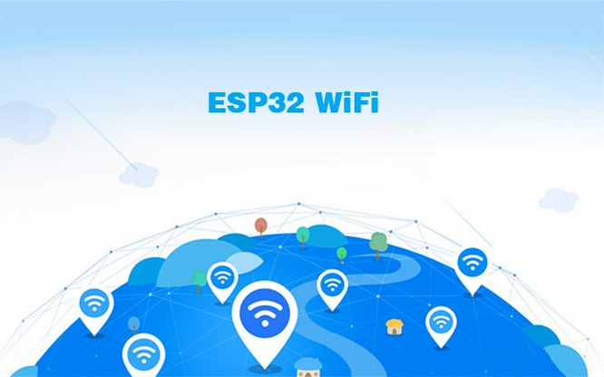
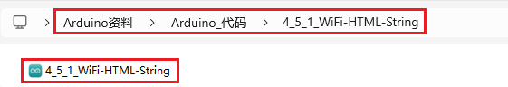
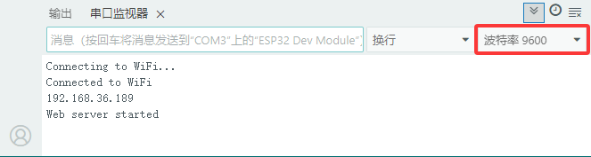
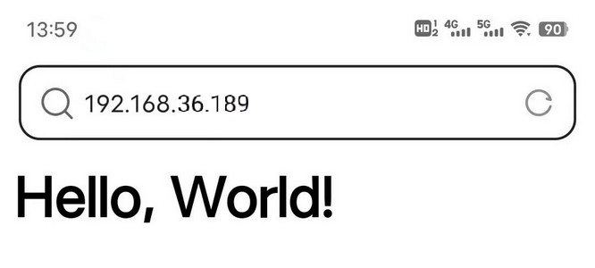

### 4.5.1 WIFI网页显示字符串

#### 4.5.1.1 简介

ESP32开发板它带有内置的Wi-Fi（2.4G）和Bluetooth（4.2）功能，可以轻松连接到Wi-Fi网络并与网络中的其他设备进行通信，您可以使用ESP32在浏览器中显示网页，此时网页显示 “Hello, World!”。



#### 4.5.1.2 工作原理

ESP32 最有用的功能之一是它不仅能够连接到现有的 WiFi 网络并充当 Web 服务器，还可以创建自己的网络，允许其他设备直接连接到它并访问网页。这是因为ESP32可以在三种模式下运行：Station（STA）模式、Soft Access Point（AP）模式和Station+AP共存模式。

- Station模式（作为WiFi设备主动连接路由器，也叫做WiFi Client）。
- AP模式（作为一个Access Point，让其他WiFi设备来连接）即WiFi热点。
- Station+AP共存模式（ESP32连接路由器的同时自身也是一个热点供其他WiFi设备来连接）

所有WiFi编程项目在使用WiFi前必须配置WiFi运行模式，否则无法使用WiFi。在本实验课程中，我们将学习使用ESP32的WiFi Station模式。

在 Station 模式下，ESP32 连接到现有的 WiFi 网络（由无线路由器创建的网络）。

当ESP32选择Station模式时，它作为一个WiFi客户端。它可以连接路由器网络，通过WiFi连接与路由器上的其他设备通信。如下图所示，移动通信设备(智能手机/平板)、PC和路由器已经连接，ESP32如果要与移动通信设备和PC通信，需要将移动通信设备、PC和路由器连接起来。


在 Station 模式下，ESP32 从其连接的无线路由器获取 IP 地址。使用此 IP 地址，它可以设置 Web 服务器并向现有 WiFi 网络上的所有连接设备提供网页。

⚠️ **注意：** 这样只能工作再一个局域网内，也就是说如果你的控制端与开发板连接的wifi不一致那么将无法进入Web服务器的控制页面。

更多wifi参考，请移步到乐鑫官方文档：[https://docs.espressif.com/projects/esp-idf/en/latest/esp32/api-reference/network/esp_wifi.html](https://docs.espressif.com/projects/esp-idf/en/latest/esp32/api-reference/network/esp_wifi.html)

乐鑫官网：[https://www.espressif.com.cn/en/home](https://www.espressif.com.cn/en/home)


#### 4.5.1.3 接线图


#### 4.5.1.4 实验代码

代码文件在`Arduino_代码`文件夹中，代码文件为`4_5_1_WiFi-HTML-String`，如下图所示：



鼠标双击`4_5_1_WiFi-HTML-String.ino`即可在Arduino IDE中打开。

⚠️ **特别提醒：** 打开代码文件后，需要修改ESP32开发板需要连接的WiFi名称与密码，您需要分别将 `REPLACE_WITH_YOUR_SSID` 和 `REPLACE_WITH_YOUR_PASSWORD` 替换为您自己的 Wi-Fi 名称和 WiFi 密码。WiFi名称和WiFi密码修改后才能上传代码，否则你的ESP32开发板将无法连接网络。

```c++
const char* ssid = "REPLACE_WITH_YOUR_SSID";  //输入你自己的WiFi名称
const char* password = "REPLACE_WITH_YOUR_PASSWORD"; //输入你自己的WiFi密码
```

⚠️ **注意：** 请确保代码中的WiFi名称和WiFi密码与连接到您的电脑、手机/平板、ESP32开发板和路由器的网络相同，它们必须在同一局域网（WiFi）内。

⚠️ **注意：** WiFi必须是2.4Ghz频率的，否则ESP32无法连接WiFi。

```c++
/*
 * 文件名 : WiFi-HTML-String
 * 功能   : WiFi网页显示字符串!
 * 编译IDE：ARDUINO 2.3.6
 * 作者   : https://www.keyesrobot.cn/
*/
#include <WiFi.h>
#include <WebServer.h>
#include <LiquidCrystal_I2C.h>

// 初始化LCD模块
LiquidCrystal_I2C lcd(0x27, 16, 2);

/*替换为您的网络凭据（输入您自己的WiFi名称和密码）*/
const char* ssid = "REPLACE_WITH_YOUR_SSID";  // 输入你自己的WiFi名称
const char* password = "REPLACE_WITH_YOUR_PASSWORD"; // 输入你自己的WiFi密码

WebServer server(80); //设置网页端口为80，可以直接输入IP地址进入网页，不需要输入端口号

// 网页初始化
void handleRoot() {
  // 用于向客户端发送HTTP响应,发送200表示成功
  server.send(200, "text/html", "<h1>Hello, World!</h1>");
}

void setup() {
  Serial.begin(9600);
  // wifi初始化
  WiFi.begin(ssid, password);
  // 寻找wifi，未连接成功，则一直处于连接中状态，while循环
  while (WiFi.status() != WL_CONNECTED) {
    delay(1000);
    Serial.println("Connecting to WiFi...");
  }

  // 连接成功，打印 IP 地址
  Serial.println("Connected to WiFi");
  Serial.println(WiFi.localIP());

  // 初始化LCD
  lcd.init();
  lcd.backlight();
  lcd.clear();
  lcd.setCursor(0, 0);
  lcd.print("IP:");
  lcd.setCursor(0, 1);
  lcd.print(WiFi.localIP());

  server.on("/", handleRoot);
  // 启动服务器
  server.begin();
  Serial.println("Web server started");
}

void loop() {
  server.handleClient();
}
```

#### 4.5.1.5 实验结果

按照接线图接好线，外接电源，选择好正确的开发板板型（ESP32 Dev Module）和 适当的串口端口（COMxx），然后单击按钮上传代码，外接电源。

⚠️ **注意：手机/平板和电脑一定要与ESP32开发板连接的是同一个WiFi，否则将无法进入控制页面，还有就是ESP32开发板在使用WiFi功能时功耗很大需要外接DC电源才能满足它的工作电力需求，如果达不到它的工作电力需求ESP32板将会一直复位导致代码无法正常运行。**

上传代码成功后，单击Arduino IDE右上角的打开串口监视器窗口并设置串口波特率为`9600`，串口监视器窗口便会显示连接成功后的IP地址(如果看不到可以按复位按键重新连接一次)，同时LCD显示屏也会显示IP地址。 




然后，您可以在手机端/平板端的浏览器输入串口监视器打印的 ESP32 IP地址 或 LCD显示屏显示的 ESP32 IP地址，使用浏览器打开ESP32的IP地址，并访问网页。在本例中，您可以在浏览器中输入你自己的**ESP32 IP地址**（**这里是以192.168.36.189为例，而你需要将IP地址：192.168.36.189 修改成你自己的 ESP32 IP地址**），在浏览器中打开ESP32的IP地址来查看 “Hello, World!” 网页。


⚠️ **注意：当电脑、手机/平板和ESP32开发板，连接到同一个网络(WiFi)时，可在手机端/平板端打开这个网页。此处是你自己ESP32的IP地址**。

在手机端/平板端的浏览器中打开对应的IP地址，即可查看到对应的字符串。



#### 4.5.1.6 代码说明

（1）. 在此代码中，我们使用ESP32的WebServer库来创建一个Web服务器。我们定义了一个 `handleRoot()` 函数，它将在根路径上处理请求，并向客户端发送“Hello, World!” 的HTML响应。然后，我们在 `setup()` 函数中设置服务器的根路径，并使用 `server.begin()` 函数启动Web服务器。

（2）. `server.send()` 是ESP32的WebServer库中的函数，用于向客户端发送HTTP响应。它需要指定三个参数：响应状态码、响应类型和响应内容。

  - 例如，以下代码使用 `server.send()` 函数将响应状态码200（表示成功），响应类型为“text/html”，响应内容为“Hello, World!”的HTML响应发送给客户端：

    ```c++
    void handleRoot() {
      server.send(200, "text/html", "<h1>Hello, World!</h1>");
    }
    ```

  - 在此代码中，`handleRoot()` 函数将在根路由上处理请求，并使用 `server.send()` 函数向客户端发送响应。第一个参数200是HTTP响应状态码，第二个参数"text/html"是响应类型，第三个参数是HTML响应内容。此响应将在客户端的浏览器中呈现为“Hello, World!”的标题。

  - 除了HTML响应，`server.send()` 函数还可以发送文本、JSON、XML和二进制数据等不同类型的响应。

（3）. `server.begin()` 是ESP32的WebServer库中的函数，用于在指定端口启动Web服务器。

  - 在使用ESP32的WebServer库时，您需要在 `setup()` 函数中调用 `server.begin()` 函数以启动Web服务器。例如：

    ```c++
    void setup() {
      // 其他代码...
      
      server.begin();
      
      // 其他代码...
    }
    ```

  - 在此代码中，`server.begin()` 函数将在默认端口80上启动Web服务器。如果您希望在不同的端口上启动Web服务器，则可以使用 `server.begin(port)` 函数指定端口号。例如，以下代码将在端口8080上启动Web服务器：

    ```c++
    void setup() {
      // 其他代码...
      
      server.begin(8080);
      
      // 其他代码...
    }
    ```

  - 一旦Web服务器已经启动，ESP32将监听来自客户端的HTTP请求，并在请求到达时调用相应的路由处理函数。在处理请求时，Web服务器将调用 `server.send()` 函数向客户端发送HTTP响应。要处理客户端请求，您需要在 `loop()` 函数中调用 `server.handleClient()` 函数，以便Web服务器可以在后台持续监听客户端请求。例如：

    ```c++
    void loop() {
      server.handleClient();
    }
    ```

    在此代码中，`server.handleClient()` 函数将处理客户端请求，如果有请求到达，则将调用相应的路由处理函数，并向客户端发送HTTP响应。由于此函数在 `loop()` 函数中调用，因此ESP32可以在后台持续监听客户端请求，并实现无限循环处理请求的功能。

（4）. 初始化LCD，在LCD显示屏上显示IP地址。

```c++
  lcd.init();
  lcd.backlight();
  lcd.clear();
  lcd.setCursor(0, 0);
  lcd.print("IP:");
  lcd.setCursor(0, 1);
  lcd.print(WiFi.localIP());
```
