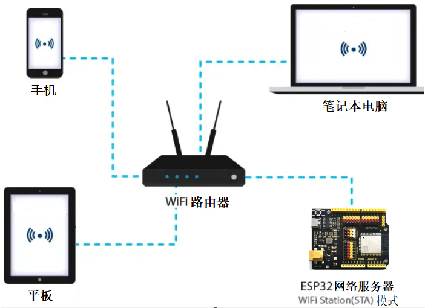
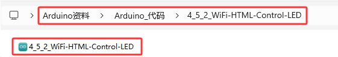

### 4.5.2 WiFi控制LED

#### 4.5.2.1 简介

本教程将为您详细介绍如何使用ESP32微控制器通过局域网WiFi控制LED灯。教程内容包括ESP32的WiFi功能配置、电路连接方法以及如何编写代码实现远程控制。您将学习如何设置ESP32为WiFi接入点（AP）或连接到现有WiFi网络，并通过网页界面发送控制指令来开关LED灯。无论您是物联网初学者还是有经验的开发者，本教程都将帮助您掌握ESP32的WiFi控制功能，为您的项目增添灵活的远程控制能力。

#### 4.5.2.2 工作原理

ESP32 最有用的功能之一是它不仅能够连接到现有的 WiFi 网络并充当 Web 服务器，还可以创建自己的网络，允许其他设备直接连接到它并访问网页。这是因为ESP32可以在三种模式下运行：Station（STA）模式、Soft Access Point（AP）模式和Station+AP共存模式。

- Station模式（作为WiFi设备主动连接路由器，也叫做WiFi Client）。
- AP模式（作为一个Access Point，让其他WiFi设备来连接）即WiFi热点。
- Station+AP共存模式（ESP32连接路由器的同时自身也是一个热点供其他WiFi设备来连接）。

所有WiFi编程项目在使用WiFi前必须配置WiFi运行模式，否则无法使用WiFi。在本实验课程中，我们将学习使用ESP32的WiFi Station模式。

在 Station 模式下，ESP32 连接到现有的 WiFi 网络（由无线路由器创建的网络）。

当ESP32选择Station模式时，它作为一个WiFi客户端。它可以连接路由器网络，通过WiFi连接与路由器上的其他设备通信。如下图所示，移动通信设备(智能手机/平板)、PC和路由器已经连接，ESP32如果要与移动通信设备和PC通信，需要将移动通信设备、PC和路由器连接起来。



在 Station 模式下，ESP32 从其连接的无线路由器获取 IP 地址。使用此 IP 地址，它可以设置 Web 服务器并向现有 WiFi 网络上的所有连接设备提供网页。

⚠️ **注意：** 这样只能工作在一个局域网内，也就是说如果你的控制端与开发板连接的wifi不一致那么将无法进入Web服务器的控制页面。


#### 4.5.2.3 接线图

- **LED模块的S引脚连接到io27**

⚠️ **特别注意：智慧农场已经组装好了，这里不需要把LED模块拆下来又重新组装和接线，这里再次提供接线图，是为了方便您编写代码！**


#### 4.5.2.4 实验代码

代码文件在`Arduino_代码`文件夹中，代码文件为`4_5_2_WiFi-HTML-Control-LED`，如下图所示：



鼠标双击`4_5_2_WiFi-HTML-Control-LED.ino`即可在Arduino IDE中打开。

⚠️ **特别提醒：** 打开代码文件后，需要修改ESP32开发板需要连接的WiFi名称与密码，您需要分别将 `REPLACE_WITH_YOUR_SSID` 和 `REPLACE_WITH_YOUR_PASSWORD` 替换为您自己的 Wi-Fi 名称和 WiFi 密码。WiFi名称和WiFi密码修改后才能上传代码，否则你的ESP32开发板将无法连接网络。

```c++
const char* ssid = "REPLACE_WITH_YOUR_SSID";  //输入你自己的WiFi的名称
const char* password = "REPLACE_WITH_YOUR_PASSWORD"; //输入你自己的WiFi密码
```

⚠️ **注意：** 请确保代码中的WiFi名称和WiFi密码与连接到您的计算机、手机/平板电脑、ESP32开发板和路由器的网络相同，它们必须在同一局域网（WiFi）内。

⚠️ **注意：** WiFi必须是2.4Ghz频率的，否则ESP32无法连接WiFi。

```c++
/*  
 * 名称   : WiFi-HTML-Control-LED
 * 功能   : 使用局域网wifi无线控制LED
 * 编译IDE：ARDUINO 2.3.6
 * 作者   : https://www.keyesrobot.cn/ 
*/
#include <WiFi.h>       // 引入WiFi库，控制ESP32的WiFi连接功能
#include <WebServer.h>  // 引入WebServer库，创建HTTP服务器
#include <LiquidCrystal_I2C.h> // 引入LiquidCrystal_I2C库

// 初始化LCD模块
LiquidCrystal_I2C lcd(0x27, 16, 2);

/*替换为您的网络凭据（输入您自己的WiFi名称和密码）*/
const char* ssid = "REPLACE_WITH_YOUR_SSID";  // 输入你自己的WiFi名称
const char* password = "REPLACE_WITH_YOUR_PASSWORD"; // 输入你自己的WiFi密码

WebServer server(80);  // 创建一个Web服务器对象，监听80端口

uint8_t LED_Pin = 27;    // 绿色LED连接到GPIO17
bool LED_State = false;  // 绿色LED的状态，初始为关闭

void setup() {
  Serial.begin(9600);        // 初始化串口通信，波特率9600
  delay(100);                // 延时100毫秒
  pinMode(LED_Pin, OUTPUT);  // 设置GPIO27为输出模式
 
  Serial.println("Connecting to ");
  Serial.println(ssid);  // 打印正在连接的Wi-Fi名称

  // 连接到Wi-Fi网络
  WiFi.begin(ssid, password);

  // 检查Wi-Fi是否连接成功
  while (WiFi.status() != WL_CONNECTED) {
    delay(1000);
    Serial.print(".");  // 每隔1秒打印一个点，表示正在连接
  }
  Serial.println("");
  delay(500);
  Serial.println("WiFi connected..!");  // Wi-Fi连接成功
  Serial.print("Got IP: ");
  Serial.println(WiFi.localIP());  // 打印分配到的IP地址

  // 初始化LCD
  lcd.init();
  lcd.backlight();
  lcd.clear();
  lcd.setCursor(0, 0);
  lcd.print("IP:");
  lcd.setCursor(0, 1);
  lcd.print(WiFi.localIP());

  // 设置不同URL路径的处理函数
  server.on("/", handle_OnConnect);       // 根路径，初始化页面
  server.on("/LED_ON", handle_LED_ON);    // 红灯打开
  server.on("/LED_OFF", handle_LED_OFF);  // 红灯关闭
  server.onNotFound(handle_NotFound);     // 处理未找到的路径

  server.begin();                         // 启动Web服务器
  Serial.println("HTTP server started");  // 打印服务器启动信息
}

void loop() {
  server.handleClient();  // 处理客户端请求
  if (LED_State) {
    digitalWrite(LED_Pin, HIGH);  // 如果LED状态为开，则输出高电平点亮LED
  } else {
    digitalWrite(LED_Pin, LOW);  // 否则输出低电平熄灭LED
  }
}

// 处理根路径请求，显示初始页面
void handle_OnConnect() {
  LED_State = false;  // 初始时LED关闭
  Serial.println("GPIO27 Status: OFF"); // 打印LED状态
  server.send(200, "text/html", SendHTML(LED_State));  // 返回初始HTML页面
}

// 处理LED灯打开请求
void handle_LED_ON() {
  LED_State = true;   // 设置红色LED状态为开
  Serial.println("GPIO27 Status: ON");  // 打印LED状态
  server.send(200, "text/html", SendHTML(LED_State));  // 返回更新后的HTML页面
}

// 处理绿灯关闭请求
void handle_LED_OFF() {
  LED_State = false;   // 设置红色LED状态为关
  Serial.println("GPIO27 Status: OFF"); // 打印LED状态
  server.send(200, "text/html", SendHTML(LED_State));  // 返回更新后的HTML页面
}

// 处理未找到的路径
void handle_NotFound() {
  server.send(404, "text/plain", "Not found");  // 返回404错误
}

// 生成HTML页面，用来显示LED状态和控制按钮
String SendHTML(uint8_t LEDState) {
  String ptr = "<!DOCTYPE html> <html>\n";
  ptr += "<head><meta name=\"viewport\" content=\"width=device-width, initial-scale=1.0, user-scalable=no\">\n";
  ptr += "<title>LED Control</title>\n";
  ptr += "<style>html {font-family: Helvetica; display: inline-block; margin: 0px auto; text-align: center;}\n";
  ptr += "body{margin-top: 50px;} h1 {color: #444444;margin: 50px auto 30px;} h3 {color: #444444;margin-bottom: 50px;}\n";
  ptr += ".button {display: block;width: 80px;background-color: #3498db;border: none;color: white;padding: 13px 30px;text-decoration: none;font-size: 25px;margin: 0px auto 35px;cursor: pointer;border-radius: 4px;}\n";
  ptr += ".button-on {background-color: #3498db;}\n";
  ptr += ".button-on:active {background-color: #2980b9;}\n";
  ptr += ".button-off {background-color: #34495e;}\n";
  ptr += ".button-off:active {background-color: #2c3e50;}\n";
  ptr += "p {font-size: 14px;color: #888;margin-bottom: 10px;}\n";
  ptr += "</style>\n";
  ptr += "</head>\n";
  ptr += "<body>\n";
  ptr += "<h1>ESP32 Web Server</h1>\n";
  ptr += "<h3>Using Station(STA) Mode</h3>\n";

  // 根据LED状态生成HTML按钮
  if (LEDState) {
    ptr += "<p>LED State: ON</p><a class=\"button button-off\" href=\"/LED_OFF\">OFF</a>\n";
  } else {
    ptr += "<p>LED State: OFF</p><a class=\"button button-on\" href=\"/LED_ON\">ON</a>\n";
  }

  ptr += "</body>\n";
  ptr += "</html>\n";
  return ptr;  // 返回生成的HTML页面
}
```

#### 4.5.2.5 实验结果

按照接线图接好线，外接电源，选择好正确的开发板板型（ESP32 Dev Module）和 适当的串口端口（COMxx），然后单击按钮上传代码，外接电源。

⚠️ **注意：手机/平板和电脑一定要与ESP32开发板连接的是同一个WiFi，否则将无法进入控制页面，还有就是ESP32开发板在使用WiFi功能时功耗很大需要外接DC电源才能满足它的工作电力需求，如果达不到它的工作电力需求ESP32板将会一直复位导致代码无法正常运行。**

上传代码成功后，单击Arduino IDE右上角的打开串口监视器窗口并设置串口波特率为`9600`，串口监视器窗口便会显示连接成功后的IP地址(如果看不到可以按复位按键重新连接一次)，同时LCD显示屏也会显示IP地址。 


然后，您可以在手机端/平板端的浏览器输入串口监视器打印的 ESP32 IP地址 或 LCD显示屏显示的 ESP32 IP地址，使用浏览器打开ESP32的IP地址，并访问网页。在本例中，您可以在浏览器中输入你自己的**ESP32 IP地址**（**这里是以192.168.36.189为例，而你需要将IP地址：192.168.36.189 修改成你自己的 ESP32 IP地址**），在浏览器中打开ESP32的IP地址来查看控制LED亮灭的网页。


⚠️ **注意：当电脑、手机/平板和ESP32开发板，连接到同一个网络(WiFi)时，可在手机端/平板端打开这个网页。此处是你自己ESP32的IP地址**。

在手机端/平板端的浏览器中打开对应的IP地址，即可控制LED等功能。


#### 4.5.2.6 代码解释

(1). 首先包括 `WiFi.h` 库。该库包含我们用于连接到网络的 ESP32 特定方法；`WebServer.h` 库，也包含一些方法，这些方法将帮助我们配置服务器和处理传入的HTTP请求。

```c++
#include <WiFi.h>
#include <WebServer.h>
```

(2). 由于我们将ESP32 Web服务器配置为Station模式，它将创建自己的WiFi网络。因此，我们需要设置SSID和Password。

```c++
/*替换为您的网络凭据（输入您自己的WiFi名称和密码）*/
const char* ssid = "REPLACE_WITH_YOUR_SSID";  // 输入你自己的WiFi名称
const char* password = "REPLACE_WITH_YOUR_PASSWORD"; // 输入你自己的WiFi密码
```

(3). 创建 `WebServer` 库的对象，以便可以访问它的函数。此对象的构造函数接受服务器将侦听的端口作为参数。由于HTTP默认使用端口80，因此将使用此值。这允许我们连接到服务器，而不需要在URL中指定端口。

```c++
WebServer server(80);  // 创建一个Web服务器对象，监听80端口
```

(4). 声明led连接的ESP32的GPIO引脚，以及它们的初始状态。

```c++
uint8_t LED_Pin = 27;    // 绿色LED连接到GPIO17
bool LED_State = false;  // 绿色LED的状态，初始为关闭
```

(5). 在 `setup()` 函数中，我们将ESP32 Web服务器配置为Station模式。首先，我们建立一个用于调试串行连接的串口波特率，并将GPIO引脚配置为OUTPUT。

```c++
  Serial.begin(9600);         // 初始化串口通信，波特率9600
  delay(100);                // 延时100毫秒
  pinMode(LED_Pin, OUTPUT);  // 设置GPIO27为输出模式
```
(6). 串口打印正在连接的Wi-Fi名称，并且使用 `WiFi.begin()` 函数加入一个现有的网络。

```c++
  Serial.println("Connecting to ");
  Serial.println(ssid);  // 打印正在连接的Wi-Fi名称

  // 连接到Wi-Fi网络
  WiFi.begin(ssid, password);

```

(7). 当ESP32尝试连接到网络时，我们可以使用 `WiFi.status()` 函数来检查连接状态。

```c++
  // 检查Wi-Fi是否连接成功
  while (WiFi.status() != WL_CONNECTED) {
    delay(1000);
    Serial.print(".");  // 每隔1秒打印一个点，表示正在连接
  }
```

(8). 一旦连接到网络，`WiFi.localIP()` 函数用于打印ESP32的IP地址.

```c++
  Serial.println("");
  delay(500);
  Serial.println("WiFi connected..!");  // Wi-Fi连接成功
  Serial.print("Got IP: ");
  Serial.println(WiFi.localIP());  // 打印分配到的IP地址
```

(9). 为了处理传入的HTTP请求，我们必须指定在访问特定URL时应该执行哪些代码。为此，我们使用 `.on()` 方法。该方法接受两个参数：一个相对URL路径和访问该URL时要执行函数的名称。

例如，下面代码片段的第一行表明，当服务器接收到根(/)路径上的HTTP请求时，它将调用 `handle_OnConnect()` 函数。重要的是要注意指定的URL是一个相对路径。类似地，我们必须再指定URL来处理LED的两种状态。

```c++
  // 设置不同URL路径的处理函数
  server.on("/", handle_OnConnect);            // 根路径，初始化页面
  server.on("/LED_ON", handle_LED_ON);        // 红灯打开
  server.on("/LED_OFF", handle_LED_OFF);      // 红灯关闭
```

(10). 如果客户端请求的URL没有使用 `server.on()` 指定，我们还没有指定服务器应该提供什么服务。它应该给出404错误（Page Not Found）作为响应。为此，我们使用 `server.onNotFound()` 方法。

```c++
  server.onNotFound(handle_NotFound);        // 处理未找到的路径
```

(11). 为了启动服务器，我们调用服务器对象的 `begin()` 方法。

```c++
  server.begin();                         // 启动Web服务器
  Serial.println("HTTP server started");  // 打印服务器启动信息
```

(12). 实际传入的HTTP请求在 `loop()` 函数中处理。为此，我们使用服务器对象的 `handleClient()` 方法。我们还根据请求改变led的状态。

```c++
void loop() {
  server.handleClient();  // 处理客户端请求
  if (LED_State) {
    digitalWrite(LED_Pin, HIGH);  // 如果LED状态为开，则输出高电平点亮LED
  } else {
    digitalWrite(LED_Pin, LOW);  // 否则输出低电平熄灭LED
  }
}
```

(13). 我们必须编写 `handle_OnConnect()` 函数，之前使用 `server.on` 将其附加到根（/）URL。我们通过将led的状态设置为false（led的初始状态）并将其打印在串行监视器上开始此功能。使用send方法来响应HTTP请求。尽管可以使用许多不同的参数调用该方法，但最简单的形式需要HTTP响应代码、内容类型和内容。传递给send方法的第一个参数是代码200（HTTP状态码之一），它对应于OK响应。然后将内容类型指定为 “**text/html**”，最后传递 `SendHTML()` 自定义函数，该函数生成带有LED状态的动态html页面。

```c++
// 处理根路径请求，显示初始页面
void handle_OnConnect() {
  LED_State = false;                                    // 初始时LED关闭
  Serial.println("GPIO27 Status: OFF");                // 打印LED状态
  server.send(200, "text/html", SendHTML(LED_State));  // 返回初始HTML页面
}
```

(14). 编写了三个函数来处理LED开/关请求和404错误页面。

```c++
// 处理LED灯打开请求
void handle_LED_ON() {
  LED_State = true;   // 设置红色LED状态为开
  Serial.println("GPIO27 Status: ON");  // 打印LED状态
  server.send(200, "text/html", SendHTML(LED_State));  // 返回更新后的HTML页面
}

// 处理绿灯关闭请求
void handle_LED_OFF() {
  LED_State = false;      // 设置红色LED状态为关
  Serial.println("GPIO27 Status: OFF");   // 打印LED状态
  server.send(200, "text/html", SendHTML(LED_State));  // 返回更新后的HTML页面
}

// 处理未找到的路径
void handle_NotFound() {
  server.send(404, "text/plain", "Not found");  // 返回404错误
}
```

(15). 显示HTML网页，当ESP32 Web服务器收到来自Web客户端的请求时，`SendHTML()` 函数就会生成一个Web页面。它只是将HTML代码连接到一个长字符串中，然后返回到我们前面讨论过的 `server.send()` 函数。该函数使用led的状态作为参数来动态生成HTML内容。你应该发送的第一个文本总是 **<!DOCTYPE> declaration**，这表明我们正在发送HTML代码。

```c++
// 生成HTML页面，用来显示LED状态和控制按钮
String SendHTML(uint8_t LEDState) {
  String ptr = "<!DOCTYPE html> <html>\n";
```

(16). **<meta> viewport element** 使网页响应，确保它在所有设备上看起来都很好。标题标签决定了页面的标题。

```c++
  ptr += "<head><meta name=\"viewport\" content=\"width=device-width, initial-scale=1.0, user-scalable=no\">\n";
  ptr += "<title>LED Control</title>\n";
```


(17). 设计网页样式，接下来我们使用 CSS 设计按钮和网页的整体外观。我们选择了Helvetica字体，并将显示的内容定义为行内块，居中对齐。

```c++
  ptr += "<style>html {font-family: Helvetica; display: inline-block; margin: 0px auto; text-align: center;}\n";
```

(18). 接下来的代码设置主体、H1、H3和p标记周围的颜色、字体和边距

```c++
  ptr += "body{margin-top: 50px;} h1 {color: #444444;margin: 50px auto 30px;} h3 {color: #444444;margin-bottom: 50px;}\n";
```

(14). 这些按钮还可以使用颜色、大小、边距等属性进行样式化。**:active selector** 在按钮被点击时改变按钮的外观。

```c++
  ptr += ".button {display: block;width: 80px;background-color: #3498db;border: none;color: white;padding: 13px 30px;text-decoration: none;font-size: 25px;margin: 0px auto 35px;cursor: pointer;border-radius: 4px;}\n";
  ptr += ".button-on {background-color: #3498db;}\n";
  ptr += ".button-on:active {background-color: #2980b9;}\n";
  ptr += ".button-off {background-color: #34495e;}\n";
  ptr += ".button-off:active {background-color: #2c3e50;}\n";
```

(15). 设置网页的标题。您可以将此文本更改为适合您的应用程序的任何内容。

```c++
  ptr +="<h1>ESP32 Web Server</h1>\n";
    ptr +="<h3>Using Station(STA) Mode</h3>\n";
```

(16). 显示按钮和相应的状态，if语句用于动态更新按钮和led的状态。

```c++
 if (LEDState) {
    ptr += "<p>LED State: ON</p><a class=\"button button-off\" href=\"/LED_OFF\">OFF</a>\n";
  } else {
    ptr += "<p>LED State: OFF</p><a class=\"button button-on\" href=\"/LED_ON\">ON</a>\n";
  }
`
