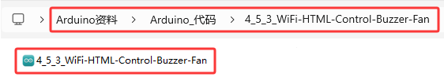
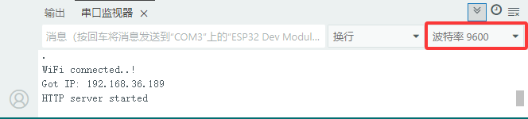

### 4.5.3 WiFi控制蜂鸣器和风扇

#### 4.5.3.1 简介

本教程将为您详细介绍如何使用ESP32微控制器通过局域网WiFi控制蜂鸣器和风扇。教程内容包括ESP32的WiFi功能配置、电路连接方法以及如何编写代码实现远程控制。您将学习如何设置ESP32为WiFi接入点（AP）或连接到现有WiFi网络，并通过网页界面发送控制指令来开关蜂鸣器和风扇。无论您是物联网初学者还是有经验的开发者，本教程都将帮助您掌握ESP32的WiFi控制功能，为您的项目增添灵活的远程控制能力。

#### 4.5.3.2 工作原理

让我们假设ESP32的lP地址是192.168.XX.XX。以下是它的工作原理：

当你在Web浏览器的搜索框中输入192.168.XX.XX，搜索并且跳转网页。浏览器向Esp32发送请求，ESP32响应一个网页，其中包含用于控制蜂鸣器的打开/关闭按钮和风扇的打开/关闭按钮。

当你点击网页上(Buzzer State OFF)的 “ON” 按钮时，蜂鸣器鸣叫并响应控制网页；当你点击网页上(Buzzer State ON)的 “OFF” 按钮时，蜂鸣器不响并响应控制网页。

同样，当你点击网页上(Motor State OFF)的 “ON” 按钮时，风扇转动并响应控制网页；当你点击网页上(Motor State ON)的 “OFF” 按钮时，风扇不转并响应控制网页。


#### 4.5.3.3 接线图

- **无源蜂鸣器模块的S引脚连接到io16**

- **电机模块的IN-引脚连接到io18，IN+引脚连接到io19**

⚠️ **特别注意：智慧农场已经组装好了，这里不需要把无源蜂鸣器模块和电机模块拆下来又重新组装和接线，这里再次提供接线图，是为了方便您编写代码！**


#### 4.5.3.4 实验代码

代码文件在`Arduino_代码`文件夹中，代码文件为`4_5_3_WiFi-HTML-Control-Buzzer-Fan`，如下图所示：



鼠标双击`4_5_3_WiFi-HTML-Control-Buzzer-Fan.ino`即可在Arduino IDE中打开。

⚠️ **特别提醒：** 打开代码文件后，需要修改ESP32开发板需要连接的WiFi名称与密码，您需要分别将 `REPLACE_WITH_YOUR_SSID` 和 `REPLACE_WITH_YOUR_PASSWORD` 替换为您自己的 Wi-Fi 名称和 WiFi 密码。WiFi名称和WiFi密码修改后才能上传代码，否则你的ESP32开发板将无法连接网络。

```c++
const char* ssid = "REPLACE_WITH_YOUR_SSID";  //输入你自己的WiFi的名称
const char* password = "REPLACE_WITH_YOUR_PASSWORD"; //输入你自己的WiFi密码
```

⚠️ **注意：** 请确保代码中的WiFi名称和WiFi密码与连接到您的电脑、手机/平板、ESP32开发板和路由器的网络相同，它们必须在同一局域网（WiFi）内。

⚠️ **注意：** WiFi必须是2.4Ghz频率的，否则ESP32无法连接WiFi。

```c++
/*  
 * 名称   : WiFi-HTML-Control-Buzzer-Fan
 * 功能   : 使用局域网wifi无线控制蜂鸣器和风扇
 * 编译IDE：ARDUINO 2.3.6
 * 作者   : https://www.keyesrobot.cn/ 
*/
#include <WiFi.h>       // 引入WiFi库，控制ESP32的WiFi连接功能
#include <WebServer.h>  // 引入WebServer库，创建HTTP服务器
#include <LiquidCrystal_I2C.h> // 引入LiquidCrystal_I2C库

//初始化LCD模块
LiquidCrystal_I2C lcd(0x27, 16, 2);

/*替换为您的网络凭据（输入您自己的WiFi名称和密码）*/
const char* ssid = "REPLACE_WITH_YOUR_SSID";  // 输入你自己的WiFi名称
const char* password = "REPLACE_WITH_YOUR_PASSWORD"; // 输入你自己的WiFi密码

WebServer server(80);  // 创建一个Web服务器对象，监听80端口

uint8_t buzzer_Pin = 16;    // 蜂鸣器连接到GPIO16
bool Buzzer_State = false;  // 蜂鸣器的状态，初始为关闭

uint8_t motor_Pin1 = 19;    // 电机IN+引脚连接到GPIO19
uint8_t motor_Pin2 = 18;    // 电机IN-引脚连接到GPIO18
bool Motor_State = false;  // 电机的状态，初始为关闭

void setup() {
  Serial.begin(9600);           // 初始化串口通信，波特率9600
  delay(100);                   // 延时100毫秒
  pinMode(buzzer_Pin, OUTPUT);  // 设置GPIO16为输出模式
  pinMode(motor_Pin1, OUTPUT);  // 设置GPIO18为输出模式
  pinMode(motor_Pin2, OUTPUT);  // 设置GPIO19为输出模式

  Serial.println("Connecting to ");
  Serial.println(ssid);  // 打印正在连接的Wi-Fi名称

  // 连接到Wi-Fi网络
  WiFi.begin(ssid, password);

  // 检查Wi-Fi是否连接成功
  while (WiFi.status() != WL_CONNECTED) {
    delay(1000);
    Serial.print(".");  // 每隔1秒打印一个点，表示正在连接
  }
  Serial.println("");
  delay(500);
  Serial.println("WiFi connected..!");  // Wi-Fi连接成功
  Serial.print("Got IP: ");
  Serial.println(WiFi.localIP());  // 打印分配到的IP地址

  // 初始化LCD
  lcd.init();
  lcd.backlight();
  lcd.clear();
  lcd.setCursor(0, 0);
  lcd.print("IP:");
  lcd.setCursor(0, 1);
  lcd.print(WiFi.localIP());

  // 设置不同URL路径的处理函数
  server.on("/", handle_OnConnect);            // 根路径，初始化页面
  server.on("/Buzzer_ON", handle_Buzzer_ON);   // 蜂鸣器打开
  server.on("/Buzzer_OFF", handle_Buzzer_OFF); // 蜂鸣器关闭
  server.on("/Motor_ON", handle_Motor_ON);     // 风扇打开
  server.on("/Motor_OFF", handle_Motor_OFF);   // 风扇关闭
  server.onNotFound(handle_NotFound);         // 处理未找到的路径

  server.begin();                         // 启动Web服务器
  Serial.println("HTTP server started");  // 打印服务器启动信息
}

void loop() {
  server.handleClient();  // 处理客户端请求
  if (Buzzer_State) {
    digitalWrite(buzzer_Pin, HIGH);  // 如果蜂鸣器状态为开，则输出高电平，蜂鸣器鸣叫
    delay(1);
    digitalWrite(buzzer_Pin, LOW);  // 否则输出低电平关闭蜂鸣器
    delay(1);
  } else {
    digitalWrite(buzzer_Pin, LOW);  // 否则输出低电平关闭蜂鸣器
  }
  if (Motor_State) {
    // 如果风扇状态为开，则打开风扇
    analogWrite(motor_Pin1, 70);  
    analogWrite(motor_Pin2, 0);
  } else {
    // 否则关闭风扇
    analogWrite(motor_Pin1, 0);
    analogWrite(motor_Pin2, 0); 
  }
}

// 处理根路径请求，显示初始页面
void handle_OnConnect() {
  Buzzer_State = false;  // 初始时关闭蜂鸣器
  Motor_State = false;   // 初始时关闭风扇
  Serial.println("GPIO16 Status: OFF | GPIO18 Status: OFF | GPIO19 Status: OFF");  // 打印蜂鸣器和风扇状态
  server.send(200, "text/html", SendHTML(Buzzer_State, Motor_State));  // 返回初始HTML页面
}

// 处理蜂鸣器打开请求
void handle_Buzzer_ON() {
  Buzzer_State = true;    // 设置蜂鸣器状态为开
  Serial.println("GPIO16 Status: ON");   // 打印蜂鸣器状态
  server.send(200, "text/html", SendHTML(Buzzer_State, Motor_State));  // 返回更新后的HTML页面
}

// 处理蜂鸣器关闭请求
void handle_Buzzer_OFF() {
  Buzzer_State = LOW;     // 设置蜂鸣器状态为关
  Serial.println("GPIO16 Status: OFF");  // 打印蜂鸣器状态
  server.send(200, "text/html", SendHTML(Buzzer_State, Motor_State));  // 返回更新后的HTML页面
}

// 处理风扇打开请求
void handle_Motor_ON() {
  Motor_State = true;   // 设置风扇状态为开
  Serial.println("GPIO18 Status: ON | GPIO19 Status: ON");  // 打印风扇状态
  server.send(200, "text/html", SendHTML(Buzzer_State, Motor_State));  // 返回更新后的HTML页面
}

// 处理风扇关闭请求
void handle_Motor_OFF() {
  Motor_State = false;  // 设置风扇状态为关
  Serial.println("GPIO18 Status: OFF | GPIO19 Status: OFF"); // 打印风扇状态
  server.send(200, "text/html", SendHTML(Buzzer_State, Motor_State));  // 返回更新后的HTML页面
}

// 处理未找到的路径
void handle_NotFound() {
  server.send(404, "text/plain", "Not found");  // 返回404错误
}

// 生成HTML页面，用来显示蜂鸣器与风扇状态和控制按钮
String SendHTML(uint8_t BuzzerState, uint8_t MotorState) {
  String ptr = "<!DOCTYPE html> <html>\n";
  ptr += "<head><meta name=\"viewport\" content=\"width=device-width, initial-scale=1.0, user-scalable=no\">\n";
  ptr += "<title>Buzzer-Motor Control</title>\n";
  ptr += "<style>html { font-family: Helvetica; display: inline-block; margin: 0px auto; text-align: center;}\n";
  ptr += "body{margin-top: 50px;} h1 {color: #444444;margin: 50px auto 30px;} h3 {color: #444444;margin-bottom: 50px;}\n";
  ptr += ".button {display: block;width: 80px;background-color: #3498db;border: none;color: white;padding: 13px 30px;text-decoration: none;font-size: 25px;margin: 0px auto 35px;cursor: pointer;border-radius: 4px;}\n";
  ptr += ".button-on {background-color: #3498db;}\n";
  ptr += ".button-on:active {background-color: #2980b9;}\n";
  ptr += ".button-off {background-color: #34495e;}\n";
  ptr += ".button-off:active {background-color: #2c3e50;}\n";
  ptr += "p {font-size: 14px;color: #888;margin-bottom: 10px;}\n";
  ptr += "</style>\n";
  ptr += "</head>\n";
  ptr += "<body>\n";
  ptr += "<h1>ESP32 Web Server</h1>\n";
  ptr += "<h3>Using Station(STA) Mode</h3>\n";

  // 根据蜂鸣器状态生成HTML按钮
  if (BuzzerState) {
    ptr += "<p>Buzzer State: ON</p><a class=\"button button-off\" href=\"/Buzzer_OFF\">OFF</a>\n";
  } else {
    ptr += "<p>Buzzer State: OFF</p><a class=\"button button-on\" href=\"/Buzzer_ON\">ON</a>\n";
  }

  // 根据风扇状态生成HTML按钮
  if (MotorState) {
    ptr += "<p>Motor State: ON</p><a class=\"button button-off\" href=\"/Motor_OFF\">OFF</a>\n";
  } else {
    ptr += "<p>Motor State: OFF</p><a class=\"button button-on\" href=\"/Motor_ON\">ON</a>\n";
  }

  ptr += "</body>\n";
  ptr += "</html>\n";
  return ptr;  // 返回生成的HTML页面
}
```

#### 4.5.3.5 实验结果

按照接线图接好线，外接电源，选择好正确的开发板板型（ESP32 Dev Module）和 适当的串口端口（COMxx），然后单击按钮上传代码，外接电源。

⚠️ **注意：手机/平板和电脑一定要与ESP32开发板连接的是同一个WiFi，否则将无法进入控制页面，还有就是ESP32开发板在使用WiFi功能时功耗很大需要外接DC电源才能满足它的工作电力需求，如果达不到它的工作电力需求ESP32板将会一直复位导致代码无法正常运行。**

上传代码成功后，单击Arduino IDE右上角的打开串口监视器窗口并设置串口波特率为`9600`，串口监视器窗口便会显示连接成功后的IP地址(如果看不到可以按复位按键重新连接一次)，同时LCD显示屏也会显示IP地址。 




然后，您可以在手机端/平板端的浏览器输入串口监视器打印的 ESP32 IP地址 或 LCD显示屏显示的 ESP32 IP地址，使用浏览器打开ESP32的IP地址，并访问网页。在本例中，您可以在浏览器中输入你自己的**ESP32 IP地址**（**这里是以192.168.36.189为例，而你需要将IP地址：192.168.36.189 修改成你自己的 ESP32 IP地址**），在浏览器中打开ESP32的IP地址来查看控制蜂鸣器和风扇的网页。


⚠️ **注意：当电脑、手机/平板和ESP32开发板，连接到同一个网络(WiFi)时，可在手机端/平板端打开这个网页。此处是你自己ESP32的IP地址**。

在手机端/平板端的浏览器中打开对应的IP地址，即可控制蜂鸣器和风扇等功能。

