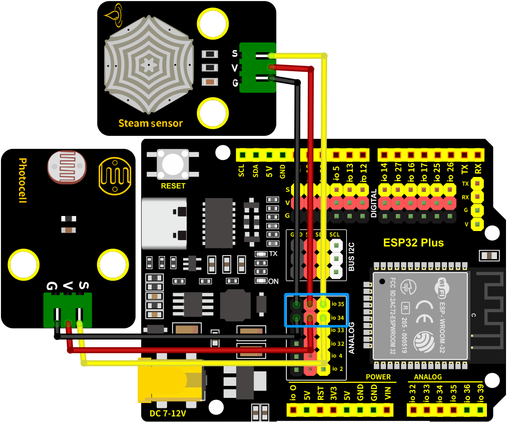
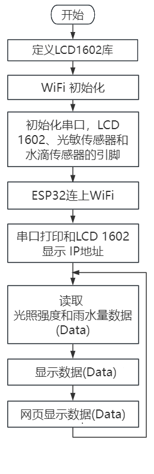
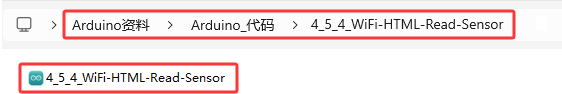

### 4.5.4 WiFi读取传感器

#### 4.5.4.1 简介

本教程将为您详细介绍如何使用ESP32微控制器通过局域网WiFi读取光敏传感器和水滴传感器的数据，并在网页上实时显示。您将学习如何设置ESP32为WiFi接入点（AP）或连接到现有WiFi网络，并通过网页界面实时显示光照强度值和水量值。此外，教程还涵盖了网络通信协议、数据可视化和系统优化的基本方法。无论您是物联网初学者还是有经验的开发者，本教程都将帮助您掌握ESP32的WiFi数据采集和网页显示功能，为您的项目增添实时的环境监测能力。

#### 4.5.4.2 工作原理

- ESP32 通过 `WiFi.begin()` 连接到局域网。

- 获取本地 IP 地址，用于客户端访问。

- ESP32 使用 `WiFiServer` 创建一个 HTTP 服务器。

- 当客户端（如浏览器）访问 ESP32 的 IP 地址时，ESP32 会生成一个 HTML 页面，并将传感器数据嵌入到页面中。

- 网页通过 HTML 和 CSS 显示传感器数据。

- 使用 JavaScript 定时刷新页面或通过 AJAX 请求实时更新数据。

#### 4.5.4.3 接线图

- **光敏传感器的S引脚连接到io34**

- **水滴传感器的S引脚连接到io35**

⚠️ **特别注意：智慧农场已经组装好了，这里不需要把光敏传感器和水滴传感器拆下来又重新组装和接线，这里再次提供接线图，是为了方便您编写代码！**



#### 4.5.4.4 代码流程图



#### 4.5.4.5 实验代码

代码文件在`Arduino_代码`文件夹中，代码文件为`4_5_4_WiFi-HTML-Read-Sensor`，如下图所示：



鼠标双击`4_5_4_WiFi-HTML-Read-Sensor.ino`即可在Arduino IDE中打开。

⚠️ **特别提醒：** 打开代码文件后，需要修改ESP32开发板需要连接的WiFi名称与密码，您需要分别将 `REPLACE_WITH_YOUR_SSID` 和 `REPLACE_WITH_YOUR_PASSWORD` 替换为您自己的 Wi-Fi 名称和 WiFi 密码。WiFi名称和WiFi密码修改后才能上传代码，否则你的ESP32开发板将无法连接网络。

```c++
const char* ssid = "REPLACE_WITH_YOUR_SSID";  //输入你自己的WiFi名称
const char* password = "REPLACE_WITH_YOUR_PASSWORD"; //输入你自己的WiFi密码
```

⚠️ **注意：** 请确保代码中的WiFi名称和WiFi密码与连接到您的电脑、手机/平板、ESP32开发板和路由器的网络相同，它们必须在同一局域网（WiFi）内。

⚠️ **注意：** WiFi必须是2.4Ghz频率的，否则ESP32无法连接WiFi。

```c++
/*  
 * 名称   : WiFi-HTML-Read-Sensor
 * 功能   : 使用局域网wifi无线读取光照强度值与水量值并显示在网页上
 * 编译IDE：ARDUINO 2.3.6
 * 作者   : https://www.keyesrobot.cn/ 
*/

#include <WiFi.h>       // 引入WiFi库，控制ESP32的WiFi连接功能
#include <WebServer.h>  // 引入WebServer库，创建HTTP服务器
#include <LiquidCrystal_I2C.h> // 引入LiquidCrystal_I2C库

// 初始化LCD模块
LiquidCrystal_I2C lcd(0x27, 16, 2);

/*替换为您的网络凭据（输入您自己的WiFi名称和密码）*/
const char* ssid = "REPLACE_WITH_YOUR_SSID";  // 输入你自己的WiFi名称
const char* password = "REPLACE_WITH_YOUR_PASSWORD"; // 输入你自己的WiFi密码

WebServer server(80);  // 创建一个Web服务器对象，监听80端口

// 传感器引脚
const int Steam_Pin = 35;   // 定义水滴传感器的引脚GPIO35
const int Light_Pin = 34;  // 光敏传感器接入的引脚GPIO34

void setup() {
  Serial.begin(9600);  // 初始化串口通信，波特率9600
  delay(100);          // 延时100毫秒
  pinMode(Steam_Pin, INPUT); // 设置Steam_Pin引脚为输入模式
  pinMode(Light_Pin, INPUT); // 设置Light_Pin引脚为输入模式

  Serial.println("Connecting to ");
  Serial.println(ssid);  // 打印正在连接的Wi-Fi名称

  // 连接到Wi-Fi网络
  WiFi.begin(ssid, password);

  // 检查Wi-Fi是否连接成功
  while (WiFi.status() != WL_CONNECTED) {
    delay(1000);
    Serial.print(".");  // 每隔1秒打印一个点，表示正在连接
  }
  Serial.println("");
  delay(500);
  Serial.println("WiFi connected..!");  // Wi-Fi连接成功
  Serial.print("Got IP: ");
  Serial.println(WiFi.localIP());  // 打印分配到的IP地址
  
  // 初始化LCD
  lcd.init();
  lcd.backlight();
  lcd.clear();
  lcd.setCursor(0, 0);
  lcd.print("IP:");
  lcd.setCursor(0, 1);
  lcd.print(WiFi.localIP());

  // 设置不同URL路径的处理函数
  server.on("/", handle_OnConnect);    // 根路径，初始化页面
  server.onNotFound(handle_NotFound);  // 处理未找到的路径

  server.begin();                        // 启动Web服务器
  Serial.println("HTTP server started"); // 打印服务器启动信息
}

void loop() {
  server.handleClient();  // 处理客户端请求
}

// 处理根路径请求，显示初始页面
void handle_OnConnect() {
  int lightValue = analogRead(Light_Pin);  // 读取光敏传感器的值
  int steamValue = analogRead(Steam_Pin);  // 读取水滴传感器的值

  String htmlPage = "<!DOCTYPE html><html>\n";
  htmlPage += "<head><meta name=\"viewport\" content=\"width=device-width, initial-scale=1.0, user-scalable=no\">\n";
  htmlPage += "<title>ESP32 Sensor Data</title>\n";
  htmlPage += "<meta http-equiv=\"refresh\" content=\"1\"> <!-- 自动刷新页面，每5秒刷新一次 -->\n";
  htmlPage += "<style>html { font-family: Helvetica; display: inline-block; margin: 0px auto; text-align: center;}\n";
  htmlPage += "body{margin-top: 50px; background-color: #f4f4f9;} h1 {color: #444444;margin: 50px auto 30px;} h3 {color: #444444;margin-bottom: 50px;}\n";
  htmlPage += "p {font-size: 20px;color: #444;margin-bottom: 10px;}\n";
  htmlPage += ".sensor-box { background-color: #fff; padding: 20px; border-radius: 8px; box-shadow: 0 4px 6px rgba(0, 0, 0, 0.1); width: 300px; margin: 20px auto;}\n";
  htmlPage += ".sensor-title { font-size: 24px; font-weight: bold; color: #333; margin-bottom: 10px; }\n";
  htmlPage += ".sensor-value { font-size: 28px; color: #e74c3c; }\n";
  htmlPage += "</style>\n";
  htmlPage += "</head>\n";
  htmlPage += "<body>\n";
  htmlPage += "<h1>ESP32 Sensor Data</h1>\n";

  // 光敏传感器数据显示区
  htmlPage += "<div class=\"sensor-box\">\n";
  htmlPage += "<div class=\"sensor-title\">Light Sensor Value:</div>\n";
  htmlPage += "<div class=\"sensor-value\">" + String(lightValue) + "</div>\n";
  htmlPage += "</div>\n";

  // 水滴传感器数据显示区
  htmlPage += "<div class=\"sensor-box\">\n";
  htmlPage += "<div class=\"sensor-title\">Steam Sensor Value:</div>\n";
  htmlPage += "<div class=\"sensor-value\">" + String(steamValue) + "</div>\n";
  htmlPage += "</div>\n";

  htmlPage += "</body>\n";
  htmlPage += "</html>\n";

  server.send(200, "text/html", htmlPage);  // 返回HTML页面
}

// 处理未找到的路径
void handle_NotFound() {
  server.send(404, "text/plain", "Not found");  // 返回404错误
}
```

#### 4.5.4.6 实验结果

按照接线图接好线，外接电源，选择好正确的开发板板型（ESP32 Dev Module）和 适当的串口端口（COMxx），然后单击按钮上传代码，外接电源。

⚠️ **注意：手机/平板和电脑一定要与ESP32开发板连接的是同一个WiFi，否则将无法进入控制页面，还有就是ESP32开发板在使用WiFi功能时功耗很大需要外接DC电源才能满足它的工作电力需求，如果达不到它的工作电力需求ESP32板将会一直复位导致代码无法正常运行。**

上传代码成功后，单击Arduino IDE右上角的打开串口监视器窗口并设置串口波特率为`9600`，串口监视器窗口便会显示连接成功后的IP地址(如果看不到可以按复位按键重新连接一次)，同时LCD显示屏也会显示IP地址。 


然后，您可以在手机端/平板端的浏览器输入串口监视器打印的 ESP32 IP地址 或 LCD显示屏显示的 ESP32 IP地址，使用浏览器打开ESP32的IP地址，并访问网页。在本例中，您可以在浏览器中输入你自己的**ESP32 IP地址**(**这里是以192.168.36.189为例，而你需要将IP地址：192.168.36.189 修改成你自己的 ESP32 IP地址**)，在浏览器中打开ESP32的IP地址来查看光敏传感器检测的光线强度和水滴传感器检测的雨水量等数据。


⚠️ **注意：当电脑、手机/平板和ESP32开发板，连接到同一个网络(WiFi)时，可在手机端/平板端打开这个网页。此处是你自己ESP32的IP地址**。

在手机端/平板端的浏览器中打开对应的IP地址，即可查看到对应传感器的数据等功能。


#### 4.5.4.7 代码解释

（1）. 首先包括 `WiFi.h` 库，该库包含我们用于连接到网络的 ESP32 特定方法；`WebServer.h` 库，也包含一些方法，这些方法将帮助我们配置服务器和处理传入的HTTP请求。

```c++
#include <WiFi.h>       // 引入WiFi库，控制ESP32的WiFi连接功能
#include <WebServer.h>  // 引入WebServer库，创建HTTP服务器
```

（2）. 由于我们将ESP32 Web服务器配置为Station模式，它将创建自己的WiFi网络。因此，我们需要设置SSID和Password。

```c++
/*替换为您的网络凭据（输入您自己的WiFi名称和密码）*/
const char* ssid = "REPLACE_WITH_YOUR_SSID";  // 输入你自己的WiFi名称
const char* password = "REPLACE_WITH_YOUR_PASSWORD"; // 输入你自己的WiFi密码
```

（3）. 创建 `WebServer` 库的对象，以便可以访问它的函数。此对象的构造函数接受服务器将侦听的端口作为参数。由于HTTP默认使用端口80，因此将使用此值。这允许我们连接到服务器，而不需要在URL中指定端口。

```c++
 WebServer server(80);  // 创建一个Web服务器对象，监听80端口
```

（4）. 分别在水滴传感器和光敏传感器传感器的 S 引脚所连接的 ESP32 上定义 GPIO 引脚号。

```c++
// 传感器引脚
const int Steam_Pin = 35;   // 定义水滴传感器的引脚GPIO35
const int Light_Pin = 34;  // 光敏传感器接入的引脚GPIO34
```

（5）. 在 `setup()` 函数中，我们设置串口波特率，并将 GPIO 引脚配置为 INPUT。

```c++ 
Serial.begin(9600);  // 初始化串口通信，波特率9600
delay(100);          // 延时100毫秒
pinMode(Steam_Pin, INPUT); //设置Steam_Pin引脚为输入模式
pinMode(Light_Pin, INPUT); //设置Light_Pin引脚为输入模式
```

（6）. 串口打印连接到的Wi-Fi名称和密码。

```c++
Serial.println("Connecting to ");
Serial.println(ssid);  // 打印正在连接的Wi-Fi名称

// 连接到Wi-Fi网络
WiFi.begin(ssid, password);
```

（7）. 当ESP32尝试连接到网络时，我们可以使用 `WiFi.status()` 函数来检查连接状态。

```c++
// 检查Wi-Fi是否连接成功
while (WiFi.status() != WL_CONNECTED) {
  delay(1000);
  Serial.print(".");  // 每隔1秒打印一个点，表示正在连接
}
```

（8）. 一旦连接到网络，`WiFi.localIP()` 函数用于打印ESP32的IP地址。

```c++
Serial.println("");
delay(500);
Serial.println("WiFi connected..!");  // Wi-Fi连接成功
Serial.print("Got IP: ");
Serial.println(WiFi.localIP());  // 打印分配到的IP地址
```

（9）. 为了处理传入的 HTTP 请求，我们必须指定在访问特定URL时应该执行哪些代码。为此，我们使用 `.on()` 方法。如果客户端请求的URL没有使用 `server.on()` 指定，我们还没有指定服务器应该提供什么服务。它应该给出404错误（Page Not Found）作为响应。为此，我们使用 `server.onNotFound()` 方法。

```c++
// 设置不同URL路径的处理函数
server.on("/", handle_OnConnect);    // 根路径，初始化页面
server.onNotFound(handle_NotFound);  // 处理未找到的路径
```

（10）. 为了启动服务器，我们调用服务器对象的begin()方法。

```c++
server.begin();                         // 启动Web服务器
Serial.println("HTTP server started");  // 打印服务器启动信息
```

（11）. 实际传入的HTTP请求在 `loop()` 函数中处理。为此，我们使用服务器对象的 `handleClient()` 方法。我们还根据请求改变led的状态。

```c++
void loop() {
  server.handleClient();  // 处理客户端请求
}
```

（12）. 我们必须编写 `handle_OnConnect()` 函数，之前使用 `server.on` 将其附加到根（/）URL。我们通过将读取到的光敏传感器值和水滴传感器值打印在串行监视器上开始此功能。使用send方法来响应HTTP请求。尽管可以使用许多不同的参数调用该方法，但最简单的形式需要HTTP响应代码、内容类型和内容。传递给send方法的第一个参数是代码200（HTTP状态码之一），它对应于OK响应。然后将内容类型指定为 “**text/html**”，最后传递 `SendHTML()` 自定义函数，该函数生成光敏传感器和水滴传感器的动态html页面。

```c++
// 处理根路径请求，显示初始页面
void handle_OnConnect() {
  int lightValue = analogRead(Light_Pin);  // 读取光敏传感器的值
  int steamValue = analogRead(Steam_Pin);  // 读取水滴传感器的值

  String htmlPage = "<!DOCTYPE html><html>\n";
  htmlPage += "<head><meta name=\"viewport\" content=\"width=device-width, initial-scale=1.0, user-scalable=no\">\n";
  htmlPage += "<title>ESP32 Sensor Data</title>\n";
  htmlPage += "<meta http-equiv=\"refresh\" content=\"1\"> <!-- 自动刷新页面，每5秒刷新一次 -->\n";
  htmlPage += "<style>html { font-family: Helvetica; display: inline-block; margin: 0px auto; text-align: center;}\n";
  htmlPage += "body{margin-top: 50px; background-color: #f4f4f9;} h1 {color: #444444;margin: 50px auto 30px;} h3 {color: #444444;margin-bottom: 50px;}\n";
  htmlPage += "p {font-size: 20px;color: #444;margin-bottom: 10px;}\n";
  htmlPage += ".sensor-box { background-color: #fff; padding: 20px; border-radius: 8px; box-shadow: 0 4px 6px rgba(0, 0, 0, 0.1); width: 300px; margin: 20px auto;}\n";
  htmlPage += ".sensor-title { font-size: 24px; font-weight: bold; color: #333; margin-bottom: 10px; }\n";
  htmlPage += ".sensor-value { font-size: 28px; color: #e74c3c; }\n";
  htmlPage += "</style>\n";
  htmlPage += "</head>\n";
  htmlPage += "<body>\n";
  htmlPage += "<h1>ESP32 Sensor Data</h1>\n";

  // 光敏传感器数据显示区
  htmlPage += "<div class=\"sensor-box\">\n";
  htmlPage += "<div class=\"sensor-title\">Light Sensor Value:</div>\n";
  htmlPage += "<div class=\"sensor-value\">" + String(lightValue) + "</div>\n";
  htmlPage += "</div>\n";

  // 水滴传感器数据显示区
  htmlPage += "<div class=\"sensor-box\">\n";
  htmlPage += "<div class=\"sensor-title\">Steam Sensor Value:</div>\n";
  htmlPage += "<div class=\"sensor-value\">" + String(steamValue) + "</div>\n";
  htmlPage += "</div>\n";

  htmlPage += "</body>\n";
  htmlPage += "</html>\n";

  server.send(200, "text/html", htmlPage);  // 返回HTML页面
}
