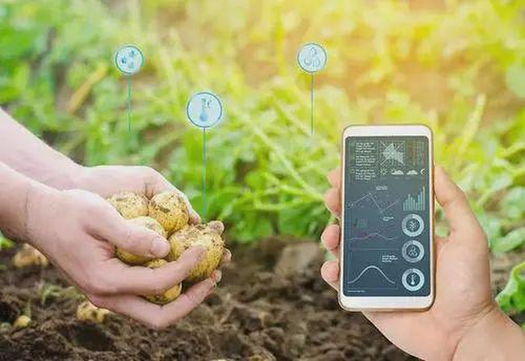
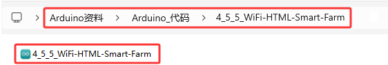
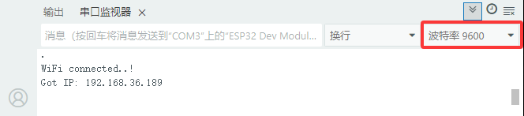

### 4.5.5 网页控制:智慧农场管理系统

***请注意，使用设备时不要让水从水池和土壤池中溢出。如果水洒到其他传感器上，会导致短路，影响设备正常工作。另外，如果水洒到电池上，会导致发热和爆炸等危险。因此，请在使用设备时格外小心，尤其是幼儿使用时一定要在家长的监护下进行。为确保设备的安全运行，请遵循相关使用指南和安全规范。***



#### 4.5.5.1 简介

本教程将为您详细介绍如何使用ESP32开发板实现WIFI网页控制智慧农场管理系统，系统包括土壤湿度传感器、水位传感器、XHT11温湿度传感器、水滴传感器继电器、水泵模块、光敏传感器（光照度检测）、LED模块、风扇模块和舵机（饲料盒开关）。教程内容包括ESP32的WiFi配置、网页设置以及如何编写代码等实现远程监控和控制。您将学习如何将ESP32连接到WIFI网页服务器，并通过发布和订阅消息来读取土壤湿度、水位、温湿度、雨水量和光照强度等相关数据，并根据需要控制水泵、LED、风扇和舵机的状态。此外，无论您是物联网初学者还是有经验的开发者，本教程都将帮助您掌握ESP32基于WiFi网页的远程大棚数据监测与控制系统开发，为您的项目增添智能的农场管理功能。

#### 4.5.5.2 接线图

⚠️ **特别注意：智慧农场已经组装好了，这里不需要把所有的传感器和模块都拆下来又重新组装和接线。由于传感器和模块较多，接线图中的接线复杂会导致传感器和模块的引脚接线看不清，所以使用表格来表示传感器和模块的引脚连接到ESP32主控板上的对应引脚，也是为了方便您编写代码！**

| 编号 |      传感器模块        |      ESP32主板 S 引脚       |  ESP32主板 V 引脚 |  ESP32主板 G 引脚 |
| :--: | :------------------:  | :------------------------: |:---------------: |:---------------: |
|  1   |         风扇          |    io18(IN-) \| io19(IN+)     |        V         |         G        |
|  2   |      LCD1602模块      |  I2C（SDA(io21) \| SCL(io22)） |        V         |         G        |
|  3   |   XHT11温湿度传感器    |            io17             |        V         |         G        |
|  4   |      水滴传感器        |            io35             |        V         |         G        |
|  5   |      光敏传感器        |            io34             |        V         |         G        |
|  6   |        舵 机           |            io26             |        V         |         G        |
|  7   |      无源蜂鸣器        |            io16             |        V          |         G        |
|  8   |       LED模块          |            io27             |        V         |          G       |
|  9  |      水位传感器         |            io33             |        V         |          G        |
|  10  |    土壤湿度传感器      |            io32             |        V         |          G        |
|  11  |      继电器水泵        |            io25             |        V         |          G        |

#### 4.5.5.3 代码流程图


#### 4.5.5.4 实验代码

代码文件在`Arduino_代码`文件夹中，代码文件为`4_5_5_WiFi-HTML-Smart-Farm`，如下图所示：



鼠标双击`4_5_5_WiFi-HTML-Smart-Farm.ino`即可在Arduino IDE中打开。

⚠️ **特别提醒：** 打开代码文件后，需要修改ESP32开发板需要连接的WiFi名称与密码，您需要分别将 `REPLACE_WITH_YOUR_SSID` 和 `REPLACE_WITH_YOUR_PASSWORD` 替换为您自己的 Wi-Fi 名称和 WiFi 密码。WiFi名称和WiFi密码修改后才能上传代码，否则你的ESP32开发板将无法连接网络。

```c++
const char* ssid = "REPLACE_WITH_YOUR_SSID";  //输入你自己的WiFi名称
const char* password = "REPLACE_WITH_YOUR_PASSWORD"; //输入你自己的WiFi密码
```

⚠️ **注意：** 请确保代码中的WiFi名称和WiFi密码与连接到您的电脑、手机/平板、ESP32开发板和路由器的网络相同，它们必须在同一局域网（WiFi）内。

⚠️ **注意：** WiFi必须是2.4Ghz频率的，否则ESP32无法连接WiFi。

```c++
/*  
 * 名称   : WiFi-HTML-Smart-Farm
 * 功能   : 使用wifi网页控制智慧农场
 * 编译IDE：ARDUINO 2.3.6
 * 作者   : https://www.keyesrobot.cn/ 
*/

#include <Arduino.h>
#include <WiFi.h>
#include <WebServer.h>
#include <LiquidCrystal_I2C.h>
#include <dht11.h>
#include <ESP32Servo.h>

// 设置引脚
#define DHT11PIN        17  // 温湿度传感器引脚
#define LEDPIN          27  // LED引脚
#define SERVOPIN        26  // 舵机引脚
#define MotorPIN1       19  // 电机模块IN+引脚
#define MotorPIN2       18  // 电机模块IN-引脚
#define STEAMPIN        35  // 水滴传感器引脚
#define LIGHTPIN        34  // 光敏传感器引脚
#define SOILHUMIDITYPIN 32  // 土壤湿度传感器引脚
#define WATERLEVELPIN   33  // 水位传感器引脚
#define RELAYPIN        25   // 继电器引脚
#define BUZZERPIN       16  // 无源蜂鸣器引脚

// 初始化模块
dht11 DHT11;
LiquidCrystal_I2C lcd(0x27, 16, 2);
Servo myservo;  // 设置舵机对象控制舵机

/*替换为您的网络凭据（输入您自己的WiFi名称和密码）*/
const char* ssid = "REPLACE_WITH_YOUR_SSID";  // 输入你自己的WiFi名称
const char* password = "REPLACE_WITH_YOUR_PASSWORD"; // 输入你自己的WiFi密码

// 创建WebServer对象
WebServer server(80);

// 控制状态的变量
static int A = 0;
static int B = 0;
static int C = 0;

// HTML网页内容
const char index_html[] PROGMEM = R"rawliteral(
<!DOCTYPE HTML>
<html>
<title>TEST HTML ESP32</title>
<head>
  <meta charset="utf-8">
  <style>
    html, body {
      margin: 0;
      width: 100%;
      height: 100%;
      display: flex;
      justify-content: center;
      align-items: center;
      flex-direction: column;
      background-color: #f0f0f0;
    }

    /* 主按钮容器 */
    .btn {
      display: flex;
      justify-content: center;  /* 按钮居中 */
      gap: 10px;  /* 增加按钮之间的空格 */
      width: 320px;  /* 设置宽度以确保按钮紧密排列 */
      flex-wrap: wrap; /* 如果需要，允许按钮换行 */
      margin-bottom: 20px;  /* 按钮和数据显示之间的空格 */
    }

    /* 按钮样式 */
    .btn button {
      width: 70px;  /* 设置按钮宽度 */
      height: 70px;  /* 设置按钮高度 */
      border: none;
      font-size: 16px;
      color: #fff;
      background-color: #89e689;
      cursor: pointer;
    }

    .btn button:active {
      top: 2px;
    }

    /* 数据显示区 */
    #dht {
      text-align: center;  /* 文字居中 */
      width: 320px;  /* 与按钮容器的宽度相同 */
      color: #fff;
      background-color: #47a047;
      font-size: 18px; /* 调整字体大小以提高可读性 */
      padding: 10px;
      border-radius: 10px;  /* 圆角 */
      box-sizing: border-box;
      margin-bottom: 10px; /* 在数据显示和按钮之间增加空格 */
    }

  </style>
</head>
<body>

  <!-- Display area for sensor data -->
  <div id="dht"></div>

  <!-- Button row -->
  <div class="btn">
    <button id="btn-led" onclick="setLED()">LED灯</button>
    <button id="btn-fan" onclick="setFan()">风扇</button>
    <button id="btn-feeding" onclick="setFeeding()">喂养</button>
    <button id="btn-watering" onclick="setWatering()">抽水</button>
    <button id="btn-music" onclick="setmusic()">音乐</button>
  </div>

  <script>
    function setLED() {
      var payload = "A"; 
      var xhr = new XMLHttpRequest();
      xhr.open("GET", "/set?value=" + payload, true);
      xhr.send();
    }
    function setFan() {
      var payload = "B"; 
      var xhr = new XMLHttpRequest();
      xhr.open("GET", "/set?value=" + payload, true);
      xhr.send();
    }
    function setFeeding() {
      var payload = "C"; 
      var xhr = new XMLHttpRequest();
      xhr.open("GET", "/set?value=" + payload, true);
      xhr.send();
    }
    function setWatering() {
      var payload = "D"; 
      var xhr = new XMLHttpRequest();
      xhr.open("GET", "/set?value=" + payload, true);
      xhr.send();
    }
    function setmusic() {
      var payload = "E"; 
      var xhr = new XMLHttpRequest();
      xhr.open("GET", "/set?value=" + payload, true);
      xhr.send();
    }

    setInterval(function () {
      var xhttp = new XMLHttpRequest();
      xhttp.onreadystatechange = function () {
        if (this.readyState == 4 && this.status == 200) {
          document.getElementById("dht").innerHTML = this.responseText;
        }
      };
      xhttp.open("GET", "/dht", true);
      xhttp.send();
    }, 1000)
  </script>

</body>
</html>

)rawliteral";

// 将传感器数据合并为HTML格式
String Merge_Data(void) {
  String dataBuffer;
  String Humidity;
  String Temperature;
  String Steam;
  String Light;
  String SoilHumidity;
  String WaterLevel;
  
  // 读取DHT11传感器
  int chk = DHT11.read(DHT11PIN);
  
  // 读取其他传感器
  Steam = String(analogRead(STEAMPIN) / 4095.0 * 100);
  Light = String(analogRead(LIGHTPIN));
  int shvalue = analogRead(SOILHUMIDITYPIN) / 4095.0 * 100 * 2.3;
  shvalue = shvalue > 100 ? 100 : shvalue;
  SoilHumidity = String(shvalue);
  int wlvalue = analogRead(WATERLEVELPIN) / 4095.0 * 100 * 2.5;
  wlvalue = wlvalue > 100 ? 100 : wlvalue;
  WaterLevel = String(wlvalue);
  Temperature = String(DHT11.temperature);
  Humidity = String(DHT11.humidity);
  
  // 构建HTML内容
  dataBuffer += "<p>";
  dataBuffer += "<h1>传感器数据</h1>";
  dataBuffer += "<b>温度: </b><b>" + Temperature + "</b><b>℃</b><br/>";
  dataBuffer += "<b>湿度: </b><b>" + Humidity + "</b><b>%RH</b><br/>";
  dataBuffer += "<b>水位: </b><b>" + WaterLevel + "</b><b>%</b><br/>";
  dataBuffer += "<b>雨量: </b><b>" + Steam + "</b><b>%</b><br/>";
  dataBuffer += "<b>光强: </b><b>" + Light + "</b><br/>";
  dataBuffer += "<b>土壤湿度: </b><b>" + SoilHumidity + "</b><b>%</b><br/>";
  dataBuffer += "</p>";

  return dataBuffer;
}

// 根据收到的HTTP请求配置操作
void Config_Callback() {
  if (server.hasArg("value")) {
    String HTTP_Payload = server.arg("value");
    Serial.printf("[%lu]%s\r\n", millis(), HTTP_Payload.c_str());

    if (HTTP_Payload == "A") {
      if (A) {
        digitalWrite(LEDPIN, LOW);
        A = 0;
      } else {
        digitalWrite(LEDPIN, HIGH);
        A = 1;
      }
    }

    if (HTTP_Payload == "B") {
      if (B) {
        digitalWrite(MotorPIN1, LOW);
        digitalWrite(MotorPIN2, LOW);
        B = 0;
      } else {
        delay(500);
        digitalWrite(MotorPIN1, HIGH);
        digitalWrite(MotorPIN2, LOW);
        delay(500);
        B = 1;
      }
    }

    if (HTTP_Payload == "C") {
      if (C) {
        myservo.write(180);
        delay(1000);
        C = 0;
      } else {
        myservo.write(80);
        delay(1000);
        C = 1;
      }
    }

    if (HTTP_Payload == "D") {
      digitalWrite(RELAYPIN, HIGH);
      delay(400);
      digitalWrite(RELAYPIN, LOW);
      delay(700);
    }
    if (HTTP_Payload == "E") {
      ledcWriteTone(BUZZERPIN, 262);
      delay(200);
      ledcWriteTone(BUZZERPIN, 294);
      delay(200);
      ledcWriteTone(BUZZERPIN, 330);
      delay(200);
      ledcWriteTone(BUZZERPIN, 349);
      delay(200);
      ledcWriteTone(BUZZERPIN, 392);
      delay(200);
      ledcWriteTone(BUZZERPIN, 440);
      delay(200);
      ledcWriteTone(BUZZERPIN, 494);
      delay(200);
      ledcWriteTone(BUZZERPIN, 0);
      delay(500);
    }
  }
  server.send(200, "text/plain", "OK");
}

// 处理无效的URL访问
void notFound() {
  server.send(404, "text/plain", "Not found");
}

void setup() {
  Serial.begin(9600);
  
  // 连接WiFi
  WiFi.begin(ssid, password);
  while (!WiFi.isConnected()) {
    delay(500);
    Serial.print(".");
  }
  Serial.println("WiFi connected..!");
  Serial.println("Got IP: ");
  Serial.println(WiFi.localIP());

  // 设置引脚模式
  pinMode(LEDPIN, OUTPUT);
  pinMode(STEAMPIN, INPUT);
  pinMode(LIGHTPIN, INPUT);
  pinMode(SOILHUMIDITYPIN, INPUT);
  pinMode(WATERLEVELPIN, INPUT);
  pinMode(RELAYPIN, OUTPUT);
  pinMode(MotorPIN1, OUTPUT);
  pinMode(MotorPIN2, OUTPUT);
  pinMode(BUZZERPIN, OUTPUT);

  delay(1000);

  // 连接舵机引脚
  myservo.attach(SERVOPIN);
  myservo.write(180);
  delay(1000);

 //配置LEDC渠道
  ledcAttachChannel(BUZZERPIN, 1000, 8, 4);

  // 初始化LCD
  lcd.init();
  lcd.backlight();
  lcd.clear();
  lcd.setCursor(0, 0);
  lcd.print("IP:");
  lcd.setCursor(0, 1);
  lcd.print(WiFi.localIP());

  // 设置服务器路由器
  server.on("/", HTTP_GET, []() {
    server.send(200, "text/html", index_html);
  });

  server.on("/dht", HTTP_GET, []() {
    server.send(200, "text/plain", Merge_Data().c_str());
  });

  server.on("/set", HTTP_GET, Config_Callback);
  server.onNotFound(notFound);

  // 启动服务器
  server.begin();
}

void loop() {
  server.handleClient();
}
```

#### 4.5.5.5 实验结果

按照接线图接好线，外接电源，选择好正确的开发板板型（ESP32 Dev Module）和 适当的串口端口（COMxx），然后单击按钮上传代码，外接电源。

⚠️ **注意：手机/平板和电脑一定要与ESP32开发板连接的是同一个WiFi，否则将无法进入控制页面，还有就是ESP32开发板在使用WiFi功能时功耗很大需要外接DC电源才能满足它的工作电力需求，如果达不到它的工作电力需求ESP32板将会一直复位导致代码无法正常运行。**

上传代码成功后，单击Arduino IDE右上角的打开串口监视器窗口并设置串口波特率为`9600`，串口监视器窗口便会显示连接成功后的IP地址(如果看不到可以按复位按键重新连接一次)，同时LCD显示屏也会显示IP地址。 




然后，您可以在手机端/平板端的浏览器输入串口监视器打印的 ESP32 IP地址 或 LCD显示屏显示的 ESP32 IP地址，使用浏览器打开ESP32的IP地址，并访问网页。在本例中，您可以在浏览器中输入你自己的**ESP32 IP地址**(**这里是以192.168.36.189为例，而你需要将IP地址：192.168.36.189 修改成你自己的 ESP32 IP地址**)，在浏览器中打开ESP32的IP地址来查看传感器数据显示和模块控制网页（**如果发现网页很小，可以用两只手指接触手机/平板的屏幕滑动放大**）。网页中显示当前的温度、湿度、水池水位和土壤湿度等设备，还有LED灯、风扇、饲料盒、抽水泵和音乐等设备。而且，我们可以通过手机/平板操作这些设备。


⚠️ **注意：当电脑、手机/平板和ESP32开发板，连接到同一个网络(WiFi)时，可在手机端/平板端打开这个网页。此处是你自己ESP32的IP地址**。

在手机端/平板端的浏览器中打开对应的IP地址，即可查看到对应传感器的数据，还可以控制LED、风扇、饲养盒、继电器抽水和音乐播放等功能。


|   传感器数据   |   可控制   |
| :------------: | :--------: |
|   温度（℃）    |  LED 开/关  |
|  湿度（%RH）    |  风扇 开/关 |
|   水位（%）     | 饲料盒 开/关 |
|   雨量（%）     | 抽水泵 开/关 |
| 光照（0~4095）  |   播放音乐   |
| 土壤湿度（%）   |             |


在以上的Arduino教程中，我们学会了如何使用ESP32开发板，创建一个网页并将传感器数据显示出来。例如，我们可以显示当前的温度、湿度、水池水位和土壤湿度等等。我们也可以使用这个开发板来控制LED灯、风扇、饲料盒和抽水泵等设备。而且，我们可以通过手机或电脑远程操作这些设备。


通过这个教程，我们可以模拟真实的农场，并实现农场的智能化控制，使物联网、信息化、自动化和智能化成为可能。这样的技术可以让我们更方便地控制农场设备，提高农业生产的效率和质量。