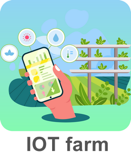
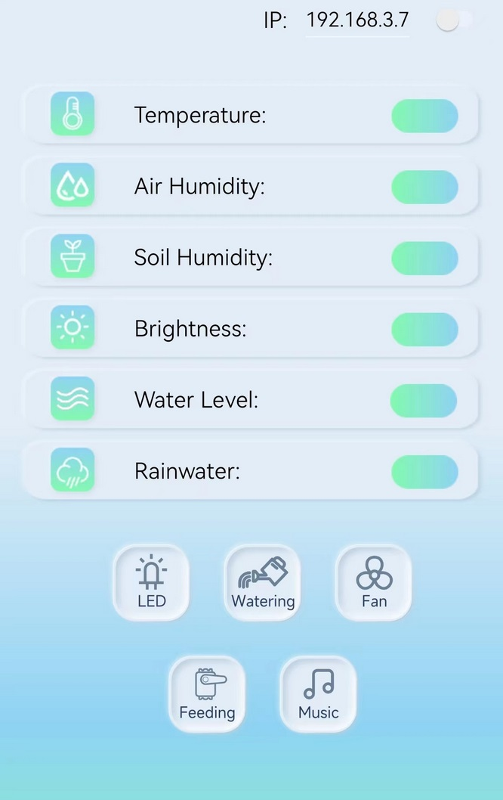
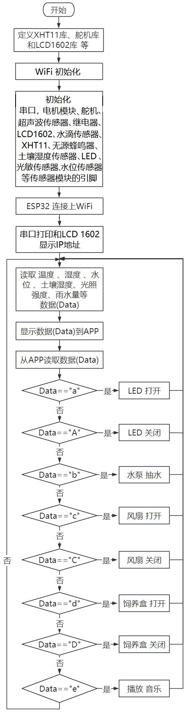
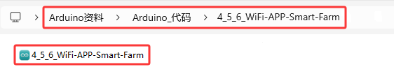
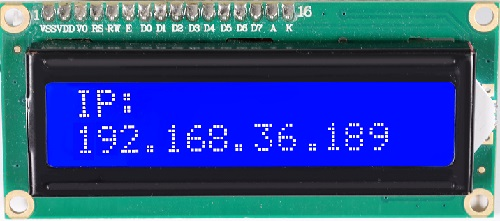

### 4.5.6 APP控制:智慧农场管理系统

⚠️ **请注意：** 使用设备时不要让水从水池和土壤池中溢出。如果水洒到其他传感器上，会导致短路，影响设备正常工作。另外，如果水洒到电池上，会导致发热和爆炸等危险。因此，请在使用设备时格外小心，尤其是幼儿使用时一定要在家长的监护下进行。为确保设备的安全运行，请遵循相关使用指南和安全规范。


#### 4.5.6.1 简介

APP智慧农场管理系统可以实时监测农场的温湿度、水池水位、土壤湿度、光照强度和雨量。同时，它还能控制LED灯进行照明，控制水泵进行灌溉，控制饲料盒进行喂养，控制电机模块调整农场的温湿度和音乐播放。


可以使用手机上的APP实现这些操作，从而方便快捷地管理农场。此外，该系统还可以使用蜂鸣器播放声音，实现更加智能化的管理。

#### 4.5.6.2 APP下载安装

⚠️ **特别提醒：如果已经在手机/平板上安装好了APP，则这一步骤可以直接跳过；否则，需要参照以下步骤在手机/平板上来安装APP。**



**步骤1：** 在手机/平板浏览器的搜索框中输入官网链接：www.keyes-robot.com


**步骤2：** 找到 “**资料中心**”，并且点击它。


**步骤3：** 在页面找到 “**APP下载**”选项，并且点击它。


**步骤4：** 在 “**APP下载**”页面，找到“**IOT farm**”。


**步骤5：** 根据自己的手机/平板系统选择对应的APP下载安装。选择如下：


**安卓系统(Android)**

a. 点击 "**点击下载**" 按钮，下载对应的 "**IOT farm.apk**" 文件。


b. 按照安装提示进行下载安装。


c. 下载安装后，打开IOT farm APP，出现如下图界面。



**苹果系统(IOS)**

a. 点击 "**跳转APP Store**" 按钮，跳转到 APP Store


b. 在 APP Store 上搜索 **IOT farm** ，选择 **IOT farm**，然后点击  获取，下载安装APP即可。


c. 下载安装后，打开IOT farm APP，出现如下图界面。


#### 4.5.6.3 APP功能介绍

打开APP，APP上有温度、湿度、土壤湿度、光线强度、水池水位和雨水量等设备，可以显示对应的传感器数据；还有LED灯、风扇、饲料盒、抽水泵和音乐等设备，可以控制对应的功能。

A. 当手机/平板、电脑和ESP32开发板连接到同一个路由器下的相同WIFI时，在APP的右上方输入ESP32的IP地址，向右拨动灰色按钮，即可连接。


B. 显示农场的实时温度。


C. 显示农场的实时湿度。


D. 显示土壤的实时湿度。


E. 显示太阳光照强度。


F. 显示水池的水位。


G. 显示农场下雨量。


H. 控制LED。


I. 控制水泵进行灌溉。


J. 控制风扇调节温度。


K. 控制舵机，开关饲料盒。


O. 控制蜂鸣器，播放音乐。


#### 4.5.6.4 接线图

⚠️ **特别注意：智慧农场已经组装好了，这里不需要把所有的传感器和模块都拆下来又重新组装和接线。由于传感器和模块较多，接线图中的接线复杂会导致传感器和模块的引脚接线看不清，所以使用表格来表示传感器和模块的引脚连接到ESP32主控板上的对应引脚，也是为了方便您编写代码！**

| 编号 |      传感器模块        |      ESP32主板 S 引脚       |  ESP32主板 V 引脚 |  ESP32主板 G 引脚 |
| :--: | :------------------:  | :------------------------: |:---------------: |:---------------: |
|  1   |         风扇          |    io18(IN-) \| io19(IN+)     |        V         |         G        |
|  2   |      超声波传感器      |    io12(TRIG) \| io13(ECHO)    |        V         |         G        |
|  3   |      LCD1602模块      |  I2C（SDA(io21) \| SCL(io22)） |        V         |         G        |
|  4   |   XHT11温湿度传感器    |            io17             |        V         |         G        |
|  5   |      水滴传感器        |            io35             |        V         |         G        |
|  6   |      光敏传感器        |            io34             |        V         |         G        |
|  7   |        舵 机           |            io26             |        V         |         G        |
|  8   |      无源蜂鸣器        |            io16             |        V          |         G        |
|  9   |       LED模块          |            io27             |        V         |          G       |
|  10  |      水位传感器        |            io33             |        V         |          G        |
|  11  |     土壤湿度传感器     |            io32             |        V         |          G        |
|  12  |      继电器水泵        |            io25             |        V         |          G        |


#### 4.5.6.5 代码流程图



#### 4.5.6.6 实验代码

代码文件在`Arduino_代码`文件夹中，代码文件为`4_5_6_WiFi-APP-Smart-Farm`，如下图所示：



鼠标双击`4_5_6_WiFi-APP-Smart-Farm.ino`即可在Arduino IDE中打开。

⚠️ **特别提醒：** 打开代码文件后，需要修改ESP32开发板需要连接的WiFi名称与密码，您需要分别将 `REPLACE_WITH_YOUR_SSID` 和 `REPLACE_WITH_YOUR_PASSWORD` 替换为您自己的 Wi-Fi 名称和 WiFi 密码。WiFi名称和WiFi密码修改后才能上传代码，否则你的ESP32开发板将无法连接网络。

```c++
const char* ssid = "REPLACE_WITH_YOUR_SSID";  //输入你自己的WiFi的名称
const char* password = "REPLACE_WITH_YOUR_PASSWORD"; //输入你自己的WiFi密码
```

⚠️ **注意：** 请确保代码中的WiFi名称和WiFi密码与连接到您的电脑、手机/平板、ESP32开发板和路由器的网络相同，它们必须在同一局域网（WiFi）内。

⚠️ **注意：** WiFi必须是2.4Ghz频率的，否则ESP32无法连接WiFi。

```c++
/*  
 * 名称   : WiFi-APP-Smart-Farm
 * 功能   : 使用 wifi+APP 一起控制智能农场
 * 编译IDE：ARDUINO 2.3.6
 * 作者   : https://www.keyesrobot.cn/ 
*/

#include <Arduino.h>
#ifdef ESP32
#include <WiFi.h>
#elif defined(ESP8266)
#include <ESP8266WiFi.h>
#endif

#include <dht11.h>
#include <ESP32Servo.h>
#include <LiquidCrystal_I2C.h>

// 显示
#define DHT11PIN 17         // 温湿度传感器引脚
#define RAINWATERPIN 35     // 水滴传感器引脚
#define LIGHTPIN 34         // 光敏电阻引脚
#define WATERLEVELPIN 33    // 水位传感器引脚
#define SOILHUMIDITYPIN 32  // 土壤湿度传感器引脚
// 控制
#define LEDPIN 27     // LED引脚
#define RELAYPIN 25    // 继电器引脚控制水泵
#define SERVOPIN 26   // 舵机引脚
#define MotorPIN1 19  // 电机模块IN+引脚
#define MotorPIN2 18  // 电机模块IN-引脚
#define BUZZERPIN 16  // 蜂鸣器引脚

/*替换为您的网络凭据（输入您自己的WiFi名称和密码）*/
const char* ssid = "REPLACE_WITH_YOUR_SSID";  // 输入你自己的WiFi名称
const char* password = "REPLACE_WITH_YOUR_PASSWORD"; // 输入你自己的WiFi密码

// 初始化LCD1602, I2C地址为0x27
LiquidCrystal_I2C lcd(0x27, 16, 2);
WiFiServer server(80);  // 初始化wifi服务器
dht11 DHT11;            // 初始化温湿度传感器
Servo myservo;          // 创建舵机对象控制舵机
                        // 在ESP32上可以创建16个舵机对象

// 将变量定义为检测到的值
String request;
String dataBuffer;
int Temperature;   // 温度
int Humidity;      // 湿度
int SoilHumidity;  // 土壤湿度
int Light;         // 亮度
int WaterLevel;    // 水位
int Rainwater;     // 雨水

void setup() {
  Serial.begin(9600);
  // 连接wifi
  WiFi.begin(ssid, password);
  // 检查是否连接
  Serial.println("Connecting to WiFi...");
  while (WiFi.status() != WL_CONNECTED) {
    delay(1000);
    Serial.print(".");
  }
  delay(1000);
  // 串口打印wifi名称和IP地址
  Serial.println("Connected to WiFi");
  Serial.print("WiFi NAME:");
  Serial.println(ssid);
  Serial.print("IP:");
  Serial.println(WiFi.localIP());

  // 初始化LCD
  lcd.init();
  // 打开/关闭（可选）背光
  lcd.backlight();
  //lcd.noBacklight();
  lcd.clear();
  // 设置光标的位置
  lcd.setCursor(0, 0);
  // LCD打印
  lcd.print("IP:");
  // 设置光标的位置
  lcd.setCursor(0, 1);
  // LCD打印
  lcd.print(WiFi.localIP());

  // 设置引脚模式
  pinMode(LEDPIN, OUTPUT);
  pinMode(RAINWATERPIN, INPUT);
  pinMode(LIGHTPIN, INPUT);
  pinMode(SOILHUMIDITYPIN, INPUT);
  pinMode(WATERLEVELPIN, INPUT);
  pinMode(RELAYPIN, OUTPUT);
  pinMode(MotorPIN1, OUTPUT);
  pinMode(MotorPIN2, OUTPUT);
  pinMode(BUZZERPIN, OUTPUT);
  delay(1000);

  // 连接舵机到引脚26
  myservo.attach(SERVOPIN);
  myservo.write(180);
  delay(1000);

  // 启动服务器
  server.begin();

  // 配置LEDC渠道
  ledcAttachChannel(BUZZERPIN, 1000, 8, 4);
}

void loop() {
  // 检查客户端与web服务器是否连接
  // 当客户端连接到服务器时，“server.available（）”返回一个用于客户端通信的WiFiClient对象。
  WiFiClient client = server.available();
  if (client) {
    Serial.println("New client connected");
    while (client.connected()) {
      // 确定服务器是否发送数据
      if (client.available()) {
        request = client.readStringUntil('s');
        Serial.print("Received message: ");
        Serial.println(request);
      }
      // 获取所有传感器数据
      getSensorsData();
      // 将所有数据放入数据缓冲器"dataBuffer"
      dataBuffer = "";
      dataBuffer += String(Temperature, HEX);
      dataBuffer += String(Humidity, HEX);
      dataBuffer += dataHandle(SoilHumidity);
      dataBuffer += dataHandle(Light);
      dataBuffer += dataHandle(WaterLevel);
      dataBuffer += dataHandle(Rainwater);
      // 发送数据到服务器，传输到APP
      client.print(dataBuffer);
      delay(500);

      //LED
      if (request == "a") {
        digitalWrite(LEDPIN, HIGH);
      } else if (request == "A") {
        digitalWrite(LEDPIN, LOW);
      }
      // 灌溉
      else if (request == "b") {
        digitalWrite(RELAYPIN, HIGH);
        delay(400);  //灌溉延时
        digitalWrite(RELAYPIN, LOW);
        delay(700);
      }
      // 风扇
      else if (request == "c") {
        delay(800);
        digitalWrite(MotorPIN2, LOW);
        analogWrite(MotorPIN1, 100);
        delay(200);
      } else if (request == "C") {
        digitalWrite(MotorPIN2, LOW);
        analogWrite(MotorPIN1, 0);
      }
      // 喂食盒
      else if (request == "d") {
        // 舵机转到80°打开喂食盒
        myservo.write(80);
        delay(1000);
      } else if (request == "D") {
        // 舵机转到180°合上喂食盒
        myservo.write(180);
        delay(1000);
      }
      // 蜂鸣器播放音乐
      else if (request == "e") {
        ledcWriteTone(BUZZERPIN, 262);
        delay(200);
        ledcWriteTone(BUZZERPIN, 294);
        delay(200);
        ledcWriteTone(BUZZERPIN, 330);
        delay(200);
        ledcWriteTone(BUZZERPIN, 349);
        delay(200);
        ledcWriteTone(BUZZERPIN, 392);
        delay(200);
        ledcWriteTone(BUZZERPIN, 440);
        delay(200);
        ledcWriteTone(BUZZERPIN, 494);
        delay(200);
        ledcWriteTone(BUZZERPIN, 0);
        delay(500);
      }
      request = "";
    }
    Serial.println("Client disconnected");
  }
}

void getSensorsData() {
  // 获取数据
  int chk = DHT11.read(DHT11PIN);
  // 水滴传感器
  Rainwater = analogRead(RAINWATERPIN);
  // 光敏电阻
  Light = analogRead(LIGHTPIN);
  // 土壤湿度传感器
  SoilHumidity = analogRead(SOILHUMIDITYPIN) * 1.8;
  // 水位传感器
  WaterLevel = analogRead(WATERLEVELPIN) * 1.8;
  // 温度
  Temperature = DHT11.temperature;
  // 湿度
  Humidity = DHT11.humidity;
}

// 将数据转换成百分比
String dataHandle(int data) {
  // 将模拟值转换为百分比
  int percentage = (data / 4095.0) * 100;
  // 如果转换后的百分比大于100，则输出100
  percentage = percentage > 100 ? 100 : percentage;
  // 六个字符存储十六进制字符串，一个字符作为终止符
  char hexString[3];
  // 将十六进制值转换为6位十六进制字符串，加上前导零：0表示00,1表示01…
  sprintf(hexString, "%02X", percentage);

  return hexString;
}
```
#### 4.5.6.7 实验结果

按照接线图接好线，外接电源，选择好正确的开发板板型（ESP32 Dev Module）和 适当的串口端口（COMxx），然后单击按钮上传代码，外接电源。

⚠️ **注意：手机/平板和电脑一定要与ESP32开发板连接的是同一个WiFi，否则将无法进入控制页面，还有就是ESP32开发板在使用WiFi功能时功耗很大需要外接DC电源才能满足它的工作电力需求，如果达不到它的工作电力需求ESP32板将会一直复位导致代码无法正常运行。**

上传代码成功后，单击Arduino IDE右上角的打开串口监视器窗口并设置串口波特率为`9600`，串口监视器窗口便会显示连接成功后的IP地址(如果看不到可以按复位按键重新连接一次)，同时LCD显示屏也会显示IP地址。 



⚠️ **注意：当电脑、手机/平板和ESP32开发板，连接到同一个网络(WiFi)时，可在手机/平板端同时打开这个网页。此处是你自己ESP32的IP地址**。

打开APP，APP上有温度、湿度、土壤湿度、光线强度、水池水位和雨水量等设备，可以显示对应的传感器数据；还有LED灯、风扇、饲料盒、抽水泵和音乐等设备，可以控制对应的功能。

**接下来开始操作APP：**

打开APP，APP上有温度、湿度、土壤湿度、光线强度、水池水位和雨水量等设备，可以显示对应的传感器数据；还有LED灯、风扇、饲料盒、抽水泵和音乐等设备，可以控制对应的功能。

A. 当手机/平板、电脑和ESP32开发板连接到同一个路由器下的WIFI时，在APP的右上方输入ESP32的IP地址（LCD显示屏显示的），向右拨动灰色按钮，即可连接好WiFi。


B. 显示农场的实时温度。


C. 显示农场的实时湿度。


D. 显示土壤的实时湿度。


E. 显示太阳光照强度。


F. 显示水池的水位。


G. 显示农场下雨量。


H. 控制LED。


I. 控制水泵进行灌溉。


J. 控制风扇调节温度。


K. 控制舵机，开关饲料盒。


O. 控制蜂鸣器，播放音乐。


