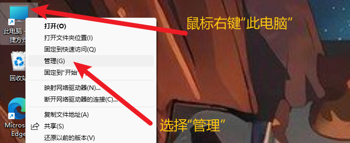
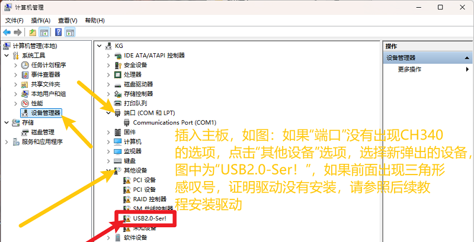
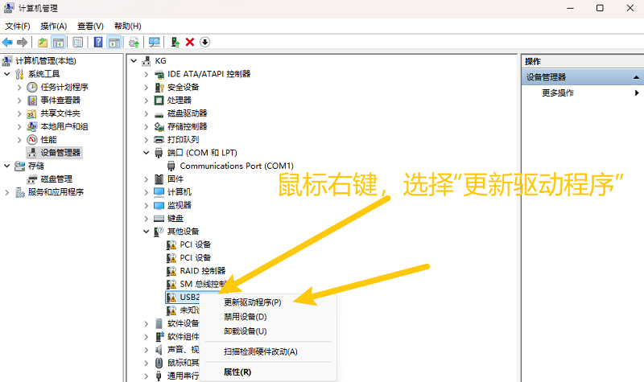
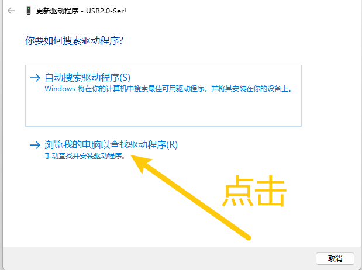
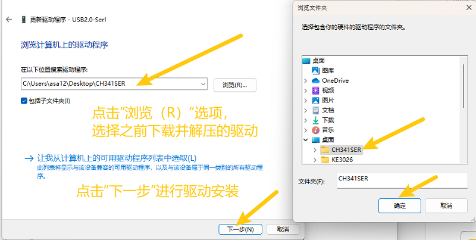
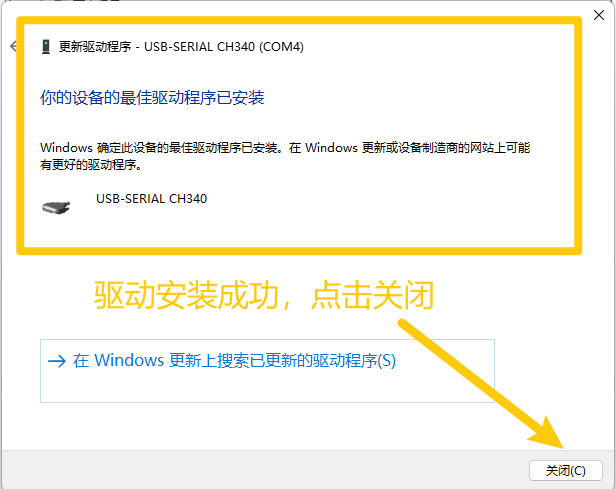
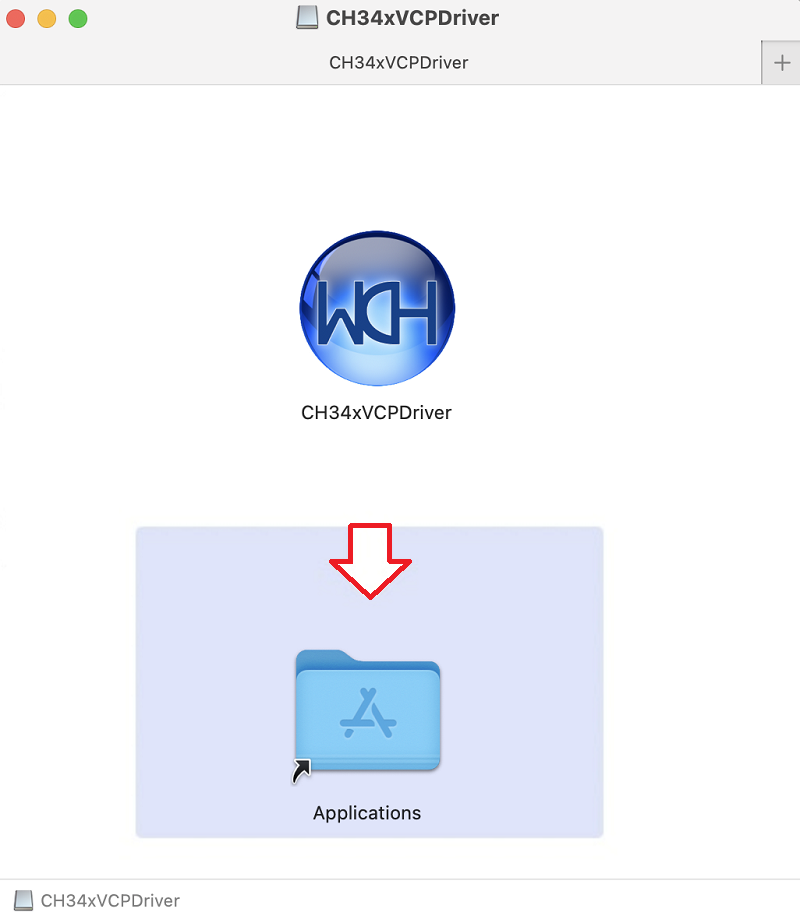
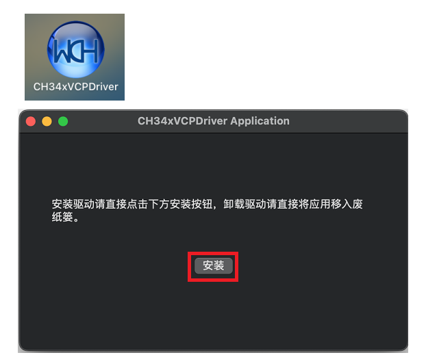
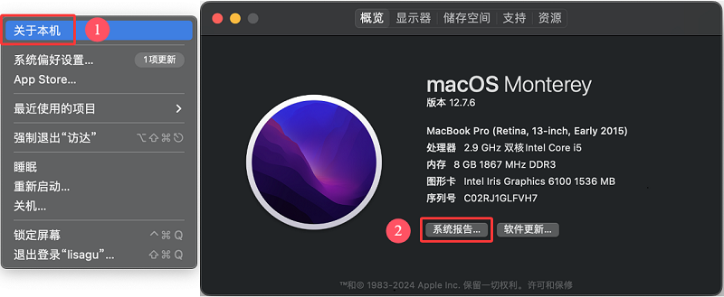
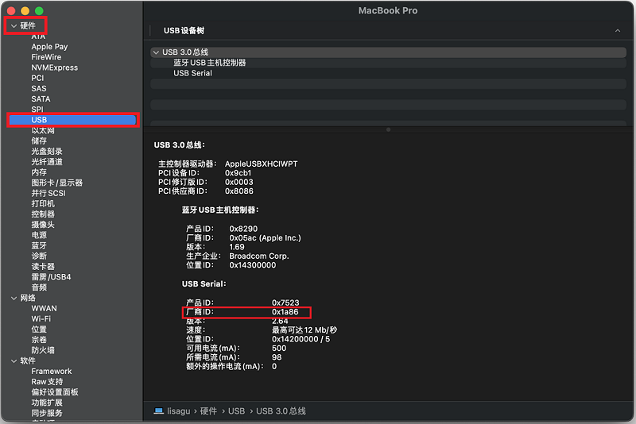

# 3. CH340驱动安装(选读部分)

本部分非必读部分，仅在ESP32主控板无法被电脑识别时使用，如果已经识别可直接跳过！！！

**注意：** 如果ESP32主控板在Arduino、Mixly或者KidsBlock(Scratch)教程中无法被识别，请先检查ESP32主控板是否连接到位并且连接电脑其他USB端口重新测试，如果依旧不行再开始以下驱动安装步骤

## 3.1 Windows系统

Windows系统驱动下载：[Windows驱动](./Windows.7z)

1、将ESP32主控板连接到电脑（如图）。

2、打开“**设备管理器**”。

3、检查驱动是否已经安装。

情况一：驱动安装完成，请跳过驱动安装教程，进行下一步学习。

情况二：驱动没有安装，请进行以下安装教程进行手动安装驱动。

4、驱动安装

（1）. 鼠标右击 "**USB2.0-Ser**"，在弹出框中选择 “**更新驱动程序(P)**”.

（2）. 点击选择 “**浏览我的电脑以查找驱动程序(R)**”.

（3）. 点击 “**浏览（R）**” 选项，在弹出的方框中找到前面下载到的资料，选择里面的CH341SER驱动文件，点击 “**确定**”，完成后点击 “**下一步**” 进行驱动安装.

（4）. 界面显示如下图类似的话语，证明驱动安装成功，点击 “**关闭**”.

（5）. 驱动安装完成后，选择 “**端口**” 选项，如图CH340的黄色感叹号消失，证明驱动安装完成.

## 3.2 Mac系统

Mac系统驱动下载：[Mac驱动](./Mac.7z)

1、下载驱动后解压，在下载路径中找到CH340驱动文件，点击 “**CH34xVCPDriver.dmg文件**”。这里是以 “**CH34xVCPDriver.dmg文件**” 安装为例的。

2、拖拽 “**CH34xVCPDriver**” 文件进入操作系统的应用文件夹。

打开 “**LaunchPad**” → “**CH34xVCPDriver**” → “**安装**”。

然后安装将成功。

将CH340主控板连接USB线插入电脑的USB接口时，请打开 “**关于本机->系统报告->硬件->USB**” 。右侧为 “**USB设备树**” 。如果USB设备工作正常，您将发现其 “**供应商ID**” 为[0x1a86]的设备。

打开 “**应用程序-实用程序**” 文件夹下的 “**终端**” 程序，键入命令 “ls /dev/tty*” .

你应该看到 “**tty.wchusbserialx**”，其中“x”是分配的设备号，类似于Windows COM端口分配.

此时重新操作，ESP32主板在编程软件里面已经可以被识别并且可以正常上传代码了！！！