# KidsBlock(Scratch)_教程

## 1. KidsBlock 软件的下载、安装和使用方法及驱动安装方法

进入下载链接：[https://www.keyesrobot.cn/projects/KidsBlock/zh-cn/latest/](https://www.keyesrobot.cn/projects/KidsBlock/zh-cn/latest/)，下载KidsBlock软件和驱动安装，网站页面如下图所示。

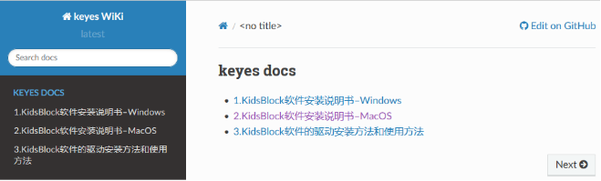


### 1.1 选择设备

(<span style="color: rgb(255, 76, 65);">提醒：本教程是在 Windows 系统下操作， Mac 系统类似，可以参照。</span>)

<span style="color: rgb(255, 76, 65);">**特别注意：** 该套件中使用的设备是Smart farm for ESP32，关于导入Smart farm for ESP32设备的方法，请参考以下内容.</span>

1\. 确保ESP32主控板与计算机连接成功，然后双击 “**KidsBlock**” 图标打开KidsBlock软件。

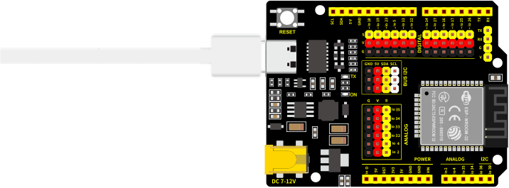

2\. 单击，如下图所示：

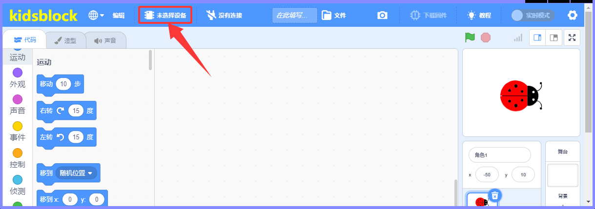

3\. 由于本教程使用的是Smart farm for ESP32设备，所以选择 “**Smart farm for ESP32**” 设备，如下图所示：

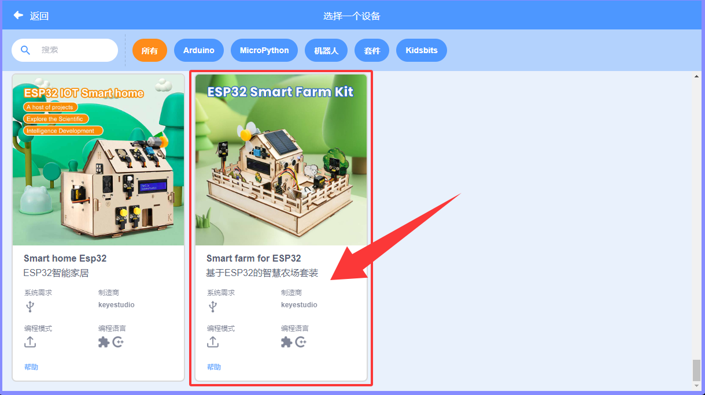

4\. 连接串口端口(COM3)，点击 “**连接**”，如下图所示：


5\. 然后单击 “**返回编辑器**” 返回代码编辑区，如下图所示：

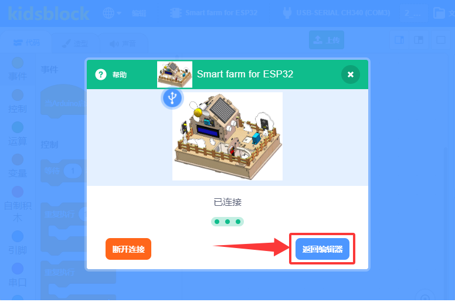

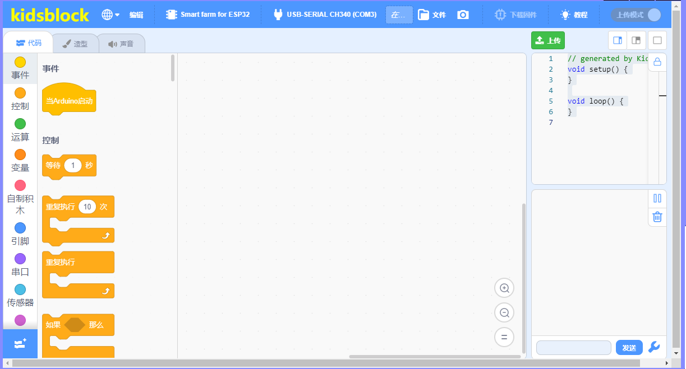

### 1.2 界面介绍

了解KidsBlock软件界面，有利于代码编程的学习，如下图所示：

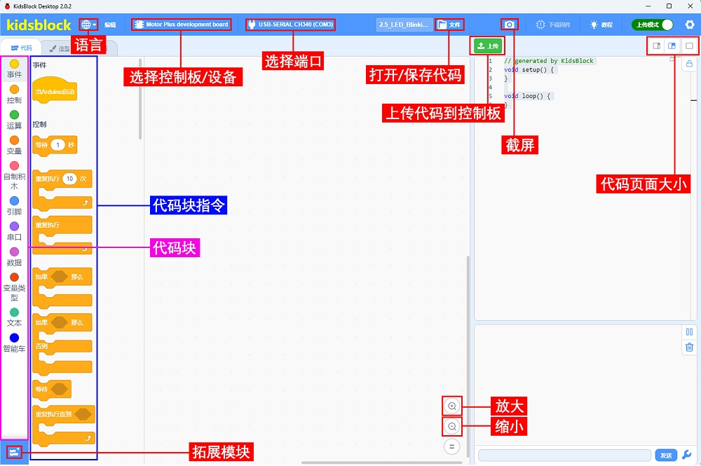

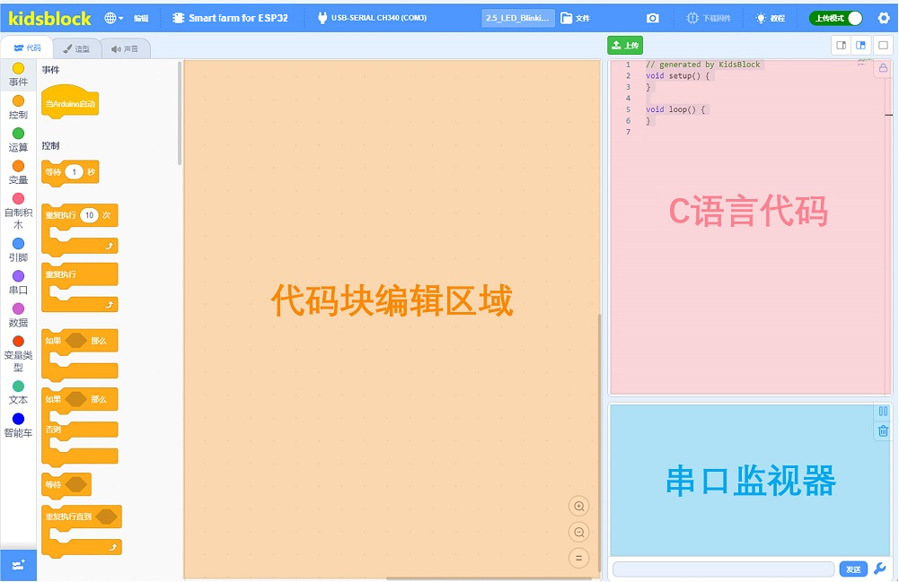


### 1.3 编写代码并上传

**方法①：** 从直接拖动代码块到代码编辑区进行代码编写，如下图所示：

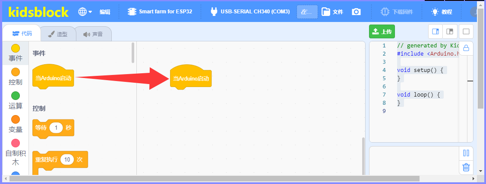

代码编写完成后保存到电脑，单击 “**文件**” --> “**保存到电脑**”，如下图所示：

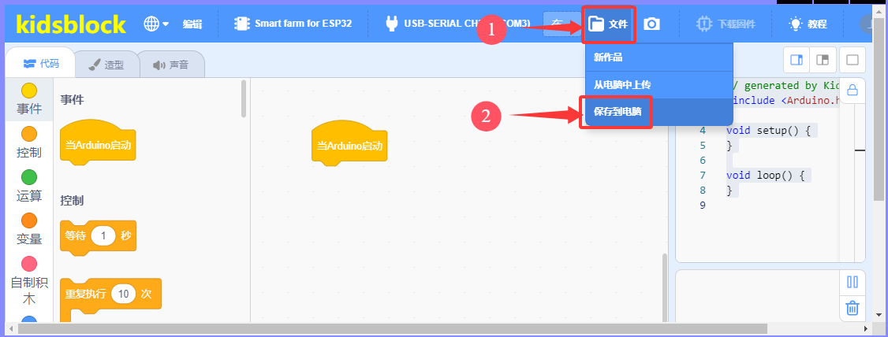


单击将代码上传到ESP32主控板，如下图所示：

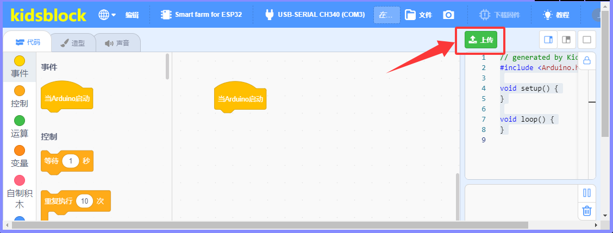

**方法②：** 从电脑打开已经编写好的代码。

我们提供本课程需要用到的所有代码文件，并保存到方便使用的位置。本课程以代码存放于D盘为例，路径为 D:重要资源\程序代码\KidsBlock(Scratch)_代码。<span style="color: rgb(255, 76, 65);">（你也可以放入其他磁盘，只要方便代码导入就行）</span>

单击 “**文件**” --> “**从电脑中上传**”，然后选择保存代码的路径，选中代码文件打开即可，如下图所示：

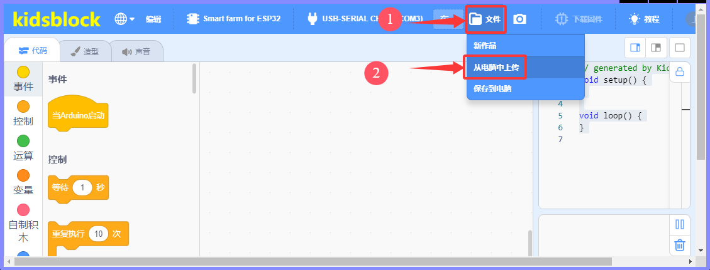

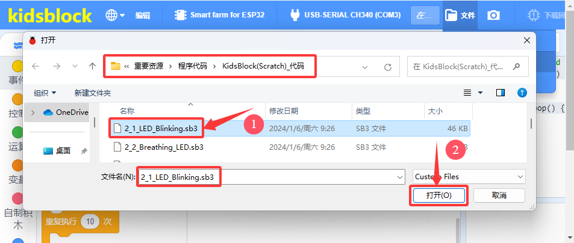

代码文件打开后，需要手动连接串口端口，如下图所示：

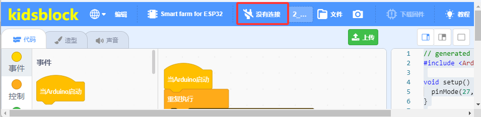

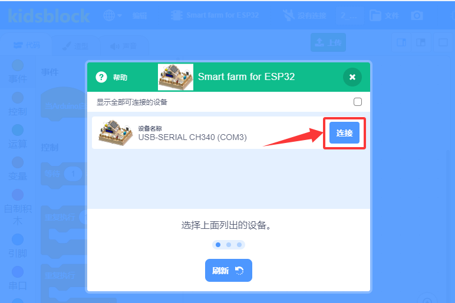

然后单击 “**返回编辑器**” 返回代码编辑区，如下图所示：

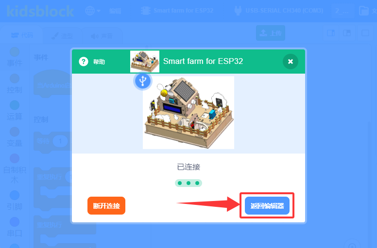

单击将代码上传到ESP32主控板，如下图所示：

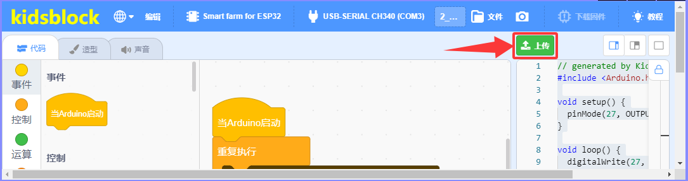

## 2. 基础教程

## 2.1 点亮LED灯

### 2.1.1 简介

本教程将引导您一步步学习如何点亮LED灯，涵盖从基础电路知识到实际操作的全过程。您将了解LED的工作原理、所需元件（如线材、电源等）以及如何正确连接电路。通过教程您将学会如何搭建简单电路并使用开发板点亮LED。无论您是电子初学者还是爱好者，本教程都将为您提供实用且易于理解的指导，助您快速掌握点亮LED的基本技能。

### 2.1.2 元件知识


**LED：**

LED灯的工作原理是基于半导体的光电效应。具体来说，LED是一个半导体的晶片，由P型半导体和N型半导体组成，它们之间形成一个P-N结。当电流通过导线作用于这个晶片时，电子从N区注入P区，空穴从P区注入N区，这些注入的少数载流子（电子和空穴）在P-N结附近复合，复合过程中能量以光子的形式释放出来，从而产生光。

不同材料的LED芯片能发出不同颜色的光，例如，氮化镓（GaN）类半导体材料常用于制作蓝色LED。通过调整LED芯片的材料和封装工艺，可以实现不同颜色的发光，如白色、暖白色、彩色等

LED就是将电能转换成光能的元件，当电流通过LED时，它会发光。

**各式各样的LED：**

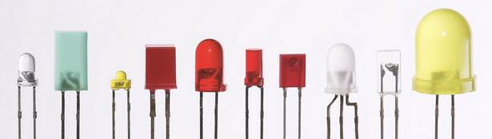

**LED模块:** 是一种用于输出的设备，用于控制LED灯的亮度和闪烁，可以直接插入开发板的数字输出引脚上使用。

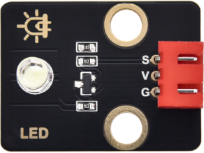

**原理图：** 当S处为高电平时，Q1三极管导通，电流通过LED（LED两端有一定的电压），LED此时会亮起来，反之相反。


**参数：**

- 工作电压: DC 3.3V~5V
- 工作电流: (Max)1.5mA@5V
- 最大功率: 0.0075W

### 2.1.3 接线图

**模块连接到io27**

**⚠️注意：使用连接线连接时，黄色线为S信号线，红色线为V电源线，黑色线为GND，颜色一一对应，请勿插反！**


### 2.1.4 实验代码

代码文件在`KidsBlock(Scratch)_代码`文件夹中（<u>路径：重要资源\程序代码\KidsBlock(Scratch)_代码</u>），代码文件为`2_1_LED_Blinking.sb3`，如图：

单击 “**文件**” --> “**从电脑中上传**”，然后选择保存代码的路径，选中代码文件打开即可，如下图所示：

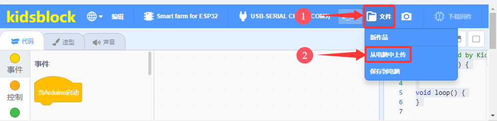

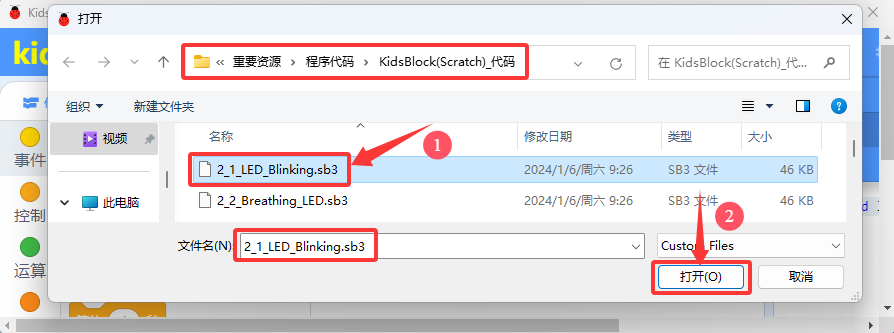

**认识新代码块**

① 这个代码块，表示当启动ESP32这块开发板时，将运行代码。


② 循环语句，顾名思义就是重复做一件事。


③ 向LED指定引脚设置“高”或“低”，选择“高”代表给该引脚设置高电平，有电压，有电流，则LED点亮；选择“低”代表给引脚设置低电平，没电压，没有电流，则LED不亮。 


④ 将程序的执行暂停一段时间，也就是延时。单位是秒。 


**组合代码块**

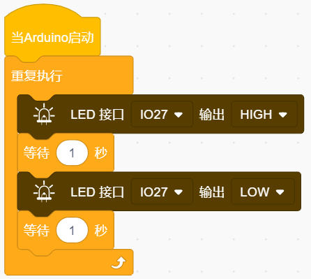

### 2.1.5 实验结果

按照接线图接好线，选择好正确的开发板板型（ESP32 Dev Module）和 适当的串口端口（COMxx），然后单击按钮上传代码。上传代码成功后，可以看到LED每隔一秒闪烁，这是因为ESP32开发板的io27，每隔一秒输出高电平和低电平。通过LED模块，我们可以实现各种有趣的互动式应用，例如呼吸灯效果、流水灯效果、警灯效果等等。（如果你对上传代码存在疑惑，请查看教程的`1.3 编写代码并上传`）

| 电平 | 功能  |
| :--: | :---: |
| HIGH | LED亮 |
| LOW  | LED灭 |


### 2.1.6 代码说明

（1）.分配 `LED` 的数字引脚为 `IO27`，设置LED数字引脚为高电平，使LED点亮。


（2）.延时1秒。


（3）.分配 `LED` 的数字引脚为 `IO27`，设置LED数字引脚为低电平，使LED不亮。


（4）. LED亮1秒，熄灭1秒，并且不断地重复循环。

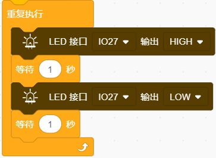

---------------

## 2.2 LED灯调节亮度

### 2.2.1 简介

本课程将引导您深入了解如何利用脉宽调制（PWM）技术来调节LED灯的亮度。PWM是一种通过快速切换电源来改变LED亮度的高效方法，它通过调整信号的占空比来控制LED的平均电流，从而实现亮度的无级调节。课程内容包括PWM原理、电路设计、编程实现及实际应用案例，旨在帮助学员掌握LED亮度控制的核心技术，并能够应用于各种电子项目中。

### 2.2.2 PWM原理

脉宽调制(PWM)是一种利用数字信号控制模拟电路的有效方法。普通处理器不能直接输出模拟信号。PWM技术使这种转换(将数字信号转换为模拟信号)非常方便。PWM技术利用数字引脚发送一定频率的方波，即高电平和低电平的输出，交替持续一段时间。每一组高电平和低电平的总时间一般是固定的，称为周期(注:周期的倒数是频率)。高电平输出的时间通常称为脉宽，占空比是脉宽(PW)与波形总周期(T)之比的百分比。高电平输出持续时间越长，占空比越长，模拟信号中相应的电压也就越高。下图显示了对应于脉冲宽度0%-100%的模拟信号电压在0V-3.3V(高电平为3.3V)之间的变化情况.


脉宽调制有许多应用，如灯亮度调节，电机调速，声音制造等。以下是PMW的三个基本参数。


1\. 占空比：信号在某一时间段内处于高水平时，占时间的百分比。

2\. 脉冲周期(一秒内脉冲频率的倒数)

3\. 在ESP32上，LEDC(PWM)控制器有16个独立通道，每个通道可以独立控制频率，占空比，甚至精度。

PWM占空比越长，输出功率越高。既然我们了解了这种关系，我们就可以用PWM来控制LED的亮度或直流电机的速度等等。从上面可以看出，PWM并不是真实的模拟信号，电压的有效值等于相应的模拟信号。因此，我们可以控制LED和其他输出模块的输出功率，以达到不同的效果。

**ESP32 与 PWM**

在ESP32上，LEDC(PWM)控制器有16个独立通道，每个通道可以独立控制频率，占空比，甚至精度。与传统的PWM引脚不同，ESP32的PWM输出引脚是可配置的，每个通道有一个或多个PWM输出引脚。最大频率与比特精度的关系如下公式所示：

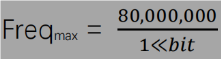

其中比特的最大值为31。例如,生成PWM的8位精度(2ˆ8 = 256。取值范围为0 ~ 255)，最大频率为80,000,000/255 = 312,500Hz。)

### 2.2.3 接线图

**模块连接到io27**

**⚠️注意：使用连接线连接时，黄色线为S信号线，红色线为V电源线，黑色线为GND，颜色一一对应，请勿插反！**


### 2.2.4 实验代码

代码文件在`KidsBlock(Scratch)_代码`文件夹中（<u>路径：重要资源\程序代码\KidsBlock(Scratch)_代码</u>），代码文件为`2_2_Breathing_LED.sb3`，如图：

单击 “**文件**” --> “**从电脑中上传**”，然后选择保存代码的路径，选中代码文件打开即可，如下图所示：


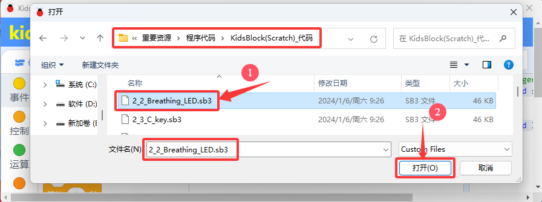


**认识代码块**

① 这个代码块，表示当启动ESP32这块开发板时，将运行代码。


② 创建变量。

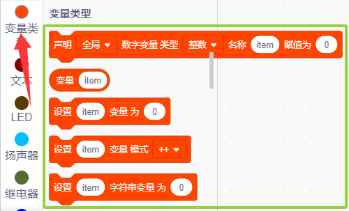

这是创建“<span style="color: rgb(255, 76, 65);">变量</span>”的指令方块，可以声明“全局”或“局部”，还可以设置变量的类型、名称和赋值，item是变量名称。


获取变量item。


设置变量item模式为每执行一次循环让item加1或每执行一次循环让item减1。 


③ 循环语句，顾名思义就是重复做一件事。


④ 有条件的循环控制语句，当满足循环次数时就退出循环，比如：10表示循环执行10次，数字10是可以改成其他数字的。
 
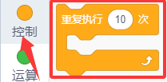

⑤ 向LED指定引脚设置输出PWM代码块，只需要设置对应的引脚，通道（一共有16个通道（0~15））和模拟输出数值，就可以输出PWM值）

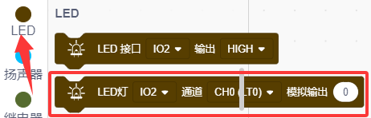

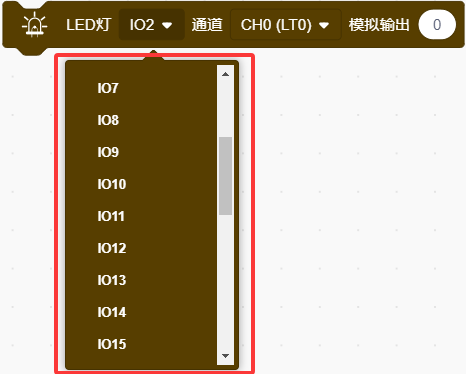

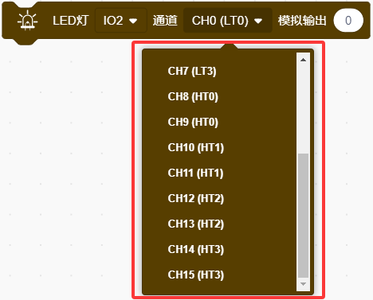

⑥ 将程序的执行暂停一段时间，也就是延时。单位是秒。 


**组合代码块**

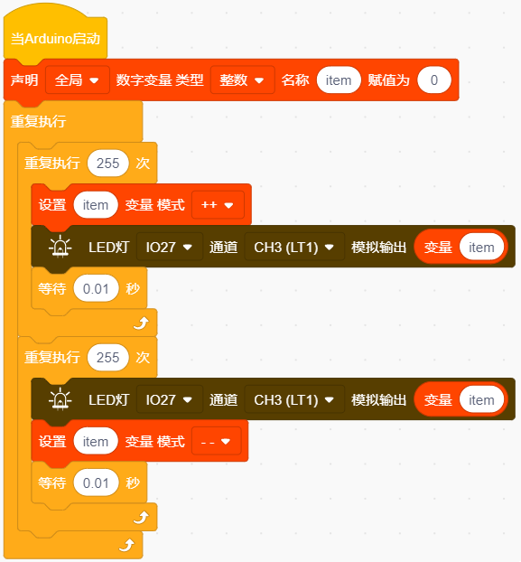

### 2.2.6 实验结果

按照接线图接好线，选择好正确的开发板板型（ESP32 Dev Module）和 适当的串口端口（COMxx），然后单击按钮上传代码。上传代码成功后，即可实现LED灯从暗慢慢变亮，然后再由亮慢慢变暗，以此循环的现象。（如果你对上传代码存在疑惑，请查看教程的`1.3 编写代码并上传`）


### 2.2.7 代码说明

（1）.将LED灯从暗慢慢变亮，也就是让变量item从0逐渐加1，共加255次。

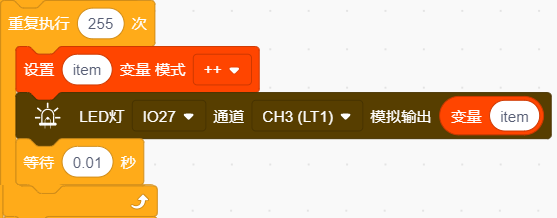


（2）.将LED灯从亮慢慢变暗，也就是让变量item从255逐渐减1，共减255次。

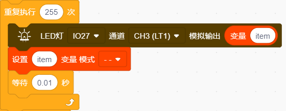

----------

## 2.3 无源蜂鸣器

### 2.3.1 简介

本教程将为您详细介绍无源蜂鸣器的使用方法和应用技巧。无源蜂鸣器是一种需要外部驱动信号才能发声的电子元件，其内部不含振荡源，因此可以通过改变输入信号的频率来产生不同音调的声音。教程内容包括无源蜂鸣器的工作原理、引脚识别、电路连接方法以及如何通过微控制器（如ESP32）生成不同频率的方波信号来控制蜂鸣器。您将学习如何编写代码来实现简单的音乐播放、报警信号和自定义音效。无论您是电子初学者还是有经验的开发者，本教程都将帮助您掌握无源蜂鸣器的应用，为您的项目增添丰富的声音效果。

### 2.3.2 元件知识


**无源蜂鸣器：** 是一种内部没有振动源的集成电子蜂鸣器，只有给它一定频率的`方波信号`，才能让五源蜂鸣器发声，同时，输入的方波频率不同，发出的声音也不同，所以无源蜂鸣器可以模拟曲调实现音乐效果。

  - 引脚的电平变化可以模拟方波，例如引脚高电平持续500微秒后，再变换为低电平500微秒，紧接着再变换为高电平…
  
  - **以2~5KHz的方波去驱动无源蜂鸣器，方波的赫兹可以通过公式 f=1/T，其中f为频率，T为一个完整的周期所用时间（即高低电平各持续的时间之和）来计算。**

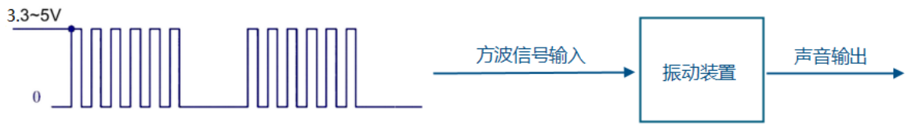

<span style="color: rgb(255, 76, 65);">注: 我们提供的无源蜂鸣器的谐振频率为2048Hz，这意味着这个无源蜂鸣器的谐振频率为2048Hz时声音最大。</span>

**C调符与频率对照表：**

|    调符     | 频率(Hz) |      调符      | 频率(Hz) |     调符     | 频率(Hz) |
| :---------: | :-----------: | :------------: | :-----------: | :----------: | :-----------: |
| Flat  1  Do |      262      | Natural  1  Do |      523      | Sharp  1  Do |     1047      |
| Flat  2  Re |      294      | Natural  2  Re |      587      | Sharp  2  Re |     1175      |
| Flat  3  Mi |      330      | Natural  3  Mi |      659      | Sharp  3  Mi |     1319      |
| Flat  4  Fa |      349      | Natural  4  Fa |      698      | Sharp  4  Fa |     1397      |
| Flat  5  So |      392      | Natural  5  So |      784      | Sharp  5  So |     1568      |
| Flat  6  La |      440      | Natural  6  La |      880      | Sharp  6  La |     1760      |
| Flat  7  Si |      494      | Natural  7  Si |      988      | Sharp  7  Si |     1967      |

**原理图：**

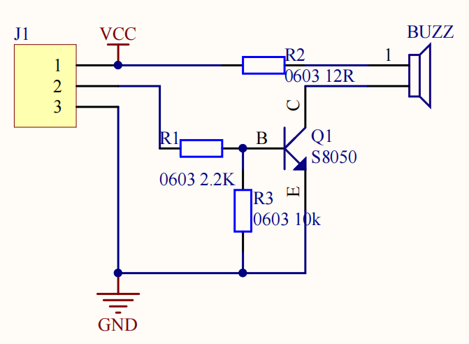


**参数：**

- 工作电压: DC 3.3V~5V
- 工作电流: (Max) 30mA@5V
- 最大功率: 0.15W
- 谐振频率: 2048Hz
- 输出音压: (Min)80dB/10cm
- 控制信号: 方波


### 2.3.3 接线图

**模块连接到io16**

**注意使用连接线连接时，黄色线为S信号线，红色线为V电源线，黑色线为GND，颜色一一对应，请勿插反！**

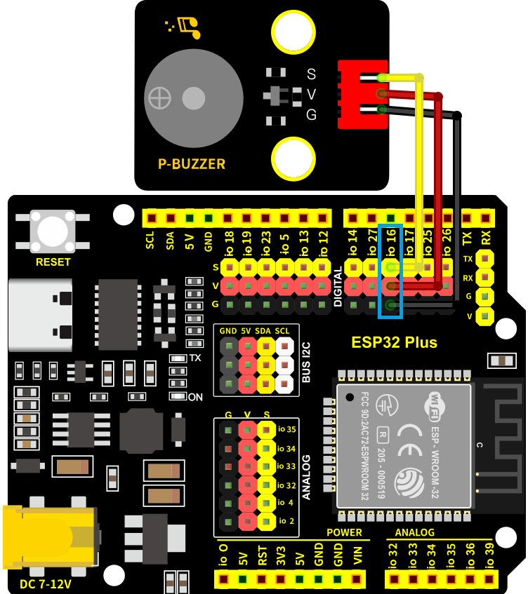

### 2.3.4 实验代码

代码文件在`KidsBlock(Scratch)_代码`文件夹中（<u>路径：重要资源\程序代码\KidsBlock(Scratch)_代码</u>），代码文件为`2_3_C_key.sb3`，如图：

单击 “**文件**” --> “**从电脑中上传**”，然后选择保存代码的路径，选中代码文件打开即可，如下图所示：


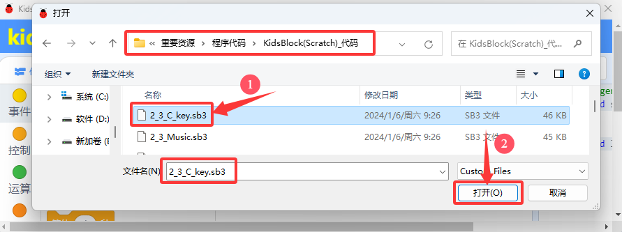

**认识代码块**

① 这个代码块，表示当启动ESP32这块开发板时，将运行代码。


② 循环语句，顾名思义就是重复做一件事。


③ 这是扬声器的一些代码块。
 
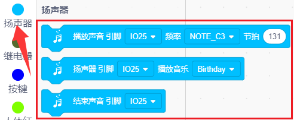

这是播放声音的代码块，可以设置对应引脚，频率和节拍。引脚，频率和节拍可以根据自己的需要自己设置。


这是播放音乐的代码块，可以设置对应引脚和音乐。引脚和音乐可以根据自己的需要自己设置。


结束声音，使蜂鸣器不响。


④ 将程序的执行暂停一段时间，也就是延时。单位是秒。 


**组合代码块**

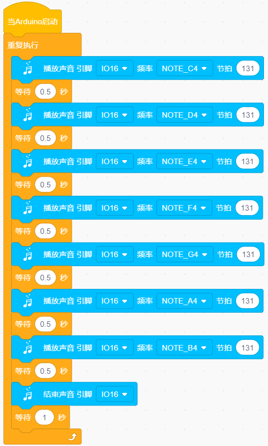

### 2.3.5 实验结果

按照接线图接好线，选择好正确的开发板板型（ESP32 Dev Module）和 适当的串口端口（COMxx），然后单击按钮上传代码。上传代码成功后，即可实现无源蜂鸣器播放出C调的Do，Re，Mi，Fa，So，La，Si，以此循环的现象。（如果你对上传代码存在疑惑，请查看教程的`1.3 编写代码并上传`）


### 2.3.6 扩展知识

我们学习了如何控制无源蜂鸣器发出C调的音，那么接下来就利用C调组合出一首简单的生日快乐歌吧！

**接线保持不变**

**简谱：**


**低中高音对照图：**


**实验代码：**

代码文件在`KidsBlock(Scratch)_代码`文件夹中（<u>路径：重要资源\程序代码\KidsBlock(Scratch)_代码</u>），代码文件为`2_3_Music.sb3`，如图：

单击 “**文件**” --> “**从电脑中上传**”，然后选择保存代码的路径，选中代码文件打开即可，如下图所示：


**认识代码块**

① 这个代码块，表示当启动ESP32这块开发板时，将运行代码。


② 循环语句，顾名思义就是重复做一件事。


③ 这是扬声器的一些代码块。
 


这是播放音乐的代码块，可以设置对应引脚和音乐。


结束声音，使蜂鸣器不响。


④ 将程序的执行暂停一段时间，也就是延时。单位是秒。 


**组合代码块**

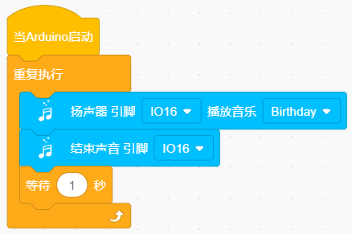

### 2.3.7 代码说明

（1）.设置扬声器的对应引脚，播放频率和节拍这里设置引脚为IO16，频率为NOTE_C4，节拍为131，。延时0.5秒。


（2）.扬声器停止发声1秒。


（3）.设置扬声器播放一首生日歌，之后扬声器停止发声1秒。


---------

## 2.4 继电器+水泵

### 2.4.1 简介

本教程将为您详细介绍5V继电器模块和水泵模块的使用方法和应用技巧。水泵模块是一种用于输送液体的设备，广泛应用于农业灌溉、水族箱管理和工业流体控制；5V继电器模块是一种电子开关设备，能够通过低电压控制高电压或大电流电路的通断。教程内容包括水泵模块和5V继电器模块的工作原理、引脚功能、电路连接方法以及如何通过微控制器（如ESP32）控制控制继电器的开关状态从而最终控制水泵的开关和运行状态。您将学习如何编写代码来实现继电器的自动控制水泵模块，并应用于各种场景，如农业灌溉、水族箱管理和工业流体控制。无论您是电子初学者还是有经验的开发者，本教程都将帮助您掌握5V继电器模块和水泵模块的应用，为您的项目增添高效的液体输送解决方案。

### 2.4.2 元件知识

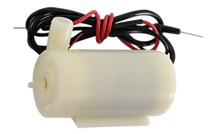

水泵模块基于电机的工作原理，通过电机驱动叶轮或活塞运动，将液体从低压区域输送到高压区域。其核心是将电能转换为机械能，再转换为液体的动能，广泛应用于家用、农业、工业等领域。

<span style="color: rgb(255, 76, 65);">注意：</span>水泵跟电机一样是不能直接使用开发板的IO口进行驱动的，否则将可能会烧坏开发板。

**水泵拆解图：**

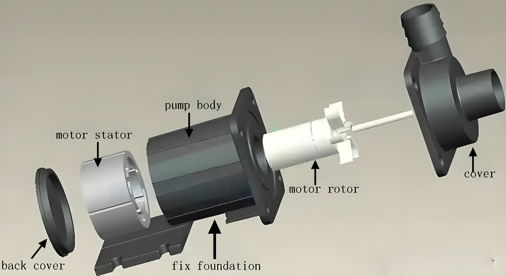

**继电器：** 继电器是一种利用低功耗电路控制大功率电路的安全开关。它由电磁铁和触点组成。电磁铁采用低功耗电路控制，大功率电路采用触点控制。当电磁铁通电时，它会吸引触点。下面是一个常用继电器的示意图:


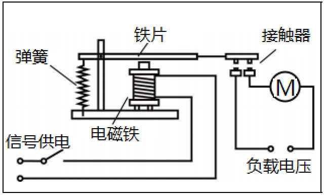

**工作原理图：**


一个继电器拥有一个动触点以及两个静触点A和B。

当开关K断开时，继电器线路无电流通过，此时动触点与静触点B相接触，上半部分的电路导通。静触点B被称为常闭触点（NC）。常闭——NC（normal close）通常情况下是关合状态，即线圈未得电的情况下闭合的。

当开关K闭合时，继电器电路通过电流产生磁力，此时动触点与静触点A相接触，下半部分电路导通。静触点A被称为常开触点（NO）。常开——NO（normal open）通常情况下是断开状态，即线圈未得电的情况下断开的。

而动触点也被称为公共触点（COM）。

继电器简单来说就是一个开关，VCC表示电源正极、GND表示电源负极、IN表示信号输入脚，COM表示公共端，NC（normal close）表示常闭端，NO(normal open)表示常开端。

继电器能兼容多种单片机控制板，是用小电流去控制大电流运作的一种“自动开关”。它可以让单片机控制板驱动3A以下负载，如LED灯带、直流马达、微型水泵、电磁阀可插拔式接口设计，方便使用。

**规格参数：**

- 供电电压：5V
- 静态电流：2mA
- 最高触点电压：250VAC/30VDC
- 最大电流：10A

**模块原理图：**


### 2.4.3 接线图

- **继电器模块连接到io25，继电器的NC端，连接到io2引脚接口的黑色的GND**

- **水泵：**
  - **红色线连接到3V3电源，如图所示**
  - **黑色线GND连接到继电器的COM端，如图所示**

**注意使用连接线连接时，黄色线为S信号线，红色线为V电源线，黑色线为GND，颜色一一对应，请勿插反！**


### 2.4.4 实验代码

代码文件在`KidsBlock(Scratch)_代码`文件夹中（<u>路径：重要资源\程序代码\KidsBlock(Scratch)_代码</u>），代码文件为`2_4_Water_Pump.sb3`，如图：

单击 “**文件**” --> “**从电脑中上传**”，然后选择保存代码的路径，选中代码文件打开即可，如下图所示：


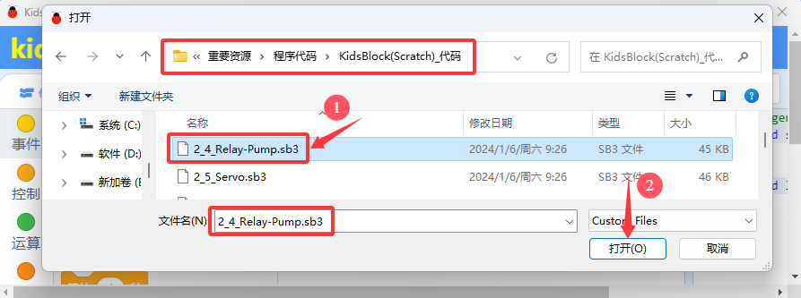

**认识代码块**

① 这个代码块，表示当启动ESP32这块开发板时，将运行代码。


② 向继电器指定引脚设置“高”或“低”，选择“高”代表给该引脚设置高电平，有电压，有电流，则继电器吸合；选择“低”代表给引脚设置低电平，没电压，没有电流，则继电器断开。 

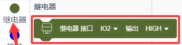

③ 将程序的执行暂停一段时间，也就是延时。单位是秒。 


**组合代码块**

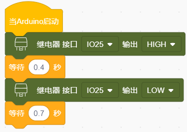


### 2.4.5 实验结果

按照接线图接好线，选择好正确的开发板板型（ESP32 Dev Module）和 适当的串口端口（COMxx），然后单击按钮上传代码。上传代码成功后，则继电器控制水泵会进行一次抽水。


（如果你对上传代码存在疑惑，请查看教程的`1.3 编写代码并上传`)

通过这个项目，我们可以实现自动化的抽水泵控制，从而减少手动操作的时间和精力成本，提高生产效率。这种方法可以应用于多个领域，例如农业生产、水处理等。

### 2.4.6 代码说明

| 代码                | 说明                                                         |
| ------------------- | ------------------------------------------------------------ |
| char content         | 定义一个字符串，用于存储串口接收到的值 |
| Serial.begin(9600)  | 设置波特率为9600          |
| Serial.available( ) | 获取串口上可读取的数据的字节数，该数据已经到达并存储在接收缓存（共有64字节）中。Serial.available() > 0表示串口接收到了数据，可以读取。 |
| Serial.read( )      | 读取写入的串行数据。      |
| if( ){ }      | 如果“（ ）”里的条件满足，则执行“{ }”里的程序。    |

-------------------

## 2.5 舵机模块

### 2.5.1 简介

本教程将为您详细介绍舵机模块的使用方法和应用技巧。舵机是一种能够精确控制角度的电机，广泛应用于机器人、遥控模型和自动化设备中。教程内容包括舵机的工作原理、引脚功能、电路连接方法以及如何通过微控制器（如ESP32）控制舵机的转动角度。您将学习如何编写代码来实现舵机的精确位置控制、平滑运动以及多舵机协同工作。无论您是电子初学者还是有经验的开发者，本教程都将帮助您掌握舵机模块的应用，为您的项目增添灵活的机械控制功能。

### 2.5.2 元件知识


**控制原理**：舵机的转动的角度是通过调节PWM（脉冲宽度调制）信号的占空比来实现的，标准PWM（脉冲宽度调制）信号的周期固定为20ms（50Hz)，理论上脉宽分布应在1ms到2ms 之间，但是，事实上脉宽可由0.5ms 到2.5ms 之间，脉宽和舵机的转角0°～180°相对应。有一点值得注意的地方，由于舵机牌子不同，对于同一信号，不同牌子的舵机旋转的角度也会有所不同

**引脚介绍：**


**GND：** 一个接地的引脚，棕色

**VCC：** 一个连接到+5v电源的引脚，红色

**S：** 信号端的引脚，PWM信号控制，橙色

**内部结构图：**


- 信号线：接收来自微控制器的控制信号；

- 电位器：可以测量输出轴的位置量，属于整个舵机机构的反馈部分；

- 内部控制器：处理来自外部控制的信号，驱动电机以及处理反馈的位置信号，是整个伺服机构的核心；

- 直流电机：作为执行机构，输出多少转速，转矩，位置；

- 传动机构/舵机系统：该机构根据一定传动比，将电机输出的行程缩放到最终输出的角度上。


**驱动舵机：**

通过向舵机的信号信号线发送PWM信号来控制舵机的输出量，**PWM脉冲的占空比直接决定了输出轴的位置。**

**例如（这里以180°舵机为例）：**

- 当我们向180°舵机发送脉冲宽度为1.5毫秒（ms）的信号时，舵机的输出轴将移至中间位置（90度）；

- 脉冲宽度为`0.5ms`时，舵机的输出轴将移至最小的位置（0度）；

- 脉冲宽度为`2.5ms`时，舵机的输出轴将移至最大的位置（180度）；


舵机的周期通常为20毫秒，希望以`50Hz`的频率产生脉冲，但是许多伺服器在40至200 Hz的范围内也都能正常工作。

<span style="color: rgb(255, 76, 65);">注:不同类型和品牌的舵机之间最大位置和最小位置的角度可能会不同。许多舵机仅旋转约170度(或者只有90度)，但宽度为1.5ms的伺服脉冲通常会将伺服设置为中间位置(通常是指定全范围的一半)。</span>

### 2.5.3 接线图

**模块连接到io26**

**注意使用连接线连接时，黄色线为S信号线，红色线为V电源线，黑色线为GND，颜色一一对应，请勿插反！**

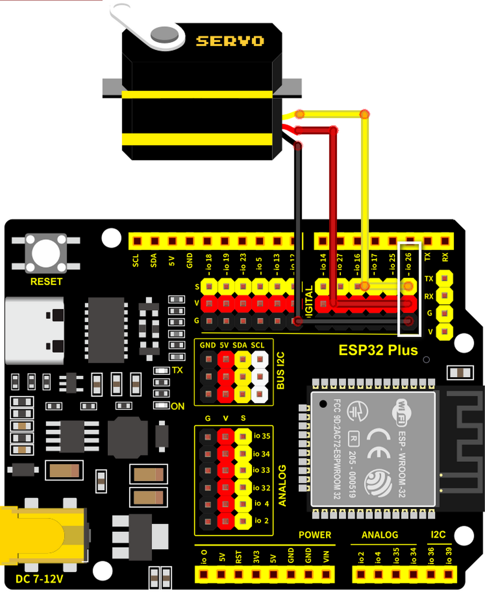


### 2.5.4 实验代码

代码文件在`KidsBlock(Scratch)_代码`文件夹中（<u>路径：重要资源\程序代码\KidsBlock(Scratch)_代码</u>），代码文件为`2_5_Servo.sb3`，如图：

单击 “**文件**” --> “**从电脑中上传**”，然后选择保存代码的路径，选中代码文件打开即可，如下图所示：


**认识代码块**

① 这个代码块，表示当启动ESP32这块开发板时，将运行代码。


② 创建变量。


这是创建“<span style="color: rgb(255, 76, 65);">变量</span>”的指令方块，可以声明“全局”或“局部”，还可以设置变量的类型、名称和赋值，item是变量名称。


获取变量item。


设置变量item模式为每执行一次循环让item加1或每执行一次循环让item减1。 


③ 循环语句，顾名思义就是重复做一件事。


④ 有条件的循环控制语句，当满足循环次数时就退出循环，比如：10表示循环执行10次，数字10是可以改成其他数字的。
 


⑤ 向舵机指定引脚设置输角度代码块，只需要设置对应的引脚，通道（一共有16个通道（0~15）），角度和延时，就可以输出角度）


⑥ 将程序的执行暂停一段时间，也就是延时。单位是秒。 


**组合代码块**

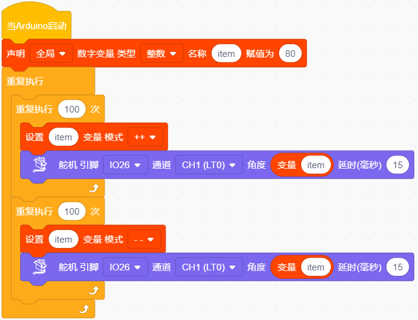


### 2.5.5 实验结果

按照接线图接好线，选择好正确的开发板板型（ESP32 Dev Module）和 适当的串口端口（COMxx），然后单击按钮上传代码。上传代码成功后可以看到饲料盒在慢慢打开，慢慢关闭，实现可控制的。（如果你对上传代码存在疑惑，请查看教程的`1.3 编写代码并上传`）

<span style="color: rgb(255, 76, 65);">注意：SG90舵机是180度，在套件中的饲料盒较小，SG90舵机只需旋转100度，就能完全关闭饲料盒。</span>

- 80度：完全打开。
- 120度：打开一半。
- 180度：关闭。


<span style="color: rgb(255, 76, 65);">注意：请勿将手指伸入到饲料盒中，谨防夹伤！请勿将其他物体堵住饲料盒盖，以免弄坏舵机。</span>

### 2.5.6 代码解释


（1）.定义一个变量**item**，初始值为80.


（2）.把**item**设定为舵机的角度，从80度旋转到180度，每15毫秒旋转一度，重复100次。


（3）. 舵机角度从180度旋转到80度，每15毫秒旋转一度，重复100次。


------

## 2.6 风扇模块

### 2.6.1 简介

本教程将为您详细介绍风扇模块的使用方法和应用技巧。风扇模块是一种常见的散热设备，通过直流电机驱动扇叶旋转，产生气流以降低温度。教程内容包括风扇模块的工作原理、引脚功能、电路连接方法以及如何通过微控制器（如ESP32）控制风扇的开关和转速。您将学习如何编写代码来实现风扇的自动控制，并应用于各种场景，如温度调节、通风系统和电子设备散热。无论您是电子初学者还是有经验的开发者，本教程都将帮助您掌握风扇模块的应用，为您的项目增添有效的散热解决方案。

### 2.6.2 元件知识

130电机风扇模块上有个直流电机，直流电机的工作原理是基于电磁感应和洛伦兹力。其核心结构包括定子、转子和换向器。定子产生固定磁场，转子（电枢）由线圈绕组组成，通电后产生磁场。当电流通过电刷和换向器进入转子线圈时，转子磁场与定子磁场相互作用，产生洛伦兹力，推动转子旋转。换向器在转子旋转时切换电流方向，确保转子持续受到同方向的力，从而维持旋转。通过电磁感应和洛伦兹力的作用，直流电机将电能转换为机械能，实现能量转换。由于其调速性能好、启动扭矩大，直流电机广泛应用于电动工具、电动汽车和家用电器等领域。


130电机风扇模块是一种可以通过PWM调速的模块，使用时需要接两个引脚进行控制。该模块适用于需要调节风扇速度的应用场景，例如电脑散热、工业生产等。它小巧轻便、安装简单，是一种十分实用的模块。


**原理图：**


HR1124S芯片的作用是助于驱动电机，而电机所需电流较大，无法用三极管驱动更无法直接用IO口驱动。让电机转动起来的方法很简单，给电机两端添加电压即可。不同电压方向电机转向也不相同，在额度电压内，电压越大，电机转动得越快；反之电压越低，电机转动得越慢，甚至无法转动。控制方式有两种：一种是高低电平控制（控制转动和停止），一种是PWM控制（控制转速）。

**参数：**

- 工作电压: DC 5V
- 工作电流: (Max)400mA@5V
- 最大功率: 2W
- 转速: (16000+10%) 转/分@5V


### 2.6.3 接线图

**电机模块的IN-连接到io18，IN+连接到io19**

**注意使用连接线连接时，黄色线为S信号线，红色线为V电源线，黑色线为GND，颜色一一对应，请勿插反！**


### 2.6.4  实验代码

代码文件在`KidsBlock(Scratch)_代码`文件夹中（<u>路径：重要资源\程序代码\KidsBlock(Scratch)_代码</u>），代码文件为`2_6_Motor.sb3`，如图：

单击 “**文件**” --> “**从电脑中上传**”，然后选择保存代码的路径，选中代码文件打开即可，如下图所示：


**认识代码块**

① 这个代码块，表示当启动ESP32这块开发板时，将运行代码。


② 循环语句，顾名思义就是重复做一件事。


③ 向电机(风扇)模块设置引脚INA的高低电平状态，高低电平决定了风扇的正反转；设置引脚INB的模拟输出，决定风扇的转速。


④ 将程序的执行暂停一段时间，也就是延时。单位是秒。 


**组合代码块**

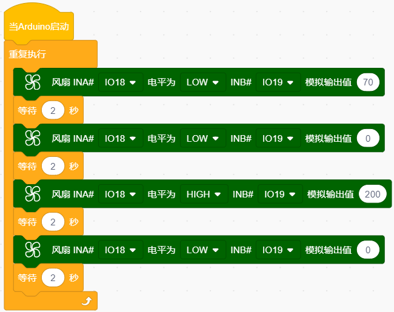

### 2.6.5  实验结果

按照接线图接好线，选择好正确的开发板板型（ESP32 Dev Module）和 适当的串口端口（COMxx），然后单击按钮上传代码。上传代码成功后可以看到130电机模块上的风扇，每隔2秒，逆时针和顺时针交替旋转。（如果你对上传代码存在疑惑，请查看教程的`1.3 编写代码并上传`）

**注意：电机在进行正反转时，间歇性的停止，为了防止正反转的瞬间，电机电流过大，导致开发板供电不足，而被迫复位，一定要保证外接电源，并且还要保证外接电源电压比较足。**


### 2.6.6  代码解释

（1）.向电机(风扇)模块设置引脚INA的高低电平状态，高低电平决定了风扇的正反转；设置引脚INB的模拟输出，决定风扇的转速。

- 设置引脚**INA**

 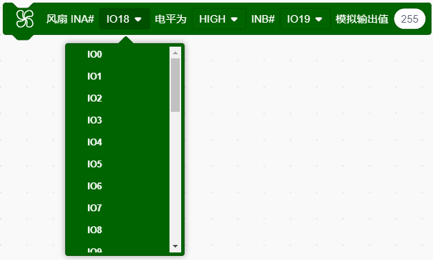

- 设置引脚**INA**的高低电平状态，高低电平决定了风扇的正反转。


- 设置引脚**INB**

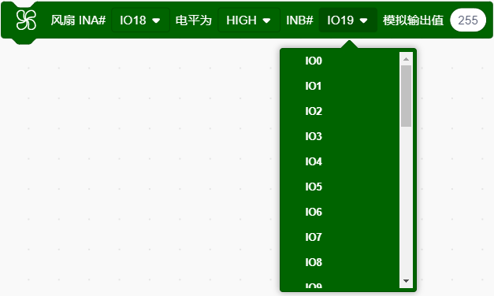

- 设置引脚**INB**的模拟输出，决定风扇的转速。

  - 在INA引脚为高电平状态时，INB模拟输出越小，风扇越快。

  - 在INA引脚为低电平状态时，INB模拟输出越大，风扇越快。

   

（2）.逆时针转动2秒


（3）.停止2秒，停止的目的: 防止正反转的瞬间，电机电流过大，导致开发板供电不足，而被迫复位。


（4）.顺时针转动2秒


------

## 2.7 按键模块

### 2.7.1 简介

本教程将为您详细介绍按键的使用方法和应用技巧。按键是一种常见的电子输入设备，用于在电路中实现手动控制。教程内容包括按键的工作原理、电路连接方法以及如何通过微控制器（如ESP32）读取按键状态。您将学习如何编写代码来检测按键的按下和释放，并实现各种控制功能，如开关控制、模式切换和用户输入响应。无论您是电子初学者还是有经验的开发者，本教程都将帮助您掌握按键的应用，为您的项目增添交互性和控制功能。

### 2.7.2 元件知识

**按键模块：** 按键模块可以控制电路的通断，把按键接入电路中，不按下按键的时候电路是断开的，按下按键电路就通啦，但是松开之后就又断了。按键模块是一种简单易用的输入设备，通过微控制器（如ESP32）可以读取到它的高低电平，

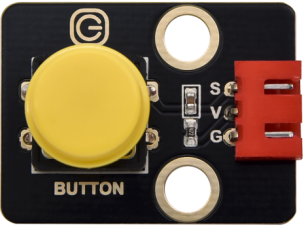

**原理图：**

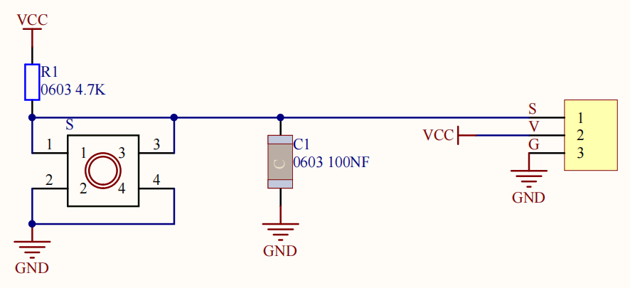

**参数：**

- 工作电压: DC 3.3V~5V
- 工作电流: (Max) 1.1mA@5V
- 最大功率: 5.5mW
- 信号类型: 数字信号(0或1)

**按键模块的原理是基于按键的开关电路。**

- **当按键被按下时**，开关会闭合，使得电流可以通过按键到GND，从而使开发板的数字输入引脚，检测到一个逻辑低电平信号。

- **当按键没有被按下时**，开关处于断开状态，引脚被上拉电阻拉高，数字输入引脚检测到逻辑高电平信号。

### 2.7.3 接线图

**模块连接到io5**

**注意: 使用连接线连接时，黄色线为S信号线，红色线为V电源线，黑色线为GND，颜色一一对应，请勿插反！**

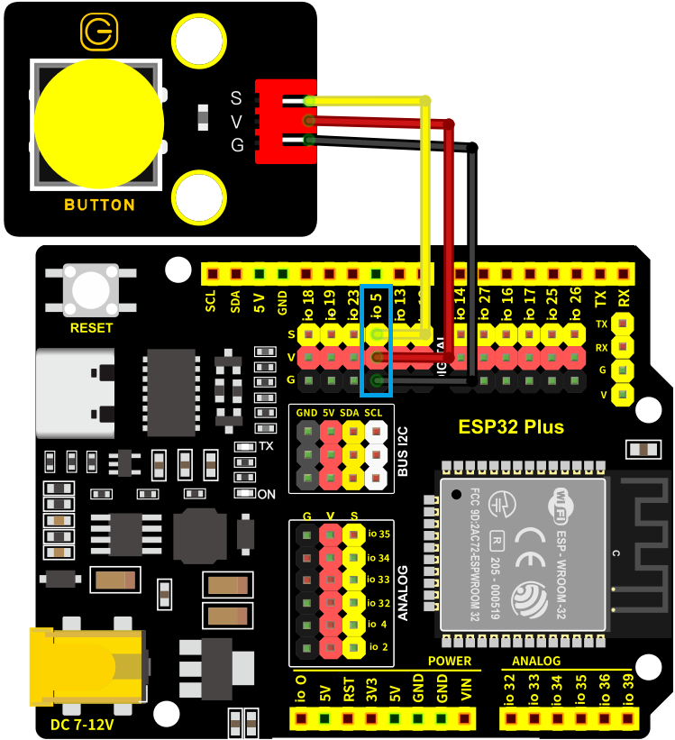

### 2.7.4 实验代码

代码文件在`KidsBlock(Scratch)_代码`文件夹中（<u>路径：重要资源\程序代码\KidsBlock(Scratch)_代码</u>），代码文件为`2_7_Read_Button.sb3`，如图：

单击 “**文件**” --> “**从电脑中上传**”，然后选择保存代码的路径，选中代码文件打开即可，如下图所示：


**认识代码块**

① 这个代码块，表示当启动ESP32这块开发板时，将运行代码。


② 设置串口。

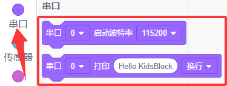

设置串口波特率，一般波特率设置为`9600`或`115200`。


串口输出数据，从串行端口输出数据，分换行与不换行两种方式。


③ 向指定引脚设置“输入”或“输出”，选择“输入”代表给该引脚设置输入模式；选择“输出”代表给引脚设置输出模式；选择“输入上拉”代表给该引脚设置输入模式并且使该引脚变成高电平。

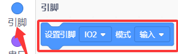

④ 循环语句，顾名思义就是重复做一件事。


⑤ 这是按键相关代码块

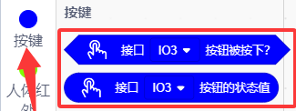

这是按钮被按下的代码块。


这是读取按键的高低电平值


⑥ 比较运算符，比较左右的大小。


⑦ 这是简单的条件判断语句，如果里的表达式为真，则执行 “那么” 块内的代码。如果里表达式为假 ，则执行 “否则” 块内的代码。 

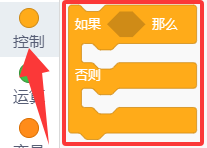

⑧ 将程序的执行暂停一段时间，也就是延时。单位是秒。 


**组合代码块**

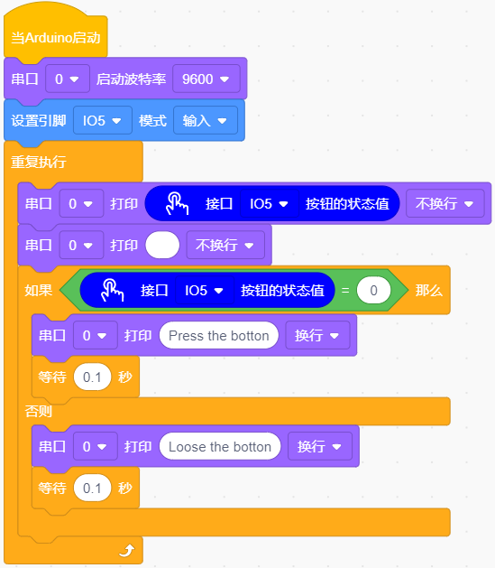

### 2.7.5 实验结果

按照接线图接好线，选择好正确的开发板板型（ESP32 Dev Module）和 适当的串口端口（COMxx），然后单击按钮上传代码。上传代码成功后，单击KidsBlock IDE右下角的打开串监视器串口并设置串口波特率为`9600`, 即可通过串口打印窗口查看按键的状态，当按键按下时串口打印val值为`0`并打印提示语`Button Down!` ; 松开按键时串口打印val值为`1`并串口打印提示语`Release the button!`。

（如果你对上传代码存在疑惑，请查看教程的`1.3 编写代码并上传`)

**串口现象图：**

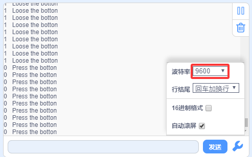

### 2.7.6 代码说明

（1）. 设置串口波特率和按键的引脚为输入模式。


（2）. 串口打印读取的按键高低电平。


（3）. 判断按键的状态。

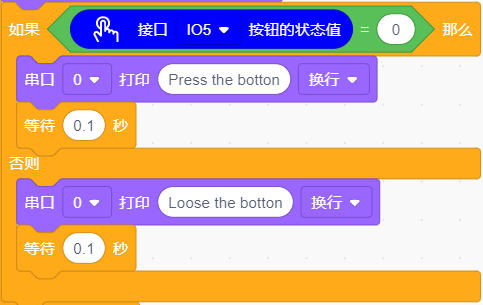


--------------

## 2.8 人体红外热释电传感器

### 2.8.1 简介

本教程将为您详细介绍人体红外热释电传感器的使用方法和应用技巧。人体红外传感器是一种常见的电子输入设备，用于在电路中实现手动控制。教程内容包括人体红外热释电传感器的工作原理、电路连接方法以及如何通过微控制器（如ESP32）读取按键状态。您将学习如何编写代码来检测人体红外热释电传感器是否检测到人体移动，并实现各种控制功能，如防盗警报和用户输入响应等。无论您是电子初学者还是有经验的开发者，本教程都将帮助您掌握人体红外传感器的应用，为您的项目增添交互性和控制功能。

### 2.8.2 元件知识

**人体红外热释电传感器：** 是一款基于热释电效应的人体红外传感器，通过检测人体或其他温血动物发射的红外辐射来感知物体的存在，当人体移动引起红外辐射强度变化时，传感器上的热释电元件表面电荷平衡被打破，释放电荷并转化为微电压信号‌。配合菲涅尔透镜能使传感器探测范围更远更广，广泛应用于智能家居、智能安防等领域。

实验中，通过读取模块上S端高低电平，判断附近是否有人在移动；并且在串口监视器上显示测试结果。


**原理图：**


这个模块的原理图可能较前面的模块稍复杂，我们一部分一部分来看。先看电压转换部分，作用是将5V输入电压转换为3.3V输入电压。因为我们模块上用到的热释电红外传感器的工作电压是3.3V，不能直接用5V电压供电使用。有了这个电压转换部分，3.3V输入电压和5V输入电压都适用于此热释电红外传感器。

当红外热释传感器没有检测到红外信号时，红外热释传感器的1脚输出低电平，此时模块上的LED两端有电压差，有电流流过，LED被点亮，MOS管Q1导通（Q1是NPN MOS管，型号为2N7002。由于红外热释传感器的1脚输出低电平，所以Q1的源极Vs=0，而Q1的栅极Vg=3.3V，于是Q1的栅极G和Q1的源极S之间的电压 Vgs = 3.3V 大于Q1的阈值电压 2.5V，Q1导通。），信号端S检测到低电平。

当红外热释传感器检测到红外信号时，红外热释传感器的1脚输出高电平，此时模块上的LED熄灭，MOS管Q1不导通，则信号端S检测到被10K上拉电阻R5拉高的高电平。

**参数：**

- 工作电压:DC 3.3V~5V
- 工作电流:(Max)3.6mA@5V
- 最大功率:0.018W
- 视野角度：Y = 90°，X = 110°（视野角度为理论数值）
- 探测距离：≤5m
- 控制信号: 数字信号(1/0)


### 2.8.3 接线图

**模块连接到io23**

**注意使用连接线连接时，黄色线为S信号线，红色线为V电源线，黑色线为GND，颜色一一对应，请勿插反！**

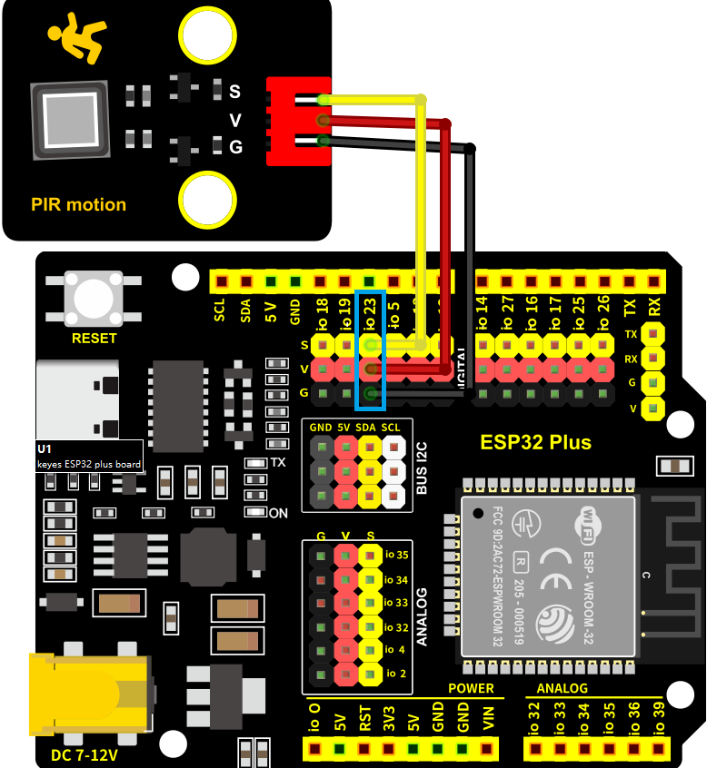

### 2.8.4 实验代码

代码文件在`KidsBlock(Scratch)_代码`文件夹中（<u>路径：重要资源\程序代码\KidsBlock(Scratch)_代码</u>），代码文件为`2_8_Read_PIR-Motion-Sensor.sb3`，如图：

单击 “**文件**” --> “**从电脑中上传**”，然后选择保存代码的路径，选中代码文件打开即可，如下图所示：


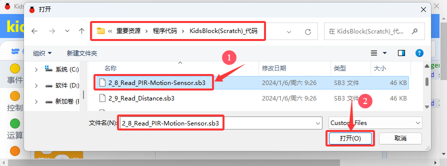


**组合代码块**

① 这个代码块，表示当启动ESP32这块开发板时，将运行代码。


② 设置串口。


设置串口波特率，一般波特率设置为`9600`或`115200`。


串口输出数据，从串行端口输出数据，分换行与不换行两种方式。


③ 向指定引脚设置“输入”或“输出”，选择“输入”代表给该引脚设置输入模式；选择“输出”代表给引脚设置输出模式；选择“输入上拉”代表给该引脚设置输入模式并且使该引脚变成高电平。


④ 循环语句，顾名思义就是重复做一件事。


⑤ 读取人体红外传感器的高低电平值。

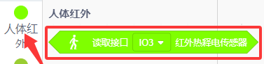

⑥ 这是简单的条件判断语句，如果里的表达式为真，则执行 “那么” 块内的代码。如果里表达式为假，则执行 “否则” 块内的代码。 


⑦ 将程序的执行暂停一段时间，也就是延时。单位是秒。 


**组合代码块**

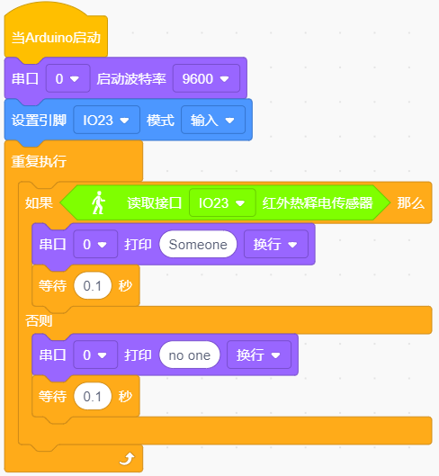


### 2.8.5 实验结果

按照接线图接好线，选择好正确的开发板板型（ESP32 Dev Module）和 适当的串口端口（COMxx），然后单击按钮上传代码。上传代码成功后，单击KidsBlock IDE右上角的打开串监视器串口并设置串口波特率为`9600`。当有人经过传感器时，会显示**Someone**，并且传感器上的红色LED会熄灭，没人时，会一直显示**No one**，传感器上的红色LED会常亮。

(<span style="color: rgb(255, 76, 65);">注意：人体红外热释电传感器并没有穿透能力，在检测人体移动时，请不要遮挡传感器。</span>)

（如果你对上传代码存在疑惑，请查看教程的`1.3 编写代码并上传`)


**串口现象图：**

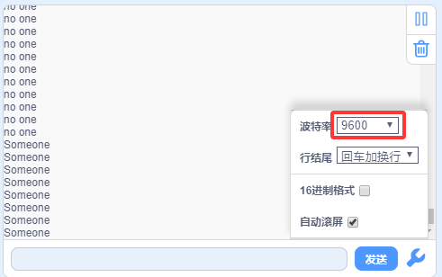

## 2.9 超声波传感器

### 2.9.1 简介

本教程将为您详细介绍超声波传感器的使用方法和应用技巧。超声波传感器是一种利用超声波测距的电子设备，广泛应用于避障、距离测量和物体检测。教程内容包括超声波传感器的工作原理、引脚功能、电路连接方法以及如何通过微控制器（如ESP32）读取和处理测距数据。您将学习如何编写代码来实现实时距离测量、障碍物检测以及数据滤波和校准。无论您是电子初学者还是有经验的开发者，本教程都将帮助您掌握超声波传感器的应用，为您的项目增添精确的距离感知功能。

### 2.9.2 元件知识

**超声波传感器:** 可以检测前方是否存在障碍物，并且检测出传感器与障碍物的详细距离。传感器主要用到CS100A芯片，它同时兼营3.3V与5V工作电压。最大测试距离为3米；盲区小于4CM。

它的测距原理和蝙蝠飞行的原理一样，就是超声波模块发送出一种频率很高，人体无法听到的超声波信号。这些超声波的信号若是碰到障碍物，就会立刻反射回来，在接收到返回的信息之后，通过判断发射信号和接收信号的时间差，计算出传感器和障碍物的距离。


**超声波参数：**

- 工作电压: DC 3.3V~5V
- 静态电流: <2mA
- 工作电流: 50mA~100mA，正常为65mA
- 最大功率：0.5W
- 最大探测距离：3m
- 盲区：小于4cm
- 感应角度：不大于15度
- 触发输入信号：10us TTL脉冲

**工作原理：**

最常用的超声测距的方法是回声探测法。当有脉冲电压触发时（单片机给Trig引脚发送高电平），超声波发射器探头里的晶片就会振动，继而产生超声波。在超声波发射时刻的同时计数器开始计时，超声波在空气中传播，途中碰到障碍物面阻挡就立即反射回来（Echo引脚发送高电平信号给单片机），超声波接收器收到反射回的超声波就立即停止计时。

超声波是一种声波，其声速V与温度有关。一般情况下超声波在空气中的传播速度为340m/s，根据计时器记录的时间t，就可以计算出超声波探头发射点距障碍物面的距离s，即：s=340t/2 。

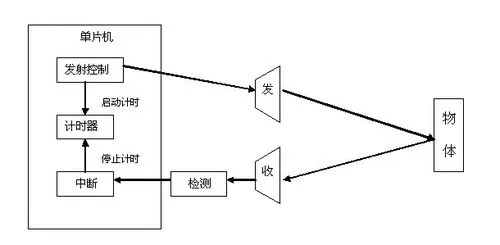

HC-SR04超声波测距模块可提供范围为2厘米至3米的非接触式距离感测功能，测距精度可达高到3mm。超声波传感器包括超声波发射器、超声波接收器与控制电路。其基本工作原理：

(1) 采用IO口Trig触发测距，给至少10us的高电平信号;

(2) 模块自动发送8个40khz的方波，自动检测是否有信号返回；

(3) 有信号返回，通过IO口Echo输出一个高电平，高电平持续的时间就是超声波从发射到返回的时间。

(4) 距离 =（高电平时间 x 声速（340M/S）） / 2

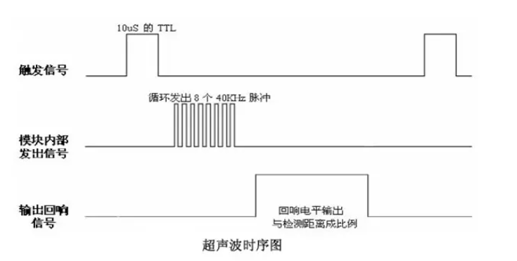

**注意:**

此模块不应在通电时连接，如有必要，先连接模块的 GND。否则，会影响模块的工作。

被测物体的面积应至少为 0.5 平方米，并尽可能平坦。否则，它会影响结果。

### 2.9.3 接线图

**模块的Echo连接到io13，Trig连接到io12**

**注意使用连接线连接时，黄色线为S信号线，红色线为V电源线，黑色线为GND，颜色一一对应，请勿插反！**

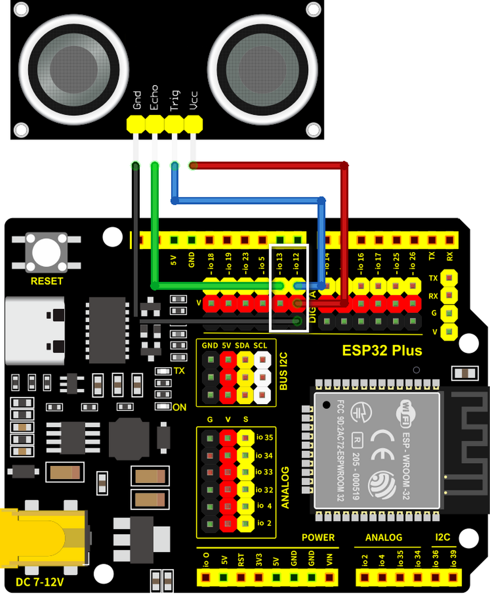


### 2.9.4 实验代码

代码文件在`KidsBlock(Scratch)_代码`文件夹中（<u>路径：重要资源\程序代码\KidsBlock(Scratch)_代码</u>），代码文件为`2_9_Read_Distance.sb3`，如图：

单击 “**文件**” --> “**从电脑中上传**”，然后选择保存代码的路径，选中代码文件打开即可，如下图所示：


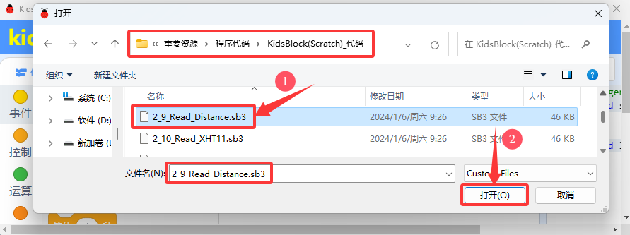

**认识代码块**

① 这个代码块，表示当启动ESP32这块开发板时，将运行代码。


② 设置串口。


设置串口波特率，一般波特率设置为`9600`或`115200`。


串口输出数据，从串行端口输出数据，分换行与不换行两种方式。


③ 向指定引脚设置“输入”或“输出”，选择“输入”代表给该引脚设置输入模式；选择“输出”代表给引脚设置输出模式；选择“输入上拉”代表给该引脚设置输入模式并且使该引脚变成高电平。


④ 循环语句，顾名思义就是重复做一件事。


⑤ 读取超声波传感器的距离值。


⑥ 将程序的执行暂停一段时间，也就是延时。单位是秒。 


**组合代码块**

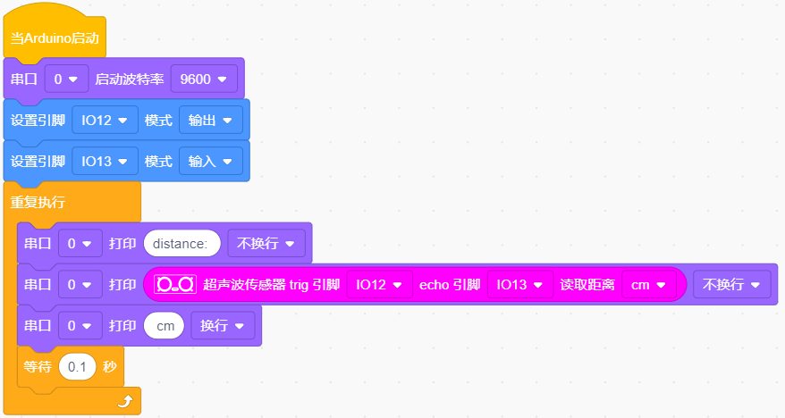

### 2.9.5 实验结果

按照接线图接好线，选择好正确的开发板板型（ESP32 Dev Module）和 适当的串口端口（COMxx），然后单击按钮上传代码。上传代码成功后，单击KidsBlock IDE右上角的打开串监视器串口并设置串口波特率为`9600`, 即可通过串口打印窗口查看超声波测距的距离值，调整超声波与障碍物的距离便能观察到距离变化。（如果你对上传代码存在疑惑，请查看教程的`1.3 编写代码并上传`)

**串口现象图：**

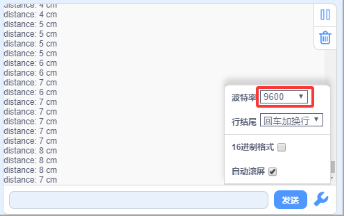

----------------------

## 2.10 XHT11温湿度传感器

### 2.10.1 简介

本教程将为您详细介绍XHT11温湿度传感器的使用方法和应用技巧。XHT11温湿度传感器是一种能够检测环境中的温度和湿度的电子元件，常用于家庭自动化、环境监测、农业等领域。教程内容包括XHT11温湿度传感器的工作原理、电路连接方法以及如何通过微控制器（如ESP32）读取温湿度值。您将学习如何编写代码来获取XHT11温湿度传感器检测的实时温湿度值，无论您是电子初学者还是有经验的开发者，本教程都将帮助您掌握XHT11温湿度传感器的应用，为您的项目增添智能的温湿度检测功能。

### 2.10.2 元件知识

XHT11温湿度传感器，是一种数字信号输出的温湿度传感器。它利用特殊的模拟信号采集、转换技术和温度、温湿度传感技术，确保传感器拥有良好的长时间稳定性，和较高的可靠性。该传感器内部包含高精度的电阻式湿度传感器件，和电阻式热敏测温传感器件，并与一个8位的性能高的单片机相连接。


**XHT11通信方式：**

XHT11 器件采用简化的单总线通信。单总线即只有一根数据线，系统中的数据交换、控制均由单总线完成。

- 单总线传送数据位定义：

  - 单总线数据格式：一次传送 40 位数据，高位先出。

  - 8bit 湿度整数数据 + 8bit 湿度小数数据 + 8bit 温度整数数据 + 8bit 温度小数数据 + 8bit 校验位。<span style="color: rgb(255, 76, 65);">注：其中湿度小数部分为 0。</span>

- 校验位数据定义：
  - 8bit 湿度整数数据 + 8bit 湿度小数数据 + 8bit 温度整数数据 + 8bit 温度小数数据。8bit 校验位等于所得结果的末 8 位。


数据时序图如下：

用户主机（MCU）发送一次开始信号后，XHT11 从低功耗模式转换到高速模式，待主机开始信号结束后，XHT11 发送响应信号，送出 40bit 的数据，并触发一次信采集。信号发送如图所示:

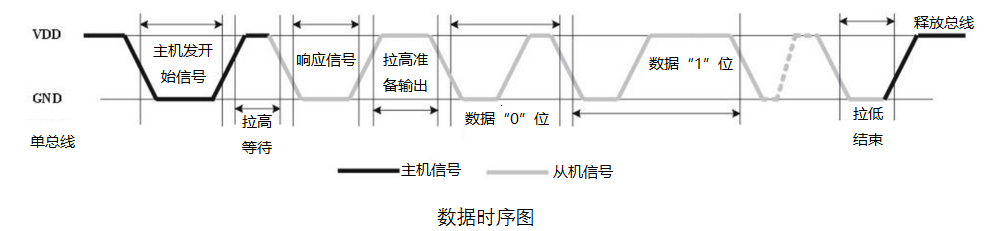

<span style="color: rgb(255, 76, 65);">注：主机从 XHT11 读取的温湿度数据总是前一次的测量值，如两次测间隔时间很长，请连续读两次以第二次获得的值为实时温湿度值。</span>

**原理图：**


**参数：**

- 工作电压: DC 3.3V~5V 
- 工作电流: (Max)2.5mA@5V
- 最大功率: 0.0125W
- 温度范围: -25 ~ +60°C (± 2℃)
- 湿度范围: 5 ~ 95%RH（25C°左右精度为±5%RH）
- 输出信号: 数字双向单总线

### 2.10.3 接线图

**模块连接到io17**

**注意使用连接线连接时，黄色线为S信号线，红色线为V电源线，黑色线为GND，颜色一一对应，请勿插反！**


### 2.10.4 实验代码

代码文件在`KidsBlock(Scratch)_代码`文件夹中（<u>路径：重要资源\程序代码\KidsBlock(Scratch)_代码</u>），代码文件为`2_10_Read_XHT11.sb3`，如图：

单击 “**文件**” --> “**从电脑中上传**”，然后选择保存代码的路径，选中代码文件打开即可，如下图所示：


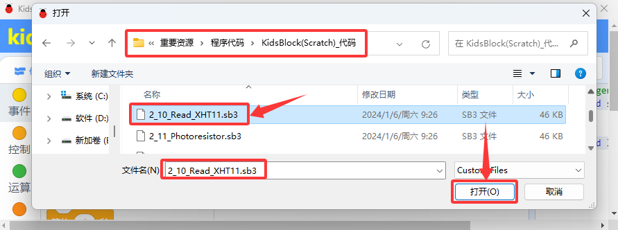

**认识代码块**

① 这个代码块，表示当启动ESP32这块开发板时，将运行代码。


② 设置串口。


设置串口波特率，一般波特率设置为`9600`或`115200`。


串口输出数据，从串行端口输出数据，分换行与不换行两种方式。


③ 这是一些温湿度传感器的代码块。

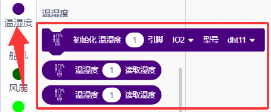

初始化温湿度的引脚和型号（dht11，dht21，dht22）。


读取温湿度的温度值。


读取温湿度的湿度值。


④ 循环语句，顾名思义就是重复做一件事。


⑤ 将程序的执行暂停一段时间，也就是延时。单位是秒。 


**组合代码块**

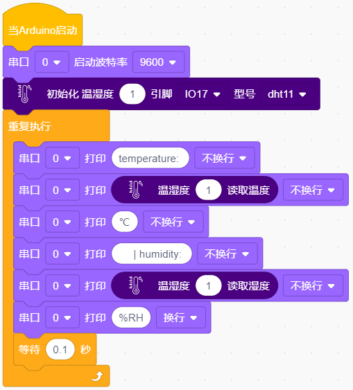

### 2.10.5 实验结果

按照接线图接好线，选择好正确的开发板板型（ESP32 Dev Module）和 适当的串口端口（COMxx），然后单击按钮上传代码。上传代码成功后，单击KidsBlock IDE右上角的打开串监视器串口并设置串口波特率为`9600`, 即可通过串口打印窗口查看XHT11传感器检测到的当前的温度和湿度等信息。（如果你对上传代码存在疑惑，请查看教程的`1.3 编写代码并上传`)

**串口现象图：**

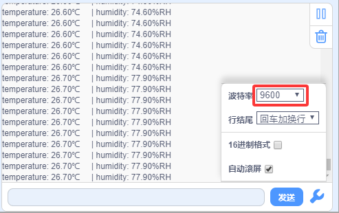


------

## 2.11 光敏传感器

### 4.11.1 简介

本教程将为您详细介绍光敏传感器的使用方法和应用技巧。光敏传感器是一种能够检测环境光强度的电子元件，常用于自动照明控制、光强监测和节能系统。教程内容包括光敏传感器的工作原理、类型（如光敏电阻、光电二极管）、电路连接方法以及如何通过微控制器（如ESP32）读取光强数据。您将学习如何编写代码来获取实时光强值，并根据光强变化触发相应的控制动作，如自动开关灯、调节屏幕亮度等。无论您是电子初学者还是有经验的开发者，本教程都将帮助您掌握光敏传感器的应用，为您的项目增添智能的光感应功能。

### 2.11.2 元件知识


**光敏传感器:** 也称光电传感器，是利用光电器件把光信号转换成电信号的一种传感器。其中最核心的是传感器模块上有一颗光敏电阻。光敏电阻是利用硫化镉或硒化镉等半导体材料的光电导效应制成的一种电阻值随入射光的强弱而改变的电阻器。光照愈强，阻值就愈低，随着光照强度的升高，电阻值迅速降低，亮电阻值可小至1KΩ以下。光敏电阻对光线十分敏感，其在无光照时，呈高阻状态，暗电阻一般可达1.5MΩ。

**原理图：**


当没有光照射时，电阻大小约为0.5 MΩ，光敏电阻的信号端（2脚）检测的电压接近0。当光照到光敏电阻时，随着光照强度增大，光敏电阻的阻值越来越小，VCC电压从光敏电阻通过的电压就越大，所以信号端S能检测到的电压也越来越大。

**参数：**

- 工作电压: DC 3.3V~5V
- 工作电流: (Max)0.2mA@5V
- 最大功率: 0.001W
- 光谱峰值: 540nm
- 亮电阻(10lux): 5~10KΩ
- 暗电阻: 0.5MΩ


### 2.11.3 接线图

**模块连接到io34**

**注意使用连接线连接时，黄色线为S信号线，红色线为V电源线，黑色线为GND，颜色一一对应，请勿插反！**

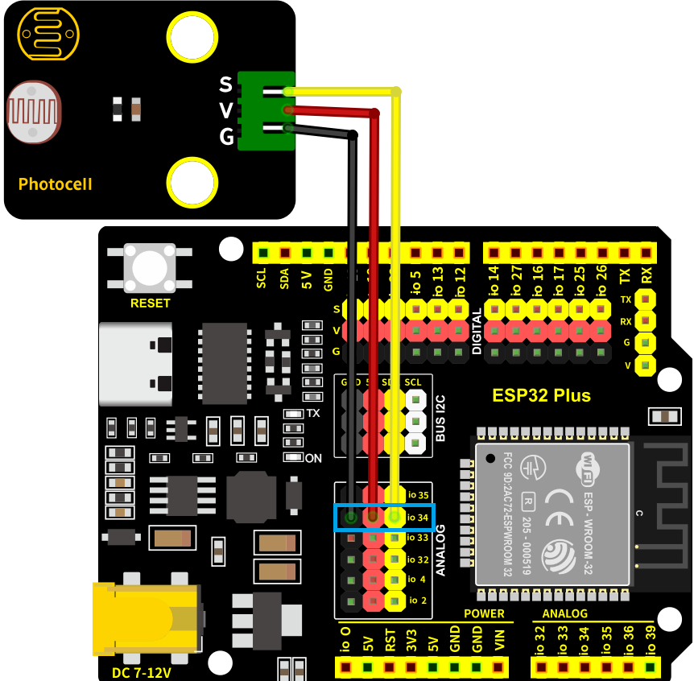

### 2.11.4 实验代码

代码文件在`KidsBlock(Scratch)_代码`文件夹中（<u>路径：重要资源\程序代码\KidsBlock(Scratch)_代码</u>），代码文件为`2_11_Photoresistor.sb3`，如图：

单击 “**文件**” --> “**从电脑中上传**”，然后选择保存代码的路径，选中代码文件打开即可，如下图所示：


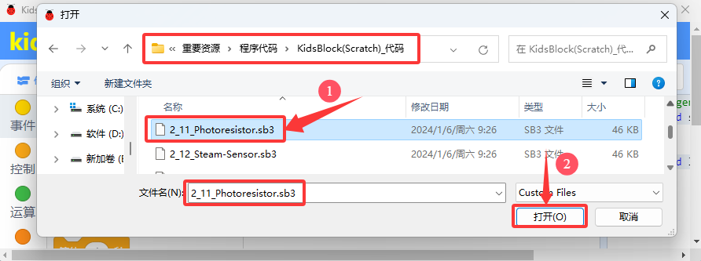

**认识代码块**

① 这个代码块，表示当启动ESP32这块开发板时，将运行代码。


② 设置串口。


设置串口波特率，一般波特率设置为`9600`或`115200`。


串口输出数据，从串行端口输出数据，分换行与不换行两种方式。


③ 向指定引脚设置“输入”或“输出”，选择“输入”代表给该引脚设置输入模式；选择“输出”代表给引脚设置输出模式；选择“输入上拉”代表给该引脚设置输入模式并且使该引脚变成高电平。


④ 循环语句，顾名思义就是重复做一件事。


⑤ 读取光敏传感器的光照强度值（模拟值）。

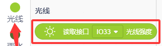

⑥ 将程序的执行暂停一段时间，也就是延时。单位是秒。 


**组合代码块**

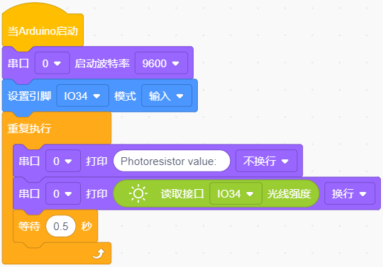

### 2.11.5 实验结果

按照接线图接好线，选择好正确的开发板板型（ESP32 Dev Module）和 适当的串口端口（COMxx），然后单击按钮上传代码。上传代码成功后，单击KidsBlock IDE右上角的打开串监视器串口并设置串口波特率为`9600`, 即可通过串口打印窗口查看光敏传感器的模拟值，光线越亮模拟值越高，光线越暗模拟值越低，用手遮住光线模拟环境光线变暗。（如果你对上传代码存在疑惑，请查看教程的`1.3 编写代码并上传`)

**串口现象图：**

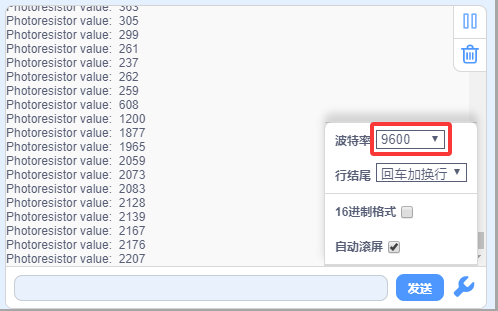

### 4.11.6 代码说明

（1）. 设置串口波特率和光敏传感器的引脚为输入模式。


（2）. 串口打印读取的光敏传感器的光线强度模拟值。

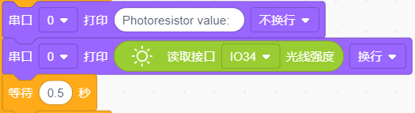

-----------

## 2.12 水滴传感器

### 2.12.1 简介

本教程将为您详细介绍水滴传感器的使用方法和应用技巧。水滴传感器是一种能够检测水存在的传感器，广泛应用于雨水检测等领域。教程内容包括水滴传感器的工作原理、引脚功能、电路连接方法以及如何通过微控制器（如ESP32）读取雨水量的模拟值。您将学习如何编写代码来传感器上实时雨水量的多少。无论您是电子初学者还是有经验的开发者，本教程都将帮助您掌握水滴传感器的应用，为您的项目增添精确的雨水检测功能。

### 2.12.2 元件知识

**水滴传感器：** 是一种可用于检测水的存在的传感器，它通常用于雨水检测系统。当雨水接触到传感器上的导电垫（检测区）时，它会向开发板(例如：Arduino主板，ESP32主板等)发送信号，以触发各种动作。检测区上的水量越多，模拟值越大。


------

**原理图：**

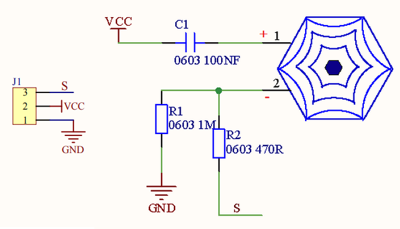

水滴传感器通过电路板上裸露的印刷平行线检测水量的大小。水量越多，就会有更多的导线被联通，随着导电的接触面积增大，雨滴感应区 2 脚输出的电压就会逐步上升。信号端 S 检测到的模拟值就越大。除了可以检测水量的大小，它还可以检测空气中的水蒸气。

------

**参数：**

- 工作电压: DC 3.3V~5V
- 工作电流: (Max) 1.5mA@5V
- 最大功率: 0.075W
- 信号类型: 模拟信号

### 2.12.3 接线图

**模块连接到io35**

**注意使用连接线连接时，黄色线为S信号线，红色线为V电源线，黑色线为GND，颜色一一对应，请勿插反！**


### 4.12.4 实验代码

代码文件在`KidsBlock(Scratch)_代码`文件夹中（<u>路径：重要资源\程序代码\KidsBlock(Scratch)_代码</u>），代码文件为`2_12_Steam-Sensor.sb3`，如图：

单击 “**文件**” --> “**从电脑中上传**”，然后选择保存代码的路径，选中代码文件打开即可，如下图所示：


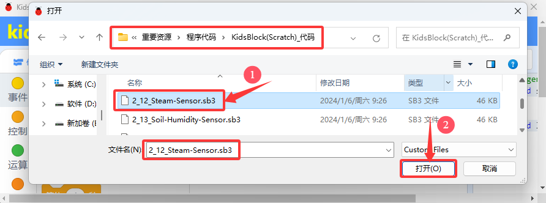

**认识代码块**

① 这个代码块，表示当启动ESP32这块开发板时，将运行代码。


② 设置串口。


设置串口波特率，一般波特率设置为`9600`或`115200`。


串口输出数据，从串行端口输出数据，分换行与不换行两种方式。


③ 向指定引脚设置“输入”或“输出”，选择“输入”代表给该引脚设置输入模式；选择“输出”代表给引脚设置输出模式；选择“输入上拉”代表给该引脚设置输入模式并且使该引脚变成高电平。


④ 循环语句，顾名思义就是重复做一件事。


⑤ 读取水滴传感器的雨水强度值（模拟值）。

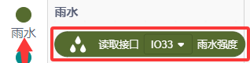

⑥ 将程序的执行暂停一段时间，也就是延时。单位是秒。 


**组合代码块**

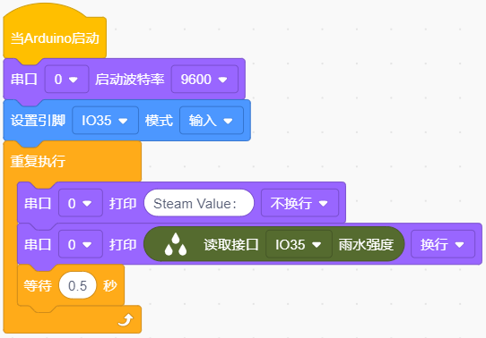

### 2.12.5 实验结果

按照接线图接好线，选择好正确的开发板板型（ESP32 Dev Module）和 适当的串口端口（COMxx），然后单击按钮上传代码。上传代码成功后，单击KidsBlock IDE右上角的打开串监视器串口并设置串口波特率为`9600`,即可通过串口打印窗口查看水滴传感器的模拟值，用湿润的手指去触碰传感器上的检测区域，触碰的面积越大，接收到的值就越大。（如果你对上传代码存在疑惑，请查看教程的`1.3 编写代码并上传`)


**串口现象图：**

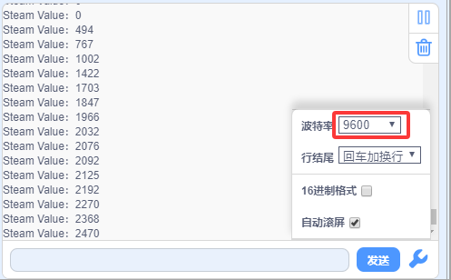

--------

## 2.13 土壤湿度传感器

### 2.13.1 简介

本教程将为您详细介绍土壤湿度传感器的使用方法和应用技巧。土壤湿度传感器是一种用于检测土壤水分含量的电子设备，广泛应用于农业灌溉、园艺和环境监测。教程内容包括土壤湿度传感器的工作原理、引脚功能、电路连接方法以及如何通过微控制器（如ESP32）读取和处理湿度数据。您将学习如何编写代码来实现实时湿度监测、自动灌溉控制以及数据校准和误差修正。无论您是电子初学者还是有经验的开发者，本教程都将帮助您掌握土壤湿度传感器的应用，为您的项目增添智能的土壤水分管理功能。

### 2.13.2 元件知识

**土壤湿度传感器:** 通过检测土壤的电导率变化来测量湿度，传感器采用叉形设计，方便插入土壤。传感器插入土壤后，当土壤缺水时，电导率降低，传感器输出的模拟值减小；当土壤湿润时，电导率增加，传感器输出的模拟值增大。这种传感器简单实用，适合用于农业灌溉、园艺等场景。


**原理图：**


**参数：**

- 工作电压: DC 3.3V~5V
- 信号类型: 模拟信号

### 2.13.3 接线图

**传感器连接到io32**

**注意使用连接线连接时，黄色线为S信号线，红色线为V电源线，黑色线为GND，颜色一一对应，请勿插反！**

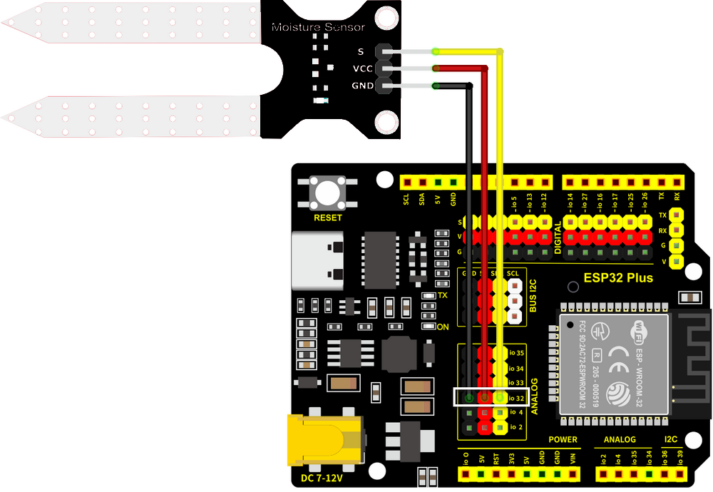

### 2.13.4 实验代码

代码文件在`KidsBlock(Scratch)_代码`文件夹中（<u>路径：重要资源\程序代码\KidsBlock(Scratch)_代码</u>），代码文件为`2_13_Soil-Humidity-Sensor.sb3`，如图：

单击 “**文件**” --> “**从电脑中上传**”，然后选择保存代码的路径，选中代码文件打开即可，如下图所示：


**认识代码块**

① 这个代码块，表示当启动ESP32这块开发板时，将运行代码。


② 设置串口。


设置串口波特率，一般波特率设置为`9600`或`115200`。


串口输出数据，从串行端口输出数据，分换行与不换行两种方式。


③ 向指定引脚设置“输入”或“输出”，选择“输入”代表给该引脚设置输入模式；选择“输出”代表给引脚设置输出模式；选择“输入上拉”代表给该引脚设置输入模式并且使该引脚变成高电平。


④ 循环语句，顾名思义就是重复做一件事。


⑤ 读取土壤湿度传感器的土壤湿度值（模拟值）。


⑥ 将程序的执行暂停一段时间，也就是延时。单位是秒。 


**组合代码块**

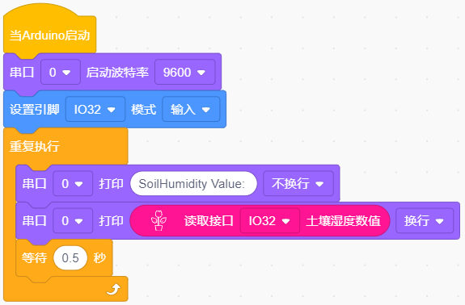

### 2.13.5 实验结果

按照接线图接好线，选择好正确的开发板板型（ESP32 Dev Module）和 适当的串口端口（COMxx），然后单击按钮上传代码。上传代码成功后，单击KidsBlock IDE右上角的打开串监视器串口并设置串口波特率为`9600`,即可通过串口打印窗口查看土壤湿度传感器的模拟值，如果你没有盆栽可以用纸巾用水轻微打湿土壤湿度传感器的检测区。（如果你对上传代码存在疑惑，请查看教程的`1.3 编写代码并上传`)

**串口现象图：**

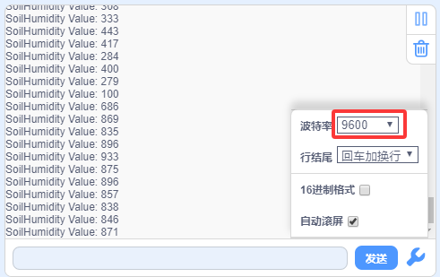

------------

## 2.14 水位传感器

### 2.14.1 简介

本教程将为您详细介绍水位传感器的使用方法和应用技巧。水位传感器是一种用于检测液体高度的电子设备，广泛应用于水塔监控、水箱管理和环境监测。教程内容包括水位传感器的工作原理、引脚功能、电路连接方法以及如何通过微控制器（如ESP32）读取和处理水位数据。您将学习如何编写代码来实现实时水位监测、自动报警以及数据校准和误差修正。无论您是电子初学者还是有经验的开发者，本教程都将帮助您掌握水位传感器的应用，为您的项目增添精确的液体高度检测功能。

### 2.14.2 元件知识

**水位传感器：** 与土壤传感器的原理相同都是通过检测电导率变化来测量。水面淹没的传感器感应区越少，电导率降低，传感器输出的模拟值减小；水面淹没的传感器感应区越多，电导率增加，传感器输出的模拟值增大。这种传感器简单实用，适合用于农业灌溉、园艺等场景。


**原理图：**


注意：不要让传感器的元器件碰到水，可能会损害传感器以及开发板 

### 2.14.3 接线图

**传感器连接到io33**

**注意使用连接线连接时，黄色线为S信号线，红色线为V电源线，黑色线为GND，颜色一一对应，请勿插反！**


### 2.14.4 实验代码

代码文件在`KidsBlock(Scratch)_代码`文件夹中（<u>路径：重要资源\程序代码\KidsBlock(Scratch)_代码</u>），代码文件为`2_14_Water-Level-Sensor.sb3`，如图：

单击 “**文件**” --> “**从电脑中上传**”，然后选择保存代码的路径，选中代码文件打开即可，如下图所示：


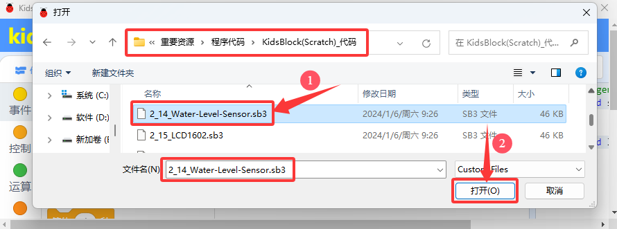


**认识代码块**

① 这个代码块，表示当启动ESP32这块开发板时，将运行代码。


② 设置串口。


设置串口波特率，一般波特率设置为`9600`或`115200`。


串口输出数据，从串行端口输出数据，分换行与不换行两种方式。


③ 向指定引脚设置“输入”或“输出”，选择“输入”代表给该引脚设置输入模式；选择“输出”代表给引脚设置输出模式；选择“输入上拉”代表给该引脚设置输入模式并且使该引脚变成高电平。


④ 循环语句，顾名思义就是重复做一件事。


⑤ 读取水位传感器的水位高度值（模拟值）。

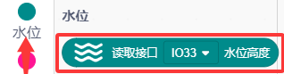

⑥ 将程序的执行暂停一段时间，也就是延时。单位是秒。 


**组合代码块**

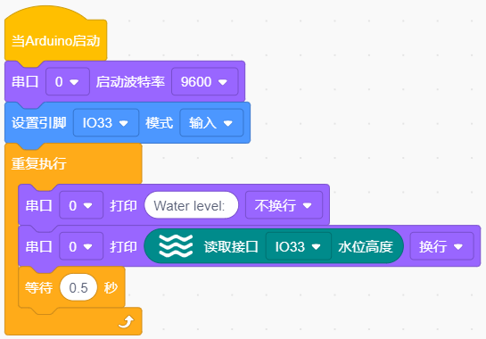

### 2.14.5 实验结果

按照接线图接好线，选择好正确的开发板板型（ESP32 Dev Module）和 适当的串口端口（COMxx），然后单击按钮上传代码。上传代码成功后，单击KidsBlock IDE右上角的打开串监视器串口并设置串口波特率为`9600`, 即可通过串口打印窗口查看水位传感器的模拟值，将水位传感器放置到容器中然后往容器中加水，注意不要超过安全线。（如果你对上传代码存在疑惑，请查看教程的`1.3 编写代码并上传`)

**串口现象图：**

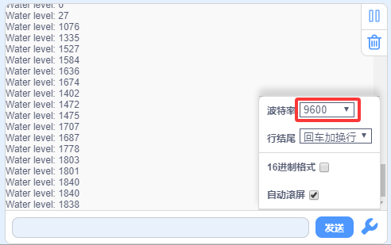

----------


## 2.15 IIC 1602 LCD显示屏

### 2.15.1 简介

本教程将为您详细介绍IIC 1602 LCD显示屏的使用方法和应用技巧，该显示屏采用PCF8574T驱动芯片，背光 (蓝色背景和白色背光)。教程内容包括IIC 1602 LCD显示屏的工作原理、引脚功能、电路连接方法以及如何通过微控制器（如ESP32）控制显示内容。您将学习如何编写代码来显示数字、字母、符号、ASCII码等和屏幕清屏。无论您是电子初学者还是有经验的开发者，本教程都将帮助您掌握IIC 1602 LCD显示屏的应用，为您的项目增添清晰、生动的视觉显示功能。

### 2.15.2 元件知识


LCD1602显示屏：显示屏有LCD 1602液晶显示屏和I2C 1602 LCD。但是我们在这个项目中使用的是一个I2C  LCD 1602。LCD 1602显示屏可以显示16列2行字符。它能够显示数字、字母、符号、ASCII码等。如下所示是一个单色LCD1602显示屏（在工作时需要占用控制板的7个IO口）及其电路引脚图：


I2C LCD1602显示屏集成了I2C接口，连接的串行输入&并行输出给LCD1602显示屏模块。这使得我们只要使用4条线路就可以来操作LCD1602。


本模块使用的IC芯片为PCF8574T (PCF8574AT)，其默认I2C地址为0x27(0x3F)。

在1602 LCD的背面有一个<span style="color: rgb(255, 76, 65);">金属电位器</span>。你可以用一字螺丝刀转动电位器来调整对比度。         

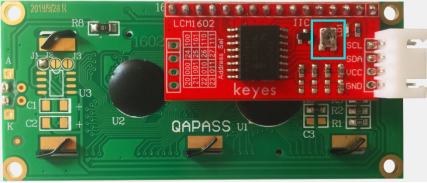

<span style="color: rgb(255, 76, 65);">请注意：</span>当你旋转电位器时，屏幕将变得更亮或更暗，适当的角度将使字体更清晰。

**I2C 1602 LCD 原理图：**

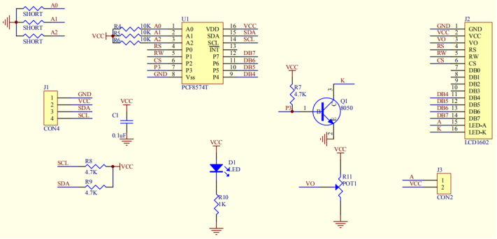

**I2C 1602 LCD技术参数：**

- 显示像素：16 * 2 字符
- 芯片工作电压：4.5 ~ 5.5V
- 工作电流：2.0mA (5.0V)
- 模块最佳工作电压：5.0V
- I2C 地址：0x27
- 背光 (蓝色背景和白色背光)
- 背后的接线引脚分别为GND、VCC、SDA、SCL（SDA和SCL分别为IIC通讯的数据线和时钟线）。

**I2C 地址：**

默认地址基本上是 0x27，在少数情况下可能是 0x3F。

以默认地址 0x27 为例，可以通过短接 A0/A1/A2 焊盘来修改设备地址; 在默认状态下，A0/A1/A2 为 1，如果焊盘短路，则 A0/A1/A2 为 0。


**对比度：**

背面的电位器用于调整对比度（最亮的白色和最暗的黑色之间的亮度比）。

电位器 ：用于调整对比度（显示文本的清晰度），对比度在顺时针方向上增加，在逆时针方向上减少。

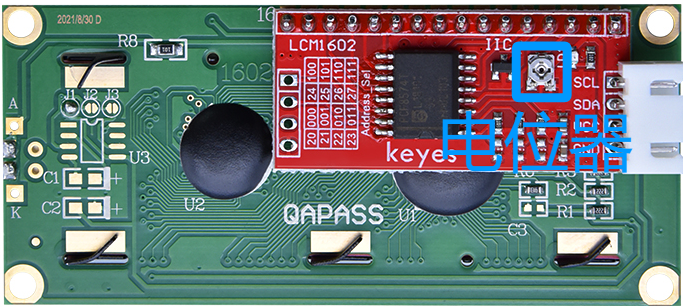

**I2C串行通信：**

I2C通信协议是Inter-Integrated Circuit（IIC）的缩写，也叫作两线制或TWI（Two-Wire Interface），是一种通用的主从式的两线总线通信协议，它是由Philips Semiconductor公司开发的（现在被美国NXP半导体公司收购）。

其最大的优点是只需要两根线就可以完成数据的传输，对于系统线路的繁琐也减少了很多，这种总线可以并行联结127个节点，并且支持多主机，从机一般不需要外接电源，因为I2C总线可以把电源传输到从机。如下图：


I2C总线的数据传输采用8位数据传输的方式，通常一个字节的数据传输是由9个时钟信号组成，8个时钟信号传输数据，最后一个时钟信号用于传输结束的标志。同时，I2C总线也支持多字节的数据传输，不断重复上述过程，即可完成多字节的数据传输。

I2C协议的基本组成部分包括以下内容：

- 起始信号：在发送数据之前，发送方必须发送起始信号，以告知接收方，要发送数据了。

- 地址码：地址码用于告知接收方，要发送的数据是给谁的。

- 数据：数据按照位传输，每次传输一个字节的数据。

- 停止信号：发送完数据后，发送方必须发送停止信号，以告知接收方，数据发送完毕。

Arduino提供了一个名为Wire.h的I2C协议集成库，可以通过调用其函数实现I2C通信，从而实现与I2C/TWI设备的通信。

具体库介绍参考官网链接：
[https://www.arduino.cc/reference/en/language/functions/communication/wire/](https://www.arduino.cc/reference/en/language/functions/communication/wire/)

### 2.15.3 接线图

**模块连接到 BUS I2C**

**注意使用连接线连接时，黄色线为S信号线，红色线为V电源线，黑色线为GND，颜色一一对应，请勿插反！**

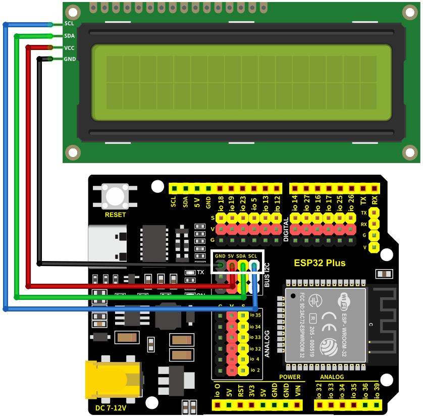

### 2.15.4 实验代码

代码文件在`KidsBlock(Scratch)_代码`文件夹中（<u>路径：重要资源\程序代码\KidsBlock(Scratch)_代码</u>），代码文件为`2_15_LCD1602.sb3`，如图：

单击 “**文件**” --> “**从电脑中上传**”，然后选择保存代码的路径，选中代码文件打开即可，如下图所示：


**认识代码块**

① 这个代码块，表示当启动ESP32这块开发板时，将运行代码。


② 这是一些 I2C LCD 1602显示屏的相关代码块

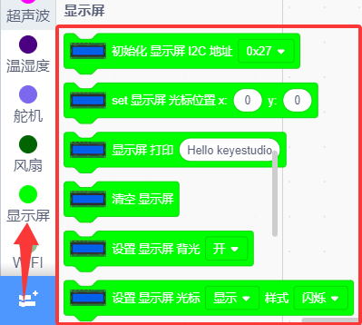

初始化LCD显示屏的地址。


设置LCD显示屏的光标位置。


LCD显示屏显示的内容。


LCD显示屏清屏。


打开/关闭LCD显示屏的背光。


设置LCD显示屏显示/隐藏光标，闪烁/不闪烁样式。


③ 循环语句，顾名思义就是重复做一件事。


**组合代码块**

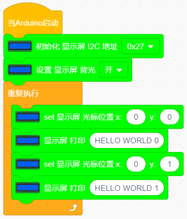

### 2.15.5 实验结果

按照接线图接好线，选择好正确的开发板板型（ESP32 Dev Module）和 适当的串口端口（COMxx），然后单击按钮上传代码。上传代码成功后，IIC LCD 1602 显示屏会打开背光，并显示两行文字 “**HELLO WORLD 0**” 和 “**HELLO WORLD 1**” .（如果你对上传代码存在疑惑，请查看教程的`1.3 编写代码并上传`)

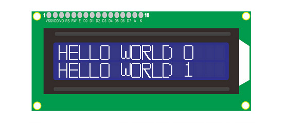

<span style="color: rgb(255, 76, 65);">注意：</span>如果代码和接线正确，但 LCD 仍然无法显示任何内容，则可以调整背面的电位器以增加对比度。

------

### 2.15.6 代码说明

（1）. 初始化 LCD 1602，打开（可选）背光灯。


（2）. 将光标位置设置为x: 0、y:0，在 LCD 1602 显示屏上的x: 0、y:0位置显示文本 “HELLO WORLD 0”。

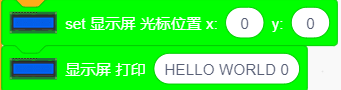

（9）. 将光标位置设置为x: 0、y:1，在 LCD 1602 显示屏上的x: 0、y:1位置显示文本 “HELLO WORLD 1”。


---------

# 第一课：照明系统

**按照安装步骤，组装好智慧农场成品后，我们来学习第一课，照明系统。**

------

智慧农场入门课程点亮LED，是最基础的Scratch实践项目之一，旨在让初学者了解ESP32开发板的硬件和软件编程，并通过点亮LED的简单实验来掌握基本的电路和编程知识。

------

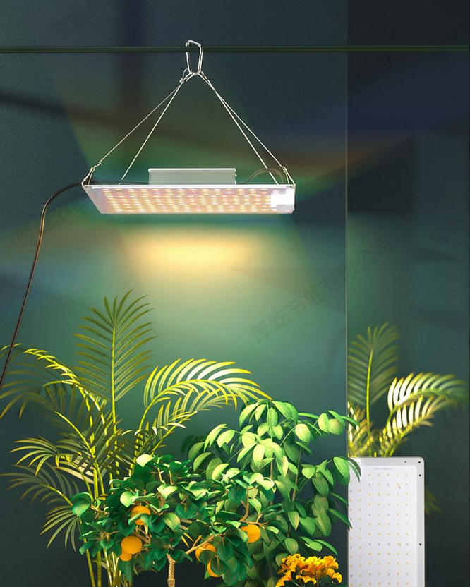

------

作为入门级别的教程，我们的指导方法简单易学。使用Scratch开发照明控制系统是一个非常有趣的项目，可以应用于您的家庭或办公室等实际生活场景中。

通过完成这个项目，初学者可以学会Scratch编程环境下，ESP32开发板的基本连接和设置，以及控制数字引脚输出电平来控制LED灯的亮灭，以及按键控制LED和扩展功能等。这个项目可以作为入门级的学习教程，为后续的Scratch实践项目打下基础。

------

## 照明系统流程：

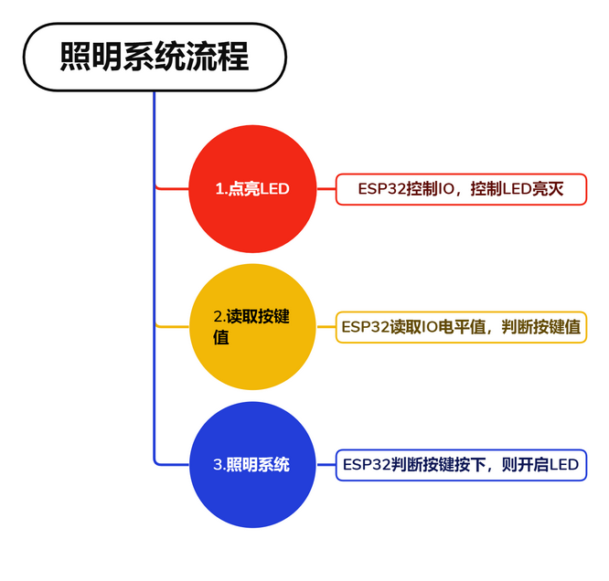

------


## 点亮LED

### 概述

LED是Light Emitting Diode的缩写，中文名:发光二极管，是一种能够将电能转化为可见光的固态的半导体器件（所以LED照明又称为固态照明），它可以直接把电转化为光。

当电流通过LED时，它会发光。

**各式各样的LED：**

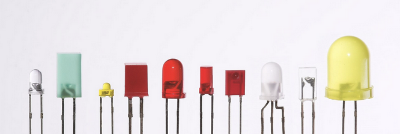

------


**LED模块**是一种用于输出的设备，用于控制LED灯的亮度和闪烁，可以直接插入开发板的数字输出引脚上使用。

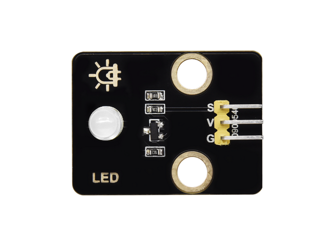

------


**原理图：**当S处为高电平时，Q1三极管导通，VCC电压通过LED，LED此时会亮起来，反之相反。

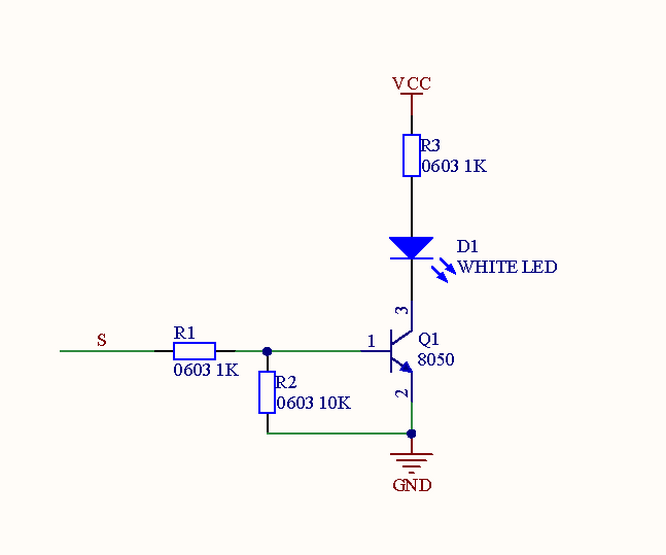

**参数：**

- 电压：3~5V
- 电流：≤1.5mA
- 功率：0.07W

------


### 接线图：

**模块连接到io27**

**注意使用连接线连接时，黄色线为S信号线，红色线为V电源线，黑色线为GND，颜色一一对应，请勿插反！**

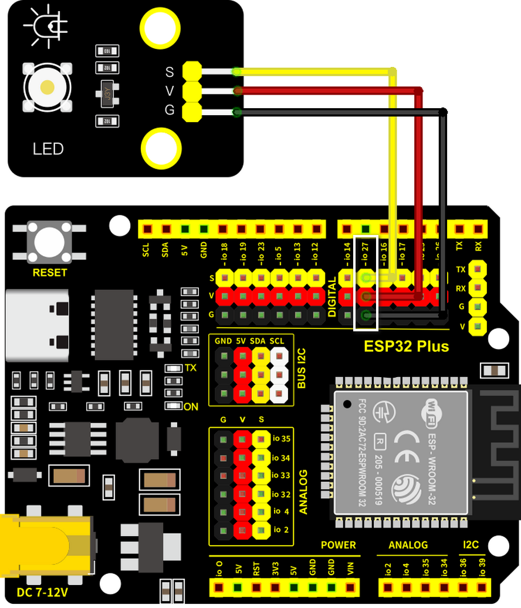

------


### 代码

- 首先我们打开Scratch软件，选择好对应的开发板和端口。

  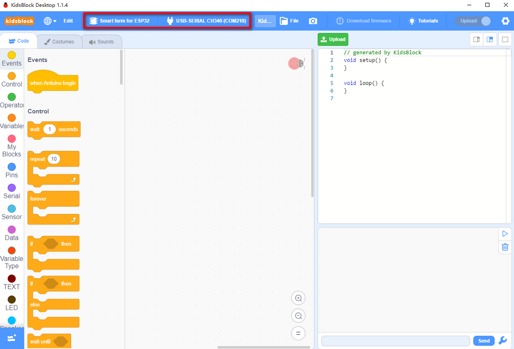

- 在中拖动，拖动到中间那个任务框。

  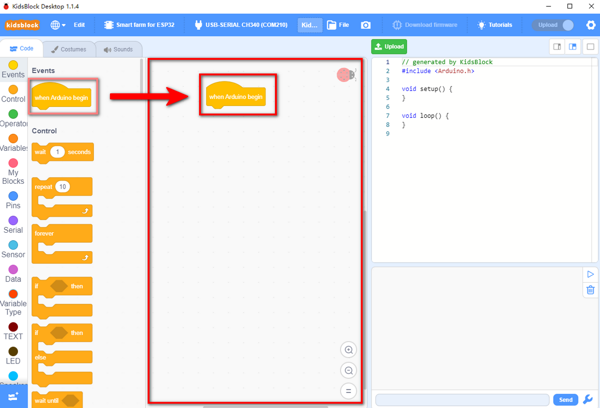

  只有把右边的代码块，拖动到中间的任务框，代码才会运行。

- 这个代码块，表示当启动ESP32这块开发板时，将运行代码。

  

  在中，将“**forever**”任务块，拖动至中间任务框，和启动代码块拼接在一起，这个代码块表示，无限循环模块。

  

- 在中，拖动到“**forever**”任务块中，添加控制引脚代码块，并设置引脚为high，这样，引脚会循环输出输出高电平。

  - 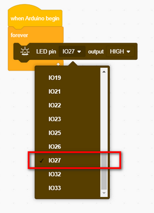
  - 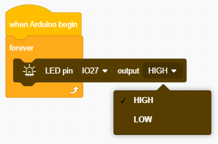

- 我们给他加个1秒延时，再把引脚设置为低电平，一高一低，LED一亮一灭。

  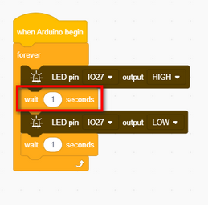

### 结果

可以看到LED每隔一秒闪烁，这是因为ESP32开发板的io27，每隔一秒输出高电平和低电平。通过LED模块，我们可以实现各种有趣的互动式应用，例如呼吸灯效果、流水灯效果、警灯效果等等。

| 电平 | 功能  |
| :--: | :---: |
| HIGH | LED亮 |
| LOW  | LED灭 |

------


### 扩展

#### LED呼吸灯：

单片机（arduino UNO、ESP32和Raspberry Pi Pico等）的IO口输出的是数字信号，IO口只能输出高电平和低电平，简称数字输出。例如，我们在前面学习的点亮LED课程，就是用到esp32的数字输出，只有高（3.3V）、低（0V）两种电平。

假设单片机的高电平为3.3V，低电平为0V，那么我们要输出0~3.3V之间的电压，就要用到PWM（**脉宽调制**）：原文为“Pulse Width Modulation”，通过PWM就可以输出不同的电压值了，像进度条一样，简称模拟输出。


------


那么，什么PWM？

PWM有三个要素：频率（Hz）、周期和占空比（%）

- **PWM频率（f）：**指1秒钟内，信号从高电平到电平再到高电平的次数，通俗的说是一秒钟PWM有多少个周期。

- **PWM周期（T）：**周期=1/频率（T=1/f，其中1为1秒钟），例如：频率为50Hz，也就是说一个周期是20ms，那么一秒钟就有 50次PWM周期。
- **PWM占空比：**指一个脉冲周期内，高电平的时间与整个周期时间的比例。例如：周期的时间是10ms，脉宽时间是8ms 那么低电平时间就是2ms 总的占空比 8/(8+2)= 80%


------


**总结：PWM就是在合适的信号频率下，通过一个周期里改变占空比的方式来改变输出的有效电压**，通俗的说是：在规定的时间内，IO口输出的高电平和低电平中，高电平越多，PWM值就越大，LED就越亮。

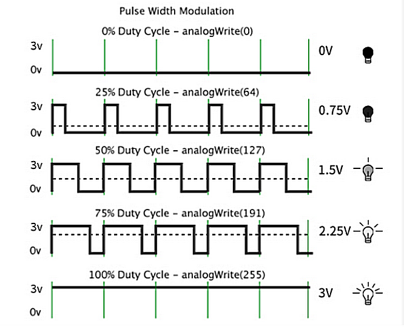

------

代码如下：

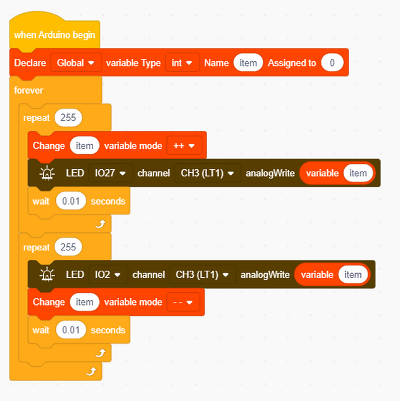

- 再定义一个变量**item**，设置它的初始值为0。

  

- 拖动一个无限循环代码块，并在这个代码块中，添加一个按次数循环代码块，我们把这个次数设置为255次。

  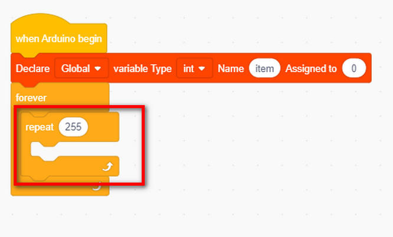

- 拖动一个设置变量模式代码块，到次数循环代码块中，设置为“**++**”，表示每执行一次循环，让**item**加1。

  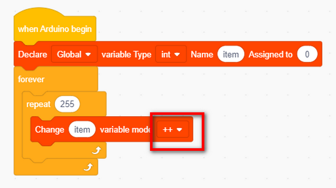

- 我们把设置PWM代码块拖出来（我们已经准备好了输出PWM代码块，只需要设置对应的引脚和数值，就可以输出PWM值）

  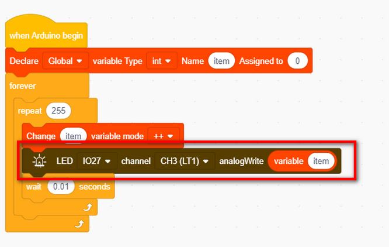

  - 设置对应的引脚

    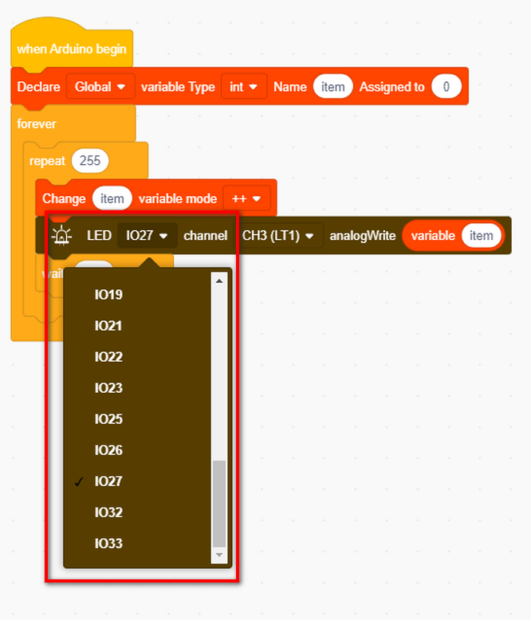

  - 设置通道，一共有16个通道（0~15）。

    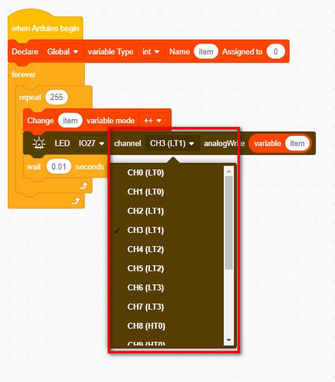

  - PWM输出的数值，设置为**item**，变量**item**每次执行一次后加1，也就是从0到255。**前面之所以把次数循环代码块，设置为255次，就是因为对应PWM代码块输出0\~255。**

    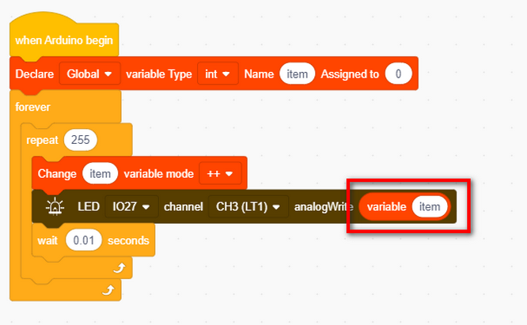

  - 再加上一个延时，0.01秒执行一次，这个代码将LED灯从暗慢慢变量。

    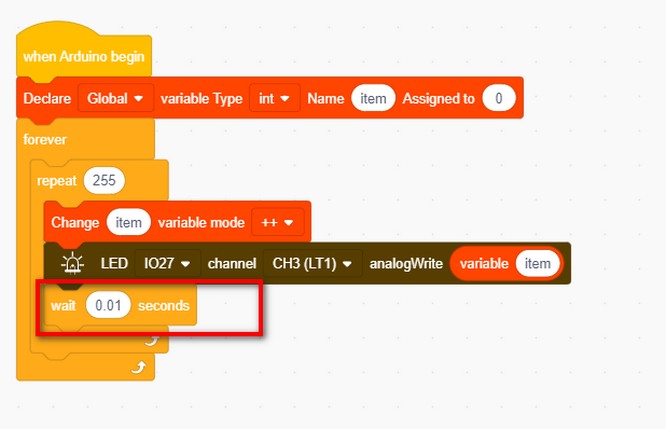

  - 我们再添加一个代码，将LED灯从亮慢慢变暗，也就是让变量**item**减1，代码如下。

    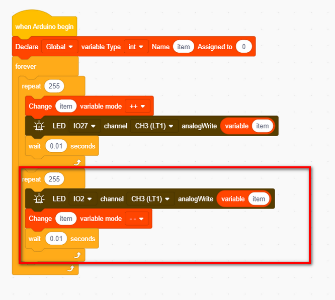

实验结果：LED会逐渐变亮和变暗，看起来就像LED在呼吸一样。

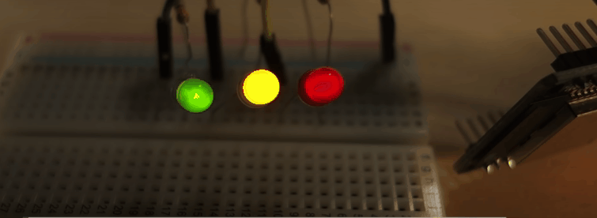

------


## 按键开关

### 概述

**按键模块**是一种简单易用的输入设备，单片机读取到他的电平，用于检测外部环境中的按键操作。

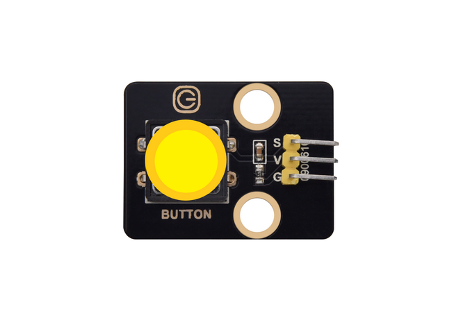

------


**原理图：**

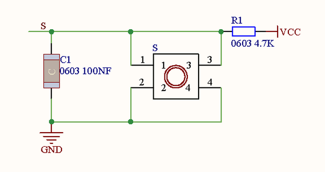

**参数：**

- 电压：3~5V
- 电流：≤1.1mA
- 功率：≤5.5mW

------

**按键模块的原理是基于按键的开关电路。**

- **当按键被按下时**，开关会闭合，使得电流可以通过按键到GND，从而使开发板的数字输入引脚，检测到一个逻辑低电平信号。
- **当按键没有被按下时**，开关处于断开状态，引脚被上拉电阻拉高，数字输入引脚检测到逻辑高电平信号。

------


### 接线图：

**模块连接到io5**

**注意使用连接线连接时，黄色线为S信号线，红色线为V电源线，黑色线为GND，颜色一一对应，请勿插反！**

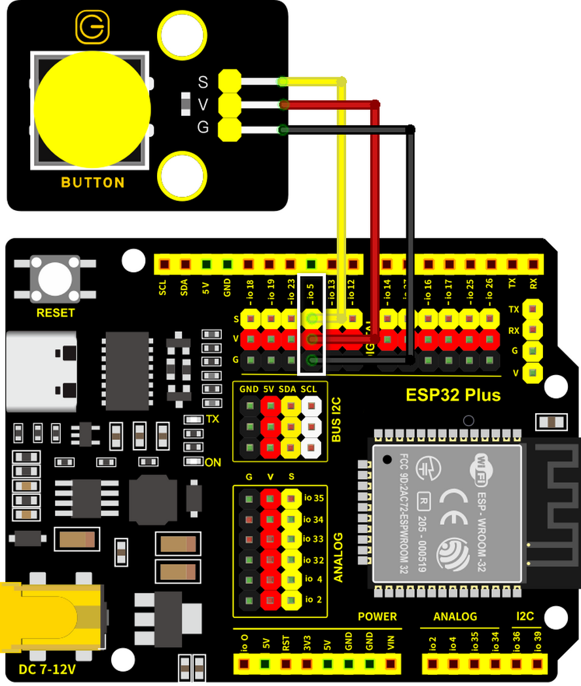

------


### 代码

代码如下：

- 首先进行串口初始化，并设置波特率为115200

  

- 设置引脚5为输入状态，并拖动无限循环代码块

  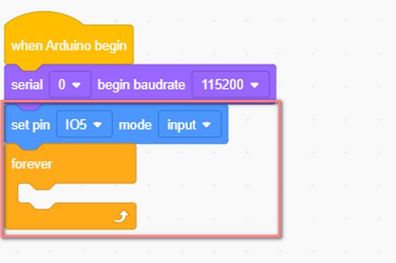

- 判断引脚5的电平状态，如果为1，则打印1，否则为0

  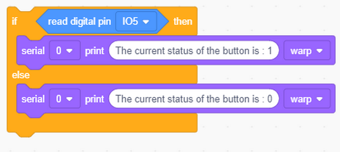

- 完整代码：

  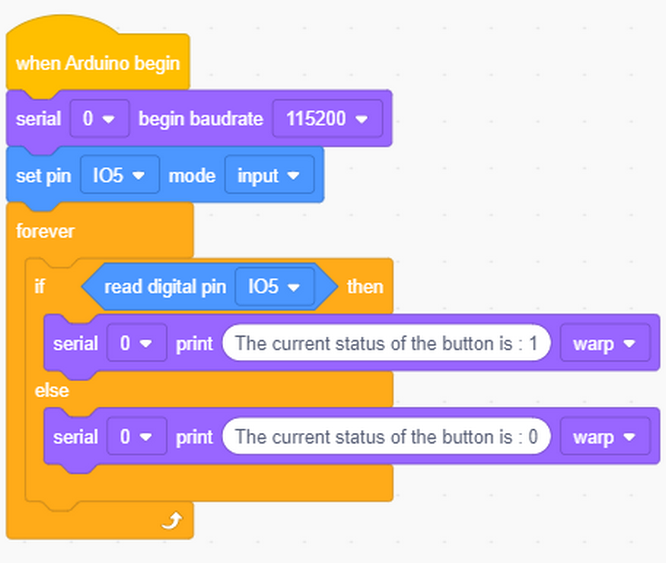

### 结果

打开串口监视器，选择对应的波特率。

当不按按钮时，按钮的状态为1，当按钮被按下时，会得到0。

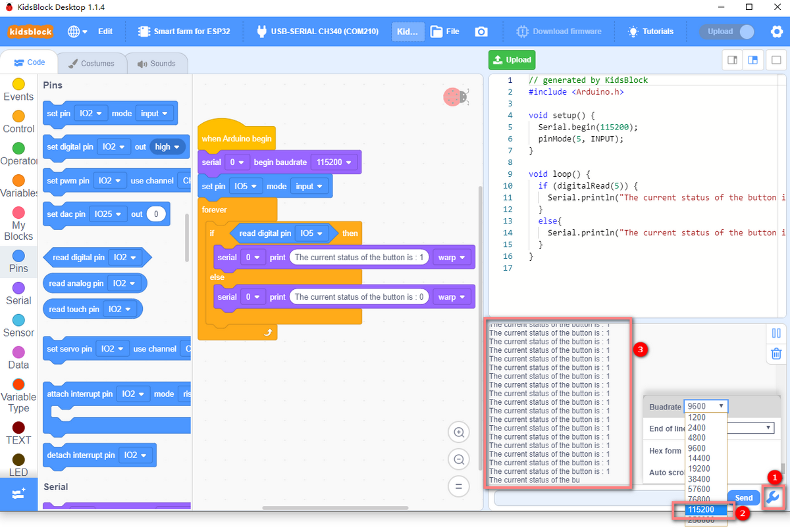

------

在Scratch中，可以通过编写相应的程序来读取数字输入引脚的状态，从而检测按键是否被按下。通过按键模块，我们可以实现各种交互式的应用，例如控制LED灯的开关、调整显示屏的亮度等等。

------


### 扩展

#### 软件实现自锁按键功能：

自锁按键即按下去就锁住，不会自动弹起来，再按一次才会弹起来的一种按键，和开关非常相似。利用自锁的物理按键来实现开关的通断，如果是单片机控制，通过软件，实现不是不是自锁的点动按键也可以实现这种操作。

------

代码如下：

- 首先定义一个获取按键状态的值**item**，再定义一个被按键改变的值**button**，

  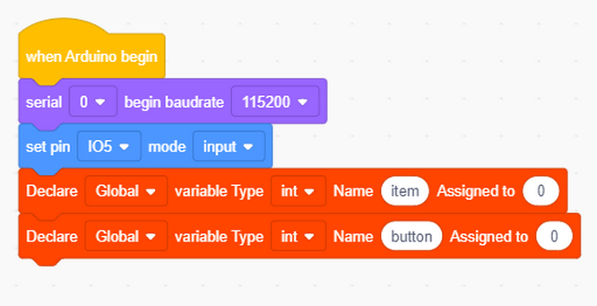

- 将读取到的按键值，赋值给**item**

  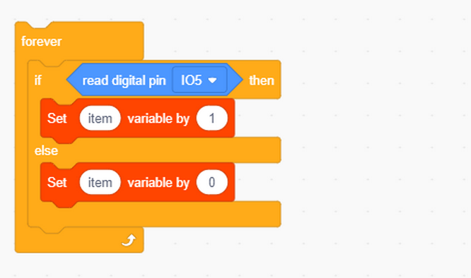

- 判断按键是否按下，按下时，改变**button**的值，并打印。

  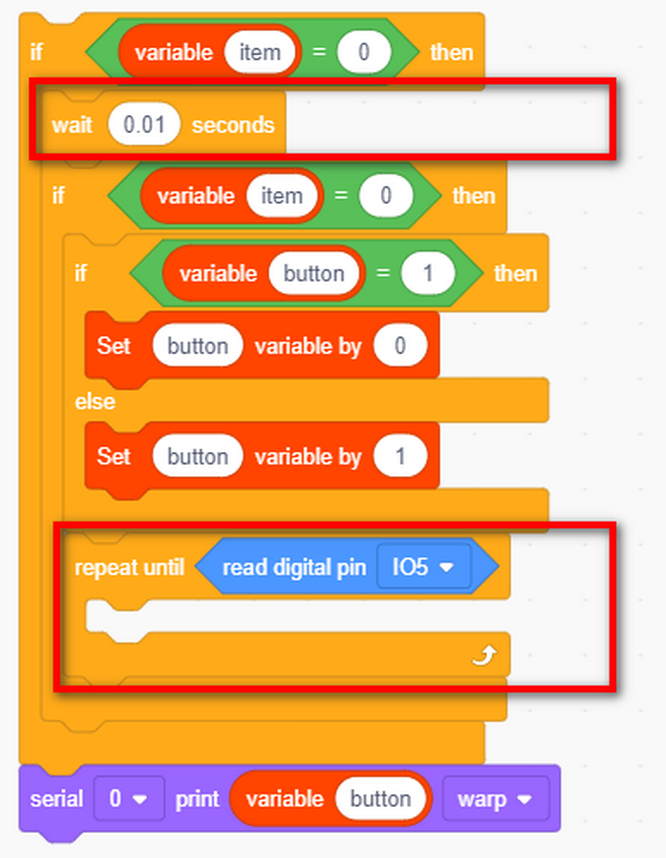

  - 其中延时0.01秒，是按键软件防抖动功能。
    - 检测出键闭合后执行一个延时程序，5ms～10ms（取决于机械特性）的延时，让前沿抖动消失后再一次检测键的状态，如果仍保持闭合状态电平，则确认为真正有键按下。
    - 当检测到按键释放后，也要给5ms～10ms的延时，待后沿抖动消失后才能转入该键的处理程序。
  - 当按键按一下，**button**变成1，再按一下，**button**变成0，如此循环。

- 完整代码：

  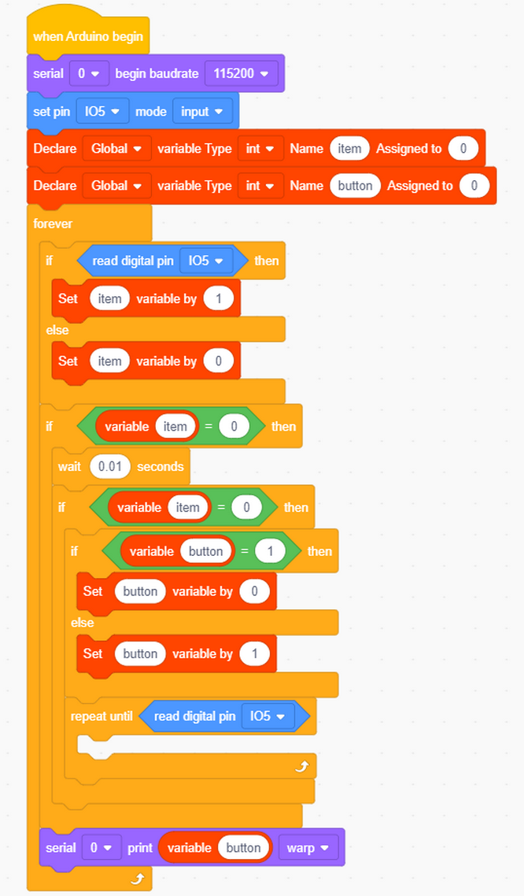

------

上传代码后，打开串口监视器，当按一下按钮，按钮状态会显示1，再按一下按钮，按钮状态会显示0，以达到普通按键变成自锁按键的功能。

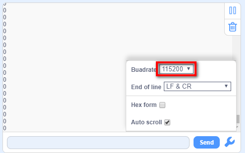

------


## 照明控制

### 概述

通过以上的基础教学，我们实现了按键自锁功能，成为控制LED的开关。自锁按钮适用于需要一直保持某种状态的场合，例如在需要长期控制LED的同时，又需要使用ESP32开发板进行其他操作。

本课程带领大家，了解如何使用ESP32开发板实现照明控制系统，模拟现实生活场景，通过按钮控制灯的开关。

------


### 接线图

**按键模块连接到io5，LED模块连接到io27**

**注意使用连接线连接时，黄色线为S信号线，红色线为V电源线，黑色线为GND，颜色一一对应，请勿插反！**


------


### 代码

------

#### 代码流程图


代码如下：在自锁按钮的代码基础上，我们添加LED。

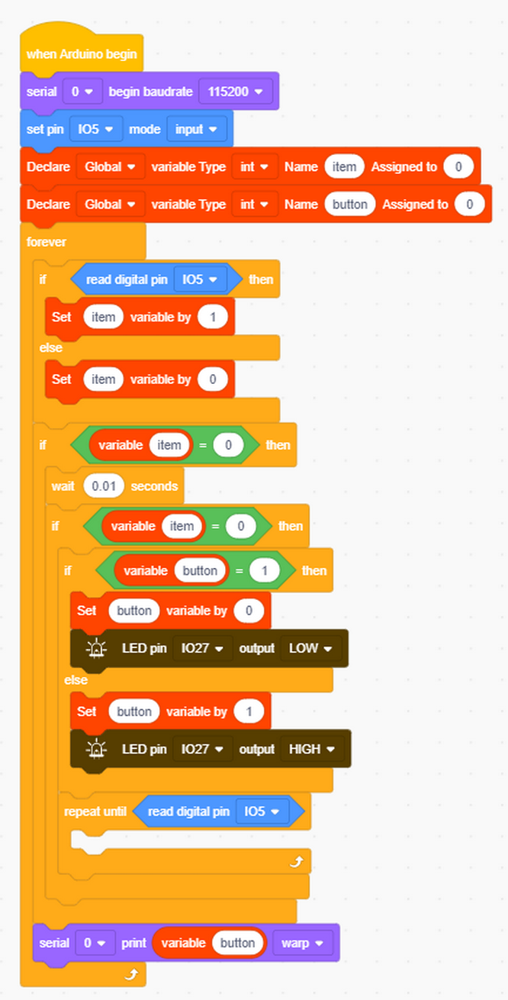

### 结果

**当第一次按下按键时，打开LED，第二次按下时，关闭LED，第三次按下时又打开LED…依次循环开关LED，和现实生活中的LED开关一致。**

------

在本章的入门Scratch教程中，我们了解了如何使用Scratch进行编程和控制。我们学习了基础知识、掌握了重要的软件和硬件概念，同时也实践了一些小项目，如自锁按钮和照明控制系统。

这些都是成为一名优秀的Scratch开发者所必须掌握的基础知识。接下来，我们将继续深入学习，探索更多的应用和技能。不论您是初学者还是有经验的开发者，学习Scratch都是一项非常有趣和充满挑战的事情，让我们继续前进。

------


## FAQ

### 问：烧录了代码LED不亮？

答：请确认代码中的引脚，和现实模块接线是否一致，如有错误，请正确按照代码中的引脚，进行接线即可。

------


### 问：按键不灵敏？有时候能检测的到，有时候检测不到？

答：修改按键去抖动的延时，设置到合适的延时。

```c++
 //软件去按键抖动
    delay(10);  //修改此项
```

------

# **第二课：光控系统**

这个系统是由光敏传感器和LED灯组成的光控系统，可以实现智能化的灯光控制，节约能源并提高使用效率。


这种系统广泛应用于不同场景，并且通过使用光敏传感器，实现自动检测白天和黑夜以及光的强度，使得整个系统更加智能化和节能。

当环境亮度低于设定值时，光敏传感器会检测到信号，从而自动打开LED灯；当环境亮度高于设定值时，光敏传感器会发送另一个信号，从而关闭LED灯。

------

## 光控系统流程：


------


## **光敏传感器**

### 概述

光敏传感器也称光电传感器，是利用光电器件把光信号转换成电信号（电压，电流，电阻等）的一种传感器。其中最核心的是电路中，有一颗光敏电阻。

**光敏电阻工作原理：**光敏电阻串联进电路，两端加入合适的电压，在没有光照的时候，电阻无穷大，接近断路，有光照时阻值减少，电流加大，足够光照强度时相当于短路。

接下来我们通过使用ESP32开发板，编写代码来读取光敏传感器的值。

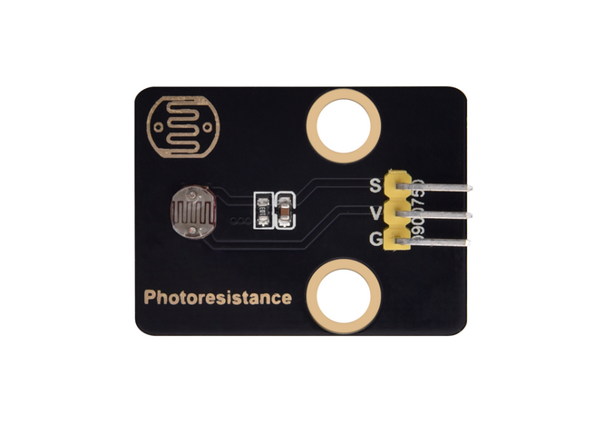

------


**原理图：**

当光照到光敏电阻时，光照越强，光敏电阻的阻值越小，VCC电压从光敏电阻通过的电压就越大。

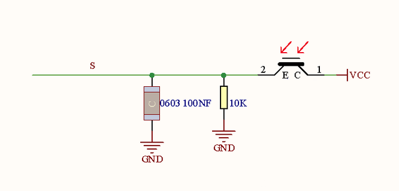

**参数：**

- 电压：3~5V

- 电流：0.2mA
- 功率：1mW
- 光谱峰值：540nm
- 亮电阻（10lux）：5~10KR
- 暗电阻：0.5MR


------


### 接线图

**模块连接到io34**

**注意使用连接线连接时，黄色线为S信号线，红色线为V电源线，黑色线为GND，颜色一一对应，请勿插反！**

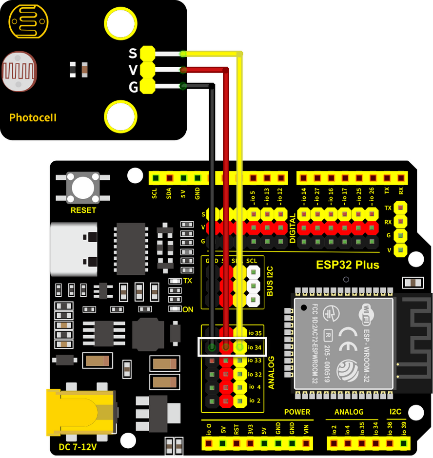

------


### 代码

代码如下：

- 初始化串口

  

- 定义一个item全局变量，用来存储光敏传感器的值

  

- 把读取的值，存放在item变量中，并用串口打印

  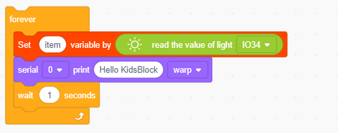

- 完整代码：

  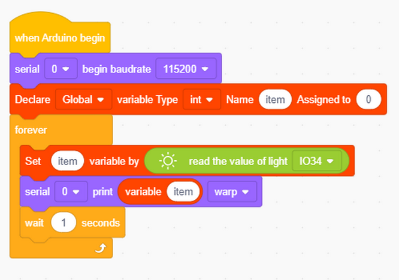


------


### 结果

打开串口，当光敏传感器检测到的光线越亮时，接收到的数值越大，反之相反。

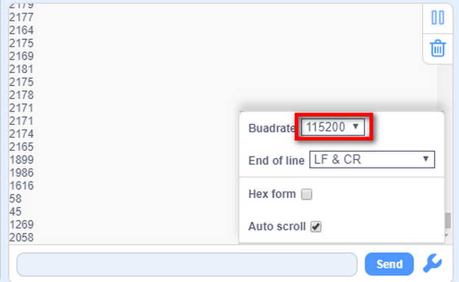

------


## 光控系统

### 接线图

**光敏传感器连接到io34，LED模块连接到io27**

**注意使用连接线连接时，黄色线为S信号线，红色线为V电源线，黑色线为GND，颜色一一对应，请勿插反！**

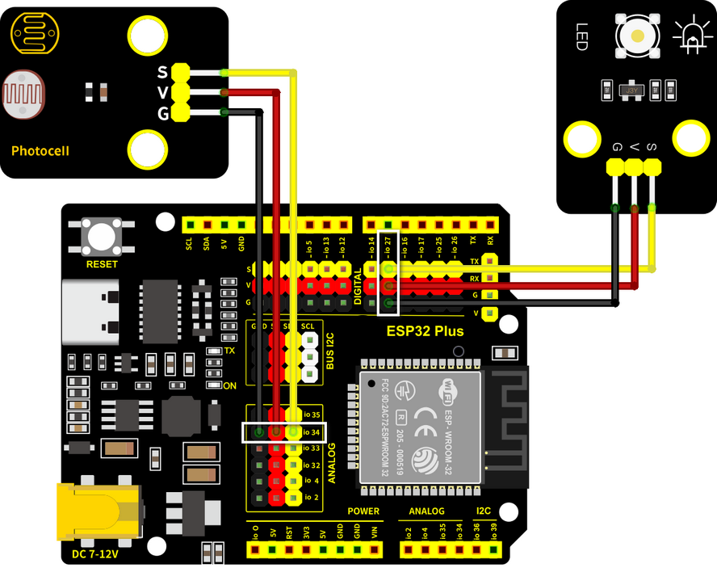

------


### 代码

------

#### 代码流程图

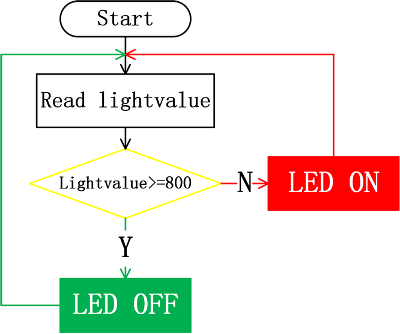

------


代码如下：

- 判断读取到的光敏值，数值小于800，将会开启点亮LED，反之关闭。

  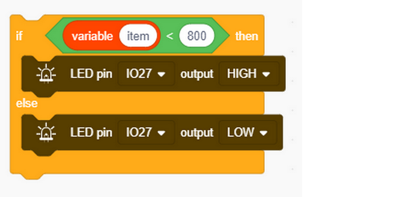

- 完整代码：

  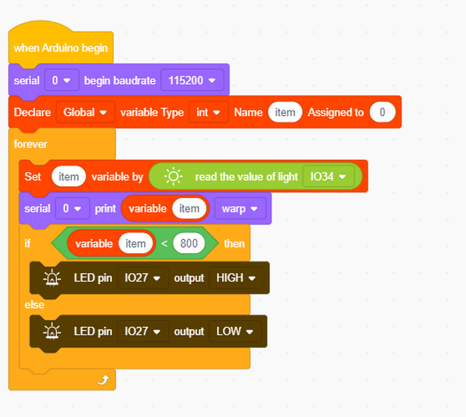

### 结果

当白天光照较强时，光敏传感器的值大于800时，LED会关闭，当天黑后，光敏传感器的值小于800时，LED会自动打开。

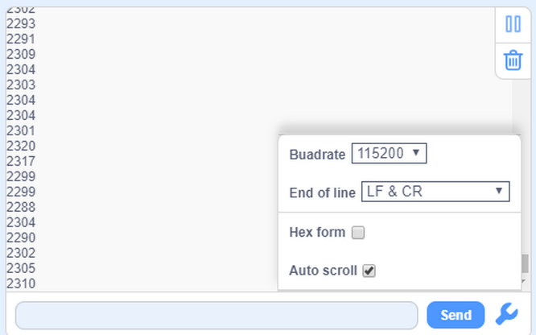

------


**这种系统广泛应用于不同场景，并且通过使用光敏传感器，实现自动检测白天和黑夜以及光的强度，使得整个系统更加智能化和节能。**

------

## FAQ

### 问：光敏传感器检测到的值不能为0？

答：因为在实际操作中，即使把灯全部关闭，做到室内非常黑，光敏的值也只是无限接近于0

------


### 问：烧录了示例代码，为什么房间关灯了LED还不能亮起来？

答：可以把判断读取到的光敏传感器，设置大一点，示例中的值为800，可以调至1000，甚至更大。


------

## 第三课：防盗警报系统

人体红外热释电传感和蜂鸣器组成的防盗报警系统，可以使用ESP32开发板进行控制。使用Arduino IDE进行编程，可以通过读取人体红外热释电传感器，所检测到的红外热释电信号，来确定是否有人在室内。如果有人，则蜂鸣器发出警报声。通过这种方式，可以实现低成本的防盗报警系统，适用于家庭或办公场所。

### 防盗警报系统流程：

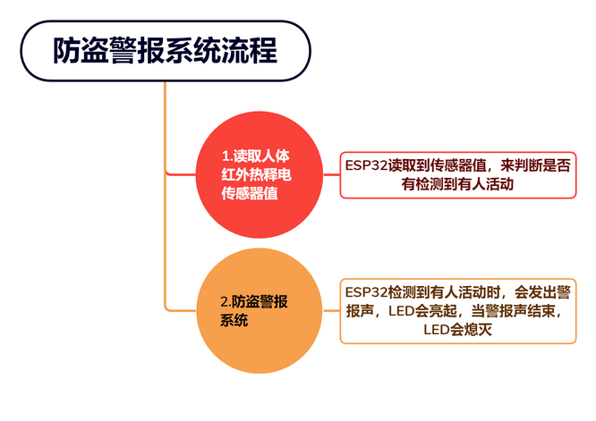

------


### 人体红外热释电传感器

#### 概述

人体红外热释电传感器是一种能够检测人体红外热释电信号的传感器。它通过感应人体所释放的热量来检测人的存在。传感器体积小，便于使用。

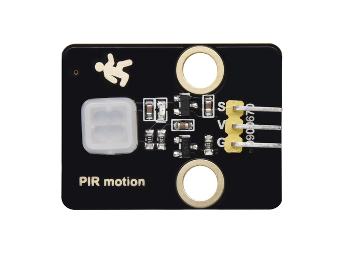

------

**原理图：**

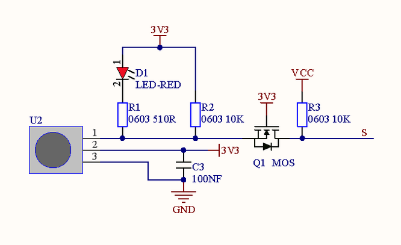

**参数：**

- 电压：3~5V
- 电流：3.6mA
- 功率：18mW
- 视野角度：Y = 90°，X = 110°（视野角度为理论数值）
- 探测距离：≤5m

------


#### 接线图

**模块连接到io23**

**注意使用连接线连接时，黄色线为S信号线，红色线为V电源线，黑色线为GND，颜色一一对应，请勿插反！**

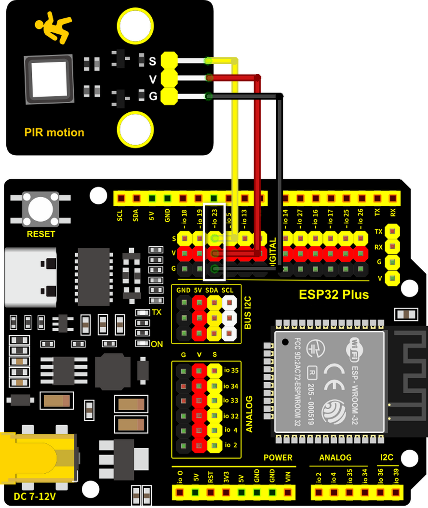

------


#### 代码

------

代码如下：读取引脚23的值，来判断是否检测到人。

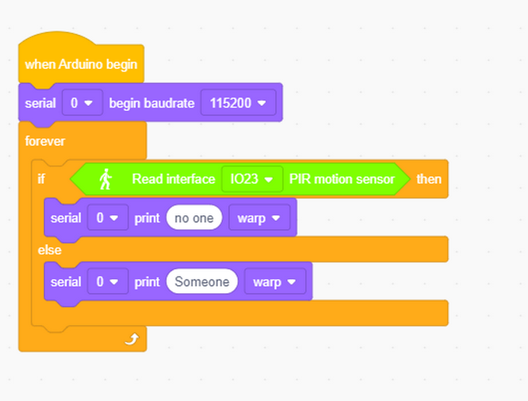

#### 结果

打开串口监视器，当有人经过传感器时，会显示**Someone**，并且传感器上的红色LED会熄灭，没人时，会一直显示**No one**，传感器上的红色LED会常亮。注意：人体红外热释电传感器并没有穿透能力，在检测人体移动时，请不要遮挡传感器。

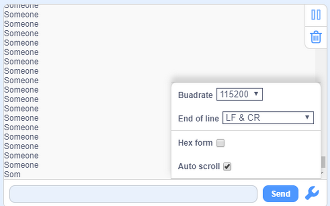

------


### 蜂鸣器模块

#### 概述

蜂鸣器是一种广泛应用于电子产品中的电子讯响器，以直流电压供电，能够发出不同频率和持续时间的声音。它可以用于计算机、打印机、复印机、报警器、电子玩具、汽车电子设备、电话机、定时器等各种电子设备中，用来发出提醒或警报声。

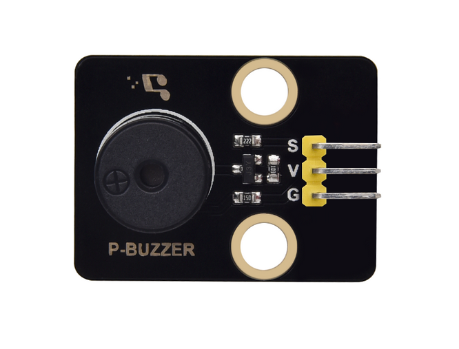

------

蜂鸣器的发声原理由**振动装置**和**谐振装置**组成，它分有有源和无源蜂鸣器。

- **无源蜂鸣器**内部没有激励源，只有给它一定频率的`方波信号`，才能让蜂鸣器的振动装置`起振`，从而实现发声，同时，输入的方波频率不同，发出的声音也不同（所以无源蜂鸣器可以模拟曲调实现音乐效果）。
  - 引脚的电平变化可以模拟方波，例如引脚高电平持续500微秒后，再变换为低电平500微秒，紧接着再变换为高电平…
  - **以200~5000Hz的方波去驱动无源蜂鸣器，方波的赫兹可以通过公式 f=1/T，其中f为频率，T为一个完整的周期所用时间（即高低电平各持续的时间之和）来计算。**

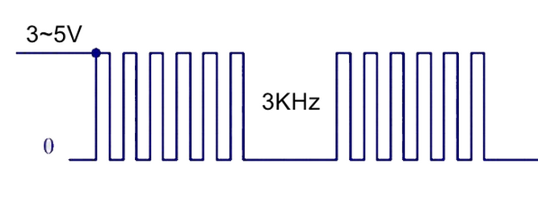

- **有源蜂鸣器**则不需要外部的激励源，内部已经含有驱动电路，只需要接入`直流电源`，即可自动发出声音（声音频率相对固定），当时声音单一。

------

**本教程中使用的是无源蜂鸣器，因此可以模拟音乐效果。**

------

**原理图：**

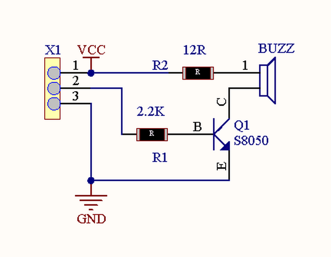

------

**参数：**

- 电压：3~5V
- 电流：≤5mA
- 功率：≤25mW

------


#### 接线图

**模块连接到io16**

**注意使用连接线连接时，黄色线为S信号线，红色线为V电源线，黑色线为GND，颜色一一对应，请勿插反！**


------


#### 代码

##### 蜂鸣器驱动方式一：

无源蜂鸣器都是采用方波驱动的，下面我们就来尝试下模拟方波。

引脚的电平的变高和变低，可以模拟方波：高电平保持500us，然后再变低电平500us，就可以让蜂鸣器发出声音。时间高低电平变化的时间，可以改变蜂鸣器的声音大小。可以试着尝试变为1000us、1500us、3000us…

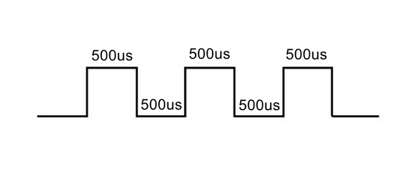

------


代码如下：

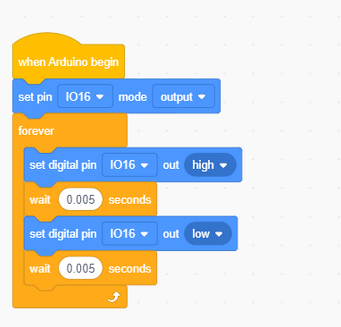

- 其中时间暂停函数是微秒级的暂停，表示时间暂停500微秒。


通过 f=1/T，500us的变换高低电平，可以知道，这样的方波频率为2kHz（即每秒钟变换高低电平的次数为2000次）。

------


##### 蜂鸣器驱动方式二：

使用Spaeker代码块驱动。

**Spaeker代码块可以产生固定频率的PWM信号来驱动扬声器发声**，发声时间长度和声调都可以通过参数控制。

定义发声时间长度有两种方法，第一种是通过tone()函数的参数来定义发声时长，另一种是使用noTone()函数来停止发声。如果您在使用tone()函数时没有定义发声时间长度，那么除非您通过noTone()函数来停止声音，否则将会一直通过tone()函数产生声音信号。

ESP32一次只能产生一个声音。假如ESP32的某一个引脚正在通过tone()函数产生发声信号，那么此时让ESP32使用另外一个引脚通过tone()函数发声是不行的。

------

**音调表如下**

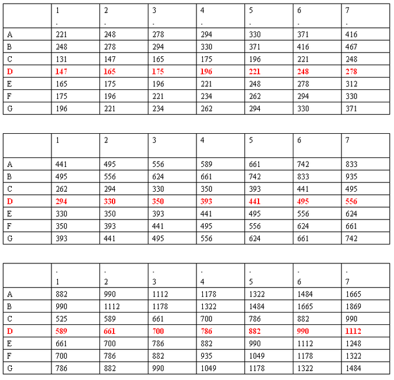

------


代码如下：

- 从拖动代码块，引脚选择IO16

  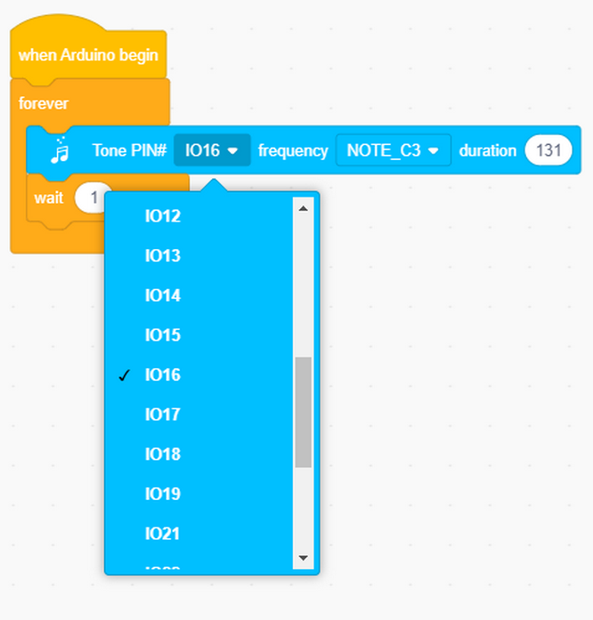

- 节拍频率可以自己选择

  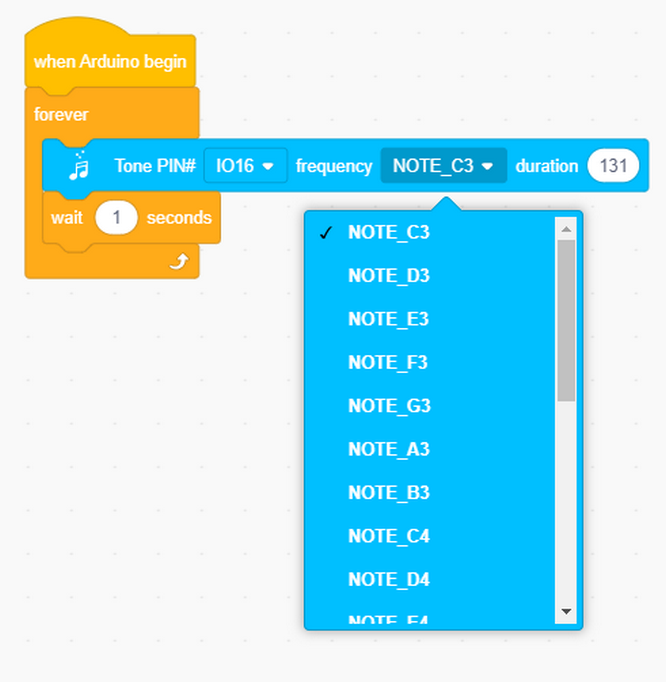

- 关闭Tone功能，播放完音乐后记得关闭。

  

- 完整代码

  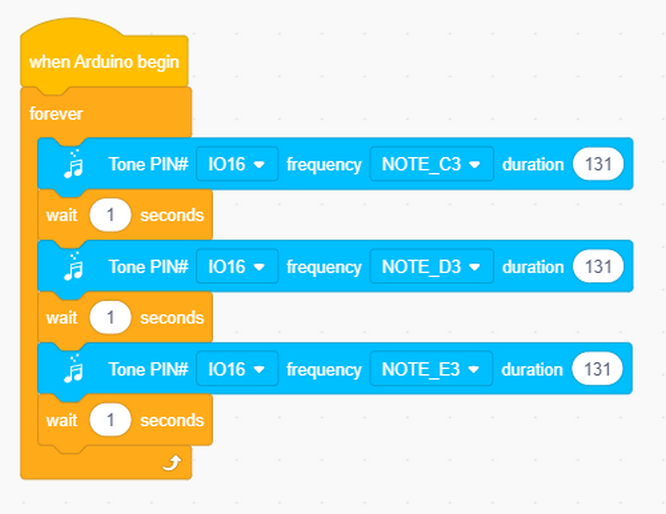

#### 结果

方法一：蜂鸣器会持续发出声音。

方法二：使用tone()方法，可以发出特定的声调。

------


#### 扩展

使用tone()方法播放音乐。

代码如下：


### 防盗警报系统

该教程介绍了如何使用人体红外热释电传感器、蜂鸣器和LED组合成一个基于Arduino的防盗警报系统。当传感器检测到活动时，蜂鸣器会发出声音，LED会闪烁，从而提醒使用者有人进入区域。

------


#### 接线图

**人体红外模块连接到io23，蜂鸣器连接到io16，LED连接到io27**

**注意使用连接线连接时，黄色线为S信号线，红色线为V电源线，黑色线为GND，颜色一一对应，请勿插反！**


------


#### 代码

##### 代码流程图

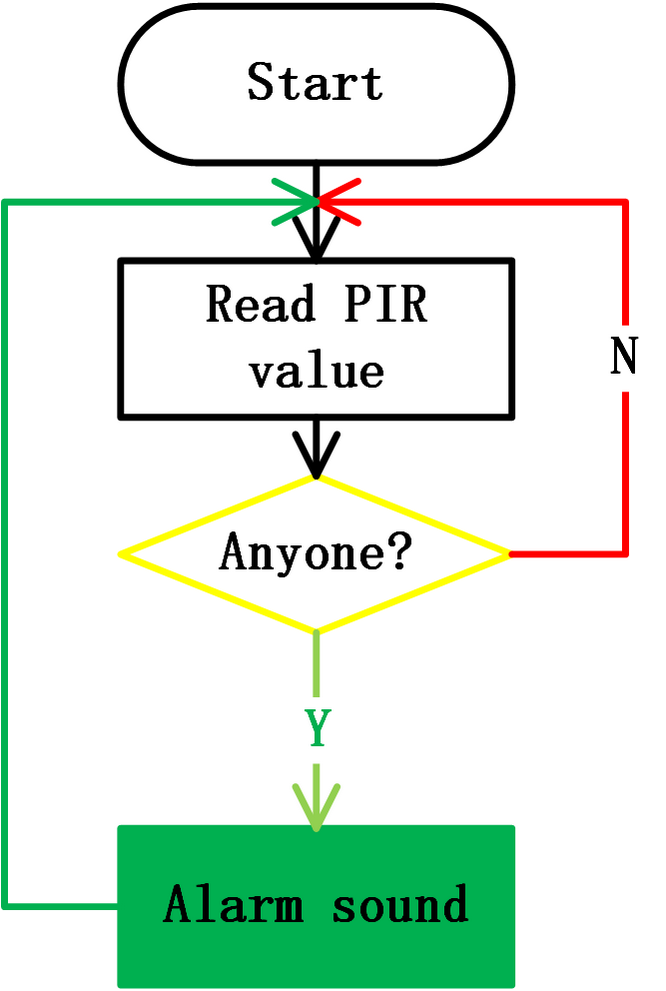

------


代码如下：

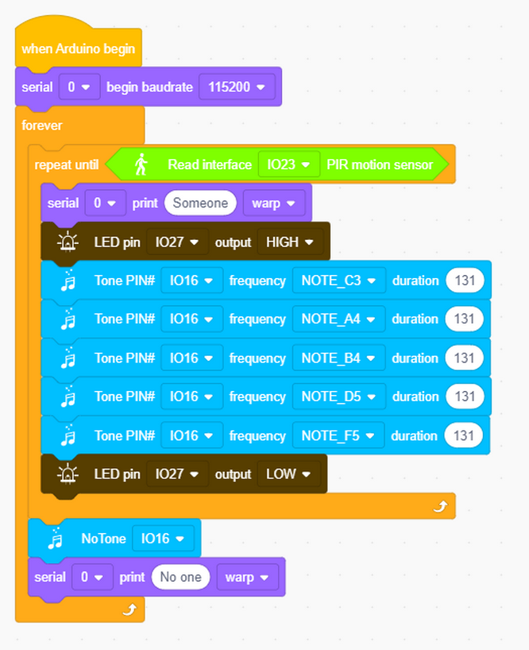

#### 结果

当开启警报系统后，只要检测到有人移动，警报声就会响起来，警示灯也会闪烁。

------


## FAQ

### 问：蜂鸣器的音调与实际音调不准？

答：普通蜂鸣器模拟的音调，达不到专业音调的要求，如需非常准确音调，需要更专业的喇叭。

------


### 问：人体红外热释电传感器误报？

答：非专业的人体检测传感器。

人体红外报警器避免误报警要求如下

- 探测范围内避开被风吹而引起飘动的物体，如：窗帘、衣物、花草等。
- 探测范围内避免强光照射干扰，如：阳光照射、汽车灯光照射、射灯照射及照明等光源。
- 等等。

------

## 第四课：雨水检测系统

------

#### ***注意：水洒在其他传感器上会导致短路，导致设备失效，洒在电池上会导致发热爆炸。请在使用设备时格外小心，尤其是幼儿使用时一定要在家长的监护下进行。为确保设备的安全运行，请遵循相关使用指南和安全规范。***

------

本教程介绍了如何使用水滴传感器和ESP32来创建一个雨水检测系统。当传感器检测到雨时，ESP32可以触发各种动作，如发送通知、激活洒水器或打开灯。这个系统可用于监测园艺或农业的雨量，或检测屋顶或建筑物的漏水情况。水滴传感器可以很容易地连接到ESP32开发板板上，形成一个简单而有效的雨水检测系统。


------


### 雨水检测系统流程：


------


### 水滴传感器

#### 概述

水滴传感器是一种可用于检测水的存在的传感器，它通常用于雨水检测系统。当雨水接触到传感器上的导电垫（检测区）时，它会向ESP32板发送信号，以触发各种动作。检测区上的水量越多，模拟值越大。

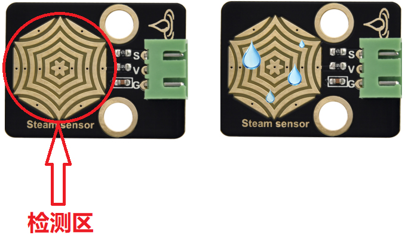

**原理图：**

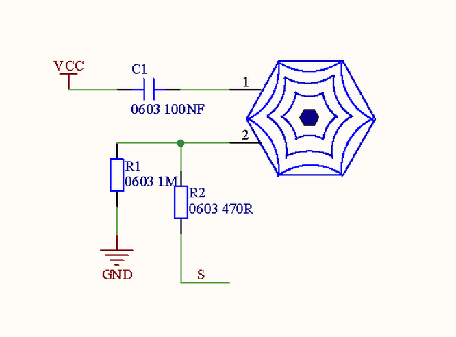

**传感器参数：**

- 工作电压：DC 3.3V~5V
- 工作电流：(Max)1.5mA@5V
- 最大功率：75mW
- 检测区
- 信号类型：模拟信号

#### 接线图

**模块连接到io35**

**注意使用连接线连接时，黄色线为S信号线，红色线为V电源线，黑色线为GND，颜色一一对应，请勿插反！**


------


#### 代码

代码如下：

- 初始化串口

  

- 读取io35引脚上的传感器值，每隔1秒打印

  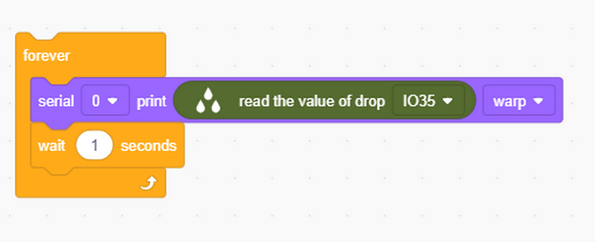

- 完整代码

  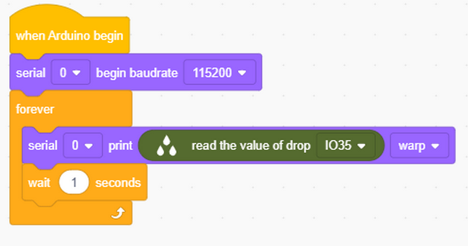

  

  

#### 结果

用湿润的手指去触碰传感器上的检测区域，触碰的面积越大，接收到的值就越大，打开串口，可以查看当前检测的数字（0~4095）。

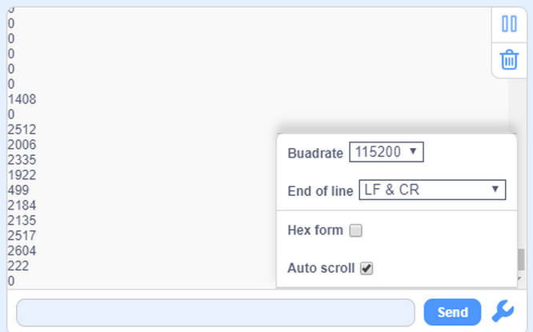

------


### 雨水检测系统

#### 概述

当水滴传感器检测到雨水时，它会向Arduino板发送一个信号，可以触发各种动作。例如，可以用一个蜂鸣器发出警报声，提醒用户正在下雨。这一功能对户外园艺或农业特别有用，使用户能够采取必要的预防措施，避免过度浇灌植物。

此外，使用水滴传感器和Arduino的雨水检测系统可用于检测屋顶或建筑物的漏水情况，帮助防止水入侵造成的损害。总的来说，水滴传感器是一个多功能的有效工具，可以在各种应用中检测水的存在。

#### 接线图

**水滴传感器连接到io35，蜂鸣器连接到io16**

**注意使用连接线连接时，黄色线为S信号线，红色线为V电源线，黑色线为GND，颜色一一对应，请勿插反！**

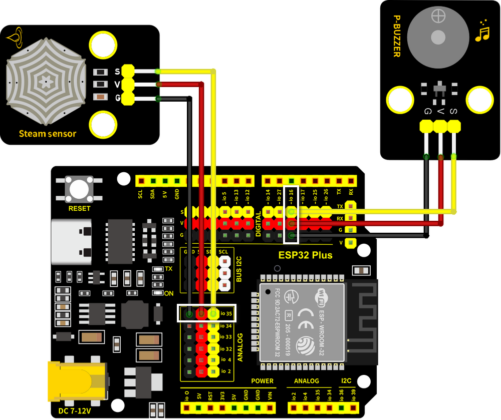

------


#### 代码

##### 代码流程图

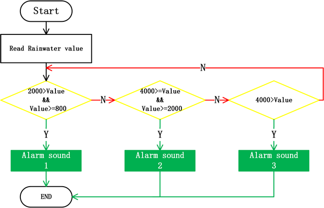

------


代码如下：

- 初始化串口，并定义一个接收传感器的值**item**

  

- 接收传感器的值，并用串口打印出来

  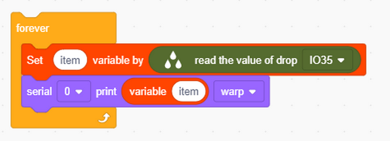

- 判断接收到的传感器值，大于800并且小于1999，蜂鸣器将播放提示音

  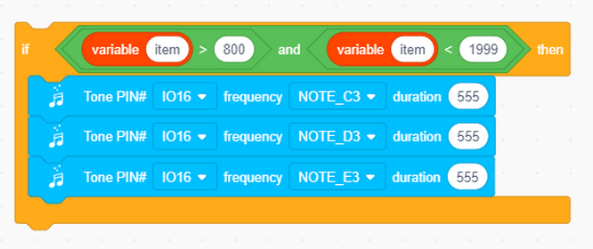

- 判断接收到的传感器值，大于2000并且小于2999

  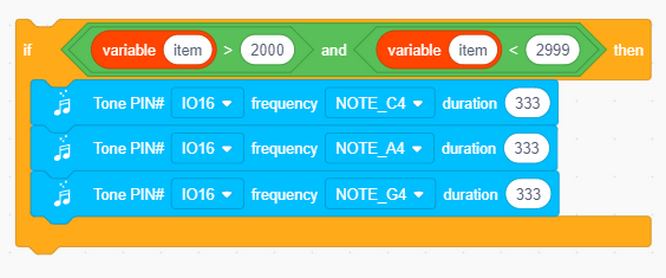

- 判断接收到的传感器值，大于3000

  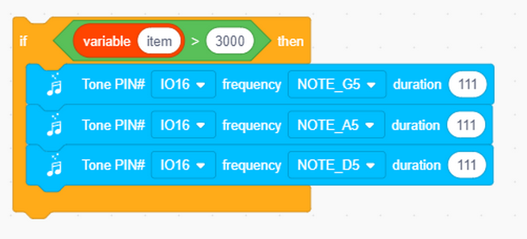

- 执行完后，关闭蜂鸣器

  

- 完整代码

  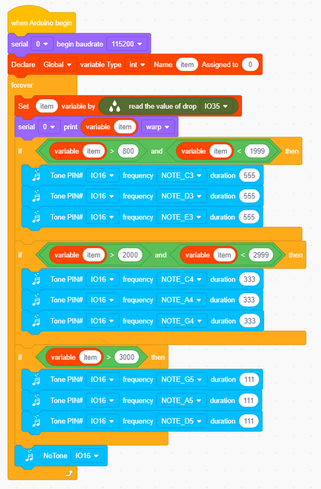

#### 结果

当传感器检测到的雨水值越大，蜂鸣器报警声音越大。

------


## FAQ

### 问：水滴传感器防水吗？

答：检测区域是可以接触水的，属于模拟现实事件，但是引脚接线处是不防水的，检测水时，请注意水量不要过多，以防短路。

------


### 问：水滴传感器检测到水后，过了很久，警报声还一直响？

答：蜂鸣器一直报警，是因为水滴传感器的检测区域，还残留水渍，清理干净即可。

------

## 第五课：太阳能电力系统


------


#### 概述

太阳能板用于将光能转化为电能，然后为LED灯供电。它可以用于各种应用，如为户外照明供电，为移动设备充电，甚至作为家庭或企业的备用电源。通过将太阳的力量与Arduino的灵活性相结合，用户可以根据自己的具体需求,创建复杂而高效的太阳能发电系统。

------


#### 太阳能板是如何把太阳能转换成电能的呢？


太阳能板通过吸收光线，将太阳辐射光电效应，直接或间接转换成电能的装置，与普通煤炭发电相比，太阳能发电和风力发电、水利发电等，更节能环保。

------


##### 光能如何转换成电能？

接下来我们从内到外，来说说太阳能电池板的转换过程。

------


**太阳以波的形式发出能量，这些波的波长范围很广，从紫外线到可见光到红外线。**

- 紫外线波长范围：150~400nm；
- 可见光波长范围：400~760nm；
- 红外线波长范围：760~4000nm；

***太阳能电池板就是吸收其中的一个范围的波长，从而转换成电能。那么他是如何实现的呢？我们接着往下看。***

------

**太阳能板电池的活性部分是由半导体材料制成，通常是硅（Si）。**


半导体是指在常温下导电性能介于导体与绝缘体之间的材料，一般情况下，无法良好导电，但在某些条件下具有很好的导电性。

------


**以上这张图是太阳能电池的内部半导体**，**分为三层：**

1. **红色部分顶层：**包含硅（Si）和极少量的磷（P），磷带的电子比硅多，为顶层提供了充足的电子，这些可以自由移动的电子使顶层的材料具有了导电性。**因此，顶层也称为负型或n型。**

2. **灰色部分中间层**只有很少的电子，使其导电性很差。

3. **绿色部分的底层：**包含硅（Si）和硼（B）等元素，硼带的电子比硅少，使底层可以自由移动的电子比较少，这些缺少的电子可以描述为有效正电荷。**因此，底层被称为正型或P型。**

   

------


**太阳能电池板吸收的光波波长范围通常在350~1140nm，只有这部分的光能被太阳能电池板的中间层所吸收**，从上面太阳光波长范围可见，太阳能电池板吸收的这部分光包括可见光、紫外线的长波部分和红外线的短波部分。


------

**紫外线波长太短，他们一般都会停留在太阳能电池板的表面。**


------

**红外线波长太长，太阳能电池板无法吸收这部分的光能，这部分光一般会穿过整个板子或者被反射回去。**


------

太阳能电池板的中间层，吸收这部分的光能，将电子从顶层和底层的硅原子上击落，使电子处于游离状态，而电子之前所在的位置会产生一个空的电子穴。


这个电子穴带正电荷，也称为“空穴”，游离状态的电子会向顶部移动并到达顶部的n型层，空穴同样会向底部移动并到达底部的P型层。

**简单来说：中间层吸收太阳光能后，把顶层和底层的电子转化出来，顶层（N型层）转化成负电荷，为负极，底层（P型层）转化为正电荷，为正极，只要用导线将这两层接通，就可以通电。**


------

只要阳光照射到太阳能电池板上，上面描述的情况就会持续产生，就会产生大量游离的电子和空穴，电子向顶层移动，空穴向底层移动，就形成了电极，电子的流动就产生的电流。


------


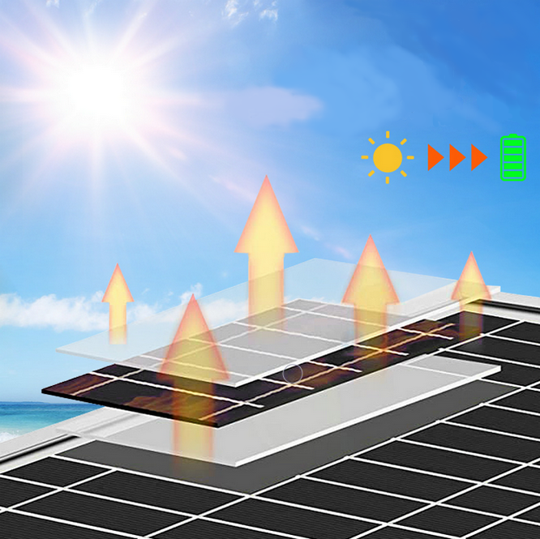

太阳能具有许多优点，它可以作为一种可持续的、成本效益高的替代能源。

但是一个太阳能电池板产生的电流可以转换成数瓦的功率，这可能对一个计算器或者手机充电器是够用了，但是如果要运行一台一千瓦的烤面包机那是远远不够的。

总的来说，太阳能是一种非常有前途的能源，能够帮助我们创造一个美好、可持续的未来。

太阳能系统能够满足不同用户的需求，同时也有良好的环保效益。结合Arduino 编程，可以构建各种有用和高效的太阳能应用，比如自动化灯光系统、充电器、以及智能家居等。


------


太阳能板参数：

- 电压：5V
- 电流：80mA
- 功率：400mW
- 尺寸：60*60mm

------


#### 结果

本课程无需代码，主要了解太阳能这种新的环保能源。当太阳能板移动到光线充足的地方，LED会亮起黄灯，光线越强，LED就越亮。

------


## FAQ

### 问：太阳能板为什么没有太阳光也能工作？

答：太阳能板再太阳光和普通光源下都可以工作，太阳光的强度更大，电压就越高，普通光源强度越大，电压也越高，电压越大，LED越亮。

------

## 第六课：智能喂养系统

通过超声波传感器来检测动物是否在喂食区，可以驱动伺服开关打开喂食盒，自动喂食动物。融入物联网技术可以实现对饲喂系统的远程监控，提供另一个层面的便利和控制。总的来说，喂养系统的自动化和远程化，优化动物的喂养过程。


------

### 智能喂养系统流程：

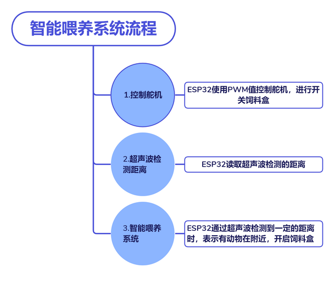

------


### 舵机

#### 概述

舵机是**伺服电机**的一种，伺服电机就是带有反馈环节的电机，我们可以通过伺服电机进行精确的位置控制或者输出较高的扭矩；舵机也叫也叫 **RC 伺服器**，通常用于机器人项目，也可以在遥控汽车，飞机等航模中找到它们。


内部结构图：

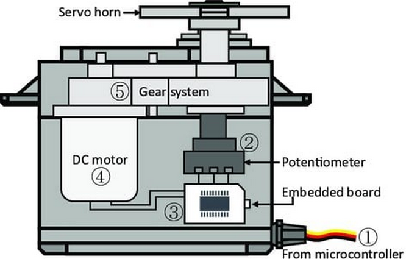

- 信号线：接收来自微控制器的控制信号；
- 电位器：可以测量输出轴的位置量，属于整个伺服机构的反馈部分；
- 内部控制器：处理来自外部控制的信号，驱动电机以及处理反馈的位置信号，是整个伺服机构的核心；
- 电机：作为执行机构，输出多少转速，转矩，位置；
- 传动机构/舵机系统：该机构根据一定传动比，将电机输出的行程缩放到最终输出的角度上；

------


**驱动舵机：**

通过向舵机的信号信号线发送PWM信号来控制舵机的输出量，**PWM脉冲的占空比直接决定了输出轴的位置。**

例如：

- 当我们向舵机发送脉冲宽度为1.5毫秒（ms）的信号时，舵机的输出轴将移至中间位置（90度）；
- 脉冲宽度为`0.5ms`时，舵机的输出轴将移至最小的位置（0度）；
- 脉冲宽度为`2.5ms`时，舵机的输出轴将移至最小的位置（180度）；

***注意：不同类型和品牌的伺服电机，他们最大位置和最小位置的角度可能会不同。许多伺服器仅旋转约170度（或什至仅90度），但宽度为1.5 ms的伺服脉冲，通常会将伺服设置为中间位置（通常是指定全范围的一半）；***

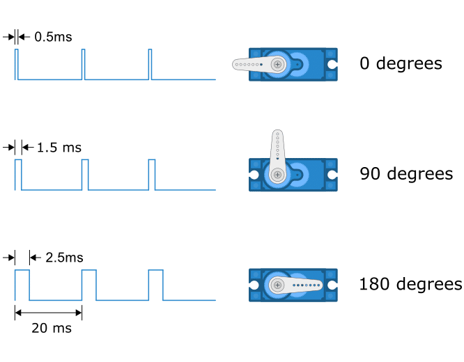

伺服电动机的周期通常为20毫秒，希望以`50Hz`的频率产生脉冲，但是许多伺服器在40至200 Hz的范围内都能正常工作。

------


#### 接线图

**模块连接到io26**

**注意使用连接线连接时，黄色线为S信号线，红色线为V电源线，黑色线为GND，颜色一一对应，请勿插反！**


------


#### 代码

代码如下：

- 先初始化串口，并定义一个变量**item**，初始值为80

  

- 把**item**设定为舵机的角度，从80度旋转到180度，每15毫秒旋转一度

  

- 舵机角度从180度旋转到80度，每15毫秒旋转一度

  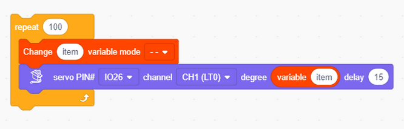

- 完整代码

  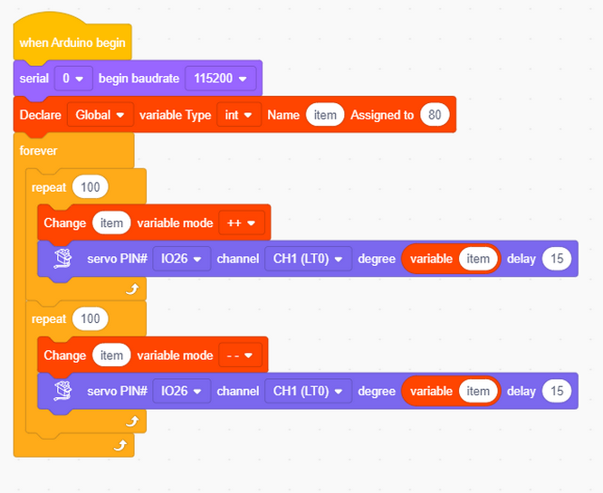

#### 结果

可以看到饲料盒在慢慢打开，慢慢关闭，实现可控制的。

**注意：SG90舵机是180度，在套件中的饲料盒较小，SG90舵机只需旋转100度，就能完全关闭饲料盒。**

- 80度：完全打开。
- 120度：打开一半。
- 180度：关闭。


------

**注意：请勿将手指伸入到饲料盒中，谨防夹伤！请勿将其他物体堵住饲料盒盖，以免弄坏舵机。**

------


### 超声波传感器

#### 概述

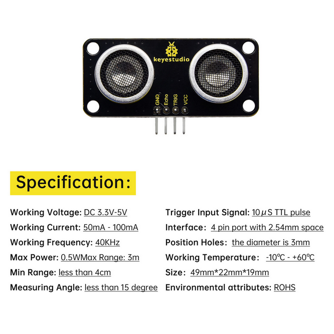

**原理图：**

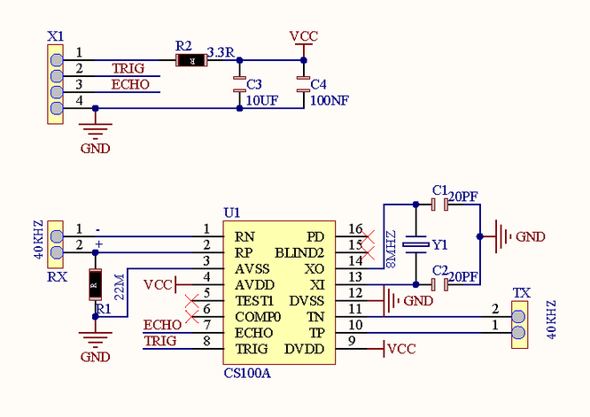

------


人类耳朵能听到的声波频率为20Hz～20KHz，而超声波就是超过了人类可听到的范围。

超声波的范围：

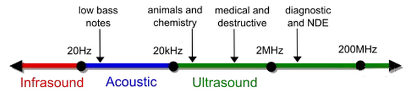

------

超声波传感器是一种利用压电效应将电能和超声波相互转化的装置，可以发射和接收超声波。超声波具有方向性、穿透力强和容易集中声能等特性。

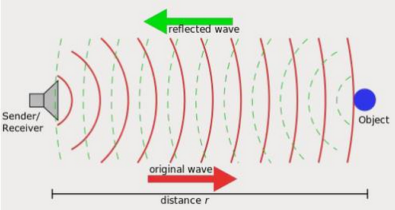

通过单片机(ESP32开发板)编程产生40KHz方波，驱动超声波传感器发射超声波，并经过接收电路放大、整形接收反射波后计算距离的超声波测距系统。系统可以记录超声波发射和反射波的时间，利用定时器计数计算时间差，从而计算出距离。

简单来说就是单片机控制超声波发射模块发出超声波，遇到障碍物反弹回来，被超声波接收模块接收到，然后计算这段时间（声音在空气中传播的速度为340m/s），通过计算，得出相应距离。

------


#### 接线图

**模块的Echo连接到io13，Trig连接到io12**

**注意使用连接线连接时，黄色线为S信号线，红色线为V电源线，黑色线为GND，颜色一一对应，请勿插反！**

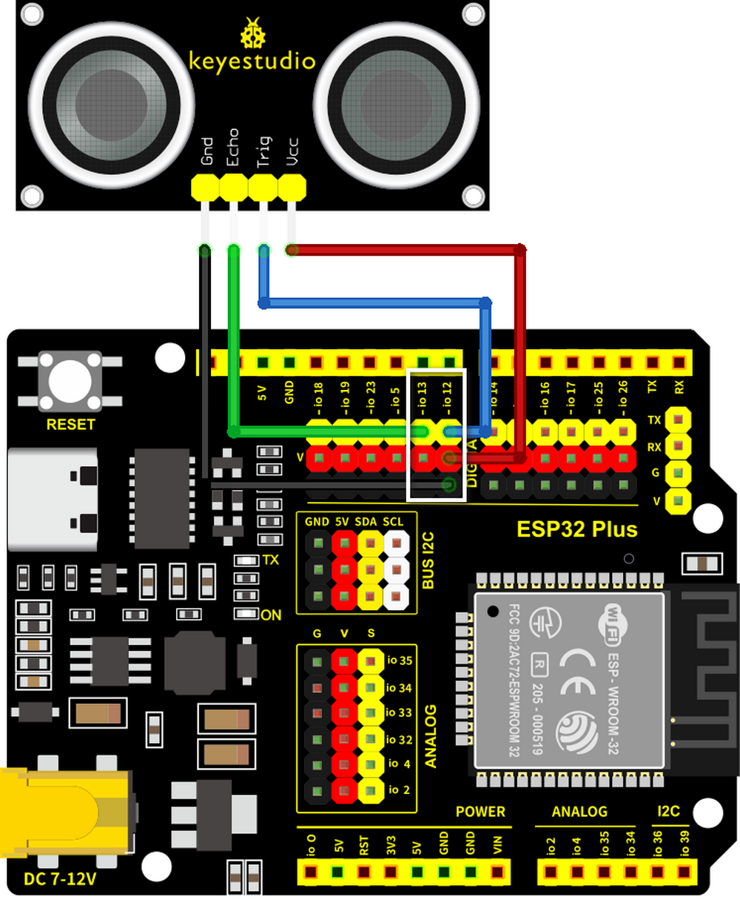

------


#### 代码

代码如下：

设置好对应的引脚，Trig设置为12引脚，Echo设置为io13引脚。

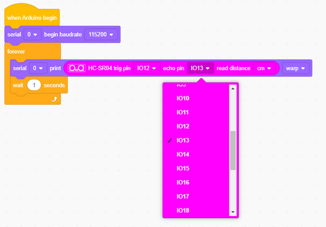

#### 结果

在智慧农场中，超声波检测的距离，打开串口，即可查看。

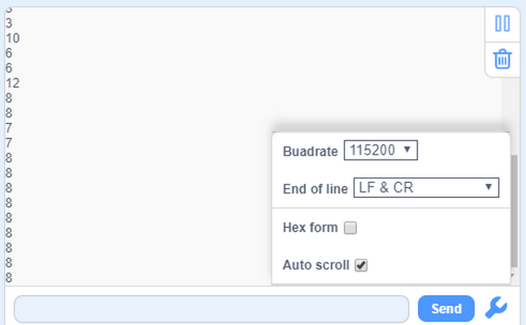

------


### 智能喂养系统

#### 概述

智能喂养系统是通过组合超声波传感器和舵机，实现对动物的智能喂养。超声波传感器用于检测宠物的距离，当宠物靠近食物盆时，传感器检测到距离变近，触发信号后控制舵机将饲料盒打开。

#### 接线图

**超声波模块的Echo连接到io13，Trig连接到io12，舵机连接到io26**

**注意使用连接线连接时，黄色线为S信号线，红色线为V电源线，黑色线为GND，颜色一一对应，请勿插反！**

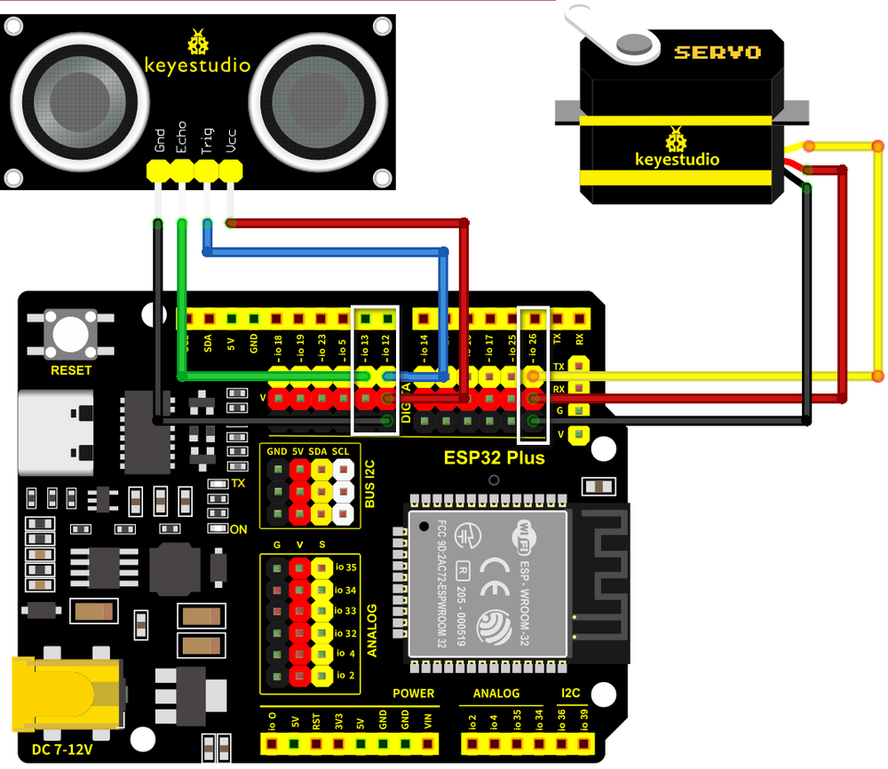

------


#### 代码

##### 代码流程图：

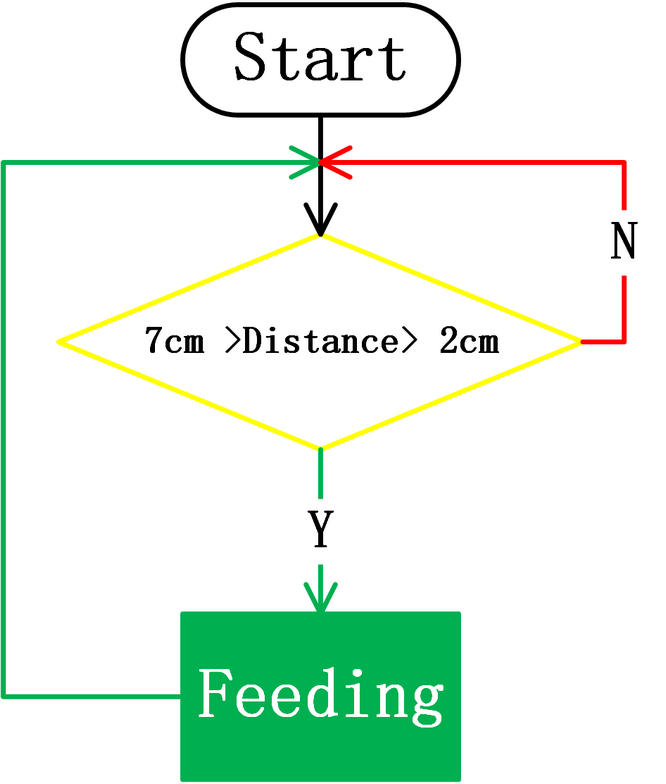

------

代码如下：

- 初始化串口，定义一个变量，初始值为180

  

- 设置好传感器引脚，打印接收到的传感器值

  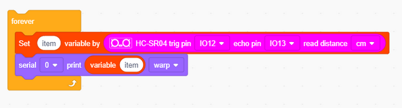

- 判断超声波检测的距离，大于2cm并且小于7cm时，打开饲料盒

  

- 完整代码

  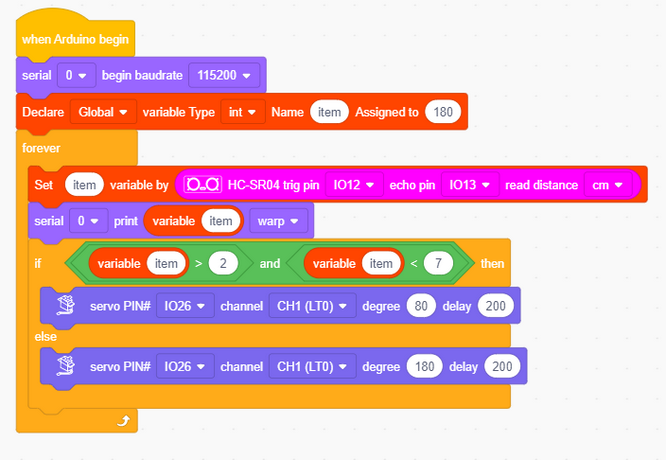

#### 结果

当超声波检测到有动物时，将开启饲料盒。

**注意：请勿将手指伸入到饲料盒中，谨防夹伤！请勿将其他物体堵住饲料盒盖，以免弄坏舵机。**

------


## FAQ

### 问：舵机为什么不工作？

答：可能卡死了，在安装舵机前，先使用代码调整到0角度，或者是盖上底板时线材卡住了，请参阅智能家居安装步骤。

------


### 问：超声波检测时，为什么检测距离不准？

答：应从超声波的发射头处开始测量，此模块非高精度超声波距离检测模块，会有误差。


------

## 	第七课：农场温控系统

本教程介绍如何使用温湿度传感器、风扇模块和LCD1602显示屏，构建一个智能温湿度控制系统。

该系统能够测量环境温度和湿度，并根据需求控制风扇降温。当温度超过设定阈值时，系统会自动开启风扇，将环境温度降至设定值以下。同时，系统会在LCD1602上显示当前温度和湿度值。该系统能够实现自动调节环境温湿度的功能，对于需要控制环境温湿度的项目具有很好的应用价值。


------


### 农场温控系统流程：


------


### 温湿度传感器

#### 概述

DHT11数字式温湿度传感器，是一种数字信号输出的温湿度传感器。它利用特殊的模拟信号采集、转换技术和温度、温湿度传感技术，确保传感器拥有良好的长时间稳定性，和较高的可靠性。该传感器内部包含高精度的电阻式湿度传感器件，和电阻式热敏测温传感器件，并与一个8位的性能高的单片机相连接。

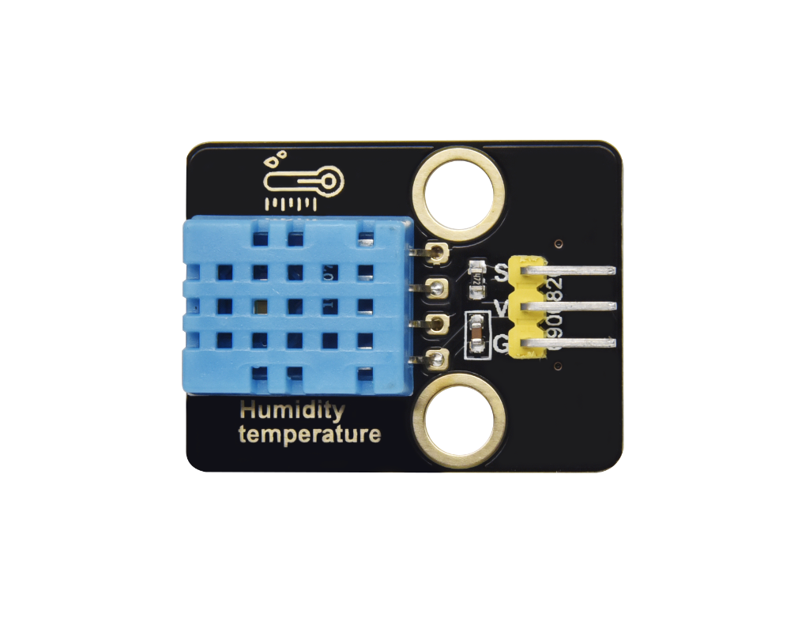

------

**DHT11通信方式：**

DHT11 器件采用简化的单总线通信。单总线即只有一根数据线，系统中的数据交换、控制均由单总线完成。

- 单总线传送数据位定义：

  - 单总线数据格式：一次传送 40 位数据，高位先出。

  - 8bit 湿度整数数据 + 8bit 湿度小数数据 + 8bit 温度整数数据 + 8bit 温度小数数据 + 8bit 校验位。**注：其中湿度小数部分为 0。**

- 校验位数据定义：
  - 8bit 湿度整数数据 + 8bit 湿度小数数据 + 8bit 温度整数数据 + 8bit 温度小数数据。8bit 校验位等于所得结果的末 8 位。

时序图如下：

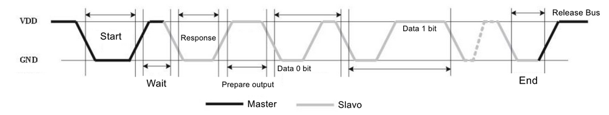

**注：主机从 DHT11 读取的温湿度数据总是前一次的测量值，如两次测间隔时间很长，请连续读两次以第二次获得的值为实时温湿度值。**

更多信息，请参考奥松电子官网：http://www.aosong.com/products-21.html

------


#### 接线图

**模块连接到io17**

**注意使用连接线连接时，黄色线为S信号线，红色线为V电源线，黑色线为GND，颜色一一对应，请勿插反！**

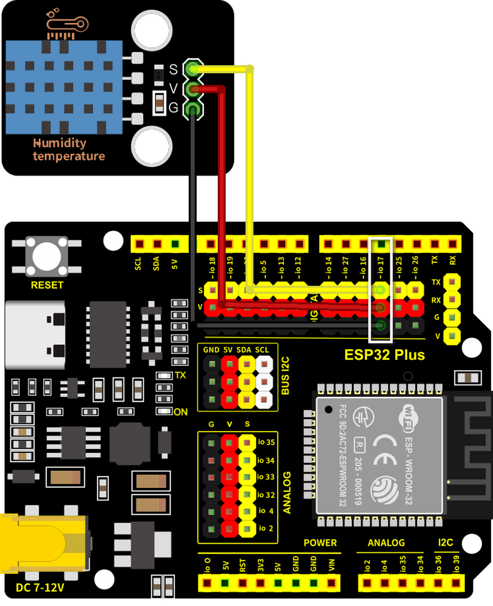

------


#### 代码

代码如下：

- 先初始化串口，初始化传感器

  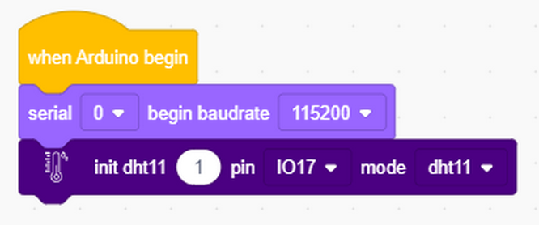

- 串口每隔1秒循环打印温度和湿度

  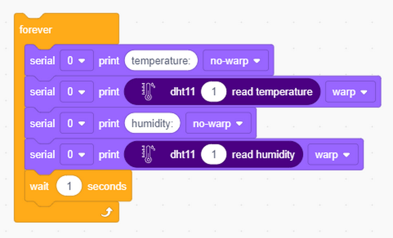

- 完整代码

  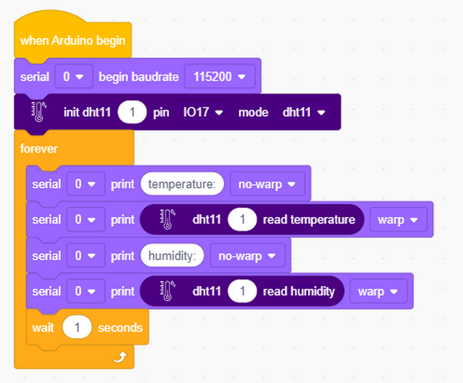

#### 结果

打开串口后，可以查看当前的温度和湿度信息。

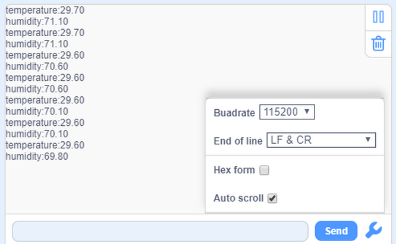

------


### LCD1602模块

#### 概述

LCD1602液晶显示屏是广泛使用的一种字符型液晶显示模块。LCD1602液晶显示屏采用标准的14脚（无背光）或16脚（带背光）接口，通过显示屏驱动IC，实现I2C控制，节省了单片机引脚。

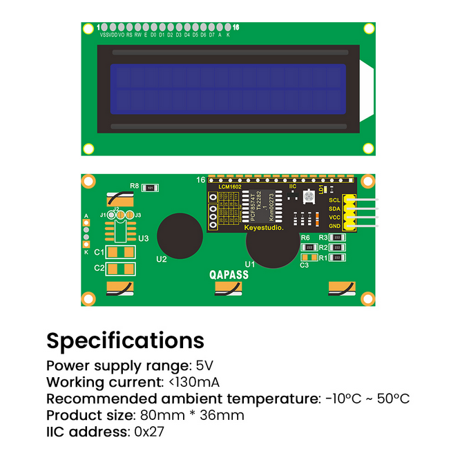

------

**I2C串行通信：**

I2C通信协议是Inter-Integrated Circuit（IIC）的缩写，也叫作两线制或TWI（Two-Wire Interface），是一种通用的主从式的两线总线通信协议，它是由Philips Semiconductor公司开发的（现在被美国NXP半导体公司收购）。

其最大的优点是只需要两根线就可以完成数据的传输，对于系统线路的繁琐也减少了很多，这种总线可以并行联结127个节点，并且支持多主机，从机一般不需要外接电源，因为I2C总线可以把电源传输到从机。如下图。

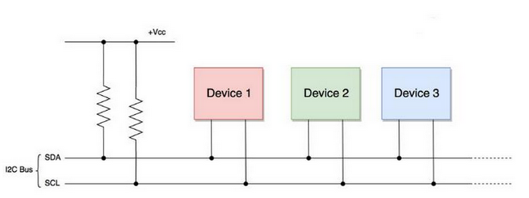

------

I2C总线的数据传输采用8位数据传输的方式，通常一个字节的数据传输是由9个时钟信号组成，8个时钟信号传输数据，最后一个时钟信号用于传输结束的标志。同时，I2C总线也支持多字节的数据传输，不断重复上述过程，即可完成多字节的数据传输。

------

I2C协议的基本组成部分包括以下内容：

- 起始信号：在发送数据之前，发送方必须发送起始信号，以告知接收方，要发送数据了。

- 地址码：地址码用于告知接收方，要发送的数据是给谁的。

- 数据：数据按照位传输，每次传输一个字节的数据。 

- 停止信号：发送完数据后，发送方必须发送停止信号，以告知接收方，数据发送完毕。

**串口协议时序如下：**

具体通信协议请移步官网：https://www.nxp.com/

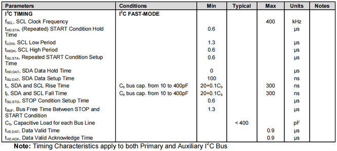

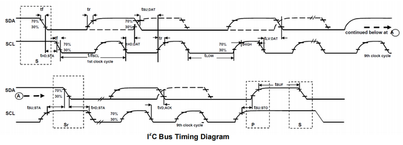

Arduino提供了一个名为Wire.h的I2C协议集成库，可以通过调用其函数实现I2C通信，从而实现与I2C/TWI设备的通信。

具体库介绍参考官网链接：

https://www.arduino.cc/reference/en/language/functions/communication/wire/

------


#### 接线图

**模块连接到I2C BUS**

**注意使用连接线连接时，黄色线为S信号线，红色线为V电源线，黑色线为GND，颜色一一对应，请勿插反！**

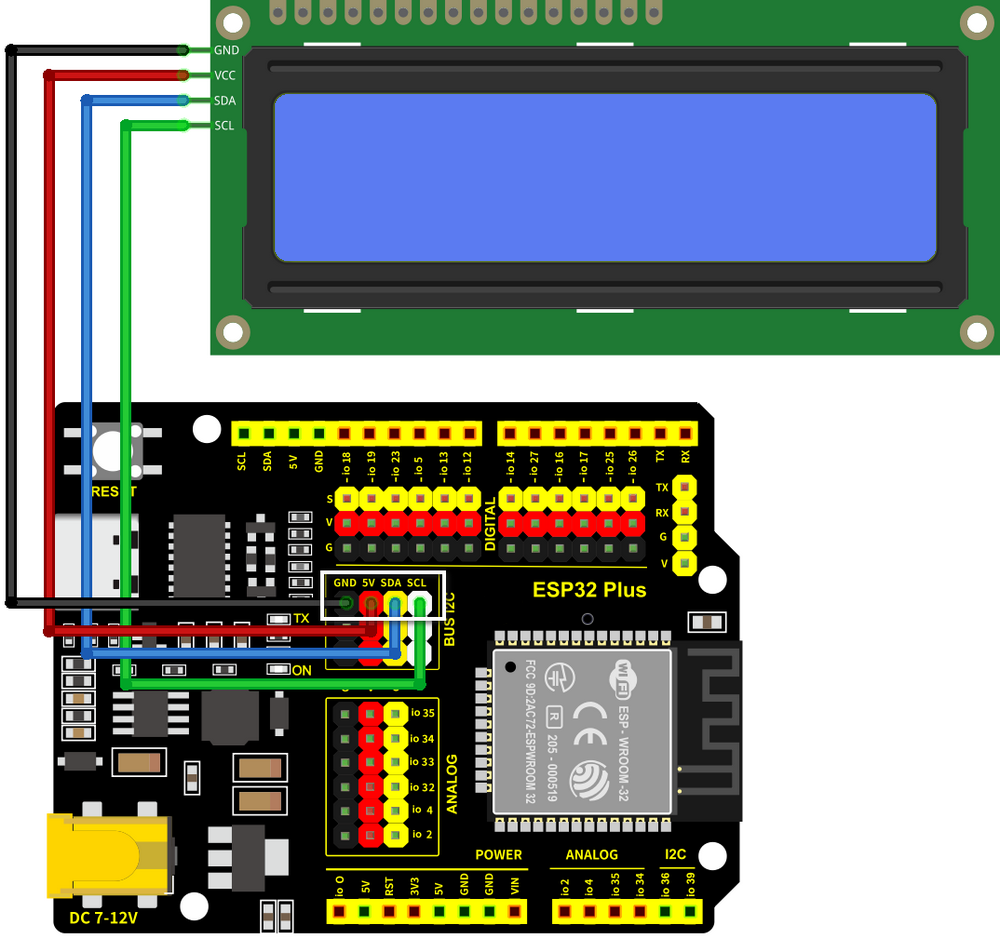

------


#### 代码

代码如下：

- 设置LCD的I2C地址，并设置LCD屏背光打开

  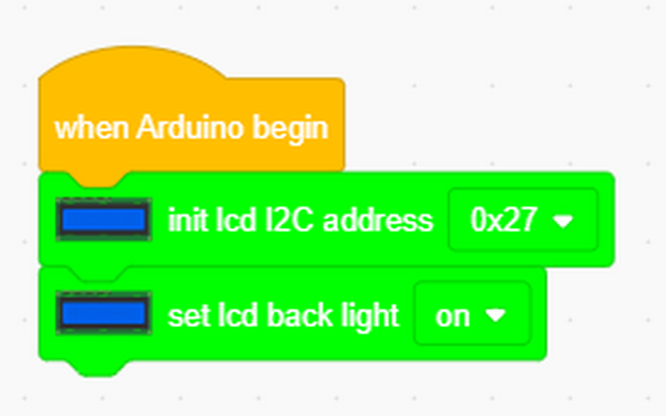

- 设置X轴和Y轴的显示位置（LCD1602的X轴最大显示16个字符，Y轴是最大显示2列）

  

- 设置显示内容（最大不超过16个字符，否则显示不全）

  

- 完整代码

  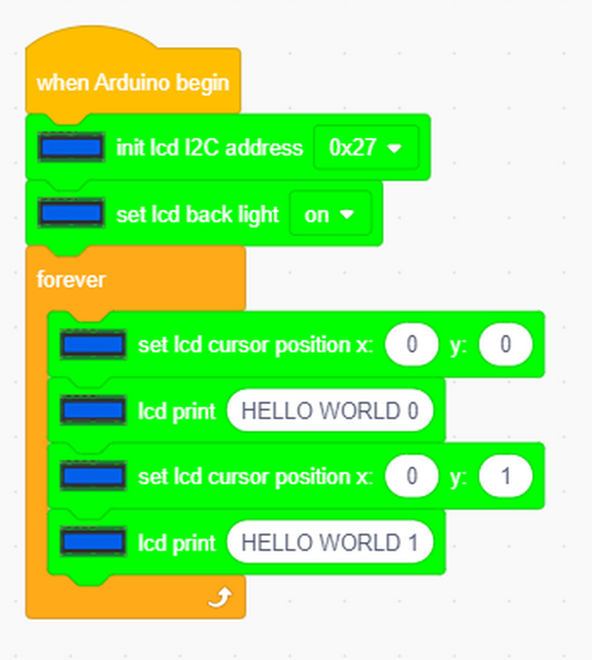

#### 结果

LCD1602会打开背光，并显示两行文字”**HELLO WORLD 0**“和”**HELLO WORLD 1**“.


### 风扇模块

#### 概述

130电机风扇模块是一种可以通过PWM调速的模块，使用时需要接两个引脚进行控制。该模块适用于需要调节风扇速度的应用场景，例如电脑散热、工业生产等。它小巧轻便、安装简单，是一种十分实用的模块。

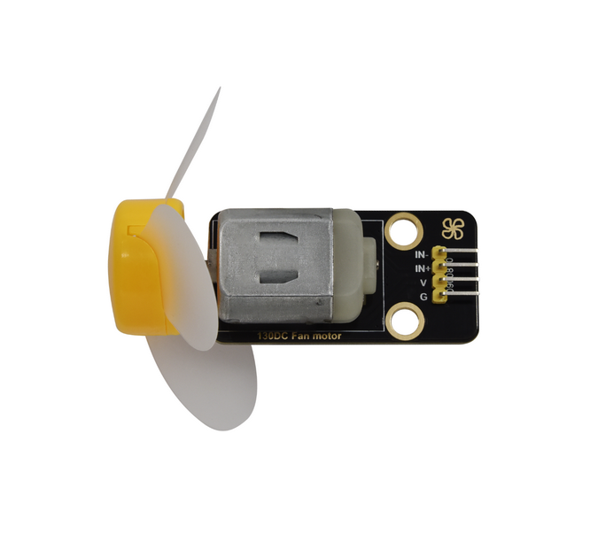

**原理图：**

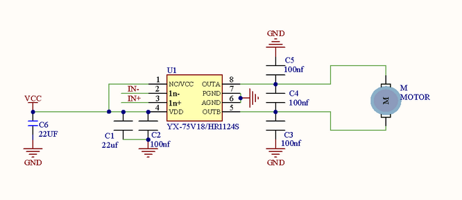

#### 接线图

**模块连接到io18，io19**

**注意使用连接线连接时，黄色线为S信号线，红色线为V电源线，黑色线为GND，颜色一一对应，请勿插反！**

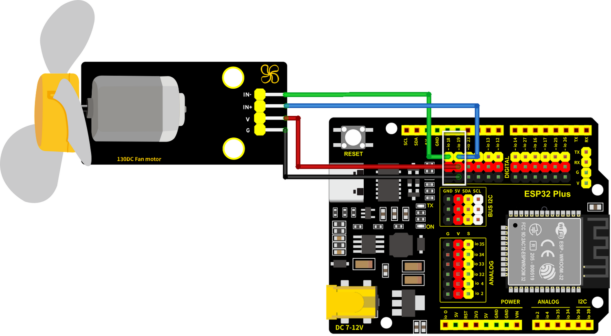

------


#### 代码

代码如下：

- 设置引脚**INA**

  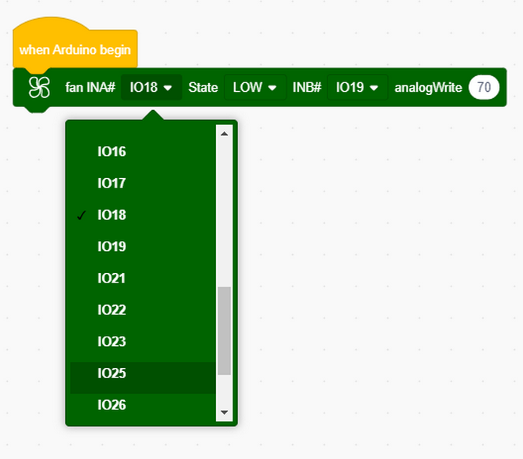

- 设置引脚**INA**的高低电平状态，高低电平决定了风扇的正反转

  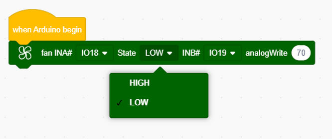

- 设置引脚**INB**

  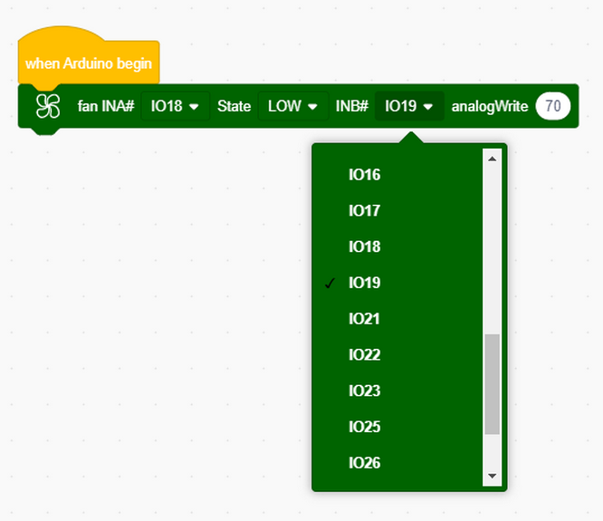

- 设置引脚**INB**的模拟输出，决定风扇的转速，

  - 在INA引脚为高电平状态时，INB模拟输出越小，风扇越快

  - 在INA引脚为低电平状态时，INB模拟输出越大，风扇越快

    

  

#### 结果

**注意：电机再进行正反转时，间歇性的停止，是防止正反转的瞬间，电机电流过大，导致开发板供电不足，而被迫复位。**

可以看到130电机风扇模块，根据设定的值，进行转动。


### 农场温控系统

#### 概述

这个应用场景需要通过单线通信来获取DHT11温湿度传感器的数据，并将温度和湿度数值显示在LCD显示屏上。同时，当温度或湿度超过设定的阈值时，风扇模块会开启，用来降低温度以保护农场里的动植物。这种模块的优点是安装容易，且功能强大。它不仅可以通过PWM调节速度，还能够通过单线通信来传输数据。总的来说，这个应用场景是一个非常实用的解决方案，可以帮助农场主人监测和控制农场的环境，提高农业生产效率。

#### 接线图

- **温湿度模块连接到io17**

- **风扇模块连接到io18，io19**
- **LCD1602模块连接到BUS I2C**
- **注意使用连接线连接时，黄色线为S信号线，红色线为V电源线，黑色线为GND，颜色一一对应，请勿插反！**

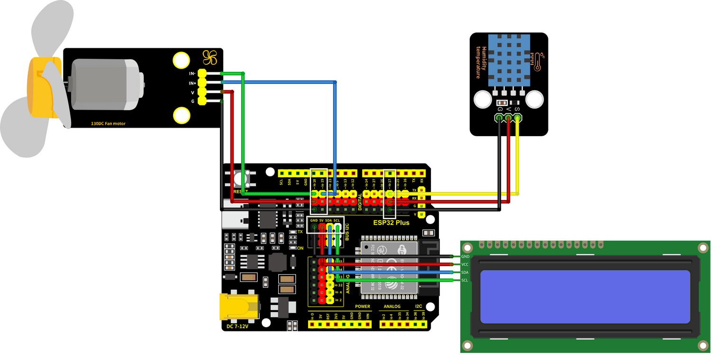

------


#### 代码

##### 代码流程图：

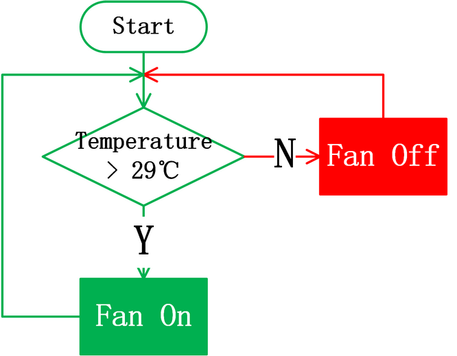

------

代码如下：

- 先初始化LCD，选择LCD地址，并清除LCD显示信息，设置背光为开，设置信息显示：

  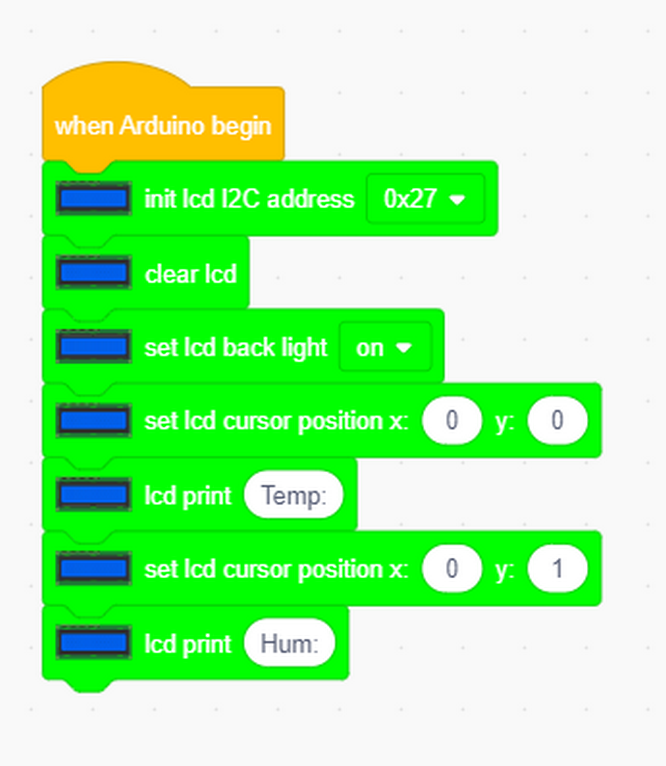

- 初始化DHT11传感器，选择对应的引脚，并定义两个温度和湿度的变量

  

- 在循环中，将获取的温湿度数据，赋值到变量中

  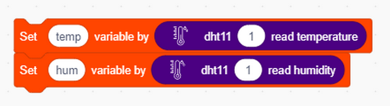

- 将数据显示在LCD屏中

  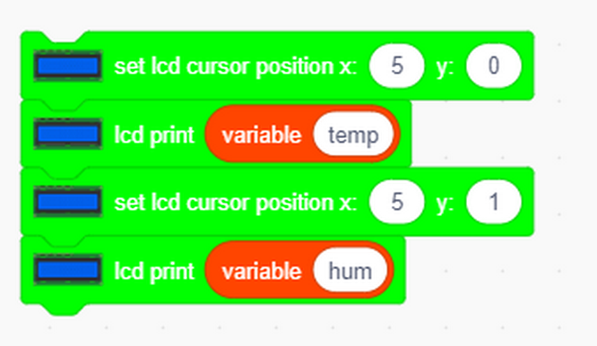

- 判断温湿度的值，当温度大于29度，或者湿度大于80度，将打开风扇

  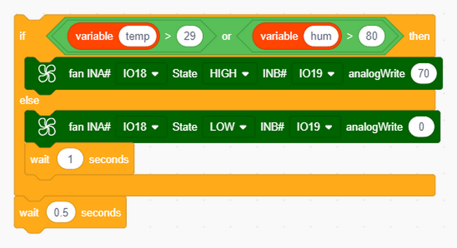

- 完整代码

  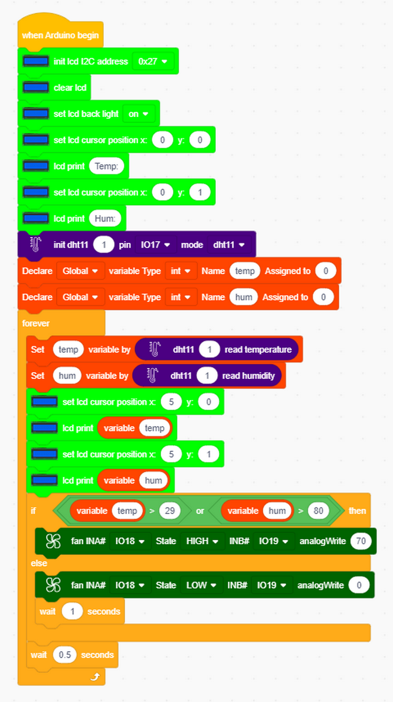

#### 结果

当温度达到30℃时，风扇模块会开启，进行散热，当低于29℃时，风扇模块会关闭（风扇为模拟散热，散热效果一般），达到农场自动控温效果，节省能源。

------


## FAQ

### 问：温湿度传感器防水吗？

答：温湿度传感器检测的是空气中的温度和湿度，不防水，请勿将模块放入水中。

------

### 问：风扇模块转动导致ESP32开发板复位？

答：风扇模块在转动时，需要的电流比其他传感器要大，会引起电路中电压电流波动，特别是风扇进行正反转时，电压电流波动过大，导致ESP32开发板的电压电流过低，导致复位。

------

## 第八课：土壤湿度监测系统

------

#### ***请注意，使用设备时不要让水从水池和土壤池中溢出。如果水洒到其他传感器上，会导致短路，影响设备正常工作。另外，如果水洒到电池上，会导致发热和爆炸等危险。因此，请在使用设备时格外小心，尤其是幼儿使用时一定要在家长的监护下进行。为确保设备的安全运行，请遵循相关使用指南和安全规范。***

------


------


### 土壤湿度检测流程：


------


### **土壤湿度传感器：**

土壤湿度传感器也称为土壤湿度计，主要用于测量土壤体积含水量、监测土壤水分、农业灌溉、林业保护等。传感器被集成到农业灌溉系统中，以帮助有效地安排供水，有助于减少或加强灌溉，以实现最佳的植物生长。

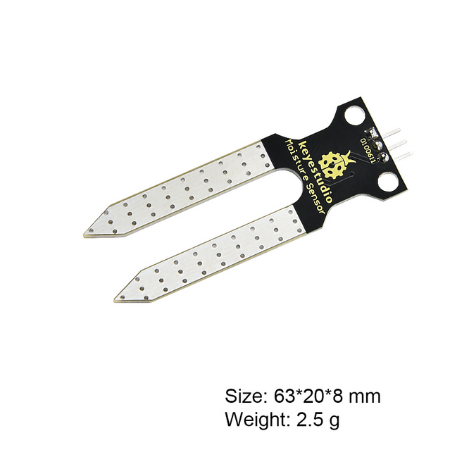

------

**原理图：**

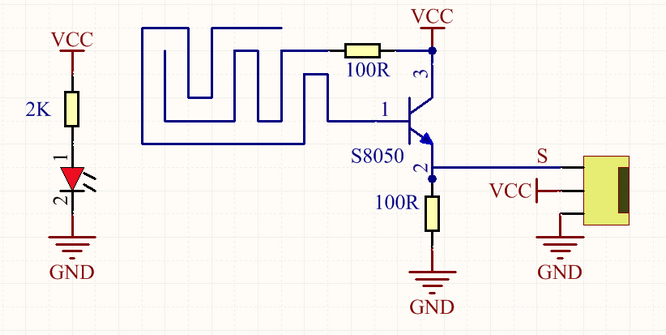

------


#### 接线图

**传感器连接到io32**

**注意使用连接线连接时，黄色线为S信号线，红色线为V电源线，黑色线为GND，颜色一一对应，请勿插反！**


------


#### 代码

代码如下：

- 初始化串口

  

- 打印接收到的传感器数据

  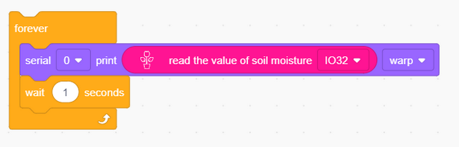

- 完整代码

  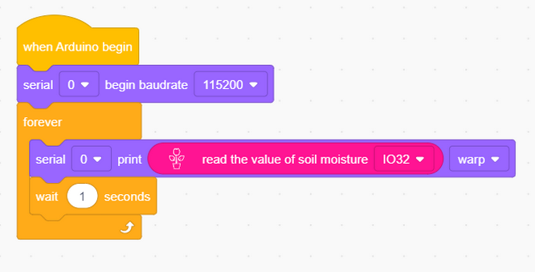

#### 结果

打开串口监视器，当用浸湿的手触碰传感器时，会读取到当前的湿度（范围：0~4095）。

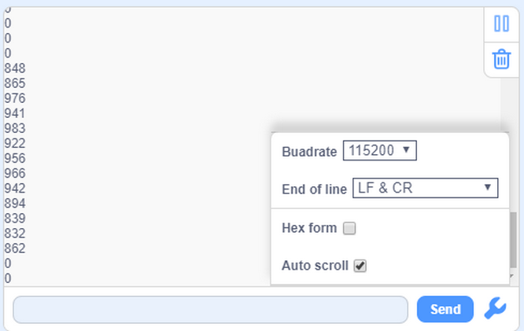

------

### 土壤湿度监测系统

使用LCD1602显示屏，实时显示土壤湿度传感器的值，当湿度低于设定的值，蜂鸣器会响起警报声，提示该浇灌土地了。

#### 接线图

- **土壤传感器连接到io32**
- **蜂鸣器连接到io16**
- **LCD1602屏连接到BUS I2C**
- **注意使用连接线连接时，黄色线为S信号线，红色线为V电源线，黑色线为GND，颜色一一对应，请勿插反！**


------


#### 代码

##### 代码流程图：

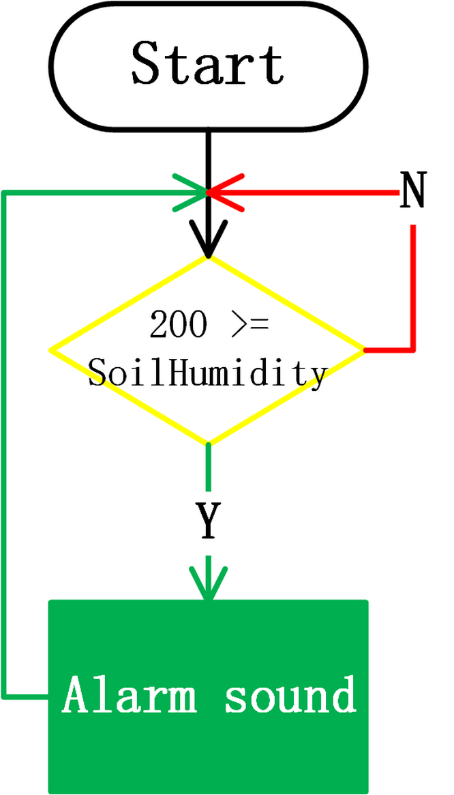

------

代码如下：

- 初始化LCD，清空LCD，打开背光，显示数据

  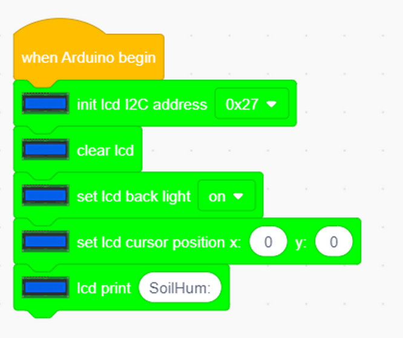

- 初始化串口，定义一个变量

  

- 读取传感器的值，并把赋值给变量，LCD显示数据

  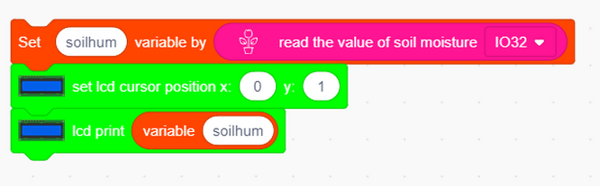

- 判断传感器的值，如果低于200，蜂鸣器会发出警报声

  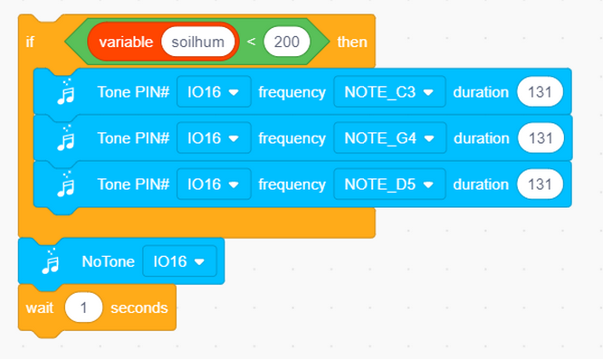

- 完整代码

  

#### 结果

当土壤湿度传感器检测到的湿度，低于设定的阈值时，蜂鸣器会发出警报声。

------


## FAQ

### 问：传感器防水吗？

答：土壤湿度传感器检测区域防水，超过检测区域将会导致短路。

------

## 第九课：水位监测系统

------

#### ***请注意，使用设备时不要让水从水池和土壤池中溢出。如果水洒到其他传感器上，会导致短路，影响设备正常工作。另外，如果水洒到电池上，会导致发热和爆炸等危险。因此，请在使用设备时格外小心，尤其是幼儿使用时一定要在家长的监护下进行。为确保设备的安全运行，请遵循相关使用指南和安全规范。***

------

### 水位检测系统流程：


------


### 水位传感器

#### 概述

我们的水传感器易于使用，便于携带，成本效益高，它被设计用来识别和检测水位和水滴。该传感器通过一列暴露在外的平行线的痕迹来测量水滴的体积和水量。与其竞争对手相比，该传感器不仅更小、更智能，而且还巧妙地配备了以下功能：

- 水量和模拟量之间的平滑转换；


- 灵活性强，该传感器输出基本模拟值；


- 低功耗和高灵敏度；


- 直接连接到微处理器或其他逻辑电路，适用于各种开发板和控制器，如Aduino控制器、STC单芯片微机、AVR单芯片微机等。

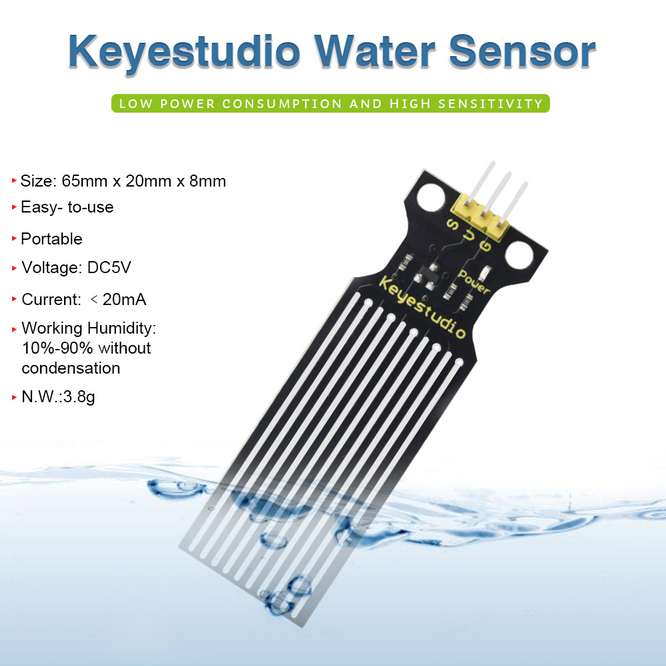

------


#### 接线图

**传感器连接到io33**

**注意使用连接线连接时，黄色线为S信号线，红色线为V电源线，黑色线为GND，颜色一一对应，请勿插反！**


------


#### 代码

代码如下：

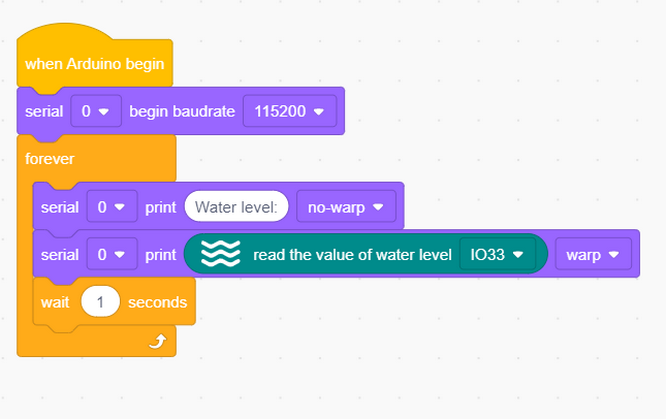

#### 结果

打开串口监视器，当用湿漉的手去触碰水位传感器时，串口监视器会显示数值（0~4095）。

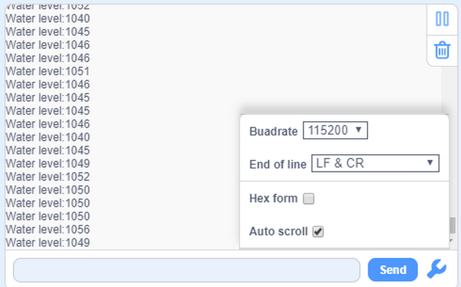

------


### 水位监测系统

水位自动监测报警系统，主要功能是监测水位变化，及时发现问题并采取措施避免灾害发生。该系统广泛应用于水利工程、城市排水、环境监测等领域。

#### 接线图

- **水位传感器连接到io33**
- **蜂鸣器连接到io16**
- **LCD1602屏连接到BUS I2C**
- **注意使用连接线连接时，黄色线为S信号线，红色线为V电源线，黑色线为GND，颜色一一对应，请勿插反！**


------


#### 代码

##### 代码流程图：


------

代码如下：

- 初始化LCD屏幕，打开背光，清除LCD屏幕显示信息，显示数据

  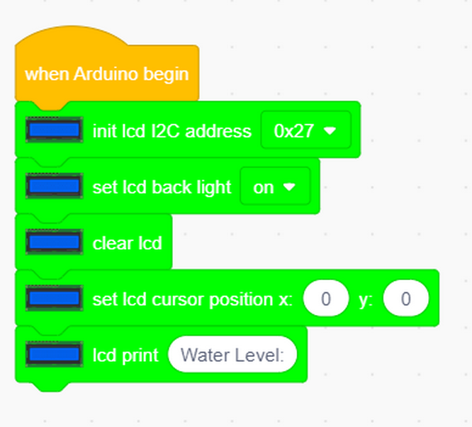

- 定义一个变量，用来存储水位数据

  

- 获取传感器数据，并显示在LCD屏幕上

  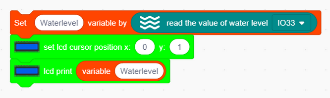

- 判断水位数据，如果大于2000，蜂鸣器将发出警报声

  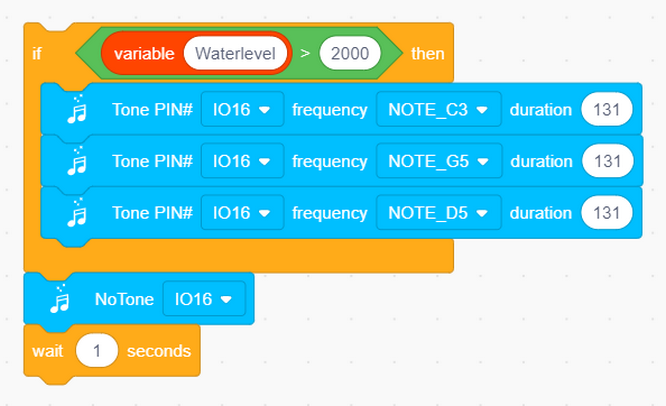

- 完整代码

  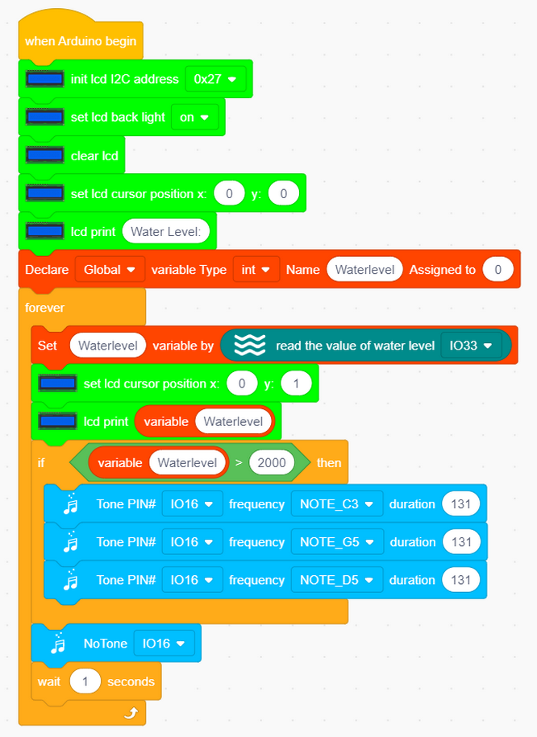

#### 结果

LCD屏幕实时显示现在的水位信息，用湿漉的水去触碰水位传感器，来模拟水位，当超过设定的阈值，蜂鸣器会发出警报声音。

------


## FAQ

### 问：传感器防水吗？

答：水位传感器检测区域防水，超过检测区域将会导致短路。

------

## 第十课：自动灌溉系统

------

#### ***请注意，使用设备时不要让水从水池和土壤池中溢出。如果水洒到其他传感器上，会导致短路，影响设备正常工作。另外，如果水洒到电池上，会导致发热和爆炸等危险。因此，请在使用设备时格外小心，尤其是幼儿使用时一定要在家长的监护下进行。为确保设备的安全运行，请遵循相关使用指南和安全规范。***

------

本教程介绍如何使用ESP32开发板，控制继电器来打开水泵进行抽水灌溉，使用水位传感器来检测水位高度，判断水池是否有水，并使用土壤湿度传感器来检测植物土壤的湿度情况，从而更加智能化地控制水泵的启停。


------

### 自动灌溉流程：


------


### 抽水系统

#### 概述

本教程介绍如何使用ESP32开发板来控制抽水泵，并使用继电器来实现开关控制。抽水泵是一种用于提水或输送液体的机械装置，通常需要使用继电器模块来控制其启停。

在这个项目中，我们将通过连接继电器模块和抽水泵到ESP32开发板上，并编写代码来控制继电器的开关状态，从而控制抽水泵的启停。我们可以根据传感器输出的值或预设的时间来控制继电器的开关状态，从而实现对抽水泵的远程控制。

------

**继电器：**

用于管理高压、负载电流，比如电机、高电流传感器、高功率灯等。

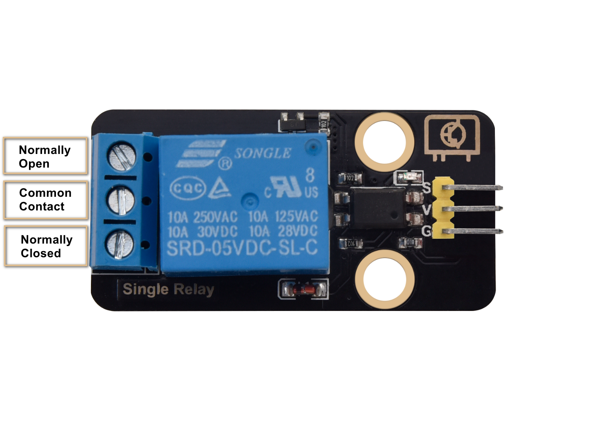

------

- **常开（ON）：**该引脚是常开的，除非向继电器模块的信号引脚提供信号，因此，普通接触针通过NC脚断开其连接，通过NO脚建立连接。

- **公共触点（COM）：**此引脚用来连接其他模块，如水泵。

​				水泵：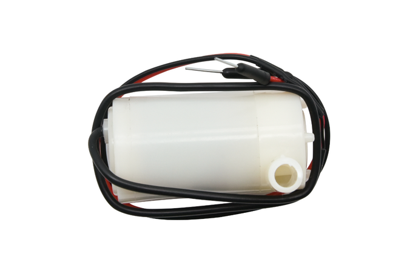

- **常闭（NC）：**此NC引脚通过COM引脚连接，形成闭合电路，可以通过ESP32等开发板，控制继电器模块，来切换闭合或断开。

------

**规格参数：**

- 供电电压：5V
- 静态电流：2mA
- 最高触点电压：250VAC/30VDC
- 最大电流：10A

------

**原理图：**


------


#### 接线图

- **继电器模块连接到io25，继电器的NC端，连接到io2引脚接口的黑色的GND**

- **水泵：**
  - **红色线连接到3V3电源，如图所示**
  - **黑色线GND连接到继电器的COM端，如图所示**


**注意使用连接线连接时，黄色线为S信号线，红色线为V电源线，黑色线为GND，颜色一一对应，请勿插反！**


------


#### 代码

代码如下：

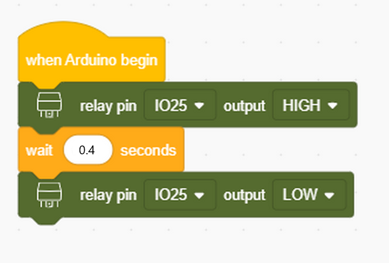

------

#### 结果

上传代码后，将进行一次抽水。

通过这个项目，我们可以实现自动化的抽水泵控制，从而减少手动操作的时间和精力成本，提高生产效率。这种方法可以应用于多个领域，例如农业生产、水处理等。

------


### 自动灌溉系统

#### 概述

本教程介绍如何使用ESP32开发板来实现智能浇灌系统，使用到的传感器包括土壤湿度检测传感器和水位检测传感器，以及继电器和抽水泵。

------

在这个项目中，我们将通过连接土壤湿度检测传感器和水位检测传感器到ESP32开发板上，并编写代码来读取它们的输出值，以控制继电器和抽水泵。

当土壤过于干燥时，将打开继电器以控制抽水泵灌溉植物；当水位过低时，将无法启动抽水泵，通过蜂鸣器报警。通过这种方法，我们可以实现自动化的植物浇水和水位控制，提高生产效率，同时减少了手动操作的时间和精力成本。

------


#### 接线图

- **继电器模块连接到io25，继电器的NC端，连接到io2引脚接口的黑色的GND**

- **水泵：**
  - **红色线连接到3V3电源，如图所示**
  - **黑色线GND连接到继电器的COM端，如图所示**
- **土壤传感器连接到io32**
- **水位传感器连接到io33**

**注意使用连接线连接时，黄色线为S信号线，红色线为V电源线，黑色线为GND，颜色一一对应，请勿插反！**


#### 代码

##### 代码流程图：

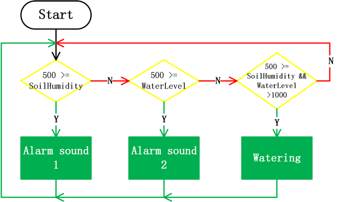

------

代码如下：

- 首先初始化LCD，打印显示内容，定义两个变量，用于存储传感器数据

  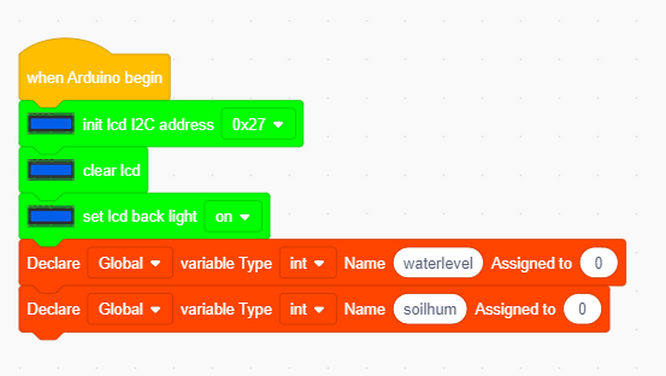

- 把传感器数据赋值给变量

  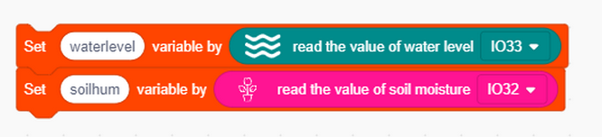

- 将传感器数据，显示到LCD屏上

  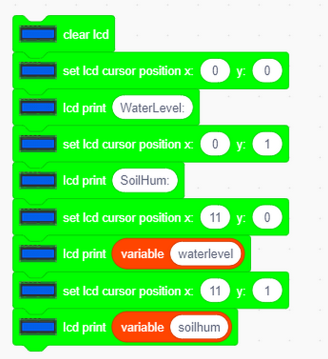

- 判断：当水位小于700，和土壤湿度小于1200，蜂鸣器将发出警报声

  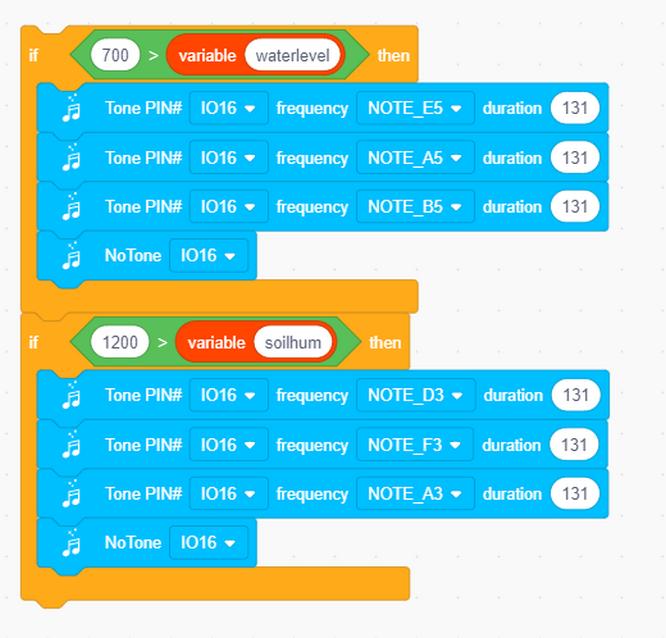

- 当土壤湿度小于1200，并且水位大于700时，将启动水泵，进行自动灌溉

  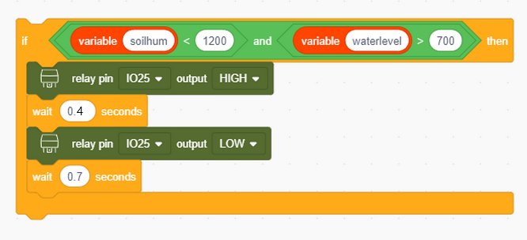

- 完整代码

  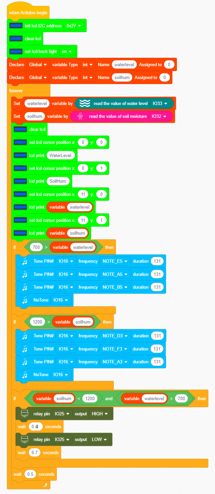

#### 结果

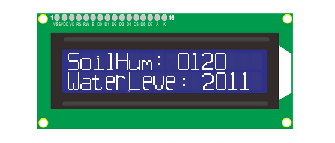

- LCD1602屏会显示当前土壤湿度和水池水位信息，当土壤湿度低于设定的阈值，说明土壤太干旱了，此时，抽水系统将自动对土地进行灌溉。

- 当水位低于设定的阈值时，抽水系统将不会工作，蜂鸣器会发出警报，提示水池里的水资源不足。

- 可以使用按钮来关闭蜂鸣器警报系统。

------

**总的来说，该项目不仅能够帮助我们实现自动化的植物浇水，还能够根据水位情况智能化地控制抽水泵的启停，适用于家庭和农业生产等多个领域。**

------


## FAQ

### 问：传感器防水吗？

答：继电器是不防水的，水泵防水等级为IP68。

------

### 问：水泵转动导致ESP32开发板复位？

答：。水泵在转动时，需要的电流比其他传感器要大，会引起电路中电压电流波动，电压电流波动过大，导致ESP32开发板的电压电流过低，导致复位。

在操作水泵时，为了适量的对土地进行灌溉，请按照示例给的代码操作：


------

## 第十一课：WIFI控制：智慧农场管理系统

------

#### ***请注意，使用设备时不要让水从水池和土壤池中溢出。如果水洒到其他传感器上，会导致短路，影响设备正常工作。另外，如果水洒到电池上，会导致发热和爆炸等危险。因此，请在使用设备时格外小心，尤其是幼儿使用时一定要在家长的监护下进行。为确保设备的安全运行，请遵循相关使用指南和安全规范。***

------


------


### 网页操控ESP32流程：


------


### WIFI网页显示

ESP32开发板它带有内置的Wi-Fi（2.4G）和Bluetooth（4.2）功能，可以轻松连接到Wi-Fi网络并与网络中的其他设备进行通信，您可以使用ESP32在浏览器中显示网页。


**arduino IDE提供了\<WiFi.h\>库文件，Wi-Fi 库支持配置及监控 ESP32 Wi-Fi 连网功能。**

- 基站模式（即 STA 模式或 Wi-Fi 客户端模式），此时 ESP32 连接到Wi-Fi热点 (AP)。
- AP 模式（即 Soft-AP 模式或Wi-Fi热点模式），此时其他Wi-Fi设备连接到 ESP32。
- AP-STA 共存模式（ESP32 既是Wi-Fi热点，同时又作为Wi-Fi设备连接到另外一个Wi-Fi热点）。
- 上述模式支持多种安全模式（WPA、WPA2 及 WEP 等）。
- 可搜索Wi-Fi热点（包括主动扫描及被动扫描）。
- 可支持混杂模式监控 IEEE802.11 Wi-Fi 数据包。

------

更多wifi参考，请移步到乐鑫官方文档：https://docs.espressif.com/projects/esp-idf/en/latest/esp32/api-reference/network/esp_wifi.html

乐鑫官网：https://www.espressif.com.cn/en/home


------


### **简单的教程：**

##### 首先，先添加库文件

- 点击右下角的扩展

- 点击通信，再点击“**Web Page Editing PRO**”，即可添加成功

  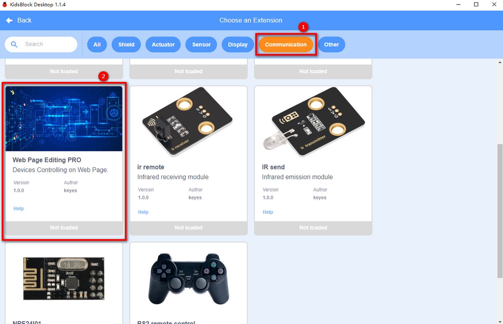


- 首先连接到WiFi热点，输入自己的WiFi热点名称和密码

  

- 在LCD屏上显示IP地址

  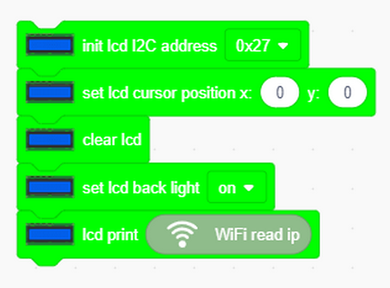

- 设置一个网页组件，名称为temperature，单位为℃

  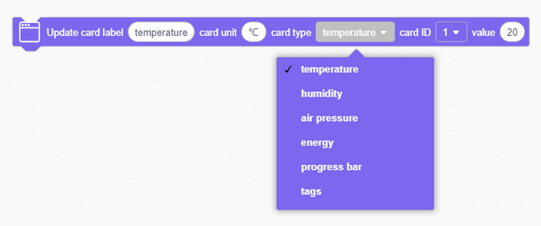

  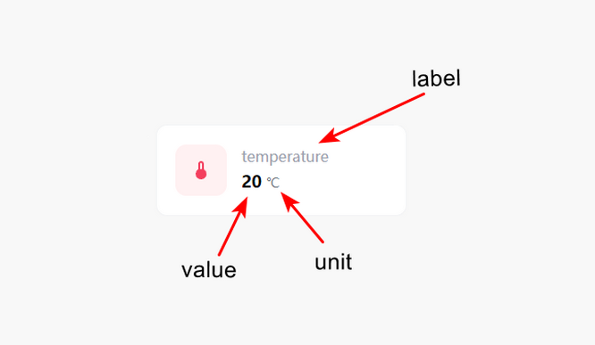

- 添加一个按钮组件，设置为button

  

  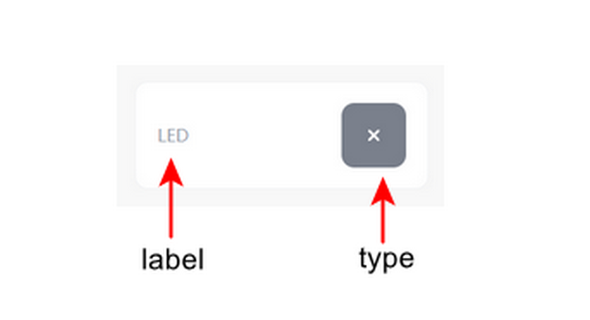

- 完整代码

  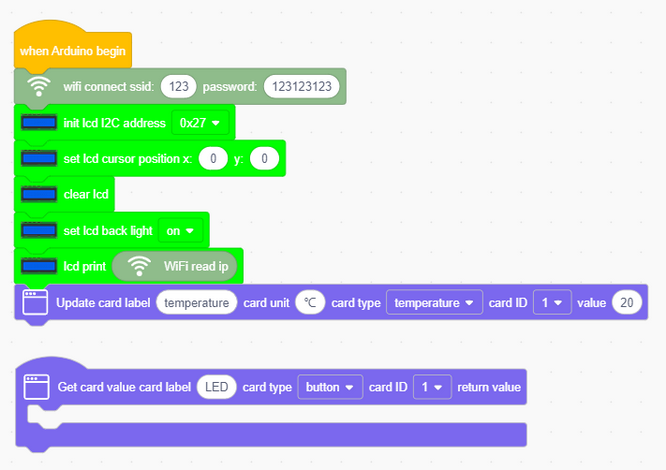


------

##### 一旦连接到Wi-Fi，您可以使用ESP32的Web服务器库来提供网页。在以下示例中，我们将创建一个简单的网页，该网页显示一个固定的温度信息：

------

**最后，您可以使用浏览器打开ESP32的IP地址，并访问网页。在本例中，您可以在浏览器中输入“http://[ESP32的IP地址]”来查看网页。**

**注意：当PC、手机和ESP32开发板，连接到同一个网络时，可在PC端和手机端同时打开这个网页。此处是你自己ESP32的IP地址**

*PC端：*

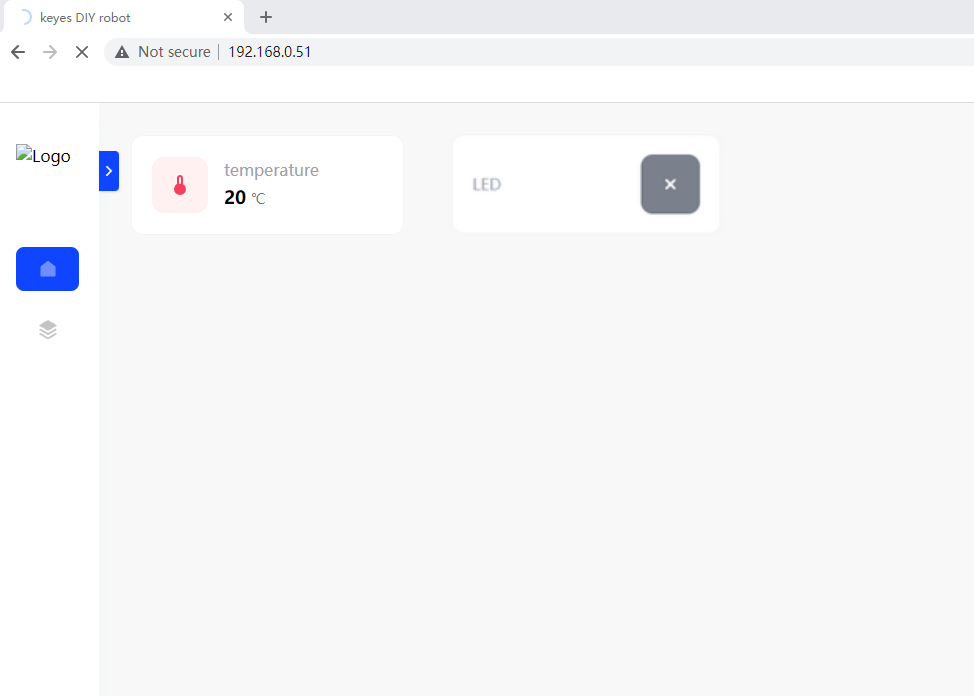

*手机端：*

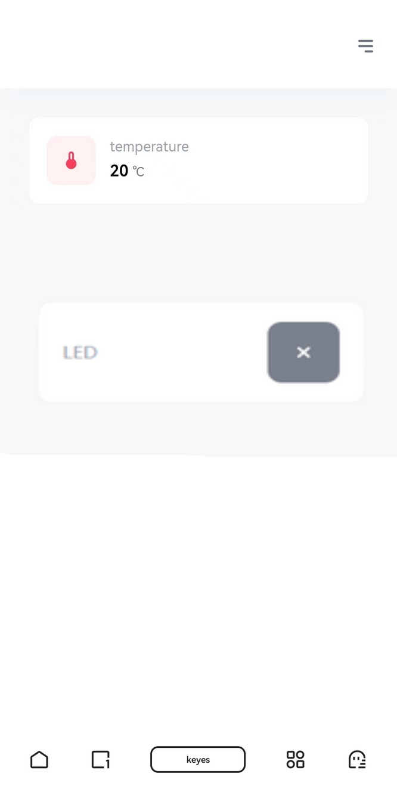

------


### WIFI控制：智慧农场管理系统

#### 代码流程图：

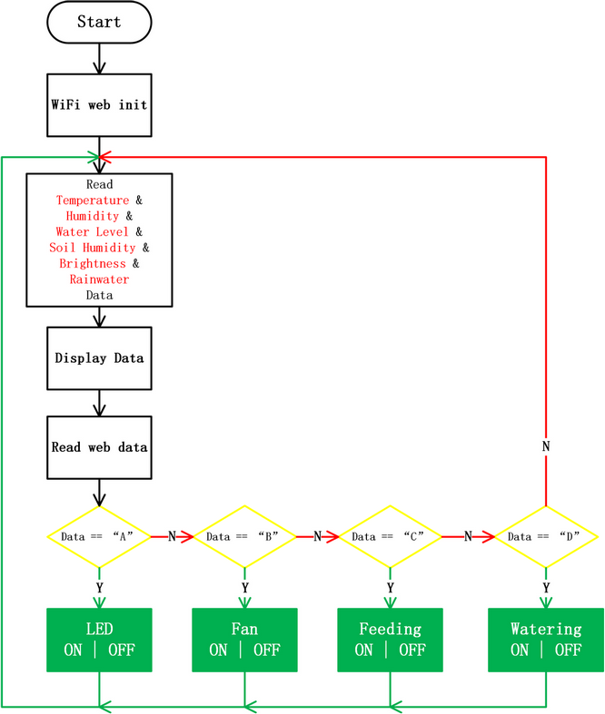

------

烧录以下代码。

其中**SSID**和**PASSWORD**改为自己的wifi名称和密码：


完整代码：


------

***PC端显示：***

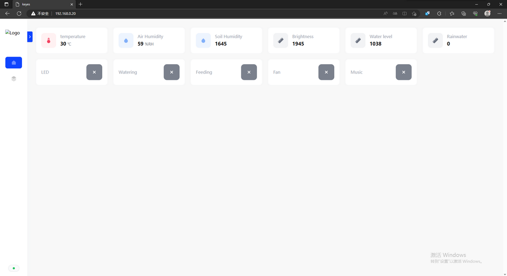

------

***手机端显示：***

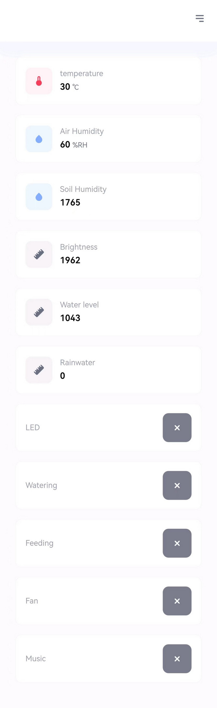

在手机和PC端，在浏览器打开对应的IP地址，即可查看到传感器数据，还可以控制LED和风扇等。

------


|   传感器数据   |   可控制   |
| :------------: | :--------: |
|   温度（℃）    |  LED开关   |
|  湿度（%rh）   |  风扇开关  |
|   水位（%）    | 饲料盒开关 |
|   雨量（%）    | 抽水泵开关 |
| 光照（0~4095） |            |
| 土壤湿度（%）  |            |

------

在以上的Arduino教程中，我们学会了如何使用ESP32开发板，创建一个网页并将传感器数据显示出来。例如，我们可以显示当前的温度、湿度、水池水位和土壤湿度等等。我们也可以使用这个开发板来控制LED灯、风扇、饲料盒和抽水泵等设备。而且，我们可以通过手机或电脑远程操作这些设备。


通过这个教程，我们可以模拟真实的农场，并实现农场的智能化控制，使物联网、信息化、自动化和智能化成为可能。这样的技术可以让我们更方便地控制农场设备，提高农业生产的效率和质量。

------


## FAQ

### 问：WiFi一直连接不上？

答：请将ESP32移动到路由器周边，重启ESP32，耐心等待连接即可。若还是一直连接不上，请查看WiFi名称和密码是否填写正确。

------

### 问：网页端远程操作其他传感器时，反应很慢？

答：路由器网络传输变慢的原因：

- 多人连接，路由器CPU资源不足，重启路由器，重新连接。
- 路由器系统使用时间过长，重启路由器。
- 无线干扰，无线信号不稳定时，请勿穿墙使用。

路由器相关知识，请自行**go0gle**搜索。

------


## 第十二课：APP控制：智慧农场管理系统

------

#### ***请注意，使用设备时不要让水从水池和土壤池中溢出。如果水洒到其他传感器上，会导致短路，影响设备正常工作。另外，如果水洒到电池上，会导致发热和爆炸等危险。因此，请在使用设备时格外小心，尤其是幼儿使用时一定要在家长的监护下进行。为确保设备的安全运行，请遵循相关使用指南和安全规范。***

------


#### 概述

APP智慧农场管理系统可以实时监测农场的温湿度、水池水位、土壤湿度、光照强度和雨量。

同时，它还能控制LED灯进行照明，控制水泵进行灌溉，控制饲料盒进行喂养，控制风扇和模拟调整农场的温湿度。


可以使用手机上的APP实现这些操作，从而方便快捷地管理农场。此外，该系统还可以使用蜂鸣器播放声音，实现更加智能化的管理。

------

#### APP控制流程：

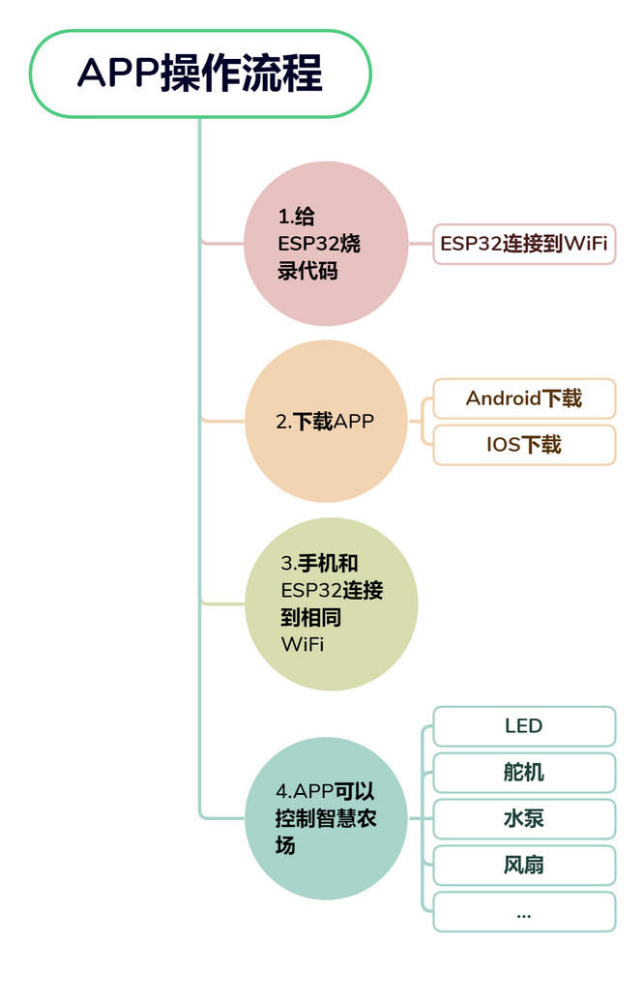

------

##### 代码流程图：


##### 先给ESP32烧录控制代码

- ESP32连接到WiFi，此处ssid为WiFi的名称，password为WiFi密码。

  

- LCD显示IP地址

  

- 打开wifi客户端，初始化wifi服务当初始化完成后，ESP32和APP，可以用WIFI进行通信

  

- 检查是否连接到wifi客户端，即连接到APP

  

- 并且实时发送传感器数据给APP，APP显示内容如下：	

  

- ESP32端接收APP发来的数据，并判断数据，注意：APP发来的数据为String类型

  

------

##### 完整代码

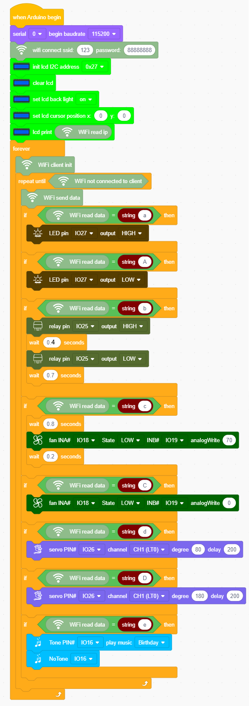

#### APP下载


##### Android：

- 从Google play中下载：打开Google play，搜索IOT farm，点击下载即可。

  

- 从我们提供的资料中，有Android apk安装包：

  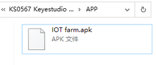

##### IOS：

在APP Store 中搜索**IOT farm**，点击下载即可。

------


#### APP界面：


------


##### APP功能介绍

1. 当手机和ESP32开发板连接到相同WIFI时，在APP的右上方输入ESP32的IP地址，即可连接。

   

2. 显示农场的实时温度

   

3. 显示农场的实时湿度

   

4. 显示土壤的实时湿度

   

5. 显示太阳光照强度

   

6. 显示水池的水位

   

7. 显示农场下雨量

   

8. 控制LED

   

9. 控制水泵进行灌溉

   

10. 控制风扇调节温度

    

11. 控制舵机，开关饲料盒

    

12. 控制蜂鸣器，播放音乐

    


------


## FAQ

### 问：ESP32 WiFi一直连接不上？

答：请将ESP32移动到路由器周边，重启ESP32，耐心等待连接即可。若还是一直连接不上，请查看WiFi名称和密码是否填写正确。

------

### 问：APP连接不上ESP32？

答：请确保APP和ESP32都连接到相同的WiFi。

------
