## 5.2.1 Windows 系统

### 5.2.1.1 KidsBlock IDE下载

* [Windows 系统](https://xiazai.keyesrobot.cn/KidsBlock.exe)

### 5.2.1.2 KidsBlock IDE安装

1\. 双击下载好的软件 “**KidsBlock.exe**” 。

2\. 先选中 “**为使用这台电脑的任何人安装**” ，再点击 “**下一步**”。

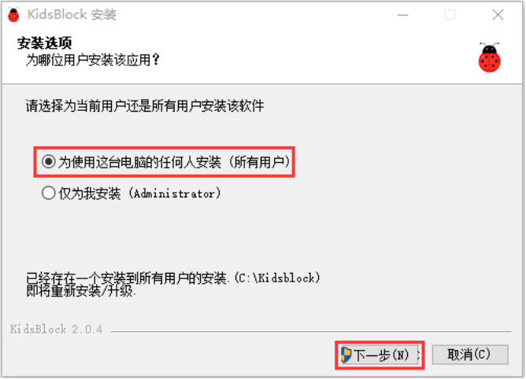

3\. 先点击 “**浏览(B)...**”，选择安装的位置（我这里选择安装在C盘，你也可以选择安装在电脑的其他盘），再点击 “**安装**”。这样，软件就在安装过程中。

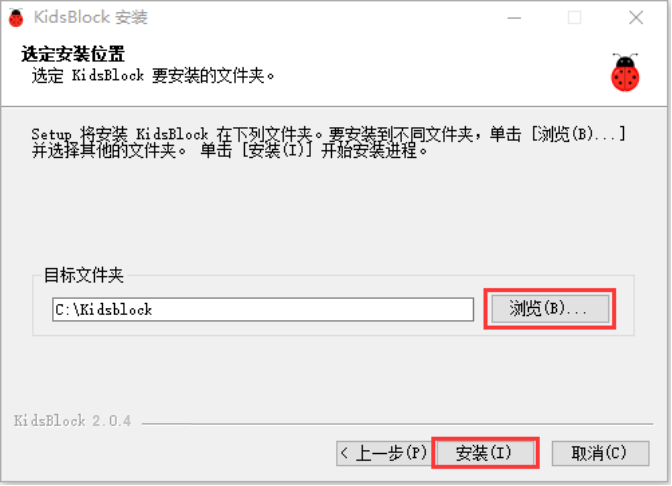

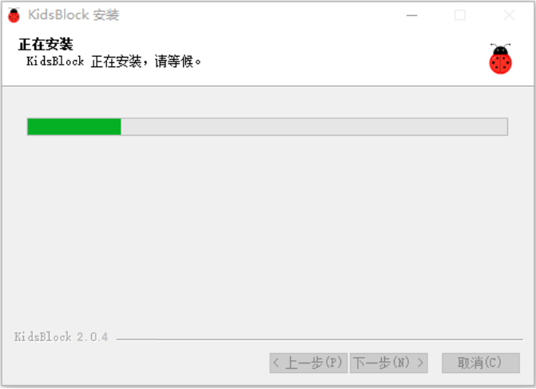

4\. 几秒种后，安装完成。点击 “**完成**” 就可以打开安装好的软件。

5\. 如果出现电脑安全警报窗口，点击 “**允许访问**”。这样就可以打开了软件页面。

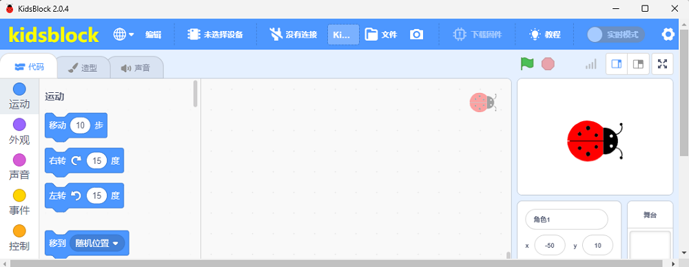

有更新软件时一般打开Kidsblock IDE页面时会自动提醒，为了软件能正常使用我们选择升级。

我们也可在设置中手动更新软件。

如果已经是最新版本则显示以下提示。

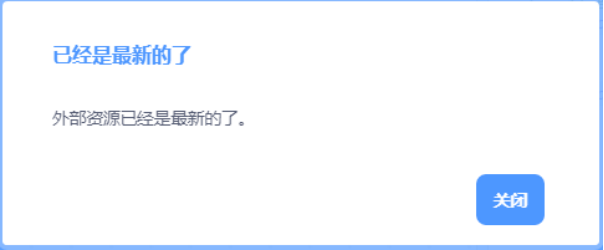

## 5.2.2 MacOS 系统

### 5.2.2.1 KidsBlock IDE下载

* [MacOS 系统](https://xiazai.keyesrobot.cn/KidsBlock.dmg)

### 5.2.2.2 KidsBlock IDE安装

1\. 双击下载好的软件文件 “**KidsBlock.dmg**”。

2\. 双击之后，出现如下图。

3\. 按住鼠标左键将 “**KidsBlock**” 拖动到 **Applications** 文件夹中。

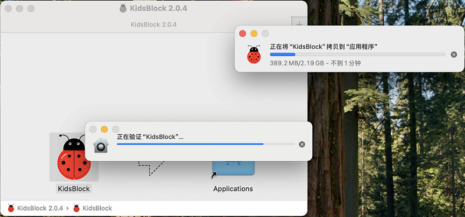

4\. “**KidsBlock**” 在复制拷贝至 **Applications** 文件夹过程中，有可能会出现 “**安全提醒**” 框 。

5\. 先点击电脑的 “**设置**”，找到 “**隐私与安全性**” 并且点击它；然后找到 “**仍要打开**” 并且点击它，出现 “ **打开“KidsBlock”？**”对话框，最后点击 “**仍要打开**” 按钮。

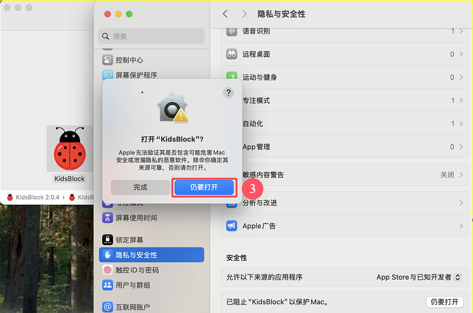

6\. 出现 “**隐私与安全性**”对话框，在对话框中输入好 “**管理员用户名**” 和 “**密码**”，然后单击 “**好**” 按钮。

7\. 过一会儿之后，就可以打开了Kidsblock IDE页面。

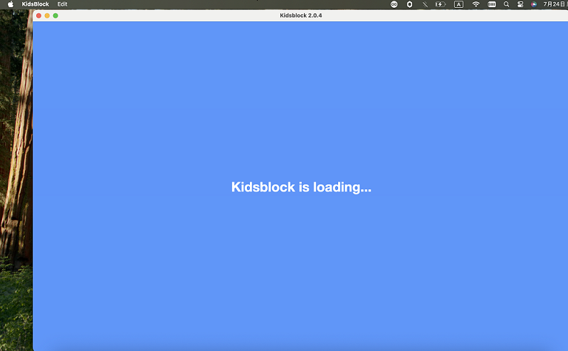

有更新软件时一般打开Kidsblock IDE页面时会自动提醒，为了软件能正常使用我们选择升级。

## 5.2.3 KidsBlock软件的使用方法

⚠️ **特别提醒：** 以下是以Windows系统为例，MacOS系统可以参考。

### 5.2.3.1 选择设备

⚠️ **特别注意：** 该套件中使用的设备是 Smart farm for ESP32，关于导入Smart farm for ESP32设备的方法，请参考以下内容。如果是导入其他的设备(或开发板)，其方法类似，可以参考。

1\. 确保ESP32主控板与计算机连接成功，然后双击 “**KidsBlock**” 图标打开KidsBlock软件。

2\. 单击，如下图所示：

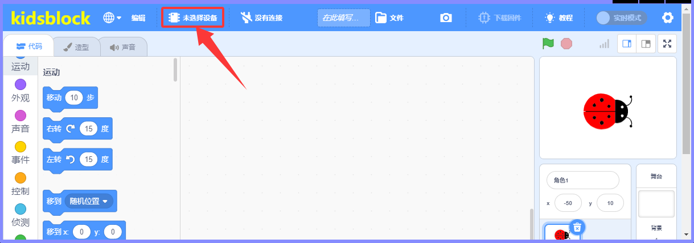

3\. 由于本教程使用的是 Smart farm for ESP32 设备，所以选择 “**Smart farm for ESP32**” 设备，如下图所示：

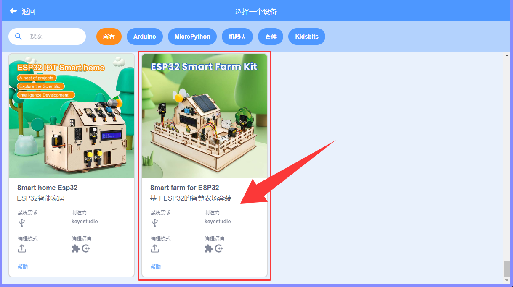

4\. 连接串口端口(COM3)，点击 “**连接**”，如下图所示：

5\. 然后单击 “**返回编辑器**” 返回代码编辑区，如下图所示：

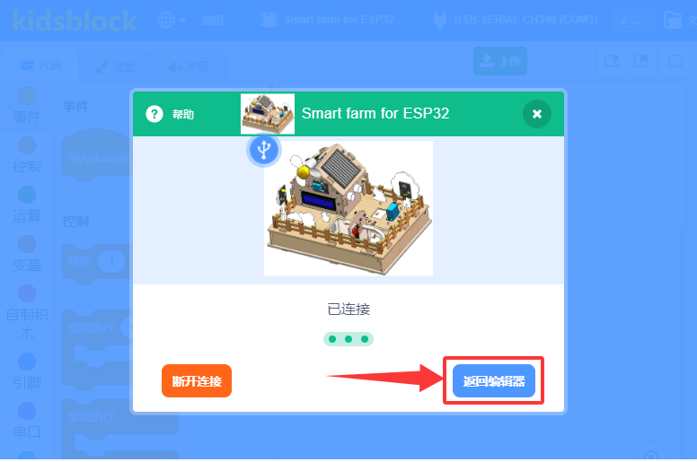

### 5.2.3.2 软件界面介绍

了解KidsBlock软件界面，有利于代码编程的学习，如下图所示：

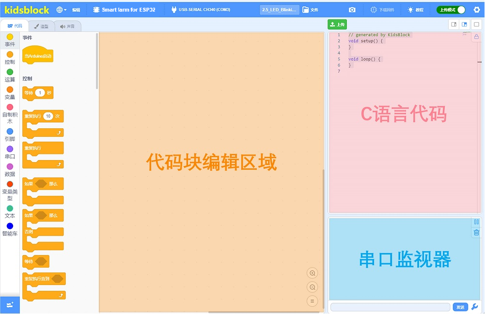

### 5.2.3.3 添加KidsBlock库文件

⚠️ **特别提醒：** 如果是自己拖动代码块来编写实验代码，则必须添加 “网页编辑PRO” 库和 “语音识别模块” 库，添加方法如下所示；如果是直接导入我们提供的示例代码，不需要添加 “网页编辑PRO” 库和 “语音识别模块” 库，则这一步骤可以直接跳过。

如下图所示，在KidsBlock IDE软件的左下角点击进入扩展界面。

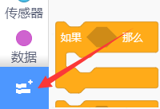

先点击 “**通信**”，再找到 “**Web Page Editing PRO**” 设备并点击它。这样，网页编辑PRO的库文件添加好了。

接着点击 “**AI**”，然后找到 “**语音识别模块**” 设备并点击它。这样，语音识别模块的库文件添加好了。

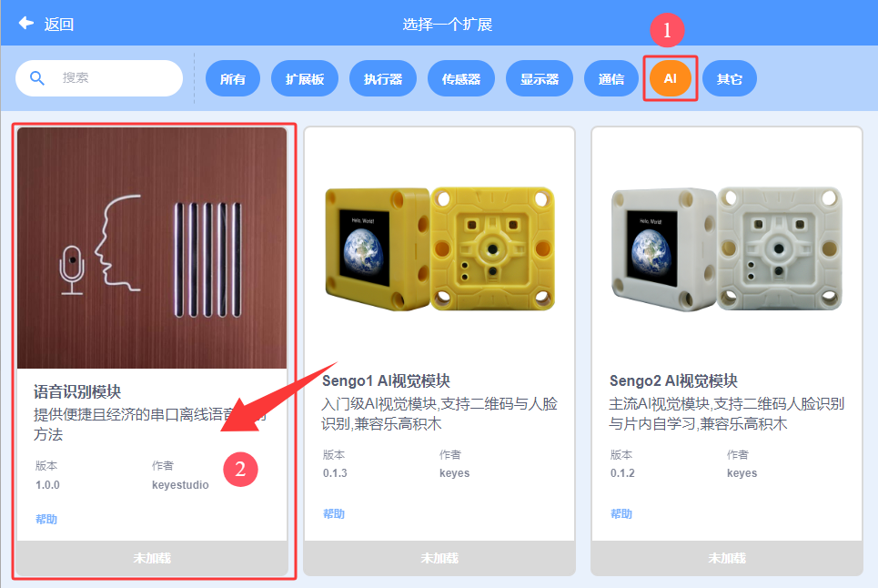

点击返回编程界面，在KidsBlock IDE左侧的代码块栏中可以看到添加成功的 “网页编辑PRO” 库和 “语音识别模块” 库。

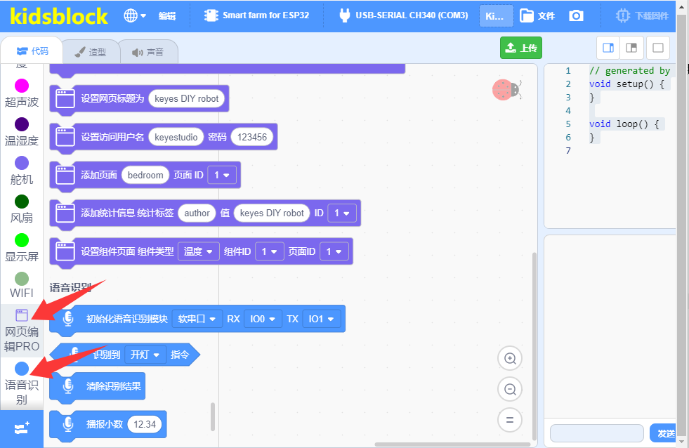

### 5.2.3.4 编写代码并上传

（**后面教程中的示例代码上传步骤也一样，可以参考这里。**）

确保ESP32主控板与计算机连接成功，然后双击 “ **KidsBlock** ” 图标打开KidsBlock软件。

**方法①：** 从直接拖动代码块到代码编辑区进行代码编写，如下图所示：

代码编写完成后保存到电脑，单击 “**文件**” --> “**保存到电脑**”，如下图所示：

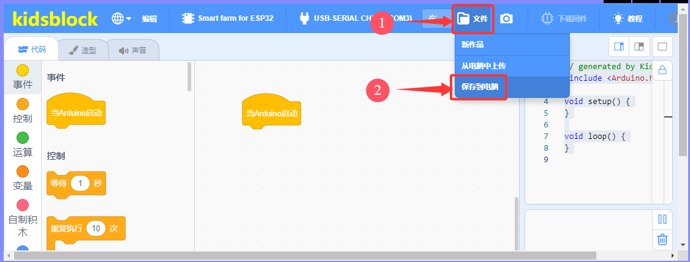

单击将代码上传到ESP32主控板，如下图所示：

**方法②：** 从电脑打开已经编写好的代码。

单击 “**文件**” --> “**从电脑中上传**”，然后选择保存KidsBlock(Scratch)_代码的路径，选中代码文件打开即可，如下图所示：

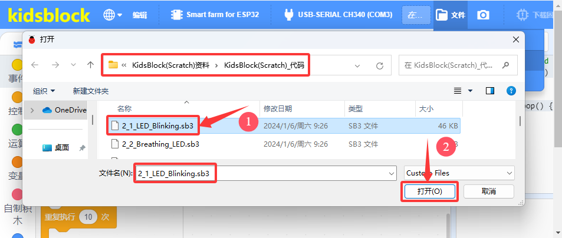

代码文件打开后，需要手动连接串口端口，如下图所示：

然后单击 “**返回编辑器**” 返回代码编辑区，如下图所示：

单击将代码上传到ESP32主控板，如下图所示：

