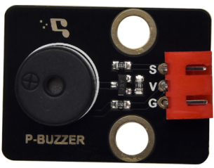
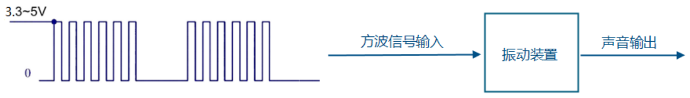
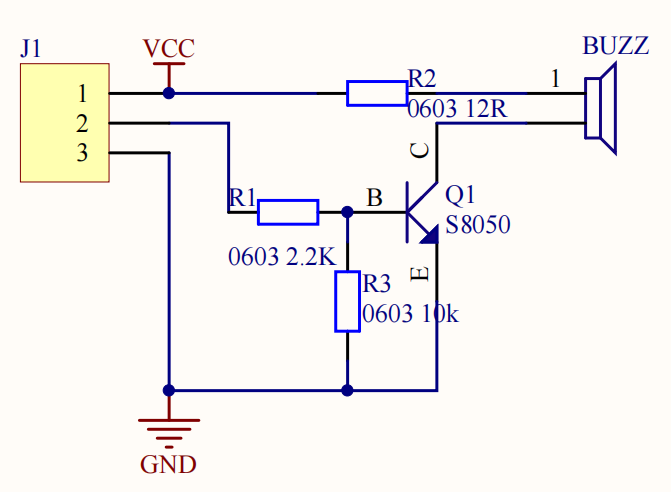
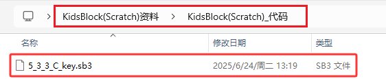
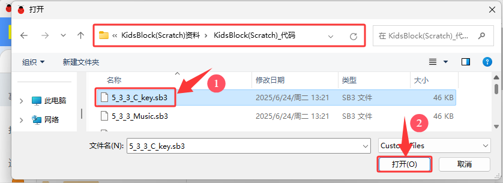
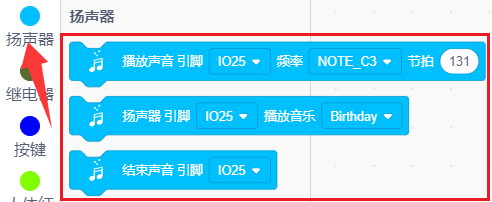
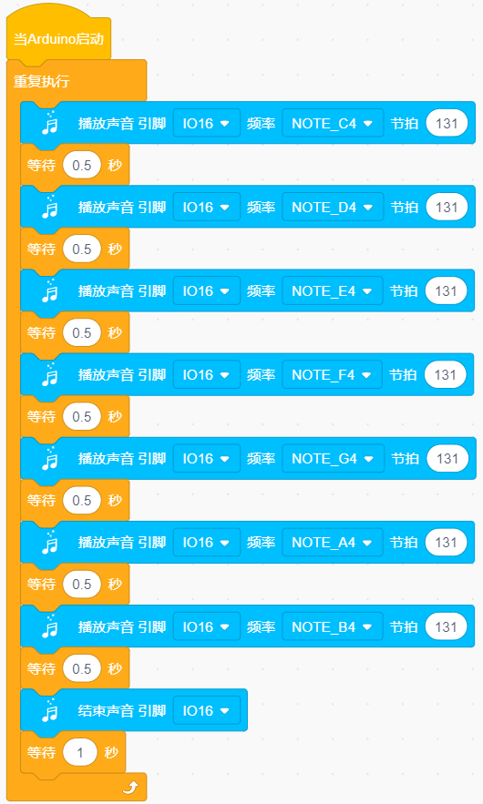
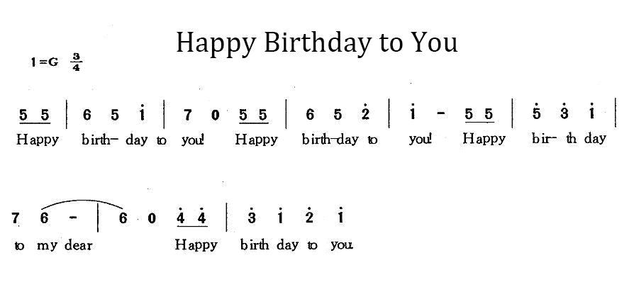
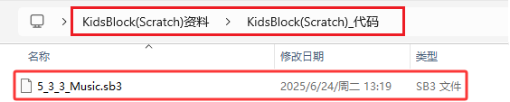
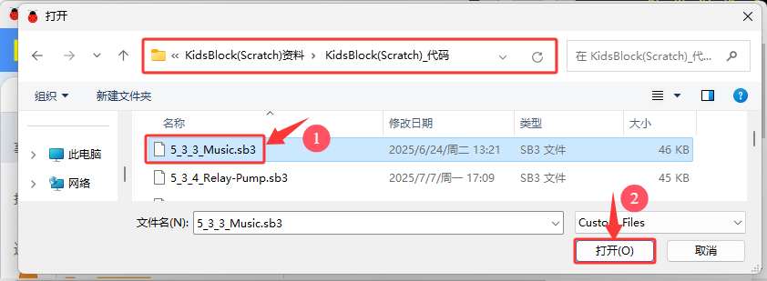

### 5.3.3 无源蜂鸣器

#### 5.3.3.1 简介

本教程将为您详细介绍无源蜂鸣器的使用方法和应用技巧。无源蜂鸣器是一种需要外部驱动信号才能发声的电子元件，其内部不含振荡源，因此可以通过改变输入信号的频率来产生不同音调的声音。教程内容包括无源蜂鸣器的工作原理、引脚识别、电路连接方法以及如何通过微控制器（如ESP32）生成不同频率的方波信号来控制蜂鸣器。您将学习如何编写代码来实现简单的音乐播放、报警信号和自定义音效。无论您是电子初学者还是有经验的开发者，本教程都将帮助您掌握无源蜂鸣器的应用，为您的项目增添丰富的声音效果。

#### 5.3.3.2 元件知识

**无源蜂鸣器：** 是一种内部没有振动源的集成电子蜂鸣器，只有给它一定频率的`方波信号`，才能让无源蜂鸣器发声，同时，输入的方波频率不同，发出的声音也不同，所以无源蜂鸣器可以模拟曲调实现音乐效果。

  - 引脚的电平变化可以模拟方波，例如引脚高电平持续500微秒后，再变换为低电平500微秒，紧接着再变换为高电平…
  
  - **以2~5KHz的方波去驱动无源蜂鸣器，方波的赫兹可以通过公式 f=1/T，其中f为频率，T为一个完整的周期所用时间（即高低电平各持续的时间之和）来计算。**

**注: 我们提供的无源蜂鸣器的谐振频率约为2048Hz，这意味着这个无源蜂鸣器的谐振频率为2048Hz时声音最大。**

**C调符与频率对照表：**

|    调符     | 频率(Hz) |      调符      | 频率(Hz) |     调符     | 频率(Hz) |
| :---------: | :-----------: | :------------: | :-----------: | :----------: | :-----------: |
| Flat  1  Do |      262      | Natural  1  Do |      523      | Sharp  1  Do |     1047      |
| Flat  2  Re |      294      | Natural  2  Re |      587      | Sharp  2  Re |     1175      |
| Flat  3  Mi |      330      | Natural  3  Mi |      659      | Sharp  3  Mi |     1319      |
| Flat  4  Fa |      349      | Natural  4  Fa |      698      | Sharp  4  Fa |     1397      |
| Flat  5  So |      392      | Natural  5  So |      784      | Sharp  5  So |     1568      |
| Flat  6  La |      440      | Natural  6  La |      880      | Sharp  6  La |     1760      |
| Flat  7  Si |      494      | Natural  7  Si |      988      | Sharp  7  Si |     1967      |

**原理图：**

**参数：**

- 工作电压: DC 3.3V~5V
- 工作电流: (Max) 30mA@5V
- 最大功率: 0.15W
- 谐振频率: 2048Hz
- 输出音压: (Min)80dB/10cm
- 控制信号: 方波

#### 5.3.3.3 接线图

- **无源蜂鸣器模块的S引脚连接到io16**

⚠️ **特别注意：智慧农场已经组装好了，这里不需要把无源蜂鸣器模块拆下来又重新组装和接线，这里再次提供接线图，是为了方便您编写代码！**

#### 5.3.3.4 实验代码

代码文件在`KidsBlock(Scratch)_代码`文件夹中，代码文件为`5_3_3_C_key.sb3`，如下图所示：

单击 “**文件**” --> “**从电脑中上传**”，然后选择保存代码的路径，选中代码文件打开即可，如下图所示：

**认识代码块**

① 这个代码块，表示当启动ESP32这块开发板时，将运行代码。

② 循环语句，顾名思义就是重复做一件事。

③ 这是扬声器的一些代码块。

这是播放声音的代码块，可以设置对应引脚，频率和节拍。引脚，频率和节拍可以根据自己的需要自己设置。

这是播放音乐的代码块，可以设置对应引脚和音乐。引脚和音乐可以根据自己的需要自己设置。

结束声音，使蜂鸣器不响。

④ 将程序的执行暂停一段时间，也就是延时。单位是秒。 

**组合代码块**

#### 5.3.3.5 实验结果

按照接线图接好线，外接电源，选择好正确的开发板板型（ESP32 Dev Module）和 适当的串口端口（COMxx），然后单击按钮上传代码。上传代码成功后，即可实现无源蜂鸣器播放出C调的Do，Re，Mi，Fa，So，La，Si，以此循环的现象。  

#### 5.3.3.6 扩展知识

我们学习了如何控制无源蜂鸣器发出C调的音，那么接下来就利用C调组合出一首简单的生日快乐歌吧！

**接线保持不变**

**简谱：**

**低中高音对照图：**

**实验代码：**

代码文件在`KidsBlock(Scratch)_代码`文件夹中，代码文件为`5_3_3_Music.sb3`，如下图所示：

单击 “**文件**” --> “**从电脑中上传**”，然后选择保存代码的路径，选中代码文件打开即可，如下图所示：

**认识代码块**

① 这个代码块，表示当启动ESP32这块开发板时，将运行代码。

② 循环语句，顾名思义就是重复做一件事。

③ 这是扬声器的一些代码块。

这是播放声音的代码块，可以设置对应引脚，频率和节拍。引脚，频率和节拍可以根据自己的需要自己设置。

这是播放音乐的代码块，可以设置对应引脚和音乐。引脚和音乐可以根据自己的需要自己设置。

结束声音，使蜂鸣器不响。

④ 将程序的执行暂停一段时间，也就是延时。单位是秒。 

**组合代码块**

#### 5.3.3.7 代码说明

（1）.设置扬声器的对应引脚，播放频率和节拍这里设置引脚为IO16，频率为NOTE_C4，节拍为131，延时0.5秒。

（2）.扬声器停止发声1秒。

（3）.设置扬声器播放一首生日歌，之后扬声器停止发声1秒。

