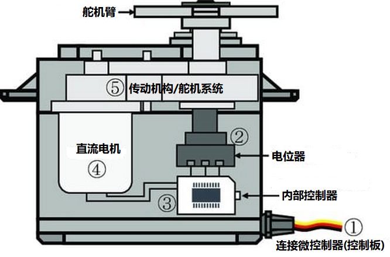
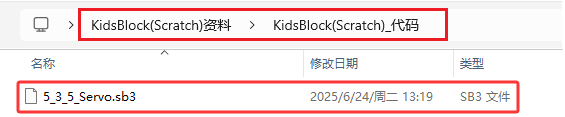
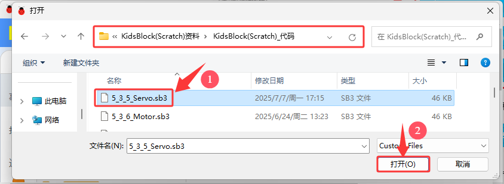
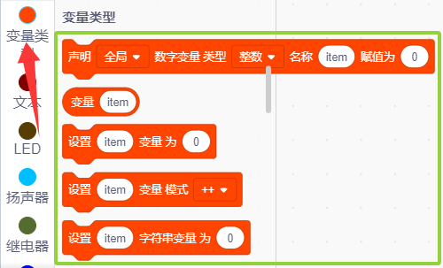
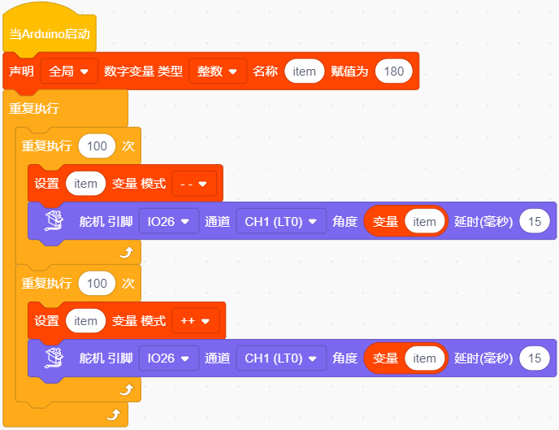

### 5.3.5 舵机模块

#### 5.3.5.1 简介

本教程将为您详细介绍舵机模块的使用方法和应用技巧。舵机是一种能够精确控制角度的电机，广泛应用于机器人、遥控模型和自动化设备中。教程内容包括舵机的工作原理、引脚功能、电路连接方法以及如何通过微控制器（如ESP32）控制舵机的转动角度。您将学习如何编写代码来实现舵机的精确位置控制、平滑运动以及多舵机协同工作。无论您是电子初学者还是有经验的开发者，本教程都将帮助您掌握舵机模块的应用，为您的项目增添灵活的机械控制功能。

#### 5.3.5.2 元件知识

**控制原理**：舵机的转动的角度是通过调节PWM（脉冲宽度调制）信号的占空比来实现的，标准PWM（脉冲宽度调制）信号的周期固定为20ms（50Hz)，理论上脉宽分布应在1ms到2ms 之间，但是，事实上脉宽可由0.5ms 到2.5ms 之间，脉宽和舵机的转角0°～180°相对应。有一点值得注意的地方，由于舵机牌子不同，对于同一信号，不同牌子的舵机旋转的角度也会有所不同

**引脚介绍：**

**GND：** 一个接地的引脚，棕色

**VCC：** 一个连接到+5v电源的引脚，红色

**S：** 信号端的引脚，PWM信号控制，橙色

**内部结构图：**

- 信号线：接收来自微控制器的控制信号；

- 电位器：可以测量输出轴的位置量，属于整个舵机机构的反馈部分；

- 内部控制器：处理来自外部控制的信号，驱动电机以及处理反馈的位置信号，是整个伺服机构的核心；

- 直流电机：作为执行机构，输出多少转速，转矩，位置；

- 传动机构/舵机系统：该机构根据一定传动比，将电机输出的行程缩放到最终输出的角度上。

**驱动舵机：**

通过向舵机的信号信号线发送PWM信号来控制舵机的输出量，**PWM脉冲的占空比直接决定了输出轴的位置。**

**例如（这里以180°舵机为例）：**

- 当我们向180°舵机发送脉冲宽度为1.5毫秒（ms）的信号时，舵机的输出轴将移至中间位置（90度）；

- 脉冲宽度为`0.5ms`时，舵机的输出轴将移至最小的位置（0度）；

- 脉冲宽度为`2.5ms`时，舵机的输出轴将移至最大的位置（180度）。

舵机的周期通常为20毫秒，希望以`50Hz`的频率产生脉冲，但是许多伺服器在40至200 Hz的范围内也都能正常工作。

**注:** 不同类型和品牌的舵机之间最大位置和最小位置的角度可能会不同。许多舵机仅旋转约170度(或者只有90度)，但宽度为1.5ms的伺服脉冲通常会将伺服设置为中间位置(通常是指定全范围的一半)。

#### 5.3.5.3 接线图

- **舵机的黄色线连接到io26**

⚠️ **特别注意：智慧农场已经组装好了，这里不需要把舵机拆下来又重新组装和接线，这里再次提供接线图，是为了方便您编写代码！**

#### 5.3.5.4 实验代码

代码文件在`KidsBlock(Scratch)_代码`文件夹中，代码文件为`5_3_5_Servo.sb3`，如下图所示：

单击 “**文件**” --> “**从电脑中上传**”，然后选择保存代码的路径，选中代码文件打开即可，如下图所示：

**认识代码块**

① 这个代码块，表示当启动ESP32这块开发板时，将运行代码。

② 创建变量。

这是创建 “**变量**” 的指令方块，可以声明“全局”或“局部”，还可以设置变量的类型、名称和赋值，item是变量名称。

获取变量item。

设置变量item模式为每执行一次循环让item加1或每执行一次循环让item减1。 

③ 循环语句，顾名思义就是重复做一件事。

④ 有条件的循环控制语句，当满足循环次数时就退出循环，比如：10表示循环执行10次，数字10是可以改成其他数字的。
 

⑤ 向舵机指定引脚设置输出角度代码块，需要设置对应的引脚，通道（一共有16个通道（0~15）），角度和延时，就可以输出对应角度。

⑥ 将程序的执行暂停一段时间，也就是延时。单位是秒。 

**组合代码块**

#### 5.3.5.5 实验结果

按照接线图接好线，外接电源，选择好正确的开发板板型（ESP32 Dev Module）和 适当的串口端口（COMxx），然后单击按钮上传代码。上传代码成功后可以看到饲料盒在慢慢打开，慢慢关闭，实现可控制的。  

⚠️ **注意：SG90舵机是180度，在套件中的饲料盒较小，SG90舵机只需旋转100度，就能完全关闭饲料盒。**

- 80度：完全打开。
- 120度：打开一半。
- 180度：关闭。

⚠️ **注意：请勿将手指伸入到饲料盒中，谨防夹伤！请勿将其他物体堵住饲料盒盖，以免弄坏舵机。**

#### 5.3.5.6 代码解释

（1）.定义一个变量**item**，初始值为180.

（2）.把**item**设定为舵机的角度，从180度旋转到80度，每15毫秒旋转一度，重复100次。

（3）. 舵机角度从80度旋转到180度，每15毫秒旋转一度，重复100次。

