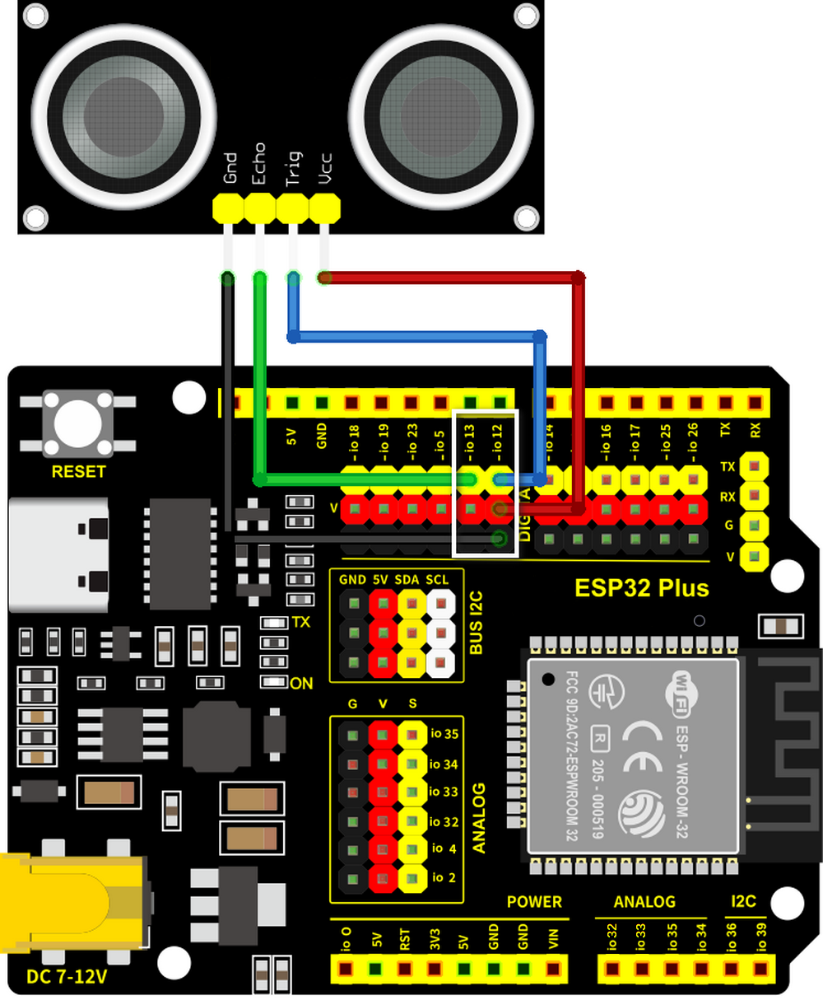
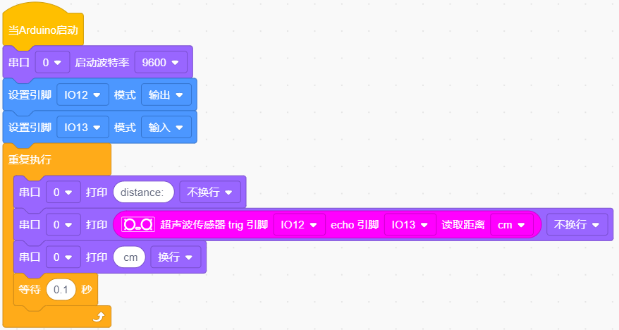
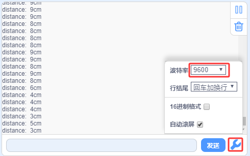
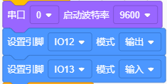

### 5.3.7 超声波传感器

#### 5.3.7.1 简介

本教程将为您详细介绍超声波传感器的使用方法和应用技巧。超声波传感器是一种利用超声波测距的电子设备，广泛应用于避障、距离测量和物体检测。教程内容包括超声波传感器的工作原理、引脚功能、电路连接方法以及如何通过微控制器（如ESP32）读取和处理测距数据。您将学习如何编写代码来实现实时距离测量、障碍物检测以及数据滤波和校准。无论您是电子初学者还是有经验的开发者，本教程都将帮助您掌握超声波传感器的应用，为您的项目增添精确的距离感知功能。

#### 5.3.7.2 元件知识

**超声波传感器:** 可以检测前方是否存在障碍物，并且检测出传感器与障碍物的详细距离。传感器主要用到CS100A芯片，它同时兼营3.3V与5V工作电压。最大测试距离为3米（实际受各种环境因素的影响，一般很难达到3米的）；盲区小于4CM。

它的测距原理和蝙蝠飞行的原理一样，就是超声波模块发送出一种频率很高，人体无法听到的超声波信号。这些超声波的信号若是碰到障碍物，就会立刻反射回来，在接收到返回的信息之后，通过判断发射信号和接收信号的时间差，计算出传感器和障碍物的距离。

**超声波参数：**

- 工作电压: DC 3.3V~5V
- 静态电流: <2mA
- 工作电流: 50mA~100mA，正常为65mA
- 最大功率：0.5W
- 最大探测距离：3m
- 盲区：小于4cm
- 感应角度：不大于15度
- 触发输入信号：10us TTL脉冲

**工作原理：**

最常用的超声测距的方法是回声探测法。当有脉冲电压触发时（单片机给Trig引脚发送高电平），超声波发射器探头里的晶片就会振动，继而产生超声波。在超声波发射时刻的同时计数器开始计时，超声波在空气中传播，途中碰到障碍物面阻挡就立即反射回来（Echo引脚发送高电平信号给单片机），超声波接收器收到反射回的超声波就立即停止计时。

超声波是一种声波，其声速V与温度有关。一般情况下超声波在空气中的传播速度为340m/s，根据计时器记录的时间t，就可以计算出超声波探头发射点距障碍物面的距离s，即：s=340t/2 。

HC-SR04超声波测距模块可提供范围为2厘米至3米的非接触式距离感测功能，测距精度可达高到3mm。超声波传感器包括超声波发射器、超声波接收器与控制电路。其基本工作原理：

(1) 采用IO口Trig触发测距，给至少10us的高电平信号;

(2) 模块自动发送8个40khz的方波，自动检测是否有信号返回；

(3) 有信号返回，通过IO口Echo输出一个高电平，高电平持续的时间就是超声波从发射到返回的时间。

(4) 距离 =（高电平时间 x 声速（340M/S）） / 2

⚠️ **注意:**

此模块不应在通电时连接，如有必要，先连接模块的 GND。否则，会影响模块的工作。

被测物体的面积应至少为 0.5 平方米，并尽可能平坦。否则，它会影响结果。

#### 5.3.7.3 接线图

- **超声波传感器的Echo引脚连接到io13，Trig引脚连接到io12**

⚠️ **特别注意：智慧农场已经组装好了，这里不需要把超声波传感器拆下来又重新组装和接线，这里再次提供接线图，是为了方便您编写代码！**

#### 5.3.7.4 实验代码

代码文件在`KidsBlock(Scratch)_代码`文件夹中，代码文件为`5_3_7_Read_Distance.sb3`，如下图所示：

单击 “**文件**” --> “**从电脑中上传**”，然后选择保存代码的路径，选中代码文件打开即可，如下图所示：

**认识代码块**

① 这个代码块，表示当启动ESP32这块开发板时，将运行代码。

② 设置串口。

设置串口波特率，一般波特率设置为`9600`或`115200`。

串口输出数据，从串行端口输出数据，分换行与不换行两种方式。

③ 向指定引脚设置 “输入” 或 “输出”，选择 “输入” 代表给该引脚设置输入模式；选择 “输出” 代表给引脚设置输出模式；选择 “输入上拉” 代表给该引脚设置输入模式并且使该引脚变成高电平。

④ 循环语句，顾名思义就是重复做一件事。

⑤ 读取超声波传感器的距离值。

⑥ 将程序的执行暂停一段时间，也就是延时。单位是秒。 

**组合代码块**

#### 5.3.7.5 实验结果

按照接线图接好线，外接电源，选择好正确的开发板板型（ESP32 Dev Module）和 适当的串口端口（COMxx），然后单击按钮上传代码。上传代码成功后，单击KidsBlock IDE右下角的设置串口波特率为`9600`，即可通过串口打印窗口查看超声波测距的距离值，调整超声波与障碍物的距离便能观察到距离变化。  

**串口现象图：**

#### 5.3.7.6 代码说明

（1）. 设置串口波特率，超声波传感器的Echo引脚为输入模式、Trig引脚为输出模式。

（2）. 串口打印超声波传感器检测到的距离值。

