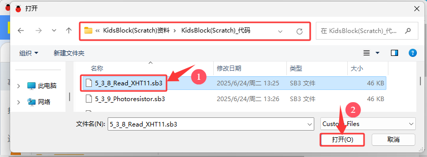
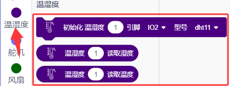
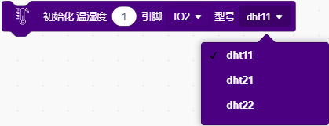
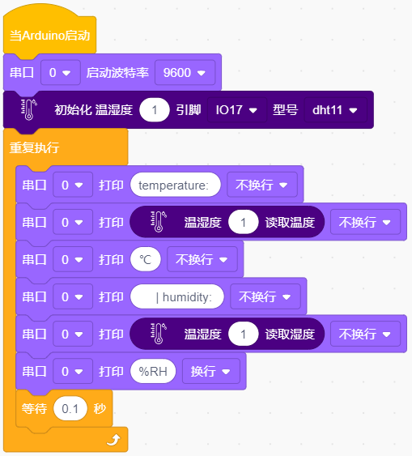
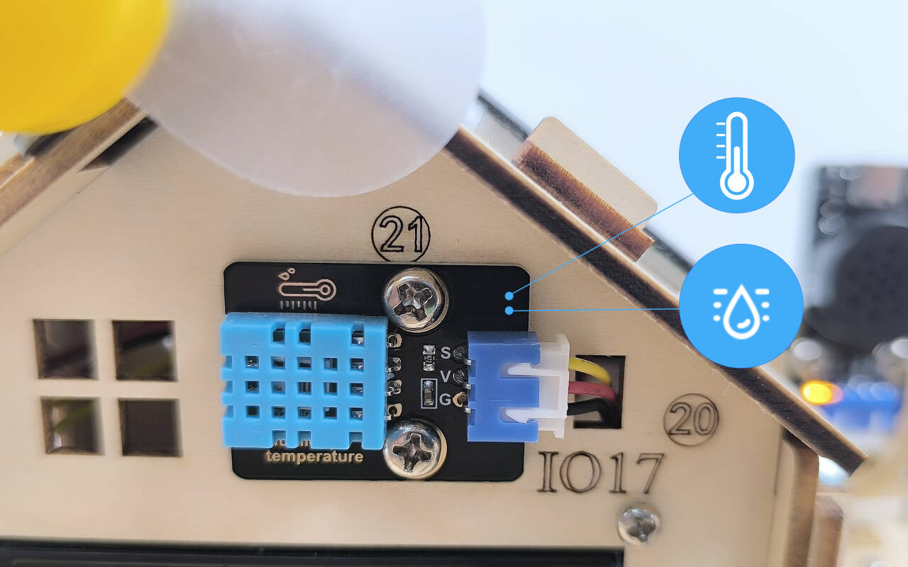
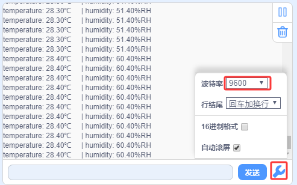

### 5.3.8 XHT11温湿度传感器

#### 5.3.8.1 简介

本教程将为您详细介绍XHT11温湿度传感器的使用方法和应用技巧。XHT11温湿度传感器是一种能够检测环境中的温度和湿度的电子元件，常用于家庭自动化、环境监测、农业等领域。教程内容包括XHT11温湿度传感器的工作原理、电路连接方法以及如何通过微控制器（如ESP32）读取温湿度值。您将学习如何编写代码来获取XHT11温湿度传感器检测的实时温湿度值，无论您是电子初学者还是有经验的开发者，本教程都将帮助您掌握XHT11温湿度传感器的应用，为您的项目增添智能的温湿度检测功能。

#### 5.3.8.2 元件知识

**XHT11温湿度传感器:** 是一种数字信号输出的温湿度传感器。它利用特殊的模拟信号采集、转换技术和温度、温湿度传感技术，确保传感器拥有良好的长时间稳定性，和较高的可靠性。该传感器内部包含高精度的电阻式湿度传感器件，和电阻式热敏测温传感器件，并与一个8位的性能高的单片机相连接。

**XHT11通信方式：**

XHT11 器件采用简化的单总线通信。单总线即只有一根数据线，系统中的数据交换、控制均由单总线完成。

- 单总线传送数据位定义：

  - 单总线数据格式：一次传送 40 位数据，高位先出。

  - 8bit 湿度整数数据 + 8bit 湿度小数数据 + 8bit 温度整数数据 + 8bit 温度小数数据 + 8bit 校验位。**注：其中湿度小数部分为 0**。

- 校验位数据定义：
  - 8bit 湿度整数数据 + 8bit 湿度小数数据 + 8bit 温度整数数据 + 8bit 温度小数数据。8bit 校验位等于所得结果的末 8 位。

数据时序图如下：

用户主机（MCU）发送一次开始信号后，XHT11 从低功耗模式转换到高速模式，待主机开始信号结束后，XHT11 发送响应信号，送出 40bit 的数据，并触发一次信采集。信号发送如图所示:

⚠️ **注：** 主机从 XHT11 读取的温湿度数据总是前一次的测量值，如两次测间隔时间很长，请连续读两次以第二次获得的值为实时温湿度值。

**原理图：**

**参数：**

- 工作电压: DC 3.3V~5V 
- 工作电流: (Max)2.5mA@5V
- 最大功率: 0.0125W
- 温度范围: -25 ~ +60°C (± 2℃)
- 湿度范围: 5 ~ 95%RH（25C°左右精度为±5%RH）
- 输出信号: 数字双向单总线

#### 5.3.8.3 接线图

- **XHT11温湿度传感器的S引脚连接到io17**

⚠️ **特别注意：智慧农场已经组装好了，这里不需要把XHT11温湿度传感器拆下来又重新组装和接线，这里再次提供接线图，是为了方便您编写代码！**

#### 5.3.8.4 实验代码

代码文件在`KidsBlock(Scratch)_代码`文件夹中，代码文件为`5_3_8_Read_XHT11.sb3`，如下图所示：

单击 “**文件**” --> “**从电脑中上传**”，然后选择保存代码的路径，选中代码文件打开即可，如下图所示：

**认识代码块**

① 这个代码块，表示当启动ESP32这块开发板时，将运行代码。

② 设置串口。

设置串口波特率，一般波特率设置为`9600`或`115200`。

串口输出数据，从串行端口输出数据，分换行与不换行两种方式。

③ 这是一些温湿度传感器的代码块。

初始化温湿度的引脚和型号（dht11，dht21，dht22）。

读取温湿度的温度值。

读取温湿度的湿度值。

④ 循环语句，顾名思义就是重复做一件事。

⑤ 将程序的执行暂停一段时间，也就是延时。单位是秒。 

**组合代码块**

#### 5.3.8.5 实验结果

按照接线图接好线，外接电源，选择好正确的开发板板型（ESP32 Dev Module）和 适当的串口端口（COMxx），然后单击按钮上传代码。上传代码成功后，单击KidsBlock IDE右下角的设置串口波特率为`9600`，即可通过串口打印窗口查看XHT11传感器检测到的当前的温度和湿度等信息。  

**串口现象图：**

