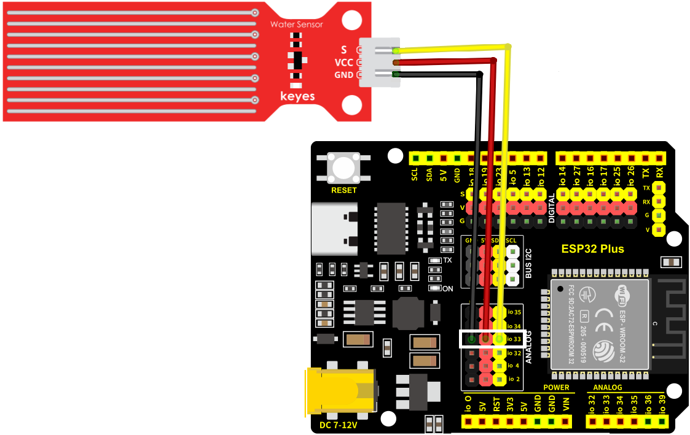
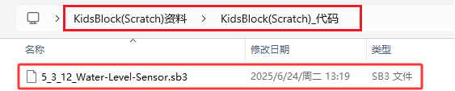
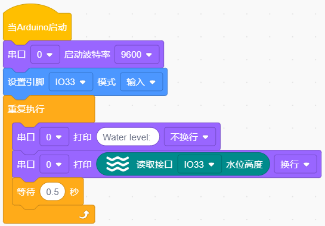
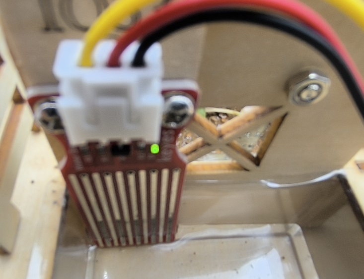
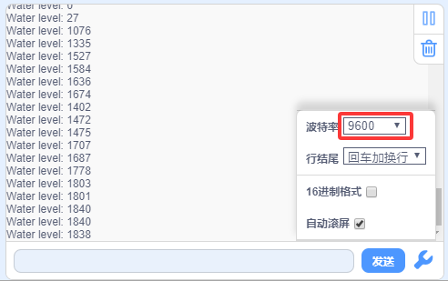

### 5.3.12 水位传感器

#### 5.3.12.1 简介

本教程将为您详细介绍水位传感器的使用方法和应用技巧。水位传感器是一种用于检测液体高度的电子设备，广泛应用于水塔监控、水箱管理和环境监测。教程内容包括水位传感器的工作原理、引脚功能、电路连接方法以及如何通过微控制器（如ESP32）读取和处理水位数据。您将学习如何编写代码来实现实时水位监测、自动报警以及数据校准和误差修正。无论您是电子初学者还是有经验的开发者，本教程都将帮助您掌握水位传感器的应用，为您的项目增添精确的液体高度检测功能。

#### 5.3.12.2 元件知识

**水位传感器：** 与土壤传感器的原理相同都是通过检测电导率变化来测量。水面淹没的传感器感应区越少，电导率降低，传感器输出的模拟值减小；水面淹没的传感器感应区越多，电导率增加，传感器输出的模拟值增大。这种传感器简单实用，适合用于农业灌溉、园艺等场景。

**原理图：**

⚠️ **注意：** 不要让传感器的元器件碰到水，可能会损害传感器以及开发板 

#### 5.3.12.3 接线图

- **水位传感器的S引脚连接到io33**

⚠️ **特别注意：智慧农场已经组装好了，这里不需要把水位传感器拆下来又重新组装和接线，这里再次提供接线图，是为了方便您编写代码！**

#### 5.3.12.4 实验代码

代码文件在`KidsBlock(Scratch)_代码`文件夹中，代码文件为`5_3_12_Water-Level-Sensor.sb3`，如下图所示：

单击 “**文件**” --> “**从电脑中上传**”，然后选择保存代码的路径，选中代码文件打开即可，如下图所示：

**认识代码块**

① 这个代码块，表示当启动ESP32这块开发板时，将运行代码。

② 设置串口。

设置串口波特率，一般波特率设置为`9600`或`115200`。

串口输出数据，从串行端口输出数据，分换行与不换行两种方式。

③ 向指定引脚设置 “输入” 或 “输出”，选择 “输入” 代表给该引脚设置输入模式；选择 “输出” 代表给引脚设置输出模式；选择 “输入上拉” 代表给该引脚设置输入模式并且使该引脚变成高电平。

④ 循环语句，顾名思义就是重复做一件事。

⑤ 读取水位传感器的水位高度值（模拟值）。

⑥ 将程序的执行暂停一段时间，也就是延时。单位是秒。 

**组合代码块**

#### 5.3.12.5 实验结果

按照接线图接好线，外接电源，选择好正确的开发板板型（ESP32 Dev Module）和 适当的串口端口（COMxx），然后单击按钮上传代码。上传代码成功后，单击KidsBlock IDE右下角的设置串口波特率为`9600`，即可通过串口打印窗口查看水位传感器的模拟值，将水位传感器放置到容器中然后往容器中加水，注意不要超过安全线。  

**串口现象图：**

