### 5.3.13 I2C LCD1602模块

#### 5.3.13.1 简介

本教程将为您详细介绍I2C LCD1602模块的使用方法和应用技巧，该显示屏采用PCF8574T驱动芯片，背光 (蓝色背景和白色背光)。教程内容包括I2C LCD1602模块的工作原理、引脚功能、电路连接方法以及如何通过微控制器（如ESP32）控制显示内容。您将学习如何编写代码来使I2C LCD1602模块显示数字、字母等。无论您是电子初学者还是有经验的开发者，本教程都将帮助您掌握I2C LCD1602模块的应用，为您的项目增添清晰、生动的视觉显示功能。

#### 5.3.13.2 元件知识

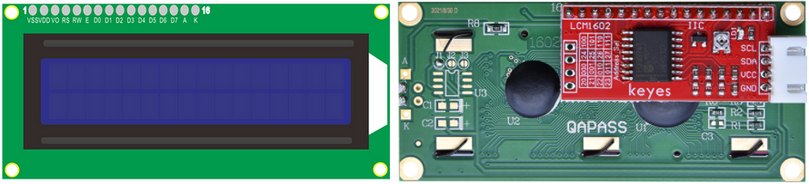

LCD1602显示屏：显示屏有LCD 1602液晶显示屏和I2C LCD1602模块。但是我们在这个项目中使用的是一个I2C LCD1602模块。I2C LCD1602模块的显示屏可以显示16列2行字符。它能够显示数字、字母、符号、ASCII码等。如下所示是一个单色LCD1602显示屏（在工作时需要占用控制板的7个IO口）及其电路引脚图：

I2C LCD1602模块集成了I2C接口，连接的串行输入&并行输出给LCD1602显示屏模块。这使得我们只要使用4条线路就可以来操作LCD1602。

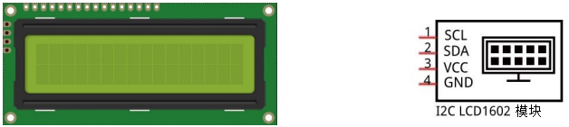

本模块使用的IC芯片为PCF8574T (PCF8574AT)，其默认I2C地址为0x27(0x3F)。

在I2C LCD1602模块的背面有一个**金属电位器**。你可以用一字螺丝刀转动电位器来调整对比度。         

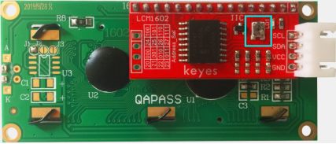

⚠️ **请注意：** 当你旋转电位器时，屏幕将变得更亮或更暗，适当的角度将使字体更清晰。

**原理图：**

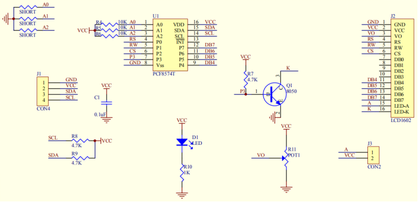

**参数：**

- 显示像素：16 * 2 字符
- 芯片工作电压：4.5 ~ 5.5V
- 工作电流：2.0mA (5.0V)
- 模块最佳工作电压：5.0V
- I2C 地址：0x27
- 背光 (蓝色背景和白色背光)
- 背后的接线引脚分别为GND、VCC、SDA、SCL（SDA和SCL分别为IIC通讯的数据线和时钟线）。

**I2C 地址：**

默认地址基本上是 0x27，在少数情况下可能是 0x3F。

以默认地址 0x27 为例，可以通过短接 A0/A1/A2 焊盘来修改设备地址; 在默认状态下，A0/A1/A2 为 1，如果焊盘短路，则 A0/A1/A2 为 0。

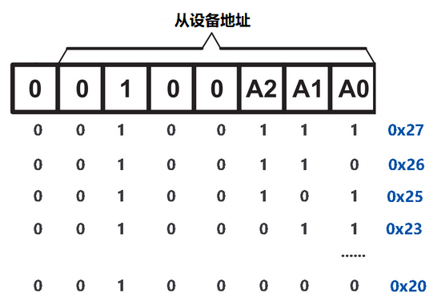

**对比度：**

背面的电位器用于调整对比度（最亮的白色和最暗的黑色之间的亮度比）。

电位器 ：用于调整对比度（显示文本的清晰度），对比度在顺时针方向上增加，在逆时针方向上减少。

**I2C串行通信：**

I2C通信协议是Inter-Integrated Circuit（IIC）的缩写，也叫作两线制或TWI（Two-Wire Interface），是一种通用的主从式的两线总线通信协议，它是由Philips Semiconductor公司开发的（现在被美国NXP半导体公司收购）。

其最大的优点是只需要两根线就可以完成数据的传输，对于系统线路的繁琐也减少了很多，这种总线可以并行联结127个节点，并且支持多主机，从机一般不需要外接电源，因为I2C总线可以把电源传输到从机。如下图：

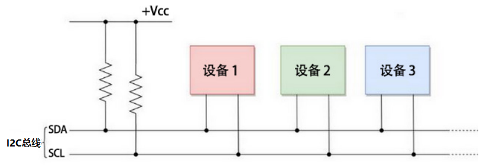

I2C总线的数据传输采用8位数据传输的方式，通常一个字节的数据传输是由9个时钟信号组成，8个时钟信号传输数据，最后一个时钟信号用于传输结束的标志。同时，I2C总线也支持多字节的数据传输，不断重复上述过程，即可完成多字节的数据传输。

I2C协议的基本组成部分包括以下内容：

- 起始信号：在发送数据之前，发送方必须发送起始信号，以告知接收方，要发送数据了。

- 地址码：地址码用于告知接收方，要发送的数据是给谁的。

- 数据：数据按照位传输，每次传输一个字节的数据。

- 停止信号：发送完数据后，发送方必须发送停止信号，以告知接收方，数据发送完毕。

Arduino提供了一个名为Wire.h的I2C协议集成库，可以通过调用其函数实现I2C通信，从而实现与I2C/TWI设备的通信。

具体库介绍参考官网链接：
[https://www.arduino.cc/reference/en/language/functions/communication/wire/](https://www.arduino.cc/reference/en/language/functions/communication/wire/)

#### 5.3.13.3 接线图

- **I2C LCD1602模块连接到 BUS I2C(SDA连接(SDA:IO21)、SCL连接(SCL:IO22)**

⚠️ **特别注意：智慧农场已经组装好了，这里不需要把I2C LCD1602模块拆下来又重新组装和接线，这里再次提供接线图，是为了方便您编写代码！**

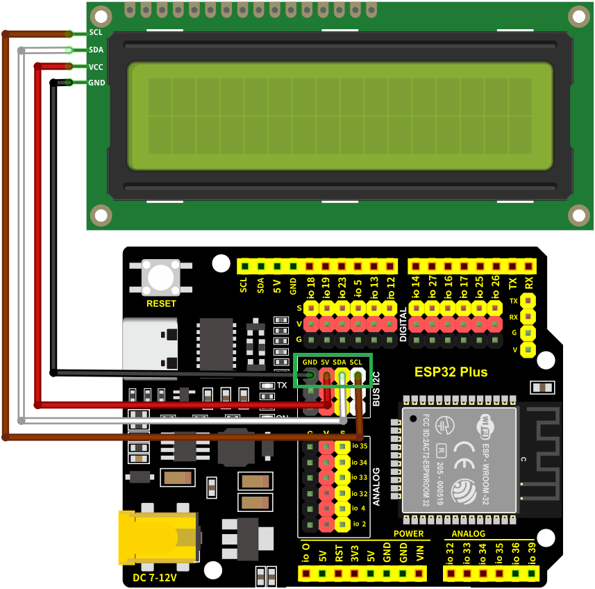

#### 5.3.13.4 实验代码

代码文件在`KidsBlock(Scratch)_代码`文件夹中，代码文件为`5_3_13_LCD1602.sb3`，如下图所示：

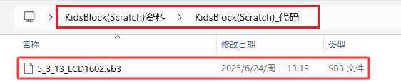

单击 “**文件**” --> “**从电脑中上传**”，然后选择保存代码的路径，选中代码文件打开即可，如下图所示：

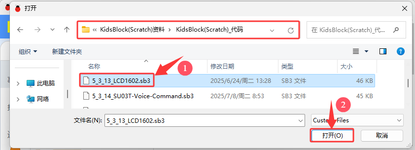

**认识代码块**

① 这个代码块，表示当启动ESP32这块开发板时，将运行代码。

② 这是一些 I2C LCD 1602显示屏的相关代码块

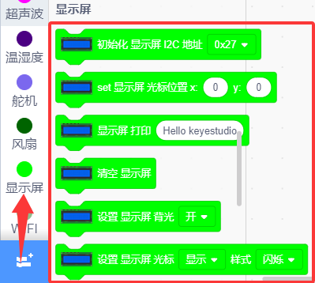

初始化LCD显示屏的地址。

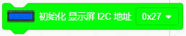

设置LCD显示屏的光标位置。

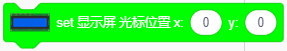

LCD显示屏显示的内容。

LCD显示屏清屏。

打开/关闭LCD显示屏的背光。

设置LCD显示屏显示/隐藏光标，闪烁/不闪烁样式。

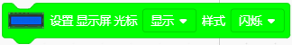

**组合代码块**

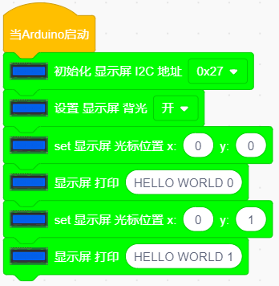

#### 5.3.13.5 实验结果

按照接线图接好线，外接电源，选择好正确的开发板板型（ESP32 Dev Module）和 适当的串口端口（COMxx），然后单击按钮上传代码。上传代码成功后，I2C LCD1602模块的显示屏会打开背光，并显示两行文字 “**HELLO WORLD 0**” 和 “**HELLO WORLD 1**” .  

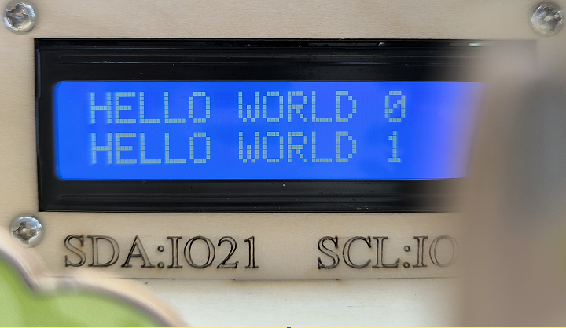

⚠️ **注意：** 如果代码和接线正确，但 LCD 仍然无法显示任何内容，则可以调整背面的电位器以增加对比度。

#### 5.3.13.6 代码说明

（1）. 初始化 LCD 1602，打开（可选）背光灯。

（2）. 将光标位置设置为x: 0、y:0，在 I2C LCD1602模块的显示屏上的x: 0、y:0位置显示文本 “HELLO WORLD 0”。

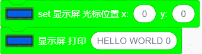

（9）. 将光标位置设置为x: 0、y:1，在 I2C LCD1602模块的显示屏上的x: 0、y:1位置显示文本 “HELLO WORLD 1”。

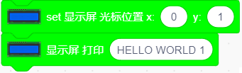