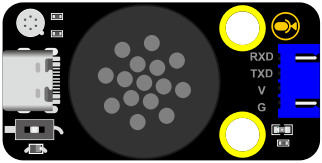
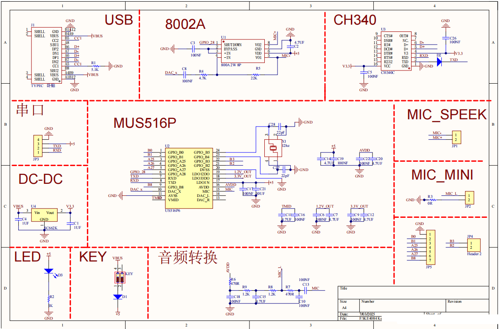
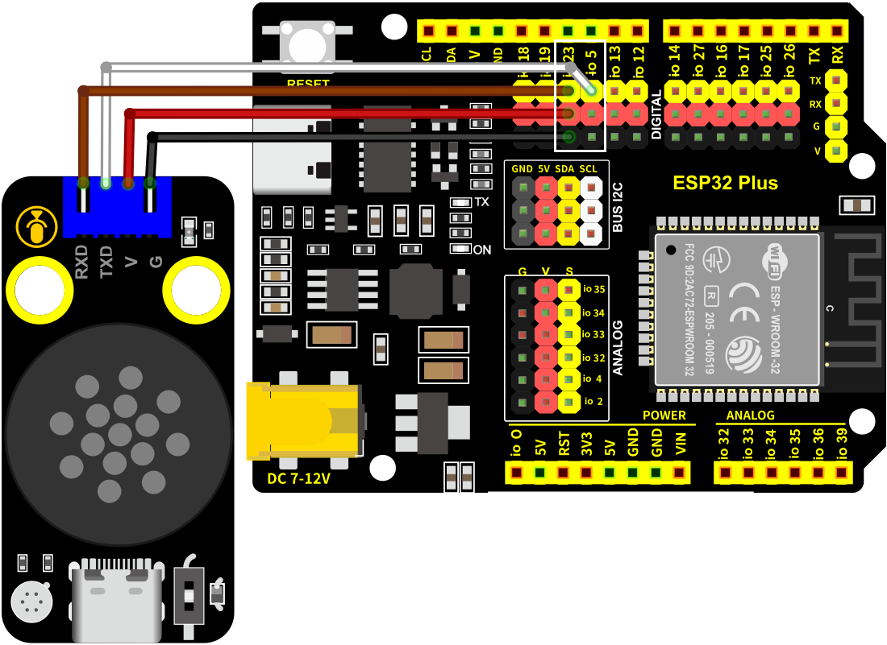
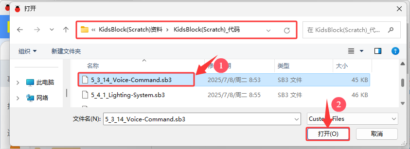
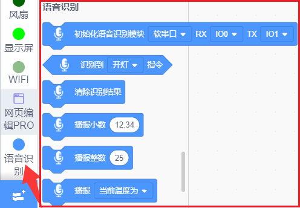
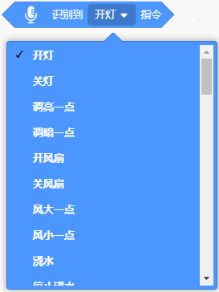
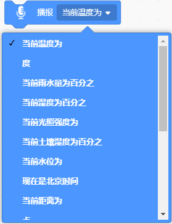
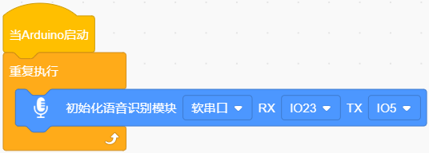
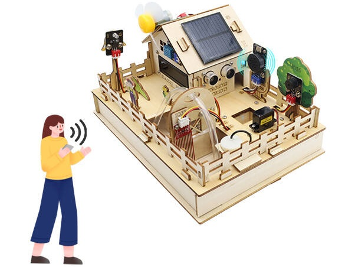
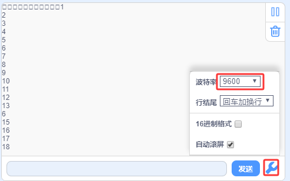

### 5.3.14 智能语音模块

#### 5.3.14.1 简介

本教程将为您详细介绍智能语音模块，智能语音模块为用户提供便捷便宜的串口离线语音识别方案，可广泛且快速应用于智能家居，各类智能小家电，86盒，玩具，灯具等需要语音操控的产品。教程内容包括智能语音模块的工作原理、引脚功能、电路连接方法以及如何通过微控制器（如ESP32）来控制。您将学习如何编写代码通过串口打印智能语音模块的命令。无论您是电子初学者还是有经验的开发者，本教程都将帮助您掌握智能语音模块的应用，为您的项目增添清晰、生动的视觉显示功能。

#### 5.3.14.2 元件知识

**智能语音模块：** 语音识别采用了离线语音识别芯片MUS516P6，该芯片采用 32bit RSIC 架构内核，并加入了专门针对信号处理和语音识别所需要的 DSP指令集，支持浮点运算的 FPU 运算单元，以及 FFT 加速器。智能语音模块通过串口通信的方式实现与主机的交互，最多支持150条语音指令，可在用户平台上自主定制语音指令和固件，命令词可任意修改，开发简单，不需要写代码。自带固件下载芯片，只需数据线即可完成固件下载。支持语音调节音量、学习唤醒词，识别灵敏且准确率高。

**原理图：**

**技术参数：**

- 工作电压：3.3V~5.5V
- 负载：LDO输出3.3V，外部负载不能超过150MA
- 供电及待机：500MA/60MA
- 硬件: 10个IO口 / 1路uart(串口) / 5个ADC / 2个PWM / 1路I2S / 1路SPI / 1路I2C
- 音频输出：1路MONO功放输出接口
- 语音指令：70条（最大支持150条）
- FLASH: 2M
- 喇叭功率：8欧1W
- 支持语言：默认固件支持中文（也可自行生成英文）
- 工作温度：0~80℃
- 尺寸：47.73mm*23.93mm
- 重量：8.96g

#### 6.3.14.3 固件导入

⚠️ **特别提醒：** 智能语音模块在出厂时，已经导入好了默认语音固件，不需要再重复导入。如果你发现语音固件流失了或者想导入你自己的语音固件，请参照链接：[语音固件制作说明](https://www.keyesrobot.cn/projects/KE4084/zh-cn/latest/docs/index.html#id6) 中的说明。

⚠️ **特别提醒：** 我们提供的语音固件，包括默认的语音命令词和语音播报，想了解请参照链接：[默认语音固件](https://www.keyesrobot.cn/projects/KE4084/zh-cn/latest/docs/index.html#id7)，可以看到一些默认语音命令词和语音播报等内容，请认真查看。

#### 5.3.14.4 接线图

- **智能语音模块的TXD引脚连接到io5，RXD引脚连接到io23**

⚠️ **特别注意：智慧农场已经组装好了，这里不需要把智能语音模块拆下来又重新组装和接线，这里再次提供接线图，是为了方便您编写代码！**

#### 5.3.14.5 实验代码

代码文件在`KidsBlock(Scratch)_代码`文件夹中，代码文件为`5_3_14_SU03T-Voice-Command.sb3`，如下图所示：

单击 “**文件**” --> “**从电脑中上传**”，然后选择保存代码的路径，选中代码文件打开即可，如下图所示：

**认识代码块**

① 这个代码块，表示当启动ESP32这块开发板时，将运行代码。

② 循环语句，顾名思义就是重复做一件事。

③ 这是一些语音识别指令方块 

初始化语音模块软串口/硬串口、引脚，并且还可以接收语音命令、读取语音命令且串口打印语音命令参数 等。

语音识别一些固定的命令词

清除语音识别的命令词和语音播报等

语音播报一些小数的数字

语音播报一些整数的数字

语音播报一些固定的命令

**组合代码块**

#### 5.3.14.6 实验结果

按照接线图接好线，外接电源，选择好正确的开发板板型（ESP32 Dev Module）和 适当的串口端口（COMxx），然后单击按钮上传代码。上传代码成功后，单击KidsBlock IDE右下角的设置串口波特率为`9600`。

对着智能语音模块上的麦克风，使用唤醒词 “你好，小智” 或 “小智小智” 来唤醒智能语音模块，同时喇叭播放回复语 “有什么可以帮到您”；接下来即可通过串口打印窗口查看智能语音模块接收到语音命令词所对应的命令参数 等。

智能语音模块唤醒后，对着麦克风说：“打开台灯” 或 “请开灯” 或 “开灯” 或 “打开灯” 或 “我回来了”等命令词时，串口打印命令参数 “1”，同时喇叭播放对应的回复语 “已为您打开照明”；

对着麦克风说：“关闭台灯” 或 “请关灯” 或 “关灯” 或 “睡觉了” 或 “关上灯” 或 “我出去了”等命令词时，串口打印命令参数 “2”，同时喇叭播放对应的回复语 “已为您关闭照明”。

对着麦克风说：“调亮一点” 或 “亮一点”等命令词时，串口打印命令参数 “3”，同时喇叭播放对应的回复语 “灯光已调亮”；

对着智能语音模块上的麦克风说 “调暗一点” 或 “暗一点”等命令词时，串口打印命令参数 “4”，同时喇叭播放对应的回复语 “灯光已调暗”；

其他的这里就不一一分别陈述，请查看下面所列的语音命令词和语音播报指令，所对应的命令参数和信息号：

默认的语音命令词和语音播报等等，请参照链接： [默认语音固件](https://www.keyesrobot.cn/projects/KE4084/zh-cn/latest/docs/index.html#id7)

