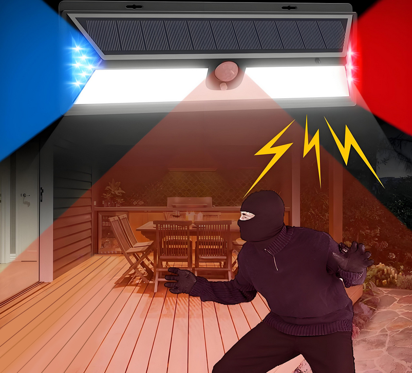
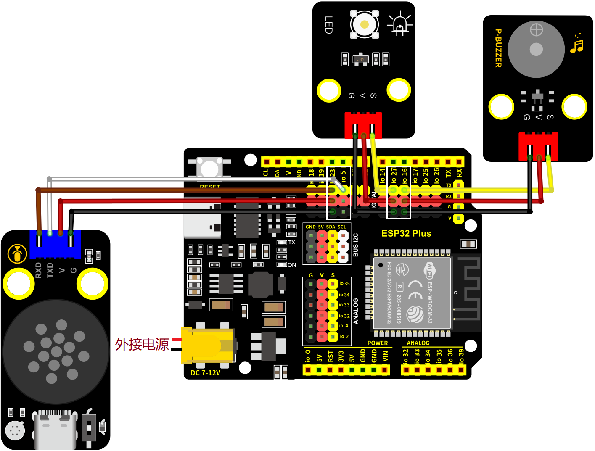
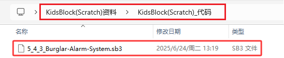
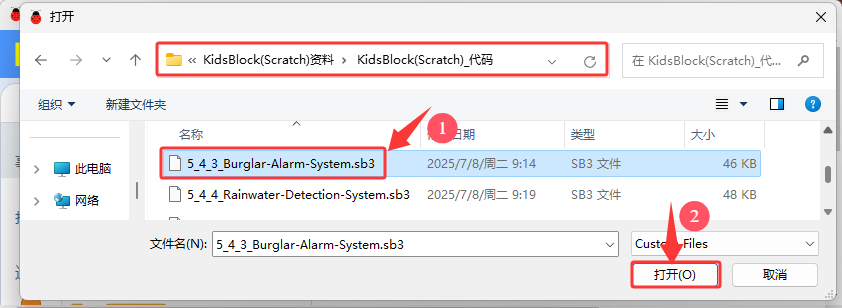
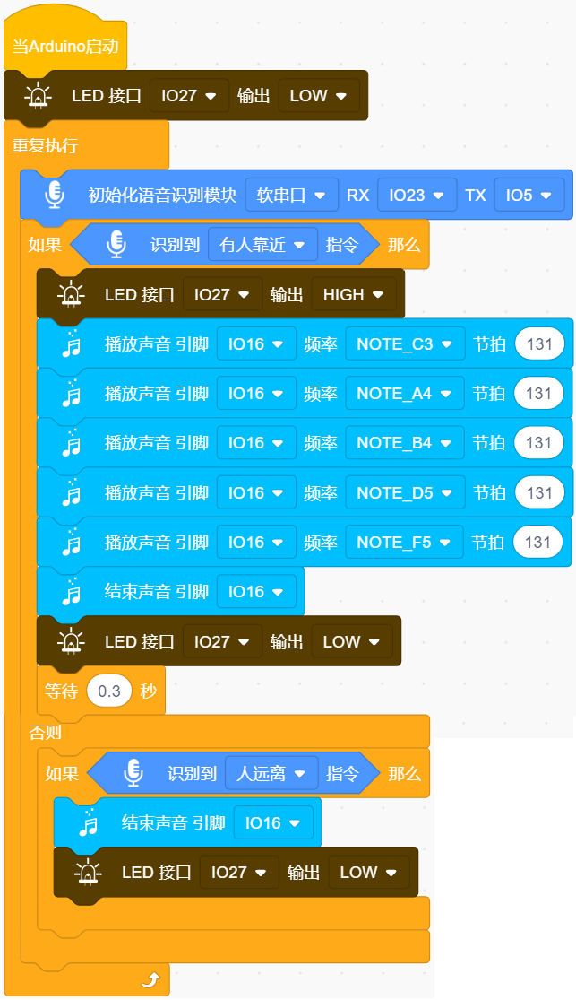

### 5.4.3 防盗警报系统

#### 5.4.3.1 简介

智能语音模块、LED和蜂鸣器组成的防盗报警系统，可以使用ESP32开发板进行控制。使用KidsBlock IDE进行编程，如果发现有人，唤醒智能语音模块，对着麦克风说：“有人” 或 “有人靠近” 或 “有人过来” 等命令词时，则蜂鸣器发出警报声，LED闪烁。通过这种方式，可以实现低成本语音智能的防盗报警系统，适用于大型农场或大型商城等。

本课程将介绍如何使用智能语音模块、无源蜂鸣器和LED组合成一个基于Arduino ESP32的防盗警报系统。当发现有人在活动时，唤醒智能语音模块，对着麦克风说：“有人” 或 “有人靠近” 或 “有人过来” 等命令词时，蜂鸣器会发出警报声，同时LED会点亮，从而提醒使用者有人进入该区域。

#### 5.4.3.2 接线图

- **LED模块的S引脚连接到io27**

- **无源蜂鸣器的S引脚连接到io16**

- **智能语音模块的TXD引脚连接到io5，RXD引脚连接到io23**

⚠️ **特别注意：智慧农场已经组装好了，这里不需要把智能语音模块、无源蜂鸣器和LED模块拆下来又重新组装和接线，这里再次提供接线图，是为了方便您编写代码！**

#### 5.4.3.3 代码流程图

#### 5.4.3.4 实验代码

代码文件在`KidsBlock(Scratch)_代码`文件夹中，代码文件为`5_4_3_Burglar-Alarm-System.sb3`，如下图所示：

单击 “**文件**” --> “**从电脑中上传**”，然后选择保存代码的路径，选中代码文件打开即可，如下图所示：

**组合代码块**

#### 5.4.3.5 实验结果

按照接线图接好线，外接电源，选择好正确的开发板板型（ESP32 Dev Module）和 适当的串口端口（COMxx），然后单击按钮上传代码。上传代码成功后，通过智能语音模块来控制无源蜂鸣器和LED。

对着智能语音模块上的麦克风，使用唤醒词 “你好，小智” 或 “小智小智” 来唤醒智能语音模块，同时喇叭播放回复语 “有什么可以帮到您”；

智能语音模块唤醒后，对着麦克风说：“有人” 或 “有人靠近” 或 “有人过来” 等命令词时，喇叭播放对应的回复语 “是，有人正过来”，同时警报声就会响起来，警示灯也会闪烁；

对着麦克风说：“无人” 或 “人远离” 等命令词时，喇叭播放对应的回复语 “是，没有人”，同时警报声不响，警示灯也不亮。

