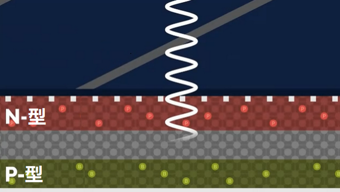
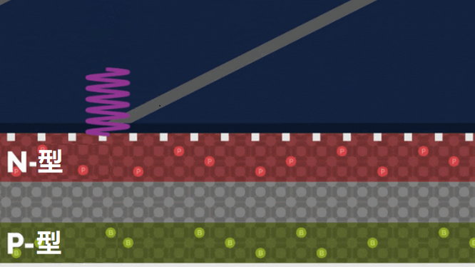
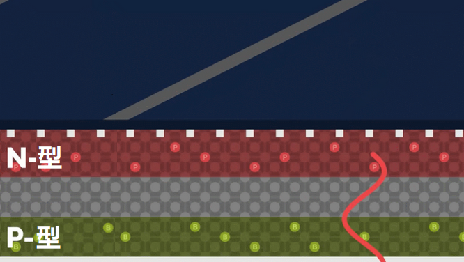

### 5.4.5 太阳能电力系统

#### 5.4.5.1 简介

太阳能板用于将光能转化为电能，然后为LED灯供电。它可以用于各种应用，如为户外照明供电，为移动设备充电，甚至作为家庭或企业的备用电源。通过将太阳的力量与 Arduino ESP32 的灵活性相结合，用户可以根据自己的具体需求，创建复杂而高效的太阳能发电系统。

#### 5.4.5.2 太阳能板参数

- 电压：5V
- 电流：80mA
- 功率：400mW
- 尺寸：60*60mm

#### 5.4.5.3 太阳能如何转换成电能？

太阳能板通过吸收光线，将太阳辐射光电效应，直接或间接转换成电能的装置，与普通煤炭发电相比，太阳能发电和风力发电、水利发电等，更节能环保。

#### 5.4.5.4 光能如何转换成电能？

接下来我们从内到外，来说说太阳能电池板的转换过程。

**1\. 太阳以波的形式发出能量，这些波的波长范围很广，从紫外线到可见光到红外线。**

- 紫外线波长范围：150~400nm ；
- 可见光波长范围：400~760nm ；
- 红外线波长范围：760~4000nm ；

**2\. 太阳能电池板就是吸收其中的一个范围的波长，从而转换成电能。那么它是如何实现的呢？**

我们接着往下看:

**太阳能板电池的活性部分是由半导体材料制成的，通常是硅（Si）。**

半导体是指在常温下导电性能介于导体与绝缘体之间的材料，一般情况下，无法良好导电，但在某些条件下具有很好的导电性。

**以上这张图呈现的是太阳能电池内部半导体的结构**，**分为三层：**

(1). **红色部分顶层：** 包含硅（Si）和极少量的磷（P），磷带的电子比硅多，为顶层提供了充足的电子，这些可以自由移动的电子使顶层的材料具有了导电性。**因此，顶层也称为负型或n型。**

(2). **灰色部分中间层：** 只有很少的电子，使其导电性很差。

(3). **绿色部分的底层：** 包含硅（Si）和硼（B）等元素，硼带的电子比硅少，使底层可以自由移动的电子比较少，这些缺少的电子可以描述为有效正电荷。**因此，底层被称为正型或P型。**

**太阳能电池板吸收的光波波长范围通常在350~1140nm，只有这部分的光能被太阳能电池板的中间层所吸收**，从上面太阳光波长范围可见，太阳能电池板吸收的这部分光包括可见光、紫外线的长波部分和红外线的短波部分。

**紫外线波长太短，他们一般都会停留在太阳能电池板的表面。**

**红外线波长太长，太阳能电池板无法吸收这部分的光能，这部分光一般会穿过整个板子或者被反射回去。**

太阳能电池板的中间层，吸收这部分的光能，将电子从顶层和底层的硅原子上击落，使电子处于游离状态，而电子之前所在的位置会产生一个空的电子穴。

这个电子穴带正电荷，也称为“空穴”，游离状态的电子会向顶部移动并到达顶部的n型层，空穴同样会向底部移动并到达底部的P型层。

**简单来说：中间层吸收太阳光能后，把顶层和底层的电子转化出来，顶层（N型层）转化成负电荷，为负极，底层（P型层）转化为正电荷，为正极，只要用导线将这两层接通，就可以通电。**

只要阳光照射到太阳能电池板上，上面描述的情况就会持续产生，就会产生大量游离的电子和空穴，电子向顶层移动，空穴向底层移动，就形成了电极，电子的流动就产生的电流。

太阳能具有许多优点，它可以作为一种可持续的、成本效益高的替代能源。

但是一个太阳能电池板产生的电流可以转换成数瓦的功率，这可能对一个计算器或者手机充电器是够用了，但是如果要运行一台一千瓦的烤面包机那是远远不够的。

总的来说，太阳能是一种非常有前途的能源，能够帮助我们创造一个美好、可持续的未来。

太阳能系统能够满足不同用户的需求，同时也有良好的环保效益。结合KidsBlock(Scratch)编程，可以构建各种有用和高效的太阳能应用，比如自动化灯光系统、充电器、以及智能家居等。

#### 5.4.5.5 结果

本课程无需代码，主要了解太阳能这种新的环保能源。当太阳能板移动到光线充足的地方，LED会亮起，光线越强，LED就越亮。

