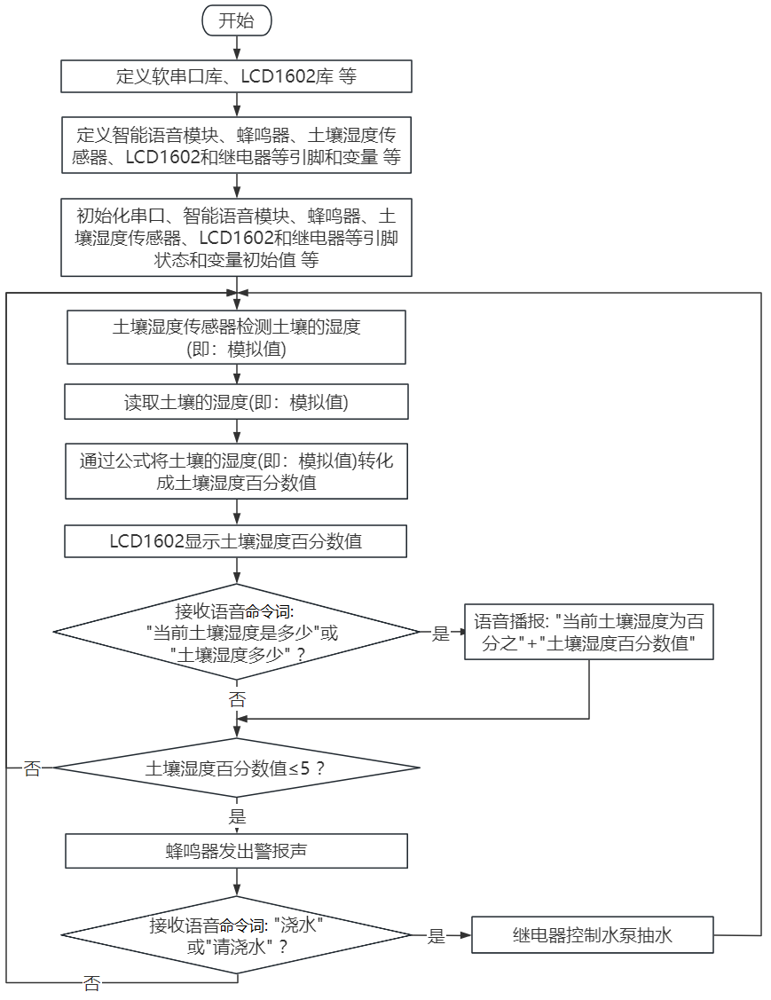
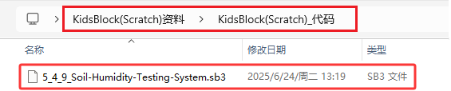
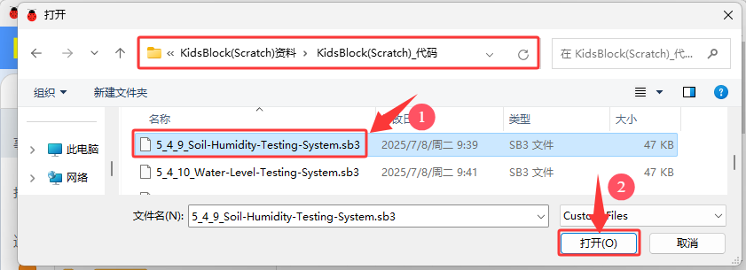
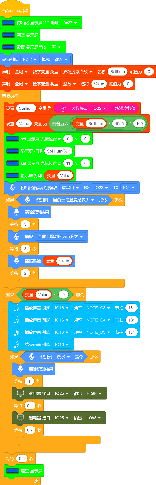

### 5.4.9 土壤湿度监测系统

***请注意，使用设备时不要让水从水池和土壤池中溢出。如果水洒到其他传感器上，会导致短路，影响设备正常工作。另外，如果水洒到电池上，会导致发热和爆炸等危险。因此，请在使用设备时格外小心，尤其是幼儿使用时一定要在家长的监护下进行。为确保设备的安全运行，请遵循相关使用指南和安全规范。***

#### 5.4.9.1 简介

本课程介绍如何使用ESP32开发板、土壤湿度传感器、智能语音模块、无源蜂鸣器、继电器、水泵和LCD1602模块，构建一个智能土壤湿度检测系统。

该系统能够通过LCD1602显示屏实时显示土壤湿度传感器检测的土壤湿度百分数值，当土壤湿度百分数低于设定的阈值时，蜂鸣器会响起警报声，提示该浇灌土地了。同时对着智能语音模块发出类似于“当前土壤湿度是多少”等命令词时，智能语音模块接收到相应命令词后语音播报当前土壤湿度百分数值。这个应用场景是一个非常实用的解决方案，可以帮助农场主人监测和控制农场的土地湿度，提高农业生产效率。

使用LCD1602显示屏，实时显示土壤湿度传感器的值，当湿度低于设定的阈值，蜂鸣器会响起警报声，提示该浇灌土地了。

#### 5.4.9.2 接线图

- **土壤湿度传感器的S引脚连接到io32**

- **无源蜂鸣器的S引脚连接到io16**

- **智能语音模块的TXD引脚连接到io5，RXD引脚连接到io23**
 
- **LCD1602模块连接到 BUS I2C(SDA连接(SDA:IO21)、SCL连接(SCL:IO22)**

- **继电器模块的S引脚连接到io25；继电器的NO端，连接到ESP32主板上的3V3引脚**

- **水泵：**
  - **红色线连接到继电器的COM端，如图所示**
  - **黑色线连接到ESP32主板上的GND引脚，如图所示**
 
⚠️ **特别注意：智慧农场已经组装好了，这里不需要把土壤湿度传感器、无源蜂鸣器、LCD1602模块、继电器、水泵和智能语音模块拆下来又重新组装和接线，这里再次提供接线图，是为了方便您编写代码！**

#### 5.4.9.3 代码流程图

#### 5.4.9.4 实验代码

代码文件在`KidsBlock(Scratch)_代码`文件夹中，代码文件为`5_4_9_Soil-Humidity-Testing-System.sb3`，如下图所示：

单击 “**文件**” --> “**从电脑中上传**”，然后选择保存代码的路径，选中代码文件打开即可，如下图所示：

**组合代码块**

**注意：代码中的条件阈值可以根据实际情况自行设置。**

#### 5.4.9.5 实验结果

按照接线图接好线，外接电源，选择好正确的开发板板型（ESP32 Dev Module）和 适当的串口端口（COMxx），然后单击按钮上传代码。上传代码成功后，将土壤湿度传感器的检测区插入土壤中，LCD1602模块显示屏实时显示土壤湿度百分数信息。

对着智能语音模块上的麦克风，使用唤醒词 “你好，小智” 或 “小智小智” 来唤醒智能语音模块，同时喇叭播放回复语 “有什么可以帮到您”；

智能语音模块唤醒后，对着麦克风说：“当前土壤湿度是多少” 或 “土壤湿度多少” 等命令词时，接着语音播报 “正在为您读取土壤湿度” + “当前土壤湿度为百分之” + “土壤湿度传感器模拟值通过计算转化成的土壤湿度百分数值”；

当土壤湿度传感器检测到的土壤湿度百分数低于设定的阈值时，蜂鸣器会发出警报声，唤醒智能语音模块，对着麦克风说：“浇水” 或 “请浇水” 等命令词时，喇叭播放对应的回复语 “已开始浇水”，同时继电器控制水泵抽水。

