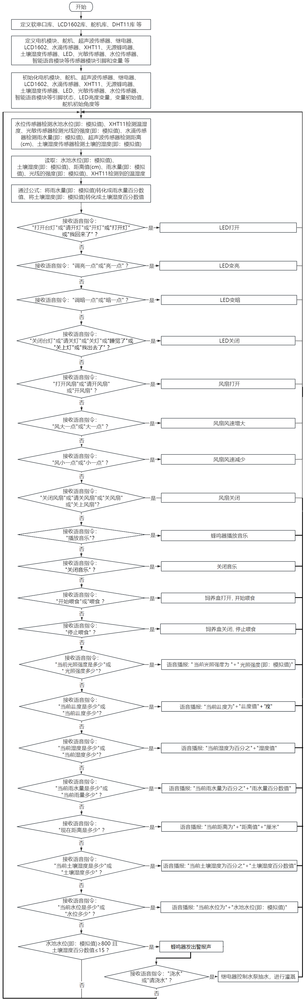

### 4.4.12 语音控制智能农场系统

⚠️ **请注意：** 使用设备时不要让水从水池和土壤池中溢出。如果水洒到其他传感器上，会导致短路，影响设备正常工作。另外，如果水洒到电池上，会导致发热和爆炸等危险。因此，请在使用设备时格外小心，尤其是幼儿使用时一定要在家长的监护下进行。为确保设备的安全运行，请遵循相关使用指南和安全规范。

#### 4.4.12.1 简介

经过前面一系列的语音控制项目的学习，我们是不是可以通过智能语音模块控制智能农场的所有传感器模块呢？当然是可以的。在本项目实验中，通过ESP32主控板控制所有传感器模块，然后通过智能语音模块进行实时语音播报智能农场的温湿度、水池水位、土壤湿度、光照强度、距离和雨水量等。同时，它还能控制LED灯进行照明，控制水泵进行灌溉，控制饲料盒进行喂养，控制电机模块调整农场的温湿度和音乐播放等。

#### 4.4.12.2 接线图

⚠️ **特别注意：智慧农场已经组装好了，这里不需要把所有的传感器和模块都拆下来又重新组装和接线。由于传感器和模块较多，接线图中的接线复杂会导致传感器和模块的引脚接线看不清，所以使用表格来表示传感器和模块的引脚连接到ESP32主控板上的对应引脚，也是为了方便您编写代码！**

| 编号 |      传感器模块        |      ESP32主板 S 引脚       |  ESP32主板 V 引脚 |  ESP32主板 G 引脚 |
| :--: | :------------------:  | :------------------------: |:---------------: |:---------------: |
|  1   |         风扇          |    io18(IN-) \| io19(IN+)     |        V         |         G        |
|  2   |      超声波传感器      |    io12(TRIG) \| io13(ECHO)    |        V         |         G        |
|  3   |      LCD1602模块      |  I2C（SDA(io21) \| SCL(io22)） |        V         |         G        |
|  4   |   XHT11温湿度传感器    |            io17             |        V         |         G        |
|  5   |      水滴传感器        |            io35             |        V         |         G        |
|  6   |      光敏传感器        |            io34             |        V         |         G        |
|  7   |        舵 机           |            io26             |        V         |         G        |
|  8   |      无源蜂鸣器        |            io16             |        V          |         G        |
|  9   |       LED模块          |            io27             |        V         |          G       |
|  10  |      水位传感器        |            io33             |        V         |          G        |
|  11  |     土壤湿度传感器     |            io32             |        V         |          G        |
|  12  |      继电器水泵        |            io25             |        V         |          G        |

#### 4.4.12.3 代码流程图

#### 4.4.12.4 实验代码

代码文件在`KidsBlock(Scratch)_代码`文件夹中，代码文件为`5_4_12_Voice-Controll-Smart-Farm.sb3`，如下图所示：

单击 “**文件**” --> “**从电脑中上传**”，然后选择保存代码的路径，选中代码文件打开即可，如下图所示：

**组合代码块**

⚠️ **注意：代码中的条件阈值可以根据实际情况自行设置。**

#### 4.4.12.5 实验结果

按照接线图接好线，外接电源，选择好正确的开发板板型（ESP32 Dev Module）和 适当的串口端口（COMxx），然后单击按钮上传代码。上传代码成功。将土壤湿度传感器的检测区插入土壤中，将水位湿度传感器的水位检测区插入水中，用湿润的手摸一下水滴传感器的检测区，LCD1602模块显示屏显示“Voice Controll Smart Farm”。

对着智能语音模块上的麦克风，使用唤醒词 “你好，小智” 或 “小智小智” 来唤醒智能语音模块，同时喇叭播放回复语 “有什么可以帮到您”；

智能语音模块唤醒后，对着麦克风说：“打开台灯” 或 “请开灯” 或 “开灯” 或 “打开灯” 或 “我回来了” 等命令词时，喇叭播放对应的回复语 “已为您打开照明”，同时LED点亮；

对着麦克风说：“调亮一点” 或 “亮一点” 等命令词时，喇叭播放对应的回复语 “灯光已调亮”，同时LED变亮；

对着麦克风说：“调暗一点” 或 “暗一点” 等命令词时，喇叭播放对应的回复语 “灯光已调暗”，同时LED变暗；

对着麦克风说：“关闭台灯” 或 “请关灯” 或 “关灯” 或 “睡觉了” 或 “关上灯” 或 “我出去了”等命令词时，喇叭播放对应的回复语 “已为您关闭照明”，同时LED熄灭；

对着麦克风说：“打开风扇” 或 “请开风扇” 或 “开风扇” 等命令词时，喇叭播放对应的回复语 “已为您打开风扇”，同时风扇转动；

对着麦克风说：“风大一点” 或 “大一点” 等命令词时，喇叭播放对应的回复语 “风速已增加”，同时风扇转速加快；

对着麦克风说 “风小一点” 或 “小一点” 等命令词时，喇叭播放对应的回复语 “风速已减弱”，同时风扇转速减慢；

对着麦克风说：“关闭风扇” 或 “请关风扇” 或 “关风扇” 或 “关上风扇” 等命令词时，喇叭播放对应的回复语 “已为您关闭风扇”，同时风扇不转；

对着麦克风说 “播放音乐” 等命令词时，喇叭播放对应的回复语 “已为您播放音乐”，同时蜂鸣器播放音乐；

对着麦克风说：“关闭音乐” 等命令词时，喇叭播放对应的回复语 “已为您关闭音乐”，同时蜂鸣器不响；

对着麦克风说 “开始喂食” 或 “喂食” 等命令词时，喇叭播放对应的回复语 “已开始喂食”，同时饲养盒打开；

对着麦克风说：“停止喂食” 等命令词时，喇叭播放对应的回复语 “已为您停止喂食”，同时饲养盒关闭；

对着麦克风说：“当前温度是多少” 或 “当前温度多少” 等命令词时，接着语音播报 “正在为您读取温度” + “当前温度为” + “XHT11温湿度传感器检测到的温度值” + “度”；

对着麦克风说：“当前湿度是多少” 或 “当前湿度多少” 等命令词时，接着语音播报 “正在为您读取湿度” + “当前湿度为百分之” + “XHT11温湿度传感器检测到的湿度值”；

对着麦克风说：“当前光照强度是多少” 或 “光照强度多少” 等命令词时，接着语音播报 “正在为您读取光照强度” + “当前光照强度为” + “光敏传感器检测的光线强度模拟值” ；

对着麦克风说：“当前雨水量是多少” 或 “当前雨量多少” 等命令词时，接着语音播报 “正在为您读取当前雨水量” + “当前雨水量为百分之” + “水滴传感器模拟值通过计算转化成的雨水量百分数值”；

对着麦克风说：“现在距离是多少” 等命令词时，接着语音播报 “正在为您读取距离” + “当前距离为” + “超声波传感器检测到的距离数值”  + “厘米”；

对着麦克风说：“当前土壤湿度是多少” 或 “土壤湿度多少” 等命令词时，接着语音播报 “正在为您读取土壤湿度” + “当前土壤湿度为百分之” + “土壤湿度传感器模拟值通过计算转化成的土壤湿度百分数值”；

对着麦克风说：“当前水位是多少” 或 “水位多少” 等命令词时，接着语音播报 “正在为您读入水位” + “当前水位为” + “水位传感器检测到的水位模拟值”；

当土壤湿度传感器检测到的土壤湿度百分数值低于设定的阈值且水位传感器检测到的水池水位模拟值高于设定的阈值时，蜂鸣器鸣叫，起到提示效果，说明需要灌溉；唤醒智能语音模块，对着麦克风说：“浇水” 或 “请浇水” 等命令词时，喇叭播放对应的回复语 “已开始浇水”，同时打开继电器控制水泵抽水。