### 5.5.1 WIFI网页显示字符串

#### 5.5.1.1 简介

ESP32开发板它带有内置的Wi-Fi（2.4G）和Bluetooth（4.2）功能，可以轻松连接到Wi-Fi网络并与网络中的其他设备进行通信，您可以使用ESP32在浏览器中显示网页，此时网页显示 “Hello, Keyes!” 等。

#### 5.5.1.2 工作原理

ESP32 最有用的功能之一是它不仅能够连接到现有的 WiFi 网络并充当 Web 服务器，还可以创建自己的网络，允许其他设备直接连接到它并访问网页。这是因为ESP32可以在三种模式下运行：Station（STA）模式、Soft Access Point（AP）模式和Station+AP共存模式。

- Station模式（作为WiFi设备主动连接路由器，也叫做WiFi Client）。
- AP模式（作为一个Access Point，让其他WiFi设备来连接）即WiFi热点。
- Station+AP共存模式（ESP32连接路由器的同时自身也是一个热点供其他WiFi设备来连接）。

所有WiFi编程项目在使用WiFi前必须配置WiFi运行模式，否则无法使用WiFi。在本实验课程中，我们将学习使用ESP32的WiFi Station模式。

在 Station 模式下，ESP32 连接到现有的 WiFi 网络（由无线路由器创建的网络）。

当ESP32选择Station模式时，它作为一个WiFi客户端。它可以连接路由器网络，通过WiFi连接与路由器上的其他设备通信。如下图所示，移动通信设备(智能手机/平板)、PC和路由器已经连接，ESP32如果要与移动通信设备和PC通信，需要将移动通信设备、PC和路由器连接起来。

在 Station 模式下，ESP32 从其连接的无线路由器获取 IP 地址。使用此 IP 地址，它可以设置 Web 服务器并向现有 WiFi 网络上的所有连接设备提供网页。

⚠️ **注意：** 这样只能工作再一个局域网内，也就是说如果你的控制端与开发板连接的wifi不一致那么将无法进入Web服务器的控制页面。

更多wifi参考，请移步到乐鑫官方文档：[https://docs.espressif.com/projects/esp-idf/en/latest/esp32/api-reference/network/esp_wifi.html](https://docs.espressif.com/projects/esp-idf/en/latest/esp32/api-reference/network/esp_wifi.html)

乐鑫官网：[https://www.espressif.com.cn/en/home](https://www.espressif.com.cn/en/home)

#### 5.5.1.3 接线图

#### 5.5.1.4 实验代码

代码文件在`KidsBlock(Scratch)_代码`文件夹中，代码文件为`5_5_1_WiFi-HTML-String.sb3`，如下图所示：

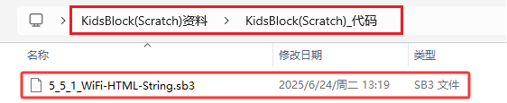

单击 “**文件**” --> “**从电脑中上传**”，然后选择保存代码的路径，选中代码文件打开即可，如下图所示：

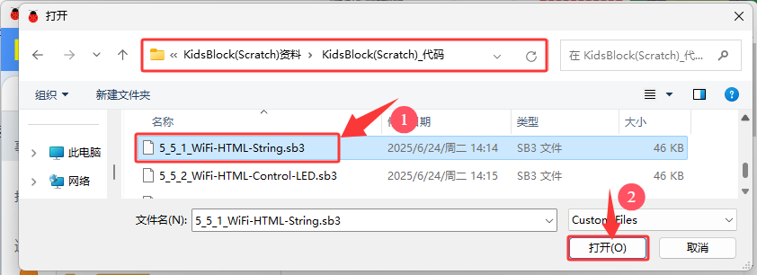

⚠️ **特别提醒：** 打开代码文件后，需要修改ESP32开发板需要连接的WiFi名称与密码，您需要分别将 `REPLACE_WITH_YOUR_SSID` 和 `REPLACE_WITH_YOUR_PASSWORD` 替换为您自己的 Wi-Fi 名称和 WiFi 密码。WiFi名称和WiFi密码修改后才能上传代码，否则你的ESP32开发板将无法连接网络。

⚠️ **注意：** 请确保代码中的WiFi名称和WiFi密码与连接到您的电脑、手机/平板、ESP32开发板和路由器的网络相同，它们必须在同一局域网（WiFi）内。

⚠️ **注意：** WiFi必须是2.4Ghz频率的，否则ESP32无法连接WiFi。

**认识代码块**

① 这个代码块，表示当启动ESP32这块开发板时，将运行代码。

② 设置串口。

设置串口波特率，一般波特率设置为`9600`或`115200`。

串口输出数据，从串行端口输出数据，分换行与不换行两种方式。

③ 这是一些 I2C LCD 1602显示屏的相关代码块

初始化LCD显示屏的地址。

设置LCD显示屏的光标位置。

LCD显示屏显示的内容。

LCD显示屏清屏。

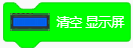

打开/关闭LCD显示屏的背光。

设置LCD显示屏显示/隐藏光标，闪烁/不闪烁样式。

④ 这是一些关于WiFi的代码块。

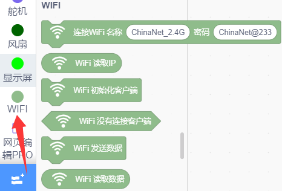

输入WiFi名称和密码，连接WiFi热点。

读取WiFi的IP地址。

WiFi初始化客户端。

WiFi没有连接客户端。

WiFi发送数据。

WiFi读取数据。

⑤ 这是一些关于网页编辑PRO代码块。

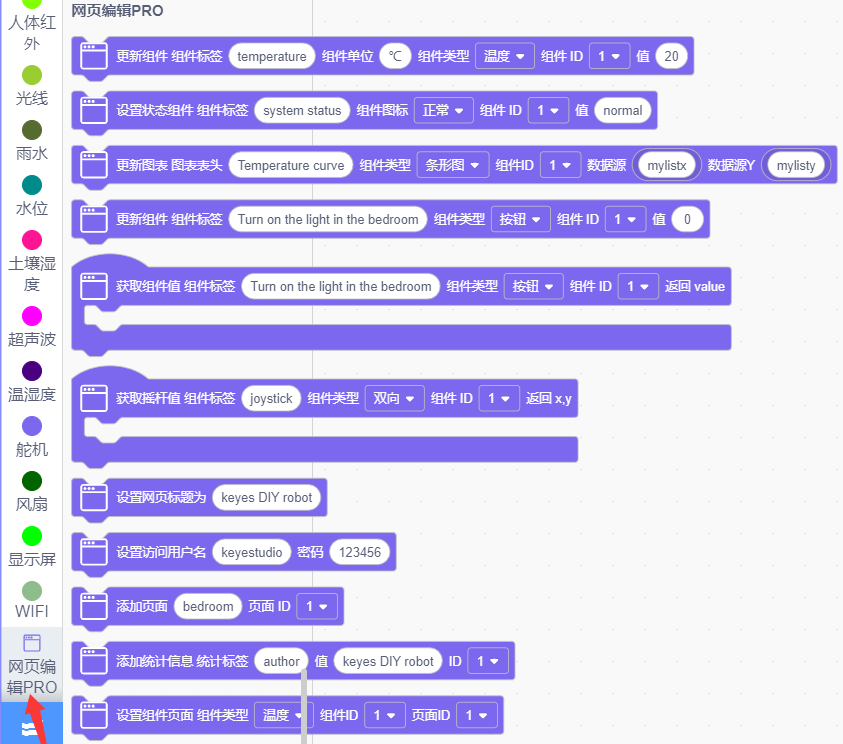

更新组件，其组件标签、组件单位、组件类型、组件ID和值一一对应。

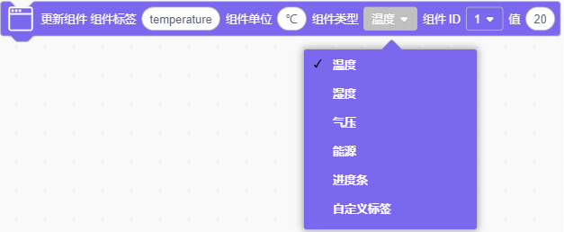

显示部件包括：温度、湿度、气压、电量、进度条、自定义标签。

温度、湿度、气压、电量除了图标和单位不同，其它性质都相同，只是用于显示数据。

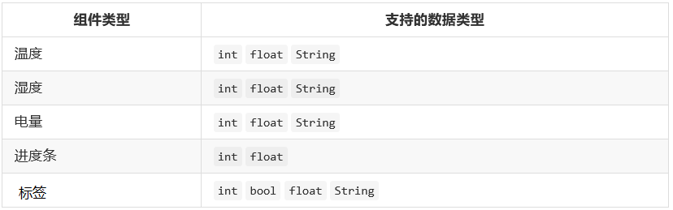

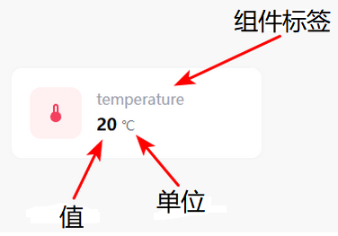

**注：** 同一种组件可以有很多个，当不同的ID号时会显示多个相同类型的组件！

设置状态组件组件标签、组件图标、组件ID和值一一对应。

更新图表表头，其组件类型、条形、组件ID、数据源和数据源Y一一对应。

更新组件，其组件标签、组件类型、组件ID和值一一对应。

获取组件值，其组件标签、组件类型和组件ID一一对应。

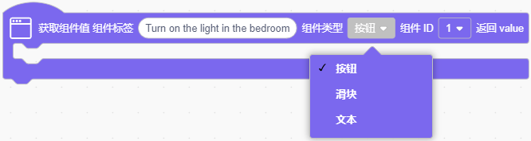

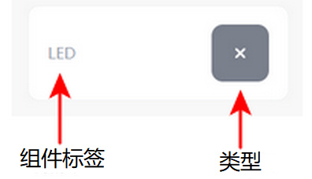

获取摇杆值，其组件标签、组件类型、组件ID和返回x,y一一对应。

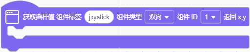

设置网页标题。

设置访问用户名和密码。

添加页面和页面ID。

添加统计信息，其统计标签、值和ID一一对应。

设置组件页面，其组件类型、组件ID和页面ID一一对应。

**组合代码块**

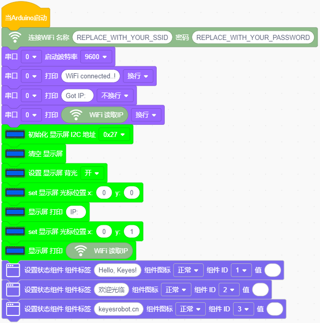

#### 5.5.1.5 实验结果

按照接线图接好线，外接电源，选择好正确的开发板板型（ESP32 Dev Module）和 适当的串口端口（COMxx），然后单击按钮上传代码，外接电源。

⚠️ **注意：手机/平板和电脑一定要与ESP32开发板连接的是同一个WiFi，否则将无法进入控制页面，还有就是ESP32开发板在使用WiFi功能时功耗很大需要外接DC电源才能满足它的工作电力需求，如果达不到它的工作电力需求ESP32板将会一直复位导致代码无法正常运行。**

上传代码成功后，单击KidsBlock IDE右下角的设置串口波特率为`9600`，即可通过串口打印窗口查看显示连接成功后的IP地址(如果看不到可以按复位按键重新连接一次)，同时LCD显示屏也会显示IP地址。  

然后，您可以在浏览器输入串口监视器打印的 ESP32 IP地址 或LCD显示屏显示的 ESP32 IP地址，使用浏览器打开ESP32的IP地址，并访问网页。在本例中，您可以在浏览器中输入你自己的**ESP32 IP地址**（**这里是以192.168.36.189为例，而你需要将IP地址：192.168.36.189 修改成你自己的 ESP32 IP地址**），在浏览器中打开ESP32的IP地址来查看 “Hello, Keyes!” 等 网页。

⚠️ **注意：当电脑、手机/平板和ESP32开发板，连接到同一个网络(WiFi)时，可在手机端/平板端打开这个网页。此处是你自己ESP32的IP地址**。

在手机端/平板端的浏览器中打开对应的IP地址，即可查看到对应的字符串。

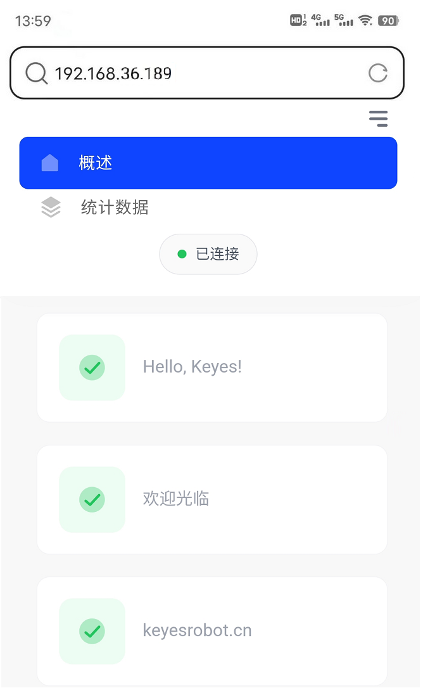

#### 5.5.1.6 代码说明

（1）. 首先连接到WiFi热点，输入自己的WiFi热点名称和密码，然后ESP32连接到WiFi，串口打印分配到的IP地址，同时LCD显示屏也显示分配到的IP地址。

（2）. 创建一个网页，并且在网页中添加一个名称为 Hello, Keyes! 的组件标签。

