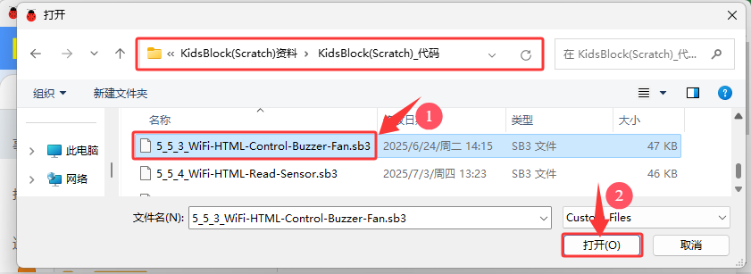
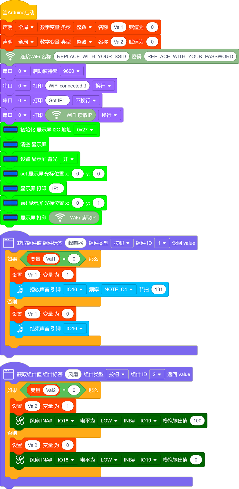
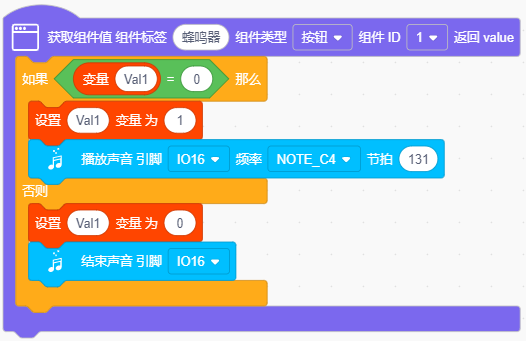
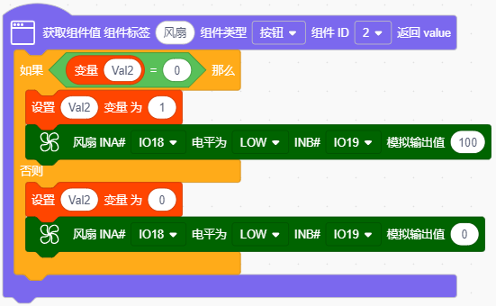

### 5.5.3 WiFi控制蜂鸣器和风扇

#### 5.5.3.1 简介

本教程将为您详细介绍如何使用ESP32微控制器通过局域网WiFi控制蜂鸣器和风扇。教程内容包括ESP32的WiFi功能配置、电路连接方法以及如何编写代码实现远程控制。您将学习如何设置ESP32为WiFi接入点（AP）或连接到现有WiFi网络，并通过网页界面发送控制指令来开关蜂鸣器和风扇。无论您是物联网初学者还是有经验的开发者，本教程都将帮助您掌握ESP32的WiFi控制功能，为您的项目增添灵活的远程控制能力。

#### 5.5.3.2 工作原理

让我们假设ESP32的lP地址是192.168.XX.XX。以下是它的工作原理：

当你在Web浏览器的搜索框中输入192.168.XX.XX，搜索并且跳转网页。浏览器向Esp32发送请求，ESP32响应一个网页，其中包含用于控制蜂鸣器的打开/关闭按钮和风扇的打开/关闭按钮。

当你点击网页上蜂鸣器的 “X” 按钮时，蜂鸣器鸣叫并响应控制网页；当你点击网页上蜂鸣器的 “√” 按钮时，蜂鸣器不响并响应控制网页。

同样，当你点击网页上风扇的 “X” 按钮时，风扇转动并响应控制网页；当你点击网页上风扇的 “√” 按钮时，风扇不转并响应控制网页。

#### 5.5.3.3 接线图

- **无源蜂鸣器模块的S引脚连接到io16**

- **电机模块的IN-引脚连接到io18，IN+引脚连接到io19**

⚠️ **特别注意：智慧农场已经组装好了，这里不需要把无源蜂鸣器模块和电机模块拆下来又重新组装和接线，这里再次提供接线图，是为了方便您编写代码！**

#### 5.5.3.4 实验代码

代码文件在`KidsBlock(Scratch)_代码`文件夹中，代码文件为`5_5_3_WiFi-HTML-Control-Buzzer-Fan.sb3`，如下图所示：

单击 “**文件**” --> “**从电脑中上传**”，然后选择保存代码的路径，选中代码文件打开即可，如下图所示：

⚠️ **特别提醒：** 打开代码文件后，需要修改ESP32开发板需要连接的WiFi名称与密码，您需要分别将 `REPLACE_WITH_YOUR_SSID` 和 `REPLACE_WITH_YOUR_PASSWORD` 替换为您自己的 Wi-Fi 名称和 WiFi 密码。WiFi名称和WiFi密码修改后才能上传代码，否则你的ESP32开发板将无法连接网络。

⚠️ **注意：** 请确保代码中的WiFi名称和WiFi密码与连接到您的电脑、手机/平板、ESP32开发板和路由器的网络相同，它们必须在同一局域网（WiFi）内。

⚠️ **注意：** WiFi必须是2.4Ghz频率的，否则ESP32无法连接WiFi。

**认识代码块**

⚠️**特别提醒：** 本实验代码中用到的一些新代码块在 **5.5.1 WIFI网页显示字符串** 项目中的 **认识代码块** 部分有讲解到，这里就不重复。有什么不清楚的，可以跳到 **5.5.1 WIFI网页显示字符串** 项目中的 **认识代码块** 部分去了解。

**组合代码块**

#### 5.5.3.5 实验结果

按照接线图接好线，外接电源，选择好正确的开发板板型（ESP32 Dev Module）和 适当的串口端口（COMxx），然后单击按钮上传代码，外接电源。

⚠️ **注意：手机/平板和电脑一定要与ESP32开发板连接的是同一个WiFi，否则将无法进入控制页面，还有就是ESP32开发板在使用WiFi功能时功耗很大需要外接DC电源才能满足它的工作电力需求，如果达不到它的工作电力需求ESP32板将会一直复位导致代码无法正常运行。**

上传代码成功后，单击KidsBlock IDE右下角的设置串口波特率为`9600`，即可通过串口打印窗口查看显示连接成功后的IP地址(如果看不到可以按复位按键重新连接一次)，同时LCD显示屏也会显示IP地址。  

然后，您可以在浏览器输入串口监视器打印的 ESP32 IP地址 或LCD显示屏显示的 ESP32 IP地址，使用浏览器打开ESP32的IP地址，并访问网页。在本例中，您可以在浏览器中输入你自己的**ESP32 IP地址**（**这里是以192.168.36.189为例，而你需要将IP地址：192.168.36.189 修改成你自己的 ESP32 IP地址**），在浏览器中打开ESP32的IP地址来查看控制蜂鸣器和风扇的网页。

⚠️ **注意：当电脑、手机/平板和ESP32开发板，连接到同一个网络(WiFi)时，可在手机端/平板端打开这个网页。此处是你自己ESP32的IP地址**。

在手机端/平板端的浏览器中打开对应的IP地址，即可控制蜂鸣器和风扇等功能。

#### 5.5.3.6 代码解释

(1). 在网页中添加一个名称为 **蜂鸣器** 的按钮组件标签，设置为 “按钮” 类型。按一下按钮，蜂鸣器鸣叫，再次按一下按钮，蜂鸣器不响。

(2). 在网页中添加一个名称为 **风扇** 的按钮组件标签，设置为 “按钮” 类型。按一下按钮，风扇转动，再次按一下按钮，风扇不转。

