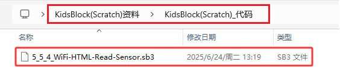
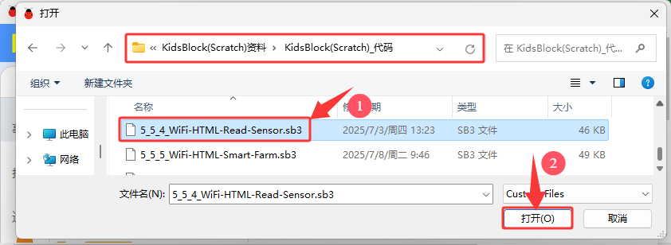
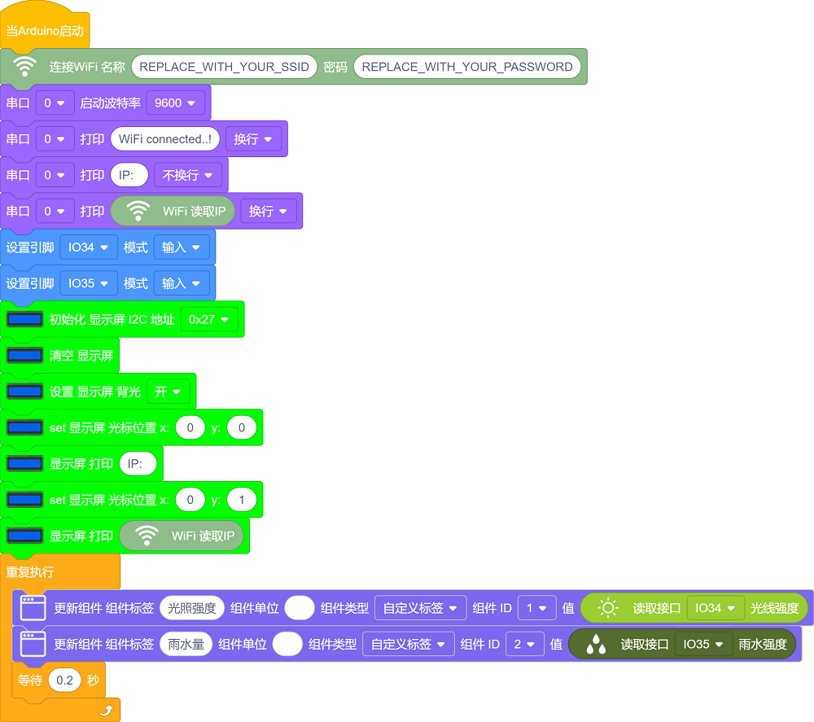
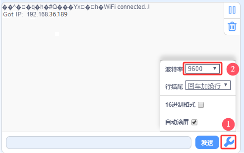
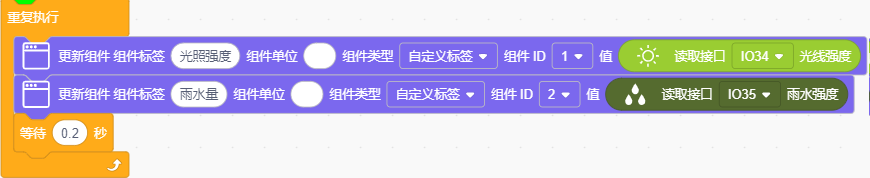
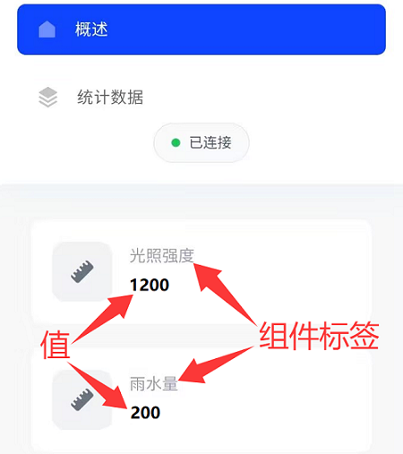

### 5.5.4 WiFi读取传感器

#### 5.5.4.1 简介

本教程将为您详细介绍如何使用ESP32微控制器通过局域网WiFi读取光敏传感器和水滴传感器的数据，并在网页上实时显示。您将学习如何设置ESP32为WiFi接入点（AP）或连接到现有WiFi网络，并通过网页界面实时显示光照强度值和水量值。此外，教程还涵盖了网络通信协议、数据可视化和系统优化的基本方法。无论您是物联网初学者还是有经验的开发者，本教程都将帮助您掌握ESP32的WiFi数据采集和网页显示功能，为您的项目增添实时的环境监测能力。

#### 5.5.4.2 工作原理

- ESP32 通过 `WiFi.begin()` 连接到局域网。

- 获取本地 IP 地址，用于客户端访问。

- ESP32 使用 `WiFiServer` 创建一个 HTTP 服务器。

- 当客户端（如浏览器）访问 ESP32 的 IP 地址时，ESP32 会生成一个 HTML 页面，并将传感器数据嵌入到页面中。

- 网页通过 HTML 和 CSS 显示传感器数据。

- 使用 JavaScript 定时刷新页面或通过 AJAX 请求实时更新数据。

#### 5.5.4.3 接线图

- **光敏传感器的S引脚连接到io34**

- **水滴传感器的S引脚连接到io35**

⚠️ **特别注意：智慧农场已经组装好了，这里不需要把光敏传感器和水滴传感器拆下来又重新组装和接线，这里再次提供接线图，是为了方便您编写代码！**

#### 5.5.4.4 代码流程图

#### 5.5.4.5 实验代码

代码文件在`KidsBlock(Scratch)_代码`文件夹中，代码文件为`5_5_4_WiFi-HTML-Read-Sensor.sb3`，如下图所示：

单击 “**文件**” --> “**从电脑中上传**”，然后选择保存代码的路径，选中代码文件打开即可，如下图所示：

⚠️ **特别提醒：** 打开代码文件后，需要修改ESP32开发板需要连接的WiFi名称与密码，您需要分别将 `REPLACE_WITH_YOUR_SSID` 和 `REPLACE_WITH_YOUR_PASSWORD` 替换为您自己的 Wi-Fi 名称和 WiFi 密码。WiFi名称和WiFi密码修改后才能上传代码，否则你的ESP32开发板将无法连接网络。

⚠️ **注意：** 请确保代码中的WiFi名称和WiFi密码与连接到您的电脑、手机/平板、ESP32开发板和路由器的网络相同，它们必须在同一局域网（WiFi）内。

⚠️ **注意：** WiFi必须是2.4Ghz频率的，否则ESP32无法连接WiFi。

**认识代码块**

⚠️ **特别提醒：** 本实验代码中用到的一些新代码块在 **5.5.1 WIFI网页显示字符串** 项目中的 **认识代码块** 部分有讲解到，这里就不重复。有什么不清楚的，可以跳到 **5.5.1 WIFI网页显示字符串** 项目中的 **认识代码块** 部分去了解。

**组合代码块**

#### 5.5.4.6 实验结果

按照接线图接好线，外接电源，选择好正确的开发板板型（ESP32 Dev Module）和 适当的串口端口（COMxx），然后单击按钮上传代码，外接电源。

⚠️ **注意：手机/平板和电脑一定要与ESP32开发板连接的是同一个WiFi，否则将无法进入控制页面，还有就是ESP32开发板在使用WiFi功能时功耗很大需要外接DC电源才能满足它的工作电力需求，如果达不到它的工作电力需求ESP32板将会一直复位导致代码无法正常运行。**

上传代码成功后，单击KidsBlock IDE右下角的设置串口波特率为`9600`，即可通过串口打印窗口查看显示连接成功后的IP地址(如果看不到可以按复位按键重新连接一次)，同时LCD显示屏也会显示IP地址。  

然后，您可以在浏览器输入串口监视器打印的 ESP32 IP地址 或LCD显示屏显示的 ESP32 IP地址，使用浏览器打开ESP32的IP地址，并访问网页。在本例中，您可以在浏览器中输入你自己的**ESP32 IP地址**(**这里是以192.168.36.189为例，而你需要将IP地址：192.168.36.189 修改成你自己的 ESP32 IP地址**)，在浏览器中打开ESP32的IP地址来查看光敏传感器检测的光线强度和水滴传感器检测的雨水量网页。

⚠️ **注意：当电脑、手机/平板和ESP32开发板，连接到同一个网络(WiFi)时，可在手机端/平板端打开这个网页。此处是你自己ESP32的IP地址**。

在手机端/平板端的浏览器中打开对应的IP地址，即可查看到对应传感器的数据等功能。

#### 5.5.4.7 代码解释

(1). 在网页中添加一个名称为 **光照强度** 的组件标签，用于实时显示光敏传感器检测到的光线强度模拟值；添加一个名称为 **雨水量** 的组件标签，用于实时显示水滴传感器检测到的雨水量模拟值。

