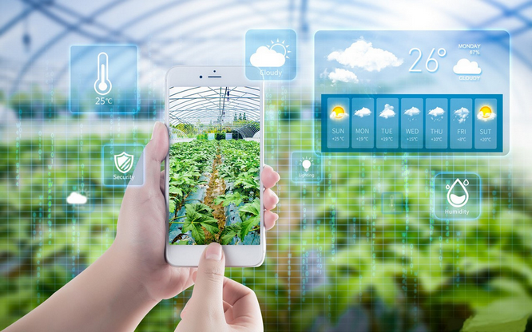
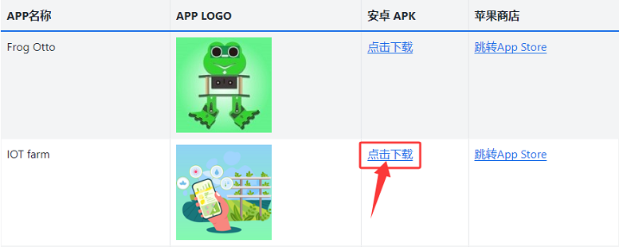
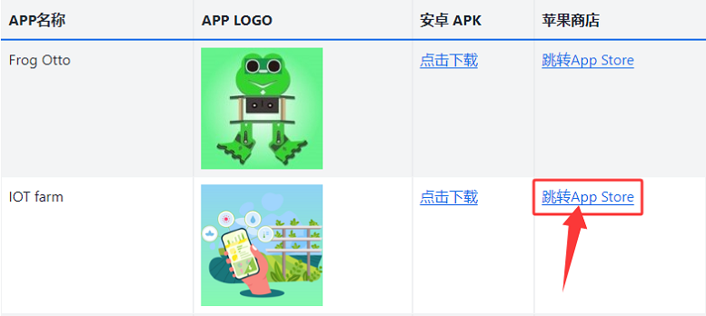
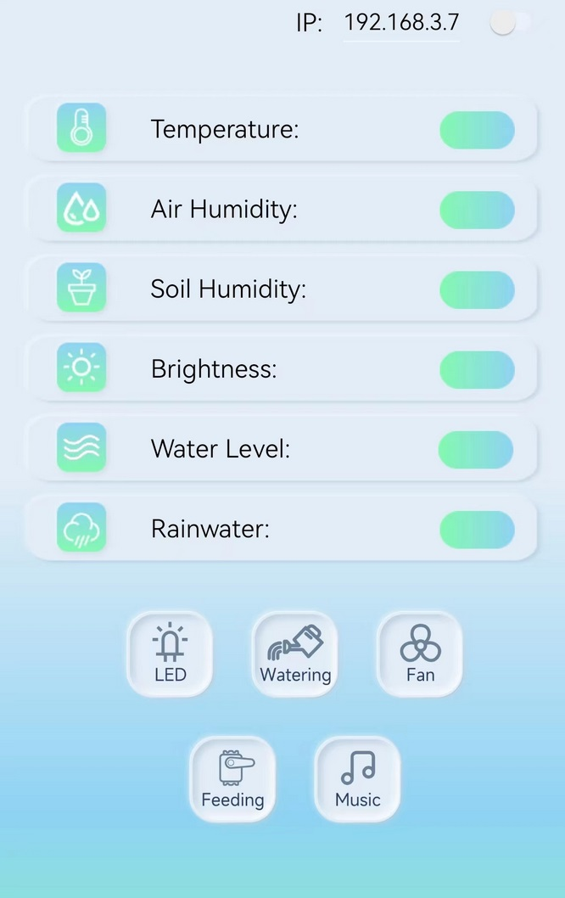
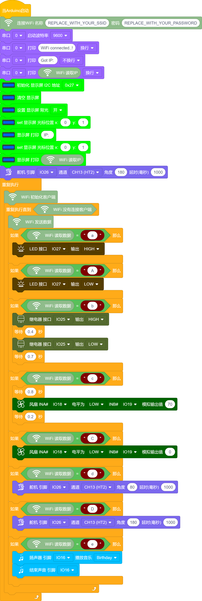
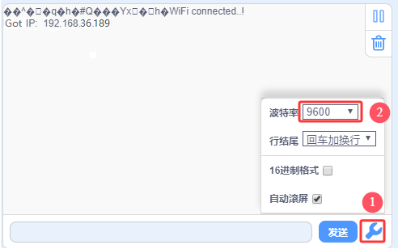

### 5.5.6 APP控制:智慧农场管理系统

⚠️ **请注意：** 使用设备时不要让水从水池和土壤池中溢出。如果水洒到其他传感器上，会导致短路，影响设备正常工作。另外，如果水洒到电池上，会导致发热和爆炸等危险。因此，请在使用设备时格外小心，尤其是幼儿使用时一定要在家长的监护下进行。为确保设备的安全运行，请遵循相关使用指南和安全规范。

#### 5.5.6.1 简介

APP智慧农场管理系统可以实时监测农场的温湿度、水池水位、土壤湿度、光照强度和雨量。同时，它还能控制LED灯进行照明，控制水泵进行灌溉，控制饲料盒进行喂养，控制风扇模拟调整农场的温湿度和音乐播放。

可以使用手机上的APP实现这些操作，从而方便快捷地管理农场。此外，该系统还可以使用蜂鸣器播放声音，实现更加智能化的管理。

#### 5.5.6.2 APP下载与安装

⚠️ **特别提醒：如果已经在手机/平板上安装好了APP，则这一步骤可以直接跳过；否则，需要参照以下步骤在手机/平板上来安装APP。**

**1. 安卓系统(Android)：**

A. 进入链接：[https://www.keyesrobot.cn/zh-cn/latest/docs/APP.html](https://www.keyesrobot.cn/zh-cn/latest/docs/APP.html)，找到 “IOT farm” 所在行，点击对应的 “**点击下载**” 按钮，即可下载 “**IOT farm.apk**” 文件。

B. 将 “**IOT farm.apk**” 文件通过USB数据线转移到手机/平板上。

C. 然后再参照提示安装 Android APP 即可。

**2. 苹果系统(IOS)：**

A. 进入链接：[https://www.keyesrobot.cn/zh-cn/latest/docs/APP.html](https://www.keyesrobot.cn/zh-cn/latest/docs/APP.html)，找到 “IOT farm” 所在行，点击对应的 “跳转APP Store” 按钮进入苹果商店。

B. 出现下载界面，点击  下载即可。

C. 然后再参照提示安装 iOS APP 即可。

**3. APP界面：**

**4. APP功能介绍：**

打开APP，APP上有温度、湿度、土壤湿度、光线强度、水池水位和雨水量等设备，可以显示对应的传感器数据；还有LED灯、风扇、饲料盒、抽水泵和音乐等设备，可以控制对应的功能。

A. 当手机/平板、电脑和ESP32开发板连接到同一个路由器下的相同WIFI时，在APP的右上方输入ESP32的IP地址，向右拨动灰色按钮，即可连接。

B. 显示农场的实时温度。

C. 显示农场的实时湿度。

D. 显示土壤的实时湿度。

E. 显示太阳光照强度。

F. 显示水池的水位。

G. 显示农场下雨量。

H. 控制LED。

I. 控制水泵进行灌溉。

J. 控制风扇调节温度。

K. 控制舵机，开关饲料盒。

O. 控制蜂鸣器，播放音乐。

#### 5.5.6.3 接线图

⚠️ **特别注意：智慧农场已经组装好了，这里不需要把所有的传感器和模块都拆下来又重新组装和接线。由于传感器和模块较多，接线图中的接线复杂会导致传感器和模块的引脚接线看不清，所以使用表格来表示传感器和模块的引脚连接到ESP32主控板上的对应引脚，也是为了方便您编写代码！**

| 编号 |      传感器模块        |      ESP32主板 S 引脚       |  ESP32主板 V 引脚 |  ESP32主板 G 引脚 |
| :--: | :------------------:  | :------------------------: |:---------------: |:---------------: |
|  1   |         风扇          |    io18(IN-) \| io19(IN+)     |        V         |         G        |
|  2   |      超声波传感器      |    io12(TRIG) \| io13(ECHO)    |        V         |         G        |
|  3   |      LCD1602模块      |  I2C（SDA(io21) \| SCL(io22)） |        V         |         G        |
|  4   |   XHT11温湿度传感器    |            io17             |        V         |         G        |
|  5   |      水滴传感器        |            io35             |        V         |         G        |
|  6   |      光敏传感器        |            io34             |        V         |         G        |
|  7   |        舵 机           |            io26             |        V         |         G        |
|  8   |      无源蜂鸣器        |            io16             |       V          |         G        |
|  9   |       LED模块          |            io27             |        V         |          G       |
|  10  |      水位传感器        |            io33             |        V         |          G        |
|  11  |    土壤湿度传感器      |            io32             |        V         |          G        |
|  12  |      继电器水泵        |            io25              |        V         |          G        |

#### 5.5.6.4 代码流程图

#### 5.5.6.5 实验代码

代码文件在`KidsBlock(Scratch)_代码`文件夹中，代码文件为`5_5_6_WiFi-APP-Smart-Farm.sb3`，如下图所示：

单击 “**文件**” --> “**从电脑中上传**”，然后选择保存代码的路径，选中代码文件打开即可，如下图所示：

⚠️ **特别提醒：** 打开代码文件后，需要修改ESP32开发板需要连接的WiFi名称与密码，您需要分别将 `REPLACE_WITH_YOUR_SSID` 和 `REPLACE_WITH_YOUR_PASSWORD` 替换为您自己的 Wi-Fi 名称和 WiFi 密码。WiFi名称和WiFi密码修改后才能上传代码，否则你的ESP32开发板将无法连接网络。

⚠️ **注意：** 请确保代码中的WiFi名称和WiFi密码与连接到您的计算机、手机/平板电脑、ESP32开发板和路由器的网络相同，它们必须在同一局域网（WiFi）内。

⚠️ **注意：** WiFi必须是2.4Ghz频率的，否则ESP32无法连接WiFi。

**组合代码块**

#### 5.5.6.6 实验结果

按照接线图接好线，外接电源，选择好正确的开发板板型（ESP32 Dev Module）和 适当的串口端口（COMxx），然后单击按钮上传代码，外接电源。

⚠️ **注意：手机/平板和电脑一定要与ESP32开发板连接的是同一个WiFi，否则将无法进入控制页面，还有就是ESP32开发板在使用WiFi功能时功耗很大需要外接DC电源才能满足它的工作电力需求，如果达不到它的工作电力需求ESP32板将会一直复位导致代码无法正常运行。**

上传代码成功后，单击KidsBlock IDE右下角的设置串口波特率为`9600`，即可通过串口打印窗口查看显示连接成功后的IP地址(如果看不到可以按复位按键重新连接一次)，同时LCD显示屏也会显示IP地址。  

⚠️ **注意：当电脑、手机/平板和ESP32开发板，连接到同一个网络(WiFi)时，可在手机/平板端同时打开这个网页。此处是你自己ESP32的IP地址**。

**接下来开始操作APP：**

打开APP，APP上有温度、湿度、土壤湿度、光线强度、水池水位和雨水量等设备，可以显示对应的传感器数据；还有LED灯、风扇、饲料盒、抽水泵和音乐等设备，可以控制对应的功能。

A. 当手机/平板、电脑和ESP32开发板连接到同一个路由器下的WIFI时，在APP的右上方输入ESP32的IP地址（LCD显示屏显示的），向右拨动灰色按钮，即可连接好WiFi。

B. 显示农场的实时温度。

C. 显示农场的实时湿度。

D. 显示土壤的实时湿度。

E. 显示太阳光照强度。

F. 显示水池的水位。

G. 显示农场下雨量。

H. 控制LED。

I. 控制水泵进行灌溉。

J. 控制风扇调节温度。

K. 控制舵机，开关饲料盒。

O. 控制蜂鸣器，播放音乐。

