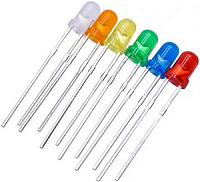
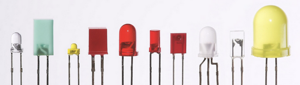
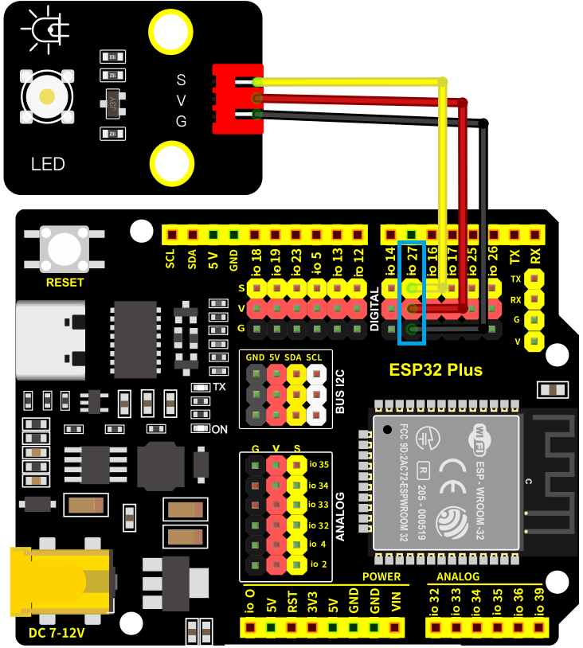
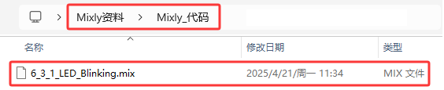
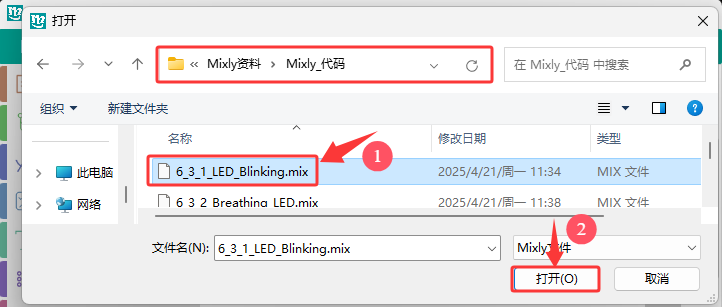
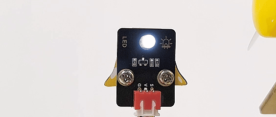
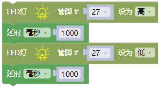

### 6.3.1 点亮LED灯

#### 6.3.1.1 简介

本教程将引导您一步步学习如何点亮LED灯，涵盖从基础电路知识到实际操作的全过程。您将了解LED的工作原理、所需元件（如线材、电源等）以及如何正确连接电路。通过教程您将学会如何搭建简单电路并使用开发板点亮LED。无论您是电子初学者还是爱好者，本教程都将为您提供实用且易于理解的指导，助您快速掌握点亮LED的基本技能。

#### 6.3.1.2 元件知识

**LED：**

LED灯的工作原理是基于半导体的光电效应。具体来说，LED是一个半导体的晶片，由P型半导体和N型半导体组成，它们之间形成一个P-N结。当电流通过导线作用于这个晶片时，电子从N区注入P区，空穴从P区注入N区，这些注入的少数载流子（电子和空穴）在P-N结附近复合，复合过程中能量以光子的形式释放出来，从而产生光。

不同材料的LED芯片能发出不同颜色的光，例如，氮化镓（GaN）类半导体材料常用于制作蓝色LED。通过调整LED芯片的材料和封装工艺，可以实现不同颜色的发光，如白色、暖白色、彩色等

LED就是将电能转换成光能的元件，当电流通过LED时，它会发光。

**各式各样的LED：**

**LED模块:** 是一种用于输出的设备，用于控制LED灯的亮度和闪烁，可以直接插入开发板的数字输出引脚上使用。

**原理图：** 当S处为高电平时，Q1三极管导通，电流通过LED（LED两端有一定的电压），LED此时会亮起来，反之相反。

**参数：**

- 工作电压: DC 3.3V~5V
- 工作电流: (Max)1.5mA@5V
- 最大功率: 0.0075W

#### 6.3.1.3 接线图

- **LED模块的S引脚连接到io27**

⚠️ **特别注意：智慧农场已经组装好了，这里不需要把LED模块拆下来又重新组装和接线，这里再次提供接线图，是为了方便您编写代码！**

#### 6.3.1.4 实验代码

代码文件在`Mixly_代码`文件夹中，代码文件为`6_3_1_LED_blinking.mix`，如下图所示：

单击 “**文件**” --> “**打开**”，然后选择保存代码的路径，选中代码文件打开即可，如下图所示：

**认识新代码块**

① 向LED指定管脚设置“高”或“低”，选择“高”代表给该管脚设置高电平，有电压，有电流，则LED点亮；选择“低”代表给管脚设置低电平，没电压，没有电流，则LED不亮。 

② 将程序的执行暂停一段时间，也就是延时，单位是毫秒。延时时间可以任意设置，这里是以延时1000毫秒为例。 

**组合代码块**

#### 6.3.1.5 实验结果

按照接线图接好线，外接电源，选择好正确的开发板板型（ESP32 Dev Module）和 适当的串口端口（COMxx），然后单击按钮上传代码。上传代码成功后，可以看到LED每隔一秒闪烁，这是因为ESP32开发板的io27，每隔一秒输出高电平和低电平。

通过LED模块，我们可以实现各种有趣的互动式应用，例如呼吸灯效果、流水灯效果、警灯效果等等。  

| 电平 | 功能  |
| :--: | :---: |
| HIGH | LED亮 |
| LOW  | LED灭 |

#### 6.3.1.6 代码说明

（1）.分配`LED`的数字引脚为`IO27`，设置LED数字引脚为高电平，使LED点亮。

（2）.延时1000毫秒。延时时间可以任意设置，这里是以延时1000毫秒为例。

（3）.分配`LED`的数字引脚为`IO27`，设置LED数字引脚为低电平，使LED不亮。

（4）. LED亮1000毫秒，熄灭1000毫秒，并且不断地重复循环。

