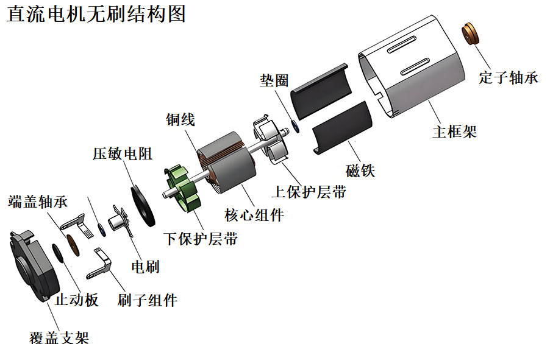
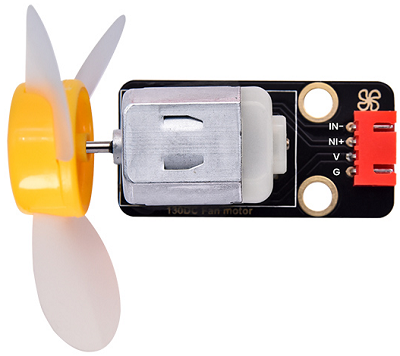
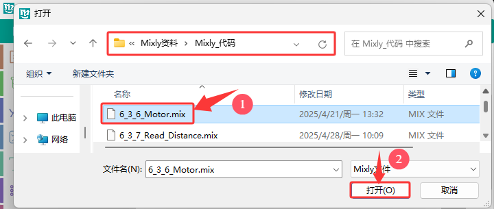
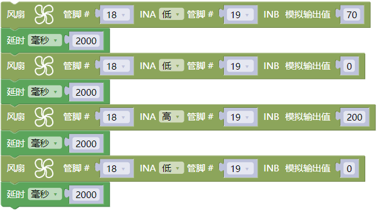
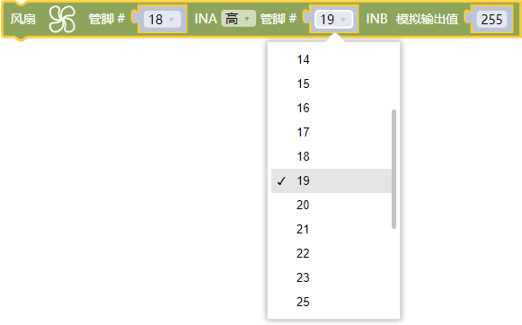

### 6.3.6 风扇模块

#### 6.3.6.1 简介

本教程将为您详细介绍风扇模块的使用方法和应用技巧。风扇模块是一种常见的散热设备，通过直流电机驱动扇叶旋转，产生气流以降低温度。教程内容包括风扇模块的工作原理、引脚功能、电路连接方法以及如何通过微控制器（如ESP32）控制风扇的开关和转速。您将学习如何编写代码来实现风扇的自动控制，并应用于各种场景，如温度调节、通风系统和电子设备散热。无论您是电子初学者还是有经验的开发者，本教程都将帮助您掌握风扇模块的应用，为您的项目增添有效的散热解决方案。

#### 6.3.6.2 元件知识

130电机风扇模块上有个直流电机，直流电机的工作原理是基于电磁感应和洛伦兹力。其核心结构包括定子、转子和换向器。定子产生固定磁场，转子（电枢）由线圈绕组组成，通电后产生磁场。当电流通过电刷和换向器进入转子线圈时，转子磁场与定子磁场相互作用，产生洛伦兹力，推动转子旋转。换向器在转子旋转时切换电流方向，确保转子持续受到同方向的力，从而维持旋转。通过电磁感应和洛伦兹力的作用，直流电机将电能转换为机械能，实现能量转换。由于其调速性能好、启动扭矩大，直流电机广泛应用于电动工具、电动汽车和家用电器等领域。

130电机风扇模块是一种可以通过PWM调速的模块，使用时需要接两个引脚进行控制。该模块适用于需要调节风扇速度的应用场景，例如电脑散热、工业生产等。它小巧轻便、安装简单，是一种十分实用的模块。

**原理图：**

HR1124S芯片的作用是助于驱动电机，而电机所需电流较大，无法用三极管驱动更无法直接用IO口驱动。让电机转动起来的方法很简单，给电机两端添加电压即可。不同电压方向电机转向也不相同，在额度电压内，电压越大，电机转动得越快；反之电压越低，电机转动得越慢，甚至无法转动。控制方式有两种：一种是高低电平控制（控制转动和停止），一种是PWM控制（控制转速）。

**参数：**

- 工作电压: DC 5V
- 工作电流: (Max)400mA@5V
- 最大功率: 2W
- 转速: (16000+10%) 转/分@5V

#### 6.3.6.3 接线图

- **电机模块的IN-引脚连接到io18，IN+引脚连接到io19**

⚠️ **特别注意：智慧农场已经组装好了，这里不需要把电机模块拆下来又重新组装和接线，这里再次提供接线图，是为了方便您编写代码！**

#### 6.3.6.4  实验代码

代码文件在`Mixly_代码`文件夹中，代码文件为`5_3_6_Motor.sb3`，如下图所示：

单击 “**文件**” --> “**从电脑中上传**”，然后选择保存代码的路径，选中代码文件打开即可，如下图所示：

**认识代码块**

① 向电机(风扇)模块设置引脚INA的高低电平状态，高低电平决定了风扇的正反转；设置引脚INB的模拟输出，决定风扇的转速。 

② 将程序的执行暂停一段时间，也就是延时，单位是毫秒。 

**组合代码块**

#### 6.3.6.5  实验结果

按照接线图接好线，外接电源，选择好正确的开发板板型（ESP32 Dev Module）和 适当的串口端口（COMxx），然后单击按钮上传代码。上传代码成功后可以看到130电机模块上的风扇，每隔2秒，逆时针和顺时针交替旋转。  

⚠️ **注意：电机在进行正反转时，间歇性的停止，为了防止正反转的瞬间，电机电流过大，导致开发板供电不足，而被迫复位，一定要保证外接电源，并且还要保证外接电源电压比较足。**

#### 6.3.6.6  代码解释

（1）.向电机(风扇)模块设置引脚INA的高低电平状态，高低电平决定了风扇的正反转；设置引脚INB的模拟输出，决定风扇的转速。

- 设置引脚**INA**

 

- 设置引脚**INA**的高低电平状态，高低电平决定了风扇的正反转。

- 设置引脚**INB**

- 设置引脚**INB**的模拟输出，决定风扇的转速。

  - 在INA引脚为高电平状态时，INB模拟输出越小，风扇越快。

  - 在INA引脚为低电平状态时，INB模拟输出越大，风扇越快。

   

（2）.逆时针转动2秒

（3）.停止2秒，停止的目的: 防止正反转的瞬间，电机电流过大，导致开发板供电不足，而被迫复位。

（4）.顺时针转动2秒

