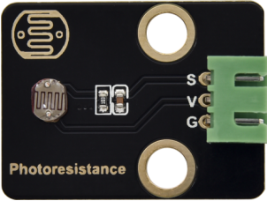
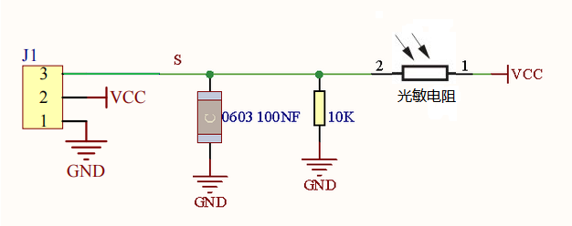
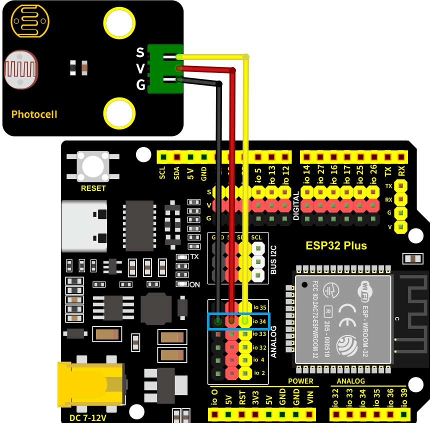
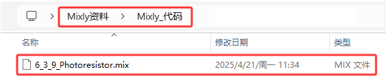
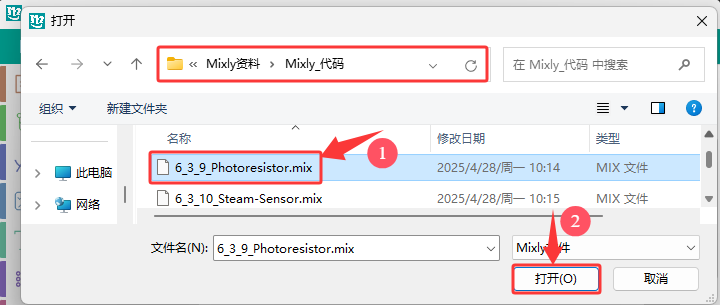
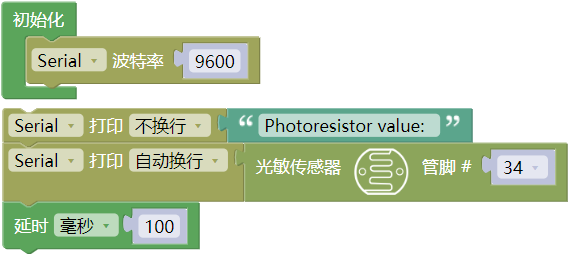
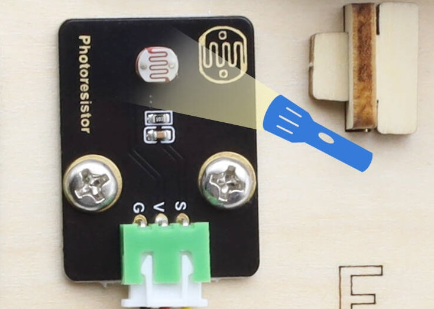
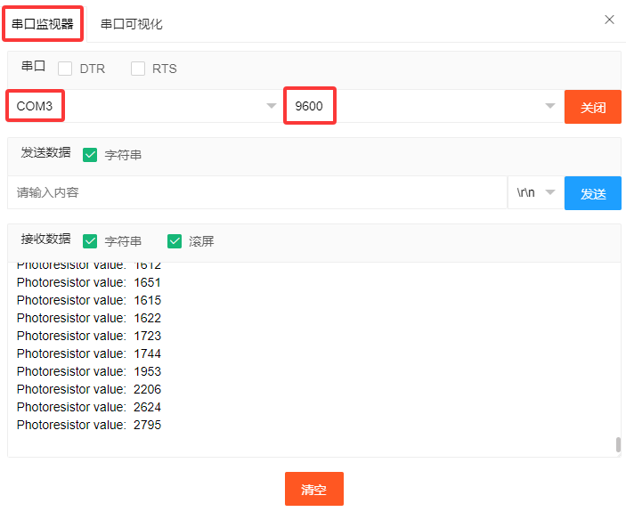

### 6.3.9 光敏传感器

#### 6.3.9.1 简介

本教程将为您详细介绍光敏传感器的使用方法和应用技巧。光敏传感器是一种能够检测环境光强度的电子元件，常用于自动照明控制、光强监测和节能系统。教程内容包括光敏传感器的工作原理、类型（如光敏电阻、光电二极管）、电路连接方法以及如何通过微控制器（如ESP32）读取光强数据。您将学习如何编写代码来获取实时光强值，并根据光强变化触发相应的控制动作，如自动开关灯、调节屏幕亮度等。无论您是电子初学者还是有经验的开发者，本教程都将帮助您掌握光敏传感器的应用，为您的项目增添智能的光感应功能。

#### 6.3.9.2 元件知识

**光敏传感器:** 也称光电传感器，是利用光电器件把光信号转换成电信号的一种传感器。其中最核心的是传感器模块上有一颗光敏电阻。光敏电阻是利用硫化镉或硒化镉等半导体材料的光电导效应制成的一种电阻值随入射光的强弱而改变的电阻器。

**原理图：**

当没有光照射时，电阻大小约为0.5 MΩ，光敏电阻的信号端（2脚）检测的电压接近0。当光照到光敏电阻时，随着光照强度增大，光敏电阻的阻值越来越小，VCC电压从光敏电阻通过的电压就越大，所以信号端S能检测到的电压也越来越大。

**参数：**

- 工作电压: DC 3.3V~5V
- 工作电流: (Max)0.2mA@5V
- 最大功率: 0.001W
- 光谱峰值: 540nm
- 亮电阻(10lux): 5~10KΩ
- 暗电阻: 0.5MΩ

#### 6.3.9.3 接线图

- **光敏传感器的S引脚连接到io34**

⚠️ **特别注意：智慧农场已经组装好了，这里不需要把光敏传感器拆下来又重新组装和接线，这里再次提供接线图，是为了方便您编写代码！**

#### 6.3.9.4 实验代码

代码文件在`Mixly_代码`文件夹中，代码文件为`6_3_9_Photoresistor.mix`，如下图所示：

单击 “**文件**” --> “**打开**”，然后选择保存代码的路径，选中代码文件打开即可，如下图所示：

**认识代码块**

① 这是初始化代码块，初始化代码块里面的内容只执行一次。

② 设置串口。

设置串口波特率，一般波特率设置为`9600`或`115200`。

串口输出数据，从串行端口输出数据，分换行与不换行两种方式。

③ 向指定管脚读取光敏传感器的光照强度值（模拟值）。

④ 这是文本代码块，里面可以填入一个字母、单词或一行文本。

⑤ 将程序的执行暂停一段时间，也就是延时，单位是毫秒。 

**组合代码块**

#### 6.3.9.5 实验结果

按照接线图接好线，外接电源，选择好正确的开发板板型（ESP32 Dev Module）和 适当的串口端口（COMxx），然后单击按钮上传代码。上传代码成功后，单击Mixly IDE左上角的打开串监视器串口并设置串口波特率为`9600`, 即可通过串口打印窗口查看光敏传感器的模拟值，光线越亮模拟值越高，光线越暗模拟值越低，用手遮住光线模拟环境光线变暗。 

**串口现象图：**

#### 6.3.9.6 代码说明

（1）. 串口打印读取的光敏传感器的光线强度模拟值。

