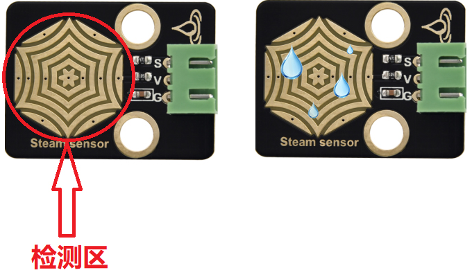
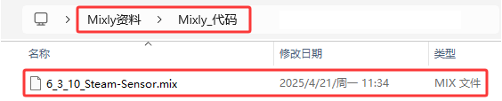
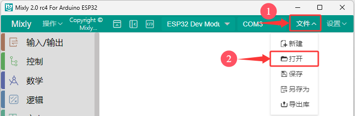
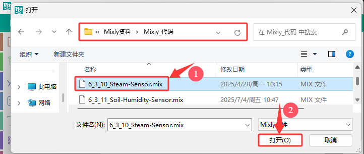
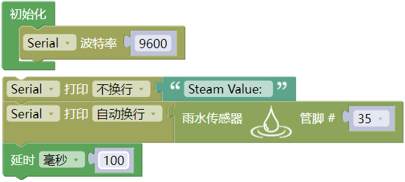
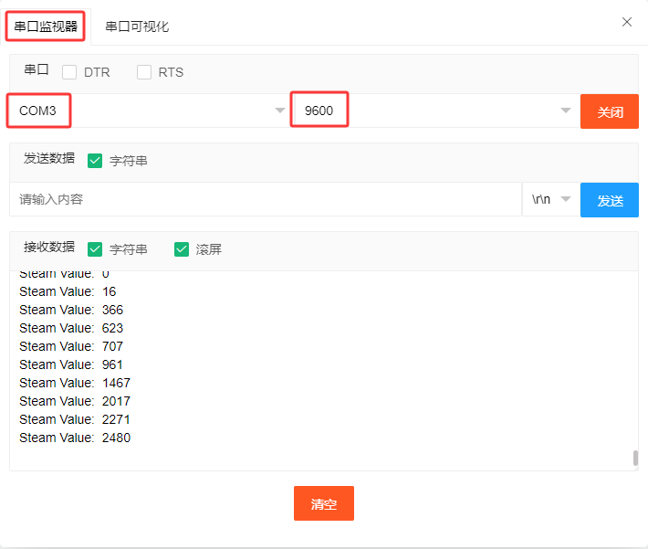

### 6.3.10 水滴传感器

#### 6.3.10.1 简介

本教程将为您详细介绍水滴传感器的使用方法和应用技巧。水滴传感器是一种能够检测水存在的传感器，广泛应用于雨水检测等领域。教程内容包括水滴传感器的工作原理、引脚功能、电路连接方法以及如何通过微控制器（如ESP32）读取雨水量的模拟值。您将学习如何编写代码来传感器上实时雨水量的多少。无论您是电子初学者还是有经验的开发者，本教程都将帮助您掌握水滴传感器的应用，为您的项目增添精确的雨水检测功能。

#### 6.3.10.2 元件知识

**水滴传感器：** 是一种可用于检测水的存在的传感器，它通常用于雨水检测系统。当雨水接触到传感器上的导电垫（检测区）时，它会向开发板(例如：Arduino主板，ESP32主板等)发送信号，以触发各种动作。检测区上的水量越多，模拟值越大。

**原理图：**

水滴传感器通过电路板上裸露的印刷平行线检测水量的大小。水量越多，就会有更多的导线被联通，随着导电的接触面积增大，雨滴感应区 2 脚输出的电压就会逐步上升。信号端 S 检测到的模拟值就越大。除了可以检测水量的大小，它还可以检测空气中的水蒸气。

**参数：**

- 工作电压: DC 3.3V~5V
- 工作电流: (Max) 1.5mA@5V
- 最大功率: 0.075W
- 信号类型: 模拟信号

#### 6.3.10.3 接线图

- **水滴传感器的S引脚连接到io35**

⚠️ **特别注意：智慧农场已经组装好了，这里不需要把水滴传感器拆下来又重新组装和接线，这里再次提供接线图，是为了方便您编写代码！**

#### 6.3.10.4 实验代码

代码文件在`Mixly_代码`文件夹中，代码文件为`6_3_10_Steam-Sensor.mix`，如下图所示：

单击 “**文件**” --> “**打开**”，然后选择保存代码的路径，选中代码文件打开即可，如下图所示：

**认识代码块**

① 这是初始化代码块，初始化代码块里面的内容只执行一次。

② 设置串口。

设置串口波特率，一般波特率设置为`9600`或`115200`。

串口输出数据，从串行端口输出数据，分换行与不换行两种方式。

③ 向指定管脚读取读取水滴传感器的雨水强度值（模拟值）。

④ 这是文本代码块，里面可以填入一个字母、单词或一行文本。

⑤ 将程序的执行暂停一段时间，也就是延时，单位是毫秒。 

**组合代码块**

#### 6.3.10.5 实验结果

按照接线图接好线，外接电源，选择好正确的开发板板型（ESP32 Dev Module）和 适当的串口端口（COMxx），然后单击按钮上传代码。上传代码成功后，单击Mixly IDE左上角的打开串监视器串口并设置串口波特率为`9600`,即可通过串口打印窗口查看水滴传感器的模拟值，用湿润的手指去触碰传感器上的检测区域，触碰的面积越大，接收到的值就越大。

**串口现象图：**

