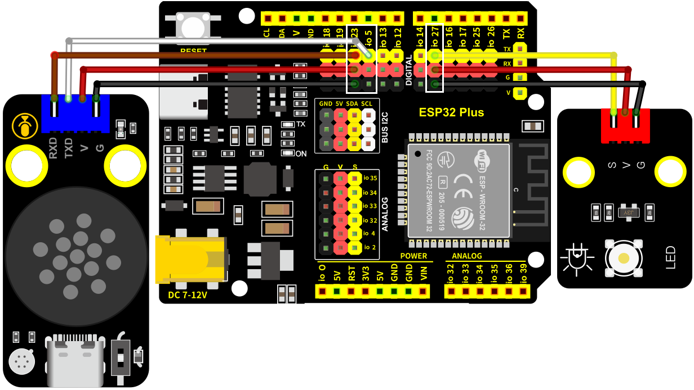
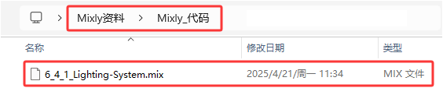
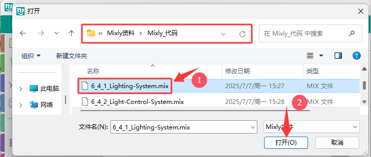
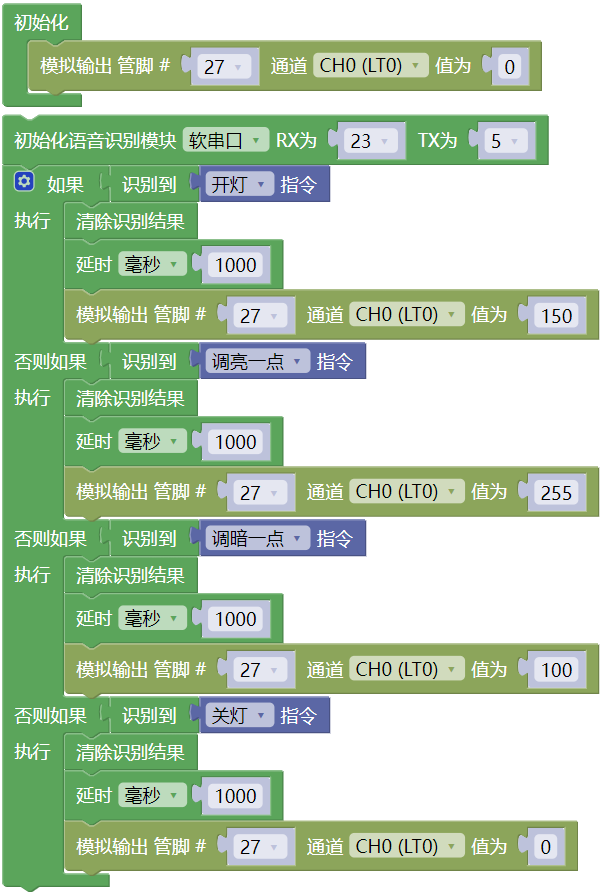

### 6.4.1 照明系统

#### 6.4.1.1 简介

在前面的教程中，已经了解过LED，智能语音模块的工作原理和应用，在本项目中，使用智能语音模块来控制LED，实现自动化语音控制LED亮灭及亮度改变。

本项目带领大家，了解如何使用Arduino ESP32开发板实现照明控制系统，模拟现实生活场景，通过智能语音模块来控制LED的开与关来实现自动化语音控制LED亮灭和亮度改变。

#### 6.4.1.2 接线图

- **LED模块的S引脚连接到io27**

- **智能语音模块的TXD引脚连接到io5，RXD引脚连接到io23**

⚠️ **特别注意：智慧农场已经组装好了，这里不需要把LED模块和智能语音模块拆下来又重新组装和接线，这里再次提供接线图，是为了方便您编写代码！**

#### 6.4.1.3 代码流程图

#### 6.4.1.4 实验代码

代码文件在`Mixly_代码`文件夹中，代码文件为`6_4_1_Lighting-System.mix`，如下图所示：

单击 “**文件**” --> “**从电脑中上传**”，然后选择保存代码的路径，选中代码文件打开即可，如下图所示：

**组合代码块**

#### 6.4.1.5 实验结果

按照接线图接好线，外接电源，选择好正确的开发板板型（ESP32 Dev Module）和 适当的串口端口（COMxx），然后单击按钮上传代码。上传代码成功后，支持智能语音模块来控制LED。

对着智能语音模块上的麦克风，使用唤醒词 “你好，小智” 或 “小智小智” 来唤醒智能语音模块，同时喇叭播放回复语 “有什么可以帮到您”；

智能语音模块唤醒后，对着麦克风说：“打开台灯” 或 “请开灯” 或 “开灯” 或 “打开灯” 或 “我回来了” 等命令词时，喇叭播放对应的回复语 “已为您打开照明”，同时LED点亮；

对着麦克风说：“调亮一点” 或 “亮一点” 等命令词时，喇叭播放对应的回复语 “灯光已调亮”，同时LED变亮；

对着麦克风说：“调暗一点” 或 “暗一点” 等命令词时，喇叭播放对应的回复语 “灯光已调暗”，同时LED变暗；

对着麦克风说：“关闭台灯” 或 “请关灯” 或 “关灯” 或 “睡觉了” 或 “关上灯” 或 “我出去了”等命令词时，喇叭播放对应的回复语 “已为您关闭照明”，同时LED熄灭。

  
#### 6.4.1.6 代码解释

这是简单的条件判断语句，如果里的表达式为真，则执行内的代码。

点击，将代码块拖入代码块中，得到代码块。这也是简单的条件判断语句，如果里的表达式为真，则执行内的代码。如果里表达式为假 ，则执行块内的代码。

点击，将代码块拖入代码块中，得到代码块，这也是简单的条件判断语句。