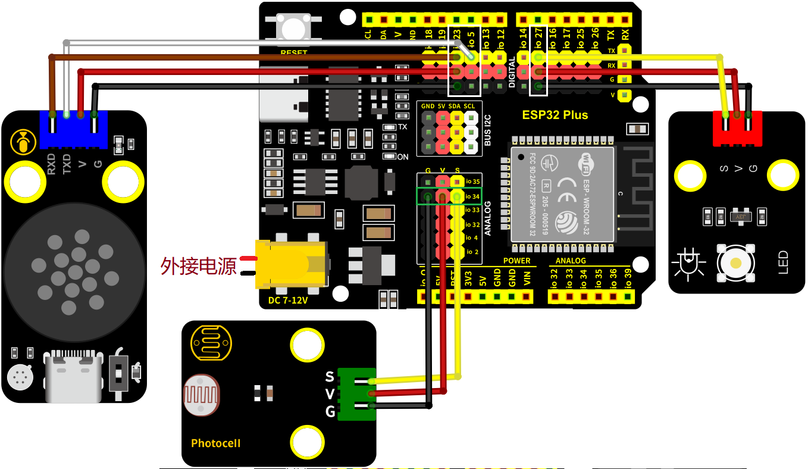
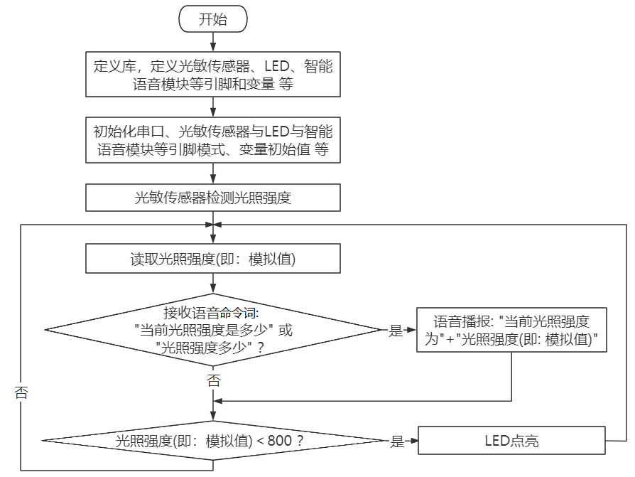
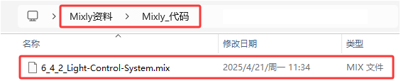
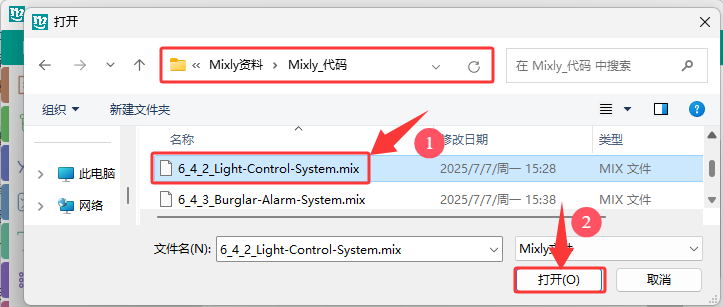
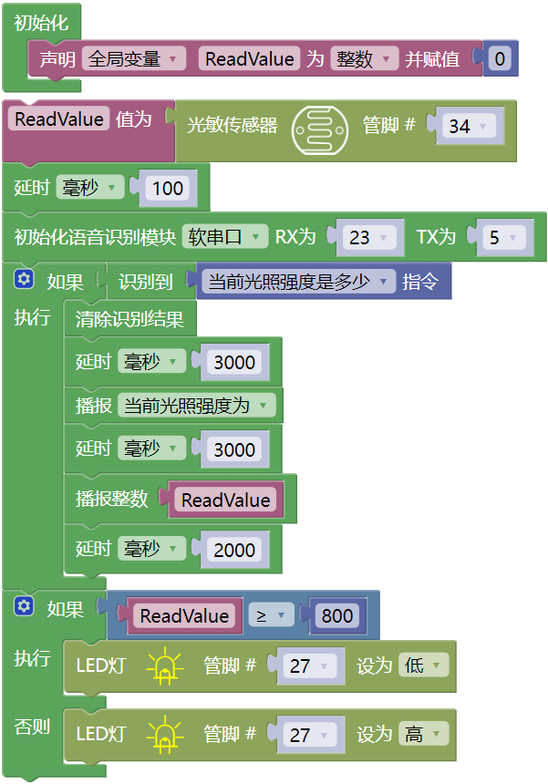

### 6.4.2 光控系统

#### 6.4.2.1 简介

这个系统是由光敏传感器、智能语音模块和LED灯组成的光控系统，可以实现智能化的灯光控制，节约能源并提高使用效率。

这种系统广泛应用于不同场景，并且通过使用光敏传感器，实现自动检测白天和黑夜以及光的强度，使得整个系统更加智能化和节能。

在前面的教程中，我们已经学习过关于光敏传感器、智能语音模块和LED灯的工作原理。那么，在本教程中将带领大家，了解如何使用Arduino ESP32开发板实现照明控制系统，模拟现实生活场景，通过光敏传感器控制LED灯的开与关，同时还可以对着智能语音模块发出类似于“当前光照强度是多少”等命令词，智能语音模块接收到相应命令词后语音播报当前光照强度（即：模拟值）。

当环境亮度低于设定值时，光敏传感器会检测到信号，从而自动打开LED灯；当环境亮度高于设定值时，光敏传感器会发送另一个信号，从而关闭LED灯。

#### 6.4.2.2 接线图

- **LED模块的S引脚连接到io27**

- **光敏传感器的S引脚连接到io34**

- **智能语音模块的TXD引脚连接到io5，RXD引脚连接到io23**

⚠️ **特别注意：智慧农场已经组装好了，这里不需要把光敏传感器、LED模块和智能语音模块拆下来又重新组装和接线，这里再次提供接线图，是为了方便您编写代码！**

#### 6.4.2.3 代码流程图

#### 6.4.2.4 实验代码

代码文件在`Mixly_代码`文件夹中，代码文件为`6_4_2_Light-Control-System.mix`，如下图所示：

单击 “**文件**” --> “**从电脑中上传**”，然后选择保存代码的路径，选中代码文件打开即可，如下图所示：

**组合代码块**

⚠️ **注意：代码中的条件阈值可以根据实际情况自行设置。**

#### 6.4.2.5 实验结果

按照接线图接好线，外接电源，选择好正确的开发板板型（ESP32 Dev Module）和 适当的串口端口（COMxx），然后单击按钮上传代码。上传代码成功后，当白天光照较强时，光敏传感器的模拟值大于等于800时，LED会不亮，当天黑后，光敏传感器的模拟值小于800时，LED会自动打开。

对着智能语音模块上的麦克风，使用唤醒词 “你好，小智” 或 “小智小智” 来唤醒智能语音模块，同时喇叭播放回复语 “有什么可以帮到您”；

智能语音模块唤醒后，对着麦克风说：“当前光照强度是多少” 或 “光照强度多少” 等命令词句时，接着语音播报 “正在为您读取光照强度” + “当前光照强度为” + “光敏传感器检测到的光照强度模拟值”。

**这种系统广泛应用于不同场景，并且通过使用光敏传感器，实现自动检测白天和黑夜以及光的强度，使得整个系统更加智能化和节能。**