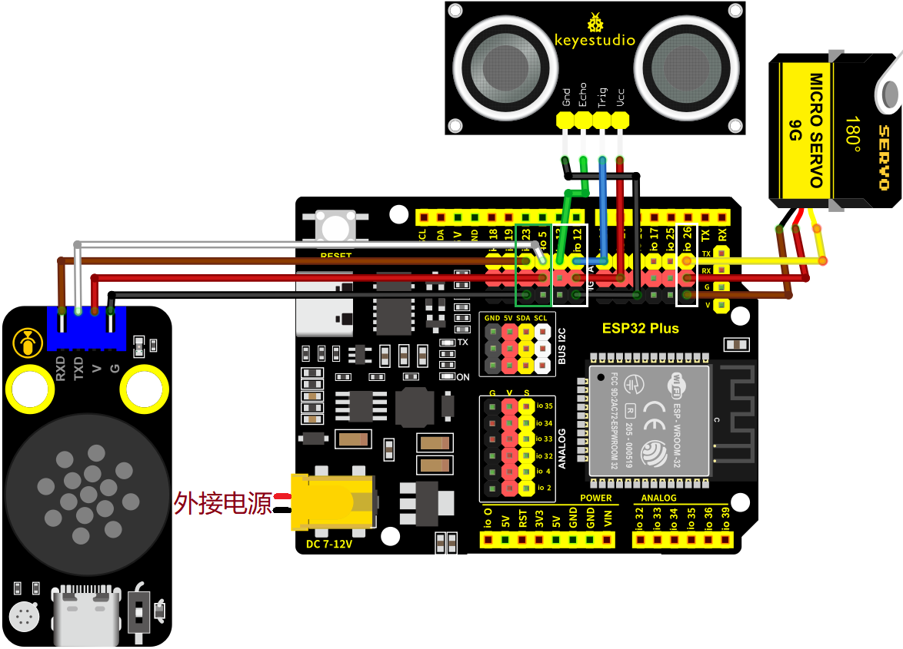
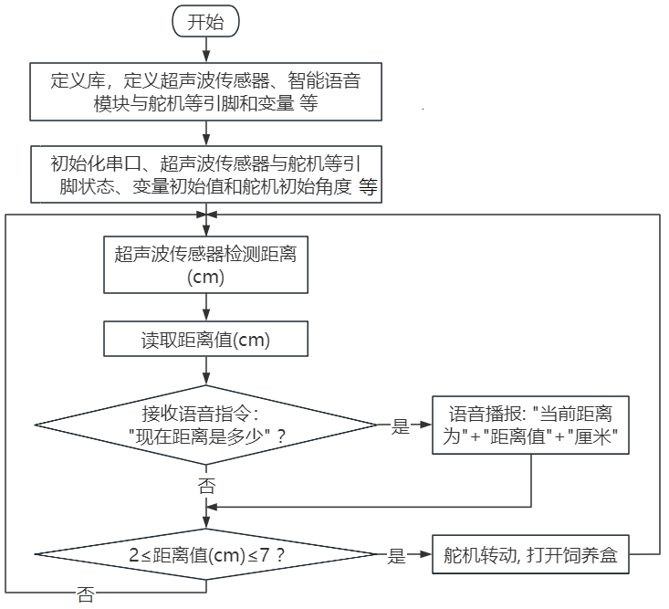
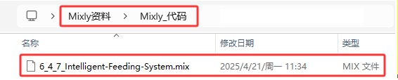
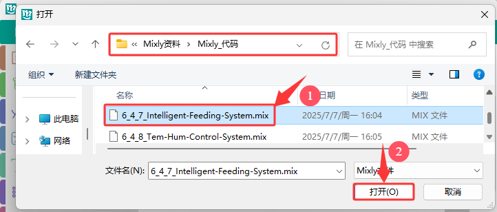
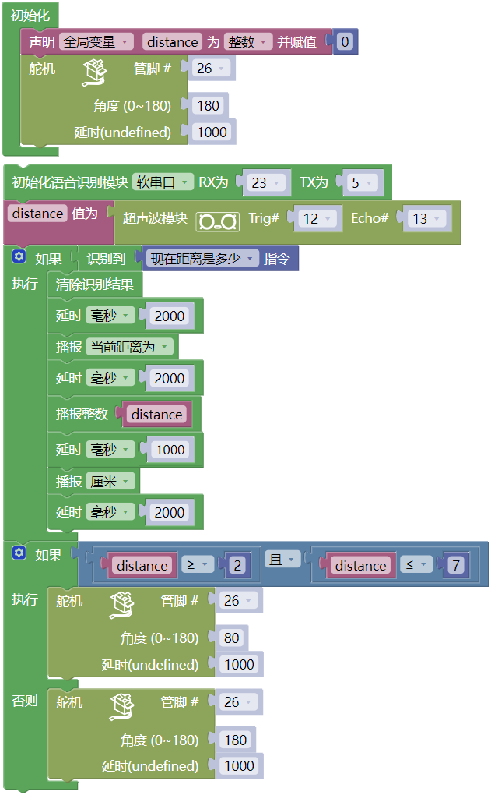

### 6.4.7 智能喂养系统

#### 6.4.7.1 简介

通过超声波传感器来检测动物是否在喂食区，可以驱动伺服开关打开喂食盒，自动喂食动物，同时还可以语音播报动物离喂食盒的距离。融入物联网技术可以实现对饲喂系统的远程监控，提供另一个层面的便利和控制。总的来说，喂养系统的自动化和远程化，优化动物的喂养过程。

智能喂养系统是通过组合超声波传感器、智能语音模块和舵机，实现对动物的智能喂养。超声波传感器用于检测宠物的距离，当宠物靠近食物盆时，传感器检测到距离变近，触发信号后控制舵机将饲料盒打开；人对智能语音模块发出对应语音命令词，智能语音模块接收语音命令词，然后语音播报动物离超声波传感器之间的当前距离值。

#### 6.4.7.2 接线图

- **舵机的黄色线连接到io26**

- **超声波传感器的Echo连接到io13，Trig连接到io14**

- **智能语音模块的TXD引脚连接到io5，RXD引脚连接到io23**

⚠️ **特别注意：智慧农场已经组装好了，这里不需要把超声波传感器、舵机和智能语音模块拆下来又重新组装和接线，这里再次提供接线图，是为了方便您编写代码！**

------

#### 6.4.7.3 代码流程图

------

#### 6.4.7.4 实验代码

代码文件在`Mixly_代码`文件夹中，代码文件为`6_4_7_Intelligent-Feeding-System.mix`，如下图所示：

单击 “**文件**” --> “**从电脑中上传**”，然后选择保存代码的路径，选中代码文件打开即可，如下图所示：

**组合代码块**

⚠️ **注意：代码中的条件阈值可以根据实际情况自行设置。**

#### 6.4.7.5 实验结果

按照接线图接好线，外接电源，选择好正确的开发板板型（ESP32 Dev Module）和 适当的串口端口（COMxx），然后单击按钮上传代码。上传代码成功后，当超声波检测到有动物离超声波传感器的距离大于等于2cm小于等于7cm时，将开启饲料盒。

对着智能语音模块上的麦克风，使用唤醒词 “你好，小智” 或 “小智小智” 来唤醒智能语音模块，同时喇叭播放回复语 “有什么可以帮到您”；

智能语音模块唤醒后，对着麦克风说：“现在距离是多少” 等命令词时，接着语音播报 “正在为您读取距离” + “当前距离为” + “超声波传感器检测到的距离数值”  + “厘米”。

⚠️ **注意：** 请勿将手指伸入到饲料盒中，谨防夹伤！请勿将其他物体堵住饲料盒盖，以免弄坏舵机。