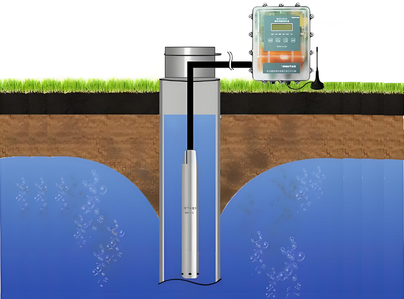
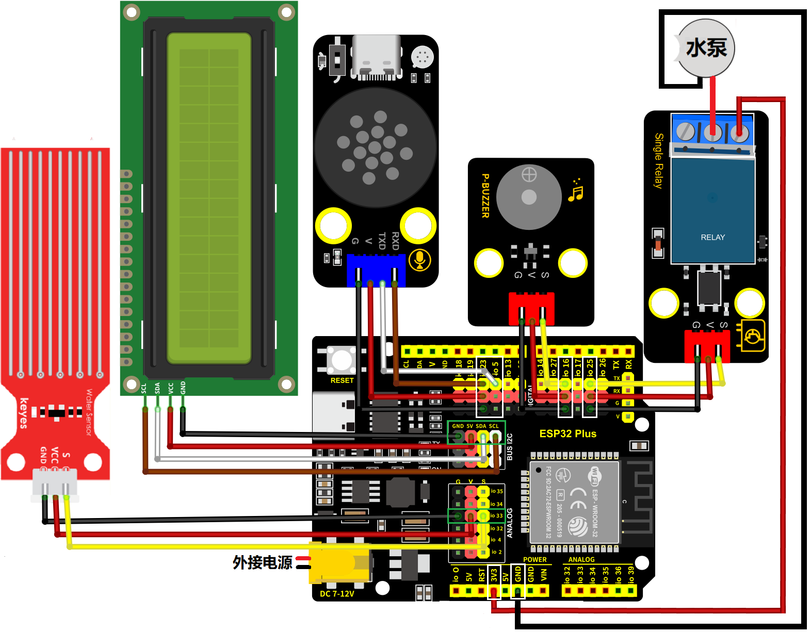
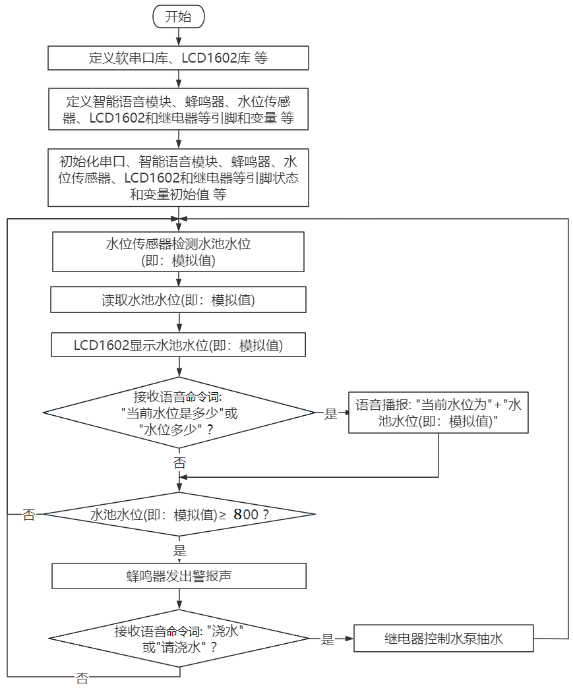
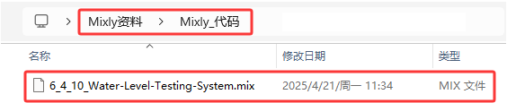
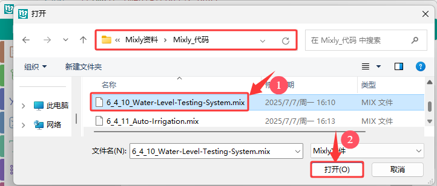
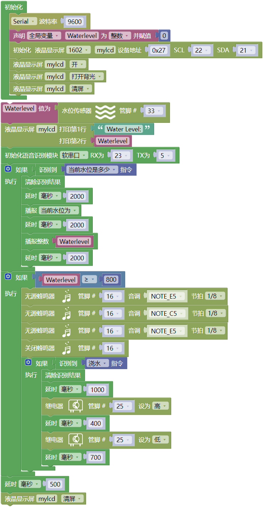

### 6.4.10 水位监测系统

***请注意，使用设备时不要让水从水池和土壤池中溢出。如果水洒到其他传感器上，会导致短路，影响设备正常工作。另外，如果水洒到电池上，会导致发热和爆炸等危险。因此，请在使用设备时格外小心，尤其是幼儿使用时一定要在家长的监护下进行。为确保设备的安全运行，请遵循相关使用指南和安全规范。***

#### 6.4.10.1 简介

本课程介绍如何使用ESP32开发板、水位传感器、智能语音模块、无源蜂鸣器、继电器、水泵和LCD1602显示屏构建一个智能水源水位自动监测报警系统。其主要功能是监测水位变化，同时通过智能语音模块发出类似于“当前水位是多少” 等命令词时，语音播报水位多少，这样可以及时发现问题并采取措施避免灾害发生。

水位自动监测报警系统，主要功能是监测水位变化，及时发现问题并采取措施避免灾害发生。该系统广泛应用于水利工程、城市排水、环境监测等领域。

#### 6.4.10.2 接线图

- **水位传感器的S引脚连接到io33**

- **无源蜂鸣器的S引脚连接到io16**

- **智能语音模块的TXD引脚连接到io5，RXD引脚连接到io23**
 
- **LCD1602模块连接到 BUS I2C(SDA连接(SDA:IO21)、SCL连接(SCL:IO22)**

- **继电器模块的S引脚连接到io25；继电器的NO端，连接到ESP32主板上的3V3引脚**

- **水泵：**
  - **红色线连接到继电器的COM端，如图所示**
  - **黑色线连接到ESP32主板上的GND引脚，如图所示**

⚠️ **特别注意：智慧农场已经组装好了，这里不需要把水位传感器、无源蜂鸣器、LCD1602模块、继电器、水泵和智能语音模块拆下来又重新组装和接线，这里再次提供接线图，是为了方便您编写代码！**

#### 6.4.10.3 代码流程图

#### 6.4.10.4 实验代码

代码文件在`Mixly_代码`文件夹中，代码文件为`6_4_10_Water-Level-Testing-System.mix`，如下图所示：

单击 “**文件**” --> “**从电脑中上传**”，然后选择保存代码的路径，选中代码文件打开即可，如下图所示：

**组合代码块**

⚠️ **注意：代码中的条件阈值可以根据实际情况自行设置。**

#### 6.4.10.5 实验结果

按照接线图接好线，外接电源，选择好正确的开发板板型（ESP32 Dev Module）和 适当的串口端口（COMxx），然后单击按钮上传代码。上传代码成功后，将水位传感器的水位检测区插入水中（或者：用湿漉的手去触碰传感器的水位检测区，来模拟水位），LCD1602模块显示屏实时显示水位信息。

对着智能语音模块上的麦克风，使用唤醒词 “你好，小智” 或 “小智小智” 来唤醒智能语音模块，同时喇叭播放回复语 “有什么可以帮到您”；

智能语音模块唤醒后，对着麦克风说：“当前水位是多少” 或 “水位多少” 等命令词时，接着语音播报 “正在为您读入水位” + “当前水位为” + “水位传感器检测到的水位模拟值”；

当水位传感器检测到的水池水位模拟值高于设定的阈值时，蜂鸣器会发出警报声音，唤醒智能语音模块，对着麦克风说：“浇水” 或 “请浇水” 等命令词时，喇叭播放对应的回复语 “已开始浇水”，同时打开继电器控制水泵抽水。

