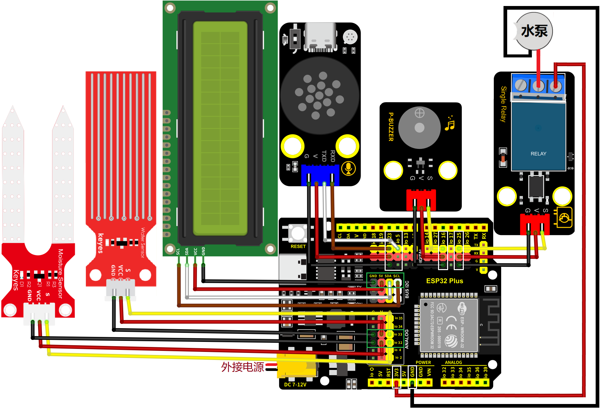
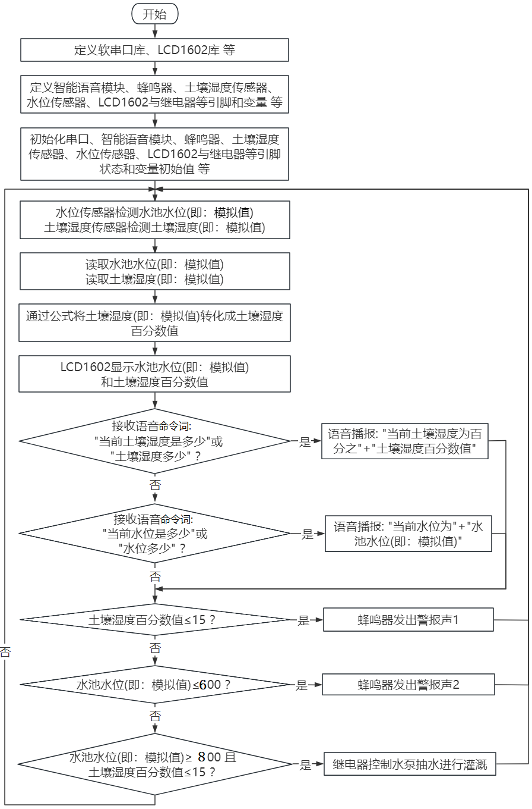
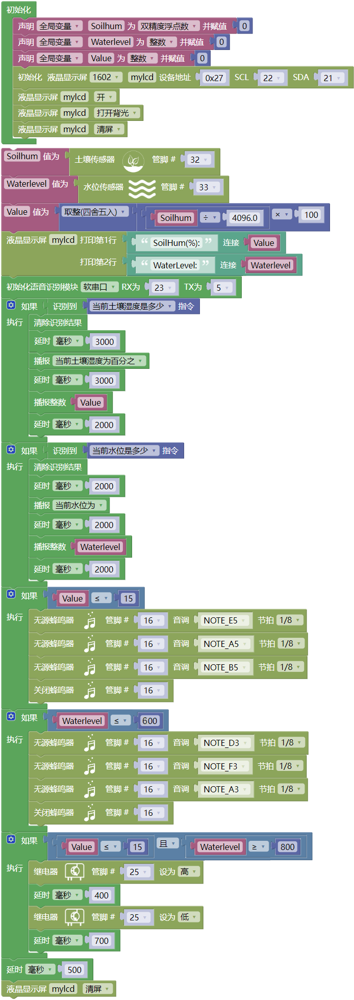

### 6.4.11 自动灌溉系统

***请注意，使用设备时不要让水从水池和土壤池中溢出。如果水洒到其他传感器上，会导致短路，影响设备正常工作。另外，如果水洒到电池上，会导致发热和爆炸等危险。因此，请在使用设备时格外小心，尤其是幼儿使用时一定要在家长的监护下进行。为确保设备的安全运行，请遵循相关使用指南和安全规范。***

#### 6.4.11.1 简介

本教程介绍如何使用ESP32开发板，控制继电器来打开水泵进行抽水灌溉，使用水位传感器来检测水位高度，判断水池是否有水，并使用土壤湿度传感器来检测植物土壤的湿度情况，从而更加智能化地控制水泵的启停，并且还通过智能语音模块发出类似于“当前土壤湿度是多少”和“当前水位是多少” 等命令词时，智能语音模块接收对应的命令词后语音播报当前土壤湿度百分数值和当前水池水位模拟值。

在这个项目中，我们将通过连接土壤湿度传感器和水位传感器到ESP32开发板上，并编写代码来读取它们的输出值，以控制继电器和抽水泵。

当土壤过于干燥时，通过蜂鸣器报警；当水位过低时，将无法启动抽水泵，通过蜂鸣器报警；当土壤过于干燥，水资源充足时，将打开继电器以控制抽水泵灌溉植物。通过这种方法，我们可以实现自动化的植物浇水和水位控制，提高生产效率，同时减少了手动操作的时间和精力成本。

#### 6.4.11.2 接线图

- **土壤湿度传感器的S引脚连接到io32**

- **水位传感器的S引脚连接到io33**

- **无源蜂鸣器的S引脚连接到io16**

- **智能语音模块的TXD引脚连接到io5，RXD引脚连接到io23**

- **LCD1602模块连接到 BUS I2C(SDA连接(SDA:IO21)、SCL连接(SCL:IO22)**

- **继电器模块的S引脚连接到io25；继电器的NO端，连接到ESP32主板上的3V3引脚**

- **水泵：**
  - **红色线连接到继电器的COM端，如图所示**
  - **黑色线连接到ESP32主板上的GND引脚，如图所示**

⚠️ **特别注意：智慧农场已经组装好了，这里不需要把土壤湿度传感器、水位传感器、LCD1602模块、无源蜂鸣器、继电器模块、水泵和智能语音模块拆下来又重新组装和接线，这里再次提供接线图，是为了方便您编写代码！**

#### 6.4.11.3 代码流程图

#### 6.4.11.4 实验代码

代码文件在`Mixly_代码`文件夹中，代码文件为`6_4_11_Auto-Irrigation.mix`，如下图所示：

单击 “**文件**” --> “**从电脑中上传**”，然后选择保存代码的路径，选中代码文件打开即可，如下图所示：

**组合代码块**

⚠️ **注意：代码中的条件阈值可以根据实际情况自行设置。**

#### 6.4.11.5 实验结果

按照接线图接好线，外接电源，选择好正确的开发板板型（ESP32 Dev Module）和 适当的串口端口（COMxx），然后单击按钮上传代码。上传代码成功。将土壤湿度传感器的检测区插入土壤中，将水位湿度传感器的水位检测区插入水中（或者：用湿漉的手去触碰传感器的水位检测区，来模拟水位），LCD1602模块显示屏的第一行实时显示土壤湿度百分数信息，第二行实时显示水位信息。

对着智能语音模块上的麦克风，使用唤醒词 “你好，小智” 或 “小智小智” 来唤醒智能语音模块，同时喇叭播放回复语 “有什么可以帮到您”；

智能语音模块唤醒后，对着麦克风说：“当前土壤湿度是多少” 或 “土壤湿度多少” 等命令词时，接着语音播报 “正在为您读取土壤湿度” + “当前土壤湿度为百分之” + “土壤湿度传感器模拟值通过计算转化成的土壤湿度百分数值”；

对着麦克风说：“当前水位是多少” 或 “水位多少” 等命令词时，接着语音播报 “正在为您读入水位” + “当前水位为” + “水位传感器检测到的水位模拟值”；

当土壤湿度传感器检测到的土壤湿度百分数值低于设定的阈值时，蜂鸣器会发出警报声1，提示土壤太干旱了。

当水位传感器检测到的水池水位模拟值低于设定的阈值时，蜂鸣器会发出警报声音2，提示水池里的水资源不足。

当土壤湿度传感器检测到的土壤湿度百分数值低于设定的阈值，并且水位传感器检测到的水池水位模拟值高于设定的阈值时，抽水系统抽水进行灌溉。

**总的来说，该项目不仅能够帮助我们实现自动化的植物浇水，还能够根据水位情况智能化地控制抽水泵的启停，适用于家庭和农业生产等多个领域。**