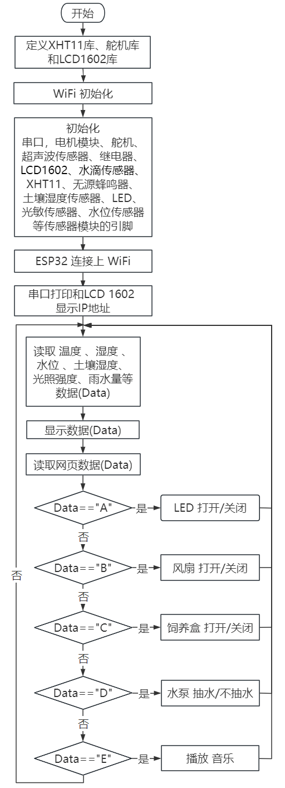
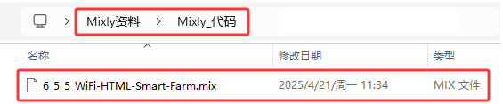
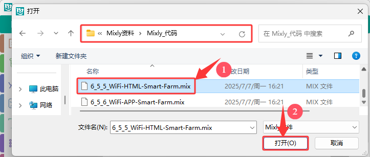
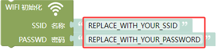
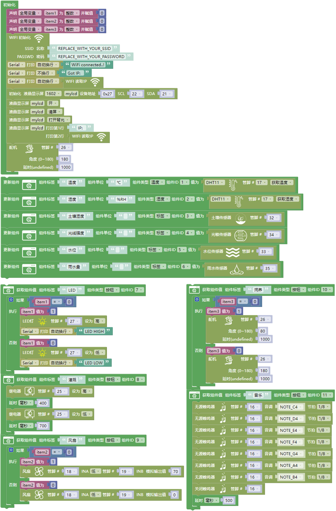
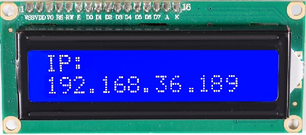

### 6.5.5 网页控制:智慧农场管理系统

***请注意，使用设备时不要让水从水池和土壤池中溢出。如果水洒到其他传感器上，会导致短路，影响设备正常工作。另外，如果水洒到电池上，会导致发热和爆炸等危险。因此，请在使用设备时格外小心，尤其是幼儿使用时一定要在家长的监护下进行。为确保设备的安全运行，请遵循相关使用指南和安全规范。***

#### 6.5.5.1 简介

本教程将为您详细介绍如何使用ESP32开发板实现WIFI网页控制智慧农场管理系统，系统包括土壤湿度传感器、水位传感器、XHT11温湿度传感器、水滴传感器继电器、水泵模块、光敏传感器（光照度检测）、LED模块、风扇模块和舵机（饲料盒开关）。教程内容包括ESP32的WiFi配置、网页设置以及如何编写代码等实现远程监控和控制。您将学习如何将ESP32连接到WIFI网页服务器，并通过发布和订阅消息来读取土壤湿度、水位、温湿度、雨水量和光照强度等相关数据，并根据需要控制水泵、LED、风扇和舵机的状态。此外，无论您是物联网初学者还是有经验的开发者，本教程都将帮助您掌握ESP32基于WiFi网页的远程大棚数据监测与控制系统开发，为您的项目增添智能的农场管理功能。

#### 6.5.5.2 接线图

**⚠️特别注意：智慧农场已经组装好了，这里不需要把所有的传感器和模块都拆下来又重新组装和接线。由于传感器和模块较多，接线图中的接线复杂会导致传感器和模块的引脚接线看不清，所以使用表格来表示传感器和模块的引脚连接到ESP32主控板上的对应引脚，也是为了方便您编写代码！**

| 编号 |      传感器模块        |      ESP32主板 S 引脚       |  ESP32主板 V 引脚 |  ESP32主板 G 引脚 |
| :--: | :------------------:  | :------------------------: |:---------------: |:---------------: |
|  1   |         风扇          |    io18(IN-) \| io19(IN+)     |        V         |         G        |
|  2   |      LCD1602模块      |  I2C（SDA(io21) \| SCL(io22)） |        V         |         G        |
|  3   |   XHT11温湿度传感器    |            io17             |        V         |         G        |
|  4   |      水滴传感器        |            io35             |        V         |         G        |
|  5   |      光敏传感器        |            io34             |        V         |         G        |
|  6   |        舵 机           |            io26             |        V         |         G        |
|  7   |      无源蜂鸣器        |            io16             |        V          |         G        |
|  8   |       LED模块          |            io27             |        V         |          G       |
|  9  |      水位传感器         |            io33             |        V         |          G        |
|  10  |    土壤湿度传感器      |            io32             |        V         |          G        |
|  11  |      继电器水泵        |            io25             |        V         |          G        |

#### 6.5.5.3 代码流程图

#### 6.5.5.4 实验代码

代码文件在`Mixly_代码`文件夹中，代码文件为`6_5_5_WiFi-HTML-Smart-Farm.mix`，如下图所示：

单击 “**文件**” --> “**打开**”，然后选择保存代码的路径，选中代码文件打开即可，如下图所示：

⚠️ **特别提醒：** 打开代码文件后，需要修改ESP32开发板需要连接的WiFi名称与密码，您需要分别将 `REPLACE_WITH_YOUR_SSID` 和 `REPLACE_WITH_YOUR_PASSWORD` 替换为您自己的 Wi-Fi 名称和 WiFi 密码。WiFi名称和WiFi密码修改后才能上传代码，否则你的ESP32开发板将无法连接网络。

⚠️ **注意：** 请确保代码中的WiFi名称和WiFi密码与连接到您的电脑、手机/平板、ESP32开发板和路由器的网络相同，它们必须在同一局域网（WiFi）内。

⚠️ **注意：** WiFi必须是2.4Ghz频率的，否则ESP32无法连接WiFi。

**认识代码块**

⚠️ **特别提醒：** 本实验代码中用到的一些新代码块在 **6.5.1 WIFI网页显示字符串** 项目中的 **认识代码块** 部分有讲解到，这里就不重复。有什么不清楚的，可以跳到 **6.5.1 WIFI网页显示字符串** 项目中的 **认识代码块** 部分去了解。

**组合代码块**

#### 6.5.5.5 实验结果

按照接线图接好线，外接电源，选择好正确的开发板板型（ESP32 Dev Module）和 适当的串口端口（COMxx），然后单击按钮上传代码，外接电源。

⚠️ **注意：手机或平板一定要与ESP32开发板连接的是同一个WiFi，否则将无法进入控制页面，还有就是ESP32开发板在使用WiFi功能时功耗很大需要外接DC电源才能满足它的工作电力需求，如果达不到它的工作电力需求ESP32板将会一直复位导致代码无法正常运行。**

上传代码成功后，单击 Mixly IDE 左上角的设置串口波特率为`9600`，即可通过串口打印窗口查看显示连接成功后的IP地址(如果看不到可以按复位按键重新连接一次)，同时LCD显示屏也会显示IP地址。 

然后，您可以在手机/平板的浏览器中输入串口监视器打印的 ESP32 IP地址 或LCD显示屏显示的 ESP32 IP地址，使用浏览器打开ESP32的IP地址，并访问网页。在本例中，您可以在浏览器中输入你自己的**ESP32 IP地址**（**这里是以192.168.36.189为例，而你需要将IP地址：192.168.36.189 修改成你自己的 ESP32 IP地址**），在手机/平板在浏览器中打开ESP32的IP地址来查看传感器数据显示和模块控制网页。网页中显示当前的温度、湿度、水池水位和土壤湿度等传感器的数据，还有LED灯、风扇、饲料盒和抽水泵等按钮。而且，我们可以通过手机操作这些按钮。

⚠️ **注意：当电脑、手机/平板和ESP32开发板，连接到同一个网络(WiFi)时，可在手机端/平板端打开这个网页。此处是你自己ESP32的IP地址**。

在手机端/平板端的浏览器中打开对应的IP地址，即可查看到对应传感器的数据，还可以控制LED、风扇、饲养盒、继电器抽水和音乐播放等功能。

|   传感器数据   |   可控制   |
| :------------: | :--------: |
|   温度（℃）    |  LED 开/关   |
|   湿度（%RH）   |  风扇 开/关  |
| 水位（0~4095）  | 饲料盒 开/关 |
| 雨量（0~4095）  | 抽水泵 开/关 |
| 光照（0~4095）  |  播放 音乐   |
| 土壤湿度（0~4095）|              |

在以上的项目实验中，我们学会了如何使用ESP32开发板，创建一个网页并将传感器数据显示出来。例如，我们可以显示当前的温度、湿度、水池水位和土壤湿度等等。我们也可以使用这个开发板来控制LED灯、风扇、饲料盒和抽水泵等设备。而且，我们可以通过手机或电脑远程操作这些设备。

通过这个教程，我们可以模拟真实的农场，并实现农场的智能化控制，使物联网、信息化、自动化和智能化成为可能。这样的技术可以让我们更方便地控制农场设备，提高农业生产的效率和质量。