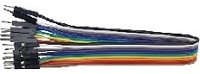
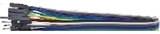

# 1. 产品介绍

## 1.1 产品安全 

1\. 本产品含细小零件，请避免儿童独自接触。

2\. 请严格按照教程操作，避免产品损坏，注意用电安全。

---------------

## 1.2 产品简介

智慧农场是一种以ESP32物联网为基础，综合多个传感器，实现自动化控制和无线控制，来实现智能化管理的农场。

随着新一代信息技术的发展，农业数字化、网络化、智能化成为农业现代化发展的基石。依托物联网等技术，部署于农业生产现场的各种传感节点和通信网络，能够实现智能感知、智能预警、智能决策、智能分析等功能。

综合运用Arduino学习套件中的各种模块，例如: 智能语音模块、光敏传感器、土壤湿度传感器、水位传感器等，同时还包括ESP32主控板上内置的无线通信模块。通过学习这个套件，可以掌握如何使用各种传感器，搭建物联网系统，了解如何通过编程实现智能化的农场管理。

此外，这个套件还提供了详细的教学课程、示例代码等，更好地理解和掌握知识。这样的配套课程不仅能够提高动手实践能力和创新能力，还能够培养科技创新意识和解决问题的能力，具有非常明显的实用性和创造性，有助于提高综合素质和竞争力。

---------------

## 1.3 产品清单

**当收到这个产品时，请根据清单进行清点，以确保所有配件完整无损。如果发现有缺失的配件，请立即联系我们的销售人员。**

| 序号 |       规格                    |   数量  |                 图片                   |
| :--: | :---------------------------: | :------: | :----------------------------------: |
|  1   |      ESP32 PLUS开发板          |    1     |  |
|  2   |        智能语音模块             |     1    |  |
|  3   |      无源蜂鸣器模块             |     1    |  |
|  4   |       130电机模块              |     1     |  |
|  5   |        三叶软桨                |     1     |  |
|  6   |       水滴传感器               |     1     |  | 
|  7   |    XHT11温湿度传感器           |     1     |  |
|  8   |     单路5V继电器模块            |     1    |  |
|  9   |      土壤湿度传感器             |     1    |  | 
|  10  |        水位传感器              |     1    |  | 
|  11  |      超声波传感器模块           |     1    |  | 
|  12  |       白色LED模块              |     1    |  | 
|  13  |       光敏传感器               |     1    |  | 
|  14  |         舵机                   |    1    |  | 
|  15  |      LCD1602模块           |     1    |  |
|  16  |      电机控制模块           |     1    | | 
|  17  |      6节5号电池盒              |     1    |  | 
|  18  | 直流3V 浇花小水泵+15CM面包线    |     1    |  |
|  19  |         USB线                 |     1    |  |  
|  20  |  M1.4*6MM 圆头十字自攻螺钉     |     4    |  | 
|  21  |      M3 镀镍 自锁螺母          |     4    |  | 
|  22  |    M4*8MM 圆头 十字螺钉        |     18   |  |  
|  23  |    M3*6MM 圆头 十字螺钉        |     8    |  |
|  24  |   M3*10MM 圆头 十字螺钉        |     16   |  | 
|  25  |   M2*12MM 圆头 十字螺钉        |     2    |  | 
|  26  |       M4 镀镍螺母              |    18    |  | 
|  27  |       M3 镀镍螺母              |    12    |  |  
|  28  |       M2 镀镍螺母              |     2    |  | 
|  29  |   M3*10MM 双通 六角铜柱        |     4    |  |
|  30  | M1.2*4MM 圆头 十字自攻螺钉     |     4    |  | 
|  31  |       椴木板 六片              |     1    |  | 
|  32  |     椴木板 一片 彩印           |     1    |  |
|  33  |       亚克力板 两片            |     1    |   | 
|  34  |      3P--150mm              |     4    |  | 
|  35  |      3P--200mm              |     5    |  |
|  36  |      3P--250mm              |     1    |  |  
|  37  |      4P--连拼                |     1    |  |
|  38  |      4P--母单                |     2    |  |  
|  39  |      4P--连拼转单拼          |     1    |  | 
|  40  |        公对公杜邦线            |     1    |  |
|  41  |    公对母杜邦线(**颜色任意**)  |     1    |  |  
|  42  |        十字螺丝刀              |     1    |  | 
|  43  |        一字螺丝刀              |     1    |  | 
|  44  |          十字扳手             |     1    |  | 
|  45  |           吸塑盒              |     2    |  | 
|  46  |          水泵抽水管           |     1    |  | 
|  47  |           太阳能板            |     1    |  | 
|  48  |            贴纸               |     1    |  |

---------------

## 1.4 产品参数

- 工作电压：3.3V ~ 5V

- 电池电压：9V

- 最大输出电流：≤1.2A

- 最大耗散功率：≤10W

- WiFi工作频率：2.4G

- 蓝牙标准：V4.2完整标准

- 安装后尺寸：260mm*184mm\*150mm±1%

- 工作温度：–10至+65摄氏度

- 产品重量：1020.3g±1%（增加包装后的重量）

- 包装尺寸：285mm*206mm\*60mm±1%

---------------

## 1.5 产品特点

- 1\. 综合性：学习套件包含了与智慧农场相关的多个模块，如光敏传感器、土壤湿度传感器、水位传感器、智能语音模块等，以及ESP32内置的无线通信模块，可以通过学习掌握多种传感器和无线通信的使用方法。

- 2\. 实用性：学习套件涵盖了智慧农场中常用的多个模块，通过实验，可以深入了解各个传感器的工作原理、数据采集和处理方法，能够运用所学知识构建一个智能化的农场系统。

- 3\. 创新性：学习套件提供了详细的教学材料，包括实验指导书、视频教程、示例代码等，可以通过学习和实践，了解物联网和传感器技术在农业领域的应用，培养科技创新意识和解决问题的能力。

- 4\. 灵活性：学习套件使用ESP32作为主控制板，具有良好的灵活性和可扩展性，可以根据自己的兴趣和需求进行创意和设计，扩展和深化自己的知识和能力。

- 5\. 互动性：学习套件提供了实验平台和交流社区，可以与其他学习者交流和分享经验，提高学习效果。同时，学习套件中还提供了丰富的实验案例和项目实践，可以激发学习热情，增强对知识的理解和应用能力。

---------------

## 1.6 ESP32 PLUS开发板

### 1.6.1 简介

这是一款基于ESP32开发板，集成了ESP32-WOROOM-32模组，是一款通用型的WIFI加蓝牙开发板，引脚兼容Arduino。有丰富的外设，包括霍尔传感器，高速SDIO/SPI、UART、I2S和I2C等，并且可以搭载freeRTOS操作系统，非常适用于物联网、智能家居方案。

### 1.6.2 参数

|     名称     |     参数     |
| :----------: | :----------: |
|输出电压|3.3V ~ 5V|
|输出电流|MAX：1.2A|
|最大功率|最大输出10W|
|工作温度范围|-10~50摄氏度|
|尺寸|69mm*54mm\*14.5mm|
|重量|25.5g|
|环保属性|ROHS|

### 1.6.3 接口图

**引脚功能简介**

| 引脚 |   输入   | 输出 | 说明  |
| :--: | :-------: | :----: | :----: |
|  0   | pulled up |   OK   | 开机时输出 PWM 信号，必须为 LOW 才能进入烧录模式 |
|  1   |  TX pin   |   OK   | 开机调试输出                                                 |
|  2   |    OK     |   OK   | 连接到板载 LED，必须悬空或处于低电平才能进入烧录模式 |
|  3   |    OK     | RX pin | 开机时高                                                     |
|  4   |    OK     |   OK   |                                                              |
|  5   |    OK     |   OK   | 在启动时输出 PWM 信号，捆扎引脚                              |
|  6   |     x     |   x    | 连接到集成 SPI 闪存                                          |
|  7   |     x     |   x    | 连接到集成 SPI 闪存                                          |
|  8   |     x     |   x    | 连接到集成 SPI 闪存                                          |
|  9   |     x     |   x    | 连接到集成 SPI 闪存                                          |
|  10  |     x     |   x    | 连接到集成 SPI 闪存                                          |
|  11  |     x     |   x    | 连接到集成 SPI 闪存                                          |
|  12  |    OK     |   OK   | 如果拉高，则启动失败，捆扎针 |
|  13  |    OK     |   OK   |                                                              |
|  14  |    OK     |   OK   | 开机输出PWM信号                                              |
|  15  |    OK     |   OK   | 在启动时输出 PWM 信号，捆扎引脚                              |
|  16  |    OK     |   OK   |                                                              |
|  17  |    OK     |   OK   |                                                              |
|  18  |    OK     |   OK   |                                                              |
|  19  |    OK     |   OK   |                                                              |
|  21  |    OK     |   OK   |                                                              |
|  22  |    OK     |   OK   |                                                              |
|  23  |    OK     |   OK   |                                                              |
|  25  |    OK     |   OK   |                                                              |
|  26  |    OK     |   OK   |                                                              |
|  27  |    OK     |   OK   |                                                              |
|  32  |    OK     |   OK   |                                                              |
|  33  |    OK     |   OK   |                                                              |
|  34  |    OK     |   x    |                                                              |
|  35  |    OK     |   x    |                                                              |
|  36  |    OK     |   x    |                                                              |
|  39  |    OK     |   x    |                                                              |

---------------

