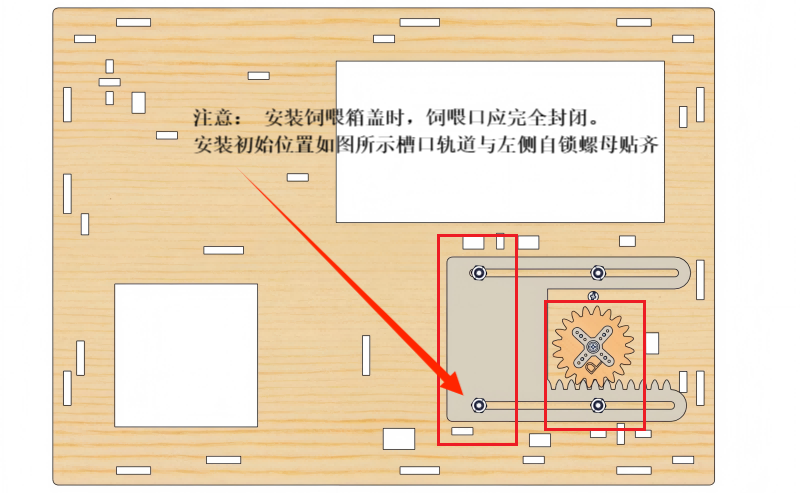

# 2. 智能农场组装

接下来开始实物的安装，一共分为19个小步骤，可分为椴木板安装和ESP32主控板接线两大类，还请拿出100%的精神，集中注意力，尽情享受动手创造的快乐吧！

## 步骤 1 : 安装ESP32主控板和继电器模块

1.1 

所需零件

1.2

1.3

1.4

1.5

## 步骤 2 : 安装电池盒固定框架和饲养盒舱

2.1

所需零件

2.2

2.3

2.4

2.5

2.6

2.7

2.8

## 步骤 3 : 安装农场的下部结构

3.1

所需零件

3.2

3.3

3.4

3.5

3.6

3.7

3.8

3.9

3.10

3.11

## 步骤 4 : 安装饲养盒舱门

4.1 

所需零件

4.2

**亚克力板单独包装，建议将其保护膜撕下，以减少作为饲养盒舱门移动时的摩擦**。

4.3

4.4

4.5

**注意：安装好舵机后需将舵机线从15号孔穿入** 。

4.6

如果是安装 M1.4*6MM自攻螺钉，如下图所示：

4.7

4.8

4.9

4.10

**注意：此步骤需要进行舵机角度的校准，按图示操作**。

**特别提醒：** 这里需要使用到2根公对母杜邦线将舵机控制模块的G引脚和5V引脚分别连接到ESP32主控板上的GND引脚和5V引脚，舵机的黄线、红线和棕线分别连接到舵机控制模块的S引脚、V引脚和G引脚。如下图所示：

**按图示完成舵机的校准后，请将所接线拆除，无需保留**。

4.11

4.12

4.13

**检查：**

(1) 亚克力板与舵机的齿轮结构是否有良好的接触和受力点。

(2) 舵机的齿轮结构上的固定螺钉的尖端是否卡在舵机的塑料外壳上。如果是，请将固定螺钉稍微松开，以免其尖端接触舵机。

## 步骤 5 : 安装LCD1602模块和XHT11传感器

5.1

所需零件

⚠️ **特别提醒：** 在I2C LCD1602模块的背面有一个**金属电位器**。你可以用一字螺丝刀转动电位器来调整屏幕清晰度。当你旋转电位器时，屏幕将变得更亮或更暗，适当的角度将使字体更清晰。清晰度在顺时针方向上增加，在逆时针方向上减少。

5.2

5.3

5.4

5.5

5.6

**此步骤需要使用3P线材和4P线材连接传感器和模块** 

|     模块     |            线材            |
| :----------: | :------------------------: |
|XHT11温湿度传感器 |        3P--150mm         |
|  LCD1602模块    | 4P--连拼 （**黑红白棕**） |

**接线时，请注意区分线材颜色，端口正反面，请勿反插，否则会损坏端口；XHT11温湿度传感器的S引脚接黄线，V引脚接红线，G引脚接黑线**。

**接完XHT11温湿度传感器后将线材穿入20号孔**。

5.7

**接线时，请注意区分线材颜色、端口正反面，请勿反插，否则会损坏端口；LCD1602模块的GND引脚接黑线，VCC引脚接红线，SDA引脚接白线，SCL引脚接棕线**。

## 步骤 6 : 安装超声波传感器

6.1

所需零件

6.2

6.3

6.4

**此步骤需要使用 4P--连拼转母单（**黑绿蓝红**）连接传感器** 

|     模块     |            线材            |
| :----------: | :------------------------: |
| 超声波传感器 |4P--连拼转母单（**黑绿蓝红**） |

**接线时，请注意区分线材颜色，传感器的Vcc引脚接红线，Trig引脚接蓝线，Echo引脚接绿线，Gnd引脚接黑线**。

## 步骤 7 : 安装房子的墙壁

7.1

所需零件

7.2

7.3

## 步骤 8 : 安装水滴传感器、光敏传感器和电机模块(风扇)

8.1

所需零件

8.2

8.3

8.4

8.5

8.6

**此步骤需要使用杜邦线3P线材和4P线材连接传感器和模块**。 

|    模块    |           线材           |
| :--------: | :----------------------: |
|电机模块(风扇)|  4P--母单 (**黑红白棕**) |
|  水滴传感器  |       3P--150mm         |
|  光敏传感器  |       3P--150mm         |

**接线时，请注意区分线材颜色、端口正反面，请勿反插，否则会损坏端口**。

**接完电机模块后将线材穿入30号孔**。

## 步骤 9 : 安装房子的屋顶

9.1

所需零件

9.2

9.3

9.4

**屋顶安装完成后，将水滴传感器的线材穿入26号孔、光敏传感器的线材穿入27号孔**。

## 步骤 10 : 安装房屋和地面

10.1

所需零件

10.2

10.3

10.4

10.5

10.6

**将所有线材穿出底部**。

## 步骤 11 : 给房子配线材

11.1

**请按照下方顺序进行接线，接线材时，请注意区分线材的颜色**。

| 编号 |      元器件       |          线材          |       ESP32主板引脚        |
| :--: | :---------------: | :--------------------: | :------------------------: |
|  1   |  电机模块(风扇)   |   4P--母单(黑红白棕)     | io18(IN-)   \|   io19(IN+) |
|  2   |   智能语音模块    |   4P--母单(黑红白棕)     |   io23(RXD) \| io5(TXD)    |
|  3   |   超声波传感器    | 4P--连拼转母单(黑绿蓝红)  |  io12(Trig)  \| io13(Echo)   |
|  4   |     LED模块      |     3P--200mm         |            io27            |
|  5   |    无源蜂鸣器     |      3P--200mm        |            io16            |
|  6   | XHT11温湿度传感器 |      3P--150mm        |            io17            |
|  7   |    继电器模块     |      3P--200mm        |            io25            |
|  8   |    继电器水泵     |    1P--红色公对公杜邦线    |                            |
|  9   |       舵 机       |                        |            io26            |
|  10  |      LCD1602      |   4P--连拼(黑红白棕)   | I2C(SDA(SDA) \| SCL(SCL))  |
|  11  |    水滴传感器     |       3P--150mm        |            io35            |
|  12  |    光敏传感器     |       3P--150mm        |            io34            |
|  13  |    水位传感器     |       3P--250mm        |            io33            |
|  14  |  土壤湿度传感器   |       3P--200mm        |            io32            |

11.2

**按图示将线材接到ESP32主控板的 io18(IN-) \| io19(IN+)**。

|     模块    |            线材           |       ESP32主控板引脚     |
| :----------: | :---------------------: | :----------------------: |
| 电机模块(风扇)|  4P--母单(**黑红白棕**)  |  io18(IN-) \| io19(IN+)  |

**接线时，请注意区分线材颜色，端口正反面，请勿反插，否则损坏端口；V通过红线接V，G通过黑线接G，IN+通过白线接io19，IN-接通过棕线接io18**。

| 模块 | 线材颜色 | ESP32主控板引脚 |
| :--: | :--: | :--: |
| V | 红线 | V |
| G | 黑线 | G |
| IN+ | 白线 | io19 |
| IN- | 棕线 | io18 |

11.3

**按图示将线材接到ESP32主控板的 io23(RXD) \| io5(TXD)**。

|     模块     |          线材          |     ESP32主控板引脚    |
| :----------: | :--------------------: | :------------------: |
| 智能语音模块 | 4P--母单(**黑红白棕**) | io23(RXD) \| io5(TXD) |

**此步骤需要使用 4P--母单(黑红白棕) 线材**。

**接线时先将 4P--母单(黑红白棕) 线材的一头从43号孔穿入，再接到ESP32主控板，另一头端口与智能语音模块连接**。

**接线时，请注意区分线材颜色，V通过红线接V，G通过黑线接G，TXD通过白线接io5，RXD接通过棕线接io23**。

| 模块 | 线材颜色 | ESP32主控板引脚 |
| :--: | :--: | :--: |
| V | 红线 | V |
| G | 黑线 | G |
| TXD | 白线 | io5 |
| RXD | 棕线 | io23 |

11.4

**按图示将线材接到ESP32开发板的 io12(Trig)  \| io13(Echo)**。

|     模块     |      线材       |       ESP32主板引脚        |
| :----------: | :-------------: | :----------------------: |
| 超声波传感器 | 4P--连拼转母单(黑绿蓝红) | io12(Trig)  \| io13(Echo) |

**接线时，请注意区分线材的颜色，Vcc通过红线接V，Gnd通过黑线接G，Trig通过蓝线接io12，Echo通过绿线接io13**。

| 模块 | 线材颜色 | ESP32主控板引脚 |
| :--: | :--: | :--: |
| Vcc | 红线 | V |
| Gnd | 黑线 | G |
| Trig | 蓝线 | io12 |
| Echo | 绿线 | io13 |

11.5

**按图示将线材接到开发板的io27**。

| 模块 |  线材 | ESP32主控板引脚 |
| :--: | :------: | :--: |
| LED  | 3P--200mm | io27 |

**此步骤需要使用 3P-200mm 线材**。

**接线时先将 3P-200mm 线材的一头从7号孔穿入，再接到ESP32主控板，另一头端口与LED模块连接**。

**接线时，请注意区分线材的颜色，V通过红线接V，G通过黑线接G，S通过黄线接io27**。

| 模块 | 线材颜色 | ESP32主控板引脚 |
| :--: | :--: | :--: |
| V | 红线 | V |
| G | 黑线 | G |
| S | 黄线 | io27 |

11.6

**按图示将线材接到ESP32主控板的io16**。

|    模块    |   线材   | ESP32主控板引脚 |
| :--------: | :------: | :---------: |
| 无源蜂鸣器 | 3P--200mcm |    io16     |

**此步骤需要使用 3P-200mm 线材**

**接线时先将 3P-200mm 线材的一头从17号孔穿入，再接到ESP32主控板，另一头端口与无源蜂鸣器模块连接**。

**接线时，请注意区分线材的颜色，V通过红线接V，G通过黑线接G，S通过黄线接io16**。

| 模块 | 线材颜色 | ESP32主控板引脚 |
| :--: | :--: | :--: |
| V | 红线 | V |
| G | 黑线 | G |
| S | 黄线 | io16 |

11.7

**按图示将线材接到ESP32主控板的io17**。

|       模块        |   线材   | ESP32主控板引脚 |
| :---------------: | :------: | :---------: |
| XHT11温湿度传感器 | 3P--150mm |    io17     |

**接线时，请注意区分线材的颜色，V通过红线接V，G通过黑线接G，S通过黄线接io17**。

| 模块 | 线材颜色 | ESP32主控板引脚 |
| :--: | :--: | :--: |
| V | 红线 | V |
| G | 黑线 | G |
| S | 黄线 | io17 |

11.8

**按图示将线材接到ESP32主控板的io25**。

|    模块    | 线材颜色  | ESP32主控板引脚 |
| :--------: | :------: | :---------: |
| 继电器模块 | 3P--200mm |    io25     |

**此步骤需要使用 3P--200mm 线材**。

**接线时，请注意区分线材的颜色，V通过红线接V，G通过黑线接G，S通过黄线接io25**。

| 模块 | 线材 | ESP32主控板引脚 |
| :--: | :--: | :--: |
| V | 红线 | V |
| G | 黑线 | G |
| S | 黄线 | io25 |

11.9

**按图示将线材接到ESP32开发板**。

|    模块    |        线材        |              ESP32主板引脚              |
| :--------: | :----------------: | :-----------------------------------: |
| 继电器水泵 |1P--红色公对公杜邦线 | 一端接ESP32主板的3V3引脚 \| 另一端接继电器上的NO接口 |

**此步骤需要使用 1P--红色公对公杜邦线 线材**。

**将水泵的线材从40号孔穿入**。

**接线时，请注意区分线材的颜色**。

​	

11.10

**按图示将线材接到ESP32主控板的io26**。

| 模块  | 线材 | ESP32主控板引脚 |
| :---: | :--: | :---------: |
| 舵 机 |      |    io26     |

**接线时，请注意区分线材的颜色，棕线接G，红线接V，黄线接**。

| 模块 | 线材颜色 | ESP32主控板引脚 |
| :--: | :--: | :--: |
| 棕线 |      |   G   |
| 红线 |      |   V   |
|橙黄线 |      |  io26 |

11.11

**按图示将线材接到ESP32主控板的 BUS I2C**

|  模块   |          线材          | ESP32主控板引脚 |
| :-----: | :--------------------: | :---------: |
| LCD1602 |   4P--连拼(黑红白棕)    |   BUS I2C   |

**接线时，请注意区分线材的颜色，VCC通过红线接V，GND通过黑线接GND，SDA通过白线接SDA，SCL通过棕线接SCL**。

| 模块 | 线材颜色 | ESP32主控板引脚 |
| :--: | :--: | :--: |
| VCC | 红线 | V |
| GND| 黑线 | GND |
| SDA | 白线 | SDA |
| SCL | 棕线 | SCL |

11.12

**按图示将线材接到ESP32主控板的io35**

|    模块    |   线材   | ESP32主控板引脚 |
| :--------: | :------: | :---------: |
| 水滴传感器 | 3P--150mm |    io35     |

**接线时，请注意区分线材的颜色，V通过红线接V，G通过黑线接G，S通过黄线接io35**。

| 模块 | 线材颜色 | ESP32主控板引脚 |
| :--: | :--: | :--: |
| V | 红线 | V |
| G | 黑线 | G |
| S | 黄线 | io35 |

11.13

**按图示将线材接ESP32主控板的io34**。

|    模块    |   线材   | ESP32主控板引脚 |
| :--------: | :------: | :---------: |
| 光敏传感器 | 3P--150mm |    io34     |

**接线时，请注意区分线材的颜色，V通过红线接V，G通过黑线接G，S通过黄线接io34**。

| 模块 | 线材颜色 | ESP32主控板 |
| :--: | :--: | :--: |
| V | 红线 | V |
| G | 黑线 | G |
| S | 黄线 | io34 |

11.14

**按图示将线线接到ESP32主控板的io33**。

|    模块    |   线材   | ESP32主控板引脚 |
| :--------: | :------: | :---------: |
| 水位传感器 | 3P--250mm |    io33     |

**此步骤需要使用 3P-250mm 线材**。

**接线时先将 3P-250mm 线材的一头从13号孔穿入，再接到ESP32主控板，另一头端口与水位传感器模块连接**。

**接线时，请注意区分线材的颜色，VCC通过红线接V，GND通过黑线接G，S通过黄线接io33**。

| 模块 | 线材颜色 | ESP32主控板引脚 |
| :--: | :--: | :--: |
| VCC | 红线 | V |
| GND | 黑线 | G |
| S | 黄线 | io33 |

11.15

**按图示将线材接到ESP32主控板的io32**。

|    模块    |   线材   | ESP32主控板引脚 |
| :--------: | :------: | :---------: |
| 土壤湿度传感器 | 3P--200mm |    io32     |

**此步骤需要使用 3P-200mm 线材**。

**接线时先将 3P-200mm 线材的一头从11号孔穿入，再接到ESP32主控板，另一头端口与土壤传感器模块连接**。

**接线时，请注意区分线材的颜色，VCC通过红线接V，GND通过黑线接G，S通过黄线接io32**。

| 模块 | 线材颜色 | ESP32主控板引脚 |
| :--: | :--: | :--: |
| VCC | 红线 | V |
| GND | 黑线 | G |
| S | 黄线 | io32 |

⚠️ **提醒：** 上述传感器模块接好线材之后，开始进行下面的安装部分。

## 步骤 12 : 安装房屋和地基

12.1

所需零件

12.2

12.3

12.4

12.5

12.6

## 步骤 13 : 安装塑料水槽

13.1

所需零件

13.2

13.3

## 步骤 14 : 安装土壤湿度传感器、水位传感器和水泵

14.1

所需零件

⚠️ **特别提醒：这里安装土壤湿度传感器、水位传感器和水泵时，连接到土壤湿度传感器、水位传感器和水泵的线材不需要拔下来的。**

14.2

14.3

14.4

14.5

14.6

14.7

14.8

## 步骤 15 : 安装护栏

15.1

所需零件

15.2

15.3

15.4

15.5

15.6

## 步骤 16 : 安装蜂鸣器、语音模块和LED模块

16.1

所需零件

⚠️ **特别提醒：这里安装无源蜂鸣器、智能语音模块和LED模块时，连接到无源蜂鸣器、智能语音模块和LED模块的线材不需要拔下来。**

16.2

16.3

16.4

16.5

16.6

16.7

16.8

16.9

## 步骤 17 : 装饰房屋

17.1

所需零件

17.2

17.3

## 步骤 18 : 安装太阳能电池板

18.1

所需零件

⚠️ **特别提醒：将大阳能板粘贴在木板上。**

18.2

**将LED灯插入至23号孔后，使用标签贴固定好线材**

18.3

## 步骤 19 : 安装电池盒

19.1

所需零件

19.2

19.3

19.4

**组装完成!**

